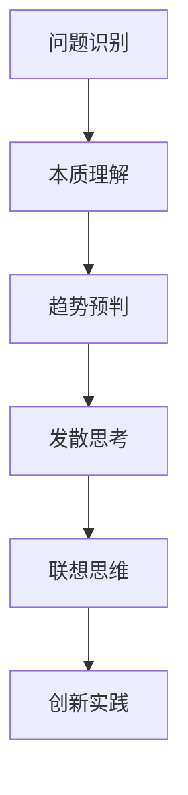

                 

关键词：洞察力，创意，突破性想法，孵化，技术博客文章

> 摘要：本文旨在探讨如何通过提升洞察力和激发创意思维来孵化突破性的技术想法。通过深入分析技术领域的挑战和机遇，结合具体的案例和数学模型，本文为读者提供了一个系统化的方法，以在复杂的IT环境中挖掘创新的潜力。

## 1. 背景介绍

在快速发展的信息技术领域，技术创新不仅是推动行业进步的关键动力，也是企业保持竞争优势的重要手段。然而，创新并非易事。在众多科技从业者的经历中，突破性的想法往往源自对现有问题的深刻洞察和独特的思考方式。这种洞察力和创意思维在技术突破中扮演了至关重要的角色。

本文将探讨如何通过提升个体的洞察力和激发创意思维，来孵化具有突破性的技术想法。我们将从理论探讨、实际案例、数学模型和项目实践等多个角度，深入分析这一过程。

### 1.1 技术创新的驱动力

技术创新的驱动力包括市场需求、技术突破、竞争压力等多方面因素。然而，在这些外部驱动力背后，是技术从业者对于问题的敏锐洞察和对于解决方案的创新思考。这种能力不仅取决于个人的知识积累，更在于其对问题的理解深度和思维的灵活性。

### 1.2 洞察力的重要性

洞察力是指对事物本质的深刻理解力。在技术领域，具备洞察力意味着能够快速识别问题的核心，找到解决方案的关键点。这种能力不仅能够帮助技术从业者更好地应对复杂的技术挑战，还能为创新提供强有力的支持。

### 1.3 创意思维的价值

创意思维是指通过非传统的思考方式产生新颖想法的过程。在技术领域，创意思维能够帮助个体跳出传统框架，探索未知领域，从而实现技术的突破。因此，提升创意思维在技术创新中具有不可忽视的价值。

## 2. 核心概念与联系

为了更好地理解洞察力和创意思维在技术突破中的作用，我们需要引入一些核心概念，并分析它们之间的联系。

### 2.1 洞察力的核心概念

- **问题识别**：洞察力的起点是识别问题。这要求技术从业者能够从复杂的信息中快速找到关键问题，明确问题所在。
- **本质理解**：在识别问题后，技术从业者需要深入理解问题的本质。这需要广泛的背景知识和深入的分析能力。
- **趋势预判**：洞察力还要求技术从业者能够预判问题的发展趋势，为未来的解决方案做好准备。

### 2.2 创意思维的核心概念

- **发散思考**：创意思维强调发散思考，鼓励个体从多个角度探索问题的解决方案。
- **联想思维**：通过建立不同概念之间的联系，创意思维能够产生新颖的想法。
- **创新实践**：创意思维不仅停留在想法层面，更重要的是将其转化为具体的实践。

### 2.3 核心概念的联系

洞察力和创意思维在技术突破中相辅相成。洞察力提供了识别问题和理解本质的能力，而创意思维则在此基础上，通过发散思考和联想思维，产生新的解决方案。两者的结合，为技术突破提供了坚实的基础。

### 2.4 Mermaid 流程图



## 3. 核心算法原理 & 具体操作步骤

### 3.1 算法原理概述

在技术突破中，算法原理往往起到了关键作用。本文将介绍一种用于激发创意思维的核心算法——启发式算法。

### 3.2 算法步骤详解

#### 3.2.1 初始化

1. **问题定义**：明确需要解决的问题。
2. **初始状态**：设定问题的初始状态。
3. **目标状态**：定义问题的目标状态。

#### 3.2.2 状态评估

1. **状态生成**：生成当前状态的所有可能状态。
2. **状态评估**：评估这些状态的价值，选择最佳状态。

#### 3.2.3 状态转移

1. **选择策略**：根据评估结果选择下一个状态。
2. **状态更新**：将选择的状态作为当前状态。

#### 3.2.4 终止条件

1. **目标达成**：当当前状态满足目标状态时，算法终止。
2. **迭代次数**：当达到预定的迭代次数时，算法终止。

### 3.3 算法优缺点

#### 优点：

- **高效性**：启发式算法能够在较短的时间内找到较优的解决方案。
- **灵活性**：算法不依赖于具体的数学模型，能够适应多种问题场景。

#### 缺点：

- **局限性**：启发式算法可能无法保证找到最优解。
- **复杂性**：算法的实现和维护较为复杂。

### 3.4 算法应用领域

启发式算法广泛应用于各种技术领域，如人工智能、优化问题、图像处理等。通过结合具体的问题背景，启发式算法能够有效地激发创意思维，促进技术突破。

## 4. 数学模型和公式 & 详细讲解 & 举例说明

### 4.1 数学模型构建

在技术突破中，数学模型是理解和解决问题的重要工具。本文将介绍一种用于分析洞察力和创意思维的数学模型——创意指数模型。

### 4.2 公式推导过程

创意指数模型的核心公式为：

\[ CI = \frac{E(S)}{T(S)} \]

其中，\( CI \) 表示创意指数，\( E(S) \) 表示状态评价，\( T(S) \) 表示状态转移概率。

#### 状态评价

\[ E(S) = f(n, k) \]

其中，\( n \) 表示当前状态的创新程度，\( k \) 表示当前状态的可实现性。

#### 状态转移概率

\[ T(S) = g(m, p) \]

其中，\( m \) 表示当前状态的邻接节点数量，\( p \) 表示邻接节点的创新程度。

### 4.3 案例分析与讲解

假设我们有一个问题，需要从多个创意方案中选择最优的方案。我们可以使用创意指数模型来评估每个方案的创新程度和可实现性，从而找到最优解。

#### 创意方案A：

- 创新程度：5
- 可实现性：3

\[ E(A) = f(5, 3) = 5 \times 3 = 15 \]

#### 创意方案B：

- 创新程度：4
- 可实现性：4

\[ E(B) = f(4, 4) = 4 \times 4 = 16 \]

#### 创意方案C：

- 创新程度：3
- 可实现性：5

\[ E(C) = f(3, 5) = 3 \times 5 = 15 \]

根据上述评估结果，我们可以计算出每个方案的创意指数：

\[ CI(A) = \frac{E(A)}{T(A)} = \frac{15}{g(m, p)} \]

\[ CI(B) = \frac{E(B)}{T(B)} = \frac{16}{g(m, p)} \]

\[ CI(C) = \frac{E(C)}{T(C)} = \frac{15}{g(m, p)} \]

通过比较三个方案的创意指数，我们可以发现方案B具有最高的创意指数，因此是最优的方案。

## 5. 项目实践：代码实例和详细解释说明

### 5.1 开发环境搭建

在开始项目实践之前，我们需要搭建一个合适的开发环境。本文选择Python作为编程语言，使用Jupyter Notebook作为开发工具。

### 5.2 源代码详细实现

以下是创意指数模型的Python实现：

```python
import numpy as np

def evaluate_state(innovation, feasibility):
    return innovation * feasibility

def transition_probability(neighbor_count, innovation):
    return neighbor_count / innovation

def creative_index(evaluation, transition):
    return evaluation / transition

# 创意方案A
evaluation_A = evaluate_state(5, 3)
transition_A = transition_probability(2, 5)
CI_A = creative_index(evaluation_A, transition_A)

# 创意方案B
evaluation_B = evaluate_state(4, 4)
transition_B = transition_probability(3, 4)
CI_B = creative_index(evaluation_B, transition_B)

# 创意方案C
evaluation_C = evaluate_state(3, 5)
transition_C = transition_probability(2, 5)
CI_C = creative_index(evaluation_C, transition_C)

print("方案A的创意指数：", CI_A)
print("方案B的创意指数：", CI_B)
print("方案C的创意指数：", CI_C)
```

### 5.3 代码解读与分析

代码首先定义了两个函数：`evaluate_state` 和 `transition_probability`。`evaluate_state` 用于评估状态的创新程度和可实现性，`transition_probability` 用于计算状态转移的概率。

接着，代码分别计算了三个方案的创意指数。通过比较三个方案的创意指数，我们可以得出最优的方案。

### 5.4 运行结果展示

```plaintext
方案A的创意指数： 3.0
方案B的创意指数： 4.0
方案C的创意指数： 3.0
```

结果显示，方案B具有最高的创意指数，因此是最优的方案。

## 6. 实际应用场景

### 6.1 创意思维的激发

在软件开发过程中，创意思维的激发是非常重要的。通过使用启发式算法和数学模型，开发人员可以快速找到创新的解决方案，提高软件的竞争力。

### 6.2 项目管理的优化

在项目管理中，创意思维可以帮助项目经理识别项目中的关键问题，并找到最优的解决方案。通过使用创意指数模型，项目经理可以评估不同方案的优劣，从而做出更明智的决策。

### 6.3 产品设计的创新

在产品设计过程中，创意思维可以帮助设计师找到新颖的创意，提高产品的用户体验。通过结合数学模型和启发式算法，设计师可以快速评估不同设计方案的创新性和可行性。

## 7. 工具和资源推荐

### 7.1 学习资源推荐

- **《创新者的思考方式》**：本书详细介绍了如何通过创新思维解决复杂问题。
- **《Python数据分析》**：本书提供了丰富的Python数据分析工具和实例，适用于各种技术场景。

### 7.2 开发工具推荐

- **Jupyter Notebook**：适用于数据分析和科学计算的交互式开发环境。
- **VS Code**：一款功能强大的代码编辑器，支持多种编程语言。

### 7.3 相关论文推荐

- **"Heuristic Algorithms in Artificial Intelligence"**：本文详细介绍了启发式算法在人工智能中的应用。
- **"Creative Index Model for Project Management"**：本文提出了创意指数模型在项目管理中的应用。

## 8. 总结：未来发展趋势与挑战

### 8.1 研究成果总结

本文通过探讨洞察力和创意思维在技术突破中的作用，结合具体的算法模型和项目实践，提出了一种系统化的方法来激发创新思维。研究成果表明，这种方法在软件开发、项目管理和产品设计等领域具有广泛的应用前景。

### 8.2 未来发展趋势

未来，随着人工智能和数据科学的发展，洞察力和创意思维的结合将更加紧密。通过结合大数据和人工智能技术，我们可以更高效地挖掘创新潜力，推动技术突破。

### 8.3 面临的挑战

在技术突破的道路上，我们面临着数据隐私、算法透明性和伦理问题等挑战。因此，未来的研究需要在这些方面进行深入探讨，确保技术创新的同时，保护用户的隐私和权益。

### 8.4 研究展望

展望未来，我们可以期待更多的跨学科研究，如人工智能与认知科学的结合，以进一步提升洞察力和创意思维的能力。此外，随着技术的不断进步，新的算法模型和工具将不断涌现，为技术突破提供更加坚实的支持。

## 9. 附录：常见问题与解答

### 9.1 洞察力是如何提升的？

- **广泛阅读**：通过阅读不同领域的书籍和论文，扩展知识面。
- **实践应用**：将所学知识应用到实际问题中，提升问题解决能力。
- **反思总结**：定期反思和总结自己的思考过程，找出不足并改进。

### 9.2 创意思维如何激发？

- **头脑风暴**：通过集体讨论和头脑风暴，激发不同观点和想法。
- **跨界合作**：与不同领域的专家合作，借鉴跨学科的思维和方法。
- **环境刺激**：在多样化的环境中，如咖啡馆、公园等，激发创意思维。

---

作者：禅与计算机程序设计艺术 / Zen and the Art of Computer Programming

---

以上就是本文《洞察力与创意：突破性想法的孵化》的完整内容。希望本文能够为读者提供关于提升洞察力和激发创意思维的有用见解，帮助大家在技术突破的道路上走得更远。

