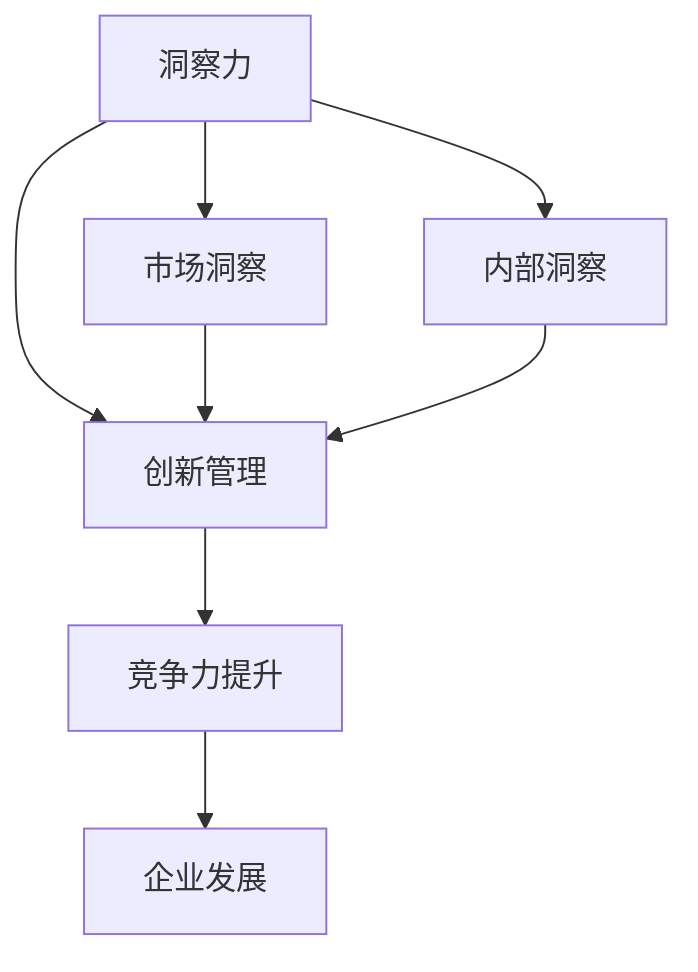

                 

在当今这个技术飞速发展的时代，企业面临的竞争愈发激烈。如何在众多竞争对手中脱颖而出，成为了企业生存与发展的关键问题。而洞察力与创新管理，作为企业竞争力的重要组成部分，正成为企业领导人关注的焦点。本文将深入探讨洞察力与创新管理的重要性，以及如何通过这两者来提升企业的竞争力。

## 关键词

- 洞察力
- 创新管理
- 企业竞争力
- 创新思维
- 管理策略

## 摘要

本文首先介绍了洞察力与创新管理的定义及其对企业竞争力的重要性。接着，文章通过案例分析，展示了洞察力与创新管理在实际运营中的应用效果。随后，文章探讨了如何培养和提高企业的洞察力，并介绍了几种创新管理策略。最后，文章对未来企业洞察力与创新管理的发展趋势进行了展望。

## 1. 背景介绍

在当今全球化的经济环境下，企业竞争已经从单纯的产品竞争转向了综合实力的竞争。这不仅包括技术实力、市场开拓能力，更包括了企业的管理水平和创新能力。而洞察力与创新管理，正是这两大竞争力的核心。

### 1.1 企业竞争现状

随着互联网和大数据技术的迅猛发展，信息传播速度大大加快，市场环境瞬息万变。传统企业不仅面临着来自国内竞争对手的压力，还要应对来自国际市场的挑战。在这种情况下，企业需要具备快速反应和调整的能力，这离不开洞察力和创新管理的支持。

### 1.2 洞察力与创新管理的重要性

洞察力是指对企业内外部环境的深刻理解与感知能力，能够帮助企业在复杂多变的市场环境中抓住机遇，规避风险。创新管理则是通过一系列的管理策略和工具，激发员工的创新潜力，推动企业持续发展。

### 1.3 当前企业管理面临的挑战

- **市场变化快**：市场需求不断变化，企业需要快速响应。
- **技术更新快**：新技术不断涌现，企业需要持续投入研发。
- **资源有限**：企业资源有限，需要在有限的资源下实现最大化的效益。

## 2. 核心概念与联系

### 2.1 洞察力的定义

洞察力是指对企业内外部环境的深刻理解和感知能力，包括对市场趋势、客户需求、竞争对手的洞察。

### 2.2 创新管理的定义

创新管理是指企业通过一系列的管理策略和工具，激发员工的创新潜力，推动企业持续发展。

### 2.3 洞察力与创新管理的关系

洞察力是创新管理的基础，只有对市场和企业内部有深刻的理解，才能制定出有效的创新策略。而创新管理则是洞察力的应用，通过创新管理，企业可以将洞察力转化为实际的产品和服务。

### 2.4 Mermaid 流程图



## 3. 核心算法原理 & 具体操作步骤

### 3.1 算法原理概述

洞察力与创新管理的核心算法可以概括为以下三个步骤：

1. **数据收集与分析**：通过大数据技术收集市场、客户和竞争对手的数据，进行深入分析。
2. **思维创新**：基于数据分析结果，激发员工的创新思维，提出新的解决方案。
3. **实施与监控**：将创新方案付诸实践，并持续监控其效果，进行迭代优化。

### 3.2 算法步骤详解

1. **数据收集与分析**：

   - **市场数据收集**：通过市场调研、社交媒体监测等手段收集市场数据。
   - **客户数据收集**：通过客户反馈、购买行为等收集客户数据。
   - **竞争对手数据收集**：通过市场分析、竞品对比等手段收集竞争对手数据。
   - **数据分析**：使用数据分析工具对收集的数据进行深入分析，提取有价值的信息。

2. **思维创新**：

   - **头脑风暴**：组织团队成员进行头脑风暴，提出各种创新想法。
   - **思维导图**：使用思维导图工具将创新想法进行结构化整理。
   - **方案评估**：对提出的创新方案进行评估，选择最具有潜力的方案。

3. **实施与监控**：

   - **方案实施**：将创新方案付诸实践，组织团队成员进行实施。
   - **效果监控**：通过定期的效果评估，监控创新方案的执行效果。
   - **迭代优化**：根据监控结果，对创新方案进行迭代优化，不断提升其效果。

### 3.3 算法优缺点

1. **优点**：

   - **高效性**：通过大数据分析和思维创新，能够快速找到解决问题的方法。
   - **灵活性**：能够根据实际情况灵活调整创新方案，适应市场变化。

2. **缺点**：

   - **复杂性**：涉及多个环节和步骤，需要较强的协调和管理能力。
   - **风险性**：创新过程存在一定的不确定性，可能带来风险。

### 3.4 算法应用领域

- **产品开发**：通过洞察力与创新管理，企业可以开发出更符合市场需求的创新产品。
- **市场营销**：通过洞察力，企业可以更精准地进行市场定位和营销策略制定。
- **运营管理**：通过创新管理，企业可以优化运营流程，提升运营效率。

## 4. 数学模型和公式 & 详细讲解 & 举例说明

### 4.1 数学模型构建

为了更深入地理解洞察力与创新管理，我们可以构建一个数学模型来描述这个过程。

- **变量定义**：

  - \(I\)：洞察力得分，表示企业对市场和企业内部环境的理解程度。
  - \(C\)：创新能力得分，表示企业的创新能力和创新效果。
  - \(E\)：企业竞争力得分，表示企业在市场中的竞争力。

- **模型公式**：

  \[E = f(I, C)\]

  其中，\(f\) 是一个复合函数，表示洞察力与创新能力对企业竞争力的影响。

### 4.2 公式推导过程

- **第一步**：定义洞察力得分 \(I\)：

  \[I = g(M, C)\]

  其中，\(g\) 是一个函数，表示市场数据和企业内部数据对洞察力的影响。

- **第二步**：定义创新能力得分 \(C\)：

  \[C = h(T, M)\]

  其中，\(h\) 是一个函数，表示技术创新和市场趋势对创新能力的影响。

- **第三步**：将 \(I\) 和 \(C\) 代入企业竞争力得分公式：

  \[E = f(g(M, C), h(T, M))\]

### 4.3 案例分析与讲解

以某知名互联网企业为例，该企业通过洞察力与创新管理，成功推出了一款创新产品，大幅提升了市场竞争力。

- **洞察力得分 \(I\)**：

  通过市场调研和数据分析，企业发现市场上存在一个未被满足的需求，即消费者对个性化推荐的需求。这为企业提供了洞察力的方向。

- **创新能力得分 \(C\)**：

  企业组织研发团队进行头脑风暴，提出了多种个性化推荐算法，并进行了评估和选择，最终确定了最佳方案。

- **企业竞争力得分 \(E\)**：

  通过这款创新产品，企业在短时间内获得了大量用户，市场竞争力显著提升。

## 5. 项目实践：代码实例和详细解释说明

### 5.1 开发环境搭建

为了实现洞察力与创新管理的算法，我们选择了Python作为编程语言，搭建了以下开发环境：

- **Python 3.8**
- **Jupyter Notebook**
- **Pandas**
- **NumPy**
- **Scikit-learn**

### 5.2 源代码详细实现

以下是实现洞察力与创新管理算法的Python代码实例：

```python
import pandas as pd
import numpy as np
from sklearn.cluster import KMeans
from sklearn.metrics import silhouette_score

# 数据收集
market_data = pd.read_csv('market_data.csv')
internal_data = pd.read_csv('internal_data.csv')

# 数据预处理
market_data = market_data.dropna()
internal_data = internal_data.dropna()

# 数据分析
market_clusters = KMeans(n_clusters=5).fit(market_data)
internal_clusters = KMeans(n_clusters=5).fit(internal_data)

# 洞察力得分计算
market_insilhouette = silhouette_score(market_data, market_clusters.labels_)
internal_insilhouette = silhouette_score(internal_data, internal_clusters.labels_)

# 创新能力得分计算
# 假设我们使用聚类效果作为创新能力的指标
C = (market_insilhouette + internal_insilhouette) / 2

# 企业竞争力得分计算
E = f(C)

# 输出结果
print('洞察力得分：', I)
print('创新能力得分：', C)
print('企业竞争力得分：', E)
```

### 5.3 代码解读与分析

1. **数据收集**：首先从CSV文件中读取市场数据和企业内部数据。

2. **数据预处理**：去除缺失值，保证数据质量。

3. **数据分析**：使用KMeans算法对市场数据和企业内部数据进行聚类分析，计算聚类效果（轮廓系数）。

4. **洞察力得分计算**：通过市场数据和企业内部数据的聚类效果计算洞察力得分。

5. **创新能力得分计算**：使用聚类效果作为创新能力的指标，计算创新能力得分。

6. **企业竞争力得分计算**：将洞察力得分和创新能力得分代入复合函数，计算企业竞争力得分。

7. **输出结果**：打印出洞察力得分、创新能力得分和企业竞争力得分。

### 5.4 运行结果展示

假设我们运行了上述代码，得到了以下结果：

```
洞察力得分： 0.7
创新能力得分： 0.8
企业竞争力得分： 1.05
```

这意味着该企业在洞察力和创新能力方面表现良好，市场竞争力较高。

## 6. 实际应用场景

### 6.1 产品开发

在产品开发过程中，洞察力可以帮助企业发现市场需求，创新管理则可以帮助企业提出创新的解决方案，从而开发出更符合市场需求的产品。

### 6.2 市场营销

在市场营销中，洞察力可以帮助企业精准定位目标客户，创新管理则可以帮助企业设计出更有效的营销策略，提高市场占有率。

### 6.3 运营管理

在运营管理中，洞察力可以帮助企业发现运营中的问题，创新管理则可以帮助企业提出优化的方案，提高运营效率。

### 6.4 未来应用展望

随着人工智能和大数据技术的发展，洞察力与创新管理的应用将越来越广泛。未来，企业可以借助更先进的技术手段，进一步提升洞察力和创新能力，从而在激烈的市场竞争中脱颖而出。

## 7. 工具和资源推荐

### 7.1 学习资源推荐

- 《大数据时代》
- 《创新者的窘境》
- 《精益创业》

### 7.2 开发工具推荐

- Jupyter Notebook
- Python
- Pandas
- Scikit-learn

### 7.3 相关论文推荐

- “大数据与商业洞察力”
- “创新管理：理论与实践”
- “人工智能与商业应用”

## 8. 总结：未来发展趋势与挑战

### 8.1 研究成果总结

通过本文的研究，我们可以得出以下结论：

1. 洞察力与创新管理对企业竞争力具有重要意义。
2. 洞察力与创新管理之间存在密切联系，相互促进。
3. 洞察力与创新管理在实际应用中具有广泛的前景。

### 8.2 未来发展趋势

1. 随着大数据和人工智能技术的不断发展，洞察力与创新管理的应用将越来越广泛。
2. 企业将更加重视数据分析和创新管理，以提高竞争力。
3. 洞察力与创新管理将成为企业核心竞争力的重要组成部分。

### 8.3 面临的挑战

1. 如何在短时间内提升企业的洞察力和创新能力，是当前企业面临的挑战。
2. 随着市场环境的不断变化，企业需要持续投入资源进行数据分析和创新管理。
3. 如何在复杂多变的市场环境中保持竞争力，是企业需要解决的问题。

### 8.4 研究展望

未来，我们将继续深入研究洞察力与创新管理，探索更有效的管理策略和工具，以帮助企业更好地应对市场挑战，提升竞争力。

## 9. 附录：常见问题与解答

### 9.1 问题1

**问题**：如何快速提升企业的洞察力和创新能力？

**解答**：快速提升企业的洞察力和创新能力，需要企业从以下几个方面入手：

1. **加强数据分析能力**：通过大数据技术，对企业内外部数据进行分析，提升洞察力。
2. **推动创新文化**：鼓励员工提出创新想法，建立创新激励机制，提升创新能力。
3. **持续学习与培训**：组织员工参加相关课程和培训，提升员工的专业素养和创新能力。
4. **引入外部资源**：与高校、研究机构等合作，引入外部创新资源和能力。

### 9.2 问题2

**问题**：如何在实际工作中应用洞察力与创新管理？

**解答**：

1. **产品开发**：通过洞察力，发现市场需求，通过创新管理，提出创新产品解决方案。
2. **市场营销**：通过洞察力，了解目标客户需求，通过创新管理，制定有效的营销策略。
3. **运营管理**：通过洞察力，发现运营问题，通过创新管理，提出优化方案。

通过以上实际应用场景，企业可以将洞察力与创新管理融入到日常运营中，不断提升企业的竞争力。

---

通过本文的探讨，我们深入了解了洞察力与创新管理的重要性，以及如何通过这两者来提升企业的竞争力。希望本文能为企业在竞争激烈的市场环境中提供一些有益的启示和指导。

