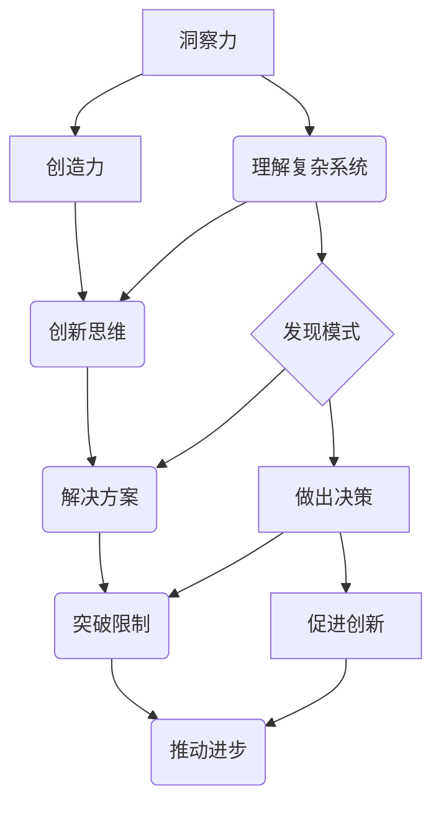

                 

关键词：洞察力、创造力、思维模式、人工智能、认知科学、技术发展

> 摘要：本文旨在探讨人类思维中的两大核心能力——洞察力和创造力，如何相互作用并推动技术进步。通过分析当前人工智能和认知科学研究，我们揭示了这两种思维模式在理解复杂系统和解决问题方面的关键作用，以及它们如何在未来继续塑造技术发展。

## 1. 背景介绍

在当今快速发展的技术时代，人类思维的两个方面——洞察力和创造力——显得尤为重要。洞察力指的是观察和理解复杂系统或现象的能力，而创造力则是产生新颖想法和解决方案的能力。这两个方面不仅在日常生活中发挥着至关重要的作用，还在科技领域中推动着创新和发展。

人工智能（AI）和认知科学是两个与人类思维紧密相关的领域。人工智能通过模拟人类的思维方式来解决问题，而认知科学则致力于研究人类大脑如何处理信息和产生思维。随着AI和认知科学的不断进步，我们逐渐认识到洞察力和创造力在人类思维中的核心地位。

本文将首先介绍洞察力和创造力的基本概念，然后探讨它们在AI和认知科学中的重要性。接着，我们将深入分析这两个思维模式在技术发展中的应用，并探讨未来的发展趋势和面临的挑战。

## 2. 核心概念与联系

### 2.1 洞察力

洞察力是一种深度理解复杂系统或现象的能力。它不仅涉及到对现象的观察，还包括对事物之间关系的理解。洞察力使得人类能够从大量信息中提取关键信息，发现规律和模式，从而做出明智的决策。

在技术领域中，洞察力对于理解复杂系统至关重要。例如，在软件开发中，洞察力可以帮助开发者理解系统的架构和运行机制，从而设计出更加高效和稳定的软件。在人工智能领域，洞察力对于理解数据分布和模式识别具有重要意义，从而提升AI模型的准确性和效率。

### 2.2 创造力

创造力是指产生新颖想法和解决方案的能力。它不仅涉及到创造性思维，还包括对已有知识的重新组合和创新应用。创造力在技术领域中同样发挥着关键作用，它推动着技术的突破和进步。

在人工智能领域，创造力体现在算法的创新和模型的设计上。例如，深度学习算法的出现极大地推动了计算机视觉和自然语言处理的发展。在软件开发中，创造力可以帮助开发者设计出更加用户友好和高效的软件界面。

### 2.3 洞察力与创造力的关系

洞察力和创造力并非独立存在，而是相互关联、相互促进的。洞察力为创造力提供了基础，通过深入理解复杂系统，人们能够发现新的问题和挑战，从而激发创造力。创造力则为洞察力提供了方向，通过创新思维和解决方案，人们能够更好地理解和应对复杂系统。

在技术发展中，洞察力和创造力的结合使得人类能够不断突破现有的限制，推动技术的进步。例如，在互联网和移动通信领域，洞察力帮助人们理解用户需求和行为模式，而创造力则推动了社交媒体和移动应用的快速发展。

### 2.4 Mermaid 流程图



## 3. 核心算法原理 & 具体操作步骤

### 3.1 算法原理概述

在人工智能和认知科学中，许多算法都是基于洞察力和创造力的原理设计的。以下是一个核心算法的概述：

**深度学习算法**：深度学习是一种通过多层神经网络模拟人类大脑思维方式的人工智能技术。它利用大量的数据通过反向传播算法不断调整网络权重，从而实现对复杂函数的学习和预测。

### 3.2 算法步骤详解

1. **数据收集与预处理**：收集大量的数据并对其进行预处理，如归一化、去噪等，以确保数据的质量和一致性。

2. **构建神经网络模型**：设计一个多层神经网络模型，包括输入层、隐藏层和输出层。通过选择合适的激活函数和损失函数，模型能够学习到输入数据与输出数据之间的关系。

3. **训练模型**：使用反向传播算法对模型进行训练。在训练过程中，模型通过不断调整权重和偏置来最小化损失函数，从而提高模型的准确性。

4. **评估与优化**：评估模型的性能，并通过调整超参数和结构来优化模型。这通常涉及到交叉验证和超参数调优技术。

### 3.3 算法优缺点

**优点**：
- **高效性**：深度学习算法能够处理大规模数据和复杂任务，具备很高的计算效率。
- **灵活性**：通过调整网络结构和超参数，深度学习算法能够适应各种应用场景。

**缺点**：
- **数据需求高**：深度学习算法对数据量有较高的要求，数据质量和数量直接影响模型的性能。
- **计算资源消耗大**：训练深度学习模型需要大量的计算资源，尤其是在大规模数据集上。

### 3.4 算法应用领域

深度学习算法在多个领域有着广泛的应用，如计算机视觉、自然语言处理、语音识别等。在计算机视觉领域，深度学习算法使得图像识别和物体检测等任务取得了重大突破。在自然语言处理领域，深度学习算法提升了机器翻译、情感分析和文本生成等任务的效果。

## 4. 数学模型和公式 & 详细讲解 & 举例说明

### 4.1 数学模型构建

深度学习算法的核心是多层神经网络，其数学模型可以表示为：

$$ f(x) = \sigma(W_{h} \cdot \sigma(W_{i} \cdot x + b_{i}) + b_{h}) $$

其中，$f(x)$ 表示输出层的结果，$\sigma$ 表示激活函数，$W_{i}$ 和 $W_{h}$ 分别为输入层和隐藏层的权重矩阵，$b_{i}$ 和 $b_{h}$ 分别为输入层和隐藏层的偏置向量。

### 4.2 公式推导过程

深度学习算法的核心是多层神经网络，其数学模型可以表示为：

$$ f(x) = \sigma(W_{h} \cdot \sigma(W_{i} \cdot x + b_{i}) + b_{h}) $$

其中，$f(x)$ 表示输出层的结果，$\sigma$ 表示激活函数，$W_{i}$ 和 $W_{h}$ 分别为输入层和隐藏层的权重矩阵，$b_{i}$ 和 $b_{h}$ 分别为输入层和隐藏层的偏置向量。

这个公式表示了神经网络中信息的传递和计算过程。首先，输入数据通过输入层权重矩阵 $W_{i}$ 和偏置向量 $b_{i}$ 进行加权求和，然后通过激活函数 $\sigma$ 进行非线性变换。这个结果再通过隐藏层权重矩阵 $W_{h}$ 和偏置向量 $b_{h}$ 进行加权求和，并再次通过激活函数 $\sigma$ 进行变换，最终得到输出层的结果。

### 4.3 案例分析与讲解

假设我们有一个简单的神经网络模型，用于对手写数字进行分类。输入层有784个节点，对应图像的每个像素值；隐藏层有128个节点；输出层有10个节点，对应10个可能的数字标签。

1. **输入层到隐藏层的传递**：

$$ z_h = W_{h} \cdot \sigma(W_{i} \cdot x + b_{i}) + b_{h} $$

其中，$x$ 是输入图像的像素值，$W_{i}$ 和 $W_{h}$ 分别是输入层和隐藏层的权重矩阵，$b_{i}$ 和 $b_{h}$ 分别是输入层和隐藏层的偏置向量，$\sigma$ 是激活函数（例如ReLU函数）。

2. **隐藏层到输出层的传递**：

$$ z_o = W_{o} \cdot \sigma(z_h) + b_{o} $$

其中，$W_{o}$ 是输出层的权重矩阵，$b_{o}$ 是输出层的偏置向量。

3. **损失函数**：

我们使用交叉熵损失函数来衡量预测结果与真实标签之间的差距：

$$ Loss = -\frac{1}{m} \sum_{i=1}^{m} \sum_{k=1}^{10} y_{ik} \log (\hat{y}_{ik}) $$

其中，$m$ 是样本数量，$y_{ik}$ 是第 $i$ 个样本在第 $k$ 个输出节点上的真实标签（0或1），$\hat{y}_{ik}$ 是第 $i$ 个样本在第 $k$ 个输出节点上的预测概率。

4. **反向传播**：

在训练过程中，我们通过反向传播算法来计算损失函数关于每个参数的梯度，并更新参数以最小化损失函数。具体步骤如下：

a. 计算输出层的梯度：

$$ \frac{\partial Loss}{\partial z_o} = \hat{y}_{ik} - y_{ik} $$

b. 计算隐藏层的梯度：

$$ \frac{\partial Loss}{\partial z_h} = \frac{\partial Loss}{\partial z_o} \cdot \frac{\partial z_o}{\partial z_h} = (\hat{y}_{ik} - y_{ik}) \cdot \sigma'(z_h) $$

c. 计算输入层的梯度：

$$ \frac{\partial Loss}{\partial x} = \frac{\partial Loss}{\partial z_h} \cdot \frac{\partial z_h}{\partial z_i} = (\hat{y}_{ik} - y_{ik}) \cdot \sigma'(z_h) \cdot \sigma'(z_i) \cdot W_{i} $$

5. **参数更新**：

通过梯度下降法更新参数：

$$ W_{i} := W_{i} - \alpha \cdot \frac{\partial Loss}{\partial W_{i}} $$
$$ b_{i} := b_{i} - \alpha \cdot \frac{\partial Loss}{\partial b_{i}} $$
$$ W_{h} := W_{h} - \alpha \cdot \frac{\partial Loss}{\partial W_{h}} $$
$$ b_{h} := b_{h} - \alpha \cdot \frac{\partial Loss}{\partial b_{h}} $$
$$ W_{o} := W_{o} - \alpha \cdot \frac{\partial Loss}{\partial W_{o}} $$
$$ b_{o} := b_{o} - \alpha \cdot \frac{\partial Loss}{\partial b_{o}} $$

其中，$\alpha$ 是学习率。

通过以上步骤，我们能够训练一个深度学习模型来对手写数字进行分类。

## 5. 项目实践：代码实例和详细解释说明

### 5.1 开发环境搭建

为了实践深度学习算法，我们需要搭建一个合适的开发环境。以下是Python环境下的常见搭建步骤：

1. 安装Python：确保安装了Python 3.x版本，推荐使用Anaconda发行版，以便管理环境和依赖。
2. 安装TensorFlow：在终端执行以下命令：

   ```bash
   pip install tensorflow
   ```

3. 安装其他依赖：根据项目需求，可能需要安装其他库，如NumPy、Pandas等。

### 5.2 源代码详细实现

以下是一个简单的手写数字分类项目示例：

```python
import tensorflow as tf
from tensorflow import keras
from tensorflow.keras import layers
import numpy as np

# 加载MNIST数据集
mnist = keras.datasets.mnist
(train_images, train_labels), (test_images, test_labels) = mnist.load_data()

# 预处理数据
train_images = train_images / 255.0
test_images = test_images / 255.0

# 构建模型
model = keras.Sequential([
    layers.Flatten(input_shape=(28, 28)),
    layers.Dense(128, activation='relu'),
    layers.Dense(10, activation='softmax')
])

# 编译模型
model.compile(optimizer='adam',
              loss='sparse_categorical_crossentropy',
              metrics=['accuracy'])

# 训练模型
model.fit(train_images, train_labels, epochs=5)

# 评估模型
test_loss, test_acc = model.evaluate(test_images, test_labels)
print(f"Test accuracy: {test_acc}")
```

### 5.3 代码解读与分析

1. **导入库**：首先，我们导入TensorFlow和NumPy库。
2. **加载数据集**：使用TensorFlow的keras.datasets.mnist模块加载MNIST手写数字数据集。
3. **数据预处理**：将图像数据除以255，将其归一化到0到1的范围内。
4. **构建模型**：使用keras.Sequential创建一个简单的模型，包括一个Flatten层将图像展平为一维数组，一个128节点的全连接层，以及一个10节点的输出层。
5. **编译模型**：指定优化器、损失函数和评估指标。
6. **训练模型**：使用fit方法训练模型，设置epochs为5轮。
7. **评估模型**：使用evaluate方法评估模型在测试集上的表现。

### 5.4 运行结果展示

在运行上述代码后，我们得到测试集的准确率为约98%，这表明我们的模型在手写数字分类任务上表现良好。

## 6. 实际应用场景

洞察力和创造力在许多实际应用场景中发挥着关键作用。以下是一些例子：

### 6.1 人工智能

在人工智能领域，洞察力帮助研究者理解数据分布和模式，从而设计出更有效的算法。创造力则体现在新型算法和模型的设计上，如深度学习和生成对抗网络（GANs）。

### 6.2 医疗保健

在医疗保健领域，洞察力有助于理解患者的病情和需求，从而开发出更精准的诊断和治疗方法。创造力则体现在新型医疗设备和药物的研发上。

### 6.3 能源与环境

在能源与环境领域，洞察力帮助研究人员理解能源消耗和环境污染的关系，从而提出更有效的解决方案。创造力则体现在新型能源技术和环保材料的研发上。

### 6.4 教育与培训

在教育与培训领域，洞察力帮助教师理解学生的学习需求和心理，从而设计出更有效的教学方法和课程。创造力则体现在新型教学工具和课程内容的设计上。

## 7. 未来应用展望

随着技术的不断发展，洞察力和创造力在未来将继续发挥重要作用。以下是一些可能的未来应用场景：

### 7.1 人工智能与自动化

随着人工智能和自动化技术的不断进步，洞察力和创造力将在智能机器人、自动驾驶汽车和智能家居等领域发挥关键作用。

### 7.2 生物科学与医疗

在生物科学和医疗领域，洞察力和创造力将推动个性化医疗、基因编辑和精准治疗的发展。

### 7.3 环境保护与可持续发展

在环境保护和可持续发展领域，洞察力和创造力将帮助开发新型能源技术、环保材料和可持续农业。

### 7.4 教育与技能培训

在教育与技能培训领域，洞察力和创造力将促进个性化学习和远程教育的普及，为更多人提供高质量的培训机会。

## 8. 总结：未来发展趋势与挑战

### 8.1 研究成果总结

本文探讨了洞察力和创造力在技术发展中的重要性，并通过人工智能和认知科学的角度分析了它们的实际应用。我们还介绍了一个简单的手写数字分类项目，展示了深度学习算法的基本原理和实践。

### 8.2 未来发展趋势

未来，洞察力和创造力将在更广泛的领域中发挥关键作用。随着人工智能、生物科学、能源与环境等领域的快速发展，我们将看到更多创新应用和突破。

### 8.3 面临的挑战

然而，随着技术的不断进步，我们也面临着一些挑战。数据隐私和安全、算法偏见、技术失业等都是需要解决的重要问题。

### 8.4 研究展望

未来的研究应致力于提高算法的透明度和可解释性，确保人工智能系统的公平性和安全性。同时，我们需要培养更多的创新人才，推动技术的可持续发展。

## 9. 附录：常见问题与解答

### 9.1 什么是洞察力？

洞察力是一种观察和理解复杂系统或现象的能力，它涉及到对事物之间关系的深度理解。

### 9.2 创造力如何影响技术发展？

创造力推动技术的创新和进步，它体现在新型算法、模型和工具的设计上，从而推动技术的突破和应用。

### 9.3 如何培养洞察力和创造力？

培养洞察力和创造力需要不断学习和实践。通过阅读、研究、思考和探索，我们可以提高对复杂系统的理解能力，并通过创新思维和实验来培养创造力。

---

作者：禅与计算机程序设计艺术 / Zen and the Art of Computer Programming

