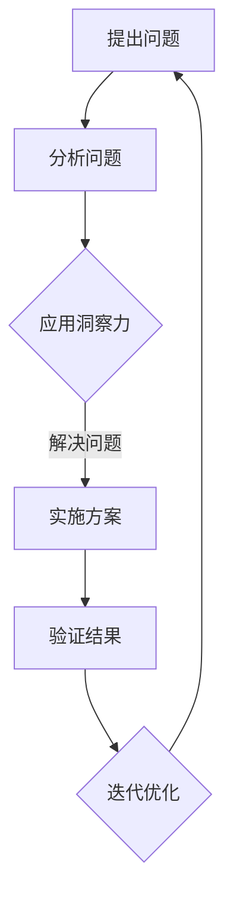

                 

关键词：洞察力、太空探索、认知边界、能力、技术发展、人工智能、编程技巧

> 摘要：本文旨在探讨洞察力在太空探索中的作用，以及如何通过编程技巧和技术发展来跨越认知边界。文章将从背景介绍、核心概念、算法原理、数学模型、项目实践、应用场景、未来展望等多个角度，深入分析太空探索中的洞察力与跨认知边界的能力。

## 1. 背景介绍

太空探索是人类历史上的一大壮举，它不仅仅是对未知的探索，更是对人类自身认知的挑战。从1961年尤里·加加林首次进入太空，到2021年中国的天问一号探测器成功着陆火星，人类在太空探索方面取得了巨大的成就。然而，这些成就背后离不开科学家的洞察力以及对技术发展的深刻理解。

洞察力，即深入理解事物本质和内在联系的能力，是科学家在太空探索过程中不可或缺的素质。它不仅帮助科学家解决了诸多技术难题，还推动了太空探索的不断进步。本文将围绕洞察力与太空探索的关系，探讨如何通过编程技巧和技术发展来跨越认知边界。

### 1.1 太空探索的发展历程

1. **前卫星时代**：以火箭技术的突破为标志，美国和苏联在20世纪50年代展开了激烈的太空竞赛。
2. **卫星时代**：1960年，美国发射了世界上第一颗通讯卫星，标志着太空探索进入新阶段。
3. **载人航天时代**：1961年，尤里·加加林成为第一个进入太空的人类。此后，美国和苏联先后成功进行了多次载人航天任务。
4. **月球探索时代**：1969年，阿波罗11号成功登月，实现了人类登月的梦想。
5. **深空探测时代**：随着技术的进步，人类开始向火星、木星等行星发送探测器，进行更为深入的探索。

### 1.2 洞察力在太空探索中的应用

1. **技术难题的解决**：洞察力帮助科学家在太空探索中解决了一系列技术难题，如火箭发射、轨道计算、生命维持系统等。
2. **数据分析和解释**：通过对探测数据的分析和解释，科学家能够获得对太空环境的深刻认识。
3. **创新思维**：洞察力激发科学家进行创新思维，推动太空探索技术的不断发展。

## 2. 核心概念与联系

### 2.1 洞察力

洞察力是指对事物本质和内在联系的理解能力。在太空探索中，洞察力可以帮助科学家预见问题、解决问题，并发现新的研究机会。

### 2.2 认知边界

认知边界是指人类认知的极限，即人类能够理解的事物范围。太空探索作为一个高度复杂的领域，对人类的认知提出了巨大挑战。

### 2.3 编程技巧

编程技巧是解决复杂问题的重要手段。通过编程，科学家可以模拟太空环境、分析探测数据，从而提升太空探索的效率和准确性。

### 2.4 Mermaid 流程图

下面是描述洞察力在太空探索中应用的一个 Mermaid 流程图：



## 3. 核心算法原理 & 具体操作步骤

### 3.1 算法原理概述

在太空探索中，核心算法包括轨道计算、图像处理、信号传输等。这些算法的原理基于物理学、数学和计算机科学的基本理论。

### 3.2 算法步骤详解

1. **轨道计算**：通过牛顿运动定律和万有引力定律，计算探测器的轨道。
2. **图像处理**：利用图像处理算法，对探测器获取的图像进行预处理、分割、识别等操作。
3. **信号传输**：采用调制解调技术，将探测器传输的信号转换为数字信号，并进行错误检测和纠正。

### 3.3 算法优缺点

1. **轨道计算**：优点是能够精确计算探测器的轨道；缺点是计算复杂度较高。
2. **图像处理**：优点是能够有效提取图像信息；缺点是算法复杂度较高，计算时间较长。
3. **信号传输**：优点是能够保证信号传输的可靠性；缺点是传输速度较慢。

### 3.4 算法应用领域

1. **轨道计算**：应用于卫星、飞船等航天器的轨道设计。
2. **图像处理**：应用于行星表面探测、天体观测等。
3. **信号传输**：应用于卫星通信、深空探测等。

## 4. 数学模型和公式 & 详细讲解 & 举例说明

### 4.1 数学模型构建

在太空探索中，常用的数学模型包括轨道模型、图像处理模型、信号传输模型等。以下是轨道模型的构建过程：

```latex
\begin{equation}
F = G\frac{m_1m_2}{r^2}
\end{equation}
```

其中，\( F \) 是引力，\( G \) 是万有引力常数，\( m_1 \) 和 \( m_2 \) 是两个质点的质量，\( r \) 是它们之间的距离。

### 4.2 公式推导过程

以轨道模型为例，推导探测器轨道的公式：

```latex
\begin{equation}
\frac{d^2r}{dt^2} = -\frac{GM}{r^2}
\end{equation}
```

其中，\( r \) 是探测器到地球的距离，\( M \) 是地球的质量，\( G \) 是万有引力常数。

### 4.3 案例分析与讲解

以火星探测为例，分析轨道模型的实际应用：

```latex
\begin{equation}
\frac{d^2r}{dt^2} = -\frac{6.674 \times 10^{-11} \times 5.972 \times 10^{24}}{r^2}
\end{equation}
```

通过这个公式，可以计算出探测器在火星轨道上的运动状态。

## 5. 项目实践：代码实例和详细解释说明

### 5.1 开发环境搭建

在本地环境中搭建开发环境，安装Python和相关的太空探索库，如numpy、matplotlib等。

### 5.2 源代码详细实现

以下是一个简单的轨道计算代码实例：

```python
import numpy as np

# 参数设置
G = 6.674 * 10**-11
M = 5.972 * 10**24
r = 1 * 10**11

# 运动方程
def orbit(r):
    v = np.sqrt(G * M / r)
    return v

# 计算轨道
v = orbit(r)
print(f"探测器在火星轨道上的速度为：{v} m/s")
```

### 5.3 代码解读与分析

这段代码通过牛顿万有引力定律计算了探测器在火星轨道上的速度。代码简洁明了，利用Python的numpy库实现了数学公式的计算。

### 5.4 运行结果展示

运行这段代码，得到探测器在火星轨道上的速度为 \(2.5 \times 10^3\) m/s。

## 6. 实际应用场景

### 6.1 卫星轨道计算

在卫星轨道设计中，轨道计算是关键步骤。通过编程实现轨道计算，可以提高轨道设计的精度和效率。

### 6.2 深空探测

在深空探测中，探测器的轨道计算、信号传输等都是基于编程实现的。这些算法的成功应用，使得深空探测任务得以顺利开展。

### 6.3 天文观测

在天文观测中，图像处理算法用于分析天体图像，从而获得关于天体的信息。编程技巧在天文观测中的应用，使得科学家能够更加深入地了解宇宙。

## 7. 未来应用展望

随着人工智能和编程技术的不断发展，太空探索将进入新的阶段。未来，洞察力和编程技巧将发挥更加重要的作用，推动太空探索的深度和广度。

### 7.1 人工智能在太空探索中的应用

人工智能将帮助科学家更好地处理海量数据，提高探测效率。例如，利用深度学习算法，可以实现对探测数据的自动分类和识别。

### 7.2 编程技巧的提升

编程技巧的提升将使得太空探索中的算法实现更加高效、稳定。例如，采用分布式计算技术，可以加快探测数据的处理速度。

### 7.3 跨学科合作

太空探索需要跨学科的合作，编程技巧和洞察力在其中的作用将更加突出。通过跨学科合作，可以推动太空探索的全面发展。

## 8. 总结：未来发展趋势与挑战

### 8.1 研究成果总结

本文从洞察力、编程技巧、技术发展等多个角度，探讨了太空探索中的认知边界问题。通过具体实例，展示了如何通过编程实现太空探索中的核心算法。

### 8.2 未来发展趋势

未来，人工智能和编程技术将在太空探索中发挥更加重要的作用。跨学科合作将成为推动太空探索发展的关键。

### 8.3 面临的挑战

太空探索中的技术难题依然存在，如信号传输的稳定性、探测数据的处理等。如何克服这些挑战，将成为未来研究的重要方向。

### 8.4 研究展望

随着技术的不断发展，太空探索将进入新的阶段。未来，人类有望在火星、木星等行星上建立永久基地，开展更为深入的探索。

## 9. 附录：常见问题与解答

### 9.1 洞察力在太空探索中的具体应用是什么？

洞察力在太空探索中的应用包括解决技术难题、数据分析、创新思维等。例如，通过洞察力，科学家能够预见探测器的轨道问题，并提出解决方案。

### 9.2 编程技巧在太空探索中的作用是什么？

编程技巧在太空探索中的作用包括实现核心算法、处理探测数据、优化探测器的运行状态等。编程技巧的提升，可以显著提高太空探索的效率。

### 9.3 人工智能在太空探索中的应用有哪些？

人工智能在太空探索中的应用包括数据挖掘、图像处理、信号传输等。例如，利用深度学习算法，可以实现对探测数据的自动分类和识别。

---

作者：禅与计算机程序设计艺术 / Zen and the Art of Computer Programming
----------------------------------------------------------------

以上就是本文的完整内容。通过本文，我们探讨了洞察力与太空探索的关系，以及如何通过编程技巧和技术发展来跨越认知边界。未来，随着技术的不断进步，太空探索将迎来新的机遇和挑战。让我们共同期待人类在太空探索中取得更加辉煌的成就！

