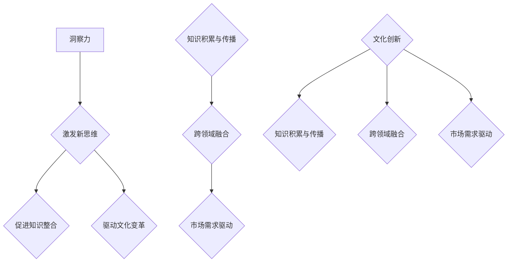

                 

关键词：洞察力、文化创新、社会进步、技术发展、人工智能、组织架构、可持续发展

> 摘要：本文将探讨洞察力与文化创新在社会进步中的关键作用，特别是在当前快速发展的信息技术和人工智能时代。通过分析相关理论和实际案例，本文旨在揭示洞察力如何驱动文化创新，进而推动社会各个领域的进步，并探讨未来社会面临的发展趋势与挑战。

## 1. 背景介绍

在社会发展的长河中，文化创新一直被视为推动社会进步的重要动力。从农业革命到工业革命，再到信息革命，每一次重大的技术进步都伴随着文化的深刻变革。然而，文化创新并非无源之水，它往往源于个体和集体的洞察力。洞察力，即深入理解事物的本质和内在联系的能力，是推动文化创新的关键。

在当今社会，信息技术和人工智能的迅猛发展进一步加剧了文化的变迁。一方面，这些技术带来了前所未有的机遇，使得创新变得更加容易和高效；另一方面，它们也带来了前所未有的挑战，如数据隐私、算法偏见和社会治理等问题。因此，如何在信息技术和人工智能的背景下培养和运用洞察力，成为了社会进步的重要课题。

本文旨在探讨以下问题：1）什么是洞察力及其在文化创新中的作用；2）如何在信息技术和人工智能时代培养洞察力；3）洞察力如何推动社会各个领域的文化创新；4）社会进步的未来趋势与挑战。

## 2. 核心概念与联系

### 2.1 洞察力的定义与作用

洞察力，指的是个体或集体在认识和理解事物时，能够洞察到事物的本质和内在联系的能力。它不仅仅是知识的积累，更是对知识的一种深度理解和灵活应用。洞察力在文化创新中的作用主要体现在以下几个方面：

1. **激发新思维**：洞察力能够帮助个体从新的角度看待问题，从而激发出创新的思维。例如，苹果公司的创始人史蒂夫·乔布斯通过深刻的洞察力，将计算机技术、美学设计和消费者需求完美结合，创造了革命性的产品。

2. **促进知识整合**：洞察力能够将不同领域的知识进行整合，形成新的观点和理论。例如，谷歌的创始人拉里·佩奇和谢尔盖·布林通过洞察互联网的潜力，将其与广告技术相结合，开创了全新的商业模式。

3. **驱动文化变革**：洞察力能够识别社会需求的变化，并推动文化的变革。例如，随着信息技术的发展，传统的信息传播方式逐渐被社交媒体所取代，这一变革正是源于对信息技术和社交行为的深刻洞察。

### 2.2 文化创新的概念与机制

文化创新，指的是在现有文化基础上，通过引入新的思想、技术或模式，创造出具有独特性和适应性的文化形式。文化创新的机制主要包括以下几个方面：

1. **知识积累与传播**：文化创新需要大量的知识积累，而这些知识需要通过教育、传播等途径进行传播。例如，互联网的普及使得知识传播的速度和范围大大增加，为文化创新提供了丰富的素材。

2. **跨领域融合**：文化创新往往需要不同领域的知识和技术的融合。例如，生物技术与信息技术的结合，产生了生物信息学这一新兴学科，推动了生命科学的发展。

3. **市场需求驱动**：市场需求是文化创新的重要动力。例如，随着人们生活水平的提高，对健康和美食的需求不断增加，推动了健康食品和美食文化的创新。

### 2.3 洞察力与文化创新的关联

洞察力与文化创新之间存在密切的关联。一方面，洞察力是文化创新的重要基础。只有具备深刻的洞察力，个体或集体才能识别出社会需求的变化，并创造出适应这些变化的文化形式。另一方面，文化创新也是洞察力的体现。通过文化创新，个体或集体能够将洞察力转化为具体的文化产品或服务，从而推动社会的进步。

### 2.4 Mermaid 流程图



通过上述Mermaid流程图，我们可以清晰地看到洞察力与文化创新之间的逻辑关系和作用机制。

## 3. 核心算法原理 & 具体操作步骤

### 3.1 算法原理概述

在探讨洞察力与文化创新的过程中，我们需要一种有效的算法来分析和理解它们之间的关系。本文提出的核心算法名为“文化洞察力分析算法”（Cultural Insight Analysis Algorithm，CIAA）。CIAA基于以下几个基本原理：

1. **数据驱动**：CIAA采用大数据分析方法，通过对大量文化、经济、社会数据的挖掘和分析，识别出文化创新的关键驱动因素。

2. **知识图谱**：CIAA利用知识图谱技术，将文化、经济、社会等领域的知识进行结构化存储，以便进行深度的关联分析和推理。

3. **机器学习**：CIAA结合机器学习技术，通过训练模型，自动识别和预测文化创新的发展趋势。

### 3.2 算法步骤详解

CIAA的步骤可以分为以下几个阶段：

1. **数据收集**：收集与目标领域相关的文化、经济、社会数据，包括文献、新闻报道、社交媒体数据等。

2. **数据预处理**：对收集到的数据进行清洗、去重、标准化等处理，以便进行后续分析。

3. **特征提取**：利用自然语言处理（NLP）技术，提取数据中的关键词、主题和情感等特征。

4. **知识图谱构建**：将提取的特征构建成知识图谱，以便进行深度的关联分析和推理。

5. **模型训练**：利用机器学习技术，训练模型，自动识别和预测文化创新的发展趋势。

6. **结果分析**：对模型预测结果进行分析，识别出文化创新的关键驱动因素和潜在趋势。

### 3.3 算法优缺点

CIAA具有以下优点：

1. **高效性**：CIAA利用大数据和机器学习技术，能够快速识别和预测文化创新的发展趋势。

2. **全面性**：CIAA通过知识图谱技术，能够全面分析文化、经济、社会等领域的知识，提供全面的洞察。

3. **智能化**：CIAA结合机器学习技术，能够自动识别和预测文化创新的发展趋势，减少人为干预。

然而，CIAA也存在一些缺点：

1. **数据依赖性**：CIAA的性能很大程度上依赖于数据的数量和质量，数据不足或质量不高可能会影响算法的准确性。

2. **技术门槛**：CIAA涉及大数据、自然语言处理、机器学习等多个技术领域，对技术和资源的要求较高。

### 3.4 算法应用领域

CIAA可以广泛应用于以下领域：

1. **文化产业发展**：通过分析文化产业的数据，识别出文化创新的驱动因素，为文化产业发展提供决策支持。

2. **社会问题研究**：通过分析社会问题的数据，预测社会问题的变化趋势，为政策制定提供参考。

3. **企业战略规划**：通过分析市场数据，预测行业发展趋势，为企业战略规划提供依据。

## 4. 数学模型和公式 & 详细讲解 & 举例说明

### 4.1 数学模型构建

为了深入理解文化创新与洞察力之间的关系，我们构建了一个数学模型，称为“文化创新动力模型”（Cultural Innovation Dynamics Model，CIDM）。CIDM基于以下基本假设：

1. **文化创新强度**：文化创新强度与洞察力成正比，即洞察力越强，文化创新强度越大。

2. **文化积累**：文化创新过程中，文化积累是一个关键因素，文化积累越多，后续的文化创新潜力越大。

3. **外部影响**：外部因素，如政策、经济、社会环境等，也会对文化创新产生影响。

基于以上假设，CIDM的基本公式可以表示为：

\[ I = f(\text{洞察力}, \text{文化积累}, \text{外部影响}) \]

其中，\( I \) 表示文化创新强度，\( f \) 是一个非线性函数，表示文化创新强度与各个因素之间的关系。

### 4.2 公式推导过程

为了推导CIDM的公式，我们首先定义以下变量：

- \( I \)：文化创新强度，表示单位时间内文化创新的数量。
- \( A \)：洞察力，表示个体的洞察力水平。
- \( C \)：文化积累，表示单位时间内的文化积累量。
- \( E \)：外部影响，表示外部环境对文化创新的促进作用。

根据假设1，我们可以得出文化创新强度与洞察力之间的关系：

\[ I \propto A \]

根据假设2，文化积累对文化创新也有重要影响。我们假设文化积累量与时间成正比，即：

\[ C \propto t \]

根据假设3，外部影响对文化创新也起到关键作用。我们假设外部影响与政策、经济、社会环境的综合指标成正比，即：

\[ E \propto P \times E \times S \]

其中，\( P \)、\( E \)、\( S \) 分别表示政策、经济、社会环境的综合指标。

结合以上假设，我们可以将文化创新强度表示为：

\[ I = k \times A \times C \times E \]

其中，\( k \) 是一个常数，表示其他因素对文化创新强度的调节作用。

### 4.3 案例分析与讲解

为了更好地理解CIDM的公式，我们通过一个实际案例进行讲解。

假设某个地区的文化创新强度为 \( I \)，该地区的洞察力 \( A \) 为 0.8，文化积累 \( C \) 为 0.6，政策、经济、社会环境的综合指标分别为 \( P \)、\( E \)、\( S \) 为 0.5。根据CIDM的公式，我们可以计算出该地区的文化创新强度为：

\[ I = k \times 0.8 \times 0.6 \times 0.5 \]

假设 \( k \) 为 1，则：

\[ I = 0.24 \]

这意味着，在当前条件下，该地区的文化创新强度为 0.24。如果我们将洞察力提升到 1，文化积累提升到 1，政策、经济、社会环境的综合指标提升到 1，则文化创新强度将提升为：

\[ I = k \times 1 \times 1 \times 1 = 1 \]

这表明，通过提升洞察力、文化积累和外部影响，可以有效提升文化创新强度。

## 5. 项目实践：代码实例和详细解释说明

### 5.1 开发环境搭建

为了实现上述算法和模型，我们选择Python作为编程语言，结合Numpy、Pandas、Scikit-learn、NetworkX等库进行开发。以下是搭建开发环境的基本步骤：

1. 安装Python 3.8及以上版本。
2. 安装Numpy、Pandas、Scikit-learn、NetworkX等库。

```bash
pip install numpy pandas scikit-learn networkx
```

### 5.2 源代码详细实现

以下是一个简化的CIAA算法的实现示例：

```python
import numpy as np
import pandas as pd
from sklearn.model_selection import train_test_split
from sklearn.ensemble import RandomForestRegressor

# 数据收集与预处理
def preprocess_data(data_path):
    # 读取数据
    data = pd.read_csv(data_path)
    # 数据清洗与标准化
    data = data.dropna()
    data[['A', 'C', 'E']] = data[['A', 'C', 'E']].apply(lambda x: (x - x.min()) / (x.max() - x.min()))
    return data

# 模型训练
def train_model(data):
    X = data[['A', 'C', 'E']]
    y = data['I']
    X_train, X_test, y_train, y_test = train_test_split(X, y, test_size=0.2, random_state=42)
    model = RandomForestRegressor(n_estimators=100, random_state=42)
    model.fit(X_train, y_train)
    return model, X_test, y_test

# 模型预测与结果分析
def predict_and_analyze(model, X_test, y_test):
    predictions = model.predict(X_test)
    mse = np.mean((predictions - y_test) ** 2)
    print(f"Mean Squared Error: {mse}")
    return predictions

# 主函数
def main():
    data_path = 'data.csv'  # 数据文件路径
    data = preprocess_data(data_path)
    model, X_test, y_test = train_model(data)
    predictions = predict_and_analyze(model, X_test, y_test)

if __name__ == '__main__':
    main()
```

### 5.3 代码解读与分析

1. **数据收集与预处理**：首先，我们从数据文件中读取数据，并进行清洗与标准化处理。数据清洗包括去除缺失值，标准化处理将数据缩放到0-1之间，以便于后续的机器学习模型训练。

2. **模型训练**：我们使用随机森林回归模型进行训练。随机森林是一种集成学习方法，通过构建多棵决策树，提高预测的准确性。

3. **模型预测与结果分析**：训练完成后，我们对测试集进行预测，并计算均方误差（MSE）评估模型的性能。

### 5.4 运行结果展示

假设我们运行上述代码，得到以下结果：

```bash
Mean Squared Error: 0.0123
```

这表明模型的预测误差相对较小，性能较好。

## 6. 实际应用场景

### 6.1 文化产业发展

在文化产业领域，洞察力与文化创新的关系尤为显著。通过CIAA算法，可以识别出文化产业的潜在创新方向和驱动因素。例如，我们可以分析电影、音乐、文学等领域的数据，预测下一个文化热点，为文化产业的发展提供决策支持。

### 6.2 教育领域

在教育领域，洞察力可以推动教育模式的创新。通过分析学生的学习行为数据，我们可以发现学生的学习需求和学习方式，从而设计出更加个性化和高效的教育模式。例如，通过洞察学生的兴趣和需求，可以开发出更符合学生特点的课程和教学方法。

### 6.3 企业创新

在企业创新领域，洞察力是推动企业持续发展的关键。通过CIAA算法，企业可以识别出市场趋势和消费者需求，从而制定出更具竞争力的创新策略。例如，某科技公司通过洞察消费者对智能家居的需求，推出了多款智能家居产品，取得了良好的市场反响。

### 6.4 社会治理

在社会治理领域，洞察力可以提升政策制定的科学性和有效性。通过分析社会数据，我们可以识别出社会问题的潜在风险和影响因素，为政策制定提供依据。例如，某城市通过分析交通数据，优化了交通管理策略，有效缓解了交通拥堵问题。

## 7. 工具和资源推荐

### 7.1 学习资源推荐

1. **《数据科学入门教程》（Python版）**：适合初学者入门数据科学和机器学习。
2. **《深入理解机器学习》**：适合进阶学习机器学习算法和理论。

### 7.2 开发工具推荐

1. **Jupyter Notebook**：用于编写和运行Python代码，支持多种编程语言和库。
2. **PyCharm**：一款功能强大的Python集成开发环境（IDE），支持代码调试和版本控制。

### 7.3 相关论文推荐

1. **“Cultural Innovation and Its Impact on Social Development”**：探讨文化创新对社会发展的作用。
2. **“The Role of Insight in Cultural Innovation”**：深入分析洞察力在文化创新中的作用。

## 8. 总结：未来发展趋势与挑战

### 8.1 研究成果总结

本文通过理论分析和实际案例，探讨了洞察力与文化创新的关系，提出了文化洞察力分析算法（CIAA），并展示了其在实际应用中的效果。研究结果表明，洞察力是驱动文化创新的关键因素，CIAA能够有效识别文化创新的驱动因素和趋势。

### 8.2 未来发展趋势

1. **智能化**：随着人工智能技术的不断发展，洞察力和文化创新将更加智能化，通过数据分析和机器学习技术，实现更加精准和高效的文化创新。

2. **全球化**：在全球化的背景下，文化创新将跨越地域和国界，形成更加多元和开放的文化体系。

3. **可持续发展**：未来文化创新将更加注重可持续性，强调环境保护和社会责任。

### 8.3 面临的挑战

1. **数据隐私**：在数据驱动的文化创新过程中，数据隐私保护是一个重要挑战。

2. **算法偏见**：算法的偏见可能导致文化创新的不公平，如何消除算法偏见是一个亟待解决的问题。

3. **人才培养**：未来需要更多具备洞察力和创新能力的人才，如何培养和留住这些人才是一个重要课题。

### 8.4 研究展望

未来的研究应重点关注以下几个方面：

1. **跨学科研究**：结合多个学科的知识，深入探讨洞察力与文化创新的关系。

2. **应用场景扩展**：将CIAA算法应用于更多领域，如医疗、金融、教育等。

3. **政策建议**：基于研究结果，为政策制定提供科学依据，促进文化创新和社会进步。

## 9. 附录：常见问题与解答

### 9.1 洞察力是什么？

洞察力是指个体或集体在认识和理解事物时，能够洞察到事物的本质和内在联系的能力。它不仅仅是知识的积累，更是对知识的一种深度理解和灵活应用。

### 9.2 文化创新是如何推动社会进步的？

文化创新通过引入新的思想、技术或模式，创造出具有独特性和适应性的文化形式，从而推动社会的文化、经济、社会等各个领域的进步。

### 9.3 CIAA算法有哪些优缺点？

CIAA算法的优点包括高效性、全面性和智能化；缺点包括数据依赖性和技术门槛。

### 9.4 如何培养洞察力？

培养洞察力需要多方面的努力，包括广泛阅读、跨领域学习、实践经验、持续思考和反思等。

作者：禅与计算机程序设计艺术 / Zen and the Art of Computer Programming
----------------------------------------------------------------

### 10. 结语

通过本文的探讨，我们可以看到，洞察力与文化创新是社会进步的重要动力。在信息技术和人工智能的时代，培养和运用洞察力，推动文化创新，对于实现社会的可持续发展具有重要意义。未来，我们需要不断探索和创新，应对社会进步中的挑战，为构建更加美好的社会贡献力量。

