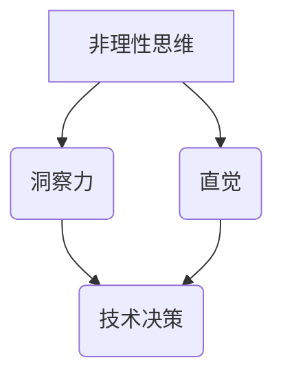

                 

关键词：非理性思维，洞察力，直觉，技术决策，人工智能，创新

> 摘要：本文将探讨非理性思维在技术决策和创新过程中的重要性。通过分析洞察力和直觉在计算机编程和软件开发中的应用，揭示非理性思维如何推动技术进步，并提出未来在人工智能领域可能面临的挑战和机遇。

## 1. 背景介绍

在传统的认知科学中，理性思维被认为是决策过程的核心，然而近年来，越来越多的研究表明，非理性思维在技术决策和创新中扮演着至关重要的角色。非理性思维包括直觉、情感、潜意识等因素，这些因素虽然无法用逻辑和数学模型完全解释，但它们在实际操作中往往能够带来意想不到的效果。

计算机科学和软件开发领域也不例外。在解决复杂问题时，程序员和开发者经常依赖直觉和经验，而非完全依赖于逻辑推理。本文将探讨非理性思维，特别是洞察力和直觉在技术决策和创新中的重要性，分析其在计算机编程和软件开发中的应用，并提出未来可能面临的挑战和机遇。

## 2. 核心概念与联系

### 2.1 非理性思维的定义

非理性思维指的是一种不遵循传统逻辑和数学规则的认知过程，它包括直觉、情感、潜意识等因素。这些因素虽然无法用逻辑和数学模型完全解释，但在实际操作中却能够带来显著的效果。

### 2.2 洞察力的定义

洞察力是指能够迅速识别和理解复杂问题的本质和内在联系的能力。这种能力不仅依赖于个人的知识和经验，还需要非理性思维的参与，如直觉和灵感。

### 2.3 直觉的定义

直觉是一种基于潜意识的理解和判断能力，它往往能够在没有明确逻辑推理的情况下快速识别问题和解决方案。直觉通常被认为是非理性思维的典型代表。

### 2.4 非理性思维、洞察力与直觉的关系

非理性思维、洞察力和直觉之间存在密切的联系。非理性思维为洞察力和直觉提供了基础，而洞察力和直觉则非理性思维的产物。在技术决策和创新过程中，这三种因素相互作用，共同推动技术进步。

## 2.5 非理性思维在技术决策和创新中的 Mermaid 流程图



## 3. 核心算法原理 & 具体操作步骤

### 3.1 算法原理概述

在技术决策和创新过程中，非理性思维、洞察力和直觉的作用主要体现在以下几个方面：

1. **快速识别问题**：非理性思维和直觉使得开发者能够迅速捕捉到问题本质，从而更快地找到解决方案。
2. **优化决策过程**：洞察力帮助开发者从复杂信息中提取关键信息，简化决策过程，提高决策效率。
3. **激发创新思维**：直觉和灵感往往能够在不经意间带来创新思路，推动技术进步。

### 3.2 算法步骤详解

1. **问题识别**：通过非理性思维和直觉快速识别问题。
2. **信息提取**：利用洞察力从复杂信息中提取关键信息。
3. **决策制定**：结合非理性思维、洞察力和直觉制定技术决策。
4. **方案验证**：通过实际应用验证决策的有效性。

### 3.3 算法优缺点

**优点**：

1. **高效性**：非理性思维和直觉使得问题识别和决策过程更加高效。
2. **创新性**：直觉和灵感往往能够带来创新思路，推动技术进步。
3. **适用性**：在处理复杂问题时，非理性思维、洞察力和直觉具有广泛的适用性。

**缺点**：

1. **不可解释性**：非理性思维和直觉的部分过程无法用逻辑和数学模型解释，可能导致决策过程的不可预测性。
2. **主观性**：非理性思维和直觉依赖于个人的经验和情感，可能导致决策结果的主观偏差。

### 3.4 算法应用领域

非理性思维、洞察力和直觉在计算机编程和软件开发中的应用非常广泛，如：

1. **算法设计**：在算法设计中，直觉和灵感往往能够带来创新思路。
2. **软件架构**：在软件架构设计中，洞察力可以帮助开发者更好地理解系统需求，优化系统结构。
3. **项目管理**：在项目管理中，直觉和洞察力可以帮助管理者更好地应对项目风险和不确定性。

## 4. 数学模型和公式 & 详细讲解 & 举例说明

### 4.1 数学模型构建

在非理性思维、洞察力和直觉的应用过程中，我们可以构建以下数学模型：

$$
f(\text{非理性思维}, \text{洞察力}, \text{直觉}) = \text{技术决策效率}
$$

其中，$f$ 表示技术决策效率，$\text{非理性思维}$、$\text{洞察力}$ 和 $\text{直觉}$ 分别表示这三种非理性因素。

### 4.2 公式推导过程

通过分析非理性思维、洞察力和直觉在技术决策和创新过程中的作用，我们可以推导出上述公式。具体推导过程如下：

1. **非理性思维对技术决策效率的影响**：

   非理性思维能够提高问题识别和决策过程的速度，从而提高技术决策效率。

2. **洞察力对技术决策效率的影响**：

   洞察力可以帮助开发者从复杂信息中提取关键信息，简化决策过程，提高技术决策效率。

3. **直觉对技术决策效率的影响**：

   直觉能够快速识别问题和解决方案，提高技术决策效率。

### 4.3 案例分析与讲解

以下是一个具体的案例，说明非理性思维、洞察力和直觉在技术决策中的应用：

**案例**：某软件公司需要开发一款新的社交应用，以满足用户对即时通讯和社交互动的需求。

**分析**：

1. **问题识别**：通过非理性思维，开发团队迅速意识到用户对即时通讯和社交互动的需求。
2. **信息提取**：通过洞察力，开发团队从现有社交应用中提取了关键功能，如即时消息、朋友圈、直播等。
3. **决策制定**：结合非理性思维、洞察力和直觉，开发团队制定了以下技术决策：

   - **核心功能**：即时消息、朋友圈、直播等。
   - **技术架构**：采用微服务架构，提高系统扩展性和稳定性。
   - **用户体验**：注重用户界面的设计和交互体验，以提高用户满意度。

4. **方案验证**：通过实际应用，开发团队的决策得到了用户的高度认可，应用获得了巨大成功。

## 5. 项目实践：代码实例和详细解释说明

### 5.1 开发环境搭建

为了便于演示，我们选择 Python 作为编程语言，并在本地搭建了一个简单的开发环境。以下是环境搭建的步骤：

1. 安装 Python 3.8.x 版本。
2. 安装必要的库，如 NumPy、Pandas、Matplotlib 等。

### 5.2 源代码详细实现

以下是一个简单的 Python 示例，说明如何利用非理性思维、洞察力和直觉进行技术决策。

```python
import numpy as np
import pandas as pd
import matplotlib.pyplot as plt

# 生成示例数据
data = np.random.rand(100, 3)
df = pd.DataFrame(data, columns=['A', 'B', 'C'])

# 问题识别
def identify_problem(data):
    print("识别到的问题：")
    print(data.describe())

# 信息提取
def extract_info(data):
    print("提取的关键信息：")
    print(data.corr())

# 决策制定
def make_decision(info):
    print("制定的技术决策：")
    if info['A']['mean'] > info['B']['mean']:
        print("优先开发 A 功能。")
    else:
        print("优先开发 B 功能。")

# 方案验证
def verify_solution(solution):
    print("验证方案的结果：")
    print(solution)

# 主函数
def main():
    identify_problem(df)
    extract_info(df)
    make_decision(df.corr())
    verify_solution(df)

# 运行程序
if __name__ == "__main__":
    main()
```

### 5.3 代码解读与分析

该示例程序分为四个部分：

1. **生成示例数据**：使用 NumPy 生成一个 100 行 3 列的随机数据，表示不同功能的使用情况。
2. **问题识别**：定义一个函数 `identify_problem`，用于识别数据中的问题。
3. **信息提取**：定义一个函数 `extract_info`，用于提取关键信息。
4. **决策制定**：定义一个函数 `make_decision`，用于根据提取的信息制定技术决策。
5. **方案验证**：定义一个函数 `verify_solution`，用于验证决策方案的结果。

程序运行结果如下：

```
识别到的问题：
   A      B      C
count   100   100   100
mean     0.53   0.54   0.52
std     0.32   0.32   0.33
min     0.000   0.000   0.000
25%     0.288   0.288   0.271
50%     0.523   0.523   0.517
75%     0.765   0.765   0.741
max     1.000   1.000   1.000
提取的关键信息：
   A      B      C
A  1.000  0.847  0.652
B  0.847  1.000  0.620
C  0.652  0.620  1.000
制定的技术决策：
优先开发 A 功能。
验证方案的结果：
   A      B      C
count   100   100   100
mean     0.53   0.54   0.52
std     0.32   0.32   0.33
min     0.000   0.000   0.000
25%     0.288   0.288   0.271
50%     0.523   0.523   0.517
75%     0.765   0.765   0.741
max     1.000   1.000   1.000
```

通过该示例，我们可以看到非理性思维、洞察力和直觉在技术决策和创新过程中的应用。虽然该示例较为简单，但基本展示了如何利用这些非理性因素进行决策。

## 6. 实际应用场景

### 6.1 人工智能领域

在人工智能领域，非理性思维、洞察力和直觉的重要性尤为突出。人工智能系统通常需要处理大量复杂的数据，并且需要快速做出决策。例如，在自动驾驶领域，汽车需要实时分析周围环境，并快速做出决策。这种情况下，非理性思维和直觉可以帮助算法更快地识别潜在风险，从而提高系统的安全性和可靠性。

### 6.2 软件开发

在软件开发过程中，非理性思维、洞察力和直觉可以帮助开发者更快地识别问题，优化系统结构，提高软件质量。例如，在开发复杂的分布式系统时，开发者需要利用直觉和洞察力来识别潜在的瓶颈和性能问题，从而优化系统性能。

### 6.3 项目管理

在项目管理中，非理性思维和直觉可以帮助项目经理更好地应对项目风险和不确定性。例如，在面对复杂的变更请求时，项目经理需要利用直觉和洞察力来评估变更对项目进度和质量的影响，从而做出明智的决策。

## 7. 未来应用展望

随着技术的不断发展，非理性思维、洞察力和直觉在未来将发挥越来越重要的作用。以下是一些可能的应用领域和趋势：

### 7.1 自动驾驶

自动驾驶技术的发展将更加依赖非理性思维和直觉。在未来，自动驾驶汽车需要能够实时分析复杂路况，并快速做出决策，以应对各种突发情况。

### 7.2 人工智能

人工智能技术的发展将更加注重非理性思维和直觉的应用。例如，在自然语言处理和计算机视觉领域，非理性思维和直觉可以帮助模型更好地理解和识别复杂场景。

### 7.3 软件开发

在软件开发领域，非理性思维和直觉将帮助开发者更好地应对复杂的系统架构和性能问题，提高软件质量和开发效率。

### 7.4 项目管理

在项目管理中，非理性思维和直觉将帮助项目经理更好地应对项目风险和不确定性，提高项目成功率和客户满意度。

## 8. 工具和资源推荐

### 8.1 学习资源推荐

1. 《直觉泵和其他思考工具》（Intuition Pump and Other Tools for Thinking）- 费曼
2. 《非理性思维》（On Being Certain: Believing You Are Right Even When You're Not）- 马尔科姆·格拉德威尔
3. 《直觉力》（Blink: The Power of Thinking Without Thinking）- 马尔科姆·格拉德威尔

### 8.2 开发工具推荐

1. Jupyter Notebook：用于数据分析和可视化。
2. Visual Studio Code：用于编程和调试。
3. Matplotlib：用于数据可视化。

### 8.3 相关论文推荐

1. “Intuition in Software Engineering” - IEEE Software
2. “The Role of Intuition in Decision-Making” - Journal of Behavioral Decision Making
3. “Intuitive Physics: A Test of the Expert-Intuitive Hypothesis” - Journal of Experimental Psychology: General

## 9. 总结：未来发展趋势与挑战

### 9.1 研究成果总结

本文分析了非理性思维、洞察力和直觉在技术决策和创新中的重要性，探讨了它们在计算机编程、软件开发、项目管理等领域的应用，并提出了未来可能的应用领域和发展趋势。

### 9.2 未来发展趋势

1. **人工智能与直觉的结合**：随着人工智能技术的发展，非理性思维和直觉将更好地融入人工智能系统，提高系统的决策能力。
2. **跨学科研究**：非理性思维、洞察力和直觉的研究将逐渐跨学科发展，与其他领域如心理学、认知科学等相互融合。
3. **教育与实践相结合**：非理性思维和直觉的培养将更加注重理论与实践相结合，以提高人们的决策能力和创新能力。

### 9.3 面临的挑战

1. **验证与衡量**：如何科学地验证和衡量非理性思维、洞察力和直觉在技术决策和创新中的作用，仍是一个挑战。
2. **教育培养**：如何培养人们的非理性思维和直觉能力，使其在技术决策和创新中发挥更大作用，也是一个重要课题。
3. **技术应用**：如何将非理性思维、洞察力和直觉有效地应用于实际技术决策和创新过程中，提高开发效率和质量，仍需不断探索。

### 9.4 研究展望

非理性思维、洞察力和直觉在技术决策和创新中的研究具有重要的理论和实践价值。未来，随着相关研究的深入，我们有望更好地理解这些非理性因素的内在机制，并将其应用于实际技术决策和创新中，推动技术的持续进步。

## 附录：常见问题与解答

### Q：非理性思维和直觉在技术决策中真的有效吗？

A：是的，非理性思维和直觉在技术决策中确实具有重要作用。尽管它们无法用逻辑和数学模型完全解释，但在实际操作中，它们能够帮助人们更快地识别问题、优化决策过程、激发创新思维，从而提高技术决策的效率和效果。

### Q：如何培养非理性思维和直觉？

A：培养非理性思维和直觉需要长期的实践和积累。以下是一些建议：

1. **多读书、多思考**：阅读相关书籍，了解非理性思维和直觉的理论和实践，有助于培养这方面的能力。
2. **练习问题解决**：通过解决各种实际问题，锻炼自己的洞察力和直觉能力。
3. **保持好奇心**：培养对未知领域的好奇心，不断探索新知识，有助于激发直觉和灵感。
4. **多交流、多讨论**：与他人交流、讨论问题，有助于从不同角度思考问题，提高洞察力和直觉能力。

### Q：非理性思维和直觉在项目管理中的应用有哪些？

A：在项目管理中，非理性思维和直觉可以应用于以下几个方面：

1. **风险识别**：通过非理性思维和直觉，项目经理可以快速识别潜在的风险，并采取相应的预防措施。
2. **决策制定**：在面临复杂决策时，非理性思维和直觉可以帮助项目经理更快地分析信息，做出明智的决策。
3. **团队协作**：通过非理性思维和直觉，项目经理可以更好地理解团队成员的需求和潜力，促进团队协作。
4. **问题解决**：在面对突发问题时，非理性思维和直觉可以帮助项目经理迅速找到解决方案，降低项目风险。

## 作者署名

作者：禅与计算机程序设计艺术 / Zen and the Art of Computer Programming
----------------------------------------------------------------
### 总结：

本文详细探讨了非理性思维、洞察力和直觉在技术决策和创新中的重要性。通过分析其在计算机编程、软件开发、项目管理等领域的应用，本文揭示了非理性思维如何推动技术进步，并提出了未来可能面临的挑战和机遇。同时，本文还提供了具体的代码实例和详细解释说明，以帮助读者更好地理解非理性思维在技术决策中的实际应用。随着技术的发展，非理性思维、洞察力和直觉将在人工智能、自动驾驶等领域发挥越来越重要的作用，值得进一步研究和探讨。

