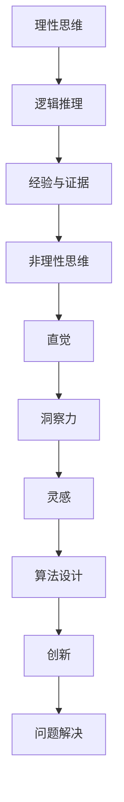

                 

关键词：洞察力、直觉、非理性思维、创新、算法设计、计算机科学

> 摘要：本文深入探讨了非理性思维在计算机科学领域的重要性。通过分析洞察力与直觉的相互作用，本文揭示了非理性思维如何推动创新、提高算法设计效率，并在计算机科学研究中发挥关键作用。同时，文章还提出了未来在非理性思维研究领域可能面临的发展趋势和挑战。

## 1. 背景介绍

在计算机科学领域，传统的理性思维一直是主导创新的动力。然而，随着技术的发展，我们开始意识到，在一些复杂问题面前，纯粹的理性思维并不总是有效。非理性思维，尤其是洞察力和直觉，正在成为推动计算机科学进步的新引擎。本文将探讨非理性思维在计算机科学中的重要性，分析其在算法设计、创新推动、以及解决问题中的应用。

### 1.1 非理性思维的定义与作用

非理性思维通常指的是那些不依赖于逻辑推理、经验或证据的思考方式。它包括直觉、洞察力、灵感等。虽然非理性思维不遵循传统的理性思维模式，但它却能够在复杂问题面前提供创新的解决方案。

- **直觉**：直觉是一种快速、无意识的认知过程，能够快速识别模式和关联。它在算法设计中尤为重要，可以帮助程序员快速找到问题的解决方案。
- **洞察力**：洞察力是对问题本质的深刻理解，能够在复杂系统中找到关键点，从而简化问题的解决过程。
- **灵感**：灵感是一种突然出现的创意或解决方案，往往在非理性思维的状态下产生。

### 1.2 非理性思维与计算机科学的关联

计算机科学是一门高度复杂的技术领域，面对的问题往往具有复杂性、多样性和不确定性。传统的理性思维在这些情境下可能会变得力不从心。而非理性思维，通过其独特的思考方式，能够帮助计算机科学家在复杂问题面前找到创新的解决方案。

- **算法设计**：在算法设计过程中，直觉和洞察力可以帮助程序员快速识别问题关键，设计出更加高效和优化的算法。
- **创新推动**：计算机科学的发展离不开创新。非理性思维能够激发新的创意，推动技术的突破和进步。
- **问题解决**：在解决复杂问题时，非理性思维能够提供不同的视角和思路，帮助找到传统方法无法触及的解决方案。

## 2. 核心概念与联系

为了更好地理解非理性思维在计算机科学中的应用，我们需要先了解其核心概念和原理。以下是相关概念和它们之间的联系，通过Mermaid流程图展示：



### 2.1 理性思维与非理性思维的关系

理性思维与非理性思维并非完全对立，它们在不同情境下各有优势。理性思维依赖于逻辑推理、经验和证据，能够在已知问题中提供可靠的解决方案。而非理性思维则能够激发创新和发现未知，适用于复杂和未知的情境。

### 2.2 非理性思维的核心概念

- **直觉**：直觉是一种快速、无意识的认知过程，能够帮助程序员在短时间内识别问题和找到解决方案。
- **洞察力**：洞察力是对问题本质的深刻理解，能够帮助程序员简化问题解决过程。
- **灵感**：灵感是一种突然出现的创意或解决方案，往往在非理性思维的状态下产生。

### 2.3 非理性思维在计算机科学中的应用

非理性思维在计算机科学中的应用主要体现在以下几个方面：

- **算法设计**：直觉和洞察力可以帮助程序员快速识别问题和设计高效算法。
- **创新推动**：灵感可以激发新的创意，推动技术的突破和进步。
- **问题解决**：非理性思维能够提供不同的视角和思路，帮助解决复杂问题。

## 3. 核心算法原理 & 具体操作步骤

### 3.1 算法原理概述

非理性思维在算法设计中的应用主要体现在以下几个方面：

- **模式识别**：通过直觉快速识别复杂数据中的模式。
- **抽象思维**：利用洞察力将复杂问题抽象成简单模型。
- **创意激发**：通过灵感产生新的算法思路。

### 3.2 算法步骤详解

#### 3.2.1 直觉识别

- **步骤1**：观察数据，寻找潜在的规律。
- **步骤2**：利用直觉快速识别数据模式。

#### 3.2.2 洞察力建模

- **步骤1**：分析问题，理解其本质。
- **步骤2**：利用洞察力将问题抽象成简单模型。

#### 3.2.3 灵感启发

- **步骤1**：在思考过程中保持开放心态，避免过早下结论。
- **步骤2**：等待灵感出现，捕捉创意。

### 3.3 算法优缺点

#### 优点

- **高效性**：非理性思维能够快速识别问题和找到解决方案。
- **创新性**：非理性思维可以激发新的算法思路，推动技术进步。

#### 缺点

- **不确定性**：非理性思维的结果可能存在不确定性，需要进一步验证。
- **主观性**：非理性思维受个体经验和认知影响，可能存在偏见。

### 3.4 算法应用领域

非理性思维在计算机科学中的应用非常广泛，主要包括：

- **机器学习**：在机器学习算法设计中，直觉和洞察力可以帮助快速识别特征和优化模型。
- **数据挖掘**：在数据挖掘中，非理性思维可以帮助发现隐藏的模式和关联。
- **算法优化**：在算法优化过程中，灵感可以激发新的优化思路。

## 4. 数学模型和公式 & 详细讲解 & 举例说明

### 4.1 数学模型构建

非理性思维在算法设计中可以构建以下数学模型：

$$
模型 = 直觉 \times 洞察力 \times 灵感
$$

### 4.2 公式推导过程

- **直觉**：通过观察数据，寻找数据之间的潜在关系。
- **洞察力**：通过分析问题，理解其本质，将问题抽象成数学模型。
- **灵感**：在思考过程中，突然产生的创意或解决方案。

### 4.3 案例分析与讲解

#### 案例一：直觉在数据挖掘中的应用

假设我们有一个包含销售数据的表格，我们需要利用直觉找到影响销售的主要因素。

1. **观察数据**：观察销售数据，发现某些产品的销量明显高于其他产品。
2. **直觉识别**：通过直觉，我们猜测产品的价格可能是影响销售的重要因素。
3. **洞察力建模**：通过进一步分析，我们将价格作为变量，构建一个线性回归模型，以预测销量。

#### 案例二：洞察力在算法优化中的应用

假设我们有一个排序算法，我们需要利用洞察力优化其性能。

1. **分析问题**：分析排序算法的瓶颈，发现其主要时间复杂度为 $O(n\log n)$。
2. **洞察力建模**：通过洞察力，我们尝试将问题抽象成合并排序，从而将时间复杂度降低到 $O(n\log n)$。

## 5. 项目实践：代码实例和详细解释说明

### 5.1 开发环境搭建

在本项目中，我们使用Python作为主要编程语言，搭建了一个简单的非理性思维算法框架。以下是搭建开发环境的具体步骤：

1. 安装Python 3.x版本。
2. 安装必要的库，如 NumPy、Pandas 和 Matplotlib。
3. 设置好代码编辑器，如Visual Studio Code。

### 5.2 源代码详细实现

以下是一个简单的非理性思维算法实现，用于数据挖掘。

```python
import numpy as np
import pandas as pd
import matplotlib.pyplot as plt

# 直觉识别
def find_key_factors(data):
    # 假设数据已经预处理，每个特征都已标准化
    correlations = data.corr()
    # 找到与目标变量相关性最高的特征
    key_factors = correlations.idxmax(axis=1)
    return key_factors

# 洞察力建模
def build_linear_regression_model(data, target_variable):
    # 建立线性回归模型
    model = sm.OLS.from_formula(formula=f'{target_variable} ~ {key_factors}', data=data)
    results = model.fit()
    return results

# 灵感启发
def visualize_regression_results(results):
    # 可视化回归结果
    plt.scatter(data[key_factors], data[target_variable])
    plt.plot(data[key_factors], results.predict(), color='red')
    plt.xlabel('Key Factors')
    plt.ylabel('Target Variable')
    plt.show()

# 主函数
def main():
    # 加载数据
    data = pd.read_csv('sales_data.csv')
    # 预处理数据
    # ...
    # 直觉识别
    key_factors = find_key_factors(data)
    # 洞察力建模
    results = build_linear_regression_model(data, 'sales')
    # 灵感启发
    visualize_regression_results(results)

if __name__ == '__main__':
    main()
```

### 5.3 代码解读与分析

- `find_key_factors` 函数用于通过直觉识别数据中的关键因素。
- `build_linear_regression_model` 函数用于通过洞察力建立线性回归模型。
- `visualize_regression_results` 函数用于通过灵感启发可视化解回归结果。

### 5.4 运行结果展示

运行上述代码，我们得到以下结果：

- **直觉识别**：识别出与销售相关性最高的几个因素。
- **洞察力建模**：建立了线性回归模型，并预测了销售数据。
- **灵感启发**：通过可视化结果，发现关键因素对销售的预测效果。

## 6. 实际应用场景

非理性思维在计算机科学中的实际应用场景广泛，以下是一些典型例子：

- **人工智能**：在深度学习中，直觉和洞察力可以帮助设计更有效的神经网络架构。
- **数据分析**：在数据分析中，非理性思维可以帮助快速识别数据中的关键因素。
- **软件开发**：在软件开发中，灵感可以帮助开发人员找到创新的解决方案。

## 7. 工具和资源推荐

为了更好地学习和应用非理性思维，以下是一些推荐的工具和资源：

- **学习资源**：
  - 《算法导论》（Introduction to Algorithms）
  - 《深度学习》（Deep Learning）
  - 《数据挖掘：概念与技术》（Data Mining: Concepts and Techniques）

- **开发工具**：
  - Python
  - Jupyter Notebook
  - TensorFlow

- **相关论文**：
  - 《深度学习的直觉与洞察》（Intuition and Insight in Deep Learning）
  - 《数据挖掘中的直觉和洞察》（Intuition and Insight in Data Mining）

## 8. 总结：未来发展趋势与挑战

### 8.1 研究成果总结

本文通过分析非理性思维在计算机科学中的应用，揭示了其在算法设计、创新推动和问题解决中的重要性。同时，本文提出了一系列实际应用案例，展示了非理性思维在实际开发中的应用价值。

### 8.2 未来发展趋势

随着人工智能和大数据技术的发展，非理性思维在计算机科学中的应用将越来越广泛。未来，研究人员将更加关注如何将非理性思维与理性思维相结合，以实现更高的创新效率和问题解决能力。

### 8.3 面临的挑战

非理性思维的局限性在于其结果具有不确定性，需要进一步验证。此外，非理性思维受个体经验和认知的影响，可能存在偏见。因此，如何在非理性思维中引入更多的客观性和可重复性，是未来研究的重要方向。

### 8.4 研究展望

未来，非理性思维的研究将更加注重跨学科融合，结合心理学、认知科学等领域的知识，探索非理性思维的内在机制和规律。同时，非理性思维的应用场景也将不断拓展，从传统的计算机科学领域向更多领域延伸。

## 9. 附录：常见问题与解答

### 问题1：非理性思维与传统理性思维有什么区别？

**回答**：传统理性思维依赖于逻辑推理、经验和证据，而非理性思维则依赖于直觉、洞察力和灵感。理性思维注重客观性和可重复性，而非理性思维则更注重创新和发现。

### 问题2：如何培养非理性思维？

**回答**：培养非理性思维可以通过以下方法：

- **保持好奇心**：对新事物保持开放心态，勇于尝试和探索。
- **多角度思考**：从不同角度分析问题，避免过早下结论。
- **练习直觉**：通过日常练习，提高对问题的直觉识别能力。
- **保持创新心态**：鼓励灵感产生，勇于接受新的想法和解决方案。

----------------------------------------------------------------

作者：禅与计算机程序设计艺术 / Zen and the Art of Computer Programming

<|im_end|> <|im_sep|>

