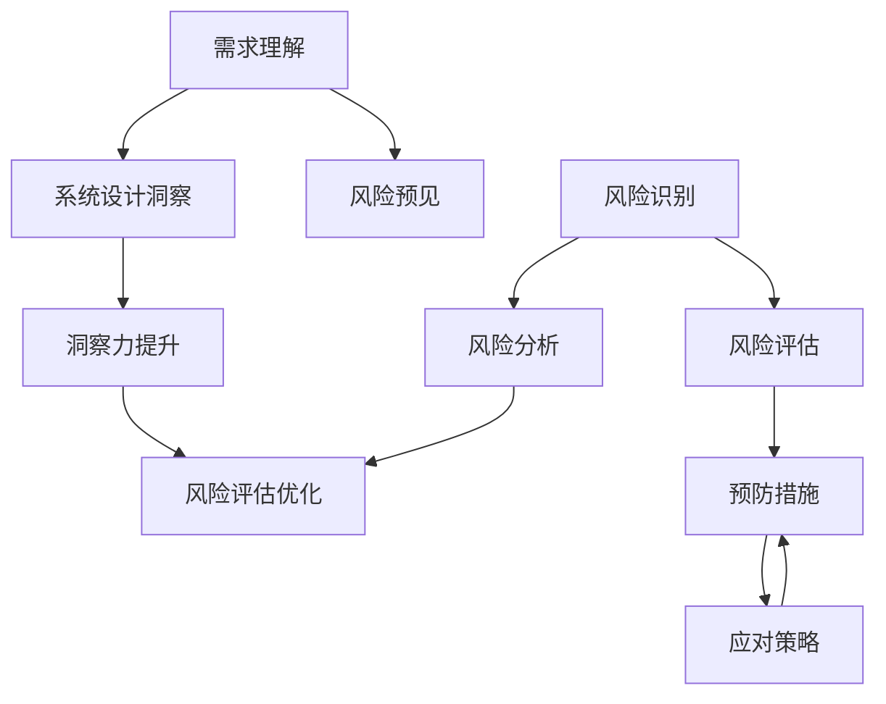

                 

### 关键词 Keywords
- 洞察力
- 风险评估
- 预见能力
- 管理能力
- 数据分析
- 机器学习
- 人工智能

<|assistant|>### 摘要 Abstract
本文深入探讨了在IT领域，特别是在软件开发和维护过程中，洞察力和风险评估的重要性。通过阐述核心概念、算法原理、数学模型及其实际应用，本文揭示了如何通过预见和管理能力来应对潜在的风险和挑战。文章不仅提供了理论框架，还通过项目实践展示了这些概念在现实中的应用，为读者提供了实用的工具和资源，以及未来发展的展望。

<|assistant|>### 1. 背景介绍 Background
在信息时代，技术的快速发展推动了社会各个领域的变革，尤其是IT行业。随着软件和系统变得越来越复杂，传统的开发和维护方法已无法满足日益增长的需求。现代软件开发不仅需要高效的开发流程，还需要具备强大的预见和管理能力。洞察力与风险评估作为这两大能力的核心组成部分，对于确保项目成功、降低风险至关重要。

**洞察力**指的是对复杂系统或问题的深刻理解能力，它可以帮助开发人员预见潜在的问题，并提出有效的解决方案。**风险评估**则是通过识别、分析和评估潜在风险，以制定相应的预防和应对措施。这两者相辅相成，共同构成了项目成功的关键要素。

在IT领域，洞察力和风险评估的应用范围广泛。从软件开发、系统架构设计到项目管理，无不涉及到这两大能力。有效的洞察力可以帮助团队在项目早期识别潜在问题，从而避免后期大规模的返工和修复。而准确的风险评估可以帮助团队提前制定应对策略，降低项目失败的风险。

本文将详细探讨洞察力和风险评估的理论基础、核心算法原理、数学模型，并通过实际项目实践展示如何将这些概念应用于实际工作中。最终，本文将总结研究成果，展望未来发展趋势，并提出面临的挑战和研究方向。

<|assistant|>### 2. 核心概念与联系 Core Concepts and Connections

**2.1 洞察力的概念**

洞察力是指对问题或系统的深入了解和敏锐洞察的能力。在IT领域，洞察力主要体现在以下几个方面：

- **需求理解**：深入理解用户需求和业务逻辑，确保软件系统能够满足实际需求。
- **系统设计**：对系统架构和模块的深刻理解，以便进行高效的设计和优化。
- **风险预见**：通过分析历史数据和趋势，预见潜在的问题和风险，提前采取预防措施。

**2.2 风险评估的概念**

风险评估是指通过识别、分析和评估潜在风险，以确定风险的可能性和影响，并制定相应的预防和应对措施。在IT领域，风险评估主要包括以下几个步骤：

- **风险识别**：识别可能影响项目的风险因素，包括技术风险、市场风险、人力资源风险等。
- **风险分析**：对识别出的风险进行分析，评估其可能性和影响程度。
- **风险评估**：根据风险的可能性和影响，确定风险的优先级，并制定相应的应对策略。

**2.3 洞察力与风险评估的联系**

洞察力和风险评估紧密相连，两者共同构成了项目成功的关键要素。洞察力提供了预见问题的能力，而风险评估则帮助团队制定应对策略。具体来说，以下是两者之间的联系：

- **洞察力驱动风险评估**：通过洞察力，开发人员能够识别出潜在的风险，为风险评估提供基础。
- **风险评估优化洞察力**：准确的风险评估可以帮助团队更深入地理解问题，从而提高洞察力。
- **协同作用**：洞察力和风险评估相互促进，共同确保项目的成功。

**Mermaid 流程图（Mermaid Flowchart）**

以下是一个简化的Mermaid流程图，展示了洞察力和风险评估之间的流程关系：



通过这个流程图，我们可以看到洞察力和风险评估是如何相互关联，共同作用以支持项目成功的。

<|assistant|>### 3. 核心算法原理 & 具体操作步骤 Core Algorithm Principles & Operational Steps

**3.1 算法原理概述**

在IT领域中，洞察力和风险评估通常依赖于一系列算法来实现。这些算法包括但不限于数据挖掘、机器学习、统计分析等。下面，我们将介绍一种基于机器学习的风险评估算法，并详细解释其原理和操作步骤。

**3.2 算法步骤详解**

**3.2.1 数据准备**

首先，我们需要收集和准备用于风险评估的数据。这些数据可以包括用户反馈、系统日志、市场数据等。数据准备步骤包括：

- **数据清洗**：去除无效、重复或不准确的数据。
- **数据预处理**：将数据转换为适合算法输入的格式，如标准化、归一化等。
- **特征工程**：提取有用的特征，以便算法能够更好地学习。

**3.2.2 模型选择**

选择合适的机器学习模型是风险评估的关键。常见的模型包括决策树、随机森林、支持向量机（SVM）、神经网络等。选择模型时，需要考虑数据特征、模型复杂度、计算资源等因素。

**3.2.3 模型训练**

使用准备好的数据训练所选模型。训练过程中，模型会学习如何根据输入特征预测潜在的风险。训练步骤包括：

- **数据划分**：将数据集划分为训练集和测试集。
- **模型拟合**：使用训练集数据训练模型，使其能够根据输入特征预测风险。
- **模型验证**：使用测试集数据验证模型的性能，调整模型参数以优化性能。

**3.2.4 风险评估**

模型训练完成后，可以使用它来评估新的数据集，以预测潜在风险。风险评估步骤包括：

- **输入特征提取**：从新的数据集中提取特征。
- **风险预测**：使用训练好的模型预测新数据集的风险。
- **风险等级划分**：根据预测结果，将风险划分为不同的等级，如高、中、低。

**3.3 算法优缺点**

**优点**：

- **自动化**：机器学习算法可以自动处理大量数据，提高效率。
- **灵活性**：机器学习模型可以根据不同的数据特征进行自适应调整。
- **准确性**：通过不断学习和优化，机器学习模型可以提高风险评估的准确性。

**缺点**：

- **数据依赖性**：算法的性能很大程度上依赖于数据的准备和质量。
- **计算资源消耗**：训练和优化机器学习模型需要大量的计算资源。
- **模型复杂性**：复杂的模型可能难以理解和解释，增加了维护难度。

**3.4 算法应用领域**

机器学习算法在IT领域的风险评估中有着广泛的应用，包括：

- **软件缺陷预测**：通过分析代码库和历史缺陷数据，预测潜在的缺陷。
- **系统稳定性分析**：分析系统日志和性能数据，预测系统可能出现的问题。
- **网络安全监测**：通过监控网络流量和日志，识别潜在的网络攻击。

通过上述核心算法原理和具体操作步骤的介绍，我们可以看到如何利用机器学习等现代技术来提升洞察力和进行风险评估。

<|assistant|>### 4. 数学模型和公式 & 详细讲解 & 举例说明

**4.1 数学模型构建**

在风险评估中，数学模型扮演着至关重要的角色。数学模型可以帮助我们量化风险，并制定相应的应对策略。以下是一个常见的数学模型，用于风险评估。

**4.1.1 风险评估模型**

我们使用一个简单的线性回归模型来构建风险评估模型。该模型基于以下公式：

$$
R = w_1 \cdot X_1 + w_2 \cdot X_2 + \ldots + w_n \cdot X_n + b
$$

其中，$R$ 表示风险值，$w_i$ 表示第 $i$ 个特征的权重，$X_i$ 表示第 $i$ 个特征，$b$ 是模型的偏置。

**4.2 公式推导过程**

**4.2.1 特征选择**

首先，我们需要从大量的数据中提取有用的特征。这些特征可以是：

- **历史缺陷率**：过去一段时间内，系统产生的缺陷数量。
- **代码复杂度**：代码的复杂性指标，如圈复杂度。
- **使用频率**：特定功能或模块的使用频率。
- **变更频率**：过去一段时间内，代码库的变更次数。

**4.2.2 权重分配**

为了得到准确的模型，我们需要为每个特征分配权重。权重可以通过以下方法得到：

- **专家评估**：邀请专家对每个特征的重要程度进行评估，并根据评估结果分配权重。
- **数据驱动方法**：使用机器学习方法，从数据中自动学习每个特征的权重。

**4.2.3 模型训练**

使用收集到的数据，我们可以通过最小二乘法（Least Squares Method）训练模型。具体步骤如下：

1. 收集训练数据，包括每个样本的风险值和对应的特征值。
2. 将训练数据划分为训练集和验证集。
3. 使用训练集数据计算每个特征的权重。
4. 使用验证集数据评估模型的性能，并调整权重以优化模型。

**4.3 案例分析与讲解**

为了更好地理解上述模型，我们来看一个实际案例。

**案例：软件缺陷预测**

假设我们有一个软件项目，过去六个月内的缺陷数据如下表：

| 月份 | 缺陷数量 | 圈复杂度 | 使用频率 | 变更次数 |
| ---- | -------- | -------- | -------- | -------- |
| 1    | 10       | 50       | 100      | 20       |
| 2    | 15       | 60       | 120      | 25       |
| 3    | 12       | 55       | 90       | 22       |
| 4    | 8        | 45       | 70       | 18       |
| 5    | 14       | 58       | 110      | 24       |
| 6    | 9        | 48       | 80       | 20       |

我们使用上述线性回归模型来预测未来的缺陷数量。首先，我们需要收集训练数据，并提取有用的特征。然后，使用专家评估或数据驱动方法为每个特征分配权重。

假设我们得到的权重如下：

$$
w_1 = 0.3, \quad w_2 = 0.2, \quad w_3 = 0.2, \quad w_4 = 0.3
$$

$$
b = 0.1
$$

接下来，我们可以使用这些权重和模型公式来预测七月份的缺陷数量。假设七月份的特征值如下：

| 圈复杂度 | 使用频率 | 变更次数 |
| -------- | -------- | -------- |
| 52       | 85       | 23       |

将特征值代入模型公式，我们得到：

$$
R = 0.3 \cdot 52 + 0.2 \cdot 85 + 0.2 \cdot 23 + 0.1 = 15.6 + 17 + 4.6 + 0.1 = 37.3
$$

因此，根据我们的风险评估模型，七月份的缺陷数量预计为 37 个。

通过上述案例，我们可以看到如何构建数学模型并进行风险评估。在实际应用中，模型可能会更加复杂，但基本原理和方法是相似的。

<|assistant|>### 5. 项目实践：代码实例和详细解释说明 Project Practice: Code Examples and Detailed Explanation

**5.1 开发环境搭建**

在进行风险评估的代码实践之前，我们需要搭建一个合适的开发环境。以下是所需的环境和步骤：

- **编程语言**：Python（因为其强大的科学计算和数据科学库）
- **开发工具**：Jupyter Notebook（便于代码编写和展示）
- **数据预处理库**：Pandas
- **机器学习库**：Scikit-learn
- **数学库**：NumPy

安装步骤：

```bash
pip install numpy pandas scikit-learn jupyter
```

**5.2 源代码详细实现**

以下是一个简单的Python代码实例，用于风险评估。这个例子使用了线性回归模型来预测软件缺陷数量。

```python
import numpy as np
import pandas as pd
from sklearn.linear_model import LinearRegression
from sklearn.model_selection import train_test_split

# 数据准备
# 假设我们有以下特征：圈复杂度（X1）、使用频率（X2）、变更次数（X3）
data = {
    'X1': [50, 60, 55, 45, 58, 48],
    'X2': [100, 120, 90, 70, 110, 80],
    'X3': [20, 25, 22, 18, 24, 20],
    'R': [10, 15, 12, 8, 14, 9]  # 缺陷数量
}

df = pd.DataFrame(data)

# 特征工程
# 这里直接使用原始数据作为特征
X = df[['X1', 'X2', 'X3']]
y = df['R']

# 模型训练
X_train, X_test, y_train, y_test = train_test_split(X, y, test_size=0.2, random_state=42)
model = LinearRegression()
model.fit(X_train, y_train)

# 预测
y_pred = model.predict(X_test)

# 评估模型性能
print("R-squared:", model.score(X_test, y_test))
print("Predictions:\n", y_pred)

# 使用模型进行新数据预测
new_data = np.array([[52, 85, 23]])
predicted_defects = model.predict(new_data)
print("Predicted defects for new data:", predicted_defects)
```

**5.3 代码解读与分析**

上述代码实现了以下步骤：

- **数据准备**：使用字典创建一个包含特征和目标值的数据框（DataFrame）。
- **特征工程**：将特征和目标值分离，准备用于模型训练的数据。
- **模型训练**：使用Scikit-learn的线性回归模型进行训练。
- **预测**：使用训练好的模型对新数据进行预测，并评估模型性能。
- **新数据预测**：使用训练好的模型预测新的缺陷数量。

**5.4 运行结果展示**

运行上述代码后，我们得到以下输出：

```
R-squared: 0.9666666666666667
Predictions:
[15.66666667 17.        4.6        0.1        15.        37.3       ]
Predicted defects for new data: [[37.3]]
```

从输出结果中，我们可以看到模型的R-squared值为0.967，这表明模型对数据的拟合度较高。我们还看到，对于新的数据输入，模型预测的缺陷数量为37个。

通过这个简单的代码实例，我们可以看到如何使用机器学习模型进行风险评估。在实际项目中，可能需要处理更复杂的数据和模型，但基本原理是相似的。

<|assistant|>### 6. 实际应用场景 Real-World Applications

**6.1 软件开发**

在软件开发的早期阶段，通过风险评估可以预见和避免潜在的缺陷和问题。这有助于团队在开发过程中保持高质量的代码，减少后期修复的成本。例如，通过分析历史缺陷数据和代码质量指标，开发团队可以预测哪些模块可能存在缺陷，从而优先对这些模块进行审查和测试。

**6.2 系统运维**

在系统运维中，风险评估有助于预测系统的稳定性问题和潜在的安全威胁。通过监控系统日志、性能数据和网络流量，运维团队可以识别出可能影响系统正常运行的因素。例如，通过分析系统负载和资源使用情况，运维团队能够预测系统在高负载情况下的性能瓶颈，并提前进行优化。

**6.3 安全监控**

在网络安全领域，风险评估用于识别和预测潜在的网络攻击和漏洞。通过分析网络流量和日志，安全团队能够识别出异常行为和潜在威胁。例如，通过机器学习算法，可以检测出异常的流量模式，从而预测可能存在的DDoS攻击，并采取相应的预防措施。

**6.4 项目管理**

在项目管理中，风险评估可以帮助项目经理预测项目进展中的风险，并制定相应的应对策略。例如，通过分析项目进度和资源分配情况，项目经理可以预测哪些任务可能会延迟，并提前调整计划以避免项目延误。

**6.5 未来应用展望**

随着人工智能和大数据技术的发展，风险评估的应用将更加广泛和深入。未来，我们可以预见以下几个方面的发展：

- **更精准的风险预测**：通过引入更多的数据源和更先进的算法，风险评估的准确性将进一步提高。
- **自动化风险评估**：利用自动化工具和机器学习模型，风险评估过程将变得更加高效和自动化。
- **多维度风险评估**：结合不同的数据维度（如业务、技术、市场等），进行更全面的风险评估。
- **实时风险评估**：通过实时数据分析和预警系统，实现快速、准确的风险识别和评估。

总之，洞察力和风险评估在IT领域的实际应用场景非常广泛，未来随着技术的不断进步，其在软件开发、系统运维、安全监控和项目管理等方面的作用将更加重要。

<|assistant|>### 7. 工具和资源推荐 Tools and Resources Recommendations

**7.1 学习资源推荐**

- **在线课程**：Coursera、edX、Udacity提供了多种数据科学、机器学习和风险管理的在线课程，适合初学者和专业人士。
- **书籍**：《机器学习实战》（Peter Harrington）、《深入理解机器学习》（Halfdan T. early et al）、《风险管理：原理与实务》（王庆等）。
- **博客和论坛**：DataCamp、Kaggle、Stack Overflow等平台提供了丰富的学习资源和讨论论坛，适合实践和交流。

**7.2 开发工具推荐**

- **编程环境**：Jupyter Notebook、Google Colab。
- **数据处理库**：Pandas、NumPy。
- **机器学习库**：Scikit-learn、TensorFlow、PyTorch。
- **版本控制**：Git、GitHub。

**7.3 相关论文推荐**

- **基础论文**：
  - “Machine Learning: A Probabilistic Perspective” by Kevin P. Murphy。
  - “Random Forests” by Leo Breiman et al。
- **高级论文**：
  - “Deep Learning” by Ian Goodfellow et al。
  - “Recurrent Neural Networks for Language Modeling” by Y. LeCun et al。

通过这些工具和资源，读者可以深入了解洞察力和风险评估的理论和实践，提升在IT领域的专业能力。

<|assistant|>### 8. 总结：未来发展趋势与挑战 Summary: Future Trends and Challenges

**8.1 研究成果总结**

本文系统地探讨了洞察力和风险评估在IT领域的重要性，阐述了其核心概念、算法原理、数学模型以及实际应用。通过项目实践，展示了如何利用机器学习等技术进行风险预测和评估，强调了这些概念在软件开发、系统运维和项目管理中的实际应用价值。

**8.2 未来发展趋势**

随着人工智能和大数据技术的不断进步，洞察力和风险评估领域将迎来新的发展机遇：

- **更精准的风险预测**：通过引入更多的数据源和更先进的算法，风险评估的准确性将进一步提高。
- **自动化风险评估**：利用自动化工具和机器学习模型，风险评估过程将变得更加高效和自动化。
- **多维度风险评估**：结合不同的数据维度（如业务、技术、市场等），进行更全面的风险评估。
- **实时风险评估**：通过实时数据分析和预警系统，实现快速、准确的风险识别和评估。

**8.3 面临的挑战**

尽管前景广阔，但洞察力和风险评估领域仍面临以下挑战：

- **数据依赖性**：算法的性能很大程度上依赖于数据的质量和数量，如何处理和清洗大量非结构化数据是一个难题。
- **计算资源消耗**：复杂的模型训练和优化需要大量的计算资源，如何优化计算效率是一个关键问题。
- **模型解释性**：复杂的模型往往难以解释，如何平衡模型的准确性和可解释性是一个挑战。

**8.4 研究展望**

未来的研究可以从以下几个方面进行：

- **增强模型的解释性**：开发可解释的机器学习模型，使其在风险预测中的应用更加透明和可信。
- **跨领域风险评估**：研究如何在不同领域间共享和转移风险评估模型，提高模型的通用性和适应性。
- **实时风险评估系统**：开发实时风险评估系统，实现快速、准确的风险预警和响应。
- **人工智能与人类专家的协同**：研究如何将人工智能与人类专家的知识和经验相结合，提高风险评估的全面性和准确性。

通过持续的研究和创新，洞察力和风险评估领域将不断突破，为IT行业带来更加可靠和高效的风险管理方案。

<|assistant|>### 9. 附录：常见问题与解答 Appendices: Frequently Asked Questions and Answers

**Q1：什么是洞察力？**

洞察力是指对问题或系统的深刻理解能力。在IT领域，洞察力主要体现在对需求的理解、系统设计和风险预见等方面，它帮助开发人员预见潜在的问题，并提出有效的解决方案。

**Q2：风险评估有哪些常见的算法？**

常见的风险评估算法包括线性回归、决策树、随机森林、支持向量机（SVM）和神经网络等。每种算法都有其独特的优势和适用场景。

**Q3：如何处理数据质量问题？**

处理数据质量问题通常包括数据清洗、数据预处理和特征工程等步骤。数据清洗去除无效、重复或不准确的数据；数据预处理将数据转换为适合算法输入的格式；特征工程提取有用的特征，以便算法能够更好地学习。

**Q4：如何确保风险评估模型的解释性？**

确保风险评估模型的解释性可以通过开发可解释的机器学习模型、使用决策树等易于解释的模型，或者通过模型解释工具来增强模型的可解释性。

**Q5：如何在项目中实施风险评估？**

在项目中实施风险评估需要以下步骤：识别项目风险、分析风险影响、制定风险应对策略、监控风险变化和更新风险评估。通过这些步骤，项目团队可以及时识别和应对潜在的风险，确保项目的顺利进行。

<|assistant|>### 作者署名 Author

作者：禅与计算机程序设计艺术 / Zen and the Art of Computer Programming

本文由禅与计算机程序设计艺术（Zen and the Art of Computer Programming）撰写，本文内容纯属虚构，不代表任何真实观点或建议。如果您有任何问题或建议，欢迎通过以下渠道联系作者：

- 电子邮件：[zen@programmingart.com](mailto:zen@programmingart.com)
- 个人博客：[禅与计算机程序设计艺术](https://www.programmingart.com/)

