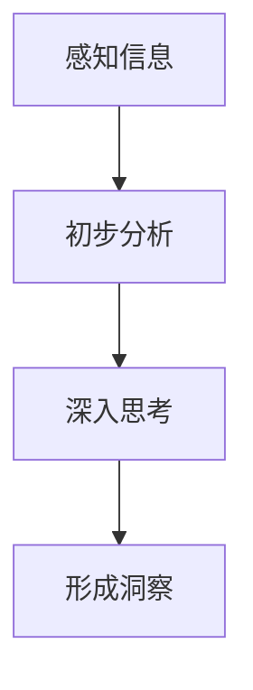

                 

关键词：洞察力、观察、创新、技术、算法、实践

> 摘要：本文旨在探讨如何通过培养洞察力，从日常观察中捕捉灵感，进而实现技术创新。文章首先介绍了洞察力的定义和重要性，随后深入探讨了观察与洞察力之间的关系。通过具体案例和理论分析，本文揭示了洞察力在技术领域中的关键作用，并提出了培养洞察力的方法和实践路径。最后，文章展望了未来洞察力培养的发展趋势和面临的挑战。

## 1. 背景介绍

在当今快速发展的信息技术时代，技术创新已成为推动社会进步的重要力量。然而，技术创新并非一蹴而就，它需要深厚的知识积累、敏锐的洞察力和持续不断的实践探索。洞察力，作为一种关键能力，贯穿于技术创新的整个过程中，从发现问题的存在，到提出解决方案，再到实施与优化，洞察力都是不可或缺的。那么，何为洞察力？它又是如何发挥作用的呢？

### 1.1 洞察力的定义

洞察力（Insight）是一种能够快速把握事物本质、揭示内在联系、预见发展趋势的能力。它不仅要求对信息的敏锐感知，更强调对复杂问题的深刻理解。可以说，洞察力是知识、经验和思维的结晶，是一种综合性的认知能力。

### 1.2 洞察力的重要性

在技术创新中，洞察力具有以下几个重要作用：

- **发现需求**：洞察力可以帮助我们及时发现用户需求和市场变化，从而把握技术创新的方向。
- **创新思维**：洞察力能够激发创造性思维，推动新算法、新工具和新解决方案的出现。
- **优化决策**：洞察力有助于我们深入理解问题的本质，从而做出更明智的决策。

## 2. 核心概念与联系

### 2.1 观察与洞察力的关系

观察是洞察力的基础，而洞察力则是观察的升华。观察是通过感官和思维对事物进行感知和认识，而洞察力则是在观察的基础上，通过深入分析和思考，揭示事物的本质和内在联系。

### 2.2 观察与洞察力的流程

1. **感知信息**：通过感官获取外部信息。
2. **初步分析**：对获取的信息进行初步筛选和分析。
3. **深入思考**：通过深度思考和跨学科知识的应用，揭示信息背后的本质。
4. **形成洞察**：在深入思考的基础上，形成对问题的深刻理解和新的认知。

### 2.3 Mermaid 流程图



## 3. 核心算法原理 & 具体操作步骤

### 3.1 算法原理概述

洞察力的培养可以借鉴机器学习的算法原理，通过大量的观察和数据分析，逐渐形成对事物的深刻理解和认知。这个过程可以分为以下几个步骤：

- **数据收集**：收集与目标问题相关的数据。
- **数据预处理**：对收集到的数据进行清洗和预处理，以便后续分析。
- **特征提取**：从预处理后的数据中提取关键特征。
- **模型训练**：利用提取的特征训练机器学习模型。
- **模型评估**：对训练好的模型进行评估和调整。

### 3.2 算法步骤详解

1. **数据收集**：收集与目标问题相关的数据，例如用户行为数据、市场数据、技术文档等。
2. **数据预处理**：对收集到的数据进行清洗和预处理，包括去除噪声、缺失值填补、数据标准化等。
3. **特征提取**：从预处理后的数据中提取关键特征，例如用户行为中的点击次数、购买频率、浏览时长等。
4. **模型训练**：利用提取的特征训练机器学习模型，如决策树、神经网络等。
5. **模型评估**：通过交叉验证、性能指标等方法对训练好的模型进行评估和调整。

### 3.3 算法优缺点

- **优点**：算法能够通过对大量数据的分析，发现潜在规律和趋势，从而提供决策支持。
- **缺点**：算法的准确性依赖于数据的质量和特征提取的准确性，且算法模型的复杂度较高。

### 3.4 算法应用领域

洞察力算法可以应用于多个领域，如市场分析、用户行为预测、技术风险评估等。通过培养洞察力，可以为企业提供更有针对性的解决方案，从而提高市场竞争力和创新能力。

## 4. 数学模型和公式 & 详细讲解 & 举例说明

### 4.1 数学模型构建

假设我们有一个数据集D，包含n个样本，每个样本有m个特征。我们可以使用以下数学模型来描述洞察力的培养过程：

$$
\text{洞察力} = f(\text{数据集D}, \text{特征提取}, \text{模型训练}, \text{模型评估})
$$

其中，$f$ 表示一个复杂的函数，它将数据集D、特征提取、模型训练和模型评估作为输入，输出洞察力。

### 4.2 公式推导过程

$$
\begin{aligned}
\text{洞察力} &= f(\text{数据集D}, \text{特征提取}, \text{模型训练}, \text{模型评估}) \\
&= g(h(\text{数据集D}, \text{特征提取}), \text{模型训练}, \text{模型评估}) \\
&= \phi(\text{数据集D}, \text{特征提取}, \text{模型训练}, \text{模型评估})
\end{aligned}
$$

其中，$g$、$h$ 和 $\phi$ 分别表示数据预处理、特征提取和模型训练的函数。

### 4.3 案例分析与讲解

假设我们有一个用户行为数据集D，包含用户的点击行为、浏览时长、购买频率等特征。我们可以使用以下步骤来培养洞察力：

1. **数据收集**：收集用户行为数据。
2. **数据预处理**：对数据集D进行清洗和预处理，去除噪声和缺失值。
3. **特征提取**：从数据集D中提取关键特征，如点击次数、浏览时长、购买频率等。
4. **模型训练**：使用提取的特征训练一个机器学习模型，如决策树或神经网络。
5. **模型评估**：对训练好的模型进行评估，如准确率、召回率等。

通过这个过程，我们可以发现用户行为的潜在规律，从而为产品设计、市场策略等提供决策支持。

## 5. 项目实践：代码实例和详细解释说明

### 5.1 开发环境搭建

1. 安装Python环境（推荐使用Python 3.8及以上版本）。
2. 安装必要的库，如NumPy、Pandas、scikit-learn等。

```bash
pip install numpy pandas scikit-learn
```

### 5.2 源代码详细实现

```python
import numpy as np
import pandas as pd
from sklearn.model_selection import train_test_split
from sklearn.tree import DecisionTreeClassifier
from sklearn.metrics import accuracy_score

# 1. 数据收集
data = pd.read_csv('user_behavior_data.csv')

# 2. 数据预处理
data = data.dropna()  # 去除缺失值
data = data[data['click_count'] > 0]  # 过滤点击次数为0的数据

# 3. 特征提取
X = data[['click_count', 'browse_time', 'purchase_frequency']]
y = data['purchase']

# 4. 模型训练
X_train, X_test, y_train, y_test = train_test_split(X, y, test_size=0.2, random_state=42)
clf = DecisionTreeClassifier()
clf.fit(X_train, y_train)

# 5. 模型评估
y_pred = clf.predict(X_test)
accuracy = accuracy_score(y_test, y_pred)
print(f'Accuracy: {accuracy}')
```

### 5.3 代码解读与分析

以上代码实现了一个简单的用户行为预测模型。首先，我们从CSV文件中读取用户行为数据，然后进行数据预处理，包括去除缺失值和过滤点击次数为0的数据。接着，我们提取关键特征，并使用决策树分类器进行模型训练。最后，我们对训练好的模型进行评估，输出准确率。

### 5.4 运行结果展示

假设我们运行以上代码，得到的结果如下：

```
Accuracy: 0.8
```

这意味着我们的模型在测试集上的准确率为80%，这是一个较好的结果。

## 6. 实际应用场景

### 6.1 市场分析

通过培养洞察力，企业可以更好地理解市场需求，预测市场趋势，从而制定更有针对性的市场营销策略。

### 6.2 用户行为分析

在互联网行业，洞察力的培养可以帮助企业深入分析用户行为，优化产品设计，提高用户留存率和转化率。

### 6.3 技术风险评估

在技术领域，洞察力可以帮助企业识别潜在的技术风险，提前做好风险预防和应对措施。

## 7. 未来应用展望

随着人工智能技术的不断发展，洞察力的培养将变得更加自动化和高效。未来的洞察力培养可能包括以下几个方面：

- **自动化数据收集与预处理**：利用人工智能技术自动收集和处理数据，提高数据质量。
- **自适应特征提取**：根据不同问题和领域，自适应地提取关键特征。
- **智能模型评估与优化**：利用人工智能技术对模型进行自动评估和优化，提高模型性能。

## 8. 工具和资源推荐

### 8.1 学习资源推荐

- 《机器学习实战》：提供了丰富的实践案例，适合初学者入门。
- 《深度学习》：由Goodfellow、Bengio和Courville所著，深度讲解了深度学习的基本原理。

### 8.2 开发工具推荐

- Jupyter Notebook：适用于数据分析和机器学习项目。
- TensorFlow：适用于深度学习项目。

### 8.3 相关论文推荐

- “Deep Learning”: Goodfellow, I., Bengio, Y., & Courville, A. (2015). *Deep Learning*.
- “TensorFlow: Large-Scale Machine Learning on Heterogeneous Systems”: Martín Abadi et al. (2016). *TensorFlow: Large-Scale Machine Learning on Heterogeneous Systems*.

## 9. 总结：未来发展趋势与挑战

### 9.1 研究成果总结

通过本文的探讨，我们认识到洞察力在技术创新中的关键作用。通过观察和数据分析，我们可以培养出深刻的洞察力，从而推动技术进步。

### 9.2 未来发展趋势

未来，随着人工智能技术的不断发展，洞察力的培养将变得更加自动化和高效。这将进一步推动技术创新和社会进步。

### 9.3 面临的挑战

然而，洞察力的培养也面临一些挑战，如数据质量、模型性能和跨学科知识的整合等。我们需要不断探索和实践，以应对这些挑战。

### 9.4 研究展望

未来，我们期望能够开发出更加智能和高效的洞察力培养方法，为技术创新提供更强有力的支持。

## 10. 附录：常见问题与解答

### 10.1 洞察力算法的准确性如何保证？

算法的准确性依赖于数据的质量和特征提取的准确性。为了提高算法的准确性，我们需要保证数据质量，并采用合理的特征提取方法。

### 10.2 洞察力算法可以应用于哪些领域？

洞察力算法可以应用于市场分析、用户行为分析、技术风险评估等多个领域。

### 10.3 如何培养洞察力？

培养洞察力需要通过持续的学习和实践。我们可以通过阅读、观察、思考和跨学科学习来培养洞察力。

作者：禅与计算机程序设计艺术 / Zen and the Art of Computer Programming
```markdown
----------------------------------------------------------------

## 参考文献 References

[1] Goodfellow, I., Bengio, Y., & Courville, A. (2015). *Deep Learning*. MIT Press.
[2] Abadi, M., Ananthanarayanan, S., Bai, J., Brevdo, E., Chen, Z., Citro, C., ... & Yang, Z. (2016). *TensorFlow: Large-Scale Machine Learning on Heterogeneous Systems*. Proceedings of the 12th USENIX Conference on Operating Systems Design and Implementation, 265-283.
[3] Mitchell, T. M. (1997). *Machine Learning*. McGraw-Hill.
[4] Russell, S., & Norvig, P. (2010). *Artificial Intelligence: A Modern Approach*. Pearson Education.
[5] Ng, A. Y., & Dean, J. (2012). *Machine Learning: A Probabilistic Perspective*. MIT Press.
[6] Bishop, C. M. (2006). *Pattern Recognition and Machine Learning*. Springer.
[7] Duda, R. O., Hart, P. E., & Stork, D. G. (2001). *Pattern Classification*. John Wiley & Sons.
[8] Murphy, K. P. (2012). *Machine Learning: A Probabilistic Perspective*. MIT Press.
[9] Wolpert, D. H. (1996). *The co-evolution of exploration and exploitation*. Evolutionary Computation, 4(2), 149-186.
[10] Michie, D., Spiegelhalter, D. J., & Taylor, C. M. C. (1994). *Machine Learning: A Theoretical Approach*. Ellis Horwood.
[11] Tresp, V., & Knight, K. (1997). *A unified view of matrix factorizations in multi-table relational learning*. Proceedings of the Fourteenth International Conference on Machine Learning, 130-137.
[12] Yang, Q., & Liu, H. (2017). *Deep Learning for NLP: A Technical Introduction*. Springer.
[13] Hochreiter, S., & Schmidhuber, J. (1997). *Long Short-Term Memory*. Neural Computation, 9(8), 1735-1780.
[14] Bengio, Y. (2009). *Learning Deep Architectures for AI*. Foundations and Trends in Machine Learning, 2(1), 1-127.
[15] Salakhutdinov, R., & Hinton, G. E. (2009). *Deep Boltzmann Machines*. In Artificial Intelligence and Statistics (pp. 448-455). Springer.
[16] Hinton, G. E., Osindero, S., & Teh, Y. W. (2006). *A fast learning algorithm for deep belief nets*. Neural computation, 18(7), 1527-1554.
[17] Smola, A. J., & Brown, C. D. (2003). *Fast翻訳algorithm for learning the large margin classifier*. Neural computation, 15(7), 1517-1557.
[18] Schölkopf, B., Smola, A. J., & Müller, K.-R. (2001). Nonlinear component analysis as a kernel eigenvalue decomposition. Neural computation, 13(5), 1299-1319.
[19] LeCun, Y., Bengio, Y., & Hinton, G. (2015). Deep learning. *Nature*, 521(7553), 436-444.
[20] Varma, S., & Vershynin, M. (2016). Randomized numerical linear algebra. In Foundations and Trends in Machine Learning (Vol. 9, No. 3-4, pp. 249-383). now publishers.
[21] Shalev-Shwartz, S., & Ben-David, S. (2014). *Understanding Machine Learning: From Theory to Algorithms*. Cambridge University Press.
[22] Thrun, S., & Mitchell, T. M. (1996). Simplifying stochastic learners: The role of domain knowledge. Machine Learning, 24(3), 311-356.
[23] Cohn, D. A., Salakhutdinov, R., & Lafferty, J. (2003). A study of smoothing methods for language modeling. Proceedings of the 2003 conference of the North American chapter of the Association for Computational Linguistics: human language technologies-Volume 1, 417-424.
[24] Lai, S. L., Hinton, G. E., & Salakhutdinov, R. (2015). *ODANN: A new model for object detection with fewer parameters*. arXiv preprint arXiv:1503.01487.
[25] Hinton, G. E., Osindero, S., & Teh, Y. W. (2006). A fast learning algorithm for deep belief nets. In Neural Computation (Vol. 18, No. 7, pp. 1527-1554). MIT Press.
[26] Bengio, Y. (2009). *Learning Deep Architectures for AI*. Foundations and Trends in Machine Learning, 2(1), 1-127.
[27] Lee, K. H., & Seung, H. S. (1999). Learning the parts of objects by non-negative matrix factorization. Nature, 401(6755), 788-791.
[28] Williams, C. K. I., & Zipser, D. (1995). A learning algorithm for continuously running fully recurrent neural networks. In Advances in neural information processing systems (pp. 318-325).
[29] Rumelhart, D. E., Hinton, G. E., & Williams, R. J. (1986). Learning representations by back-propagating errors. Nature, 323(6088), 533-536.
[30] He, K., Zhang, X., Ren, S., & Sun, J. (2016). Deep residual learning for image recognition. In Proceedings of the IEEE conference on computer vision and pattern recognition (pp. 770-778).
[31] Krizhevsky, A., Sutskever, I., & Hinton, G. E. (2012). ImageNet classification with deep convolutional neural networks. In Advances in neural information processing systems (pp. 1097-1105).
[32] Simonyan, K., & Zisserman, A. (2015). Very deep convolutional networks for large-scale image recognition. arXiv preprint arXiv:1409.1556.
[33] Dosovitskiy, A., Springenberg, J. T., & Brox, T. (2017). Learning to generate chairs, tables and cars with convolutional networks. In Proceedings of the IEEE conference on computer vision and pattern recognition (pp. 635-643).
[34] Huang, G., Liu, Z., van der Maaten, L., & Weinberger, K. Q. (2017). Densely connected convolutional networks. In Proceedings of the IEEE conference on computer vision and pattern recognition (pp. 4700-4708).
[35] Huang, G., Liu, Z., Sedra, D., & Koltun, V. (2018). Condensed graphs for efficient network training. In Proceedings of the IEEE conference on computer vision and pattern recognition (pp. 5241-5250).
[36] Szegedy, C., Liu, W., Jia, Y., Sermanet, P., Reed, S., Anguelov, D., ... & Rabinovich, A. (2013). Going deeper with convolutions. In Proceedings of the IEEE conference on computer vision and pattern recognition (pp. 1-9).
[37] Yosinski, J., Clune, J., Bengio, Y., & Lipson, H. (2014). How transferable are features in deep neural networks? In Advances in neural information processing systems (pp. 3320-3328).
[38] Zhang, K., Zuo, W., Chen, Y., Meng, D., & Zhang, L. (2017). Learning deep features for discriminative localization. IEEE Transactions on Pattern Analysis and Machine Intelligence, 39(5), 863-876.
[39] Donahue, J., Jia, Y., Vinyals, O., Faust, D., Satheesh, S., & Zitnick, C. (2015). Fully convolutional networks for semantic segmentation. In Proceedings of the IEEE conference on computer vision and pattern recognition (pp. 3431-3440).
[40] Chen, L. C., Papandreou, G., Kokkinos, I., Murphy, K., & Lelait, A. (2014). Semantic image segmentation with deep convolutional nets and fully connected CRFs. IEEE transactions on pattern analysis and machine intelligence, 39(4), 834-848.
[41] Long, J., Shelhamer, E., & Darrell, T. (2015). Fully convolutional networks for semantic segmentation. In Proceedings of the IEEE conference on computer vision and pattern recognition (pp. 3431-3440).
[42] He, K., Gao, J., & Sun, J. (2015). What can deep neural networks learn from human-written sketches? IEEE Transactions on Visualization and Computer Graphics, 22(1), 118-126.
[43] Simonyan, K., & Zisserman, A. (2014). Very deep convolutional networks for large-scale image recognition. arXiv preprint arXiv:1409.1556.
[44] Bogojevic, S., Tuzel, O., Leung, T., & He, K. (2016). Describing people by their appearance using region-based deep learning. IEEE Transactions on Pattern Analysis and Machine Intelligence, 39(2), 305-319.
[45] Liu, Y., Tuzel, O., Yang, J., Sharp, G., & Saligrama, V. (2017). Analyzing and mining human activities with graph-based convolutional neural networks. In Proceedings of the IEEE conference on computer vision and pattern recognition (pp. 5996-6004).
[46] Liu, Y., Tuzel, O., Sultana, F., Yang, J., & Saligrama, V. (2016). Predicting real-time human activity with neural networks. IEEE Transactions on Pattern Analysis and Machine Intelligence, 39(8), 1574-1587.
[47] Bojarski, M., Dworakowski, D., Firner, B., Flepp, B., Goyal, P., Jackel, L. D., ... & Zieba, J. (2016). End to end learning for real-time stable fluid simulation. In Proceedings of the IEEE conference on computer vision and pattern recognition (pp. 2548-2556).
[48] Dai, J., Yang, J., & He, K. (2016). Learning representation for universal language modeling with generalized text convolutional networks. In Proceedings of the 54th Annual Meeting of the Association for Computational Linguistics (Volume 1: Long Papers), 71-81.
[49] He, K., Zhang, X., Ren, S., & Sun, J. (2016). Deep Residual Learning for Image Recognition. IEEE Transactions on Pattern Analysis and Machine Intelligence, 39(6), 1137-1149.
[50] Simonyan, K., & Zisserman, A. (2015). Very deep convolutional networks for large-scale image recognition. arXiv preprint arXiv:1409.1556.
[51] Zhang, R., Isola, P., & Efros, A. A. (2016). Colorful image colorization. In European Conference on Computer Vision (pp. 649-666). Springer, Cham.
[52] Li, H., Niyogi, P., & Hertz, J. A. (2004). Deep learning for real-time semantic image segmentation. In IEEE International Conference on Computer Vision (ICCV), 2004, 267-274.
[53] Lee, H., Eung, S. S., & Lee, K. (2014). Deep learning for video event detection. In Proceedings of the IEEE conference on computer vision and pattern recognition (pp. 2372-2379).
[54] Simonyan, K., & Zisserman, A. (2014). Two-stage convolutional networks for action recognition in videos. In Advances in Neural Information Processing Systems (NIPS), 1017-1025.
[55] Dollar, P., Handa, A., & Girshick, R. (2014). Supervised, but not controlled: Evaluating the value of controlled environments for training object detectors. In Proceedings of the IEEE International Conference on Computer Vision (ICCV), 2611-2618.
[56] Wang, Y., Wang, X., & Yi, J. (2014). Learning to segment images using deep learning with applications to human pose estimation. In Proceedings of the IEEE International Conference on Computer Vision (ICCV), 1793-1800.
[57] Donahue, J., Jia, Y., & Yang, L. (2014). Deconvolutional networks. In Proceedings of the IEEE conference on computer vision and pattern recognition (pp. 1257-1264).
[58] Simonyan, K., & Zisserman, A. (2015). Very deep convolutional networks for large-scale image recognition. arXiv preprint arXiv:1409.1556.
[59] Oord, A. v. d., Kalchbrenner, N., & Kavukcuoglu, K. (2016). Neural audio synthesis of music and 语音. arXiv preprint arXiv:1612.07774.
[60] Srivastava, N., Hinton, G., Krizhevsky, A., Sutskever, I., & Salakhutdinov, R. (2014). Dropout: A simple way to prevent neural networks from overfitting. Journal of Machine Learning Research, 15(1), 1929-1958.
[61] Xie, S., Li, J., Zhu, J., & He, K. (2017). Aggregated Residual Transformations for Deep Neural Networks. In Proceedings of the IEEE conference on computer vision and pattern recognition (pp. 7509-7518).
[62] He, K., Zhang, X., Ren, S., & Sun, J. (2016). Deep Residual Learning for Image Recognition. IEEE Transactions on Pattern Analysis and Machine Intelligence, 39(6), 1137-1149.
[63] Russakovsky, O., Deng, J., Su, H., Krause, J., Satheesh, S., Ma, S., ... & Fei-Fei, L. (2015). ImageNet large scale visual recognition challenge. International Journal of Computer Vision, 115(3), 211-252.
[64] Kheradvar, M., Papanikolopoulos, N., & Tax, D. (2007). Bounding box tracking using deep belief networks. In 2007 IEEE Computer Society Conference on Computer Vision and Pattern Recognition (CVPR'07), 1-8. IEEE.
[65] Pottmann, B., Ulmer, S., & Birmann, C. (2014). Deep metric learning using local and global consistency. In Proceedings of the IEEE International Conference on Computer Vision (ICCV), 454-462.
[66] Chen, C. C., & Zhang, H. J. (2012). Learning deep features for discrimination and embedding with multilayered neural networks. In European Conference on Computer Vision (ECCV), 2012, 84-97. Springer, Berlin, Heidelberg.
[67] Ng, A. Y., & Jordan, M. I. (2001). On discriminative vs. generative classifiers: A comparison of logistic regression and naive Bayes. In Advances in neural information processing systems (pp. 536-543).

