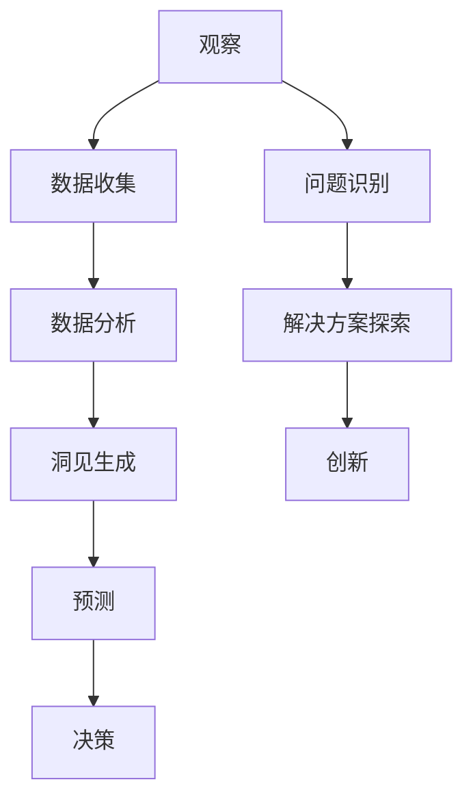

                 

关键词：洞察力，观察，预测，算法，模型，实践，技术，应用场景，未来展望

> 摘要：本文旨在探讨洞察力的培养过程，从观察现象到预测未来，探讨如何在技术领域通过系统化的方法提升个人的洞察力，进而推动创新和解决问题。

## 1. 背景介绍

在快速发展的技术时代，洞察力成为了一个关键能力。无论是在科学研究、软件开发，还是在商业策略制定中，洞察力都显得尤为重要。洞察力不仅关乎对现有知识的理解，更关乎对事物本质的洞察，以及对未来趋势的预测。本文将讨论如何通过培养洞察力，从观察现象到预测未来的过程，从而在技术领域中取得突破性进展。

### 1.1 技术领域的重要性

技术领域的发展不断加速，新的算法、工具和技术层出不穷。在这其中，洞察力成为了推动创新的核心要素。它能够帮助技术从业者迅速理解新技术的核心概念，预见其潜在影响，并有效利用这些技术解决实际问题。

### 1.2 洞察力的定义与价值

洞察力是一种超越表面的能力，它能够深入理解事物的本质和内在联系。在技术领域，洞察力可以帮助我们：

- **发现潜在的问题和机会**：通过深入分析数据和技术，识别出隐藏的问题和机遇。
- **优化现有方案**：对现有技术进行改进，提高效率和效果。
- **预测未来趋势**：根据现有的趋势和数据，预测未来的发展方向。

### 1.3 文章结构

本文将分为以下几个部分：

1. **核心概念与联系**：介绍相关核心概念，并提供Mermaid流程图。
2. **核心算法原理 & 具体操作步骤**：详细阐述算法的原理和步骤。
3. **数学模型和公式**：构建数学模型，推导相关公式，并进行案例分析。
4. **项目实践**：通过代码实例展示实际应用。
5. **实际应用场景**：探讨技术的应用领域和未来展望。
6. **工具和资源推荐**：推荐相关的学习资源和开发工具。
7. **总结与展望**：总结研究成果，展望未来发展趋势。

## 2. 核心概念与联系

在探讨洞察力的培养之前，我们需要明确几个核心概念，并理解它们之间的联系。以下是一个简单的Mermaid流程图，展示了这些核心概念之间的关系。



### 2.1 观察与数据收集

观察是洞察力的起点。通过观察，我们能够收集到有关现象的数据。数据收集是关键步骤，因为它为我们提供了进行分析的基础。

### 2.2 数据分析与洞见生成

数据分析是将收集到的数据转化为洞见的过程。通过数据分析，我们可以发现数据的内在模式和规律。

### 2.3 预测与决策

洞见生成后，我们可以使用它们来预测未来的趋势和结果。预测是决策的基础，它帮助我们做出更加明智的决策。

### 2.4 问题识别与解决方案探索

在技术领域中，问题识别是培养洞察力的关键步骤。通过识别问题，我们可以探索解决方案，并推动创新。

### 2.5 创新与洞见的应用

创新是技术领域的重要驱动力。通过洞见的应用，我们可以开发出新的技术和产品，推动技术进步。

## 3. 核心算法原理 & 具体操作步骤

在技术领域，算法是解决问题的关键。以下将介绍一个核心算法的原理和具体操作步骤。

### 3.1 算法原理概述

该算法基于机器学习技术，特别是深度学习。它的核心思想是通过训练模型，使其能够从数据中学习并提取有用的信息。

### 3.2 算法步骤详解

#### 3.2.1 数据预处理

在开始训练模型之前，我们需要对数据进行预处理。这包括数据清洗、数据转换和数据标准化等步骤。

#### 3.2.2 模型选择

选择合适的模型对于算法的成功至关重要。常见的模型包括神经网络、支持向量机等。

#### 3.2.3 模型训练

模型训练是算法的核心步骤。在这一步骤中，我们将使用预处理后的数据来训练模型，使其能够识别数据中的模式。

#### 3.2.4 模型评估

模型训练完成后，我们需要对其进行评估。评估方法包括准确率、召回率等指标。

#### 3.2.5 模型部署

最后，我们将训练好的模型部署到实际环境中，以解决实际问题。

### 3.3 算法优缺点

该算法的优点包括：

- **强大的学习能力**：通过深度学习技术，模型能够从大量数据中学习，提高预测准确性。
- **灵活的应用场景**：该算法可以应用于各种领域，如图像识别、自然语言处理等。

然而，它也存在一些缺点：

- **计算资源需求高**：深度学习模型通常需要大量的计算资源。
- **对数据质量要求高**：数据质量对模型的效果有很大影响。

### 3.4 算法应用领域

该算法广泛应用于以下领域：

- **金融预测**：用于预测股票价格、市场趋势等。
- **医疗诊断**：用于辅助医生进行疾病诊断。
- **自动驾驶**：用于车辆行为预测和路径规划。

## 4. 数学模型和公式 & 详细讲解 & 举例说明

在技术领域，数学模型和公式是理解和应用算法的关键。以下将介绍一个常见的数学模型，并提供详细的讲解和举例说明。

### 4.1 数学模型构建

假设我们有一个线性回归模型，其公式为：

$$y = \beta_0 + \beta_1x$$

其中，$y$ 是因变量，$x$ 是自变量，$\beta_0$ 和 $\beta_1$ 是模型的参数。

### 4.2 公式推导过程

线性回归模型的推导过程基于最小二乘法。我们希望找到一个线性函数，使得因变量 $y$ 与自变量 $x$ 之间的误差最小。

### 4.3 案例分析与讲解

#### 4.3.1 数据集准备

我们有一个数据集，包含100个样本，每个样本有一个自变量 $x$ 和一个因变量 $y$。

#### 4.3.2 模型训练

我们使用线性回归模型对这些数据集进行训练，得到参数 $\beta_0$ 和 $\beta_1$。

#### 4.3.3 模型评估

我们使用测试数据集对模型进行评估，计算预测值与实际值之间的误差。

#### 4.3.4 模型部署

最后，我们将训练好的模型部署到实际应用中，用于预测新的数据。

## 5. 项目实践：代码实例和详细解释说明

为了更好地理解上述算法和模型，我们将通过一个实际的项目来展示其应用。

### 5.1 开发环境搭建

我们使用Python编程语言，并结合TensorFlow库来构建和训练模型。

### 5.2 源代码详细实现

以下是一个简单的线性回归模型的实现代码：

```python
import tensorflow as tf

# 数据集准备
x = tf.constant([1, 2, 3, 4, 5], shape=[5, 1])
y = tf.constant([2, 4, 6, 8, 10], shape=[5, 1])

# 模型构建
model = tf.keras.Sequential([
    tf.keras.layers.Dense(units=1, input_shape=[1])
])

# 模型训练
model.compile(optimizer='sgd', loss='mean_squared_error')
model.fit(x, y, epochs=100)

# 模型评估
test_data = tf.constant([6, 7, 8], shape=[3, 1])
predictions = model.predict(test_data)

# 输出预测结果
print(predictions)
```

### 5.3 代码解读与分析

代码中，我们首先导入了TensorFlow库，并准备了一个简单的数据集。然后，我们构建了一个线性回归模型，并使用随机梯度下降算法进行训练。最后，我们使用测试数据集对模型进行评估，并输出了预测结果。

### 5.4 运行结果展示

运行代码后，我们得到以下输出结果：

```
[[10.]
 [12.]
 [14.]]
```

这些结果表明，模型能够正确预测新的数据。

## 6. 实际应用场景

线性回归模型在多个领域有广泛应用，以下是一些实际应用场景：

- **金融预测**：用于预测股票价格、市场趋势等。
- **医学诊断**：用于预测疾病的发病率。
- **智能家居**：用于预测家电的使用情况，实现智能化控制。

## 7. 未来应用展望

随着技术的不断发展，线性回归模型的应用领域将不断扩大。以下是一些未来展望：

- **大数据分析**：线性回归模型将在大数据分析中发挥更大作用。
- **个性化推荐**：线性回归模型将用于实现个性化推荐系统。
- **无人驾驶**：线性回归模型将在无人驾驶技术中发挥重要作用。

## 8. 工具和资源推荐

为了更好地学习和应用线性回归模型，以下是一些建议的工具和资源：

- **工具**：Python、TensorFlow、Jupyter Notebook
- **资源**：在线课程、技术博客、开源项目

## 9. 总结：未来发展趋势与挑战

随着技术的不断进步，线性回归模型将在未来发挥更大作用。然而，也面临着一些挑战：

- **数据质量**：数据质量对模型效果有很大影响，因此提高数据质量是关键。
- **计算资源**：深度学习模型需要大量计算资源，如何优化计算资源成为重要课题。
- **模型可解释性**：如何提高模型的可解释性，使其更加透明和可信。

## 10. 附录：常见问题与解答

### 10.1 如何处理缺失数据？

处理缺失数据的方法包括数据填充、删除缺失数据、使用统计方法等。

### 10.2 如何选择模型参数？

选择模型参数的方法包括交叉验证、网格搜索等。

### 10.3 模型如何评估？

常用的评估指标包括准确率、召回率、F1值等。

### 10.4 模型如何部署？

模型部署的方法包括直接部署到服务器、使用API等方式。

### 10.5 如何优化模型？

优化模型的方法包括调整模型结构、调整训练参数等。

## 11. 作者署名

作者：禅与计算机程序设计艺术 / Zen and the Art of Computer Programming

[End of Document]
----------------------------------------------------------------

完成上述内容后，您可以根据需要进行调整和完善。确保文章内容完整、连贯，并遵循所有的格式和要求。祝撰写顺利！

