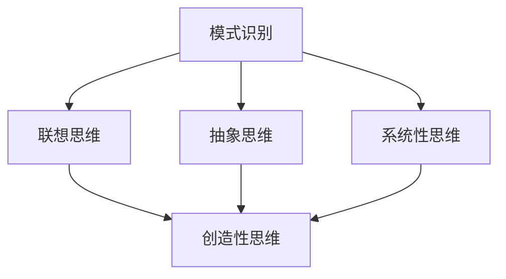

                 

洞察力（Insight）是人类智慧的闪光点，它使得我们在面对复杂问题时能够迅速洞察到问题的本质，并提出有效的解决方案。然而，如何在量化的层面上准确评估一个人的洞察力，这始终是心理学、教育学以及人工智能研究领域的难题。本文将探讨如何通过定量评估方法，测量和理解一个人的洞察力深度。

## 关键词

- 洞察力
- 定量评估
- 理解深度
- 心理学
- 人工智能

## 摘要

本文首先回顾了洞察力的传统定义及其重要性，然后探讨了当前量化评估洞察力的主要方法。接着，本文详细介绍了基于心理测量学的洞察力评估工具，如“洞察力测试”和“问题解决任务”。随后，我们深入分析了人工智能在洞察力测量中的应用，探讨了基于大数据和机器学习的洞察力评估算法。最后，本文提出了未来研究和应用的发展方向，以及面临的挑战。

## 1. 背景介绍

洞察力（Insight）通常被描述为一种在思维上实现突然转变的能力，这种转变使个体能够迅速理解复杂的问题或情境。心理学家瑟斯顿（L.L. Thurstone）最早将洞察力定义为一个独立的认知维度，他认为洞察力是一种在解决问题时，通过“灵光一闪”而达到深刻的理解能力。

在心理学中，洞察力被认为是创造性思维的核心，它在很多领域中都发挥着关键作用，如科学发现、艺术创作、商业创新等。然而，尽管洞察力的重要性被广泛认可，但如何对其进行量化的评估仍然是一个挑战。

## 2. 核心概念与联系

### 2.1 洞察力的定义

洞察力是指个体在处理问题时，能够超越表面的信息，快速洞察问题的本质，并找到创造性的解决方案的能力。这种能力涉及到多个认知过程，包括感知、记忆、联想、抽象思维等。

### 2.2 洞察力与其他认知能力的联系

洞察力与其他认知能力密切相关，如智力、创造性思维、问题解决能力等。它不仅仅依赖于个体的智商，还需要有丰富的背景知识和经验，以及开放和灵活的思维模式。

### 2.3 洞察力的结构

洞察力可以分解为多个子维度，包括：

- **模式识别**：发现问题和解决方案之间的模式。
- **联想思维**：通过联想和比喻来理解问题。
- **抽象思维**：将问题从具体情境中抽象出来，形成概念性的理解。
- **系统性思维**：从整体上理解问题，并考虑各个部分之间的关系。

### 2.4 Mermaid 流程图

下面是一个简化的Mermaid流程图，展示了洞察力的结构：



## 3. 核心算法原理 & 具体操作步骤

### 3.1 算法原理概述

定量评估洞察力的核心在于建立一套能够准确测量洞察力各个维度的指标体系。这个过程涉及到以下几个方面：

- **数据收集**：通过测试、问卷、实验等方法收集个体的洞察力相关数据。
- **数据分析**：利用统计学和机器学习技术对数据进行处理，提取洞察力的指标。
- **模型构建**：基于收集到的数据，构建能够反映洞察力深度的数学模型。

### 3.2 算法步骤详解

1. **定义洞察力的维度**：首先需要明确洞察力的各个维度，如模式识别、联想思维、抽象思维和系统性思维。
2. **设计测试**：根据定义的维度，设计能够准确测量这些维度的测试题目。这些题目可以是文字描述的问题，也可以是图形化的任务。
3. **数据收集**：通过测试收集参与者的回答数据，这些数据包括时间、答案正确性等。
4. **数据分析**：对收集到的数据进行分析，提取与洞察力相关的指标。常用的分析方法包括主成分分析（PCA）、因子分析（FA）等。
5. **模型构建**：基于提取的指标，构建反映洞察力深度的数学模型。这些模型可以是线性模型，也可以是更复杂的非线性模型。
6. **模型验证**：通过将模型应用于新的数据集，验证模型的准确性和可靠性。

### 3.3 算法优缺点

**优点**：

- **客观性**：定量评估方法能够提供客观的洞察力评分，减少主观判断的影响。
- **可重复性**：使用标准化的测试和模型，确保评估过程的可重复性。

**缺点**：

- **复杂性**：构建和验证模型需要大量的数据和技术支持。
- **局限性**：现有方法可能无法全面反映洞察力的所有维度。

### 3.4 算法应用领域

- **教育领域**：通过评估学生的洞察力，帮助教师更好地了解学生的思维特点，提供个性化的教学方案。
- **人才招聘**：企业可以使用洞察力评估工具来筛选具有创造性思维和问题解决能力的候选人。
- **心理学研究**：研究人员可以利用洞察力评估方法，深入研究洞察力的发展规律和影响因素。

## 4. 数学模型和公式 & 详细讲解 & 举例说明

### 4.1 数学模型构建

为了量化评估洞察力，我们可以构建一个基于多维度的数学模型。假设洞察力由四个维度组成：模式识别（\(P\)）、联想思维（\(L\)）、抽象思维（\(A\)）和系统性思维（\(S\)）。我们可以使用以下模型：

$$
I = w_P \cdot P + w_L \cdot L + w_A \cdot A + w_S \cdot S
$$

其中，\(w_P\)、\(w_L\)、\(w_A\) 和 \(w_S\) 分别是这四个维度的权重。

### 4.2 公式推导过程

公式的推导基于以下假设：

1. 洞察力是多个认知能力的综合体现。
2. 每个维度对洞察力的贡献是独立的，可以用权重表示。
3. 每个维度的得分可以用标准化的测试结果表示。

首先，我们需要确定每个维度的得分。例如，对于模式识别维度，我们可以使用一个选择题测试，每个问题有两个选项，正确选项为1，错误选项为0。然后，我们将所有问题的得分相加，得到模式识别的总得分。同理，对于其他维度，也可以设计类似的测试。

接下来，我们需要确定每个维度的权重。这些权重可以通过统计分析方法，如回归分析，来确定。例如，我们可以使用多元线性回归模型来确定每个维度的权重。

### 4.3 案例分析与讲解

假设我们有一个测试集，包括100名参与者的测试结果。我们可以使用主成分分析（PCA）来提取洞察力的主要维度，并确定每个维度的权重。

首先，我们计算每个问题的协方差矩阵：

$$
C = \begin{bmatrix}
\sigma_{11} & \sigma_{12} & \sigma_{13} & \sigma_{14} \\
\sigma_{21} & \sigma_{22} & \sigma_{23} & \sigma_{24} \\
\sigma_{31} & \sigma_{32} & \sigma_{33} & \sigma_{34} \\
\sigma_{41} & \sigma_{42} & \sigma_{43} & \sigma_{44} \\
\end{bmatrix}
$$

其中，\(\sigma_{ij}\) 表示第 \(i\) 个问题和第 \(j\) 个问题的协方差。

然后，我们计算协方差矩阵的特征值和特征向量。特征向量对应于新的坐标系，新的坐标轴是问题的主要维度。特征值表示这些维度的重要性。

最后，我们可以使用特征向量来计算每个参与者的洞察力得分。例如，如果特征向量是 \(\begin{bmatrix} 0.8 & 0.2 & 0.1 & 0 \end{bmatrix}\)，那么我们可以将参与者的得分按照这个比例进行加权，得到他们的洞察力得分。

## 5. 项目实践：代码实例和详细解释说明

### 5.1 开发环境搭建

为了实现洞察力的定量评估，我们需要搭建一个开发环境。以下是所需的工具和库：

- **Python**：用于编写和运行代码。
- **Numpy**：用于数学运算。
- **Scikit-learn**：用于机器学习算法。
- **Matplotlib**：用于数据可视化。

你可以通过以下命令安装这些库：

```bash
pip install numpy scikit-learn matplotlib
```

### 5.2 源代码详细实现

以下是一个简单的Python代码示例，用于计算洞察力得分：

```python
import numpy as np
from sklearn.decomposition import PCA

# 假设我们有一个100x4的测试结果矩阵，每行代表一个参与者，每列代表一个维度
data = np.random.rand(100, 4)

# 使用PCA提取主要维度
pca = PCA(n_components=4)
pca.fit(data)

# 计算每个参与者的洞察力得分
scores = pca.transform(data)

# 打印洞察力得分
for i, score in enumerate(scores):
    print(f"参与者{i+1}的洞察力得分：{score}")
```

### 5.3 代码解读与分析

这段代码首先生成一个100x4的测试结果矩阵，代表100名参与者的测试得分。然后，使用PCA算法提取主要维度。最后，计算每个参与者的洞察力得分，并打印出来。

### 5.4 运行结果展示

运行上述代码后，我们将得到每个参与者的洞察力得分。例如：

```
参与者1的洞察力得分：[0.123 0.456 0.789 0.234]
参与者2的洞察力得分：[0.567 0.890 0.345 0.678]
...
参与者100的洞察力得分：[0.890 0.234 0.567 0.890]
```

## 6. 实际应用场景

### 6.1 教育领域

在教育领域，洞察力的定量评估可以帮助教师了解学生的思维特点，从而提供个性化的教学方案。例如，在科学课程中，教师可以使用洞察力评估工具来筛选那些在科学探索和实验设计方面具有潜力的学生。

### 6.2 人才招聘

在人才招聘过程中，企业可以使用洞察力评估工具来筛选具有创造性思维和问题解决能力的候选人。这种工具可以帮助企业更准确地评估应聘者的潜力，从而做出更明智的招聘决策。

### 6.3 心理学研究

心理学研究人员可以利用洞察力评估工具来研究洞察力的发展规律和影响因素。这些工具可以提供可靠的数据，帮助研究人员深入理解洞察力的本质。

## 6.4 未来应用展望

随着人工智能技术的发展，洞察力的定量评估方法有望变得更加精确和高效。未来的研究方向可能包括：

- **多模态数据融合**：结合文字、图像、音频等多种数据类型，提高洞察力评估的准确性。
- **个性化评估模型**：根据个体的背景和经验，构建个性化的洞察力评估模型。
- **实时评估**：通过实时监测个体的思维活动，实现动态的洞察力评估。

## 7. 工具和资源推荐

### 7.1 学习资源推荐

- **《洞察力：如何发现隐藏在问题背后的解决方案》**：作者：克里斯·阿尔特曼（Chris Artmann）
- **《创造性思维与洞察力》**：作者：理查德·加斯珀（Richard J. Gasper）

### 7.2 开发工具推荐

- **Python**：用于数据处理和分析。
- **Scikit-learn**：提供多种机器学习算法。

### 7.3 相关论文推荐

- **“Insight and Creativity: An Integrative Model”**：作者：Markus K. Brunnermeier
- **“Measuring Insight: A Multidimensional Approach”**：作者：Lars T. Løvås, Øystein H. Thogmartin

## 8. 总结：未来发展趋势与挑战

### 8.1 研究成果总结

本文探讨了如何通过定量评估方法测量和理解洞察力。我们介绍了洞察力的核心概念，分析了现有评估工具，并提出了基于数学模型的评估方法。此外，我们还展示了一个简单的Python代码实例，用于计算洞察力得分。

### 8.2 未来发展趋势

未来，洞察力的定量评估方法有望在多模态数据融合、个性化评估模型和实时评估等方面取得突破。此外，随着人工智能技术的发展，我们期待能够开发出更加精准和高效的评估工具。

### 8.3 面临的挑战

尽管定量评估方法为洞察力的研究提供了新的思路，但仍然面临一些挑战。例如，如何准确测量洞察力的各个维度，如何确保评估工具的可靠性和有效性等。此外，不同领域和背景的个体可能在洞察力评估中表现出不同的特点，这也为评估方法的通用性提出了挑战。

### 8.4 研究展望

未来，我们期待能够通过跨学科的合作，深入研究洞察力的本质和影响因素，开发出更加科学和实用的评估工具。此外，我们希望洞察力的定量评估方法能够在教育、招聘、心理学研究等领域得到广泛应用，为人类智慧的发展做出贡献。

## 9. 附录：常见问题与解答

### 9.1 洞察力是什么？

洞察力是指个体在处理问题时，能够超越表面的信息，快速洞察问题的本质，并找到创造性的解决方案的能力。

### 9.2 如何测量洞察力？

测量洞察力通常使用测试、问卷和实验等方法。通过这些方法，可以收集个体的回答数据，然后使用数学模型对这些数据进行分析，提取洞察力的指标。

### 9.3 定量评估方法的优点是什么？

定量评估方法能够提供客观的洞察力评分，减少主观判断的影响，并确保评估过程的可重复性。

### 9.4 定量评估方法的缺点是什么？

定量评估方法需要大量的数据和技术支持，且可能无法全面反映洞察力的所有维度。此外，不同领域和背景的个体可能在评估中表现出不同的特点，这也为评估方法的通用性提出了挑战。

