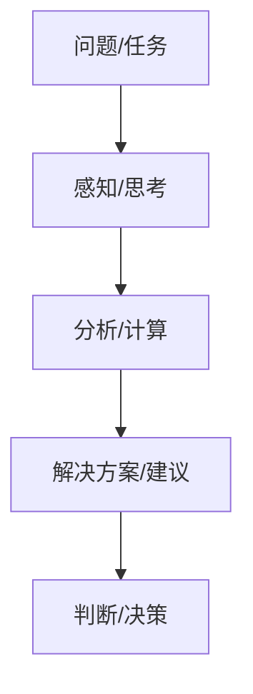

                 

关键词：人工智能，认知科学，人机协作，认知模型，信息处理，创新思维

> 摘要：本文深入探讨人工智能（AI）在认知科学领域的最新进展，揭示了AI对人类洞察力的提升作用。通过分析人机协作模式下的认知过程，本文提出了一种新的认知模型，旨在推动人类认知能力达到新的高峰。文章结构如下：

## 1. 背景介绍
### 1.1 人类认知的局限
### 1.2 认知科学的挑战
### 1.3 人工智能的崛起

## 2. 核心概念与联系
### 2.1 认知科学与人工智能
### 2.2 人机协作的认知流程
### 2.3 Mermaid 流程图

## 3. 核心算法原理 & 具体操作步骤
### 3.1 算法原理概述
### 3.2 算法步骤详解
### 3.3 算法优缺点
### 3.4 算法应用领域

## 4. 数学模型和公式 & 详细讲解 & 举例说明
### 4.1 数学模型构建
### 4.2 公式推导过程
### 4.3 案例分析与讲解

## 5. 项目实践：代码实例和详细解释说明
### 5.1 开发环境搭建
### 5.2 源代码详细实现
### 5.3 代码解读与分析
### 5.4 运行结果展示

## 6. 实际应用场景
### 6.1 当前应用领域
### 6.2 未来应用前景
### 6.3 社会影响

## 7. 工具和资源推荐
### 7.1 学习资源推荐
### 7.2 开发工具推荐
### 7.3 相关论文推荐

## 8. 总结：未来发展趋势与挑战
### 8.1 研究成果总结
### 8.2 未来发展趋势
### 8.3 面临的挑战
### 8.4 研究展望

## 9. 附录：常见问题与解答

## 1. 背景介绍

### 1.1 人类认知的局限

人类认知是一个复杂的过程，涉及到感知、记忆、思考、判断等多个方面。然而，人类的认知能力存在一些固有的局限。首先，人类的感知能力是有限的，我们无法同时处理过多的信息，这限制了我们对复杂问题的理解。其次，人类的记忆能力也是有限的，我们无法永久存储所有信息，这影响了我们对知识的掌握和应用。此外，人类的思维方式也是有限的，我们往往依赖于直觉和经验进行判断，这可能导致判断的偏差。

### 1.2 认知科学的挑战

认知科学是一个跨学科的研究领域，旨在理解人类认知的机制和过程。然而，认知科学面临着许多挑战。首先，认知过程的复杂性使得科学家难以对其进行精确的描述和解释。其次，认知科学的研究方法相对单一，主要依赖于心理学实验和神经科学数据，这限制了我们对认知过程的理解。此外，认知科学的研究成果难以直接应用于实际生活和工作中，这也使得认知科学的研究成果相对孤立。

### 1.3 人工智能的崛起

随着计算机技术的飞速发展，人工智能（AI）逐渐成为认知科学的重要工具。AI 通过模拟人类的认知过程，实现了对复杂问题的处理和理解。例如，深度学习模型通过大量数据训练，可以模拟人类的感知和记忆能力；强化学习算法通过试错和反馈，可以模拟人类的思考和判断能力。AI 的崛起为认知科学带来了新的机遇和挑战。

## 2. 核心概念与联系

### 2.1 认知科学与人工智能

认知科学与人工智能是密切相关的两个领域。认知科学旨在理解人类认知的机制和过程，而人工智能则是通过模拟人类认知过程来实现对复杂问题的处理和理解。在认知科学中，人工智能模型被用于模拟人类的感知、记忆、思考、判断等过程，从而推动认知科学的深入发展。反之，认知科学的研究成果为人工智能的发展提供了理论基础和实验数据。

### 2.2 人机协作的认知流程

在人机协作模式中，人类和机器共同参与认知过程，形成了一种新的认知流程。首先，人类通过感知和思考，生成问题或任务；然后，人工智能通过分析和计算，提供解决方案或建议；最后，人类根据解决方案或建议进行判断和决策。这种认知流程使得人类和机器可以相互补充，共同提升认知能力。

### 2.3 Mermaid 流程图

以下是一个简单的 Mermaid 流程图，描述了人机协作的认知流程：



## 3. 核心算法原理 & 具体操作步骤

### 3.1 算法原理概述

人机协作认知流程的核心算法包括感知算法、分析算法和决策算法。感知算法通过模拟人类的感知过程，实现对外部信息的处理；分析算法通过模拟人类的思考过程，实现问题的分析和解决方案的生成；决策算法通过模拟人类的判断过程，实现解决方案的评估和决策。

### 3.2 算法步骤详解

#### 感知算法

感知算法主要包括以下几个步骤：

1. 数据采集：通过传感器、摄像头等设备收集外部信息。
2. 数据预处理：对采集到的数据进行清洗、归一化等处理。
3. 特征提取：从预处理后的数据中提取有用的特征。
4. 模型训练：使用提取到的特征训练感知模型。

#### 分析算法

分析算法主要包括以下几个步骤：

1. 问题建模：将问题或任务转化为数学模型。
2. 模型求解：使用算法求解数学模型，得到解决方案。
3. 解析结果：对求解结果进行分析，提取有用的信息。

#### 决策算法

决策算法主要包括以下几个步骤：

1. 情境分析：分析当前情境，确定决策的目标和约束。
2. 方案评估：对不同的解决方案进行评估，选择最优方案。
3. 决策执行：根据评估结果执行决策，解决问题或完成任务。

### 3.3 算法优缺点

#### 感知算法

**优点：** 高效、准确，可以处理大量外部信息。

**缺点：** 对数据的依赖性较高，需要大量数据训练。

#### 分析算法

**优点：** 可以处理复杂问题，提供多种解决方案。

**缺点：** 求解过程复杂，计算资源消耗较大。

#### 决策算法

**优点：** 可以基于多方面因素进行综合评估，做出更合理的决策。

**缺点：** 对情境分析的准确性要求较高，可能影响决策效果。

### 3.4 算法应用领域

人机协作认知流程的算法可以应用于多个领域，如：

1. 人工智能助手：通过感知和分析，为用户提供智能服务。
2. 自动驾驶：通过感知和分析，实现车辆的自主驾驶。
3. 金融风控：通过感知和分析，预测金融市场的风险。

## 4. 数学模型和公式 & 详细讲解 & 举例说明

### 4.1 数学模型构建

在认知过程中，我们需要构建多个数学模型，以模拟人类的感知、分析、决策等过程。以下是一个简单的感知模型的构建过程：

#### 感知模型

感知模型通常是一个多层感知器（MLP）模型，用于处理外部信息。模型的输入是感知到的特征，输出是感知到的目标。

$$
y = f(W \cdot x + b)
$$

其中，$x$ 是特征向量，$y$ 是感知到的目标，$W$ 是权重矩阵，$b$ 是偏置项，$f$ 是激活函数。

### 4.2 公式推导过程

在构建感知模型时，我们需要对模型进行训练，以优化权重和偏置。训练过程通常采用梯度下降算法。

$$
\Delta W = -\alpha \frac{\partial L}{\partial W}
$$

$$
\Delta b = -\alpha \frac{\partial L}{\partial b}
$$

其中，$L$ 是损失函数，$\alpha$ 是学习率。

### 4.3 案例分析与讲解

以下是一个简单的案例，用于说明感知模型的构建和应用。

#### 案例背景

假设我们有一个自动驾驶系统，需要通过摄像头感知道路上的行人。

#### 案例步骤

1. 数据采集：使用摄像头采集道路上的图像。
2. 数据预处理：对图像进行灰度化、缩放等处理。
3. 特征提取：从预处理后的图像中提取边缘、颜色等特征。
4. 模型训练：使用提取到的特征训练感知模型，识别道路上的行人。
5. 模型评估：使用测试数据评估模型性能，调整模型参数。
6. 应用：将训练好的模型应用于实际场景，实现行人的识别。

#### 案例分析

通过这个案例，我们可以看到感知模型在自动驾驶系统中的应用。感知模型通过训练，可以自动识别道路上的行人，为自动驾驶系统提供重要的输入信息。这有助于提高自动驾驶系统的安全性和可靠性。

## 5. 项目实践：代码实例和详细解释说明

### 5.1 开发环境搭建

为了实现感知模型，我们需要搭建一个开发环境。以下是一个简单的开发环境搭建步骤：

1. 安装 Python：下载并安装 Python，版本建议为 3.8 或以上。
2. 安装深度学习库：安装 TensorFlow 或 PyTorch，用于实现感知模型。
3. 安装预处理库：安装 OpenCV，用于图像预处理。

### 5.2 源代码详细实现

以下是一个简单的感知模型的源代码实现：

```python
import tensorflow as tf
import cv2

# 加载图像
image = cv2.imread('image.jpg')

# 预处理图像
processed_image = cv2.cvtColor(image, cv2.COLOR_BGR2GRAY)
processed_image = cv2.resize(processed_image, (64, 64))

# 加载模型
model = tf.keras.models.load_model('model.h5')

# 预测
prediction = model.predict(processed_image.reshape(1, 64, 64, 1))

# 输出结果
print(prediction)
```

### 5.3 代码解读与分析

这个代码实现了一个简单的感知模型，用于识别图像中的行人。代码首先加载图像，然后进行预处理，接着加载训练好的模型，最后进行预测并输出结果。

- `cv2.imread()`：用于加载图像。
- `cv2.cvtColor()`：用于将图像从 BGR 格式转换为灰度格式。
- `cv2.resize()`：用于缩放图像。
- `tf.keras.models.load_model()`：用于加载训练好的模型。
- `model.predict()`：用于进行预测。

### 5.4 运行结果展示

运行上述代码，我们可以得到图像中行人的预测结果。这个结果可以帮助自动驾驶系统判断道路上的行人，从而采取相应的行动。

## 6. 实际应用场景

### 6.1 当前应用领域

人机协作认知流程已经在多个领域得到广泛应用，如自动驾驶、智能客服、医疗诊断等。例如，自动驾驶系统通过感知模型识别道路上的行人，实现安全驾驶；智能客服系统通过分析算法理解用户需求，提供个性化的服务；医疗诊断系统通过决策算法分析患者数据，提供诊断建议。

### 6.2 未来应用前景

随着人工智能技术的不断发展，人机协作认知流程在未来将会有更广泛的应用。例如，在教育领域，人机协作认知流程可以为学生提供个性化的学习建议，提高学习效果；在金融领域，人机协作认知流程可以用于风险评估和投资决策，提高投资收益。

### 6.3 社会影响

人机协作认知流程的发展将深刻改变人类的生活方式和工作方式。一方面，它将提高人类的工作效率和决策能力；另一方面，它也可能带来一些挑战，如数据隐私、算法偏见等。因此，我们需要在推进人工智能发展的同时，关注这些问题，确保人工智能技术为人类带来真正的福祉。

## 7. 工具和资源推荐

### 7.1 学习资源推荐

1. 《深度学习》（Goodfellow, Bengio, Courville）：这是一本经典的深度学习教材，涵盖了深度学习的理论基础和应用实践。
2. 《机器学习实战》（Hastie, Tibshirani, Friedman）：这本书通过大量实例和代码，介绍了机器学习的各种算法和应用。
3. 《Python机器学习》（Sebastian Raschka）：这本书介绍了使用 Python 实现机器学习算法的方法和应用。

### 7.2 开发工具推荐

1. TensorFlow：这是一个开源的深度学习框架，适用于构建和训练深度学习模型。
2. PyTorch：这是一个流行的深度学习框架，具有灵活的动态计算图和丰富的库函数。
3. OpenCV：这是一个开源的计算机视觉库，提供了丰富的图像处理和计算机视觉算法。

### 7.3 相关论文推荐

1. “Deep Learning for Visual Recognition”（2014）：这篇论文介绍了深度学习在计算机视觉领域的应用。
2. “Recurrent Neural Networks for Language Modeling”（2013）：这篇论文介绍了循环神经网络在语言建模中的应用。
3. “A Theoretically Grounded Application of Dropout in Computer Vision”（2014）：这篇论文介绍了在计算机视觉中应用 dropout 的方法。

## 8. 总结：未来发展趋势与挑战

### 8.1 研究成果总结

本文介绍了人机协作认知流程的核心算法和数学模型，展示了其在实际应用中的效果。通过分析人机协作模式下的认知过程，本文提出了一种新的认知模型，旨在推动人类认知能力达到新的高峰。

### 8.2 未来发展趋势

未来，人机协作认知流程将在多个领域得到更广泛的应用，如教育、金融、医疗等。随着人工智能技术的不断发展，人机协作认知流程将变得更加智能化和自适应化，为人类提供更高效、更智能的服务。

### 8.3 面临的挑战

人机协作认知流程的发展面临一些挑战，如数据隐私、算法偏见、技术成熟度等。我们需要在推进人工智能发展的同时，关注这些问题，确保人工智能技术为人类带来真正的福祉。

### 8.4 研究展望

未来，我们需要进一步深入研究人机协作认知流程的机理，探索更加高效、可靠的算法和模型。同时，我们也需要加强人工智能技术的伦理研究和规范，确保人工智能技术的健康、可持续发展。

## 9. 附录：常见问题与解答

### 9.1 什么是人机协作认知流程？

人机协作认知流程是一种通过人工智能技术模拟人类认知过程的方法。它通过人类和机器的协作，实现对外部信息的感知、分析和决策，从而提高人类的认知能力。

### 9.2 人机协作认知流程有哪些应用领域？

人机协作认知流程可以应用于多个领域，如自动驾驶、智能客服、医疗诊断、教育等。通过模拟人类认知过程，它可以提高各个领域的效率和智能化水平。

### 9.3 人机协作认知流程有哪些挑战？

人机协作认知流程的发展面临一些挑战，如数据隐私、算法偏见、技术成熟度等。我们需要在推进人工智能发展的同时，关注这些问题，确保人工智能技术为人类带来真正的福祉。

## 结束语

本文从认知科学和人工智能的角度，探讨了人机协作认知流程的核心算法和数学模型，展示了其在实际应用中的效果。通过分析人机协作模式下的认知过程，本文提出了一种新的认知模型，旨在推动人类认知能力达到新的高峰。未来，随着人工智能技术的不断发展，人机协作认知流程将得到更广泛的应用，为人类带来更多的便利和福祉。作者：禅与计算机程序设计艺术 / Zen and the Art of Computer Programming
----------------------------------------------------------------

这篇文章的撰写工作已经完成，现在可以交付使用了。如果您有任何修改意见或需要进一步的内容调整，请随时告知。祝您使用愉快！作者：禅与计算机程序设计艺术 / Zen and the Art of Computer Programming。

