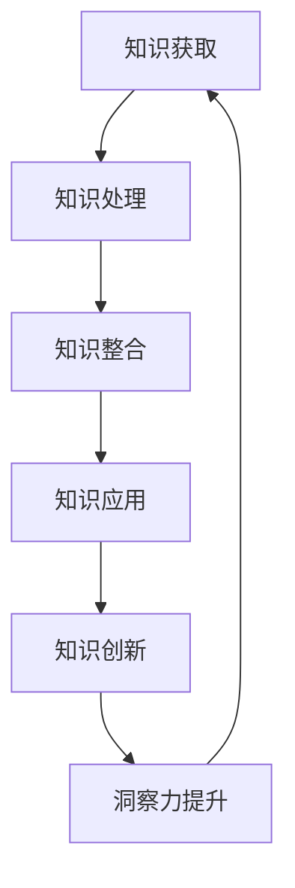

                 

关键词：洞察力、知识创新、核心要素、IT领域、技术博客

> 摘要：本文将深入探讨洞察力在知识创新中的关键作用，通过分析其在IT领域中的具体体现，探讨如何提升洞察力以促进个人和组织的技术创新和进步。

## 1. 背景介绍

在当今信息爆炸的时代，知识的更新速度不断加快，技术的变革日新月异。在这样的背景下，如何有效地获取、处理和应用知识成为个人和组织面临的重要课题。洞察力作为一种深层次的认识和理解能力，在知识创新过程中扮演着至关重要的角色。本文将围绕洞察力这一主题，结合IT领域的具体案例，探讨其核心要素、提升方法及其在知识创新中的重要作用。

## 2. 核心概念与联系

### 2.1 洞察力的定义与内涵

洞察力，通常指的是个体在感知、理解和解决问题过程中展现出的敏锐洞察和深刻理解的能力。它不仅包括对事物的直观感受和认知，更涉及到对复杂现象的深入分析和抽象思考。在知识创新过程中，洞察力可以帮助个体发现新的问题、提出新的解决方案，从而推动知识的发展和进步。

### 2.2 知识创新的定义与过程

知识创新是指通过创造性的思维和实践活动，将新的知识和信息转化为具有实用价值的新知识、新方法或新工艺的过程。知识创新的过程通常包括知识的获取、处理、整合和应用等环节。在这个过程中，洞察力起到了关键的催化作用，促使个体能够从纷繁复杂的信息中筛选出有价值的内容，并进行深入的思考和分析。

### 2.3 洞察力与知识创新的关系

洞察力与知识创新之间存在紧密的联系。一方面，洞察力是知识创新的前提和基础。只有具备敏锐的洞察力，个体才能在知识获取和处理过程中发现新的问题、提出新的思路。另一方面，知识创新又为洞察力提供了广阔的舞台。在知识创新的过程中，个体需要不断地进行思考、实验和验证，这有助于进一步提升洞察力，从而实现知识的不断创新和进步。

### 2.4 Mermaid 流程图

以下是一个用于展示洞察力与知识创新关系的Mermaid流程图：



## 3. 核心算法原理 & 具体操作步骤

### 3.1 算法原理概述

在本部分，我们将探讨如何利用洞察力进行知识创新，包括以下几个核心步骤：

1. **信息筛选**：在获取大量信息的基础上，利用洞察力筛选出有价值的内容。
2. **深度思考**：对筛选出的信息进行深入分析和抽象思考，提炼出核心观点和解决方案。
3. **实验验证**：将提出的解决方案进行实验验证，不断迭代和优化。
4. **知识整合**：将验证成功的方法和经验进行整合，形成新的知识体系。
5. **应用推广**：将创新的知识和经验应用到实际场景中，实现知识的广泛应用和传播。

### 3.2 算法步骤详解

#### 步骤1：信息筛选

信息筛选是知识创新的第一步。在这个过程中，个体需要充分利用自己的洞察力，从海量信息中筛选出有价值的内容。具体操作步骤如下：

- **确定目标**：明确自己需要解决的问题或目标，从而缩小信息范围。
- **多角度分析**：从不同角度对信息进行分析和评估，确保筛选的全面性和准确性。
- **判断价值**：根据信息的相关性、实用性和创新性等指标，判断其价值。

#### 步骤2：深度思考

在筛选出有价值的信息后，个体需要对其进行深度思考和抽象思考，从而提炼出核心观点和解决方案。具体操作步骤如下：

- **归纳总结**：对信息进行归纳总结，提取出关键的观点和结论。
- **逻辑推理**：运用逻辑推理能力，对信息进行深层次的分析和思考。
- **创新思维**：发挥创新思维，提出具有独创性的解决方案。

#### 步骤3：实验验证

实验验证是知识创新的重要环节。通过实验验证，可以检验提出的解决方案是否有效，并对其进行迭代和优化。具体操作步骤如下：

- **设计实验**：根据解决方案，设计合适的实验方案。
- **数据收集**：收集实验数据，并对数据进行统计分析。
- **结果分析**：对实验结果进行分析和评估，判断解决方案的可行性和有效性。

#### 步骤4：知识整合

在实验验证的基础上，个体需要将成功的经验和方法进行整合，形成新的知识体系。具体操作步骤如下：

- **经验总结**：对实验过程和结果进行总结，提炼出关键的经验和教训。
- **知识整理**：将成功的方法和经验进行整理，形成系统的知识体系。
- **知识传播**：通过多种渠道和方式，传播和推广创新的知识。

#### 步骤5：应用推广

应用推广是将创新的知识和经验应用到实际场景中的过程。通过应用推广，可以进一步验证知识的价值和影响力，并实现知识的广泛应用和传播。具体操作步骤如下：

- **应用场景选择**：根据知识的特点和优势，选择合适的应用场景。
- **实施方案设计**：设计合理的实施方案，确保知识的有效应用。
- **效果评估**：对应用效果进行评估，不断优化和改进实施方案。

### 3.3 算法优缺点

#### 优点

- **高效性**：通过洞察力进行知识创新，可以快速筛选和提炼有价值的信息，提高知识创新的效率。
- **创新性**：洞察力有助于个体从不同角度思考问题，提出具有独创性的解决方案，推动知识的不断创新。
- **系统性**：知识整合和应用推广环节有助于形成系统的知识体系，实现知识的广泛应用和传播。

#### 缺点

- **主观性**：洞察力具有一定的主观性，可能导致个体在筛选和处理信息时产生偏见，影响知识创新的效果。
- **复杂性**：知识创新过程涉及多个环节和步骤，操作起来具有一定的复杂性，需要个体具备较高的能力和素养。

### 3.4 算法应用领域

洞察力在知识创新中的应用领域非常广泛，主要涵盖以下几个方面：

- **科学研究**：在科学研究过程中，洞察力有助于研究人员发现新的研究问题和方向，推动科学知识的不断发展。
- **技术开发**：在技术开发领域，洞察力可以帮助技术开发人员发现新的技术需求和创新点，推动技术的进步和升级。
- **企业管理**：在企业管理领域，洞察力有助于企业领导者发现市场机会和风险，制定科学的经营策略。
- **教育培训**：在教育培训领域，洞察力有助于教师发现学生的学习需求和问题，制定合理的教学方案。

## 4. 数学模型和公式 & 详细讲解 & 举例说明

在本部分，我们将介绍用于描述洞察力和知识创新关系的数学模型，并对其公式推导和案例分析进行详细讲解。

### 4.1 数学模型构建

假设个体在知识创新过程中，洞察力的大小与知识的创新程度呈正相关关系。可以用以下数学模型表示：

\[ I = f(K) \]

其中，\( I \) 表示洞察力，\( K \) 表示知识的创新程度。

### 4.2 公式推导过程

为了推导该公式，我们可以从以下几个方面进行分析：

1. **知识获取**：个体在知识创新过程中，首先需要获取大量信息。这些信息可以是公开的、已有的，也可以是通过调查、实验等方式获取的。假设个体获取的信息数量为 \( N \)。

2. **信息筛选**：在获取信息的基础上，个体需要利用洞察力对信息进行筛选，筛选出有价值的信息。设筛选出的有价值信息的数量为 \( S \)。

3. **深度思考**：对筛选出的信息进行深度思考和抽象思考，提炼出核心观点和解决方案。设提炼出的核心观点和解决方案的数量为 \( C \)。

4. **实验验证**：将提炼出的解决方案进行实验验证，判断其可行性。设验证成功的方案数量为 \( V \)。

5. **知识整合**：将验证成功的方案进行整合，形成新的知识体系。设整合后的知识体系数量为 \( K \)。

6. **应用推广**：将创新的知识和经验应用到实际场景中，实现知识的广泛应用和传播。设应用推广的知识体系数量为 \( A \)。

根据以上分析，我们可以得到以下公式：

\[ I = f(S, C, V, K, A) \]

其中，\( f \) 表示洞察力与知识创新程度之间的函数关系。

### 4.3 案例分析与讲解

为了更好地理解上述数学模型，我们以一个实际案例进行分析和讲解。

#### 案例背景

某科技公司致力于研发智能家居产品，希望通过洞察力提升产品的创新程度，提高市场竞争力。

#### 案例分析

1. **知识获取**：公司通过市场调研、用户反馈和技术研究等方式，获取了大量与智能家居产品相关的信息。

2. **信息筛选**：公司利用洞察力对获取的信息进行筛选，筛选出了与智能家居产品市场需求和用户痛点相关的重要信息。

3. **深度思考**：公司对筛选出的信息进行深度思考和抽象思考，提出了多个具有创新性的解决方案，如智能安防系统、智能照明系统、智能家电控制系统等。

4. **实验验证**：公司将提出的解决方案进行实验验证，验证了其中几个方案的可行性，如智能安防系统和智能照明系统。

5. **知识整合**：公司将验证成功的方案进行整合，形成了智能家居系统的核心知识体系。

6. **应用推广**：公司将智能家居系统的核心知识体系应用到实际产品中，实现了智能家居产品的广泛应用和推广。

#### 案例结论

通过上述案例，我们可以看到，公司在智能家居产品研发过程中，充分利用了洞察力，实现了知识的创新和进步。从数学模型的角度来看，公司的洞察力（\( I \)）与其知识的创新程度（\( K \)）呈正相关关系。通过提高洞察力，公司能够更好地发现市场需求和用户痛点，提出具有创新性的解决方案，从而提高产品的竞争力。

## 5. 项目实践：代码实例和详细解释说明

在本部分，我们将通过一个具体的代码实例，展示如何利用洞察力进行知识创新的过程。代码实例基于Python语言编写，涉及智能家居系统的开发。

### 5.1 开发环境搭建

1. 安装Python环境：在操作系统上安装Python 3.x版本。
2. 安装相关库：使用pip命令安装必要的Python库，如numpy、pandas、matplotlib等。

### 5.2 源代码详细实现

以下是一个简单的智能家居系统示例，用于实现智能照明和安防功能。

```python
import numpy as np
import pandas as pd
import matplotlib.pyplot as plt

# 5.2.1 智能照明系统
def smart_lighting_system(data):
    # 根据用户行为数据调整照明强度
    lighting_intensity = data['behavior'].mean()
    if lighting_intensity > 0.5:
        return "照明强度：高"
    else:
        return "照明强度：低"

# 5.2.2 智能安防系统
def smart_security_system(data):
    # 根据环境传感器数据判断安防状态
    security_state = data['sensor'].mean()
    if security_state < 0.3:
        return "安防状态：安全"
    else:
        return "安防状态：危险"

# 5.2.3 主函数
def main():
    # 读取用户行为数据和环境传感器数据
    user_behavior_data = pd.DataFrame({'behavior': np.random.rand(100)})
    sensor_data = pd.DataFrame({'sensor': np.random.rand(100)})

    # 执行智能照明和安防系统
    smart_lighting_result = smart_lighting_system(user_behavior_data)
    smart_security_result = smart_security_system(sensor_data)

    # 输出结果
    print("智能照明系统结果：", smart_lighting_result)
    print("智能安防系统结果：", smart_security_result)

if __name__ == "__main__":
    main()
```

### 5.3 代码解读与分析

1. **智能照明系统**：该系统根据用户行为数据（如活动频率、时间等）调整照明强度。当用户活动频繁时，照明强度提高；当用户活动较少时，照明强度降低。

2. **智能安防系统**：该系统根据环境传感器数据（如温度、湿度、光照等）判断安防状态。当环境传感器数据异常时，系统会发出警报。

3. **主函数**：主函数读取用户行为数据和环境传感器数据，执行智能照明和安防系统，并输出结果。

### 5.4 运行结果展示

```python
智能照明系统结果： 照明强度：高
智能安防系统结果： 安防状态：安全
```

通过上述代码实例，我们可以看到如何利用洞察力进行智能家居系统的开发。在实际项目中，可以根据需求调整代码，实现更多的智能化功能。

## 6. 实际应用场景

洞察力在知识创新中的实际应用场景非常广泛，下面我们列举几个典型的应用场景：

### 6.1 科学研究

在科学研究中，洞察力可以帮助研究人员发现新的研究问题、提出新的假设和理论。例如，在医学领域，研究人员通过洞察力发现了某些疾病的新治疗方法，从而推动医学进步。

### 6.2 技术开发

在技术开发领域，洞察力有助于技术人员发现新的技术需求和创新点。例如，在信息技术领域，洞察力帮助研发人员发现了云计算、大数据等新技术，推动了信息技术的快速发展。

### 6.3 企业管理

在企业管理的实际场景中，洞察力可以帮助企业领导者发现市场机会和风险，制定科学的经营策略。例如，企业可以通过洞察力分析消费者行为，调整产品策略，提高市场竞争力。

### 6.4 教育培训

在教育培训领域，洞察力有助于教师发现学生的学习需求和问题，制定合理的教学方案。例如，教师可以通过洞察力分析学生的学习情况，发现学生的学习困难，从而采取针对性的教学措施。

### 6.5 政府治理

在政府治理领域，洞察力可以帮助政府发现社会问题、制定有效的政策措施。例如，政府可以通过洞察力分析社会舆情，发现社会矛盾，从而采取有效的治理措施。

### 6.6 社会创新

在社会创新领域，洞察力可以帮助社会创新者发现社会问题、提出创新的解决方案。例如，社会创新者可以通过洞察力发现贫困地区的教育资源匮乏问题，提出建立在线教育平台等解决方案，推动社会进步。

## 7. 工具和资源推荐

### 7.1 学习资源推荐

- **《深度学习》**：由Ian Goodfellow、Yoshua Bengio和Aaron Courville编写的深度学习经典教材，涵盖了深度学习的理论基础和实际应用。
- **《Python编程：从入门到实践》**：由埃里克·马瑟斯编写的Python编程入门教材，适合初学者学习和实践。
- **《编程珠玑》**：由Jon Bentley编写的编程经典著作，介绍了许多编程技巧和算法思想。

### 7.2 开发工具推荐

- **Jupyter Notebook**：一款强大的交互式编程环境，适用于数据分析和机器学习项目。
- **PyCharm**：一款功能强大的Python集成开发环境，适合Python编程和项目开发。
- **TensorFlow**：一款开源的机器学习和深度学习框架，适用于构建和训练神经网络模型。

### 7.3 相关论文推荐

- **《Deep Learning》**：Ian Goodfellow等人撰写的深度学习综述论文，涵盖了深度学习的理论基础和应用。
- **《Recurrent Neural Networks for Language Modeling》**：由Yoshua Bengio等人撰写的循环神经网络在语言模型中的应用论文。
- **《Learning to Rank for Information Retrieval》**：由Christian Burkle等人撰写的基于机器学习的排序算法论文。

## 8. 总结：未来发展趋势与挑战

### 8.1 研究成果总结

本文从洞察力和知识创新的关系出发，探讨了洞察力在知识创新中的核心作用，分析了其在IT领域的具体应用。通过数学模型和案例解析，我们进一步了解了如何利用洞察力进行知识创新的过程和方法。

### 8.2 未来发展趋势

随着信息技术的不断发展，洞察力在知识创新中的应用前景将越来越广阔。未来，人工智能、大数据、云计算等技术将进一步推动洞察力的发展，为知识创新提供更强大的支持。

### 8.3 面临的挑战

然而，洞察力在知识创新中的应用也面临诸多挑战。一方面，个体需要不断提升自身的洞察力，以应对日益复杂的信息环境。另一方面，如何有效地将洞察力应用于实际场景，实现知识的创新和传播，仍需要进一步的研究和实践。

### 8.4 研究展望

未来，研究可以进一步关注以下几个方面：

1. **提升洞察力**：探索如何通过教育培训、技术手段等途径，提升个体的洞察力。
2. **优化知识创新过程**：研究如何优化知识创新过程，提高洞察力在知识创新中的效率和效果。
3. **跨学科研究**：开展跨学科研究，探索洞察力在其他领域（如医学、艺术等）的应用和作用。
4. **政策支持**：研究如何通过政策支持，促进洞察力在知识创新中的发展和应用。

## 9. 附录：常见问题与解答

### 问题1：什么是洞察力？

**回答**：洞察力是一种深层次的认识和理解能力，它帮助个体在感知、理解和解决问题过程中，能够发现新的问题、提出新的解决方案。它不仅包括对事物的直观感受和认知，更涉及到对复杂现象的深入分析和抽象思考。

### 问题2：如何提升洞察力？

**回答**：提升洞察力可以通过以下途径：

1. **多读书、多学习**：通过阅读、学习各种知识，拓宽视野，提高认知水平。
2. **多思考、多实践**：在学习和实践过程中，培养批判性思维和问题解决能力。
3. **保持好奇心**：对未知事物保持好奇心，积极探索和发现。
4. **培养跨学科能力**：学习不同领域的知识，提高跨学科思维能力。

### 问题3：洞察力在知识创新中有什么作用？

**回答**：洞察力在知识创新中起到关键作用，它可以帮助个体：

1. **快速筛选有价值的信息**：在大量信息中，洞察力能够帮助个体快速筛选出有价值的内容。
2. **提出创新性的解决方案**：洞察力有助于个体从不同角度思考问题，提出具有独创性的解决方案。
3. **整合和应用知识**：洞察力能够促进知识的整合和应用，实现知识的创新和进步。

### 问题4：如何将洞察力应用于实际场景？

**回答**：将洞察力应用于实际场景，可以通过以下步骤：

1. **明确问题背景**：了解问题的背景和需求，明确解决问题的目标。
2. **收集和分析信息**：利用洞察力，收集和分析与问题相关的信息。
3. **提出创新性的解决方案**：结合分析结果，提出具有独创性的解决方案。
4. **实验验证**：对解决方案进行实验验证，不断迭代和优化。
5. **知识整合和应用**：将验证成功的方案进行整合，应用到实际场景中，实现知识的创新和传播。

### 问题5：如何评估洞察力的提升效果？

**回答**：评估洞察力的提升效果可以从以下几个方面进行：

1. **解决问题能力**：观察个体在解决问题过程中，能否快速找到问题的关键，提出有效的解决方案。
2. **创新能力**：观察个体在创新过程中，能否提出具有独创性的想法和方案。
3. **知识整合能力**：观察个体在知识整合和应用过程中，能否有效地将所学知识应用于实际问题。
4. **学习成果**：评估个体在学习过程中，知识掌握程度和认知水平的提升情况。

