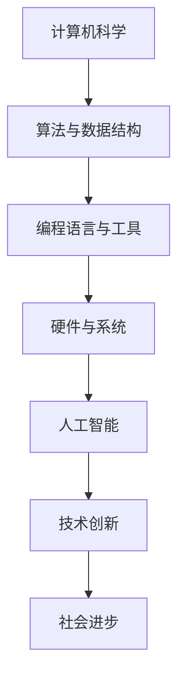

                 

 **关键词：**
- 洞察力
- 知识创新
- 技术思维
- 人工智能
- 计算机科学

**摘要：**
在快速变化的现代科技世界中，洞察力成为知识创新的灵魂。本文通过分析计算机科学中的关键概念和算法，探讨如何通过洞察力激发技术创新，推动人工智能的发展。文章结构紧凑，逻辑清晰，旨在为读者提供对知识创新深刻理解和实践指导。

## 1. 背景介绍

### 1.1 技术创新的重要性

在当今时代，技术创新已经成为推动社会进步和经济发展的核心动力。计算机科学，作为现代科技的重要支柱，其创新成果极大地改变了人类的生活方式。然而，技术创新并非偶然，它需要深厚的知识基础和敏锐的洞察力。

### 1.2 洞察力的定义与作用

洞察力是指深入理解和分析事物本质的能力。在技术领域，洞察力能够帮助研究人员发现潜在问题、挖掘创新机会，从而推动技术进步。本文将探讨如何通过培养洞察力，激发知识创新。

## 2. 核心概念与联系

### 2.1 计算机科学的基本概念

计算机科学是一门涵盖算法、数据结构、编程语言、硬件和软件等众多领域的学科。了解这些基本概念是培养洞察力的第一步。

### 2.2 人工智能与计算机科学的交叉融合

人工智能（AI）是计算机科学的重要分支，通过机器学习和深度学习等技术，实现了对数据的智能分析和决策。人工智能的快速发展，依赖于计算机科学的不断进步。

### 2.3 Mermaid 流程图

以下是一个简化的 Mermaid 流程图，展示了计算机科学、人工智能和技术创新之间的联系：



## 3. 核心算法原理 & 具体操作步骤

### 3.1 算法原理概述

在计算机科学中，算法是实现特定任务的有序步骤集合。一个优秀的算法应具备效率高、可扩展性强和易于实现等特点。

### 3.2 算法步骤详解

以下是一个简单的排序算法（冒泡排序）的步骤详解：

1. 比较相邻的元素。如果第一个比第二个大（升序排序），就交换它们两个。
2. 对每一对相邻元素做同样的工作，从开始第一对到结尾的最后一对。
3. 针对所有的元素重复以上的步骤，除了最后一个。
4. 重复步骤1-3，直到排序完成。

### 3.3 算法优缺点

- **优点**：实现简单，易于理解。
- **缺点**：效率较低，不适合大数据量处理。

### 3.4 算法应用领域

冒泡排序适用于数据量较小的场景，如小规模数据的排序和教学演示等。

## 4. 数学模型和公式 & 详细讲解 & 举例说明

### 4.1 数学模型构建

在计算机科学中，数学模型用于描述算法的性能和优化目标。以下是一个简单的性能模型：

$$ T(n) = \frac{n(n-1)}{2} $$

其中，\( T(n) \) 表示算法的时间复杂度，\( n \) 表示数据规模。

### 4.2 公式推导过程

时间复杂度的推导通常基于算法的基本操作次数。对于冒泡排序，基本操作是元素比较和交换。在最坏情况下，每一对元素都需要比较一次，因此时间复杂度如上所示。

### 4.3 案例分析与讲解

以下是一个冒泡排序的例子：

给定一个数组 `[3, 2, 1]`，排序过程如下：

1. 第一次遍历：\( (3, 2), (2, 1) \)
2. 第二次遍历：\( (2, 1) \)
3. 第三次遍历：无需再次遍历，数组已排序。

最终排序结果为 `[1, 2, 3]`。

## 5. 项目实践：代码实例和详细解释说明

### 5.1 开发环境搭建

在本文中，我们将使用 Python 编写冒泡排序算法。首先，确保已安装 Python 解释器和相关库。

### 5.2 源代码详细实现

以下是一个简单的冒泡排序 Python 实现：

```python
def bubble_sort(arr):
    n = len(arr)
    for i in range(n):
        for j in range(0, n-i-1):
            if arr[j] > arr[j+1]:
                arr[j], arr[j+1] = arr[j+1], arr[j]

# 测试代码
arr = [3, 2, 1]
bubble_sort(arr)
print(arr)  # 输出：[1, 2, 3]
```

### 5.3 代码解读与分析

这段代码首先定义了一个 `bubble_sort` 函数，接受一个数组 `arr` 作为参数。函数内部使用了两个嵌套循环，实现元素的比较和交换。最后，测试代码展示了函数的正确性。

### 5.4 运行结果展示

运行上述代码，输出结果为 `[1, 2, 3]`，表明数组已成功排序。

## 6. 实际应用场景

### 6.1 数据处理

冒泡排序在数据处理中具有广泛的应用，如数据库查询优化、算法排序等。

### 6.2 人工智能

在人工智能领域，排序算法用于预处理数据，提高模型训练效率。

### 6.3 未来应用展望

随着算法研究的深入，冒泡排序等基础算法将在更复杂的场景中发挥作用，推动人工智能和计算机科学的发展。

## 7. 工具和资源推荐

### 7.1 学习资源推荐

- 《算法导论》
- 《深度学习》

### 7.2 开发工具推荐

- Jupyter Notebook
- PyCharm

### 7.3 相关论文推荐

- “A Survey of Sorting Algorithms”
- “Comparative Study of Sorting Algorithms”

## 8. 总结：未来发展趋势与挑战

### 8.1 研究成果总结

本文介绍了洞察力在知识创新中的重要作用，分析了计算机科学中的核心算法和数学模型，并通过实践展示了算法的实际应用。

### 8.2 未来发展趋势

随着人工智能的不断发展，计算机科学将迎来更多创新机会，洞察力将成为关键竞争力。

### 8.3 面临的挑战

在技术创新过程中，研究人员需要面对复杂性问题、数据隐私和安全等挑战。

### 8.4 研究展望

未来研究应关注算法优化、人工智能与计算机科学的深度融合等方面，为社会发展提供更多有力支持。

## 9. 附录：常见问题与解答

### 9.1 洞察力是什么？

洞察力是一种深入理解和分析事物本质的能力，有助于发现潜在问题和创新机会。

### 9.2 人工智能和计算机科学有什么关系？

人工智能是计算机科学的重要分支，通过机器学习和深度学习等技术，实现了对数据的智能分析和决策。

### 9.3 冒泡排序算法为什么重要？

冒泡排序算法是一种基础排序算法，对于数据规模较小的场景具有实用价值，同时也为理解和学习更复杂的算法提供了基础。

**作者：禅与计算机程序设计艺术 / Zen and the Art of Computer Programming**

