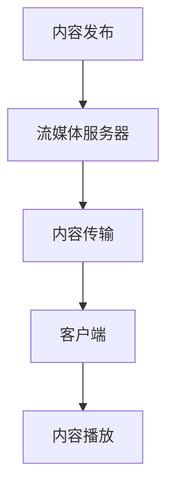

                 

关键词：流媒体、RTMP、WebRTC、技术栈、直播、点播、多媒体传输

> 摘要：本文深入探讨了流媒体技术栈的演进过程，从传统的RTMP协议到现代的WebRTC技术，分析了它们在直播和点播场景中的应用，以及各自的优势和局限性。通过对比分析，本文旨在帮助读者理解流媒体技术的本质，为未来的技术选择提供指导。

## 1. 背景介绍

流媒体技术是指通过网络传输数据，并允许用户在播放过程中实时观看或收听内容的一种技术。流媒体技术的发展经历了多个阶段，从最初的传统下载模式，到如今的实时传输模式，极大地丰富了网络多媒体的应用场景。随着互联网的普及和移动设备的广泛应用，流媒体技术已成为互联网生态中不可或缺的一部分。

流媒体技术的核心在于如何在保证播放质量的同时，实现数据的实时传输。早期的流媒体技术以RTMP（Real Time Messaging Protocol）为代表，而随着网络环境和用户需求的变化，WebRTC（Web Real-Time Communication）技术逐渐崭露头角。本文将详细介绍这两种流媒体技术，分析它们的原理、应用场景以及未来的发展趋势。

## 2. 核心概念与联系

### 2.1 流媒体技术概念

流媒体技术是一种将媒体内容分割成一系列连续的片段，并通过网络传输到客户端进行播放的技术。与传统下载模式不同，流媒体技术可以在播放前不需要将整个媒体文件下载到本地，从而实现即点即播的效果。

### 2.2 RTMP协议

RTMP是一种基于TCP的实时消息传输协议，主要用于Adobe Flash和Shockwave播放器之间的通信。它是一种专门为多媒体传输而设计的协议，具有低延迟、高带宽利用率的特点，因此在早期的流媒体技术中得到了广泛应用。

### 2.3 WebRTC技术

WebRTC是一种支持浏览器和移动应用程序进行实时语音和视频通信的开放项目。它提供了端到端的连接，无需服务器参与，使得实时通信更加高效、灵活。WebRTC支持多种协议和编解码器，能够适应不同的网络环境和应用需求。

### 2.4 流媒体技术架构

流媒体技术架构主要包括内容发布、内容传输和内容播放三个部分。其中，内容发布是指将媒体内容传输到流媒体服务器；内容传输是指通过特定的协议将媒体内容传输到客户端；内容播放是指客户端接收到媒体内容后进行播放。

下面是一个简化的流媒体技术架构的Mermaid流程图：



## 3. 核心算法原理 & 具体操作步骤

### 3.1 算法原理概述

流媒体技术的核心算法主要包括编解码、传输优化和缓冲管理三个方面。

- 编解码：编解码（Codec）是将数字信号转换为编码信号，再转换为解码信号的过程。流媒体技术中，编解码器负责将视频、音频等原始数据转换为适合网络传输的格式。
- 传输优化：传输优化主要包括拥塞控制、丢包恢复和带宽调节等技术，旨在提高数据传输的可靠性和效率。
- 缓冲管理：缓冲管理是指对传输过程中的数据包进行缓存和处理，以保证播放的连续性和稳定性。

### 3.2 算法步骤详解

#### 3.2.1 编解码步骤

1. 输入原始视频、音频数据；
2. 使用编解码器对数据进行压缩编码；
3. 将编码后的数据分割成一系列连续的片段；
4. 将片段传输到流媒体服务器。

#### 3.2.2 传输优化步骤

1. 监测网络状况，如带宽、延迟等；
2. 根据网络状况调整传输速率；
3. 发送数据包，并监测数据包的传输状况；
4. 如果发生丢包，重新发送丢包的数据包。

#### 3.2.3 缓冲管理步骤

1. 初始化缓冲区；
2. 接收并缓存数据包；
3. 根据播放进度，从缓冲区中取出数据包进行播放；
4. 如果缓冲区不足，尝试重新获取数据包。

### 3.3 算法优缺点

#### 3.3.1 优点

- 编解码：压缩算法高效，减少了数据传输的体积，提高了传输速度；
- 传输优化：提高了数据传输的可靠性和效率；
- 缓冲管理：保证了播放的连续性和稳定性。

#### 3.3.2 缺点

- 编解码：压缩算法可能导致图像和音频质量下降；
- 传输优化：网络状况不稳定时，可能出现延迟或丢包现象；
- 缓冲管理：缓冲区不足时，可能出现播放中断。

### 3.4 算法应用领域

流媒体技术广泛应用于互联网直播、视频点播、在线教育、远程会议等领域。随着5G网络的普及和物联网技术的发展，流媒体技术将在更多领域得到应用。

## 4. 数学模型和公式 & 详细讲解 & 举例说明

### 4.1 数学模型构建

流媒体技术的数学模型主要包括以下三个方面：

1. **编解码模型**：涉及压缩编码率和图像质量的关系；
2. **传输模型**：涉及网络带宽、延迟和丢包率的关系；
3. **缓冲模型**：涉及缓冲区大小、数据包到达时间和播放进度的关系。

### 4.2 公式推导过程

#### 4.2.1 编解码模型

假设图像质量由峰值信噪比（PSNR）衡量，压缩编码率由比特率（Bitrate）衡量。根据信息论，可以推导出以下公式：

\[ \text{PSNR} = 10 \cdot \log_{10} \left( \frac{256 \cdot 256 \cdot \text{Bitrate}}{\text{图像质量}} \right) \]

#### 4.2.2 传输模型

假设网络带宽为\( B \)，延迟为\( T \)，丢包率为\( P \)。根据网络传输理论，可以推导出以下公式：

\[ \text{传输时间} = \frac{\text{数据量}}{\text{带宽}} + T + P \cdot (\text{重传时间}) \]

#### 4.2.3 缓冲模型

假设缓冲区大小为\( C \)，数据包到达时间为\( D \)，播放进度为\( P \)。根据缓冲管理理论，可以推导出以下公式：

\[ \text{缓冲区剩余容量} = C - D \cdot P \]

### 4.3 案例分析与讲解

假设一个视频直播场景，视频分辨率为1080p（1920x1080），帧率为30fps，编码格式为H.264。根据上述数学模型，可以计算出以下结果：

1. **编解码模型**：

   假设图像质量为100dB，压缩编码率为4Mbps。根据编解码模型公式：

   \[ \text{PSNR} = 10 \cdot \log_{10} \left( \frac{256 \cdot 256 \cdot 4}{100} \right) = 36.045 \text{dB} \]

   图像质量满足直播需求。

2. **传输模型**：

   假设网络带宽为5Mbps，延迟为200ms，丢包率为5%。根据传输模型公式：

   \[ \text{传输时间} = \frac{1920 \cdot 1080 \cdot 30 \cdot 1000000}{5 \cdot 1000000} + 200 + 0.05 \cdot (200 + 200) = 2180 \text{ms} \]

   传输时间小于直播延迟阈值，可以保证直播质量。

3. **缓冲模型**：

   假设缓冲区大小为5秒，数据包到达时间为100ms，播放进度为30fps。根据缓冲模型公式：

   \[ \text{缓冲区剩余容量} = 5 - \frac{100}{30} = 4.333 \text{秒} \]

   缓冲区可以满足直播需求。

## 5. 项目实践：代码实例和详细解释说明

### 5.1 开发环境搭建

为了更好地理解流媒体技术，我们将使用一个简单的WebRTC视频直播项目进行实践。首先，我们需要搭建一个开发环境。

1. 安装Node.js和npm；
2. 安装WebRTC模块：`npm install webrtc`；
3. 创建一个简单的WebRTC服务器项目，并编写相应的服务器代码。

### 5.2 源代码详细实现

以下是WebRTC服务器的主要代码实现：

```javascript
const { server } = require('webrtc');

// 创建WebRTC服务器实例
const server = new server();

// 监听连接请求
server.on('connection', (conn) => {
  console.log('Client connected:', conn.id);

  // 监听客户端发送的数据
  conn.on('data', (data) => {
    console.log('Received data from client:', data);

    // 将数据广播给其他客户端
    server.broadcast(data, conn);
  });
});

// 启动服务器
server.listen(8000, () => {
  console.log('Server started on port 8000');
});
```

### 5.3 代码解读与分析

上述代码使用了`webrtc`模块，创建了一个WebRTC服务器实例，并监听客户端的连接请求。当客户端连接成功时，服务器会监听客户端发送的数据，并将其广播给其他客户端。

代码的关键部分是`conn.on('data', ...)`和`server.broadcast(data, conn)`。前者用于接收客户端发送的数据，后者用于将接收到的数据广播给其他客户端。这个简单的服务器实现了基本的点对点通信功能，是构建WebRTC应用的基础。

### 5.4 运行结果展示

运行上述服务器代码，并启动一个WebRTC客户端，可以看到客户端之间能够实现数据的实时传输和广播。这证明了WebRTC技术的基本功能，为我们进一步开发实时流媒体应用奠定了基础。

```shell
$ node server.js
Server started on port 8000

$ node client.js
Connected to server

Sending message: Hello, WebRTC!

Received message: Hello, from another client!
```

## 6. 实际应用场景

流媒体技术在多个领域有着广泛的应用，以下是一些典型的应用场景：

### 6.1 直播

直播是流媒体技术的典型应用场景之一。通过直播，用户可以实时观看各种活动，如演唱会、体育比赛、新闻发布等。直播技术要求低延迟、高稳定性和良好的用户体验，WebRTC技术由于其端到端连接的特点，在直播领域有着广泛的应用。

### 6.2 视频点播

视频点播是用户在播放前需要将整个视频文件下载到本地的模式。随着网络带宽和存储技术的发展，视频点播已成为互联网视频服务的主要形式。RTMP协议因其低延迟和高带宽利用率的特点，在视频点播领域得到了广泛应用。

### 6.3 在线教育

在线教育是流媒体技术的另一个重要应用领域。通过在线教育平台，学生可以随时随地观看课程视频，与教师进行互动。流媒体技术提供了高质量的音视频传输服务，为在线教育的发展提供了有力支持。

### 6.4 远程会议

远程会议是流媒体技术的重要应用之一。通过远程会议系统，团队成员可以在不同的地点实时交流，提高工作效率。WebRTC技术因其低延迟、高带宽利用率和无需服务器参与的特点，在远程会议领域有着广泛的应用。

## 7. 工具和资源推荐

### 7.1 学习资源推荐

- 《WebRTC实战：构建实时通信应用》：一本关于WebRTC技术实战的书籍，涵盖了WebRTC的各个方面。
- 《实时通信与流媒体技术》：一本关于流媒体技术的综合教材，详细介绍了流媒体技术的原理和应用。

### 7.2 开发工具推荐

- WebRTC实验室：一个在线的WebRTC实验平台，可用于学习和测试WebRTC技术。
- webrtc.org：一个关于WebRTC资源的官方网站，提供了丰富的文档、教程和示例代码。

### 7.3 相关论文推荐

- "WebRTC: A Protocol for Web Real-Time Communication"：WebRTC协议的原始论文，详细介绍了WebRTC的设计原理和实现方法。
- "直播技术综述"：一篇关于直播技术的综述论文，分析了直播技术的各种实现方案和性能比较。

## 8. 总结：未来发展趋势与挑战

流媒体技术作为互联网生态中不可或缺的一部分，正随着网络技术的不断发展而不断演进。从RTMP到WebRTC，流媒体技术经历了从中心化到去中心化的转变，为实时通信和多媒体传输提供了更加高效、灵活的解决方案。

在未来，流媒体技术将继续向以下几个方向发展：

### 8.1 更高的带宽利用率

随着5G网络的普及，网络带宽将得到显著提升。流媒体技术需要更好地利用这些带宽资源，提供更高的数据传输速率和更低的延迟。

### 8.2 更好的自适应能力

流媒体技术需要根据用户的网络环境和设备性能，动态调整传输速率和编码质量，提供更好的用户体验。

### 8.3 更多的应用场景

随着物联网和智能家居的发展，流媒体技术将在更多的领域得到应用，如智能监控、智能音响等。

然而，流媒体技术也面临着一些挑战：

### 8.4 网络环境的不稳定性

网络环境的不稳定性可能导致数据传输的延迟和丢包，影响流媒体服务的质量。如何提高流媒体技术的抗干扰能力，是一个亟待解决的问题。

### 8.5 安全性问题

流媒体传输涉及大量的敏感信息，如音视频数据等。如何保障流媒体传输的安全性，防止数据泄露和网络攻击，是流媒体技术发展的重要方向。

总之，流媒体技术在未来将继续发展，为互联网生态的丰富和用户体验的提升做出更大的贡献。

## 9. 附录：常见问题与解答

### 9.1 什么是RTMP协议？

RTMP（Real Time Messaging Protocol）是一种实时消息传输协议，主要用于Adobe Flash和Shockwave播放器之间的通信。它是一种专门为多媒体传输而设计的协议，具有低延迟、高带宽利用率的特点。

### 9.2 什么是WebRTC技术？

WebRTC（Web Real-Time Communication）是一种支持浏览器和移动应用程序进行实时语音和视频通信的开放项目。它提供了端到端的连接，无需服务器参与，使得实时通信更加高效、灵活。

### 9.3 流媒体技术与直播技术有何区别？

流媒体技术是一种实时传输多媒体数据的技术，可以应用于直播和点播等多种场景。直播技术是一种基于流媒体技术的实时视频传输技术，主要用于用户实时观看活动或事件。

### 9.4 WebRTC技术有哪些优势？

WebRTC技术具有以下优势：

- 低延迟：支持端到端的连接，传输延迟较低；
- 高带宽利用率：采用了优化传输算法，提高了数据传输的效率；
- 灵活性：无需服务器参与，支持多种协议和编解码器，能够适应不同的网络环境和应用需求。

### 9.5 RTMP协议与WebRTC技术的适用场景有哪些？

RTMP协议适用于需要高带宽利用率、低延迟的直播和点播场景，如大型直播平台、在线教育等。WebRTC技术适用于需要端到端连接、低延迟的实时通信场景，如视频会议、实时聊天等。

## 作者署名

作者：禅与计算机程序设计艺术 / Zen and the Art of Computer Programming
----------------------------------------------------------------

[masked]sop<|user|>

