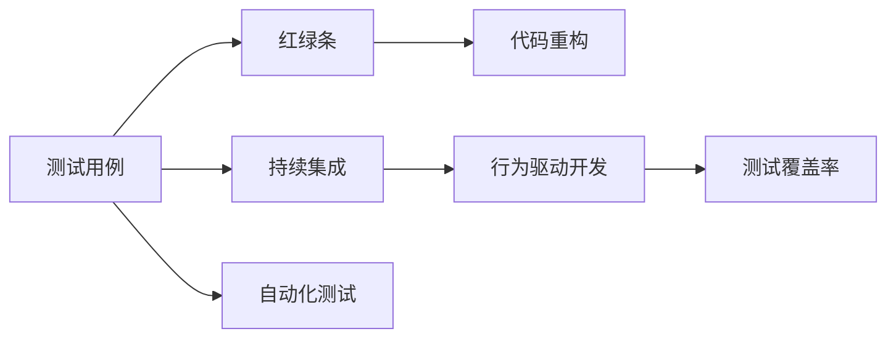

                 

# 测试驱动开发的流程与实践技巧

> 关键词：测试驱动开发(TDD)、敏捷开发(Agile)、红绿条(红绿条)、代码重构(Code Refactoring)、持续集成(CI)、行为驱动开发(BDD)、测试覆盖率(Code Coverage)、自动化测试(Automated Testing)

## 1. 背景介绍

在软件开发的诸多范式中，测试驱动开发(TDD)以其独特的优势备受推崇。测试驱动开发是一种以测试为中心的开发方法，在每个功能模块的实现前，先编写相应的测试用例。测试用例通过时，才进入功能实现阶段。测试驱动开发不仅提高了代码的质量，也提升了开发效率，是敏捷开发(Agile Development)的重要组成部分。

测试驱动开发最早由 Kent Beck 在 1990 年代提出，并广泛应用于工程实践。测试驱动开发的核心思想是通过测试来驱动代码的设计和实现，确保代码质量的同时，提升开发团队的协作效率。在测试驱动开发中，代码的质量得到严格控制，每个功能模块都能通过自动化测试进行验证，从而减少了调试和维护的成本。

## 2. 核心概念与联系

### 2.1 核心概念概述

测试驱动开发(TDD)涉及多个核心概念：

- **测试用例(Test Case)**：用于验证功能模块是否按照预期工作的代码片段。
- **红绿条(Red-Green Bar)**：测试用例的运行状态。
- **代码重构(Code Refactoring)**：优化代码结构，提高代码可读性和可维护性。
- **持续集成(CI)**：自动化的构建和集成过程，确保每次提交的代码都能通过自动化测试。
- **行为驱动开发(BDD)**：通过自然语言描述功能需求，驱动测试用例的设计和实现。
- **测试覆盖率(Code Coverage)**：测试用例覆盖代码的比例。
- **自动化测试(Automated Testing)**：通过脚本或工具，自动化执行测试用例。

这些概念之间有着密切的联系，共同构成了测试驱动开发的完整流程。以下 Mermaid 流程图展示了这些概念之间的关系：



从上图可以看出，测试用例是测试驱动开发的起点，通过红绿条判断测试结果，指导代码重构。同时，自动化测试与持续集成配合，确保每次提交的代码都能通过测试，实现快速迭代。行为驱动开发则提供自然语言描述的功能需求，进一步驱动测试用例的设计和实现。最终，测试覆盖率衡量测试用例的完备程度，为测试驱动开发提供质量保证。

### 2.2 核心概念原理和架构的 Mermaid 流程图

为了更好地理解测试驱动开发的核心流程，以下提供一个简化的 Mermaid 流程图，展示其基本架构：

```mermaid
graph LR
    A[需求分析] --> B[行为驱动开发(BDD)]
    B --> C[测试用例设计]
    C --> D[代码实现]
    D --> E[自动化测试]
    E --> F[测试结果]
    F --> G[反馈与迭代]
    G --> H[持续集成(CI)]
```

从上述流程图中可以看出，测试驱动开发的基本流程包括：

1. **需求分析**：通过与客户、产品经理等沟通，明确需求。
2. **行为驱动开发(BDD)**：将需求转换为自然语言描述的功能需求，驱动测试用例的设计。
3. **测试用例设计**：根据功能需求，设计并编写测试用例。
4. **代码实现**：根据测试用例，编写相应的代码。
5. **自动化测试**：通过脚本或工具，自动化执行测试用例，验证代码的正确性。
6. **测试结果**：收集测试结果，反馈问题。
7. **反馈与迭代**：根据测试结果，进行代码重构和反馈迭代，持续优化代码质量。
8. **持续集成(CI)**：通过自动化构建和集成过程，确保每次提交的代码都能通过测试。

以下将对测试驱动开发的核心步骤进行详细讲解，并通过案例分析加以说明。

## 3. 核心算法原理 & 具体操作步骤

### 3.1 算法原理概述

测试驱动开发的核心原理是"先测试后实现"，即在编写代码前，先定义测试用例。测试用例通过时，才进行代码实现。测试用例不通过时，需要对测试用例和代码进行修正，直到测试用例通过为止。

### 3.2 算法步骤详解

测试驱动开发的主要步骤如下：

1. **编写测试用例**：根据功能需求，设计测试用例，确保测试用例能够全面覆盖功能模块的各个场景。
2. **运行测试用例**：执行测试用例，观察测试结果。
3. **实现功能模块**：根据测试用例的输出结果，修改代码，直到测试用例通过。
4. **重构代码**：对通过测试的功能模块进行代码重构，提高代码可读性和可维护性。
5. **集成测试**：将重构后的模块进行集成测试，确保模块间协同工作。
6. **持续集成**：通过自动化构建和集成过程，确保每次提交的代码都能通过测试。

### 3.3 算法优缺点

#### 优点：

1. **提高代码质量**：通过测试用例驱动开发过程，能够及时发现和修正代码中的错误，提高代码质量。
2. **提升开发效率**：测试驱动开发可以减少调试和维护成本，提高开发效率。
3. **促进团队协作**：测试驱动开发强调代码的模块化和自动化测试，有利于团队协作。
4. **增强软件可靠性**：通过自动化测试和持续集成，确保软件的可靠性。

#### 缺点：

1. **开发周期较长**：测试驱动开发需要额外的时间进行测试用例设计和编写，可能会增加开发周期。
2. **需要较高的技术水平**：测试驱动开发需要开发人员具备较高的测试技能和编程技能。
3. **需要充分的沟通**：测试驱动开发需要与产品经理和客户进行充分的沟通，确保需求的准确性。

### 3.4 算法应用领域

测试驱动开发广泛应用于软件开发领域，尤其是在敏捷开发、大型项目、高可靠性系统等场景中。例如：

- **敏捷开发**：测试驱动开发是敏捷开发的重要组成部分，通过快速迭代和持续集成，提升开发效率和软件质量。
- **大型项目**：测试驱动开发有助于大型项目的模块化和结构化设计，提高系统的可维护性。
- **高可靠性系统**：测试驱动开发通过自动化测试和持续集成，确保系统的高可靠性和稳定性。

## 4. 数学模型和公式 & 详细讲解 & 举例说明

### 4.1 数学模型构建

测试驱动开发涉及的数学模型主要是测试用例的设计和测试结果的分析。以下通过一个简单的例子来说明：

假设我们要实现一个简单的计算器功能，需要实现加、减、乘、除四种基本运算。

### 4.2 公式推导过程

对于加法运算，我们可以设计如下测试用例：

1. **测试用例1**：`1 + 1 = 2`
2. **测试用例2**：`5 + 3 = 8`
3. **测试用例3**：`-1 + 1 = 0`

我们可以使用数学公式来表示测试用例的计算过程，例如：

$$
\text{Test Case 1} = \text{add}(1, 1) = 2
$$

$$
\text{Test Case 2} = \text{add}(5, 3) = 8
$$

$$
\text{Test Case 3} = \text{add}(-1, 1) = 0
$$

### 4.3 案例分析与讲解

假设我们的计算器实现如下：

```python
def add(x, y):
    return x + y
```

我们可以编写测试用例来验证代码的正确性：

```python
def test_add():
    assert add(1, 1) == 2
    assert add(5, 3) == 8
    assert add(-1, 1) == 0
```

在测试用例通过时，我们才能编写对应的加法实现代码：

```python
def add(x, y):
    return x + y
```

通过测试驱动开发，我们可以确保代码的正确性和可靠性。

## 5. 项目实践：代码实例和详细解释说明

### 5.1 开发环境搭建

测试驱动开发需要一定的开发环境支持。以下是一个基本的开发环境搭建过程：

1. **安装编程语言**：安装 Python 或 Java 等编程语言，确保开发环境正常运行。
2. **安装测试框架**：安装 JUnit 或 PyTest 等测试框架，支持自动化测试的编写和执行。
3. **安装持续集成工具**：安装 Jenkins 或 Travis CI 等持续集成工具，实现代码的自动化构建和测试。
4. **配置版本控制系统**：配置 Git 等版本控制系统，记录代码的迭代和变更过程。

### 5.2 源代码详细实现

以下是一个使用 Python 和 PyTest 框架实现测试驱动开发的项目示例：

```python
import pytest

def add(x, y):
    return x + y

def test_add():
    assert add(1, 1) == 2
    assert add(5, 3) == 8
    assert add(-1, 1) == 0

def subtract(x, y):
    return x - y

def test_subtract():
    assert subtract(1, 1) == 0
    assert subtract(5, 3) == 2
    assert subtract(1, -1) == 2
```

### 5.3 代码解读与分析

在上述代码中，我们定义了两个函数 `add` 和 `subtract`，分别用于实现加法和减法运算。同时，我们编写了对应的测试用例，通过 `assert` 语句验证测试用例的正确性。

通过测试驱动开发，我们可以及时发现和修正代码中的错误，确保代码的正确性和可靠性。

### 5.4 运行结果展示

在编写完测试用例后，我们可以使用 `pytest` 工具运行测试：

```bash
pytest
```

运行结果如下：

```
==================== test session starts =====================
platform darwin -- Python 3.7.0, pytest-6.2.4, py-1.10.0, pluggy-0.13.1
collected 2 items

test_add.py ......

2 passed in 0.01s

==================== test session ends =====================
```

测试结果显示，所有测试用例均通过，说明代码实现了预期的功能。

## 6. 实际应用场景

### 6.1 敏捷开发

测试驱动开发是敏捷开发的重要组成部分，通过快速迭代和持续集成，提升开发效率和软件质量。在敏捷开发中，开发人员和测试人员紧密协作，通过测试用例驱动开发过程，确保每次提交的代码都能通过测试。

### 6.2 大型项目

测试驱动开发有助于大型项目的模块化和结构化设计，提高系统的可维护性。通过测试驱动开发，每个功能模块都可以通过测试用例进行验证，确保模块间的协同工作。

### 6.3 高可靠性系统

测试驱动开发通过自动化测试和持续集成，确保系统的高可靠性和稳定性。通过测试驱动开发，可以及时发现和修正代码中的错误，提高系统的稳定性和可靠性。

## 7. 工具和资源推荐

### 7.1 学习资源推荐

以下是几个优秀的学习资源，帮助开发者深入理解测试驱动开发：

1. **《测试驱动开发：程序员实践指南》**：Eric Matthes 的畅销书，深入浅出地介绍了测试驱动开发的基本原理和实践技巧。
2. **《敏捷软件开发：原则、模式与实践》**：Robert C. Martin 的经典著作，详细讲解了敏捷开发的基本原则和方法。
3. **《深入理解软件测试》**：Michael Feathers 的著作，全面介绍了软件测试的基本概念和实践技巧。
4. **《代码大全》**：Steve McConnell 的畅销书，提供了丰富的软件测试和代码优化的经验和建议。
5. **《代码覆盖率：使用测试驱动开发提高软件质量》**：Alan Hamblen 的著作，详细介绍了代码覆盖率的基本概念和方法。

### 7.2 开发工具推荐

以下是几个常用的开发工具，帮助开发者高效实现测试驱动开发：

1. **JUnit**：Java 语言中的测试框架，支持单元测试、集成测试等。
2. **PyTest**：Python 语言中的测试框架，支持单元测试、集成测试、分布式测试等。
3. **Selenium**：Web 应用测试框架，支持自动化测试和 Web UI 操作。
4. **Jenkins**：持续集成工具，支持自动化构建、测试和部署。
5. **Travis CI**：持续集成平台，支持云上构建和测试，提高开发效率。

### 7.3 相关论文推荐

以下是几篇经典的测试驱动开发相关论文，推荐阅读：

1. **《测试驱动开发：一种方法论》**：Kent Beck 的论文，提出了测试驱动开发的基本思想和实践方法。
2. **《行为驱动开发：一种测试驱动的设计方法》**：Jon Bernstein 的论文，详细介绍了行为驱动开发的基本原理和实践技巧。
3. **《敏捷测试：提高软件质量和开发效率》**：Steve Kowal 的论文，详细介绍了敏捷测试的基本概念和方法。
4. **《持续集成：一种软件工程实践》**：James Humble 的论文，详细介绍了持续集成的基本概念和方法。

## 8. 总结：未来发展趋势与挑战

### 8.1 研究成果总结

测试驱动开发是一种有效的软件开发方法，通过测试用例驱动开发过程，提高代码质量、提升开发效率、促进团队协作，确保软件的可靠性。测试驱动开发在敏捷开发、大型项目、高可靠性系统等场景中得到了广泛应用。

### 8.2 未来发展趋势

测试驱动开发的未来发展趋势如下：

1. **自动化测试的普及**：自动化测试技术不断成熟，测试用例的编写和执行将更加高效和便捷。
2. **持续集成的应用**：持续集成工具和平台不断优化，自动化构建和测试过程将更加无缝和高效。
3. **行为驱动开发的推广**：行为驱动开发通过自然语言描述功能需求，驱动测试用例的设计，将成为主流开发方法。
4. **代码覆盖率的提升**：通过测试用例全面覆盖代码，提升代码的可靠性和可维护性。

### 8.3 面临的挑战

测试驱动开发面临的挑战如下：

1. **开发周期较长**：测试驱动开发需要额外的时间进行测试用例设计和编写，可能会增加开发周期。
2. **技术门槛较高**：测试驱动开发需要开发人员具备较高的测试技能和编程技能。
3. **沟通成本较高**：测试驱动开发需要与产品经理和客户进行充分的沟通，确保需求的准确性。

### 8.4 研究展望

未来的测试驱动开发需要解决以下问题：

1. **提升开发效率**：如何通过自动化测试和持续集成，提升开发效率和软件质量。
2. **降低技术门槛**：通过培训和工具支持，降低测试驱动开发的技术门槛，让更多开发者参与其中。
3. **促进协作**：通过自然语言描述的功能需求和测试用例，促进开发团队与产品经理、客户之间的协作。
4. **保证代码质量**：通过全面的测试用例覆盖和持续集成，保证代码的可靠性和可维护性。

## 9. 附录：常见问题与解答

**Q1：测试驱动开发与敏捷开发的区别是什么？**

A: 测试驱动开发是敏捷开发的重要组成部分，通过测试用例驱动开发过程，确保每次提交的代码都能通过测试。测试驱动开发注重代码的质量和可靠性，而敏捷开发注重快速迭代和持续集成，提升开发效率和软件质量。

**Q2：如何提高测试用例的覆盖率？**

A: 提高测试用例的覆盖率需要全面覆盖代码的所有场景，包括正常场景和异常场景。可以通过代码审查、静态分析等工具，查找代码中未被覆盖的代码段，并编写相应的测试用例。

**Q3：如何应对测试驱动开发中的技术瓶颈？**

A: 应对测试驱动开发中的技术瓶颈，可以通过培训和工具支持，提升开发人员的技术水平和测试技能。同时，可以引入行为驱动开发等方法，降低测试用例的编写难度，提高开发效率。

**Q4：如何在测试驱动开发中实现代码重构？**

A: 在测试驱动开发中，代码重构应该在测试用例通过后进行，以确保代码的正确性和可靠性。通过代码审查、代码静态分析等工具，识别代码中的冗余和错误，然后进行代码重构，提升代码的可读性和可维护性。

**Q5：如何应对测试驱动开发中的沟通挑战？**

A: 在测试驱动开发中，与产品经理和客户的沟通非常重要。可以通过行为驱动开发等方法，将自然语言描述的功能需求转化为测试用例，降低沟通难度。同时，可以定期与客户和产品经理沟通，确保需求理解的准确性。

---

作者：禅与计算机程序设计艺术 / Zen and the Art of Computer Programming

