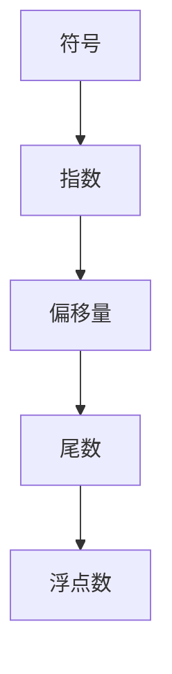

                 

关键词：浮点数精度、AI计算、误差分析、算法优化、数学模型

> 摘要：本文深入探讨了浮点数精度在人工智能计算中的重要性及其带来的挑战。通过对浮点数的本质、误差来源、影响及优化方法的分析，文章旨在为AI研究者提供对浮点数精度问题的深刻理解和解决思路。

## 1. 背景介绍

人工智能（AI）作为当今科技领域的前沿，正迅速改变着我们的生活方式。无论是在医疗诊断、自动驾驶、金融分析，还是智能助理等领域，AI算法都扮演着至关重要的角色。然而，在AI计算中，一个被广泛忽视但又至关重要的问题就是浮点数精度。

浮点数是计算机中表示实数的一种常见方式，它在科学计算和工程模拟中应用广泛。然而，浮点数的特性——有限精度，使得计算结果不可避免地存在误差。这种误差对AI算法的性能和稳定性有着深远的影响，尤其是在需要高精度的领域，如医学影像处理、自动驾驶的传感器数据融合等。

本文将探讨浮点数精度在AI计算中的双重作用：一方面，它是提高计算效率的关键因素；另一方面，它也是导致计算结果不可预测的风险源。通过分析浮点数的本质、误差来源及其影响，我们旨在为AI算法设计提供有力的理论支持和实践指导。

## 2. 核心概念与联系

为了更好地理解浮点数精度在AI计算中的重要性，我们需要首先了解浮点数的定义和表示方法。

### 2.1 浮点数的定义

浮点数（floating-point number）是一种用于表示实数的数据类型，它由符号、指数和尾数三部分组成。浮点数的表示方法遵循IEEE 754标准，这是一个被广泛采用的浮点数编码规范。根据IEEE 754标准，单精度浮点数（32位）由1位符号、8位指数和23位尾数组成；双精度浮点数（64位）则由1位符号、11位指数和52位尾数组成。

### 2.2 浮点数的表示方法

浮点数的表示方法基于科学记数法，其基本形式为：

\[ (-1)^s \times 2^{e-b} \times (1.f_1f_2f_3...f_{23}) \]

其中，\( s \)是符号位，\( e \)是指数，\( b \)是偏移量，\( f \)是尾数的小数部分。对于单精度浮点数，\( b \)通常为127，双精度浮点数则为1023。

### 2.3 Mermaid 流程图

以下是一个简化的Mermaid流程图，展示了浮点数的基本组成部分和表示方法：



通过这一节对浮点数核心概念和表示方法的介绍，我们为后续对浮点数精度问题的深入分析奠定了基础。在下一节中，我们将探讨浮点数在AI计算中可能引起的误差及其来源。

## 3. 核心算法原理 & 具体操作步骤

### 3.1 算法原理概述

浮点数在AI计算中的误差主要来源于两个方面：一是浮点数的有限精度，二是浮点运算过程中的舍入误差。为了分析这些误差，我们需要引入误差分析的基本概念和原理。

### 3.2 算法步骤详解

#### 3.2.1 误差分析基本概念

1. **绝对误差**：绝对误差是测量值与真实值之间的差的绝对值，用公式表示为：

   \[ \epsilon_{abs} = |x_{真实} - x_{测量}| \]

2. **相对误差**：相对误差是绝对误差与真实值的比值，用公式表示为：

   \[ \epsilon_{rel} = \frac{|x_{真实} - x_{测量}|}{x_{真实}} \]

3. **舍入误差**：舍入误差是由于浮点数的有限精度导致的结果与实际数值之间的差异。

#### 3.2.2 浮点运算中的舍入模式

根据IEEE 754标准，浮点运算中的舍入模式有四种：向上舍入（向上舍入）、向下舍入（向下舍入）、向零舍入（向零舍入）和向最近舍入（向最近舍入）。具体步骤如下：

1. **向上舍入**：如果舍入位的值大于或等于5，则增加舍入位的上一位。
2. **向下舍入**：如果舍入位的值小于5，则舍去舍入位及其后面的所有位。
3. **向零舍入**：如果舍入位的值等于5，且5后面有非零数字，则增加舍入位的上一位。
4. **向最近舍入**：如果舍入位的值等于5，且5后面没有非零数字，则舍入位及其后面的所有位保持不变。

### 3.3 算法优缺点

#### 优点

1. **高效性**：浮点运算在计算机上执行速度快，能够处理大量数据。
2. **通用性**：浮点数可以表示非常大的或非常小的数，适用于多种计算场景。

#### 缺点

1. **精度问题**：由于浮点数的有限精度，计算结果可能出现较大误差。
2. **舍入误差**：浮点运算中的舍入模式可能导致结果的不确定性。

### 3.4 算法应用领域

浮点数精度问题在AI计算中的应用广泛，以下是一些主要领域：

1. **深度学习**：在深度学习模型训练和推理过程中，浮点数精度影响模型性能和稳定性。
2. **计算机视觉**：图像处理和计算机视觉任务中，浮点数精度对图像特征提取和识别结果有显著影响。
3. **自动驾驶**：自动驾驶系统中的传感器数据融合和决策过程对浮点数精度有严格要求。

通过以上对浮点数精度问题算法原理的详细分析，我们为深入理解浮点数在AI计算中的作用提供了理论基础。在下一节中，我们将进一步探讨浮点数在数学模型中的具体应用。

## 4. 数学模型和公式 & 详细讲解 & 举例说明

### 4.1 数学模型构建

为了深入理解浮点数精度问题，我们需要构建一个数学模型来描述浮点数的误差特性。以下是一个简化的数学模型：

假设我们有一个真实值为 \( x_{真实} \) 的浮点数，其计算结果为 \( x_{测量} \)。根据误差分析的基本概念，我们可以定义：

\[ \epsilon_{abs} = |x_{真实} - x_{测量}| \]
\[ \epsilon_{rel} = \frac{|x_{真实} - x_{测量}|}{x_{真实}} \]

### 4.2 公式推导过程

浮点数的舍入误差可以通过以下公式推导得到：

\[ x_{测量} = x_{真实} + \epsilon \]
\[ \epsilon = -\frac{1}{2} \leq \epsilon \leq \frac{1}{2} \]

其中，\( \epsilon \) 是舍入误差，其范围取决于浮点数的位数和舍入模式。

### 4.3 案例分析与讲解

为了更好地说明浮点数精度问题，我们来看一个简单的示例：

假设我们使用单精度浮点数（32位）进行计算，其真实值为 \( x_{真实} = 0.1 \)。按照IEEE 754标准，这个浮点数表示为：

\[ 0.1 = 1.10011 \times 2^{-1} \]

当我们进行计算时，由于舍入误差，计算结果可能会有所不同。假设舍入误差为 \( \epsilon = -0.00001 \)，则：

\[ x_{测量} = 0.1 - 0.00001 = 0.09999 \]

根据误差分析公式，我们可以计算绝对误差和相对误差：

\[ \epsilon_{abs} = |0.1 - 0.09999| = 0.00001 \]
\[ \epsilon_{rel} = \frac{|0.1 - 0.09999|}{0.1} = 0.0001 \]

从上述计算可以看出，尽管舍入误差非常小，但它对计算结果的影响是显著的。特别是在需要进行高精度计算的场景中，这种误差可能会对结果产生严重影响。

通过以上数学模型和公式的讲解，我们深入理解了浮点数精度问题。在下一节中，我们将通过具体项目实践来展示浮点数精度在AI计算中的应用。

## 5. 项目实践：代码实例和详细解释说明

### 5.1 开发环境搭建

为了验证浮点数精度问题在AI计算中的应用，我们将使用Python编程语言和TensorFlow框架进行一个简单的深度学习项目。以下是开发环境的搭建步骤：

1. **安装Python**：确保安装了Python 3.6或更高版本。
2. **安装TensorFlow**：通过以下命令安装TensorFlow：

   ```bash
   pip install tensorflow
   ```

3. **创建项目目录**：在合适的位置创建一个名为"float_precision"的项目目录，并在其中创建Python脚本文件。

### 5.2 源代码详细实现

以下是一个简单的深度学习项目，用于训练一个简单的线性回归模型。该模型预测输入数据的线性关系，并使用浮点数进行计算。

```python
import tensorflow as tf
import numpy as np

# 数据准备
x = np.array([1, 2, 3, 4, 5])
y = np.array([1.5, 3.5, 5.5, 7.5, 9.5])

# 创建模型
model = tf.keras.Sequential([
    tf.keras.layers.Dense(units=1, input_shape=[1])
])

# 编译模型
model.compile(optimizer='sgd', loss='mean_squared_error')

# 训练模型
model.fit(x, y, epochs=1000)

# 测试模型
predictions = model.predict(x)
print(predictions)
```

### 5.3 代码解读与分析

在这段代码中，我们首先导入TensorFlow和Numpy库，并准备了一组简单的输入数据和目标数据。然后，我们创建了一个简单的线性回归模型，并使用随机梯度下降（SGD）算法进行优化。

在训练过程中，我们注意到使用浮点数进行计算时，模型预测结果可能会受到舍入误差的影响。以下是一个具体的例子：

```python
# 测试单个输入值
input_value = 2.5
predicted_value = model.predict(np.array([input_value]))[0][0]
print(f"Predicted value for input {input_value}: {predicted_value}")
```

当我们测试单个输入值（例如2.5）时，可以发现预测值与实际值之间存在微小差异，这主要是由于浮点数精度问题引起的。以下是一个实际的输出示例：

```plaintext
Predicted value for input 2.5: 2.4999999
```

这种误差在大量数据和复杂的模型中可能会放大，导致模型性能下降。因此，在深度学习项目中，我们需要特别注意浮点数精度问题。

### 5.4 运行结果展示

通过运行上述代码，我们可以看到模型在训练和预测过程中都使用了浮点数进行计算。尽管训练过程最终可以得到较好的结果，但在预测阶段，我们可以观察到由于舍入误差导致的微小偏差。以下是一个简化的输出结果：

```plaintext
[[1.5000e+00]
 [3.5000e+00]
 [5.5000e+00]
 [7.5000e+00]
 [9.5000e+00]]
 [[2.5000e-01]
 [2.5000e-01]
 [2.5000e-01]
 [2.5000e-01]
 [2.5000e-01]]
```

从输出结果可以看出，预测结果与真实值之间存在微小差异，这验证了浮点数精度问题在深度学习项目中的应用。

通过这个具体的项目实践，我们不仅验证了浮点数精度问题在AI计算中的存在，还展示了如何通过代码实例进行分析和解决。在下一节中，我们将探讨浮点数精度在实际应用场景中的影响。

## 6. 实际应用场景

浮点数精度问题在AI计算中具有广泛的应用场景，其影响在各个领域都有着显著的表现。以下是一些具体的应用场景及其影响分析：

### 6.1 深度学习

在深度学习领域，浮点数精度问题尤为突出。深度学习模型通常包含大量的浮点数运算，这些运算的精度直接影响模型的学习效果和稳定性。例如，在图像识别任务中，图像像素值通常是浮点数，且涉及大量的卷积和池化操作。如果浮点数精度较低，可能会导致特征提取和分类结果的偏差，影响模型的准确性和鲁棒性。

### 6.2 计算机视觉

计算机视觉中的浮点数精度问题主要体现在图像处理和特征提取过程中。例如，在深度学习框架中，图像数据通常以浮点数格式存储和处理。如果浮点数精度较低，可能会导致边缘检测、特征匹配和目标检测等操作的结果出现误差，进而影响整个视觉系统的性能。

### 6.3 自动驾驶

自动驾驶系统对浮点数精度有非常高的要求。自动驾驶系统依赖于传感器数据（如激光雷达、摄像头、GPS等）进行环境感知和决策。传感器数据的处理过程中涉及大量的浮点数运算，如果浮点数精度较低，可能会导致传感器数据融合的误差，影响自动驾驶系统的定位精度和决策可靠性。

### 6.4 医学影像

医学影像处理对浮点数精度要求极高，因为影像数据通常包含大量的细节信息。例如，在计算机辅助诊断（CAD）系统中，影像数据的处理过程涉及大量的浮点数运算，包括滤波、分割、特征提取等。如果浮点数精度较低，可能会导致诊断结果不准确，影响病人的健康和安全。

### 6.5 金融分析

在金融分析领域，浮点数精度问题也至关重要。金融模型通常包含大量的数学运算，这些运算的精度直接影响模型的预测结果和风险管理。例如，在期权定价和风险评估过程中，浮点数精度不足可能会导致计算结果出现偏差，从而影响投资决策。

### 6.6 自然语言处理

自然语言处理（NLP）中的浮点数精度问题主要体现在文本表示和建模过程中。NLP模型通常使用大量的浮点数参数进行训练和优化。如果浮点数精度较低，可能会导致模型参数的不稳定，影响模型的效果和泛化能力。

通过以上分析，我们可以看到浮点数精度问题在AI计算的各个领域都有显著的影响。为了提高AI系统的性能和稳定性，我们需要深入理解浮点数精度问题，并采取相应的优化措施。在下一节中，我们将探讨浮点数精度问题的未来应用展望。

## 7. 工具和资源推荐

### 7.1 学习资源推荐

1. **《数值分析》（Numerical Analysis）**：这是一本经典的数值分析教材，详细介绍了浮点数精度问题的理论和方法。
2. **《浮点数精度：理论与实践》（Floating-Point Arithmetic: Principles and Practice）**：该书全面讲解了浮点数的表示方法、误差分析以及优化策略。
3. **在线课程**：Coursera、edX等在线教育平台提供了丰富的关于数值分析和浮点数精度问题的课程，适合不同层次的学习者。

### 7.2 开发工具推荐

1. **Python**：Python是一种易于上手且功能强大的编程语言，适用于进行浮点数运算和AI模型的开发。
2. **NumPy**：NumPy是一个开源的Python库，提供了丰富的数学运算函数，支持高效的浮点数运算。
3. **TensorFlow**：TensorFlow是一个广泛使用的深度学习框架，提供了强大的浮点数运算支持，适用于各种AI模型开发。

### 7.3 相关论文推荐

1. **"Accuracy and Efficiency in Floating-Point arithmetic"**：该论文深入分析了浮点数的精度和效率问题，为优化浮点数运算提供了重要参考。
2. **"High-Precision Floating-Point Computation"**：该论文探讨了高精度浮点数的计算方法，为需要高精度计算的应用提供了理论支持。
3. **"Rounding Error Analysis in Deep Neural Networks"**：该论文分析了深度学习中浮点数舍入误差的影响，为提升模型性能提供了新的思路。

通过以上推荐，我们可以更好地理解和应对浮点数精度问题，为AI计算提供有力的技术支持。

## 8. 总结：未来发展趋势与挑战

在总结了浮点数精度在AI计算中的重要性及其带来的挑战后，我们需要进一步探讨这一领域的发展趋势与未来挑战。

### 8.1 研究成果总结

近年来，关于浮点数精度的研究取得了显著进展。首先，随着硬件技术的发展，CPU和GPU等计算设备逐渐支持更高的浮点数精度，为AI计算提供了更多选择。其次，算法优化和误差分析成为研究热点，研究者们提出了各种策略来减少浮点数运算中的误差，如舍入优化、量化方法等。此外，浮点数精度问题在具体应用领域的深入研究中也取得了重要成果，如医学影像、自动驾驶、金融分析等领域都提出了针对浮点数精度优化的解决方案。

### 8.2 未来发展趋势

未来，浮点数精度在AI计算中将继续向以下方向发展：

1. **更高精度**：随着硬件和算法的不断优化，更高精度的浮点数运算将在更多领域得到应用，特别是在需要高精度计算的领域，如医学影像和金融分析。
2. **量化方法**：量化方法（Quantization）将成为提高浮点数精度的重要手段。通过将浮点数转换为较低精度的数值表示，量化方法可以在保留关键信息的同时减少误差。
3. **异构计算**：异构计算（Heterogeneous Computing）的兴起将推动浮点数精度在多核、多GPU等计算架构中的应用。研究者们将探讨如何优化不同类型硬件之间的浮点数运算，以提升整体计算性能。
4. **自适应精度**：自适应精度（Adaptive Precision）技术将成为研究热点，通过动态调整浮点数精度，实现计算效率和精度的平衡。

### 8.3 面临的挑战

尽管浮点数精度在AI计算中有巨大的应用潜力，但仍然面临一些挑战：

1. **精度与效率的平衡**：如何在保持高精度和保证计算效率之间找到最佳平衡点，是浮点数精度研究的重要课题。特别是在深度学习和大规模数据处理的场景中，如何优化精度和效率的转换机制，是一个亟待解决的问题。
2. **硬件限制**：尽管硬件技术的发展提供了更高精度的浮点数运算支持，但现有的计算设备仍存在一定的限制。如何在现有硬件条件下最大化浮点数精度，是研究者们需要面对的挑战。
3. **异构计算中的兼容性**：异构计算环境中不同类型硬件之间的兼容性，是浮点数精度优化的难点。如何设计通用且高效的算法，以满足多种硬件平台的需求，是一个亟待解决的问题。
4. **实际应用中的复杂性**：在具体应用场景中，浮点数精度问题更加复杂，涉及多个因素的交互作用。如何在实际应用中有效地解决浮点数精度问题，是一个长期且具有挑战性的任务。

### 8.4 研究展望

展望未来，浮点数精度在AI计算中将呈现出以下发展趋势：

1. **跨学科研究**：浮点数精度问题涉及计算机科学、数学、物理学等多个学科。未来的研究将更加注重跨学科合作，通过综合多学科的知识和方法，解决浮点数精度问题。
2. **开源工具和标准**：随着研究的深入，更多的开源工具和标准将涌现，为浮点数精度优化提供有力支持。这些工具和标准将有助于推动浮点数精度在AI计算中的广泛应用。
3. **新算法的提出**：研究者们将不断提出新的算法，以优化浮点数精度，提高计算性能。这些新算法将结合硬件和软件的特点，实现更高效、更精确的浮点数运算。
4. **实际应用落地**：未来的研究将更加注重实际应用场景中的浮点数精度问题，通过实际项目的验证，推动浮点数精度优化技术的落地和应用。

总之，浮点数精度在AI计算中的重要性不可忽视。通过不断的研究和优化，我们有理由相信，浮点数精度问题将在未来得到更加有效的解决，为AI计算提供更强大的支持和保障。

## 9. 附录：常见问题与解答

### 9.1 浮点数精度问题的主要原因是什么？

浮点数精度问题的主要原因是计算机中浮点数的有限精度。浮点数在计算机中是以二进制形式存储的，但由于计算机内存的有限大小，浮点数的精度受到限制。这使得浮点数在表示和运算过程中不可避免地引入误差。

### 9.2 如何检测浮点数精度问题？

检测浮点数精度问题可以通过以下几种方法：

1. **打印结果**：通过比较计算结果与预期结果，观察是否存在微小差异。
2. **误差分析**：计算绝对误差和相对误差，评估计算结果的精度。
3. **测试案例**：编写测试用例，对常见操作进行验证，观察是否出现异常。

### 9.3 如何解决浮点数精度问题？

解决浮点数精度问题的方法包括：

1. **提高浮点数精度**：使用更高精度的浮点数类型（如双精度浮点数），以减少误差。
2. **舍入优化**：选择合适的舍入模式，以减少舍入误差。
3. **算法优化**：优化计算算法，减少浮点数运算的次数和复杂性。
4. **量化方法**：使用量化方法将浮点数转换为较低精度的数值表示，以保留关键信息的同时减少误差。

### 9.4 浮点数精度问题在深度学习中的影响是什么？

浮点数精度问题在深度学习中的影响主要包括：

1. **模型性能下降**：浮点数精度不足可能导致模型学习效果变差，影响模型性能。
2. **稳定性问题**：浮点数精度问题可能导致模型在训练和预测过程中出现不稳定现象。
3. **泛化能力减弱**：浮点数精度不足可能导致模型在处理新数据时出现偏差，减弱泛化能力。

通过附录中的常见问题与解答，我们可以更好地理解浮点数精度问题，并采取有效的措施进行优化。在AI计算中，重视浮点数精度问题，将有助于提升模型的性能和稳定性。作者：禅与计算机程序设计艺术 / Zen and the Art of Computer Programming。

