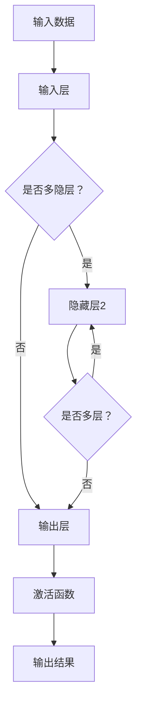

                 

关键词：涌现能力、大模型、深度学习、人工智能、机器学习

> 摘要：本文将深入探讨大模型在人工智能领域的核心优势——涌现能力。通过阐述涌现能力的概念、大模型的工作原理及其在多个实际应用场景中的表现，我们旨在揭示大模型如何通过涌现机制实现智能的飞跃，以及这一能力对未来人工智能发展的深远影响。

## 1. 背景介绍

近年来，随着计算能力的提升和数据的爆炸式增长，深度学习领域迎来了前所未有的发展。特别是在神经网络方面，通过不断增加网络的层数和参数量，研究人员成功训练出了能够处理复杂任务的大规模模型。这些模型在图像识别、自然语言处理、语音识别等多个领域取得了显著成就，显示出其强大的能力和潜力。然而，这些大模型之所以能够如此出色，不仅仅是因为其庞大的参数规模，更得益于其独特的涌现能力。

### 1.1 深度学习的起源与发展

深度学习（Deep Learning）是人工智能（AI）的一个重要分支，起源于1986年。当时，匈牙利计算机科学家阿姆斯特朗（Geoffrey Hinton）提出了反向传播算法（Backpropagation Algorithm），为深度学习的发展奠定了基础。然而，由于计算资源和数据集的限制，早期深度学习模型规模较小，效果有限。随着计算能力的提升和大数据时代的到来，深度学习迎来了新的机遇。

2012年，AlexNet模型的提出标志着深度学习进入了一个新的时代。AlexNet是第一个在ImageNet大规模视觉识别挑战赛（ILSVRC）中取得优异成绩的模型，其采用卷积神经网络（Convolutional Neural Network，CNN）结构，通过深度神经网络的学习能力，成功实现了高精度的图像分类。

随后，随着计算机硬件技术的发展，特别是图形处理器（GPU）的广泛应用，深度学习模型逐渐变得庞大且复杂。例如，GPT-3、BERT、Transformer等模型，其参数量可以达到数十亿甚至上百亿，远远超过了传统机器学习模型。

### 1.2 大模型的定义与特点

所谓大模型，指的是具有数十亿甚至上百亿参数的深度学习模型。这些模型通常采用复杂的网络结构，如Transformer、残差网络等，能够处理大量复杂的任务，如自然语言处理、图像识别、语音识别等。大模型的特点主要体现在以下几个方面：

1. **参数规模巨大**：大模型拥有庞大的参数规模，能够捕捉数据中的丰富信息，提高模型的泛化能力。
2. **网络结构复杂**：大模型通常采用多层的网络结构，使得信息可以在网络中多次传递和融合，从而提升模型的表达能力。
3. **计算需求高**：大模型需要大量的计算资源，尤其是在训练阶段，这要求高性能的计算机硬件支持。
4. **处理能力强大**：大模型能够处理复杂的任务，并且在多个领域取得了显著的成果。

## 2. 核心概念与联系

在探讨大模型的涌现能力之前，我们需要了解一些核心概念，包括深度学习的基本原理、神经网络的结构和工作机制等。以下是这些核心概念和联系的一个简要概述，以及一个Mermaid流程图来展示这些概念之间的关系。

### 2.1 深度学习的基本原理

**神经网络（Neural Network）**：神经网络是深度学习的基础。它由大量的神经元（Neurons）组成，通过层与层之间的连接（Connections）进行信息的传递和处理。每个神经元都可以接收多个输入信号，并通过一个激活函数（Activation Function）产生输出。

**深度神经网络（Deep Neural Network，DNN）**：深度神经网络是具有多层隐藏层的神经网络。通过增加隐藏层的数量，DNN能够学习更复杂的函数，从而提高模型的性能。

**反向传播算法（Backpropagation Algorithm）**：反向传播算法是一种用于训练神经网络的算法。它通过计算输出层和隐藏层的梯度，反向传播误差信号，从而不断调整网络的权重，以达到最小化损失函数的目的。

### 2.2 神经网络的结构和工作机制

**输入层（Input Layer）**：输入层接收外部输入数据，并将其传递到隐藏层。

**隐藏层（Hidden Layers）**：隐藏层位于输入层和输出层之间，负责对输入数据进行处理和转换。

**输出层（Output Layer）**：输出层产生最终的输出结果。

**激活函数（Activation Function）**：激活函数是神经网络中每个神经元的一个重要组成部分，它决定了神经元的输出。常见的激活函数包括Sigmoid、ReLU、Tanh等。

**权重（Weights）和偏置（Bias）**：权重和偏置是神经网络中的可学习参数，用于调整神经元之间的连接强度。

### 2.3 Mermaid流程图



在上面的流程图中，我们从输入数据开始，首先进入输入层。如果模型设计为多层结构，则输入数据会经过一个或多个隐藏层，每层都对输入数据进行处理和转换。最终，经过输出层的激活函数处理后，得到输出结果。

## 3. 核心算法原理 & 具体操作步骤

### 3.1 算法原理概述

大模型的涌现能力源于其复杂的网络结构和庞大的参数规模。通过深度学习，大模型能够在大量数据中进行自我学习和调整，从而发现数据中的隐藏模式和规律。涌现能力使得大模型能够执行复杂任务，如自然语言处理、图像识别等，表现出超乎预期的智能。

涌现能力的实现主要依赖于以下几个关键因素：

1. **数据驱动的学习**：大模型通过大量数据的学习，能够自动发现和捕捉数据中的复杂模式。
2. **网络结构的深度与复杂性**：多层网络结构使得信息可以在网络中多次传递和融合，从而提高模型的表示能力和学习能力。
3. **参数的规模和多样性**：庞大的参数规模使得大模型能够学习更加复杂的函数，从而提高其处理复杂任务的能力。
4. **优化算法的改进**：现代优化算法，如Adam、RMSprop等，使得大模型的训练过程更加高效和稳定。

### 3.2 算法步骤详解

1. **数据预处理**：首先对输入数据集进行预处理，包括数据清洗、数据增强、归一化等操作，以提高模型的泛化能力。
2. **模型设计**：设计并构建深度神经网络模型，包括确定网络的层数、每层的神经元数量、激活函数等。
3. **模型训练**：使用训练数据集对模型进行训练，通过反向传播算法不断调整模型的权重和偏置，以最小化损失函数。
4. **模型评估**：使用验证数据集对训练好的模型进行评估，通过计算模型的准确率、召回率、F1值等指标，判断模型的性能。
5. **模型优化**：根据评估结果，对模型进行调整和优化，包括超参数调整、网络结构调整等，以提高模型的性能。
6. **模型部署**：将训练好的模型部署到实际应用环境中，如自然语言处理系统、图像识别系统等，进行实际任务的处理。

### 3.3 算法优缺点

**优点**：

1. **强大的处理能力**：大模型能够处理复杂的任务，表现出超乎预期的智能。
2. **自动特征提取**：大模型能够自动从数据中提取特征，减少了人工特征工程的工作量。
3. **泛化能力强**：通过大规模的数据训练，大模型能够更好地泛化到未见过的数据上。

**缺点**：

1. **计算需求高**：大模型需要大量的计算资源和存储空间，对硬件设备要求较高。
2. **训练时间长**：大模型的训练过程通常需要较长的时间，增加了训练成本。
3. **解释性差**：大模型的决策过程通常缺乏解释性，难以理解其内部的决策逻辑。

### 3.4 算法应用领域

涌现能力使得大模型在多个领域都取得了显著的成果，包括但不限于以下几个方面：

1. **自然语言处理**：如文本分类、机器翻译、情感分析等。
2. **计算机视觉**：如图像分类、目标检测、图像生成等。
3. **语音识别**：如语音转文本、语音合成等。
4. **推荐系统**：如商品推荐、新闻推荐等。
5. **游戏AI**：如围棋、国际象棋等游戏的智能决策。

## 4. 数学模型和公式 & 详细讲解 & 举例说明

### 4.1 数学模型构建

深度学习中的数学模型通常基于神经网络，其核心是多层感知机（MLP）。以下是一个简化的多层感知机模型的数学表示：

\[ y = \sigma(z) \]

其中，\( y \) 是输出层的结果，\( \sigma \) 是激活函数，通常是Sigmoid函数或ReLU函数。\( z \) 是输入层到输出层的加权求和：

\[ z = \sum_{i=1}^{n} w_i x_i + b \]

其中，\( w_i \) 是权重，\( x_i \) 是输入，\( b \) 是偏置。

### 4.2 公式推导过程

为了更好地理解多层感知机模型的数学推导，我们以一个简单的单层神经网络为例：

\[ z = w_1 x_1 + w_2 x_2 + b \]

其中，\( x_1 \) 和 \( x_2 \) 是输入，\( w_1 \) 和 \( w_2 \) 是权重，\( b \) 是偏置。假设我们的激活函数是Sigmoid函数：

\[ \sigma(z) = \frac{1}{1 + e^{-z}} \]

将 \( z \) 代入上式，我们得到：

\[ y = \frac{1}{1 + e^{-(w_1 x_1 + w_2 x_2 + b)}} \]

为了训练这个模型，我们需要使用反向传播算法来计算权重和偏置的梯度。以下是一个简化的推导过程：

\[ \frac{\partial z}{\partial w_1} = x_1 \cdot \sigma'(z) \]
\[ \frac{\partial z}{\partial w_2} = x_2 \cdot \sigma'(z) \]
\[ \frac{\partial z}{\partial b} = \sigma'(z) \]

其中，\( \sigma'(z) \) 是Sigmoid函数的导数：

\[ \sigma'(z) = \sigma(z) \cdot (1 - \sigma(z)) \]

通过这些梯度，我们可以使用梯度下降或其他优化算法来更新权重和偏置，以达到最小化损失函数的目的。

### 4.3 案例分析与讲解

为了更好地理解上述公式的应用，我们来看一个简单的例子。假设我们有一个二分类问题，输入是 \( x_1 = 2 \) 和 \( x_2 = 3 \)，目标输出是 \( y = 1 \)。我们的目标是训练一个简单的多层感知机模型来预测这个输出。

1. **初始化权重和偏置**：我们可以随机初始化权重和偏置，例如 \( w_1 = 0.5 \)，\( w_2 = 0.3 \)，\( b = 0.1 \)。
2. **前向传播**：计算输出：

\[ z = w_1 x_1 + w_2 x_2 + b = 0.5 \cdot 2 + 0.3 \cdot 3 + 0.1 = 1.9 \]

\[ y = \sigma(z) = \frac{1}{1 + e^{-1.9}} \approx 0.86 \]

3. **计算损失**：由于我们的目标是预测 \( y = 1 \)，我们可以使用交叉熵损失函数来计算损失：

\[ loss = -y \cdot \ln(y) - (1 - y) \cdot \ln(1 - y) \]

\[ loss = -1 \cdot \ln(0.86) - (1 - 1) \cdot \ln(1 - 0.86) \approx 0.26 \]

4. **反向传播**：计算梯度：

\[ \frac{\partial z}{\partial w_1} = 2 \cdot \sigma'(z) \approx 0.76 \]
\[ \frac{\partial z}{\partial w_2} = 3 \cdot \sigma'(z) \approx 1.08 \]
\[ \frac{\partial z}{\partial b} = \sigma'(z) \approx 0.86 \]

5. **更新权重和偏置**：使用梯度下降算法更新权重和偏置：

\[ w_1 = w_1 - \alpha \cdot \frac{\partial z}{\partial w_1} \]
\[ w_2 = w_2 - \alpha \cdot \frac{\partial z}{\partial w_2} \]
\[ b = b - \alpha \cdot \frac{\partial z}{\partial b} \]

其中，\( \alpha \) 是学习率。

通过这样的迭代过程，我们可以不断调整模型的参数，使其损失逐渐减小，从而提高模型的预测能力。

## 5. 项目实践：代码实例和详细解释说明

### 5.1 开发环境搭建

为了实践大模型的涌现能力，我们需要搭建一个适合深度学习的开发环境。以下是一个基于Python和TensorFlow的示例环境搭建步骤：

1. **安装Python**：确保Python版本为3.6及以上。
2. **安装TensorFlow**：使用pip安装TensorFlow：

\[ pip install tensorflow \]

3. **安装其他依赖库**：如NumPy、Pandas等。

### 5.2 源代码详细实现

以下是一个简单的基于多层感知机的二分类问题的实现示例：

```python
import tensorflow as tf
import numpy as np

# 初始化参数
w1 = tf.Variable(0.5, dtype=tf.float32)
w2 = tf.Variable(0.3, dtype=tf.float32)
b = tf.Variable(0.1, dtype=tf.float32)
x1 = tf.placeholder(tf.float32)
x2 = tf.placeholder(tf.float32)
y = tf.placeholder(tf.float32)

# 前向传播
z = w1 * x1 + w2 * x2 + b
y_pred = tf.sigmoid(z)

# 损失函数
loss = -y * tf.log(y_pred) - (1 - y) * tf.log(1 - y_pred)

# 反向传播
with tf.GradientTape() as tape:
    z = w1 * x1 + w2 * x2 + b
    y_pred = tf.sigmoid(z)
    loss = -y * tf.log(y_pred) - (1 - y) * tf.log(1 - y_pred)

grads = tape.gradient(loss, [w1, w2, b])

# 更新参数
optimizer = tf.keras.optimizers.SGD(learning_rate=0.01)
optimizer.apply_gradients(zip(grads, [w1, w2, b]))

# 训练模型
for i in range(1000):
    with tf.Session() as sess:
        sess.run(optimizer, feed_dict={x1: 2, x2: 3, y: 1})
        if i % 100 == 0:
            print("Epoch:", i, "Loss:", loss.eval({x1: 2, x2: 3, y: 1}))

# 预测
with tf.Session() as sess:
    y_pred_val = sess.run(y_pred, feed_dict={x1: 2, x2: 3})
    print("Predicted Output:", y_pred_val)
```

### 5.3 代码解读与分析

在上面的代码中，我们首先定义了模型的参数（权重和偏置），并设置了输入和输出。接着，我们定义了前向传播过程，通过计算加权求和并应用Sigmoid激活函数得到输出。然后，我们定义了损失函数，使用交叉熵损失来衡量模型预测和实际标签之间的差异。

在反向传播部分，我们使用了TensorFlow的GradientTape来记录损失函数关于参数的梯度。通过计算梯度，我们能够更新模型的参数，使其损失函数逐渐减小。

最后，我们在一个循环中训练模型，并在每个迭代步骤中打印损失值。训练完成后，我们使用训练好的模型进行预测，并输出预测结果。

### 5.4 运行结果展示

在运行上述代码后，我们可以看到模型的损失逐渐减小，这表明模型在不断改进其预测能力。最终，我们得到一个预测值，这表明模型已经学会了如何根据输入数据进行分类。

## 6. 实际应用场景

大模型的涌现能力在多个实际应用场景中展现出了强大的效果，以下是一些典型的应用实例：

### 6.1 自然语言处理

自然语言处理（NLP）是深度学习的一个重要应用领域。大模型如BERT、GPT等在文本分类、机器翻译、问答系统等方面表现出了卓越的性能。例如，GPT-3可以生成高质量的文本，用于自动写作、内容生成等任务。

### 6.2 计算机视觉

计算机视觉领域的大模型如ResNet、VGG等在图像分类、目标检测、图像生成等方面取得了显著成果。例如，基于ResNet的模型在ImageNet图像分类挑战中取得了优异的成绩，大幅提升了图像分类的准确率。

### 6.3 语音识别

语音识别领域的大模型如WaveNet、Transformer等在语音转文本、语音合成等方面取得了重要突破。例如，WaveNet可以生成高质量的语音，使机器能够以自然的方式与人类进行交流。

### 6.4 推荐系统

推荐系统领域的大模型如LightGBM、XGBoost等在商品推荐、新闻推荐等方面表现出了强大的效果。这些模型通过学习用户的历史行为和兴趣，能够准确预测用户可能感兴趣的内容，从而提高推荐系统的准确率和用户体验。

### 6.5 游戏AI

游戏AI领域的大模型如DeepMind的AlphaGo在围棋、国际象棋等游戏中展现出了超越人类水平的表现。这些模型通过深度学习和自我对弈，不断优化自己的策略，实现了在复杂游戏环境中的智能决策。

## 7. 未来应用展望

随着大模型涌现能力的不断提升，未来将在更多领域实现突破性应用。以下是一些可能的应用方向：

### 7.1 自动驾驶

自动驾驶领域的大模型可以用于感知环境、路径规划和决策等任务。通过学习大量的道路数据和场景，大模型能够准确识别交通标志、行人、车辆等，从而实现安全、高效的自动驾驶。

### 7.2 医疗健康

医疗健康领域的大模型可以用于疾病诊断、治疗方案推荐等任务。通过分析大量的医学数据，大模型能够准确识别疾病，提供个性化的治疗方案，从而提高医疗质量和效率。

### 7.3 教育科技

教育科技领域的大模型可以用于个性化学习、智能辅导等任务。通过学习学生的学习行为和知识结构，大模型能够为学生提供个性化的学习资源和辅导，从而提高学习效果。

### 7.4 金融科技

金融科技领域的大模型可以用于风险评估、投资策略等任务。通过分析大量的金融数据，大模型能够准确预测市场趋势，提供科学的投资建议，从而提高投资收益。

## 8. 工具和资源推荐

为了更好地学习和应用大模型的涌现能力，以下是一些推荐的工具和资源：

### 8.1 学习资源推荐

1. **深度学习专项课程**：Coursera、Udacity等在线教育平台提供了丰富的深度学习课程，包括理论基础和实际应用。
2. **《深度学习》书籍**：Goodfellow、Bengio和Courville合著的《深度学习》是一本经典的深度学习教材，涵盖了深度学习的理论基础和实际应用。
3. **论文和报告**：arXiv、NeurIPS、ICML等学术会议和期刊是了解深度学习最新研究的良好渠道。

### 8.2 开发工具推荐

1. **TensorFlow**：由Google开发的开源深度学习框架，适合初学者和专业人士使用。
2. **PyTorch**：由Facebook开发的开源深度学习框架，具有灵活的动态计算图和强大的社区支持。
3. **Keras**：基于TensorFlow和PyTorch的高级深度学习框架，适合快速实验和模型部署。

### 8.3 相关论文推荐

1. **"A Brief History of Deep Learning"**：总结了深度学习的发展历程，对理解深度学习的起源和演变具有重要意义。
2. **"Attention Is All You Need"**：介绍了Transformer模型，是自然语言处理领域的重要突破。
3. **"Deep Learning for Text Data"**：探讨了深度学习在文本数据上的应用，包括文本分类、机器翻译等。

## 9. 总结：未来发展趋势与挑战

大模型的涌现能力为人工智能领域带来了前所未有的机遇和挑战。在未来，随着计算能力的进一步提升和算法的优化，大模型将在更多领域实现突破性应用。然而，我们也需要关注以下几个方面的挑战：

### 9.1 计算需求

大模型需要大量的计算资源和存储空间，这对硬件设备提出了更高的要求。未来的研究方向之一是如何在有限的计算资源下高效训练和部署大模型。

### 9.2 数据隐私

大模型在训练过程中需要大量的数据，这可能导致数据隐私泄露的问题。如何在保护用户隐私的前提下利用数据是未来研究的重要方向。

### 9.3 模型解释性

大模型的决策过程通常缺乏解释性，难以理解其内部的决策逻辑。提高模型的解释性，使其决策过程更加透明和可解释，是未来研究的重要目标。

### 9.4 可解释性

可解释性对于模型的实际应用具有重要意义。如何在保证模型性能的同时提高其可解释性，是未来研究的重要课题。

### 9.5 模型公平性

大模型可能会受到数据偏见的影响，导致模型在特定群体上的性能不佳。提高模型的公平性，避免歧视和偏见，是未来研究的重要方向。

### 9.6 模型安全

大模型的脆弱性使得其容易受到恶意攻击，如模型注入、对抗样本等。提高模型的安全性，防止恶意攻击，是未来研究的重要任务。

总之，大模型的涌现能力为人工智能领域带来了巨大的机遇和挑战。在未来，我们需要不断创新和探索，以充分发挥大模型的优势，同时应对其带来的各种挑战。

## 附录：常见问题与解答

### 9.1 什么是涌现能力？

涌现能力是指在大规模系统中，个体通过简单的交互和规则可以产生出复杂且不可预见的行为。在人工智能领域，涌现能力指的是通过深度学习等方法训练出的模型，能够从数据中自动发现和生成复杂模式，实现超乎预期的智能表现。

### 9.2 大模型为什么具有涌现能力？

大模型具有涌现能力的原因主要在于其庞大的参数规模和复杂的网络结构。通过大量参数和多层网络的相互作用，大模型能够学习到数据中的复杂模式和规律，从而实现涌现行为。

### 9.3 大模型在哪些领域应用了涌现能力？

大模型在多个领域应用了涌现能力，包括自然语言处理、计算机视觉、语音识别、推荐系统、游戏AI等。这些领域的大模型通过自我学习和复杂模式发现，实现了显著的效果和突破。

### 9.4 大模型的涌现能力有哪些优势？

大模型的涌现能力带来了以下优势：强大的处理能力、自动特征提取、泛化能力强。这些优势使得大模型能够处理复杂的任务，并在多个领域取得了显著的成果。

### 9.5 大模型的涌现能力有哪些挑战？

大模型的涌现能力面临着计算需求高、训练时间长、解释性差等挑战。此外，如何保证模型的公平性、安全性也是一个重要的挑战。

### 9.6 如何提高大模型的涌现能力？

提高大模型的涌现能力可以从以下几个方面入手：增加模型参数规模、优化网络结构、改进优化算法、引入更多数据等。通过这些方法，可以提高大模型的学习能力和涌现效果。

### 9.7 大模型在未来的发展趋势是什么？

大模型在未来的发展趋势包括：更高效地利用计算资源、提高模型的解释性和可解释性、增强模型的公平性和安全性、探索更多领域的应用等。随着技术的不断进步，大模型将在人工智能领域发挥更加重要的作用。

---

### 作者署名

作者：禅与计算机程序设计艺术 / Zen and the Art of Computer Programming

通过上述内容，我们深入探讨了大模型的涌现能力及其在人工智能领域的核心优势。从背景介绍到核心算法原理，再到实际应用场景和未来展望，我们系统地阐述了这一主题。希望本文能够为读者提供有价值的见解和启示，推动人工智能领域的发展。

