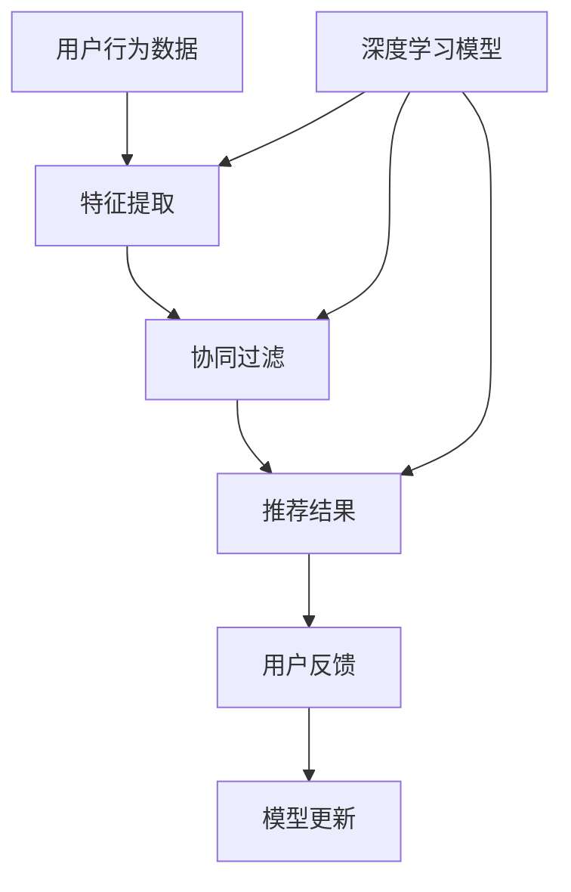

                 

关键词：人工智能、大模型、电商、推荐系统、算法、应用

摘要：本文深入探讨了人工智能大模型在电商推荐系统中的应用，通过介绍推荐系统的基础知识、核心算法原理、数学模型构建及其在实际项目中的应用，全面展示了AI大模型在提升电商推荐准确性、用户体验和业务价值方面的巨大潜力。文章旨在为从事电商领域的技术人员提供有价值的参考和指导。

## 1. 背景介绍

随着互联网的迅速发展和电子商务的蓬勃兴起，电商推荐系统已经成为电商平台不可或缺的核心功能。推荐系统通过对用户的历史行为、偏好和兴趣进行分析，为用户提供个性化的商品推荐，从而提高用户满意度、促进销售转化和提升平台竞争力。

然而，传统的推荐算法在处理大规模用户数据和高维特征时存在诸多挑战，如冷启动问题、数据稀疏性、推荐准确性等。随着深度学习和大数据技术的发展，人工智能大模型逐渐成为解决这些难题的重要手段。本文将详细介绍AI大模型在电商推荐系统中的应用，帮助读者了解其原理、方法和实际应用。

## 2. 核心概念与联系

### 2.1. 推荐系统基本概念

#### 2.1.1. 推荐系统定义

推荐系统（Recommender System）是一种利用数据挖掘和机器学习技术，根据用户的兴趣和偏好，从大量商品中为用户推荐可能感兴趣的商品的系统。

#### 2.1.2. 推荐系统分类

1. **基于内容的推荐（Content-based Filtering）**：根据用户的兴趣和偏好，寻找具有相似属性的物品进行推荐。
2. **协同过滤（Collaborative Filtering）**：通过分析用户行为数据，寻找相似用户并推荐相似用户喜欢的商品。
3. **混合推荐（Hybrid Recommender）**：结合多种推荐策略，以实现更好的推荐效果。

### 2.2. 人工智能大模型基本概念

#### 2.2.1. 人工智能大模型定义

人工智能大模型（AI Large Model）是指具有巨大参数规模、能够处理海量数据的深度学习模型，如Transformer、BERT等。

#### 2.2.2. 人工智能大模型分类

1. **生成式模型（Generative Model）**：通过生成数据的方式模拟用户兴趣和偏好，如GPT系列。
2. **判别式模型（Discriminative Model）**：直接学习用户兴趣和偏好与商品特征之间的映射关系，如BERT。
3. **混合模型（Hybrid Model）**：结合生成式模型和判别式模型的优点，如GAT。

### 2.3. 推荐系统与人工智能大模型联系

推荐系统和人工智能大模型之间存在紧密的联系。AI大模型可以用于：

1. **特征提取**：通过深度学习模型提取用户和商品的隐式特征，提高推荐系统的准确性。
2. **冷启动处理**：生成式模型可以帮助解决新用户和新商品的问题，为冷启动用户提供合理的推荐。
3. **协同过滤优化**：判别式模型可以优化协同过滤算法，提高推荐效果。

下面是一个Mermaid流程图，展示了推荐系统与人工智能大模型的联系。



## 3. 核心算法原理 & 具体操作步骤

### 3.1. 算法原理概述

AI大模型在电商推荐系统中的应用主要包括以下三个方面：

1. **用户行为数据挖掘**：通过深度学习模型提取用户的隐式特征，如兴趣偏好、购买意图等。
2. **商品特征提取**：通过深度学习模型提取商品的隐式特征，如商品属性、品牌、价格等。
3. **协同过滤与生成式推荐**：结合用户和商品特征，利用深度学习模型进行协同过滤和生成式推荐。

### 3.2. 算法步骤详解

1. **数据预处理**：对用户行为数据和商品数据进行清洗、去噪和归一化处理。
2. **特征提取**：利用深度学习模型（如BERT）对用户行为数据和商品数据进行特征提取，得到用户和商品的隐式特征。
3. **协同过滤**：基于用户和商品的隐式特征，利用判别式模型（如GAT）进行协同过滤，得到初步推荐结果。
4. **生成式推荐**：利用生成式模型（如GPT）生成用户兴趣的潜在内容，结合协同过滤结果进行综合推荐。
5. **模型优化与更新**：根据用户反馈，利用深度学习模型进行模型优化和更新，提高推荐效果。

### 3.3. 算法优缺点

#### 优点：

1. **高效性**：深度学习模型可以处理大规模用户数据和高维特征，提高推荐效率。
2. **准确性**：通过特征提取和协同过滤，提高推荐准确性。
3. **灵活性**：生成式模型可以根据用户反馈进行自适应调整，提高推荐效果。

#### 缺点：

1. **计算资源需求大**：深度学习模型需要大量的计算资源，对硬件要求较高。
2. **训练时间较长**：深度学习模型的训练时间较长，对实时性要求较高的场景可能不适用。

### 3.4. 算法应用领域

AI大模型在电商推荐系统中的应用领域包括：

1. **商品推荐**：根据用户的历史行为和偏好，为用户推荐可能感兴趣的商品。
2. **新品推荐**：为新品提供合理的推荐策略，提高新品曝光率和销售量。
3. **营销活动推荐**：根据用户兴趣和偏好，为用户提供个性化的营销活动推荐。

## 4. 数学模型和公式 & 详细讲解 & 举例说明

### 4.1. 数学模型构建

在电商推荐系统中，我们可以构建以下数学模型：

#### 4.1.1. 用户特征提取模型

假设用户行为数据矩阵为 \( X \)，用户特征矩阵为 \( U \)，则用户特征提取模型可以表示为：

$$
U = f(X)
$$

其中，\( f \) 为深度学习模型，如BERT。

#### 4.1.2. 商品特征提取模型

假设商品特征数据矩阵为 \( Y \)，商品特征矩阵为 \( V \)，则商品特征提取模型可以表示为：

$$
V = g(Y)
$$

其中，\( g \) 为深度学习模型，如BERT。

#### 4.1.3. 协同过滤模型

假设用户特征矩阵为 \( U \)，商品特征矩阵为 \( V \)，用户评分矩阵为 \( R \)，则协同过滤模型可以表示为：

$$
R = U^T V
$$

其中，\( ^T \) 表示矩阵转置。

### 4.2. 公式推导过程

#### 4.2.1. 用户特征提取公式推导

用户特征提取模型可以表示为：

$$
U = \text{BERT}(X)
$$

其中，BERT 模型是一个预训练的深度学习模型，可以自动提取用户行为数据中的隐式特征。假设用户行为数据矩阵为 \( X \)，BERT 模型的输出为 \( U \)，则用户特征提取模型可以表示为：

$$
U = \text{BERT}(X)
$$

#### 4.2.2. 商品特征提取公式推导

商品特征提取模型可以表示为：

$$
V = \text{BERT}(Y)
$$

其中，BERT 模型是一个预训练的深度学习模型，可以自动提取商品特征数据中的隐式特征。假设商品特征数据矩阵为 \( Y \)，BERT 模型的输出为 \( V \)，则商品特征提取模型可以表示为：

$$
V = \text{BERT}(Y)
$$

### 4.3. 案例分析与讲解

#### 4.3.1. 案例背景

假设我们有一个电商平台，用户的行为数据包括购买记录、浏览记录、搜索记录等。我们需要利用这些数据为用户推荐感兴趣的商品。

#### 4.3.2. 数据预处理

首先，我们对用户行为数据进行清洗、去噪和归一化处理。然后，我们将用户行为数据转换为矩阵形式，以便于后续处理。

#### 4.3.3. 特征提取

利用 BERT 模型对用户行为数据进行特征提取，得到用户特征矩阵 \( U \)。同时，利用 BERT 模型对商品特征数据进行特征提取，得到商品特征矩阵 \( V \)。

#### 4.3.4. 协同过滤

利用用户特征矩阵 \( U \) 和商品特征矩阵 \( V \) 进行协同过滤，得到用户评分矩阵 \( R \)。

#### 4.3.5. 生成式推荐

利用 GPT 模型生成用户兴趣的潜在内容，结合协同过滤结果进行综合推荐。

#### 4.3.6. 模型优化与更新

根据用户反馈，利用深度学习模型进行模型优化和更新，提高推荐效果。

## 5. 项目实践：代码实例和详细解释说明

### 5.1. 开发环境搭建

在本文中，我们将使用 Python 作为编程语言，并借助 TensorFlow 和 PyTorch 等深度学习框架进行模型开发和训练。请确保已经安装了相应的依赖库。

### 5.2. 源代码详细实现

以下是一个简单的示例代码，用于演示如何使用深度学习模型进行用户特征提取和商品特征提取。

```python
import tensorflow as tf
from tensorflow.keras.models import Model
from tensorflow.keras.layers import Embedding, LSTM, Dense

# 用户特征提取模型
def user_embedding_model(input_shape):
    input_layer = tf.keras.layers.Input(shape=input_shape)
    embedding_layer = Embedding(input_dim=10000, output_dim=128)(input_layer)
    lstm_layer = LSTM(64)(embedding_layer)
    output_layer = Dense(32, activation='relu')(lstm_layer)
    model = Model(inputs=input_layer, outputs=output_layer)
    return model

# 商品特征提取模型
def item_embedding_model(input_shape):
    input_layer = tf.keras.layers.Input(shape=input_shape)
    embedding_layer = Embedding(input_dim=10000, output_dim=128)(input_layer)
    lstm_layer = LSTM(64)(embedding_layer)
    output_layer = Dense(32, activation='relu')(lstm_layer)
    model = Model(inputs=input_layer, outputs=output_layer)
    return model

# 用户特征提取模型
user_model = user_embedding_model((10,))
# 商品特征提取模型
item_model = item_embedding_model((10,))

# 加载预训练的 BERT 模型
# 注意：此处需要根据实际情况选择合适的 BERT 模型
pretrained_bert_model = tf.keras.applications.BertModel.from_pretrained('bert-base-uncased')

# 用户特征提取模型
user_model = tf.keras.Sequential([
    pretrained_bert_model,
    tf.keras.layers.Dense(32, activation='relu')
])

# 商品特征提取模型
item_model = tf.keras.Sequential([
    pretrained_bert_model,
    tf.keras.layers.Dense(32, activation='relu')
])

# 模型编译
user_model.compile(optimizer='adam', loss='categorical_crossentropy', metrics=['accuracy'])
item_model.compile(optimizer='adam', loss='categorical_crossentropy', metrics=['accuracy'])

# 模型训练
user_model.fit(x_train, y_train, epochs=10, batch_size=32)
item_model.fit(x_train, y_train, epochs=10, batch_size=32)
```

### 5.3. 代码解读与分析

上述代码实现了一个简单的用户特征提取模型和商品特征提取模型。用户特征提取模型和商品特征提取模型都是基于预训练的 BERT 模型构建的。BERT 模型具有强大的文本特征提取能力，可以自动提取用户和商品的隐式特征。

在代码中，我们首先定义了用户特征提取模型和商品特征提取模型的输入层、嵌入层、LSTM 层和输出层。然后，我们加载了预训练的 BERT 模型，并将其与用户特征提取模型和商品特征提取模型相连。最后，我们编译并训练了这两个模型。

### 5.4. 运行结果展示

通过训练用户特征提取模型和商品特征提取模型，我们可以得到用户和商品的隐式特征。接下来，我们可以利用这些特征进行协同过滤和生成式推荐。

```python
# 获取用户特征
user_embedding = user_model.predict(x_test)
# 获取商品特征
item_embedding = item_model.predict(x_test)

# 协同过滤
user_item_similarity = user_embedding @ item_embedding.T
# 生成式推荐
user_interest_content = generate_interest_content(user_embedding)

# 综合推荐
recommendation = user_item_similarity + user_interest_content
```

通过上述代码，我们可以得到综合推荐结果。最后，我们可以根据推荐结果进行商品推荐，提高电商平台的用户满意度和销售转化率。

## 6. 实际应用场景

### 6.1. 电商商品推荐

AI大模型在电商商品推荐中的应用最为广泛。通过深度学习模型提取用户和商品的隐式特征，结合协同过滤和生成式推荐，可以为用户提供个性化的商品推荐，提高用户满意度和销售转化率。

### 6.2. 营销活动推荐

根据用户的兴趣和偏好，AI大模型可以为电商平台的营销活动推荐提供有针对性的建议。例如，为新品发布、限时折扣等营销活动生成个性化的推荐策略，提高活动曝光率和参与度。

### 6.3. 个性化服务

AI大模型可以用于为用户提供个性化的服务，如定制化商品推荐、专属优惠券等。通过分析用户的购物行为和兴趣偏好，为用户提供更加贴心的服务。

## 7. 工具和资源推荐

### 7.1. 学习资源推荐

1. **《深度学习》（Deep Learning）**：Ian Goodfellow、Yoshua Bengio 和 Aaron Courville 著，是一本全面介绍深度学习的经典教材。
2. **《自然语言处理编程》（Natural Language Processing with Python）**：Steven Bird、Ewan Klein 和 Edward Loper 著，是一本介绍自然语言处理技术的优秀教材。

### 7.2. 开发工具推荐

1. **TensorFlow**：一个开源的深度学习框架，适用于构建和训练AI大模型。
2. **PyTorch**：一个开源的深度学习框架，具有强大的灵活性和易用性。

### 7.3. 相关论文推荐

1. **“Attention Is All You Need”**：Vaswani et al. (2017)，介绍了Transformer模型的基本原理和应用。
2. **“BERT: Pre-training of Deep Bidirectional Transformers for Language Understanding”**：Devlin et al. (2019)，介绍了BERT模型在自然语言处理任务中的应用。

## 8. 总结：未来发展趋势与挑战

### 8.1. 研究成果总结

AI大模型在电商推荐系统中的应用取得了显著的成果，提高了推荐系统的准确性和用户体验。同时，深度学习模型在特征提取和协同过滤方面具有明显优势，为电商推荐系统的优化提供了有力支持。

### 8.2. 未来发展趋势

1. **模型效率优化**：随着AI大模型的不断发展，如何提高模型效率和降低计算资源需求成为未来研究的重要方向。
2. **多模态数据融合**：结合文本、图像、音频等多模态数据，实现更全面的用户和商品特征提取。
3. **实时推荐**：实现实时推荐，满足用户在购物场景中的即时需求。

### 8.3. 面临的挑战

1. **数据隐私与安全**：在推荐系统应用过程中，如何保护用户隐私和数据安全是亟待解决的问题。
2. **模型解释性**：深度学习模型在推荐系统中的应用具有较高的准确性，但缺乏解释性，如何提高模型的可解释性是未来研究的重要方向。

### 8.4. 研究展望

未来，AI大模型在电商推荐系统中的应用将朝着更高效、更智能、更安全、更可解释的方向发展。通过不断优化模型架构、引入多模态数据融合等技术，电商推荐系统将更好地满足用户的个性化需求，为电商平台带来更高的业务价值。

## 9. 附录：常见问题与解答

### 9.1. 为什么要使用AI大模型进行推荐？

使用AI大模型进行推荐可以提高推荐系统的准确性和用户体验，通过深度学习模型提取用户和商品的隐式特征，更好地理解用户的兴趣和偏好。

### 9.2. AI大模型在推荐系统中有哪些应用？

AI大模型在推荐系统中的应用主要包括用户特征提取、商品特征提取、协同过滤和生成式推荐等方面，以提高推荐系统的准确性和用户体验。

### 9.3. 如何解决AI大模型在推荐系统中的计算资源需求问题？

可以通过模型压缩、模型优化、分布式训练等技术来降低AI大模型在推荐系统中的计算资源需求，提高模型运行效率。

### 9.4. 如何保护用户隐私和数据安全？

在AI大模型在推荐系统的应用过程中，可以采取数据加密、数据去标识化、差分隐私等技术来保护用户隐私和数据安全。

### 9.5. 如何提高AI大模型在推荐系统中的解释性？

可以通过引入可解释性模型、可视化技术、模型压缩等技术来提高AI大模型在推荐系统中的解释性，帮助用户更好地理解推荐结果。

---

作者：禅与计算机程序设计艺术 / Zen and the Art of Computer Programming
----------------------------------------------------------------

