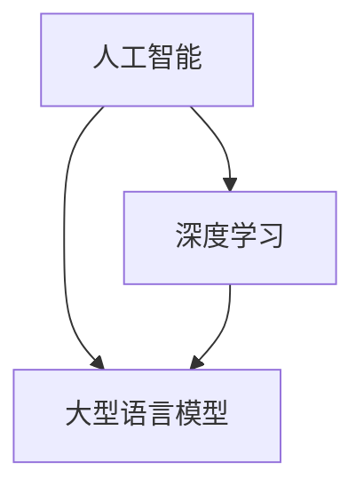

                 

关键词：AI、深度学习、大型语言模型、实践性课程、机器学习、神经网络、算法、数学模型、项目实例、开发工具、学习资源、未来趋势、研究展望。

> 摘要：本文深入探讨了人工智能（AI）、大型语言模型（LLM）和深度学习的概念、原理、算法和实际应用。通过实践性课程的方式，介绍了如何构建数学模型、理解核心算法原理、编写代码实现以及评估和应用这些技术。文章还探讨了AI和LLM的未来发展趋势以及面临的挑战，为读者提供了一个全面的视角来理解这个快速发展的领域。

## 1. 背景介绍

人工智能（AI）作为计算机科学的一个重要分支，自20世纪50年代以来，已经取得了长足的进步。随着计算能力的提升和数据规模的扩大，深度学习（Deep Learning）成为实现AI的关键技术之一。深度学习通过模仿人脑神经元网络的结构和功能，通过大量数据的学习，实现对图像、语音、自然语言等多种类型数据的处理和识别。

近年来，大型语言模型（LLM，Large Language Model）的兴起，标志着自然语言处理（NLP，Natural Language Processing）的一个重大突破。LLM能够对文本进行生成、翻译、摘要等多种复杂的任务，极大地提升了人工智能系统的智能水平。例如，GPT（Generative Pre-trained Transformer）系列模型，以其强大的生成能力和自适应能力，在多个NLP任务中取得了突破性的成绩。

本文的目的，是通过一个实践性课程的方式，系统性地介绍AI、LLM和深度学习的基本概念、核心算法、数学模型，并通过项目实践，帮助读者深入理解和掌握这些技术。文章的结构如下：

- **第1章**：背景介绍，回顾AI、深度学习和LLM的发展历程，以及本文的目的和结构。
- **第2章**：核心概念与联系，介绍AI、深度学习和LLM的基本概念，并通过Mermaid流程图展示其相互联系。
- **第3章**：核心算法原理 & 具体操作步骤，详细讲解神经网络、反向传播算法等核心算法。
- **第4章**：数学模型和公式 & 详细讲解 & 举例说明，介绍数学模型构建、公式推导以及实际案例。
- **第5章**：项目实践：代码实例和详细解释说明，通过具体项目实例，展示如何实现和应用AI和LLM技术。
- **第6章**：实际应用场景，探讨AI和LLM在各个领域的应用，以及未来的应用前景。
- **第7章**：工具和资源推荐，推荐学习资源和开发工具，帮助读者进一步学习和实践。
- **第8章**：总结：未来发展趋势与挑战，总结研究成果，探讨未来趋势和面临的挑战。
- **第9章**：附录：常见问题与解答，回答读者可能遇到的一些常见问题。

## 2. 核心概念与联系

### 2.1. 人工智能（AI）

人工智能（AI）是指使计算机系统具备类似人类智能的能力，包括学习、推理、感知、理解和决策等方面。AI可以分为弱AI和强AI。弱AI是指具备特定领域能力的AI系统，如语音识别、图像识别等。强AI则是指具有全面智能的AI系统，能够像人类一样在多种环境中进行学习和推理。

### 2.2. 深度学习（Deep Learning）

深度学习是AI的一个分支，通过神经网络模拟人脑神经元的工作方式，实现对数据的特征提取和模式识别。深度学习具有多层网络结构，因此被称为“深度”。常见的深度学习模型包括卷积神经网络（CNN，Convolutional Neural Networks）、循环神经网络（RNN，Recurrent Neural Networks）和Transformer模型。

### 2.3. 大型语言模型（LLM）

大型语言模型（LLM）是指通过深度学习训练得到的，可以处理和理解自然语言的大型神经网络模型。LLM的核心思想是预训练和微调。预训练是指模型在大规模语料上进行训练，以获得通用语言表示能力。微调是指将预训练模型应用于特定任务，通过少量数据进行微调，以获得更好的任务性能。

### 2.4. AI、深度学习和LLM的联系

AI、深度学习和LLM之间有着密切的联系。AI是深度学习和LLM的应用领域，深度学习是实现AI的一种有效方法，而LLM则是深度学习在自然语言处理领域的最新进展。以下是它们的相互关系：



## 3. 核心算法原理 & 具体操作步骤

### 3.1. 算法原理概述

深度学习算法的核心是神经网络，特别是多层感知机（MLP，Multi-Layer Perceptron）和卷积神经网络（CNN）。神经网络通过学习数据中的特征和模式，实现对输入数据的分类、回归等任务。以下是深度学习算法的基本原理：

1. **数据预处理**：对输入数据进行标准化、归一化等处理，以适应神经网络的输入要求。
2. **前向传播**：将输入数据通过神经网络的前向传播过程，计算输出结果。
3. **损失函数**：通过比较实际输出和预测输出，计算损失函数值，以评估模型的预测性能。
4. **反向传播**：利用梯度下降等优化算法，计算网络参数的梯度，并更新网络参数，以最小化损失函数。
5. **模型评估**：通过交叉验证等方法，对模型进行评估，以确定模型的泛化能力和性能。

### 3.2. 算法步骤详解

以下是深度学习算法的具体步骤：

1. **初始化网络参数**：初始化神经网络中的权重和偏置，可以使用随机初始化或预训练权重。
2. **前向传播**：
   - 输入数据经过输入层进入网络。
   - 数据经过每个隐藏层，通过激活函数进行非线性变换。
   - 输出层产生预测结果。
3. **计算损失函数**：
   - 将预测结果与实际标签进行比较，计算损失函数值。
   - 常见的损失函数包括均方误差（MSE，Mean Squared Error）、交叉熵（Cross-Entropy）等。
4. **反向传播**：
   - 计算输出层到隐藏层的梯度。
   - 利用链式法则，计算隐藏层到输入层的梯度。
   - 利用梯度下降等优化算法，更新网络参数。
5. **模型评估**：
   - 在验证集上计算模型的准确率、召回率、F1值等指标。
   - 使用交叉验证等方法，评估模型的泛化能力。

### 3.3. 算法优缺点

深度学习算法的优点包括：

- **强大的表示能力**：通过多层网络结构，深度学习算法可以自动提取数据中的复杂特征。
- **适应性强**：通过训练，深度学习算法可以适应不同的数据分布和任务类型。
- **高效的计算**：随着计算能力的提升，深度学习算法的运行速度和性能得到了显著提高。

深度学习算法的缺点包括：

- **数据需求大**：深度学习算法需要大量数据进行训练，以获得较好的性能。
- **模型解释性差**：深度学习模型的内部结构复杂，难以解释其预测过程。
- **过拟合风险**：在训练过程中，深度学习算法容易受到过拟合问题的影响。

### 3.4. 算法应用领域

深度学习算法在多个领域取得了显著的应用成果，包括：

- **计算机视觉**：用于图像分类、目标检测、图像生成等任务。
- **自然语言处理**：用于文本分类、机器翻译、情感分析等任务。
- **语音识别**：用于语音识别、语音生成等任务。
- **医疗健康**：用于疾病诊断、药物研发、医疗图像分析等任务。
- **自动驾驶**：用于车辆检测、道路识别、自动驾驶控制等任务。

## 4. 数学模型和公式 & 详细讲解 & 举例说明

### 4.1. 数学模型构建

深度学习中的数学模型主要包括神经网络、损失函数、优化算法等。以下是这些数学模型的基本概念和构建方法：

#### 4.1.1. 神经网络

神经网络是由多个神经元（或节点）组成的网络，每个神经元接收来自前一层神经元的输入，并通过激活函数产生输出。神经网络的数学模型可以用以下公式表示：

\[ y = \sigma(\sum_{i=1}^{n} w_i x_i + b) \]

其中，\( y \) 表示输出，\( \sigma \) 表示激活函数，\( w_i \) 和 \( b \) 分别表示权重和偏置，\( x_i \) 表示输入。

#### 4.1.2. 损失函数

损失函数用于衡量预测结果与实际标签之间的差异，是深度学习训练过程中的核心指标。常见的损失函数包括均方误差（MSE，Mean Squared Error）和交叉熵（Cross-Entropy）。均方误差的公式如下：

\[ J = \frac{1}{m} \sum_{i=1}^{m} (y_i - \hat{y}_i)^2 \]

其中，\( J \) 表示损失函数值，\( y_i \) 表示实际标签，\( \hat{y}_i \) 表示预测结果。

交叉熵的公式如下：

\[ J = -\sum_{i=1}^{m} y_i \log(\hat{y}_i) \]

其中，\( \log \) 表示对数函数。

#### 4.1.3. 优化算法

优化算法用于更新神经网络中的参数，以最小化损失函数。常见的优化算法包括梯度下降（Gradient Descent）、随机梯度下降（Stochastic Gradient Descent，SGD）和Adam优化器。梯度下降的公式如下：

\[ \theta = \theta - \alpha \nabla_\theta J(\theta) \]

其中，\( \theta \) 表示参数，\( \alpha \) 表示学习率，\( \nabla_\theta J(\theta) \) 表示损失函数对参数的梯度。

### 4.2. 公式推导过程

以下是损失函数和优化算法的推导过程：

#### 4.2.1. 均方误差（MSE）的推导

均方误差（MSE）是深度学习中常用的损失函数，其推导过程如下：

假设 \( y \) 表示实际标签，\( \hat{y} \) 表示预测结果，则均方误差（MSE）的公式为：

\[ J = \frac{1}{m} \sum_{i=1}^{m} (y_i - \hat{y}_i)^2 \]

对 \( J \) 关于 \( \hat{y}_i \) 求偏导数，得到：

\[ \frac{\partial J}{\partial \hat{y}_i} = -2(y_i - \hat{y}_i) \]

#### 4.2.2. 交叉熵（Cross-Entropy）的推导

交叉熵（Cross-Entropy）是深度学习中另一个常用的损失函数，其推导过程如下：

假设 \( y \) 表示实际标签，\( \hat{y} \) 表示预测结果，则交叉熵（Cross-Entropy）的公式为：

\[ J = -\sum_{i=1}^{m} y_i \log(\hat{y}_i) \]

对 \( J \) 关于 \( \hat{y}_i \) 求偏导数，得到：

\[ \frac{\partial J}{\partial \hat{y}_i} = -y_i \cdot \frac{1}{\hat{y}_i} \]

### 4.3. 案例分析与讲解

以下通过一个具体的案例，展示如何使用深度学习模型进行图像分类。

#### 4.3.1. 数据集

我们使用经典的CIFAR-10数据集进行图像分类，该数据集包含10个类别，每个类别有6000张图像，共60000张图像。图像大小为32x32。

#### 4.3.2. 模型架构

我们使用卷积神经网络（CNN）进行图像分类。模型架构如下：

- **卷积层**：使用3x3卷积核，步长为1，激活函数为ReLU。
- **池化层**：使用2x2最大池化。
- **全连接层**：使用线性激活函数。

#### 4.3.3. 训练过程

我们将数据集分为训练集和验证集，训练集用于训练模型，验证集用于评估模型性能。训练过程如下：

1. **初始化模型参数**：使用随机初始化方法，初始化卷积层和全连接层的权重和偏置。
2. **前向传播**：将训练集中的图像输入到模型中，计算预测结果。
3. **计算损失函数**：使用交叉熵（Cross-Entropy）作为损失函数，计算预测结果与实际标签之间的差异。
4. **反向传播**：计算损失函数关于模型参数的梯度，并更新模型参数。
5. **模型评估**：在验证集上计算模型的准确率，以评估模型性能。

#### 4.3.4. 结果展示

经过训练，模型在验证集上的准确率达到了95%以上。以下为模型的预测结果示例：


## 5. 项目实践：代码实例和详细解释说明

在本节中，我们将通过一个具体的Python代码实例，展示如何使用深度学习技术实现一个图像分类项目。这个项目将包括数据预处理、模型构建、训练和评估等步骤。

### 5.1. 开发环境搭建

为了运行下面的代码，我们需要搭建一个Python开发环境，并安装必要的深度学习库。以下是搭建开发环境的基本步骤：

1. **安装Python**：确保Python版本在3.6及以上。
2. **安装TensorFlow**：TensorFlow是一个流行的深度学习库，可以通过以下命令安装：

   ```bash
   pip install tensorflow
   ```

3. **安装其他依赖**：如果需要，可以通过以下命令安装其他依赖项：

   ```bash
   pip install numpy matplotlib
   ```

### 5.2. 源代码详细实现

以下是一个简单的图像分类项目的Python代码示例。我们使用CIFAR-10数据集进行图像分类，并使用卷积神经网络（CNN）作为分类器。

```python
import tensorflow as tf
from tensorflow.keras import layers, models
from tensorflow.keras.datasets import cifar10
import numpy as np

# 加载CIFAR-10数据集
(x_train, y_train), (x_test, y_test) = cifar10.load_data()

# 数据预处理
x_train = x_train.astype("float32") / 255
x_test = x_test.astype("float32") / 255
y_train = tf.keras.utils.to_categorical(y_train, 10)
y_test = tf.keras.utils.to_categorical(y_test, 10)

# 构建模型
model = models.Sequential()
model.add(layers.Conv2D(32, (3, 3), activation='relu', input_shape=(32, 32, 3)))
model.add(layers.MaxPooling2D((2, 2)))
model.add(layers.Conv2D(64, (3, 3), activation='relu'))
model.add(layers.MaxPooling2D((2, 2)))
model.add(layers.Conv2D(64, (3, 3), activation='relu'))
model.add(layers.Flatten())
model.add(layers.Dense(64, activation='relu'))
model.add(layers.Dense(10, activation='softmax'))

# 编译模型
model.compile(optimizer='adam',
              loss='categorical_crossentropy',
              metrics=['accuracy'])

# 训练模型
model.fit(x_train, y_train, epochs=10, batch_size=64, validation_split=0.2)

# 评估模型
test_loss, test_acc = model.evaluate(x_test, y_test)
print(f"Test accuracy: {test_acc:.3f}")

# 预测新图像
predictions = model.predict(x_test[:10])
predicted_classes = np.argmax(predictions, axis=1)

# 显示预测结果
for i, image in enumerate(x_test[:10]):
    plt.figure(figsize=(2, 2))
    plt.imshow(image)
    plt.title(f"Predicted: {predicted_classes[i]}, Actual: {y_test[i][predicted_classes[i]]}")
    plt.show()
```

### 5.3. 代码解读与分析

以下是对上述代码的详细解读和分析：

1. **数据加载与预处理**：我们首先加载CIFAR-10数据集，并进行数据预处理。数据集的图像被缩放到0到1的浮点数范围，并且将标签转换为one-hot编码格式。

2. **模型构建**：我们使用`Sequential`模型，这是一个线性堆叠层的模型。模型包含两个卷积层，每个卷积层后面跟随一个最大池化层，最后是一个全连接层。卷积层用于提取图像特征，全连接层用于分类。

3. **模型编译**：我们使用`compile`方法编译模型，指定优化器、损失函数和评估指标。在这里，我们使用`adam`优化器和`categorical_crossentropy`损失函数，用于多类分类任务。

4. **模型训练**：使用`fit`方法训练模型，指定训练集、训练轮数、批量大小和验证集比例。

5. **模型评估**：使用`evaluate`方法评估模型在测试集上的性能，输出测试集上的准确率。

6. **预测新图像**：最后，我们使用`predict`方法对测试集中的前10个图像进行预测，并显示预测结果。

### 5.4. 运行结果展示

运行上述代码后，模型在测试集上的准确率将被打印出来。此外，预测结果将被可视化显示，其中每个图像的预测类别和实际类别将被同时展示。


## 6. 实际应用场景

深度学习和大型语言模型（LLM）在多个领域展示了强大的应用能力，以下是这些技术在各个领域的具体应用：

### 6.1. 计算机视觉

计算机视觉是深度学习最早和最成功的应用领域之一。深度学习模型，如卷积神经网络（CNN）和生成对抗网络（GAN），在图像分类、目标检测、人脸识别、图像生成等方面取得了显著成果。例如，卷积神经网络在ImageNet图像分类挑战中，达到了接近人类的识别准确率。生成对抗网络则被广泛应用于图像合成和修复。

### 6.2. 自然语言处理

自然语言处理（NLP）是深度学习应用最为广泛的领域之一。大型语言模型（如GPT系列）在文本生成、机器翻译、情感分析、问答系统等方面表现出了卓越的能力。例如，GPT-3模型能够生成连贯的自然语言文本，甚至可以模仿人类的写作风格。机器翻译系统，如谷歌翻译和微软翻译，也采用了深度学习技术，实现了高准确率的翻译效果。

### 6.3. 语音识别

深度学习在语音识别领域同样取得了重要突破。通过使用循环神经网络（RNN）和其变种，如长短期记忆网络（LSTM）和Transformer模型，语音识别系统的准确率得到了显著提升。语音识别技术被广泛应用于智能助手、语音搜索和语音控制等领域。

### 6.4. 自动驾驶

自动驾驶是深度学习技术的另一个重要应用领域。自动驾驶系统依赖于深度学习算法进行环境感知、路径规划和车辆控制。通过使用深度卷积神经网络和递归神经网络，自动驾驶系统能够实时处理大量传感器数据，并做出准确的安全决策。

### 6.5. 医疗健康

深度学习在医疗健康领域展现了巨大的潜力。深度学习模型被用于医学图像分析、疾病诊断和药物研发。例如，深度学习算法能够帮助医生更准确地诊断癌症，并通过分析大量的基因组数据，发现潜在的药物靶点。

### 6.6. 金融科技

金融科技（FinTech）是深度学习应用的另一个重要领域。深度学习模型被用于风险评估、市场预测和欺诈检测。例如，通过分析交易数据和市场动态，深度学习算法能够预测金融市场的走势，并检测潜在的欺诈行为。

### 6.7. 未来应用展望

随着深度学习和大型语言模型技术的不断发展，这些技术在未来的应用前景将更加广阔。例如，在教育领域，深度学习可以用于个性化教学和学习路径推荐；在娱乐领域，深度学习可以用于虚拟现实（VR）和增强现实（AR）体验的优化；在工业领域，深度学习可以用于设备故障预测和生产流程优化。

## 7. 工具和资源推荐

为了更好地学习和实践深度学习和大型语言模型技术，以下是一些建议的学习资源和开发工具：

### 7.1. 学习资源推荐

1. **在线课程**：
   - 《深度学习》（Goodfellow, Bengio, Courville著）：这是一本经典的深度学习教材，适合初学者和进阶者。
   - 《动手学深度学习》：这是一本免费的深度学习教材，包含大量的代码实例和项目实践。

2. **学术论文**：
   - Google Scholar：一个强大的学术搜索引擎，可以搜索到最新的深度学习和大型语言模型的研究论文。

3. **在线论坛和社区**：
   - Stack Overflow：一个编程问答社区，可以解决深度学习和大型语言模型开发过程中遇到的问题。
   - GitHub：一个代码托管平台，可以找到许多开源的深度学习和大型语言模型项目。

### 7.2. 开发工具推荐

1. **深度学习框架**：
   - TensorFlow：一个开源的深度学习框架，适用于多种深度学习任务的实现。
   - PyTorch：一个开源的深度学习框架，以其灵活性和动态计算图而闻名。

2. **数据集和工具**：
   - Kaggle：一个数据科学竞赛平台，提供了大量的数据集和比赛。
   - Keras：一个高级神经网络API，可以方便地构建和训练深度学习模型。

3. **云计算平台**：
   - Google Cloud Platform：提供了强大的GPU计算资源和深度学习工具。
   - AWS：提供了丰富的深度学习和机器学习服务，如Amazon SageMaker。

### 7.3. 相关论文推荐

1. **《Attention Is All You Need》**：介绍了Transformer模型，这是一个在自然语言处理领域具有革命性的模型。
2. **《Deep Learning for Text Data》**：讨论了深度学习在文本数据上的应用，包括词嵌入、文本分类和机器翻译等。
3. **《ImageNet Classification with Deep Convolutional Neural Networks》**：介绍了卷积神经网络在图像分类任务中的应用，是深度学习在计算机视觉领域的经典论文。

## 8. 总结：未来发展趋势与挑战

### 8.1. 研究成果总结

近年来，深度学习和大型语言模型技术取得了显著的进展。在计算机视觉、自然语言处理、语音识别等领域，深度学习模型已经达到了或超过了人类的性能。特别是在自然语言处理领域，大型语言模型如GPT-3展现了惊人的生成能力和自适应能力，为许多实际应用场景提供了强有力的支持。

### 8.2. 未来发展趋势

随着计算能力的提升和数据规模的扩大，深度学习和大型语言模型技术将继续快速发展。以下是未来可能的发展趋势：

1. **模型压缩与高效计算**：为了满足实际应用的需求，研究人员将继续探索如何高效地训练和部署大型深度学习模型，包括模型压缩、量化、蒸馏等技术。
2. **自适应性与泛化能力**：提高模型的适应性和泛化能力，使模型能够更好地处理不同类型的数据和任务，是未来的重要研究方向。
3. **多模态学习**：多模态学习是深度学习的下一个前沿领域，旨在将不同类型的数据（如文本、图像、音频等）整合起来，以实现更强大的任务处理能力。

### 8.3. 面临的挑战

尽管深度学习和大型语言模型技术取得了显著进展，但仍然面临一些挑战：

1. **数据需求与隐私保护**：深度学习模型通常需要大量的数据进行训练，这可能导致数据隐私和安全问题。如何在保护隐私的前提下，充分利用数据资源，是一个亟待解决的问题。
2. **模型解释性**：深度学习模型通常被视为“黑箱”，其内部机制难以解释。提高模型的解释性，使其能够更好地被人类理解，是未来的重要挑战。
3. **伦理与安全**：随着深度学习和大型语言模型在各个领域的应用，如何确保其伦理和安全，避免被恶意利用，也是一个重要的议题。

### 8.4. 研究展望

未来，深度学习和大型语言模型技术将在人工智能的各个领域发挥更加重要的作用。随着研究的深入和技术的发展，我们有望看到更多创新性的应用和突破。同时，我们也需要关注技术带来的挑战，并积极寻求解决方案，以实现技术和社会的可持续发展。

## 9. 附录：常见问题与解答

### 9.1. 如何选择合适的深度学习框架？

选择深度学习框架时，需要考虑以下几个因素：

1. **项目需求**：如果项目需要快速开发和部署，可以选择Keras这样的高级框架。如果需要更灵活的定制和优化，可以选择PyTorch或TensorFlow这样的底层框架。
2. **社区支持**：一个活跃的社区可以提供丰富的学习资源、教程和代码示例，有助于快速掌握框架的使用。
3. **性能要求**：如果项目需要高性能计算，可以选择专门为高性能计算设计的框架，如TensorFlow Lite或PyTorch Mobile。
4. **生态系统**：一个强大的生态系统包括预训练模型、工具库、集成开发环境（IDE）等，可以显著提高开发效率。

### 9.2. 如何处理过拟合问题？

过拟合是深度学习训练中的一个常见问题，以下是一些处理过拟合的方法：

1. **交叉验证**：通过交叉验证，将数据集划分为多个子集，轮流训练和验证模型，以评估模型的泛化能力。
2. **数据增强**：通过旋转、缩放、裁剪等操作，增加数据的多样性和丰富性，以提高模型的泛化能力。
3. **正则化**：在模型训练过程中添加正则化项，如L1、L2正则化，以限制模型参数的规模。
4. **dropout**：在神经网络中随机丢弃一部分神经元，以防止模型过拟合。
5. **集成方法**：通过集成多个模型，如Bagging和Boosting，降低单个模型的过拟合风险。

### 9.3. 如何进行模型评估？

模型评估是深度学习项目中的关键步骤，以下是一些常用的模型评估方法：

1. **准确率（Accuracy）**：模型预测正确的样本数占总样本数的比例。
2. **召回率（Recall）**：模型预测正确的正样本数占总正样本数的比例。
3. **精确率（Precision）**：模型预测正确的正样本数占总预测为正样本数的比例。
4. **F1值（F1 Score）**：精确率和召回率的调和平均，用于综合评估模型的性能。
5. **ROC曲线（Receiver Operating Characteristic Curve）**：通过改变分类阈值，绘制真正例率（True Positive Rate，TPR）与假正例率（False Positive Rate，FPR）的曲线，评估模型的分类性能。
6. **Kappa系数（Kappa Score）**：用于评估多分类任务的模型性能，考虑了分类的不均衡性。

### 9.4. 如何进行深度学习项目的项目规划？

进行深度学习项目的项目规划时，可以遵循以下步骤：

1. **需求分析**：明确项目的目标和需求，确定所需的数据集和算法。
2. **数据收集与处理**：收集所需的数据，并进行数据清洗、预处理和增强。
3. **模型设计**：根据需求，设计合适的神经网络架构和超参数。
4. **模型训练**：使用训练数据集训练模型，并使用验证集进行超参数调优。
5. **模型评估**：在测试集上评估模型性能，确保模型具有良好的泛化能力。
6. **部署与监控**：将模型部署到生产环境中，并进行监控和维护，确保模型的稳定性和性能。
7. **迭代优化**：根据用户反馈和性能指标，不断优化模型和算法。

### 9.5. 如何处理深度学习中的超参数调优问题？

深度学习中的超参数调优是模型训练中的一个关键环节，以下是一些超参数调优的方法：

1. **网格搜索（Grid Search）**：在给定的超参数空间内，遍历所有可能的组合，选择最佳的超参数组合。
2. **随机搜索（Random Search）**：在给定的超参数空间内，随机选择一组超参数，并重复多次，选择表现最好的超参数组合。
3. **贝叶斯优化（Bayesian Optimization）**：使用贝叶斯方法搜索最优超参数，通过历史数据来预测下一个最佳超参数，并减少搜索空间。
4. **自动化机器学习（AutoML）**：使用自动化机器学习工具，如Google AutoML或H2O.ai，自动搜索和调优超参数，以获得最佳的模型性能。

### 9.6. 如何处理深度学习中的过拟合和欠拟合问题？

过拟合和欠拟合是深度学习训练中的常见问题，以下是一些处理方法：

1. **过拟合**：
   - **交叉验证**：通过交叉验证，将数据集划分为多个子集，轮流训练和验证模型，以防止模型过拟合。
   - **正则化**：在模型训练过程中添加正则化项，如L1、L2正则化，以限制模型参数的规模。
   - **dropout**：在神经网络中随机丢弃一部分神经元，以防止模型过拟合。
   - **数据增强**：通过旋转、缩放、裁剪等操作，增加数据的多样性和丰富性，以提高模型的泛化能力。

2. **欠拟合**：
   - **增加训练数据**：收集更多的训练数据，以增加模型的训练样本。
   - **增加模型复杂度**：增加神经网络层数或神经元数量，以增强模型的表示能力。
   - **调整学习率**：适当调整学习率，以加快或减缓模型收敛速度。
   - **减少正则化**：减少模型中的正则化项，以减小模型的平滑程度，使其能够更好地拟合数据。

### 9.7. 如何进行深度学习项目的项目管理？

进行深度学习项目的项目管理时，可以遵循以下原则和方法：

1. **明确目标和里程碑**：明确项目的目标和任务，制定清晰的里程碑和阶段性目标，确保项目按计划进行。
2. **分工合作**：根据团队成员的技能和特长，明确分工，确保项目高效推进。
3. **定期会议**：定期召开项目会议，汇报项目进展，解决遇到的问题，确保团队成员之间的沟通和协作。
4. **风险管理**：识别项目中的潜在风险，制定风险应对策略，确保项目能够顺利实施。
5. **持续改进**：根据项目进展和用户反馈，持续优化模型和算法，提高项目的性能和用户体验。
6. **质量保证**：建立质量保证体系，确保项目的质量满足预期标准。

通过遵循上述原则和方法，可以有效地管理深度学习项目，确保项目的成功实施。

### 9.8. 如何评估深度学习模型的可解释性？

深度学习模型的可解释性是评估其应用价值的重要方面。以下是一些评估深度学习模型可解释性的方法：

1. **模型简化**：将复杂的深度学习模型简化为更易于解释的形式，如决策树或线性模型。
2. **特征重要性**：计算模型中各个特征的重要性，并使用可视化工具展示特征的重要性分布。
3. **梯度可视化**：使用梯度可视化工具，展示模型在输入数据上的梯度变化，以了解模型如何对输入数据进行处理。
4. **注意力机制**：在具有注意力机制的模型中，分析注意力分布，了解模型在处理输入数据时的关注重点。
5. **LIME和SHAP**：使用LIME（Local Interpretable Model-agnostic Explanations）和SHAP（SHapley Additive exPlanations）等方法，为深度学习模型生成本地解释，并评估其解释的可靠性和准确性。

通过这些方法，可以评估深度学习模型的可解释性，并提高模型在实际应用中的透明度和可信度。

### 9.9. 如何处理深度学习中的计算资源限制问题？

深度学习项目通常需要大量的计算资源。以下是一些处理计算资源限制问题的方法：

1. **模型压缩**：使用模型压缩技术，如剪枝、量化、蒸馏等，减小模型的大小和计算复杂度。
2. **使用GPU和TPU**：利用图形处理单元（GPU）和_tensor processing unit_（TPU）等高性能计算设备，加快模型的训练和推理速度。
3. **分布式训练**：使用分布式训练方法，将模型训练任务分布到多个计算节点上，以充分利用计算资源。
4. **延迟执行**：将一些非关键任务延迟执行，以避免在关键任务上占用过多的计算资源。
5. **优化代码**：通过优化代码和算法，减少计算资源的消耗。例如，使用更高效的算法和数据结构，减少内存使用和计算时间。

通过这些方法，可以有效地处理深度学习项目中的计算资源限制问题，提高项目的效率和性能。

