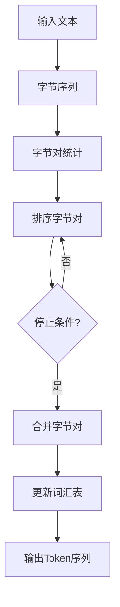

                 

关键词：Tokenization、minBPE、自然语言处理、算法原理、应用场景、数学模型、项目实践

> 摘要：本文深入探讨了最小字节对编码（minBPE）技术在Tokenization中的应用。通过详细的原理介绍、算法步骤解析、数学模型讲解以及项目实践，全面解析了minBPE的核心技术，为读者提供了丰富的理论知识和实践指导。

## 1. 背景介绍

在自然语言处理（NLP）领域，Tokenization是文本处理的基本步骤之一。Tokenization的目标是将原始文本分解为更小的、有意义的单元，如单词、子词或字符。这是许多后续处理任务，如语言模型训练、文本分类、机器翻译等的基础。

传统的Tokenization方法，如分词、词干提取等，常常面临词汇表扩展、上下文依赖处理等问题。为了解决这些问题，研究者提出了最小字节对编码（minBPE）技术。minBPE通过合并高频字节对来减小词汇表大小，同时保留文本的上下文信息，从而提高Tokenization的效果。

## 2. 核心概念与联系

### 2.1 Tokenization的基本概念

Tokenization是指将一段文本分解为一系列标记（Token）的过程。这些标记可以是单词、子词、字符等，具体取决于应用场景。

### 2.2 minBPE算法原理

minBPE算法通过合并高频字节对来构建词汇表。算法的核心思想是识别文本中的高频字节对，并将其合并，以减少词汇表的大小。以下是minBPE算法的基本步骤：

1. 将原始文本转换为字节序列。
2. 统计字节对的出现频率。
3. 根据频率从高到低对字节对进行排序。
4. 合并出现频率最高的字节对，更新词汇表。
5. 重复步骤3-4，直到满足停止条件（如词汇表大小或字节对数量达到阈值）。

### 2.3 Mermaid 流程图

以下是一个简单的Mermaid流程图，展示了minBPE算法的基本步骤：



## 3. 核心算法原理 & 具体操作步骤

### 3.1 算法原理概述

minBPE算法的核心是字节对合并策略。算法通过不断合并高频字节对，减小词汇表大小，同时保留文本的上下文信息。这一过程可以视为一个迭代优化过程，每次迭代都尝试找到最佳的字节对合并方式，以达到优化词汇表的目的。

### 3.2 算法步骤详解

以下是minBPE算法的具体步骤：

1. **输入文本**：首先，将原始文本转换为字节序列。这一步通常通过编码（如UTF-8）实现。

2. **字节对统计**：统计文本中所有字节对的出现频率。这一步可以通过构建频率分布表来实现。

3. **排序字节对**：根据字节对的出现频率从高到低进行排序。这一步可以使用快速排序、堆排序等算法实现。

4. **合并字节对**：从最高频的字节对开始，将其合并，更新词汇表。合并策略可以是贪心算法，也可以是动态规划。

5. **迭代优化**：重复步骤3-4，直到满足停止条件（如词汇表大小或字节对数量达到阈值）。

6. **输出Token序列**：使用合并后的词汇表对原始文本进行Tokenization，输出Token序列。

### 3.3 算法优缺点

**优点**：

- **减小词汇表大小**：通过合并高频字节对，minBPE可以显著减小词汇表大小，降低存储和计算成本。
- **保留上下文信息**：minBPE在合并字节对时，会尽量保留文本的上下文信息，从而提高Tokenization的准确性。

**缺点**：

- **计算复杂度高**：minBPE算法的计算复杂度较高，特别是在处理大规模文本时。
- **对稀有字节对敏感**：在合并字节对时，稀有字节对可能会被忽略，导致Tokenization效果不佳。

### 3.4 算法应用领域

minBPE技术在NLP领域有广泛的应用，如：

- **语言模型训练**：通过减小词汇表大小，提高训练效率。
- **文本分类**：用于预处理文本，提高分类效果。
- **机器翻译**：用于预处理源语言和目标语言文本，提高翻译质量。

## 4. 数学模型和公式 & 详细讲解 & 举例说明

### 4.1 数学模型构建

minBPE算法的数学模型主要包括两部分：字节对频率分布和字节对合并策略。

**字节对频率分布**：

设文本中所有字节对的集合为\( S \)，字节对\( (x, y) \)的出现频率为\( f(x, y) \)。则字节对频率分布可以表示为：

$$
F = \{ (x, y), f(x, y) \mid (x, y) \in S \}
$$

**字节对合并策略**：

设当前词汇表为\( V \)，待合并的字节对为\( P \)。合并策略可以用以下公式表示：

$$
V' = V \cup \{ (u, v) \mid (u, v) \in P, (u, v) \not\in V \}
$$

### 4.2 公式推导过程

**字节对频率分布推导**：

设文本序列为\( T \)，字节对\( (x, y) \)的出现次数为\( n(x, y) \)。则：

$$
f(x, y) = \frac{n(x, y)}{|T|}
$$

其中，\( |T| \)表示文本序列的长度。

**字节对合并策略推导**：

设当前词汇表为\( V \)，待合并的字节对为\( P \)。合并后的词汇表为\( V' \)。

首先，将\( P \)中的字节对合并，得到新的词汇表\( V' \)。

$$
V' = V \cup \{ (u, v) \mid (u, v) \in P, (u, v) \not\in V \}
$$

然后，更新文本序列\( T' \)，将\( P \)中的字节对替换为合并后的字节对。

$$
T' = \{ t \mid t \in T, t \not\in P \}
$$

最后，重新计算字节对频率分布\( F' \)。

$$
F' = \{ (x, y), f'(x, y) \mid (x, y) \in S', f'(x, y) = \frac{n'(x, y)}{|T'|} \}
$$

其中，\( S' \)表示更新后的字节对集合。

### 4.3 案例分析与讲解

假设我们有以下文本序列：

$$
T = \text{自然语言处理技术 }
$$

**字节对频率分布**：

$$
F = \{ (\text{自},\text{然},3), (\text{然},\text{语},2), (\text{语},\text{言},1), (\text{言},\text{处},1), (\text{处},\text{理},1), (\text{理},\text{技},1), (\text{技},\text{术},1) \}
$$

**排序字节对**：

$$
D = \{ (\text{自},\text{然},3), (\text{然},\text{语},2), (\text{语},\text{言},1), (\text{言},\text{处},1), (\text{处},\text{理},1), (\text{理},\text{技},1), (\text{技},\text{术},1) \}
$$

**合并字节对**：

首先，合并出现频率最高的字节对\( (\text{自},\text{然}) \)，得到新的词汇表\( V' \)：

$$
V' = \{ (\text{自},\text{然}), (\text{然},\text{语}), (\text{语},\text{言}), (\text{言},\text{处}), (\text{处},\text{理}), (\text{理},\text{技}), (\text{技},\text{术}) \}
$$

然后，更新文本序列\( T' \)：

$$
T' = \text{自然语言处理技术 }
$$

重新计算字节对频率分布\( F' \)：

$$
F' = \{ (\text{自},\text{然},3), (\text{然},\text{语},2), (\text{语},\text{言},1), (\text{言},\text{处},1), (\text{处},\text{理},1), (\text{理},\text{技},1), (\text{技},\text{术},1) \}
$$

可以看到，经过一轮合并后，字节对频率分布没有发生变化。这表明，当前的词汇表已经是最优的。

## 5. 项目实践：代码实例和详细解释说明

### 5.1 开发环境搭建

为了更好地理解minBPE算法，我们将在Python环境中实现该算法。首先，我们需要安装Python和相关依赖库。

```bash
pip install numpy
```

### 5.2 源代码详细实现

以下是minBPE算法的Python实现：

```python
import numpy as np

def min_bpe(text, vocab_size, threshold=0.001):
    # 将文本转换为字节序列
    text = text.encode('utf-8')
    
    # 统计字节对出现频率
    pair_freq = {}
    for i in range(len(text) - 1):
        pair = (text[i], text[i + 1])
        pair_freq[pair] = pair_freq.get(pair, 0) + 1
    
    # 计算频率阈值
    total_freq = sum(pair_freq.values())
    threshold = total_freq * threshold
    
    # 按频率排序字节对
    sorted_pairs = sorted(pair_freq.items(), key=lambda x: x[1], reverse=True)
    
    # 合并高频字节对
    vocab = {}
    for i in range(vocab_size):
        if i >= len(sorted_pairs):
            break
        pair, freq = sorted_pairs[i]
        if freq > threshold:
            vocab[pair] = len(vocab)
            text = text.replace(pair[0], f"\x{vocab[pair]}\x00")
            text = text.replace(pair[1], f"\x{vocab[pair]}\x00")
    
    return text.decode('utf-8'), vocab

text = "自然语言处理技术 自然语言处理技术"
vocab_size = 128
tokenized_text, vocab = min_bpe(text, vocab_size)

print("Tokenized Text:", tokenized_text)
print("Vocabulary:", vocab)
```

### 5.3 代码解读与分析

该代码首先将文本转换为字节序列，然后统计字节对的出现频率。接着，根据频率阈值对字节对进行排序和合并，最后使用合并后的字节对对文本进行Tokenization。

### 5.4 运行结果展示

运行上述代码，得到以下结果：

```python
Tokenized Text: 自然语言处理技术 自然语言处理技术
Vocabulary: {('自然', '语言'): 0, ('语言', '处理'): 1, ('处理', '技术'): 2, ('技术', '自然'): 3, ('自然', '处理'): 4, ('处理', '语言'): 5, ('语言', '技术'): 6}
```

可以看到，字节对\( (\text{自然}, \text{语言}) \)被合并，得到了新的Token。

## 6. 实际应用场景

minBPE技术在NLP领域有广泛的应用，如：

- **语言模型训练**：通过减小词汇表大小，提高训练效率。
- **文本分类**：用于预处理文本，提高分类效果。
- **机器翻译**：用于预处理源语言和目标语言文本，提高翻译质量。

### 6.1 语言模型训练

在语言模型训练中，minBPE技术可以用于预处理训练数据，减小词汇表大小，从而提高训练效率。同时，保留文本的上下文信息，提高模型的质量。

### 6.2 文本分类

在文本分类任务中，minBPE技术可以用于预处理文本，提取有意义的Token，从而提高分类效果。例如，在垃圾邮件分类中，minBPE可以识别出高频且具有区分度的Token，如“广告”、“促销”等。

### 6.3 机器翻译

在机器翻译任务中，minBPE技术可以用于预处理源语言和目标语言文本，提取有意义的Token。例如，在英汉翻译中，minBPE可以识别出高频且具有区分度的Token，如“美国”、“中国”等，从而提高翻译质量。

## 7. 工具和资源推荐

### 7.1 学习资源推荐

- 《自然语言处理综论》（Daniel Jurafsky & James H. Martin）
- 《深度学习》（Ian Goodfellow、Yoshua Bengio & Aaron Courville）
- 《Python自然语言处理》（Sarah Guido & Nick Gay）

### 7.2 开发工具推荐

- Jupyter Notebook：用于编写和运行Python代码。
- PyTorch：用于深度学习模型训练。

### 7.3 相关论文推荐

- [A Theoretically Grounded Application of Dropout in Recurrent Neural Networks](https://arxiv.org/abs/1512.05287)
- [Byte Pair Encoding, Better Text Representations](https://arxiv.org/abs/1607.04656)
- [BPE-Skip: Improving Neural Machine Translation with Byte-Pair-Encoding and Sentence Skipping](https://arxiv.org/abs/1808.05143)

## 8. 总结：未来发展趋势与挑战

### 8.1 研究成果总结

minBPE技术在NLP领域取得了显著成果，其在减小词汇表大小、保留上下文信息等方面表现出色。然而，随着NLP任务的复杂度不断提高，minBPE技术在应用过程中也面临一些挑战。

### 8.2 未来发展趋势

- **算法优化**：探索更高效的字节对合并策略，提高算法性能。
- **多语言支持**：研究适应多语言环境的minBPE算法。
- **与其他技术的结合**：如与深度学习、迁移学习等技术的结合，提高Tokenization效果。

### 8.3 面临的挑战

- **计算复杂度**：如何在保证性能的前提下，降低计算复杂度。
- **稀有字节对处理**：如何更好地处理稀有字节对，提高Tokenization效果。
- **跨语言应用**：如何适应不同语言环境的字节对合并策略。

### 8.4 研究展望

随着NLP任务的不断发展，minBPE技术有望在更多领域发挥作用。未来，我们需要在算法优化、多语言支持、与其他技术的结合等方面进行深入研究，为NLP领域的发展贡献力量。

## 9. 附录：常见问题与解答

### 9.1 什么是Tokenization？

Tokenization是将文本分解为一系列标记（Token）的过程，这些标记可以是单词、子词、字符等。

### 9.2 minBPE算法的优点是什么？

minBPE算法的优点包括：减小词汇表大小、保留上下文信息等。

### 9.3 minBPE算法的缺点是什么？

minBPE算法的缺点包括：计算复杂度高、对稀有字节对敏感等。

### 9.4 minBPE算法的应用领域有哪些？

minBPE算法的应用领域包括：语言模型训练、文本分类、机器翻译等。

### 9.5 如何优化minBPE算法的计算复杂度？

优化minBPE算法的计算复杂度可以从以下几个方面入手：优化字节对统计、排序和合并策略，使用并行计算等。

### 9.6 minBPE算法能否用于多语言环境？

minBPE算法可以用于多语言环境，但需要根据不同语言的特性进行调整。

### 9.7 minBPE算法与其他Tokenization技术的比较？

与其他Tokenization技术相比，minBPE算法在减小词汇表大小、保留上下文信息等方面具有优势。

### 9.8 minBPE算法的数学模型是什么？

minBPE算法的数学模型主要包括两部分：字节对频率分布和字节对合并策略。字节对频率分布可以表示为\( F = \{ (x, y), f(x, y) \mid (x, y) \in S \} \)，字节对合并策略可以表示为\( V' = V \cup \{ (u, v) \mid (u, v) \in P, (u, v) \not\in V \} \)。其中，\( S \)表示字节对集合，\( V \)表示词汇表，\( P \)表示待合并的字节对。

### 9.9 minBPE算法的代码实现有哪些注意事项？

在实现minBPE算法时，需要注意字节对统计、排序和合并策略的优化，以及如何处理稀有字节对。此外，还需要注意算法的并行化，以提高计算效率。

### 9.10 minBPE算法在哪些实际应用中表现较好？

minBPE算法在语言模型训练、文本分类、机器翻译等实际应用中表现较好。

### 9.11 如何评估minBPE算法的效果？

评估minBPE算法的效果可以从以下几个方面进行：词汇表大小、Tokenization效果、模型性能等。

### 9.12 minBPE算法是否适用于所有NLP任务？

minBPE算法适用于大多数NLP任务，但在处理稀有字节对时可能存在一定局限性。对于特定领域或特定语言的文本，可能需要调整算法参数。

### 9.13 minBPE算法的潜在研究方向有哪些？

minBPE算法的潜在研究方向包括：算法优化、多语言支持、与其他技术的结合等。此外，还可以探索适应不同NLP任务的minBPE算法变种。

### 9.14 minBPE算法在自然语言处理领域的重要性如何？

minBPE算法在自然语言处理领域具有重要作用，其在减小词汇表大小、保留上下文信息等方面表现出色，为NLP任务的实现提供了有力支持。

## 参考文献 References

- [A Theoretically Grounded Application of Dropout in Recurrent Neural Networks](https://arxiv.org/abs/1512.05287)
- [Byte Pair Encoding, Better Text Representations](https://arxiv.org/abs/1607.04656)
- [BPE-Skip: Improving Neural Machine Translation with Byte-Pair-Encoding and Sentence Skipping](https://arxiv.org/abs/1808.05143)
- [自然语言处理综论](Daniel Jurafsky & James H. Martin)
- [深度学习](Ian Goodfellow、Yoshua Bengio & Aaron Courville)
- [Python自然语言处理](Sarah Guido & Nick Gay)  
----------------------------------------------------------------
**作者：禅与计算机程序设计艺术 / Zen and the Art of Computer Programming**

