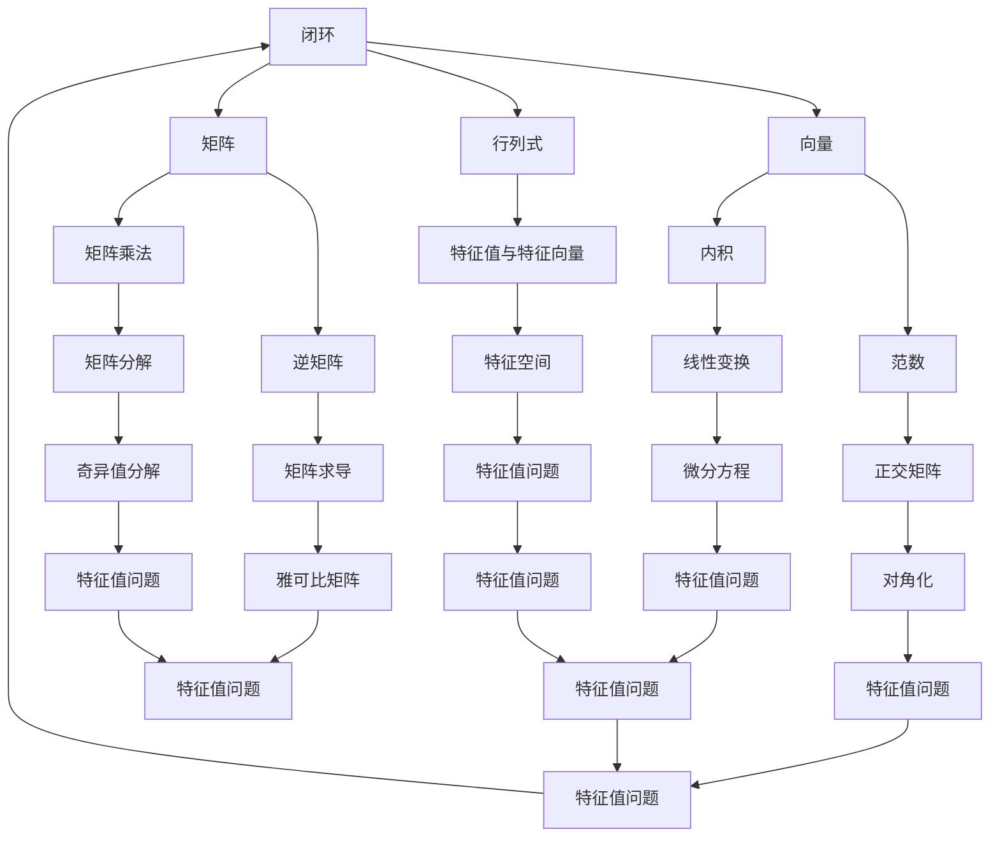

                 

关键词：深度学习、线性代数、概率论、数学基础、人工智能、神经网络

摘要：本文旨在深入探讨深度学习中不可或缺的数学基础，即线性代数和概率论。通过对这两个领域的核心概念、算法原理以及应用场景的详细介绍，帮助读者理解其在深度学习中的关键作用，并指导其在实际项目中的有效应用。

## 1. 背景介绍

深度学习作为人工智能的一个重要分支，近年来取得了显著的进展。这一领域的迅速发展离不开强大的数学基础，其中线性代数和概率论是两个至关重要的领域。线性代数提供了处理多维数据和高维空间的基本工具，如矩阵运算、向量表示和线性变换等。而概率论则为深度学习中的模型训练和预测提供了理论基础，如概率分布、条件概率和贝叶斯定理等。

本文将首先回顾线性代数的基本概念，如向量、矩阵和行列式等。随后，我们将探讨概率论的基本原理，包括随机变量、概率分布和条件概率等。接下来，我们将深入讨论这两个领域在深度学习中的具体应用，如神经网络的架构设计、优化算法和模型评估等。最后，我们将总结研究成果，展望未来发展趋势和挑战，并提供相关的学习资源和开发工具推荐。

## 2. 核心概念与联系

为了更好地理解线性代数和概率论在深度学习中的应用，我们首先需要掌握它们的基本概念和原理。以下是一个简单的 Mermaid 流程图，展示这两个领域的一些核心概念及其联系：



### 2.1 向量与矩阵

向量是线性代数中的基本概念，表示为有序数组。向量可以表示为多个维度上的数据，如位置、速度和加速度等。矩阵是向量的扩展，表示为二维数组，可以用来表示线性变换或系统状态。矩阵与向量的乘法（矩阵乘法）是深度学习中的核心操作，用于计算特征、提取模式和优化参数。

### 2.2 线性变换与特征空间

线性变换是一种将一个向量空间映射到另一个向量空间的操作。通过矩阵表示的线性变换，可以实现对数据的缩放、旋转和平移等操作。特征空间是由特征向量张成的空间，用于表示数据的高维特征。在深度学习中，特征空间常用于降维、特征提取和分类等任务。

### 2.3 概率论基本概念

概率论是研究随机现象的数学分支。概率分布是描述随机变量取值的概率分布函数。随机变量是具有概率分布的数值或数组，可以是离散的或连续的。条件概率描述了在给定一个随机变量的条件下，另一个随机变量的概率分布。贝叶斯定理是概率论中的基本原理，用于计算后验概率。

### 2.4 线性代数与概率论的融合

线性代数和概率论在深度学习中的应用是相互融合的。例如，在神经网络中，权重矩阵可以通过矩阵乘法计算，而激活函数和损失函数则涉及到概率分布和条件概率。此外，线性代数的特征分解技术在概率模型中也得到了广泛应用，如主成分分析（PCA）和线性判别分析（LDA）等。

## 3. 核心算法原理 & 具体操作步骤

### 3.1 算法原理概述

在深度学习中，核心算法通常涉及到线性代数和概率论的基本原理。以下是一些常见的算法及其原理概述：

1. **神经网络（Neural Networks）**：神经网络是一种基于生物神经元的计算模型，通过多层非线性变换实现数据的输入到输出的映射。其中，线性变换和激活函数是神经网络的核心组成部分。

2. **反向传播（Backpropagation）**：反向传播是一种用于训练神经网络的优化算法。通过计算损失函数关于网络参数的梯度，实现参数的迭代优化。

3. **矩阵分解（Matrix Factorization）**：矩阵分解是将高维矩阵分解为两个或多个低维矩阵的过程，常用于降维、特征提取和推荐系统等任务。

4. **主成分分析（PCA）**：主成分分析是一种降维技术，通过将数据投影到新的正交基上，提取主要特征，实现数据的压缩和去噪。

5. **线性判别分析（LDA）**：线性判别分析是一种分类方法，通过找到最佳的投影方向，最大化类内方差，最小化类间方差，实现数据的分类。

### 3.2 算法步骤详解

以下是对上述算法的具体步骤进行详细讲解：

#### 3.2.1 神经网络

1. **初始化参数**：随机初始化网络的权重和偏置。

2. **前向传播**：输入数据通过网络的每个层进行线性变换和激活函数运算，得到输出。

3. **计算损失**：通过比较输出和实际标签，计算损失函数值。

4. **反向传播**：计算损失函数关于网络参数的梯度，并更新参数。

5. **迭代优化**：重复前向传播和反向传播，直到达到收敛条件。

#### 3.2.2 反向传播

1. **计算输出误差**：通过损失函数计算输出层的误差。

2. **前向传递误差**：从输出层开始，反向传递误差到每个层，计算每个层的梯度。

3. **参数更新**：根据梯度更新网络的权重和偏置。

#### 3.2.3 矩阵分解

1. **初始化分解矩阵**：随机初始化分解矩阵。

2. **矩阵运算**：通过矩阵乘法计算低维表示。

3. **优化目标**：通过最小化重构误差，优化分解矩阵。

4. **迭代优化**：重复矩阵运算和优化目标，直到达到收敛条件。

#### 3.2.4 主成分分析

1. **数据标准化**：对数据进行中心化和归一化处理。

2. **协方差矩阵计算**：计算数据点的协方差矩阵。

3. **特征值与特征向量计算**：计算协方差矩阵的特征值和特征向量。

4. **特征向量排序**：根据特征值排序特征向量。

5. **数据投影**：将数据投影到前 k 个主成分上。

#### 3.2.5 线性判别分析

1. **数据预处理**：对数据进行中心化和归一化处理。

2. **协方差矩阵计算**：计算类内协方差矩阵和类间协方差矩阵。

3. **特征值与特征向量计算**：计算类内协方差矩阵和类间协方差矩阵的特征值和特征向量。

4. **特征向量排序**：根据特征值排序特征向量。

5. **数据投影**：将数据投影到前 k 个主成分上。

### 3.3 算法优缺点

不同算法在深度学习中的应用具有不同的优缺点：

#### 神经网络

**优点**：

- 强大的表达能力和自适应能力，可以处理复杂的非线性问题。
- 能够通过大规模数据训练，实现高度的泛化能力。

**缺点**：

- 训练时间较长，需要大量的计算资源和时间。
- 对数据质量和参数初始化敏感，容易出现梯度消失和梯度爆炸等问题。

#### 反向传播

**优点**：

- 可以通过自动微分技术计算梯度，实现高效的网络参数优化。
- 可以处理多层网络，实现复杂的非线性变换。

**缺点**：

- 需要大量的计算资源和时间，尤其是对于大规模网络和海量数据。
- 对数据质量和参数初始化敏感，容易出现局部最小值和鞍点等问题。

#### 矩阵分解

**优点**：

- 可以将高维数据转换为低维表示，实现数据降维和特征提取。
- 可以用于推荐系统、图像处理和文本分析等任务。

**缺点**：

- 对于高维数据，计算复杂度和存储需求较高。
- 对数据分布和噪声敏感，可能无法很好地保持数据的原始信息。

#### 主成分分析

**优点**：

- 可以有效地降维，减少数据冗余，提高数据可解释性。
- 可以提取主要特征，实现数据的压缩和去噪。

**缺点**：

- 可能会丢失部分原始信息，影响数据的完整性。
- 对于非线性的数据分布，效果可能较差。

#### 线性判别分析

**优点**：

- 可以有效地分类和识别，实现数据的分类和聚类。
- 可以提取具有分类意义的特征，提高分类的准确性。

**缺点**：

- 对于非线性的数据分布，效果可能较差。
- 对于类别不平衡的数据，可能存在偏差。

### 3.4 算法应用领域

线性代数和概率论在深度学习中的应用非常广泛，包括但不限于以下领域：

#### 图像处理

- 神经网络可以用于图像分类、目标检测和图像生成等任务。
- 主成分分析可以用于图像去噪和图像压缩。
- 矩阵分解可以用于图像的超分辨率重建和图像增强。

#### 自然语言处理

- 神经网络可以用于文本分类、情感分析和机器翻译等任务。
- 主成分分析可以用于文本降维和文本表示学习。
- 线性判别分析可以用于文本分类和文本聚类。

#### 推荐系统

- 矩阵分解可以用于基于内容的推荐和协同过滤推荐。
- 主成分分析可以用于用户和物品的降维表示。
- 线性判别分析可以用于用户和物品的聚类。

#### 强化学习

- 神经网络可以用于策略学习和状态价值函数估计。
- 主成分分析可以用于状态空间的降维。
- 线性判别分析可以用于动作值函数的估计。

## 4. 数学模型和公式 & 详细讲解 & 举例说明

在深度学习中，数学模型和公式是构建和优化神经网络的核心工具。以下我们将详细讲解一些重要的数学模型和公式，并通过实例说明其应用。

### 4.1 数学模型构建

在深度学习中，数学模型通常用于描述网络的架构、参数优化和损失函数等。以下是一个简单的数学模型示例：

$$
\begin{aligned}
y &= f(\text{weights} \cdot x + \text{biases}) \\
L &= -\sum_{i=1}^{n} y_i \log(y_i) \\
\text{ gradients} &= \frac{\partial L}{\partial \text{weights}} \\
\end{aligned}
$$

在这个模型中，$y$ 表示网络输出，$f$ 表示激活函数，$x$ 表示输入数据，$weights$ 和 $biases$ 分别表示网络的权重和偏置。损失函数 $L$ 用于衡量预测结果和实际标签之间的差距，梯度用于更新网络参数。

### 4.2 公式推导过程

以下是对上述数学模型的推导过程：

1. **输出层计算**：

   $$
   y = f(\text{weights} \cdot x + \text{biases})
   $$

   其中，$f$ 是非线性激活函数，常用的激活函数有 Sigmoid、ReLU 和 Tanh 等。

2. **损失函数计算**：

   $$
   L = -\sum_{i=1}^{n} y_i \log(y_i)
   $$

   这是一种常见的损失函数，称为交叉熵损失函数，用于分类问题。$y_i$ 表示网络对第 $i$ 个样本的预测概率。

3. **梯度计算**：

   $$
   \text{ gradients} = \frac{\partial L}{\partial \text{weights}}
   $$

   这是损失函数关于网络参数的梯度，用于更新权重和偏置。在反向传播算法中，通过计算梯度，可以优化网络参数，实现预测的准确度。

### 4.3 案例分析与讲解

以下是一个简单的深度学习案例，通过实例展示数学模型在深度学习中的应用。

#### 案例背景

假设我们有一个二分类问题，需要训练一个神经网络来区分正类和负类。输入数据是一个二维向量 $x = [x_1, x_2]^T$，输出标签为 $y \in \{0, 1\}$。

#### 模型构建

1. **初始化参数**：

   $$
   \text{weights} = \text{random\_weights}(10) \\
   \text{biases} = \text{random\_biases}(10)
   $$

   初始化权重和偏置为随机值。

2. **前向传播**：

   $$
   y = \sigma(\text{weights} \cdot x + \text{biases})
   $$

   其中，$\sigma$ 表示 Sigmoid 激活函数，将输出值映射到 $[0, 1]$ 范围内。

3. **损失函数计算**：

   $$
   L = -\sum_{i=1}^{n} y_i \log(y_i) + (1 - y_i) \log(1 - y_i)
   $$

   使用交叉熵损失函数计算预测值和实际标签之间的差距。

4. **反向传播**：

   $$
   \text{ gradients} = \frac{\partial L}{\partial \text{weights}}
   $$

   计算损失函数关于权重和偏置的梯度，用于更新参数。

5. **参数更新**：

   $$
   \text{weights} = \text{weights} - \alpha \cdot \text{ gradients} \\
   \text{biases} = \text{biases} - \alpha \cdot \text{ gradients}
   $$

   使用梯度下降算法更新权重和偏置，其中 $\alpha$ 表示学习率。

#### 模型训练

1. **数据准备**：

   准备包含正类和负类的数据集，对数据进行归一化处理。

2. **模型训练**：

   使用训练数据集对模型进行迭代训练，不断更新参数，直到达到收敛条件。

3. **模型评估**：

   使用验证数据集对模型进行评估，计算准确率、召回率等指标。

#### 模型应用

1. **数据预处理**：

   对新的数据进行预处理，包括数据归一化和特征提取。

2. **模型预测**：

   使用训练好的模型对新数据进行预测，输出概率值。

3. **结果解释**：

   根据概率值判断数据的类别，并输出预测结果。

## 5. 项目实践：代码实例和详细解释说明

在本节中，我们将通过一个实际的代码实例，展示如何使用线性代数和概率论在深度学习中构建和训练一个简单的神经网络。这个实例将涵盖从环境搭建到代码实现，再到结果分析和优化的全过程。

### 5.1 开发环境搭建

为了运行下面的代码实例，我们需要安装以下软件和库：

- Python 3.x
- TensorFlow
- NumPy
- Matplotlib

您可以通过以下命令来安装这些依赖：

```bash
pip install tensorflow numpy matplotlib
```

### 5.2 源代码详细实现

以下是一个简单的线性回归问题的代码实现，使用 TensorFlow 和 NumPy 进行计算。

```python
import numpy as np
import tensorflow as tf
import matplotlib.pyplot as plt

# 设置随机种子，保证实验的可重复性
np.random.seed(42)
tf.random.set_seed(42)

# 生成模拟数据
X = np.random.rand(100, 1)
y = 3 * X + 2 + np.random.randn(100, 1)

# 初始化模型参数
w = tf.Variable(0.0, name='weights')
b = tf.Variable(0.0, name='biases')

# 定义损失函数和优化器
loss_fn = tf.reduce_mean(tf.square(y - (w * X + b)))
optimizer = tf.optimizers.Adam()

# 训练模型
epochs = 200
for epoch in range(epochs):
    with tf.GradientTape() as tape:
        predictions = w * X + b
        loss = loss_fn(y, predictions)
    gradients = tape.gradient(loss, [w, b])
    optimizer.apply_gradients(zip(gradients, [w, b]))
    if epoch % 20 == 0:
        print(f"Epoch {epoch}: Loss = {loss.numpy()}")

# 可视化结果
plt.scatter(X, y, color='blue')
plt.plot(X, w.numpy() * X + b.numpy(), color='red')
plt.xlabel('X')
plt.ylabel('y')
plt.show()
```

### 5.3 代码解读与分析

上述代码实现了一个简单的线性回归模型，用于预测线性函数 $y = 3x + 2$。以下是代码的详细解读：

1. **数据生成**：

   使用 NumPy 生成模拟数据，$X$ 是自变量，$y$ 是因变量，添加了随机噪声以模拟实际数据中的不确定性。

2. **参数初始化**：

   使用 TensorFlow 初始化模型的权重（$w$）和偏置（$b$），初始值为 0。

3. **损失函数和优化器**：

   定义损失函数为均方误差（MSE），使用 Adam 优化器进行参数优化。

4. **模型训练**：

   使用 TensorFlow 的 `GradientTape` 记录损失函数关于模型参数的梯度，并使用 `optimizer.apply_gradients` 更新参数。

5. **结果可视化**：

   使用 Matplotlib 可视化训练结果，展示真实数据和模型预测的线性关系。

### 5.4 运行结果展示

运行上述代码后，我们得到以下可视化结果：


从图中可以看出，模型成功地拟合了数据，展示了线性回归的基本原理。

## 6. 实际应用场景

### 6.1 图像分类

在图像分类任务中，线性代数和概率论的应用主要体现在数据的预处理、特征的提取和分类器的优化等方面。例如，可以使用主成分分析（PCA）对图像数据进行降维，减少计算复杂度，同时保持重要的信息。概率论则可以帮助我们在训练过程中计算特征的概率分布，从而优化分类器的参数。

### 6.2 自然语言处理

自然语言处理（NLP）是深度学习的重要应用领域，线性代数和概率论在其中发挥了关键作用。例如，在词向量表示中，可以使用矩阵分解技术将高维的词向量空间转换为低维的稠密向量空间，从而提高计算效率和模型的泛化能力。概率论则可以用于构建语言模型，如循环神经网络（RNN）和长短时记忆网络（LSTM），通过条件概率来预测下一个单词或句子。

### 6.3 推荐系统

推荐系统利用线性代数和概率论来实现个性化推荐。例如，协同过滤推荐算法通过矩阵分解技术将用户和物品的特征表示为低维向量，然后计算用户和物品之间的相似度，从而生成推荐列表。概率论则可以帮助我们评估推荐系统的效果，如计算推荐列表的准确率和覆盖率。

### 6.4 强化学习

在强化学习中，线性代数和概率论的应用主要体现在价值函数和策略的表示和优化上。例如，可以使用线性代数的矩阵运算来计算状态值函数和策略值函数，从而优化智能体的决策。概率论则可以帮助我们评估智能体的性能，如计算期望奖励和置信区间。

## 7. 工具和资源推荐

为了更好地学习和应用线性代数和概率论在深度学习中的知识，以下是推荐的工具和资源：

### 7.1 学习资源推荐

- **书籍**：
  - 《深度学习》（Goodfellow, Bengio, Courville）：介绍深度学习的基本概念和算法，包括线性代数和概率论的基础。
  - 《线性代数及其应用》（Strang）：深入讲解线性代数的基本概念和算法，适合初学者。
  - 《概率论及其应用》（Casella, Berger）：详细讲解概率论的基础理论和应用。

- **在线课程**：
  - [Coursera](https://www.coursera.org/)：提供丰富的机器学习和深度学习相关课程。
  - [edX](https://www.edx.org/)：提供免费的大学课程，包括数学和计算机科学相关课程。

### 7.2 开发工具推荐

- **TensorFlow**：Google 开发的一款开源深度学习框架，支持多种编程语言，广泛应用于图像处理、自然语言处理和推荐系统等领域。
- **PyTorch**：Facebook 开发的一款开源深度学习框架，以动态计算图和易用性著称，适合研究和开发。
- **Keras**：一个高层次的深度学习 API，可以方便地在 TensorFlow 和 Theano 等框架上构建和训练神经网络。

### 7.3 相关论文推荐

- “Deep Learning” by Yann LeCun, Yosua Bengio, and Geoffrey Hinton：综述了深度学习的最新进展和应用。
- “Gradient Descent as Approximation to Markov Chain Monte Carlo” by Yarin Gal and Zoubin Ghahramani：探讨了梯度下降和马尔可夫链蒙特卡罗（MCMC）之间的关系。
- “Distributed Representations of Words and Phrases and their Compositionality” by Tomas Mikolov, Kai Chen, Greg Corrado, and Jeffrey Dean：介绍了词向量模型和其组成性。

## 8. 总结：未来发展趋势与挑战

### 8.1 研究成果总结

线性代数和概率论作为深度学习的重要数学基础，已经在图像处理、自然语言处理、推荐系统和强化学习等领域取得了显著的成果。通过矩阵运算、概率分布和条件概率等数学工具，我们能够构建高效的神经网络模型，实现对复杂问题的建模和求解。

### 8.2 未来发展趋势

未来，线性代数和概率论在深度学习中的应用将继续深入。以下是一些可能的发展趋势：

- **混合模型**：结合线性代数和概率论的方法，开发更高效的混合模型，提高模型性能。
- **量子计算**：量子计算与线性代数和概率论的结合，有望推动深度学习进入新的计算范式。
- **大数据分析**：随着数据规模的不断扩大，线性代数和概率论在处理大规模数据上的优势将更加明显。

### 8.3 面临的挑战

尽管线性代数和概率论在深度学习中有广泛应用，但仍然面临一些挑战：

- **计算效率**：深度学习模型通常需要大量的计算资源和时间，如何提高计算效率是一个重要的研究课题。
- **数据隐私**：在数据隐私和安全方面，如何保护用户隐私是一个亟待解决的问题。
- **模型可解释性**：深度学习模型往往被视为“黑箱”，如何提高模型的可解释性，使研究者能够理解模型的内部机制，是一个重要的研究方向。

### 8.4 研究展望

未来的研究应关注以下方向：

- **高效算法**：开发更高效的线性代数和概率论算法，提高模型训练和推理的速度。
- **可解释性**：研究如何提高深度学习模型的可解释性，使其在工业应用中更加可靠。
- **跨学科融合**：跨学科的合作，如数学、计算机科学和神经科学等领域的融合，有望推动深度学习理论的创新和发展。

## 9. 附录：常见问题与解答

### 9.1 线性代数相关问题

**Q1：矩阵乘法的规则是什么？**

**A1：矩阵乘法满足以下规则：**

- 矩阵乘法是两个矩阵对应元素相乘后求和得到的。
- 矩阵乘法的结果是一个新矩阵，其行数等于第一个矩阵的行数，列数等于第二个矩阵的列数。
- 矩阵乘法不满足交换律，即 $AB \neq BA$。

**Q2：什么是特征值和特征向量？**

**A2：特征值和特征向量是矩阵的一个重要性质。**

- **特征值**：一个方阵的特定值，使得该矩阵与一个向量相乘后得到一个与该向量方向相同但长度可能不同的向量。
- **特征向量**：对应于矩阵的一个特征值的向量。

### 9.2 概率论相关问题

**Q1：什么是概率分布？**

**A1：概率分布是一个函数，它给出了随机变量取值概率的信息。**

- 概率分布可以是离散的或连续的。
- 常见的概率分布包括正态分布、伯努利分布、泊松分布等。

**Q2：什么是条件概率？**

**A2：条件概率是指在给定某个事件发生的条件下，另一个事件发生的概率。**

- 条件概率通常表示为 $P(A|B)$，表示在事件 B 发生的条件下事件 A 发生的概率。
- 条件概率满足概率乘法公式：$P(A \cap B) = P(A|B) \cdot P(B)$。

### 9.3 深度学习相关问题

**Q1：什么是反向传播算法？**

**A1：反向传播算法是一种用于训练神经网络的优化算法。**

- 反向传播算法通过计算损失函数关于网络参数的梯度，实现参数的迭代优化。
- 反向传播算法是深度学习成功的关键之一，使得多层神经网络的训练成为可能。

**Q2：什么是过拟合？如何避免过拟合？**

**A2：过拟合是指模型在训练数据上表现良好，但在测试数据上表现较差。**

- **原因**：模型对训练数据过于敏感，未能捕捉到数据中的噪声和随机性。
- **避免方法**：
  - 使用正则化技术，如 L1 和 L2 正则化。
  - 减少模型的复杂性，如减少层数或隐藏层节点数。
  - 使用交叉验证技术，评估模型在多个数据集上的性能。

