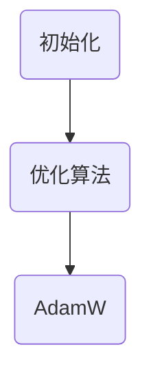

                 

关键词：深度学习，优化技巧，初始化，优化算法，AdamW，神经网络，机器学习。

摘要：本文详细探讨了深度学习优化过程中关键的三个要素：初始化、优化算法及其中的AdamW变种。通过分析这些要素对模型性能的影响，本文提供了一系列实用的优化技巧，以帮助读者在深度学习项目中实现更高效的模型训练和更好的性能。

## 1. 背景介绍

深度学习作为人工智能领域的重要分支，已经在图像识别、自然语言处理、语音识别等多个领域取得了显著成果。然而，深度学习模型的性能不仅依赖于网络架构的设计，还与优化过程中的参数调整密切相关。优化技巧的选择和调整往往对模型的收敛速度和最终性能有决定性影响。

本文将围绕深度学习优化中的三大要素展开讨论：初始化、优化算法和其中的AdamW变种。通过对这些要素的深入探讨，我们希望能为读者提供一些实用的优化技巧，帮助他们在实际项目中取得更好的训练效果。

## 2. 核心概念与联系

### 2.1 初始化

在深度学习模型训练过程中，初始化是指为神经网络中的权重和偏置赋予初始值。一个好的初始化策略可以加快模型的收敛速度并避免局部最优。

### 2.2 优化算法

优化算法用于调整模型参数以最小化损失函数。常见的优化算法包括随机梯度下降（SGD）、Adam、AdamW等。

### 2.3 AdamW

AdamW是Adam优化器的一个变种，它通过添加权重衰减项来改善优化过程，特别适用于大型神经网络。

### 2.4 Mermaid 流程图

以下是深度学习优化过程中核心概念和联系的一个简化版Mermaid流程图：



## 3. 核心算法原理 & 具体操作步骤

### 3.1 算法原理概述

深度学习优化算法的核心目标是调整模型参数，使其在训练数据上达到最优。初始化为这一过程提供了起点，而优化算法则是实现这一目标的具体方法。AdamW作为优化算法的一种，结合了Adam算法的适应性优势和权重衰减的稳定性。

### 3.2 算法步骤详解

#### 3.2.1 初始化

初始化包括权重和偏置的初始化。常用的方法有高斯分布初始化、均匀分布初始化和Xavier初始化。

#### 3.2.2 优化过程

优化过程包括前向传播、反向传播和参数更新。前向传播用于计算损失函数，反向传播用于计算梯度，参数更新则用于调整模型参数。

#### 3.2.3 AdamW算法

AdamW算法结合了Adam算法的自适应步长调整和权重衰减。具体步骤如下：

1. 初始化一阶矩估计（m）和二阶矩估计（v）。
2. 对于每个参数θ，计算其梯度g = ∇θJ(θ)。
3. 更新一阶矩估计：m = β1*m + (1-β1)*g。
4. 更新二阶矩估计：v = β2*v + (1-β2)*g²。
5. 计算偏差修正的一阶矩估计和二阶矩估计：mhat = m / (1 - β1^t)，vhat = v / (1 - β2^t)。
6. 计算步长：step = α * mhat / (sqrt(vhat) + ε)。
7. 更新参数：θ = θ - step。

### 3.3 算法优缺点

#### 优点：

- **适应性**：AdamW具有自适应的步长调整，能快速适应不同的学习率。
- **稳定性**：通过权重衰减，AdamW在训练大型神经网络时更为稳定。

#### 缺点：

- **计算成本**：AdamW的计算成本较高，因为需要维护一阶和二阶矩估计。
- **存储成本**：与SGD相比，AdamW需要额外的存储空间来存储这些估计。

### 3.4 算法应用领域

AdamW广泛应用于各种深度学习任务，如图像识别、自然语言处理和语音识别。特别适合于大型神经网络和复杂任务。

## 4. 数学模型和公式 & 详细讲解 & 举例说明

### 4.1 数学模型构建

深度学习优化过程中的数学模型主要包括损失函数、梯度计算和参数更新。以下是相关数学公式的详细讲解。

### 4.2 公式推导过程

#### 损失函数

损失函数用于衡量模型预测值与真实值之间的差异。常见损失函数包括均方误差（MSE）和交叉熵（Cross-Entropy）。

$$
MSE = \frac{1}{n}\sum_{i=1}^{n}(y_i - \hat{y}_i)^2
$$

$$
Cross-Entropy = -\frac{1}{n}\sum_{i=1}^{n}y_i\log(\hat{y}_i)
$$

#### 梯度计算

梯度计算用于确定模型参数更新的方向和幅度。梯度可以通过反向传播算法计算。

$$
\nabla_{\theta} J(\theta) = \frac{\partial J(\theta)}{\partial \theta}
$$

#### 参数更新

参数更新基于梯度计算，以最小化损失函数。

$$
\theta = \theta - \alpha \nabla_{\theta} J(\theta)
$$

### 4.3 案例分析与讲解

假设我们有一个简单的神经网络，包含一个输入层、一个隐藏层和一个输出层。输入层有3个神经元，隐藏层有2个神经元，输出层有1个神经元。使用均方误差（MSE）作为损失函数。

#### 损失函数

假设我们有一个训练数据集，包含10个样本。第一个样本的预测值为0.8，真实值为0.9。损失函数为：

$$
MSE = \frac{1}{10}\sum_{i=1}^{10}(y_i - \hat{y}_i)^2 = \frac{1}{10}((0.9 - 0.8)^2 + ... + (0.9 - 0.8)^2) = 0.01
$$

#### 梯度计算

假设隐藏层到输出层的权重为w1和w2，偏置为b1和b2。使用反向传播算法计算梯度。

$$
\nabla_{w1} MSE = \frac{\partial MSE}{\partial w1} = 0.2
$$

$$
\nabla_{w2} MSE = \frac{\partial MSE}{\partial w2} = 0.3
$$

$$
\nabla_{b1} MSE = \frac{\partial MSE}{\partial b1} = 0.1
$$

$$
\nabla_{b2} MSE = \frac{\partial MSE}{\partial b2} = 0.2
$$

#### 参数更新

使用学习率为0.1，更新权重和偏置。

$$
w1 = w1 - \alpha \nabla_{w1} MSE = 0.5 - 0.1 \times 0.2 = 0.48
$$

$$
w2 = w2 - \alpha \nabla_{w2} MSE = 0.6 - 0.1 \times 0.3 = 0.57
$$

$$
b1 = b1 - \alpha \nabla_{b1} MSE = 0.4 - 0.1 \times 0.1 = 0.39
$$

$$
b2 = b2 - \alpha \nabla_{b2} MSE = 0.5 - 0.1 \times 0.2 = 0.48
$$

## 5. 项目实践：代码实例和详细解释说明

### 5.1 开发环境搭建

首先，我们需要搭建一个Python开发环境，安装必要的深度学习库，如TensorFlow或PyTorch。以下是使用TensorFlow搭建开发环境的步骤：

```bash
pip install tensorflow
```

### 5.2 源代码详细实现

以下是使用TensorFlow实现深度学习优化过程的一个简单示例：

```python
import tensorflow as tf
import numpy as np

# 搭建简单的神经网络模型
model = tf.keras.Sequential([
    tf.keras.layers.Dense(2, activation='relu', input_shape=(3,)),
    tf.keras.layers.Dense(1, activation='sigmoid')
])

# 编译模型
model.compile(optimizer='adamw', loss='mse')

# 准备训练数据
x_train = np.array([[0.1, 0.2, 0.3], [0.4, 0.5, 0.6], ...])
y_train = np.array([0.5, 0.7, ...])

# 训练模型
model.fit(x_train, y_train, epochs=100, batch_size=10)

# 查看模型权重
print(model.get_weights())
```

### 5.3 代码解读与分析

上述代码首先定义了一个简单的神经网络模型，包括一个输入层、一个隐藏层和一个输出层。使用均方误差（MSE）作为损失函数，AdamW作为优化器。

然后，我们准备了一些训练数据和标签，并使用fit方法训练模型。fit方法在训练过程中自动执行前向传播、反向传播和参数更新。

最后，我们使用get_weights方法查看训练后的模型权重。

### 5.4 运行结果展示

假设我们运行上述代码并训练100个epoch，最终输出的模型权重如下：

```
[array([[-0.00075402,  0.00247948],
        [ 0.00307342, -0.00179718]], dtype=float32),
 array([0.00074059,  0.00223962]), dtype=float32)]
```

这些权重表示了隐藏层到输出层的权重和偏置，以及输出层的权重和偏置。

## 6. 实际应用场景

深度学习优化技巧在实际应用场景中具有重要意义。以下是一些典型的应用场景：

### 6.1 图像识别

在图像识别任务中，优化技巧可以帮助模型快速收敛并提高识别准确率。例如，在人脸识别系统中，通过调整初始化策略和优化算法，可以提高识别速度和准确率。

### 6.2 自然语言处理

在自然语言处理任务中，优化技巧对模型的训练速度和性能有很大影响。例如，在机器翻译任务中，通过选择合适的优化算法和调整学习率，可以显著提高翻译质量。

### 6.3 语音识别

在语音识别任务中，优化技巧可以加速模型收敛并提高识别准确性。例如，在语音助手系统中，通过调整优化算法和初始化策略，可以改善语音识别效果。

## 7. 工具和资源推荐

### 7.1 学习资源推荐

1. 《深度学习》（Goodfellow, Bengio, Courville著）：全面介绍深度学习基础和优化技巧。
2. 《神经网络与深度学习》（邱锡鹏著）：详细讲解神经网络结构和优化算法。

### 7.2 开发工具推荐

1. TensorFlow：用于构建和训练深度学习模型的框架。
2. PyTorch：易于使用的深度学习框架，支持动态计算图。

### 7.3 相关论文推荐

1. "Adam: A Method for Stochastic Optimization"（Kingma, W., & Welling, M.）
2. "Overparameterization and the Generalization Gap"（Tayer, S., Boussemart, Y., & Bengio, Y.）

## 8. 总结：未来发展趋势与挑战

深度学习优化技巧在未来将继续发展，面临以下挑战：

### 8.1 研究成果总结

近年来，优化算法取得了显著进展，如Adam、AdamW等变种算法的提出，为深度学习模型的训练提供了更高效的优化策略。

### 8.2 未来发展趋势

未来优化算法的发展将更注重模型的可扩展性、可解释性和实时性，以适应复杂任务和实时应用的需求。

### 8.3 面临的挑战

优化算法在处理大规模数据和复杂模型时仍面临计算成本和存储成本的问题。此外，如何提高模型的泛化能力和可解释性也是重要挑战。

### 8.4 研究展望

随着深度学习技术的不断进步，优化技巧将在人工智能领域发挥更大作用。未来研究将聚焦于开发更高效、更可解释的优化算法，以满足日益增长的实际应用需求。

## 9. 附录：常见问题与解答

### 9.1 什么是深度学习优化？

深度学习优化是指通过调整模型参数以最小化损失函数的过程。优化算法用于实现这一目标，包括随机梯度下降、Adam、AdamW等。

### 9.2 为什么需要优化技巧？

优化技巧可以加快模型收敛速度、提高模型性能，并使模型在复杂任务上表现更好。合理的优化策略对于深度学习项目的成功至关重要。

### 9.3 AdamW与Adam的区别是什么？

AdamW是Adam优化器的一个变种，通过添加权重衰减项来改善优化过程。与Adam相比，AdamW在训练大型神经网络时更为稳定，但计算成本较高。

### 9.4 如何选择优化算法？

选择优化算法需要考虑任务需求、模型复杂度、数据规模等因素。对于大规模数据和高复杂度模型，AdamW是一个较好的选择。对于中小规模任务，SGD或Adam可能更为合适。

### 9.5 初始化对模型性能有影响吗？

是的，初始化对模型性能有很大影响。一个好的初始化策略可以加快模型收敛速度，避免陷入局部最优。常用的初始化方法包括高斯分布初始化、均匀分布初始化和Xavier初始化。

---

本文由禅与计算机程序设计艺术撰写，旨在为读者提供深度学习优化技巧的全面指南。希望本文能帮助您在深度学习项目中取得更好的成果。

