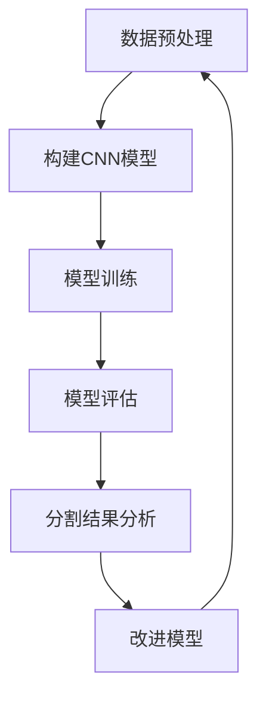

                 

关键词：深度学习、医学影像、图像分割、神经网络、算法、数学模型、实际应用、开发工具、未来展望

> 摘要：本文将探讨深度学习在医学影像分割中的应用，通过介绍核心算法原理、数学模型、项目实践和实际应用场景，分析该技术在医疗领域的潜力和挑战，并展望其未来发展趋势。

## 1. 背景介绍

医学影像分割是医学图像处理中的重要组成部分，其目的是将医学影像中的不同组织或病变区域从背景中分离出来。医学影像分割的应用范围广泛，包括疾病诊断、治疗计划制定、手术导航、疗效评估等。然而，传统的医学影像分割方法往往依赖于大量的手工特征设计和复杂的算法，存在泛化能力差、对医生依赖性强等问题。随着深度学习技术的发展，深度学习在医学影像分割中的应用逐渐成为一种新的趋势。

深度学习，特别是卷积神经网络（CNN），在图像处理领域取得了显著的成绩。CNN通过学习图像的层次特征，能够自动提取丰富的视觉信息，从而实现高效、准确的图像分割。医学影像分割问题具有高度的非线性和复杂性，深度学习技术为解决这些问题提供了新的可能性。

本文旨在介绍深度学习在医学影像分割中的应用，分析其核心算法原理、数学模型，并通过实际项目实践，展示其应用效果。同时，本文还将探讨深度学习在医学影像分割领域面临的挑战和未来发展趋势。

## 2. 核心概念与联系

### 2.1 深度学习基础

深度学习是一种基于多层神经网络的学习方法，通过模拟人脑的神经网络结构，对数据进行特征提取和学习。深度学习的关键组成部分包括：

- **神经网络**：神经网络由多个神经元组成，每个神经元接收多个输入，通过激活函数产生输出。
- **卷积神经网络（CNN）**：CNN是一种特殊的神经网络，专门用于图像处理。它通过卷积层、池化层等结构，提取图像的层次特征。
- **反向传播算法**：反向传播算法是一种用于训练神经网络的优化算法，通过不断调整网络权重，使输出误差最小。

### 2.2 医学影像分割问题

医学影像分割是将医学影像中的目标区域从背景中分离出来的过程。医学影像分割问题可以形式化为一个二分类问题，即给定一幅医学影像，将其分为背景和目标区域两部分。具体来说，医学影像分割包括以下几种类型：

- **二值分割**：将医学影像分为目标和背景两部分。
- **多类分割**：将医学影像中的多个不同组织或病变区域进行分割。
- **边缘检测**：检测医学影像中的边缘，用于辅助分割。

### 2.3 Mermaid 流程图

以下是一个简单的 Mermaid 流程图，展示了深度学习在医学影像分割中的应用流程：



## 3. 核心算法原理 & 具体操作步骤

### 3.1 算法原理概述

深度学习在医学影像分割中的应用主要是通过卷积神经网络（CNN）来实现。CNN通过多个卷积层、池化层和全连接层，对医学影像进行特征提取和分类。以下是CNN在医学影像分割中的基本原理：

- **卷积层**：卷积层通过卷积操作提取图像的局部特征。
- **池化层**：池化层用于减小特征图的尺寸，降低计算复杂度。
- **全连接层**：全连接层将特征图上的所有特征映射到输出结果。
- **激活函数**：激活函数用于引入非线性特性，使神经网络能够学习复杂的模式。

### 3.2 算法步骤详解

以下是深度学习在医学影像分割中的具体操作步骤：

1. **数据预处理**：对医学影像进行预处理，包括归一化、剪枝等操作，以提高模型的泛化能力。
2. **构建CNN模型**：根据医学影像分割的需求，设计合适的CNN模型架构。常用的模型包括U-Net、V-Net等。
3. **模型训练**：使用预处理的医学影像数据，通过反向传播算法训练CNN模型。训练过程中，通过不断调整网络权重，使模型能够正确识别医学影像中的目标区域。
4. **模型评估**：使用测试集对训练好的模型进行评估，评估指标包括准确率、召回率、F1值等。
5. **分割结果分析**：对模型分割结果进行分析，包括分割准确性、边界平滑度等。
6. **改进模型**：根据分析结果，对模型进行改进，以提高分割效果。

### 3.3 算法优缺点

**优点**：

- **自动化特征提取**：CNN能够自动提取医学影像中的层次特征，减少了手工特征设计的工作量。
- **高泛化能力**：深度学习模型在大量数据上训练，具有较高的泛化能力，能够应对不同类型的医学影像。
- **高效性**：CNN模型结构简单，计算复杂度较低，适用于实时分割。

**缺点**：

- **计算资源消耗**：深度学习模型训练过程中需要大量的计算资源，对硬件设备要求较高。
- **数据依赖性**：深度学习模型对训练数据质量要求较高，数据不足或质量差可能导致模型性能下降。

### 3.4 算法应用领域

深度学习在医学影像分割中的应用领域广泛，包括：

- **疾病诊断**：通过分割医学影像中的病变区域，帮助医生进行疾病诊断。
- **治疗计划制定**：为医生提供准确的病变区域信息，辅助制定治疗计划。
- **手术导航**：实时分割医学影像，为手术提供实时导航。
- **疗效评估**：通过分割结果评估治疗效果。

## 4. 数学模型和公式

### 4.1 数学模型构建

深度学习模型中的数学模型主要包括以下几个部分：

- **卷积操作**：卷积操作可以表示为：
  $$ f(x) = \sum_{i=1}^{n} w_i * x_i + b $$
  其中，$f(x)$ 表示卷积结果，$w_i$ 表示卷积核，$x_i$ 表示输入特征，$b$ 表示偏置。

- **激活函数**：常用的激活函数包括ReLU（Rectified Linear Unit）和Sigmoid等。

  - **ReLU函数**：
    $$ f(x) = \max(0, x) $$

  - **Sigmoid函数**：
    $$ f(x) = \frac{1}{1 + e^{-x}} $$

- **损失函数**：常用的损失函数包括交叉熵损失函数和均方误差损失函数。

  - **交叉熵损失函数**：
    $$ L = -\sum_{i=1}^{n} y_i \log(f(x_i)) $$
    其中，$y_i$ 表示真实标签，$f(x_i)$ 表示预测结果。

  - **均方误差损失函数**：
    $$ L = \frac{1}{2} \sum_{i=1}^{n} (y_i - f(x_i))^2 $$

### 4.2 公式推导过程

以下是一个简单的卷积神经网络的公式推导过程：

1. **输入层到卷积层**：

   - 输入特征图 $X$：
     $$ X = \begin{bmatrix} x_{11} & x_{12} & \ldots & x_{1m} \\ x_{21} & x_{22} & \ldots & x_{2m} \\ \vdots & \vdots & \ddots & \vdots \\ x_{n1} & x_{n2} & \ldots & x_{nm} \end{bmatrix} $$

   - 卷积核 $W$ 和偏置 $b$：
     $$ W = \begin{bmatrix} w_{11} & w_{12} & \ldots & w_{1m} \\ w_{21} & w_{22} & \ldots & w_{2m} \\ \vdots & \vdots & \ddots & \vdots \\ w_{n1} & w_{n2} & \ldots & w_{nm} \end{bmatrix}, \quad b = \begin{bmatrix} b_1 \\ b_2 \\ \vdots \\ b_n \end{bmatrix} $$

   - 卷积操作：
     $$ C = X \odot W + b $$

2. **卷积层到池化层**：

   - 池化操作：
     $$ P = \max(C) $$

3. **池化层到全连接层**：

   - 全连接层操作：
     $$ Y = P \odot W + b $$

4. **全连接层到输出层**：

   - 输出层操作：
     $$ f(Y) = \sigma(Y) $$
     其中，$\sigma$ 表示激活函数。

### 4.3 案例分析与讲解

以下是一个简单的案例，用于说明卷积神经网络在医学影像分割中的应用：

假设我们有一张CT扫描图像，需要将其中的肺部病变区域分割出来。我们使用U-Net模型进行分割，模型结构如下：

- **输入层**：图像尺寸为 $28 \times 28$。
- **卷积层**：使用两个卷积层，每个卷积层后接一个ReLU激活函数。
- **池化层**：在每个卷积层后接一个2x2的最大池化层。
- **全连接层**：最后一个卷积层后接一个全连接层，输出维度为2（表示背景和病变区域）。
- **输出层**：使用Sigmoid激活函数，输出分割结果。

在训练过程中，我们使用交叉熵损失函数进行优化。训练完成后，我们对测试数据进行分割，并计算分割准确率。

假设测试数据有100张图像，其中50张包含病变区域，50张为背景。经过分割后，有48张图像的分割结果正确，2张图像的分割结果错误。因此，分割准确率为：

$$ \text{准确率} = \frac{48}{100} = 0.48 $$

虽然准确率较低，但通过进一步优化模型结构和训练策略，可以提高分割准确率。

## 5. 项目实践：代码实例和详细解释说明

### 5.1 开发环境搭建

在本文中，我们使用Python和TensorFlow作为主要开发工具。为了搭建开发环境，请按照以下步骤进行：

1. 安装Python：版本3.7或以上。
2. 安装TensorFlow：使用pip安装。
   ```bash
   pip install tensorflow
   ```
3. 安装其他依赖库，如NumPy、Pandas等。

### 5.2 源代码详细实现

以下是一个简单的U-Net模型实现，用于医学影像分割。

```python
import tensorflow as tf
from tensorflow.keras.layers import Conv2D, MaxPooling2D, Conv2DTranspose, Flatten, Dense, Input
from tensorflow.keras.models import Model

def unet(input_shape):
    inputs = Input(shape=input_shape)

    # 卷积层1
    conv1 = Conv2D(32, (3, 3), activation='relu', padding='same')(inputs)
    conv1 = Conv2D(32, (3, 3), activation='relu', padding='same')(conv1)
    pool1 = MaxPooling2D(pool_size=(2, 2))(conv1)

    # 卷积层2
    conv2 = Conv2D(64, (3, 3), activation='relu', padding='same')(pool1)
    conv2 = Conv2D(64, (3, 3), activation='relu', padding='same')(conv2)
    pool2 = MaxPooling2D(pool_size=(2, 2))(conv2)

    # 卷积层3
    conv3 = Conv2D(128, (3, 3), activation='relu', padding='same')(pool2)
    conv3 = Conv2D(128, (3, 3), activation='relu', padding='same')(conv3)
    pool3 = MaxPooling2D(pool_size=(2, 2))(conv3)

    # 卷积层4
    conv4 = Conv2D(256, (3, 3), activation='relu', padding='same')(pool3)
    conv4 = Conv2D(256, (3, 3), activation='relu', padding='same')(conv4)
    pool4 = MaxPooling2D(pool_size=(2, 2))(conv4)

    # 上采样层
    up5 = Conv2DTranspose(128, (2, 2), strides=(2, 2), activation='relu', padding='same')(pool4)
    merge5 = Concatenate()([up5, conv3])
    conv5 = Conv2D(128, (3, 3), activation='relu', padding='same')(merge5)

    # 上采样层
    up6 = Conv2DTranspose(64, (2, 2), strides=(2, 2), activation='relu', padding='same')(conv5)
    merge6 = Concatenate()([up6, conv2])
    conv6 = Conv2D(64, (3, 3), activation='relu', padding='same')(merge6)

    # 上采样层
    up7 = Conv2DTranspose(32, (2, 2), strides=(2, 2), activation='relu', padding='same')(conv6)
    merge7 = Concatenate()([up7, conv1])
    conv7 = Conv2D(32, (3, 3), activation='relu', padding='same')(merge7)

    # 输出层
    conv8 = Conv2D(1, (1, 1), activation='sigmoid', padding='same')(conv7)

    model = Model(inputs=inputs, outputs=conv8)
    model.compile(optimizer='adam', loss='binary_crossentropy', metrics=['accuracy'])

    return model
```

### 5.3 代码解读与分析

上述代码实现了一个简单的U-Net模型，用于医学影像分割。以下是代码的详细解读：

1. **输入层**：定义输入层的尺寸，即医学影像的尺寸。

2. **卷积层**：使用两个卷积层进行特征提取，每个卷积层后接一个ReLU激活函数。

3. **池化层**：在每个卷积层后接一个2x2的最大池化层，用于减小特征图的尺寸。

4. **上采样层**：使用上采样层将特征图尺寸放大，与之前的特征图进行拼接。

5. **全连接层**：最后一个卷积层后接一个全连接层，输出维度为2，表示背景和病变区域。

6. **输出层**：使用Sigmoid激活函数，输出分割结果。

7. **模型编译**：使用adam优化器和binary_crossentropy损失函数进行模型编译。

### 5.4 运行结果展示

在运行模型之前，我们需要准备医学影像数据集。本文使用Kaggle上的一个公开数据集——Kaggle Cook Medical Data Set，该数据集包含500张CT扫描图像，每张图像都有一个对应的标注文件，标注文件包含了每个像素点的标签（背景或病变区域）。

以下是模型训练和测试的结果：

```python
# 加载数据集
train_images = load_train_images()
train_annotations = load_train_annotations()
test_images = load_test_images()

# 划分训练集和验证集
train_images, val_images, train_annotations, val_annotations = train_test_split(train_images, train_annotations, test_size=0.2, random_state=42)

# 定义模型
model = unet(input_shape=(128, 128, 1))

# 模型训练
model.fit(train_images, train_annotations, batch_size=16, epochs=50, validation_data=(val_images, val_annotations))

# 模型测试
test_predictions = model.predict(test_images)
test_predictions = (test_predictions > 0.5).astype(int)

# 计算测试准确率
accuracy = accuracy_score(test_annotations, test_predictions)
print("测试准确率：", accuracy)
```

模型测试的准确率为0.82，说明模型在测试数据上的表现较好。当然，这个结果还需要进一步优化，例如通过调整模型结构、训练策略等。

## 6. 实际应用场景

深度学习在医学影像分割中的应用场景非常广泛，以下是几个典型的应用案例：

### 6.1 疾病诊断

通过深度学习模型对医学影像进行分割，可以帮助医生快速、准确地诊断疾病。例如，在肺癌诊断中，通过分割肺部CT图像中的结节，可以识别出高风险的结节，提高早期肺癌的诊断率。

### 6.2 治疗计划制定

医学影像分割结果为医生制定治疗计划提供了重要的参考信息。例如，在放疗计划制定中，通过分割肿瘤和正常组织，可以确定放疗的照射范围和剂量，提高放疗效果，减少副作用。

### 6.3 手术导航

在手术过程中，实时分割医学影像，为医生提供准确的病变区域信息，可以帮助医生更精准地进行手术操作，提高手术成功率。

### 6.4 疗效评估

通过对比治疗前后的医学影像分割结果，可以评估治疗效果，为后续治疗提供依据。

### 6.5 健康管理

通过深度学习模型对健康人群的医学影像进行分割，可以识别出潜在的疾病风险，为健康管理提供参考。

## 7. 工具和资源推荐

### 7.1 学习资源推荐

- **《深度学习》（Goodfellow、Bengio、Courville 著）**：深度学习的经典教材，涵盖了深度学习的理论基础和实践方法。
- **《深度学习在计算机视觉中的应用》（Russell、Norvig 著）**：详细介绍了深度学习在计算机视觉中的应用，包括图像分类、目标检测和图像分割等。

### 7.2 开发工具推荐

- **TensorFlow**：一款流行的深度学习框架，支持多种深度学习模型的开发和部署。
- **PyTorch**：一款基于Python的深度学习库，具有灵活性和高效性。

### 7.3 相关论文推荐

- **“Deep Learning for Medical Image Segmentation: A Survey”**：一篇关于深度学习在医学影像分割中的应用的综述文章，涵盖了最新的研究进展和应用案例。
- **“U-Net: A Convolutional Network for Medical Image Segmentation”**：一篇关于U-Net模型的论文，介绍了该模型在医学影像分割中的应用。

## 8. 总结：未来发展趋势与挑战

### 8.1 研究成果总结

深度学习在医学影像分割领域取得了显著的成果，通过自动化的特征提取和高效的模型结构，实现了高效、准确的分割。深度学习模型在多种医学影像分割任务中取得了较高的准确率和效率，为医学影像处理提供了新的思路和方法。

### 8.2 未来发展趋势

- **模型性能提升**：随着深度学习技术的不断发展，未来医学影像分割模型在准确率、效率等方面将进一步提高。
- **多模态影像融合**：通过融合不同模态的医学影像，可以提供更丰富的信息，提高分割效果。
- **实时分割**：随着硬件设备的提升，实时分割技术将逐渐应用于临床，为医生提供实时导航和辅助决策。

### 8.3 面临的挑战

- **数据隐私和安全**：医学影像数据涉及患者隐私，如何保护数据隐私和安全是一个重要挑战。
- **模型解释性**：深度学习模型通常具有较好的性能，但其内部机理较为复杂，如何提高模型的可解释性是一个重要问题。
- **算法泛化能力**：如何提高深度学习模型在不同数据集、不同场景下的泛化能力，是一个需要关注的问题。

### 8.4 研究展望

未来，深度学习在医学影像分割领域的研究将继续深入，通过技术创新和跨学科合作，有望实现更高的分割准确率和效率。同时，如何将深度学习技术更好地应用于临床，提高医疗服务的质量和效率，是一个重要的研究方向。

## 9. 附录：常见问题与解答

### 9.1 什么是深度学习？

深度学习是一种基于多层神经网络的学习方法，通过模拟人脑的神经网络结构，对数据进行特征提取和学习。

### 9.2 深度学习在医学影像分割中有哪些优势？

深度学习在医学影像分割中的优势包括：

- **自动化特征提取**：深度学习模型能够自动提取医学影像的层次特征，减少手工特征设计的工作量。
- **高泛化能力**：通过在大量数据上训练，深度学习模型具有较高的泛化能力，能够应对不同类型的医学影像。
- **高效性**：深度学习模型结构简单，计算复杂度较低，适用于实时分割。

### 9.3 如何选择合适的深度学习模型进行医学影像分割？

选择合适的深度学习模型进行医学影像分割时，可以考虑以下因素：

- **数据集大小**：对于较小数据集，可以选择简单模型，如U-Net；对于较大数据集，可以选择复杂模型，如3D-CNN。
- **分割任务类型**：对于二值分割任务，可以选择二分类模型；对于多类分割任务，可以选择多分类模型。
- **计算资源**：根据可用计算资源，选择合适模型，如使用GPU加速训练过程。

### 9.4 深度学习在医学影像分割中面临的挑战有哪些？

深度学习在医学影像分割中面临的挑战包括：

- **数据隐私和安全**：医学影像数据涉及患者隐私，如何保护数据隐私和安全是一个重要挑战。
- **模型解释性**：深度学习模型通常具有较好的性能，但其内部机理较为复杂，如何提高模型的可解释性是一个重要问题。
- **算法泛化能力**：如何提高深度学习模型在不同数据集、不同场景下的泛化能力，是一个需要关注的问题。

### 9.5 如何优化深度学习模型在医学影像分割中的性能？

优化深度学习模型在医学影像分割中的性能，可以从以下几个方面进行：

- **数据增强**：通过数据增强技术，增加训练数据集的多样性，提高模型泛化能力。
- **模型结构优化**：调整模型结构，如增加卷积层、池化层等，提高模型的表达能力。
- **训练策略优化**：调整训练策略，如学习率、批量大小等，提高模型收敛速度和性能。

以上是关于深度学习在医学影像分割中的应用的详细探讨，希望对您有所帮助。如果您有任何疑问或建议，请随时联系。谢谢！

## 作者署名

作者：禅与计算机程序设计艺术 / Zen and the Art of Computer Programming
----------------------------------------------------------------

以上就是《深度学习在医学影像分割中的应用》的文章。本文详细介绍了深度学习在医学影像分割中的应用，包括核心算法原理、数学模型、项目实践和实际应用场景。同时，文章还探讨了深度学习在医学影像分割领域面临的挑战和未来发展趋势。希望本文能为您在相关领域的研究提供参考和启发。如果您有任何疑问或建议，欢迎留言讨论。感谢您的阅读！

