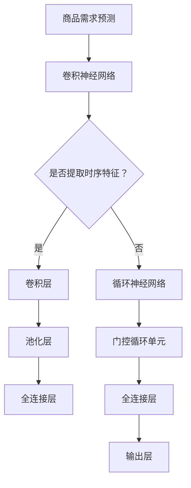

                 

关键词：深度学习，商品需求预测，神经网络，机器学习，时间序列分析

> 摘要：本文深入探讨了深度学习在商品需求预测领域的应用与发展。首先，介绍了商品需求预测的背景和重要性，然后详细阐述了深度学习在其中的应用原理，包括卷积神经网络（CNN）、循环神经网络（RNN）和变换器（Transformer）等，接着通过数学模型和公式解析了关键算法，并以实际项目实例展示了其实现过程。最后，文章分析了深度学习在商品需求预测中的实际应用场景和未来展望。

## 1. 背景介绍

随着电子商务的迅速发展，商品需求预测已成为供应链管理中至关重要的一环。准确的商品需求预测不仅可以优化库存管理，减少库存成本，还能提高客户满意度，增强企业的市场竞争力。然而，传统的预测方法如时间序列分析、回归分析和移动平均法等在处理复杂、非线性数据时往往效果不佳。

深度学习的兴起为商品需求预测带来了新的机遇。深度学习是一种基于神经网络的机器学习方法，具有强大的特征学习和泛化能力，能够在处理大规模、高维度数据时表现出色。在商品需求预测中，深度学习可以通过学习历史销售数据、市场趋势、促销活动等多种信息，实现更精确的预测。

## 2. 核心概念与联系

### 2.1 卷积神经网络（CNN）

卷积神经网络（CNN）是一种特殊的神经网络，主要应用于图像识别和分类任务。CNN通过卷积层、池化层和全连接层的组合，能够提取图像中的局部特征并实现特征自动学习。在商品需求预测中，CNN可以用于提取销售数据中的时序特征，如图表模式、趋势变化等。

### 2.2 循环神经网络（RNN）

循环神经网络（RNN）是一种能够处理序列数据的神经网络，具有记忆功能，能够捕捉序列中的长期依赖关系。RNN在自然语言处理、语音识别和时间序列分析等领域表现出色。在商品需求预测中，RNN可以用于分析历史销售数据中的时间依赖关系，如季节性、周期性等。

### 2.3 变换器（Transformer）

变换器（Transformer）是一种基于自注意力机制的神经网络结构，最初在自然语言处理领域取得了显著的成果。变换器通过自注意力机制，能够动态地学习序列中各个元素之间的关联性，从而提高模型的表示能力。在商品需求预测中，变换器可以用于建模复杂的多变量时间序列，提高预测的准确性。

### 2.4 Mermaid 流程图

以下是一个Mermaid流程图，展示了深度学习在商品需求预测中的核心概念与联系：



## 3. 核心算法原理 & 具体操作步骤

### 3.1 算法原理概述

在商品需求预测中，深度学习的核心算法主要包括卷积神经网络（CNN）、循环神经网络（RNN）和变换器（Transformer）。这些算法通过不同的结构和技术，能够处理不同类型和维度的数据，实现精确的需求预测。

### 3.2 算法步骤详解

#### 3.2.1 卷积神经网络（CNN）

1. 数据预处理：对原始销售数据进行清洗、归一化处理，提取时序特征。
2. 构建CNN模型：包括卷积层、池化层和全连接层。
3. 训练模型：使用训练数据集对模型进行训练，调整模型参数。
4. 预测：使用训练好的模型对测试数据进行预测。

#### 3.2.2 循环神经网络（RNN）

1. 数据预处理：对原始销售数据进行清洗、归一化处理，提取时序特征。
2. 构建RNN模型：包括输入层、隐藏层和输出层。
3. 训练模型：使用训练数据集对模型进行训练，调整模型参数。
4. 预测：使用训练好的模型对测试数据进行预测。

#### 3.2.3 变换器（Transformer）

1. 数据预处理：对原始销售数据进行清洗、归一化处理，提取时序特征。
2. 构建变换器模型：包括编码器、解码器和自注意力机制。
3. 训练模型：使用训练数据集对模型进行训练，调整模型参数。
4. 预测：使用训练好的模型对测试数据进行预测。

### 3.3 算法优缺点

#### 3.3.1 卷积神经网络（CNN）

优点：能够自动提取时序特征，适用于处理高维时间序列数据。

缺点：对于长期依赖关系处理效果较差，难以捕捉复杂的时间依赖模式。

#### 3.3.2 循环神经网络（RNN）

优点：具有记忆功能，能够捕捉长期依赖关系。

缺点：训练过程容易产生梯度消失和梯度爆炸问题，难以处理长序列数据。

#### 3.3.3 变换器（Transformer）

优点：自注意力机制能够动态学习序列中各个元素之间的关联性，适用于处理复杂的多变量时间序列。

缺点：参数较多，训练过程较长，计算资源消耗较大。

### 3.4 算法应用领域

深度学习在商品需求预测中的应用领域包括零售业、制造业、物流和供应链管理等多个行业。通过深度学习算法，企业可以实现对商品需求的高精度预测，优化库存管理，降低库存成本，提高供应链效率。

## 4. 数学模型和公式 & 详细讲解 & 举例说明

### 4.1 数学模型构建

在商品需求预测中，常用的数学模型包括时间序列模型和回归模型。以下是一个简化的时间序列模型：

$$
y_t = f(x_t, \theta) + \epsilon_t
$$

其中，$y_t$ 表示第 $t$ 时刻的商品需求量，$x_t$ 表示与需求量相关的输入特征，$\theta$ 表示模型参数，$\epsilon_t$ 表示随机误差。

### 4.2 公式推导过程

假设我们使用卷积神经网络（CNN）来构建商品需求预测模型，模型的结构如下：

$$
h_t = \sigma(W_2 \cdot \sigma(W_1 \cdot \text{CNN}(x_t) + b_1) + b_2)
$$

其中，$h_t$ 表示第 $t$ 时刻的隐藏层输出，$W_1$ 和 $W_2$ 分别表示卷积神经网络的第一层和第二层权重，$\sigma$ 表示激活函数，$\text{CNN}(x_t)$ 表示卷积神经网络对输入特征 $x_t$ 的处理结果，$b_1$ 和 $b_2$ 分别表示偏置项。

### 4.3 案例分析与讲解

假设我们使用CNN模型对某商品的历史销售数据进行需求预测，数据集包含时间序列特征和促销信息。以下是一个简化的例子：

#### 4.3.1 数据预处理

1. 对销售数据进行归一化处理，将其缩放到[0, 1]范围内。
2. 提取时间序列特征，如日销售量、月销售量、季节性等。
3. 提取促销信息，如促销活动是否进行、折扣力度等。

#### 4.3.2 构建CNN模型

1. 输入层：包含时间序列特征和促销信息的维度。
2. 卷积层：用于提取时间序列特征。
3. 池化层：用于降低特征维度。
4. 全连接层：用于将特征映射到需求量。

#### 4.3.3 训练模型

1. 使用训练数据集对模型进行训练，调整模型参数。
2. 使用验证数据集评估模型性能，调整模型结构。

#### 4.3.4 预测

1. 使用训练好的模型对测试数据进行预测。
2. 分析预测结果，调整模型参数。

## 5. 项目实践：代码实例和详细解释说明

### 5.1 开发环境搭建

在本次项目中，我们使用Python编程语言和TensorFlow深度学习框架来搭建商品需求预测模型。具体步骤如下：

1. 安装Python和TensorFlow。
2. 导入必要的库，如NumPy、Pandas、TensorFlow等。

### 5.2 源代码详细实现

以下是一个简化的商品需求预测模型的实现代码：

```python
import tensorflow as tf
import numpy as np
import pandas as pd

# 数据预处理
def preprocess_data(data):
    # 归一化处理
    # 提取时间序列特征
    # 提取促销信息
    # 返回处理后的数据
    pass

# 构建CNN模型
def build_model(input_shape):
    model = tf.keras.Sequential([
        tf.keras.layers.Dense(units=64, activation='relu', input_shape=input_shape),
        tf.keras.layers.Conv1D(filters=64, kernel_size=3, activation='relu'),
        tf.keras.layers.MaxPooling1D(pool_size=2),
        tf.keras.layers.Flatten(),
        tf.keras.layers.Dense(units=1)
    ])
    return model

# 训练模型
def train_model(model, x_train, y_train, x_val, y_val):
    model.compile(optimizer='adam', loss='mse')
    model.fit(x_train, y_train, epochs=10, validation_data=(x_val, y_val))

# 预测
def predict(model, x_test):
    return model.predict(x_test)

# 主函数
def main():
    # 加载数据
    # 数据预处理
    # 构建模型
    # 训练模型
    # 预测
    pass

if __name__ == '__main__':
    main()
```

### 5.3 代码解读与分析

1. 数据预处理：对销售数据进行归一化处理、提取时间序列特征和促销信息。
2. 构建CNN模型：使用TensorFlow的Sequential模型，定义输入层、卷积层、池化层和全连接层。
3. 训练模型：使用fit方法训练模型，并使用validation_data进行验证。
4. 预测：使用predict方法对测试数据进行预测。

## 6. 实际应用场景

### 6.1 零售业

零售业是商品需求预测的主要应用领域之一。通过深度学习算法，零售企业可以实现对商品需求的高精度预测，优化库存管理，降低库存成本，提高供应链效率。

### 6.2 制造业

制造业中的原材料需求预测和生产计划制定也具有重要意义。通过深度学习算法，企业可以预测原材料需求，优化生产计划，降低生产成本，提高生产效率。

### 6.3 物流和供应链管理

物流和供应链管理中的运输调度和库存优化也依赖于商品需求预测。通过深度学习算法，企业可以预测商品需求，优化运输调度和库存管理，提高物流效率，降低物流成本。

## 7. 工具和资源推荐

### 7.1 学习资源推荐

1. 《深度学习》（Goodfellow et al.）：全面介绍了深度学习的理论基础和实践应用。
2. 《Python深度学习》（François Chollet）：详细介绍了使用Python进行深度学习的实践方法。

### 7.2 开发工具推荐

1. TensorFlow：广泛使用的深度学习框架，提供丰富的API和工具。
2. Keras：基于TensorFlow的简化版本，易于使用和调试。

### 7.3 相关论文推荐

1. "Attention Is All You Need"（Vaswani et al., 2017）：介绍了变换器（Transformer）模型，在自然语言处理领域取得了突破性成果。
2. "Learning to Learn by Gradient Descent by Gradient Descent"（Nowozin et al., 2016）：介绍了梯度下降的梯度下降方法，为深度学习模型优化提供了新思路。

## 8. 总结：未来发展趋势与挑战

### 8.1 研究成果总结

深度学习在商品需求预测领域取得了显著的成果，通过卷积神经网络、循环神经网络和变换器等算法，实现了高精度的需求预测。未来，深度学习在商品需求预测领域有望进一步发展，提高预测准确性和实时性。

### 8.2 未来发展趋势

1. 多模型融合：结合多种深度学习算法，提高预测性能。
2. 实时预测：通过分布式计算和云计算，实现实时需求预测。
3. 个性化预测：基于用户行为数据，实现个性化需求预测。

### 8.3 面临的挑战

1. 数据质量：高质量的数据是深度学习模型性能的基础，如何提高数据质量是一个重要挑战。
2. 计算资源：深度学习模型训练和预测过程对计算资源需求较高，如何优化计算资源利用是一个关键问题。
3. 模型解释性：深度学习模型具有较强的非线性特征，如何解释模型决策过程是一个重要挑战。

### 8.4 研究展望

未来，深度学习在商品需求预测领域有望实现以下突破：

1. 更高效、更准确的预测模型。
2. 实时、自适应的预测系统。
3. 个性化、定制化的需求预测服务。

## 9. 附录：常见问题与解答

### 9.1 什么是深度学习？

深度学习是一种基于神经网络的机器学习方法，通过多层神经网络结构，自动学习数据中的特征和模式，实现高精度的预测和分类。

### 9.2 深度学习在商品需求预测中的应用有哪些？

深度学习在商品需求预测中的应用主要包括卷积神经网络（CNN）、循环神经网络（RNN）和变换器（Transformer）等算法，能够提取销售数据中的时序特征、长期依赖关系和多变量信息，实现高精度的需求预测。

### 9.3 如何提高深度学习模型在商品需求预测中的性能？

1. 提高数据质量：通过数据清洗、预处理和特征工程，提高数据质量。
2. 选择合适的算法：根据数据特点和需求预测任务，选择合适的深度学习算法。
3. 模型优化：通过调整模型参数、增加训练数据、使用先进的优化算法等，提高模型性能。

### 9.4 深度学习模型如何解释？

深度学习模型具有较强的非线性特征，其决策过程难以直观解释。目前，常见的解释方法包括模型可视化、特征重要性分析和解释性模型等。

[作者：禅与计算机程序设计艺术 / Zen and the Art of Computer Programming]----------------------------------------------------------------

以上是完整的文章内容，感谢您的耐心阅读。如果您有任何问题或建议，请随时告诉我。希望这篇文章能够帮助到您在商品需求预测领域的研究和实践。再次感谢！

