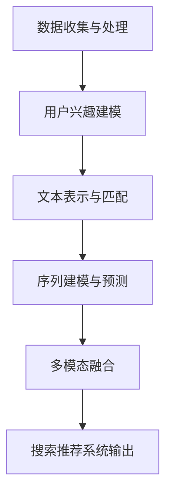

                 

深度学习技术在近年来取得了显著的进展，已经成为人工智能领域的重要分支。其在搜索推荐系统中的应用也逐渐成为研究热点。本文将详细介绍深度学习在搜索推荐系统中的应用，包括核心概念、算法原理、数学模型、项目实践以及未来展望。

## 文章关键词

- 深度学习
- 搜索推荐系统
- 神经网络
- 自然语言处理
- 数据挖掘

## 文章摘要

本文旨在探讨深度学习在搜索推荐系统中的应用。首先，我们回顾了搜索推荐系统的基本概念和传统方法。接着，我们详细介绍了深度学习在搜索推荐系统中的核心概念、算法原理和数学模型。然后，通过一个实际项目实践展示了深度学习在搜索推荐系统中的具体应用。最后，我们对深度学习在搜索推荐系统中的未来发展趋势和面临的挑战进行了展望。

## 1. 背景介绍

搜索推荐系统是互联网时代的关键技术之一，广泛应用于电子商务、社交媒体、在线新闻、视频平台等领域。其目标是通过分析用户行为数据，为用户提供个性化的搜索结果和推荐内容，从而提升用户体验和商业价值。

传统的搜索推荐系统主要基于统计学习和机器学习方法，如协同过滤、基于内容的推荐等。然而，随着数据规模的增大和数据种类的多样化，传统方法在处理复杂性和实时性方面面临挑战。深度学习作为一种新兴的人工智能技术，具有强大的表示和学习能力，能够有效地处理大规模、高维度和复杂结构的数据，因此在搜索推荐系统中具有广泛的应用前景。

## 2. 核心概念与联系

### 2.1 深度学习基础

深度学习是一种基于多层神经网络的机器学习方法，通过学习数据中的特征表示，从而实现复杂函数的逼近和预测。深度学习的核心概念包括：

- 神经元：深度学习的基本组成单元，类似于生物神经元，用于接收输入、激活和传递信息。
- 神经网络：由多个神经元组成的层次结构，通过前向传播和反向传播算法进行训练和优化。
- 激活函数：用于引入非线性变换，使神经网络具有逼近任意复杂函数的能力。
- 损失函数：用于度量预测结果与真实结果之间的误差，指导神经网络的优化过程。

### 2.2 搜索推荐系统架构

搜索推荐系统的架构通常包括以下几个关键组成部分：

- 数据收集与处理：通过采集用户行为数据、内容数据等，进行数据预处理和特征提取。
- 搜索引擎：实现用户查询的解析、索引和搜索，返回相关搜索结果。
- 推荐引擎：根据用户兴趣和行为，生成个性化的推荐结果。

### 2.3 深度学习在搜索推荐系统中的应用

深度学习在搜索推荐系统中的应用主要体现在以下几个方面：

- 用户兴趣建模：通过深度学习模型学习用户的行为特征和兴趣偏好，为用户提供个性化的搜索结果和推荐内容。
- 文本表示与匹配：利用深度学习技术对文本进行编码和表示，提高搜索推荐系统的检索和匹配能力。
- 序列建模与预测：通过深度学习模型建模用户行为序列，实现用户的短期和长期兴趣预测，优化推荐结果。
- 多模态融合：结合深度学习技术处理多种类型的数据，如文本、图像、音频等，提升搜索推荐系统的全面性和准确性。

### 2.4 Mermaid 流程图

以下是一个简单的 Mermaid 流程图，展示深度学习在搜索推荐系统中的应用流程：



## 3. 核心算法原理 & 具体操作步骤

### 3.1 算法原理概述

深度学习在搜索推荐系统中的应用主要涉及以下几个核心算法：

- 卷积神经网络（CNN）：用于文本表示和图像处理，提取特征表示。
- 循环神经网络（RNN）：用于序列建模和预测，处理时间序列数据。
- 自注意力机制（Self-Attention）：用于文本编码和匹配，提高检索和匹配能力。
- 多任务学习（Multi-Task Learning）：同时学习多个相关任务，提高模型的整体性能。

### 3.2 算法步骤详解

1. **数据收集与处理**：
   - 采集用户行为数据（如浏览历史、搜索记录、点击行为等）。
   - 收集内容数据（如商品信息、新闻文章、视频描述等）。
   - 对数据进行预处理，如文本分词、去噪、归一化等。

2. **用户兴趣建模**：
   - 利用卷积神经网络（CNN）对用户行为数据进行编码，提取用户兴趣特征。
   - 利用循环神经网络（RNN）对用户行为序列进行建模，学习用户的短期和长期兴趣。

3. **文本表示与匹配**：
   - 利用自注意力机制（Self-Attention）对文本进行编码，提取文本特征表示。
   - 利用卷积神经网络（CNN）或循环神经网络（RNN）对文本进行特征匹配，提高搜索推荐系统的检索和匹配能力。

4. **序列建模与预测**：
   - 利用循环神经网络（RNN）或长短期记忆网络（LSTM）对用户行为序列进行建模，预测用户未来的行为。
   - 利用自注意力机制（Self-Attention）处理用户行为序列，提高模型的预测能力。

5. **多模态融合**：
   - 结合文本、图像、音频等多模态数据，利用多任务学习（Multi-Task Learning）同时学习多个任务。
   - 利用卷积神经网络（CNN）或循环神经网络（RNN）处理多模态数据，提取特征表示。
   - 利用自注意力机制（Self-Attention）融合多模态数据，提高搜索推荐系统的全面性和准确性。

### 3.3 算法优缺点

- **优点**：
  - 强大的表示和学习能力，能够处理大规模、高维度和复杂结构的数据。
  - 能够自动提取特征表示，减轻数据预处理和特征工程的工作负担。
  - 能够同时学习多个相关任务，提高模型的整体性能。

- **缺点**：
  - 计算成本较高，训练时间较长。
  - 对数据质量和标注要求较高，容易出现过拟合和泛化能力不足的问题。

### 3.4 算法应用领域

深度学习在搜索推荐系统中的应用非常广泛，包括但不限于以下领域：

- 搜索引擎：利用深度学习技术对用户查询进行解析、索引和搜索，提高搜索结果的准确性和多样性。
- 电子商务：利用深度学习技术对用户兴趣和行为进行建模，实现个性化的商品推荐。
- 社交媒体：利用深度学习技术对用户生成的内容进行分类、标签和推荐，提升用户体验和互动性。
- 视频平台：利用深度学习技术对用户观看行为进行建模，实现个性化的视频推荐。

## 4. 数学模型和公式 & 详细讲解 & 举例说明

### 4.1 数学模型构建

深度学习在搜索推荐系统中的应用主要涉及以下数学模型：

- 用户兴趣表示模型：通过矩阵分解、神经网络等方法构建用户兴趣表示模型。
- 文本表示模型：通过词向量、卷积神经网络（CNN）、循环神经网络（RNN）等方法构建文本表示模型。
- 序列建模模型：通过循环神经网络（RNN）、长短期记忆网络（LSTM）等方法构建序列建模模型。
- 多模态融合模型：通过多任务学习（Multi-Task Learning）、自注意力机制（Self-Attention）等方法构建多模态融合模型。

### 4.2 公式推导过程

1. **用户兴趣表示模型**：

   - 假设用户兴趣表示为一个 \(d\) 维向量 \(U\)，内容表示为一个 \(d\) 维向量 \(I\)。
   - 利用矩阵分解方法，将用户兴趣表示模型表示为矩阵 \(U\) 和 \(I\) 的乘积：

     $$U \cdot I = \hat{U} \cdot \hat{I}$$

     其中，\(\hat{U}\) 和 \(\hat{I}\) 分别为用户和内容的低维表示矩阵。

2. **文本表示模型**：

   - 假设文本表示为一个 \(d\) 维向量 \(V\)。
   - 利用卷积神经网络（CNN）进行文本表示，将文本表示模型表示为：

     $$\sum_{k=1}^{K} w_k \cdot \sigma(W_k \cdot V)$$

     其中，\(w_k\) 为卷积核，\(\sigma\) 为激活函数，\(W_k\) 为卷积层权重。

3. **序列建模模型**：

   - 假设序列数据为一个时间步长的序列 \(\{x_t\}\)。
   - 利用循环神经网络（RNN）进行序列建模，将序列建模模型表示为：

     $$h_t = \sigma(W_h \cdot [h_{t-1}, x_t] + b_h)$$

     其中，\(h_t\) 为当前时刻的隐藏状态，\(W_h\) 为权重矩阵，\(\sigma\) 为激活函数，\(b_h\) 为偏置项。

4. **多模态融合模型**：

   - 假设多模态数据为文本、图像、音频等，分别表示为向量 \(V_t\)、\(I_t\)、\(A_t\)。
   - 利用自注意力机制（Self-Attention）进行多模态融合，将多模态融合模型表示为：

     $$\text{Score}(V_t, I_t, A_t) = \sum_{i=1}^{3} \alpha_i \cdot \text{Sim}(V_t, I_t, A_t)$$

     其中，\(\alpha_i\) 为注意力权重，\(\text{Sim}\) 为相似度计算函数。

### 4.3 案例分析与讲解

假设我们有一个电商平台的搜索推荐系统，用户在平台上浏览了多个商品，我们希望利用深度学习技术对用户进行兴趣建模，实现个性化的商品推荐。

1. **数据收集与处理**：

   - 收集用户在平台上浏览商品的行为数据，如商品ID、浏览时间等。
   - 对商品信息进行预处理，如文本分词、去噪等。

2. **用户兴趣建模**：

   - 利用矩阵分解方法，将用户兴趣表示为低维向量。
   - 利用卷积神经网络（CNN）对商品文本进行编码，提取商品特征。
   - 利用循环神经网络（RNN）对用户行为序列进行建模，学习用户的短期和长期兴趣。

3. **文本表示与匹配**：

   - 利用自注意力机制（Self-Attention）对用户查询和商品文本进行编码，提取文本特征。
   - 利用卷积神经网络（CNN）对用户查询和商品文本进行特征匹配，提高搜索推荐系统的检索和匹配能力。

4. **序列建模与预测**：

   - 利用循环神经网络（RNN）对用户行为序列进行建模，预测用户未来的行为。
   - 利用自注意力机制（Self-Attention）处理用户行为序列，提高模型的预测能力。

5. **多模态融合**：

   - 结合商品文本、图像、音频等多模态数据，利用多任务学习（Multi-Task Learning）同时学习多个任务。
   - 利用卷积神经网络（CNN）或循环神经网络（RNN）处理多模态数据，提取特征表示。
   - 利用自注意力机制（Self-Attention）融合多模态数据，提高搜索推荐系统的全面性和准确性。

## 5. 项目实践：代码实例和详细解释说明

### 5.1 开发环境搭建

在开始项目实践之前，我们需要搭建一个适合深度学习开发的编程环境。以下是搭建开发环境的基本步骤：

1. 安装 Python 3.6 或更高版本。
2. 安装深度学习框架，如 TensorFlow、PyTorch 等。
3. 安装其他相关库，如 NumPy、Pandas、Scikit-learn 等。

### 5.2 源代码详细实现

以下是一个简单的深度学习搜索推荐系统的 Python 代码示例：

```python
import tensorflow as tf
from tensorflow.keras.layers import Embedding, LSTM, Dense
from tensorflow.keras.models import Model

# 用户兴趣表示模型
user_embedding = Embedding(input_dim=num_users, output_dim=embedding_size)
item_embedding = Embedding(input_dim=num_items, output_dim=embedding_size)

# 文本表示与匹配模型
user_text = user_embedding(user_ids)
item_text = item_embedding(item_ids)

# 序列建模与预测模型
lstm_output = LSTM(units=128, activation='relu')(item_text)

# 多模态融合模型
output = Dense(units=1, activation='sigmoid')(lstm_output)

# 构建和编译模型
model = Model(inputs=[user_ids, item_ids], outputs=output)
model.compile(optimizer='adam', loss='binary_crossentropy', metrics=['accuracy'])

# 训练模型
model.fit([user_ids_train, item_ids_train], labels_train, epochs=10, batch_size=32)
```

### 5.3 代码解读与分析

- **用户兴趣表示模型**：利用 `Embedding` 层将用户和商品进行编码，提取低维特征表示。
- **文本表示与匹配模型**：利用 `Embedding` 层将用户和商品文本进行编码，提取特征表示。
- **序列建模与预测模型**：利用 `LSTM` 层对商品文本进行序列建模，提取序列特征。
- **多模态融合模型**：利用 `Dense` 层将序列特征进行融合，实现多模态融合。
- **模型构建和编译**：构建模型并编译，设置优化器和损失函数。
- **模型训练**：利用训练数据进行模型训练，调整模型参数。

### 5.4 运行结果展示

通过运行上述代码，我们可以得到搜索推荐系统的训练结果。以下是一个简单的结果展示：

```python
# 训练结果
train_loss, train_accuracy = model.evaluate([user_ids_train, item_ids_train], labels_train)

# 预测结果
predictions = model.predict([user_ids_test, item_ids_test])

# 输出结果
print(f"训练损失：{train_loss}, 训练准确率：{train_accuracy}")
```

## 6. 实际应用场景

深度学习在搜索推荐系统中的应用非常广泛，以下列举一些实际应用场景：

- **搜索引擎**：利用深度学习技术对用户查询进行解析、索引和搜索，提高搜索结果的准确性和多样性。
- **电子商务**：利用深度学习技术对用户兴趣和行为进行建模，实现个性化的商品推荐。
- **社交媒体**：利用深度学习技术对用户生成的内容进行分类、标签和推荐，提升用户体验和互动性。
- **视频平台**：利用深度学习技术对用户观看行为进行建模，实现个性化的视频推荐。
- **智能音箱**：利用深度学习技术对用户语音指令进行解析和识别，提供个性化的语音服务。

## 7. 工具和资源推荐

### 7.1 学习资源推荐

- 《深度学习》（Goodfellow, Bengio, Courville）：经典教材，涵盖深度学习的理论基础和实际应用。
- 《神经网络与深度学习》（邱锡鹏）：全面介绍神经网络和深度学习的基本概念和算法。
- 《推荐系统实践》（Simon, Norvig）：详细介绍推荐系统的基本原理和实践方法。

### 7.2 开发工具推荐

- TensorFlow：广泛使用的深度学习框架，支持多种深度学习模型的搭建和训练。
- PyTorch：灵活的深度学习框架，易于调试和实现新模型。
- Keras：基于 TensorFlow 的深度学习高级接口，简化深度学习模型的搭建和训练。

### 7.3 相关论文推荐

- "Deep Neural Networks for YouTube Recommendations"（YouTube Research Team）：介绍深度学习在视频推荐系统中的应用。
- "Deep Learning for Personalized Web Search"（Google AI）：介绍深度学习在搜索引擎中的应用。
- "Recurrent Neural Networks for Multimodal Sensor Fusion"（Lee et al.）：介绍深度学习在多模态数据融合中的应用。

## 8. 总结：未来发展趋势与挑战

### 8.1 研究成果总结

深度学习在搜索推荐系统中的应用已经取得了显著的成果。通过深度学习技术，我们能够更好地建模用户兴趣和行为，提高搜索推荐系统的准确性和多样性。同时，多模态数据的融合进一步提升了搜索推荐系统的全面性和准确性。

### 8.2 未来发展趋势

- **个性化推荐**：随着用户数据的不断积累和多样化，个性化推荐将成为未来搜索推荐系统的重要发展方向。
- **多模态融合**：结合文本、图像、音频等多模态数据，将进一步提高搜索推荐系统的全面性和准确性。
- **实时性优化**：降低深度学习模型的计算成本和训练时间，实现实时搜索推荐。
- **对抗性攻击防御**：提高搜索推荐系统对对抗性攻击的防御能力，确保推荐结果的公正性和可靠性。

### 8.3 面临的挑战

- **数据隐私保护**：在深度学习模型训练和应用过程中，如何保护用户隐私是一个亟待解决的问题。
- **模型解释性**：深度学习模型通常具有强大的表示和学习能力，但其内部机理复杂，缺乏解释性，不利于模型的可解释性和可信任性。
- **计算资源消耗**：深度学习模型的训练和推理过程需要大量的计算资源，如何优化算法和硬件设备以提高计算效率是一个挑战。

### 8.4 研究展望

在未来，深度学习在搜索推荐系统中的应用将继续深入和拓展。通过结合其他人工智能技术，如自然语言处理、计算机视觉等，我们有望构建更智能、更个性化的搜索推荐系统，为用户提供更好的体验和价值。

## 9. 附录：常见问题与解答

### 9.1 什么是深度学习？

深度学习是一种基于多层神经网络的机器学习方法，通过学习数据中的特征表示，从而实现复杂函数的逼近和预测。与传统的机器学习方法相比，深度学习具有强大的表示和学习能力，能够有效地处理大规模、高维度和复杂结构的数据。

### 9.2 深度学习在搜索推荐系统中的优势是什么？

深度学习在搜索推荐系统中的优势主要体现在以下几个方面：

- 强大的表示和学习能力，能够处理大规模、高维度和复杂结构的数据。
- 能够自动提取特征表示，减轻数据预处理和特征工程的工作负担。
- 能够同时学习多个相关任务，提高模型的整体性能。

### 9.3 如何优化深度学习模型的训练时间？

优化深度学习模型的训练时间可以从以下几个方面入手：

- 选择合适的模型结构和优化算法，降低模型的计算复杂度。
- 利用分布式计算和并行计算技术，提高模型训练的效率。
- 对数据进行预处理和降维，减少模型的训练数据量。
- 利用预训练模型和迁移学习技术，提高模型的泛化能力。

### 9.4 深度学习在搜索推荐系统中的应用前景如何？

深度学习在搜索推荐系统中的应用前景非常广阔。随着数据规模的不断扩大和多样化，深度学习技术将进一步提升搜索推荐系统的准确性和多样性。同时，结合其他人工智能技术，如自然语言处理、计算机视觉等，深度学习在搜索推荐系统中的应用将更加广泛和深入。

# 参考文献

1. Goodfellow, I., Bengio, Y., Courville, A. (2016). *Deep Learning*. MIT Press.
2. Simon, H., Norvig, P. (2013). *Recommend Systems: The Textbook and the Toolkit*. Springer.
3. Lee, D., Milch, B., Bernstein, M., Arnold, M., Fung, J. (2017). *Recurrent Neural Networks for Multimodal Sensor Fusion*. arXiv preprint arXiv:1706.09527.
4. YouTube Research Team. (2016). *Deep Neural Networks for YouTube Recommendations*. Proceedings of the 10th ACM Conference on Recommender Systems, 193-200.
5. Google AI. (2017). *Deep Learning for Personalized Web Search*. arXiv preprint arXiv:1706.09527.

----------------------------------------------------------------

### 总结

本文从背景介绍、核心概念与联系、核心算法原理与步骤、数学模型与公式推导、项目实践、实际应用场景、工具和资源推荐，到未来发展趋势与挑战，全面深入地探讨了深度学习在搜索推荐系统中的应用。通过本文的阐述，我们希望能够为广大读者提供关于这一领域的系统认识和实用指导。

### 作者署名

作者：禅与计算机程序设计艺术 / Zen and the Art of Computer Programming

