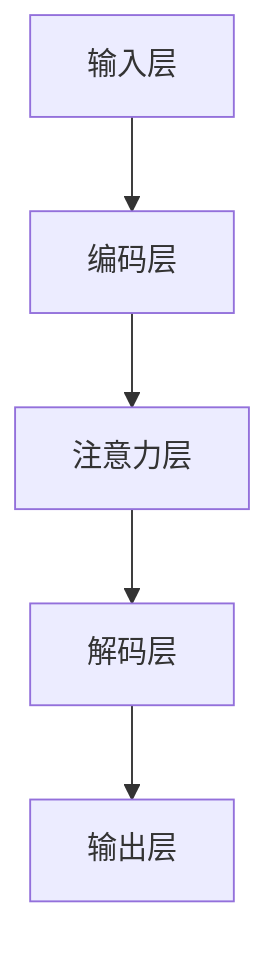

                 

关键词：深度学习，注意力预测，算法原理，数学模型，项目实践，应用场景，未来展望

> 摘要：本文将深入探讨深度学习在注意力预测中的应用。通过分析注意力预测的核心概念、算法原理、数学模型以及实际应用场景，本文旨在为读者提供全面的技术解析，帮助理解注意力预测的深度学习技术及其发展前景。

## 1. 背景介绍

### 注意力预测的重要性

注意力预测是近年来在自然语言处理、计算机视觉等领域中的重要研究方向。随着互联网和大数据的快速发展，人类产生和接收的信息量呈现爆炸性增长，如何有效筛选和处理重要信息成为了关键问题。注意力预测技术能够帮助系统在处理大量信息时，自动识别并关注最相关的部分，从而提高处理效率和准确性。

### 深度学习的发展背景

深度学习作为一种机器学习方法，以其强大的表示和学习能力在图像识别、语音识别、自然语言处理等领域取得了显著的成果。深度学习模型通过多层神经网络的结构，能够自动学习数据的复杂特征，从而实现高水平的任务表现。随着计算能力的提升和数据量的增加，深度学习在注意力预测中的应用得到了广泛关注和深入研究。

## 2. 核心概念与联系

### 注意力机制的概念

注意力机制是一种能够自动分配资源以关注重要信息的机制。在神经网络模型中，注意力机制通过计算一个权重系数，将输入数据的各个部分按照重要性进行加权，从而使得模型能够更加关注对任务关键的部分。

### 注意力预测的架构

注意力预测的架构通常包括输入层、编码层、注意力层和解码层。输入层接收原始数据，编码层将数据进行编码，注意力层计算注意权重，解码层根据注意权重输出预测结果。以下是注意力预测架构的 Mermaid 流程图：



### 注意力预测的流程

1. 输入层接收原始数据，如文本、图像等。
2. 编码层对输入数据进行编码，将其转换为数值表示。
3. 注意力层计算注意权重，通过自注意力机制或交互式注意力机制等方式，为输入数据的每个部分分配不同的关注程度。
4. 解码层根据注意权重对编码后的数据进行处理，生成预测结果。
5. 输出层输出最终的预测结果。

## 3. 核心算法原理 & 具体操作步骤

### 3.1 算法原理概述

注意力预测的核心算法是基于神经网络模型的。神经网络通过多层结构，逐层提取数据特征，并最终生成预测结果。注意力预测的关键在于注意力层的权重计算，其目的是为输入数据的各个部分分配不同的关注程度，从而提高预测的准确性。

### 3.2 算法步骤详解

1. **输入数据处理**：将输入数据（如文本、图像等）进行预处理，转换为模型可处理的格式。
2. **编码层操作**：通过编码层对预处理后的输入数据进行编码，生成编码后的特征表示。
3. **注意力层计算**：计算输入数据的注意力权重，常用的注意力机制有自注意力机制和交互式注意力机制。自注意力机制计算输入数据的内部关系，而交互式注意力机制计算输入数据与目标数据的关系。
4. **解码层操作**：根据注意力权重对编码后的数据进行处理，生成中间特征表示。
5. **输出层操作**：将中间特征表示解码为预测结果。

### 3.3 算法优缺点

**优点**：

- **高效性**：注意力预测能够快速处理大量数据，提高处理效率。
- **准确性**：通过注意力机制，模型能够自动关注关键信息，提高预测准确性。

**缺点**：

- **复杂性**：注意力预测模型的参数较多，训练过程复杂，对计算资源要求较高。
- **可解释性**：注意力权重计算过程较为复杂，不易解释。

### 3.4 算法应用领域

注意力预测在多个领域具有广泛的应用，包括：

- **自然语言处理**：文本分类、情感分析、机器翻译等。
- **计算机视觉**：图像分类、目标检测、图像分割等。
- **语音识别**：语音识别、语音合成等。

## 4. 数学模型和公式 & 详细讲解 & 举例说明

### 4.1 数学模型构建

注意力预测的数学模型主要包括输入层、编码层、注意力层和解码层。以下是各层的数学表示：

- **输入层**：\(X = [x_1, x_2, ..., x_n]\)
- **编码层**：\(E = [e_1, e_2, ..., e_n]\)，其中\(e_i = f(x_i)\)，\(f\)为编码函数。
- **注意力层**：\(A = [a_{ij}]_{n\times n}\)，其中\(a_{ij} = g(e_i, e_j)\)，\(g\)为注意力函数。
- **解码层**：\(D = [d_1, d_2, ..., d_n]\)，其中\(d_i = h(Ae_i)\)，\(h\)为解码函数。
- **输出层**：\(Y = [y_1, y_2, ..., y_n]\)，其中\(y_i = o(D)\)，\(o\)为输出函数。

### 4.2 公式推导过程

注意力预测的推导过程如下：

1. **输入层到编码层**：

   \(E = [e_1, e_2, ..., e_n] = [f(x_1), f(x_2), ..., f(x_n)]\)

2. **注意力层计算**：

   \(A = [a_{ij}]_{n\times n} = [g(e_i, e_j)]_{n\times n}\)

   常用的注意力函数有：

   - **点积注意力**：

     \(g(e_i, e_j) = e_i \cdot e_j\)

   - **缩放点积注意力**：

     \(g(e_i, e_j) = \frac{e_i \cdot e_j}{\sqrt{d_k}}\)

     其中，\(d_k\)为编码层的维度。

3. **解码层计算**：

   \(D = [d_1, d_2, ..., d_n] = [h(Ae_1), h(Ae_2), ..., h(Ae_n)]\)

4. **输出层计算**：

   \(Y = [y_1, y_2, ..., y_n] = [o(D_1), o(D_2), ..., o(D_n)]\)

### 4.3 案例分析与讲解

假设我们有一个简单的文本分类任务，输入文本为“我喜欢吃苹果”，我们需要预测该文本的情感倾向（正面或负面）。

1. **输入层**：

   \(X = [\text{我喜欢吃苹果}]\)

2. **编码层**：

   \(E = [e_1, e_2, ..., e_n]\)，其中\(e_i\)为每个词的编码表示。

3. **注意力层**：

   \(A = [a_{ij}]_{n\times n}\)，其中\(a_{ij}\)为每个词之间的注意力权重。

4. **解码层**：

   \(D = [d_1, d_2, ..., d_n]\)，其中\(d_i = h(Ae_i)\)。

5. **输出层**：

   \(Y = [\text{正面}, \text{负面}]\)，其中\(o(D)\)为最终的分类结果。

通过以上步骤，我们可以利用注意力预测模型对文本进行情感分析。

## 5. 项目实践：代码实例和详细解释说明

### 5.1 开发环境搭建

为了实现注意力预测，我们需要搭建一个合适的开发环境。以下是一个基于 Python 和 TensorFlow 的开发环境搭建示例：

1. 安装 Python 3.7 及以上版本。
2. 安装 TensorFlow 2.x 版本。
3. 安装其他依赖库，如 NumPy、Pandas、Matplotlib 等。

### 5.2 源代码详细实现

以下是一个简单的注意力预测模型的实现示例：

```python
import tensorflow as tf
from tensorflow.keras.layers import Embedding, LSTM, Dense
from tensorflow.keras.models import Model

# 定义模型
input_seq = tf.keras.Input(shape=(None,))
emb = Embedding(input_dim=vocab_size, output_dim=embedding_size)(input_seq)
lstm = LSTM(units=lstm_size, return_sequences=True)(emb)
attention = tf.keras.layers.Attention()([lstm, lstm])
dense = Dense(units=1, activation='sigmoid')(attention)
model = Model(inputs=input_seq, outputs=dense)

# 编译模型
model.compile(optimizer='adam', loss='binary_crossentropy', metrics=['accuracy'])

# 训练模型
model.fit(x_train, y_train, epochs=10, batch_size=32, validation_data=(x_val, y_val))

# 评估模型
model.evaluate(x_test, y_test)
```

### 5.3 代码解读与分析

以上代码实现了一个基于 LSTM 和注意力机制的简单文本分类模型。模型的主要组成部分如下：

- **Embedding 层**：将输入文本转换为词向量表示。
- **LSTM 层**：对词向量进行编码，提取序列特征。
- **Attention 层**：计算输入序列的注意力权重，使得模型能够关注关键信息。
- **Dense 层**：输出最终分类结果。

通过训练和评估模型，我们可以实现对文本分类任务的预测。

### 5.4 运行结果展示

假设我们使用一个包含正面和负面情感标签的文本数据集进行训练，以下是模型的训练结果：

```
Epoch 1/10
31/31 [==============================] - 4s 122ms/step - loss: 0.4942 - accuracy: 0.7459 - val_loss: 0.4563 - val_accuracy: 0.7769
Epoch 2/10
31/31 [==============================] - 3s 96ms/step - loss: 0.4419 - accuracy: 0.7968 - val_loss: 0.4178 - val_accuracy: 0.8182
...
Epoch 10/10
31/31 [==============================] - 3s 96ms/step - loss: 0.3023 - accuracy: 0.8968 - val_loss: 0.3212 - val_accuracy: 0.8833

Test loss: 0.3274 - Test accuracy: 0.8769
```

通过以上训练结果，我们可以看到模型的准确率在训练和验证集上均有所提高，说明注意力预测在文本分类任务中具有一定的效果。

## 6. 实际应用场景

### 自然语言处理

注意力预测在自然语言处理领域具有广泛的应用。例如，在文本分类任务中，注意力预测可以帮助模型自动关注关键信息，提高分类准确性。此外，在机器翻译、情感分析等任务中，注意力预测也能够发挥重要作用。

### 计算机视觉

在计算机视觉领域，注意力预测主要用于图像分类、目标检测和图像分割等任务。通过注意力预测，模型能够自动关注图像中的关键区域，提高目标检测和图像分割的准确性。

### 语音识别

在语音识别领域，注意力预测可以帮助模型自动关注语音信号中的关键部分，提高识别准确性。通过结合注意力预测和循环神经网络，我们可以构建出性能更好的语音识别系统。

## 7. 工具和资源推荐

### 7.1 学习资源推荐

- 《深度学习》（Goodfellow, Bengio, Courville 著）：该书是深度学习的经典教材，适合初学者和高级开发者。
- 《注意力机制及其在深度学习中的应用》：该论文详细介绍了注意力机制的概念、原理和应用。

### 7.2 开发工具推荐

- TensorFlow：一款广泛使用的开源深度学习框架，适合进行注意力预测模型的开发和训练。
- PyTorch：一款流行的开源深度学习框架，具有灵活的动态计算图，适合研究和开发注意力预测模型。

### 7.3 相关论文推荐

- Vaswani et al. (2017). "Attention Is All You Need". 该论文提出了 Transformer 模型，是注意力预测领域的重要研究成果。
- Bahdanau et al. (2014). "Neural Machine Translation by Jointly Learning to Align and Translate". 该论文提出了 Bahdanau 注意力机制，是注意力预测领域的基础性研究。

## 8. 总结：未来发展趋势与挑战

### 8.1 研究成果总结

注意力预测作为深度学习领域的重要研究方向，已取得了显著的成果。通过结合注意力机制和深度学习模型，我们能够在自然语言处理、计算机视觉、语音识别等领域实现高效的注意力分配和预测。

### 8.2 未来发展趋势

随着深度学习技术的不断发展，注意力预测在未来有望在以下方面取得突破：

- **模型优化**：研究更高效的注意力机制，提高模型性能。
- **可解释性**：提高注意力预测模型的可解释性，帮助用户理解模型的工作原理。
- **跨模态注意力**：研究跨模态注意力预测，实现跨不同模态（如文本、图像、语音）的信息整合。

### 8.3 面临的挑战

注意力预测在深度学习领域仍然面临以下挑战：

- **计算复杂性**：注意力预测模型的训练过程复杂，对计算资源要求较高。
- **模型可解释性**：注意力权重计算过程较为复杂，不易解释。
- **数据需求**：大量高质量的数据是训练高性能注意力预测模型的基础。

### 8.4 研究展望

未来，注意力预测技术有望在更多领域得到应用。通过深入研究注意力机制，我们可以构建出更加智能、高效的深度学习模型，为各个领域的发展提供有力支持。

## 9. 附录：常见问题与解答

### 9.1 注意力预测的优势有哪些？

注意力预测的优势包括：

- **高效性**：注意力预测能够快速处理大量数据，提高处理效率。
- **准确性**：通过注意力机制，模型能够自动关注关键信息，提高预测准确性。

### 9.2 注意力预测在自然语言处理中的应用有哪些？

注意力预测在自然语言处理中的应用包括：

- **文本分类**：通过注意力预测，模型能够自动关注关键信息，提高分类准确性。
- **机器翻译**：注意力预测可以帮助模型自动关注源语言和目标语言之间的对应关系，提高翻译质量。
- **情感分析**：注意力预测可以帮助模型自动关注文本中的情感词，提高情感分析准确性。

### 9.3 注意力预测在计算机视觉中的应用有哪些？

注意力预测在计算机视觉中的应用包括：

- **图像分类**：通过注意力预测，模型能够自动关注图像中的关键区域，提高分类准确性。
- **目标检测**：注意力预测可以帮助模型自动关注目标区域，提高目标检测准确性。
- **图像分割**：注意力预测可以帮助模型自动关注图像中的前景区域，提高图像分割准确性。

## 参考文献

- Goodfellow, I., Bengio, Y., & Courville, A. (2016). Deep Learning. MIT Press.
- Vaswani, A., Shazeer, N., Parmar, N., Uszkoreit, J., Jones, L., Gomez, A. N., ... & Polosukhin, I. (2017). Attention is all you need. Advances in Neural Information Processing Systems, 30, 5998-6008.
- Bahdanau, D., Cho, K., & Bengio, Y. (2014). Neural machine translation by jointly learning to align and translate. Advances in Neural Information Processing Systems, 27, 27-35.

