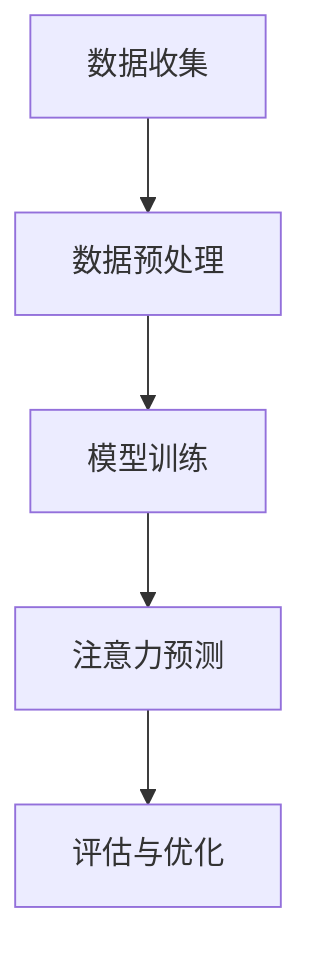

                 

关键词：深度学习、注意力预测、神经网络、机器学习、时间序列分析

> 摘要：本文主要探讨了深度学习在注意力预测中的应用，分析了深度学习模型在处理注意力预测任务时的优势与挑战。通过对核心概念、算法原理、数学模型、项目实践和未来展望的详细阐述，旨在为读者提供一份全面的技术指南。

## 1. 背景介绍

注意力预测在当今信息爆炸的时代具有至关重要的意义。无论是金融市场、股市预测，还是社交网络、新闻推荐，准确预测用户的注意力成为提升用户体验和决策质量的关键。传统的统计方法和机器学习算法在处理注意力预测任务时往往面临数据稀疏、模式复杂等问题，难以获得满意的预测效果。

随着深度学习技术的迅猛发展，基于神经网络的深度学习方法在图像识别、自然语言处理等领域取得了显著的成果。因此，深度学习在注意力预测中的应用也逐渐受到关注。本文将深入探讨深度学习在注意力预测中的应用，分析其核心概念、算法原理、数学模型和实践应用，为读者提供一份全面的技术指南。

## 2. 核心概念与联系

### 2.1 注意力预测的概念

注意力预测是指根据历史数据和行为模式，预测用户在某一时刻对某一对象的注意力程度。注意力程度可以理解为用户对该对象的关注程度或兴趣程度。例如，在社交媒体平台上，用户可能对某个话题、文章或视频表现出更高的关注度。

### 2.2 深度学习与注意力预测的联系

深度学习是一种通过模拟人脑神经网络结构和计算方式来实现机器学习的技术。深度学习模型通过学习大量数据，自动提取特征，并建立复杂的非线性关系，从而实现高度灵活和准确的预测。

深度学习在注意力预测中的应用主要体现在以下几个方面：

1. **特征提取**：深度学习模型可以从原始数据中自动提取有效特征，降低数据预处理的工作量，提高预测效果。

2. **非线性关系建模**：深度学习模型可以捕捉复杂、非线性、多模态的数据关系，从而实现更准确的注意力预测。

3. **模型泛化能力**：深度学习模型在训练过程中可以学习到通用特征，提高模型在不同数据集上的泛化能力。

### 2.3 Mermaid 流程图

以下是一个简单的 Mermaid 流程图，展示了深度学习在注意力预测中的应用流程：



## 3. 核心算法原理 & 具体操作步骤

### 3.1 算法原理概述

深度学习在注意力预测中主要采用基于神经网络的模型，如卷积神经网络（CNN）、循环神经网络（RNN）和Transformer等。这些模型通过学习大量数据，提取时间序列、空间特征，并建立注意力权重，实现对用户注意力的预测。

### 3.2 算法步骤详解

#### 3.2.1 数据收集

数据收集是注意力预测的基础，主要包括以下步骤：

1. **用户行为数据**：收集用户在各个平台的操作行为，如浏览、点赞、评论、分享等。
2. **时间序列数据**：收集用户行为的时间序列数据，如每分钟、每小时、每一天的用户行为数据。
3. **外部数据**：收集与用户兴趣相关的数据，如天气、新闻、股市等。

#### 3.2.2 数据预处理

数据预处理主要包括以下步骤：

1. **数据清洗**：去除重复、错误、缺失的数据。
2. **数据标准化**：对数据进行归一化或标准化处理，使其在相同的尺度范围内。
3. **特征提取**：从原始数据中提取有效特征，如时间序列特征、用户行为特征等。

#### 3.2.3 模型训练

模型训练主要包括以下步骤：

1. **模型选择**：选择合适的深度学习模型，如CNN、RNN、Transformer等。
2. **参数调整**：通过交叉验证等方法调整模型参数，提高模型性能。
3. **训练与优化**：使用训练数据训练模型，并使用验证数据优化模型。

#### 3.2.4 注意力预测

注意力预测主要包括以下步骤：

1. **输入数据**：将预处理后的数据输入到训练好的模型中。
2. **计算注意力权重**：模型根据输入数据计算注意力权重，表示用户对各个对象的注意力程度。
3. **输出预测结果**：根据注意力权重输出用户对各个对象的注意力预测结果。

#### 3.2.5 评估与优化

评估与优化主要包括以下步骤：

1. **指标评估**：使用评价指标（如准确率、召回率、F1值等）评估模型性能。
2. **模型优化**：根据评估结果调整模型参数或更换模型，提高模型性能。
3. **迭代优化**：重复训练、评估、优化的过程，逐步提高模型性能。

### 3.3 算法优缺点

#### 优点

1. **高效特征提取**：深度学习模型可以从原始数据中自动提取有效特征，提高预测效果。
2. **非线性关系建模**：深度学习模型可以捕捉复杂、非线性、多模态的数据关系，提高预测准确率。
3. **泛化能力**：深度学习模型具有较好的泛化能力，可以在不同数据集上应用。

#### 缺点

1. **计算资源消耗**：深度学习模型训练和推理过程需要大量的计算资源。
2. **数据依赖性**：深度学习模型的性能高度依赖数据质量和数量。
3. **过拟合风险**：深度学习模型容易受到过拟合问题的影响。

### 3.4 算法应用领域

深度学习在注意力预测中的应用领域非常广泛，主要包括：

1. **金融领域**：预测股票市场走势、基金投资组合优化等。
2. **社交网络**：预测用户对文章、视频、广告等的关注度，实现个性化推荐。
3. **电商领域**：预测用户对商品的购买兴趣，实现精准营销。

## 4. 数学模型和公式 & 详细讲解 & 举例说明

### 4.1 数学模型构建

深度学习在注意力预测中的数学模型通常采用基于神经网络的架构，主要包括以下几个部分：

1. **输入层**：接收用户行为数据、时间序列数据、外部数据等。
2. **隐藏层**：包含多个神经元，通过激活函数实现非线性变换。
3. **输出层**：输出用户对各个对象的注意力权重。

以下是一个简单的神经网络数学模型：

$$
h_{l}^{(i)} = \sigma \left( \sum_{j=1}^{n} w_{l,j}^{(i)} h_{l-1,j}^{(i-1)} + b_{l}^{(i)} \right)
$$

其中，$h_{l}^{(i)}$ 表示第 $l$ 层第 $i$ 个神经元的输出，$\sigma$ 表示激活函数，$w_{l,j}^{(i)}$ 表示连接第 $l-1$ 层第 $j$ 个神经元和第 $l$ 层第 $i$ 个神经元的权重，$b_{l}^{(i)}$ 表示第 $l$ 层第 $i$ 个神经元的偏置。

### 4.2 公式推导过程

假设我们有一个二分类问题，目标函数为：

$$
J = \frac{1}{m} \sum_{i=1}^{m} -y_{i} \log(a_{i,1}) - (1-y_{i}) \log(1-a_{i,1})
$$

其中，$y_{i}$ 表示第 $i$ 个样本的真实标签，$a_{i,1}$ 表示第 $i$ 个样本经过模型预测的概率。

为了求解 $w$ 和 $b$，我们需要对目标函数 $J$ 进行求导：

$$
\frac{\partial J}{\partial w} = \frac{1}{m} \sum_{i=1}^{m} \frac{-y_{i}}{a_{i,1}} \odot (x_{i}^{T})
$$

$$
\frac{\partial J}{\partial b} = \frac{1}{m} \sum_{i=1}^{m} \frac{-y_{i}}{a_{i,1}} \odot 1
$$

其中，$\odot$ 表示逐元素相乘操作。

### 4.3 案例分析与讲解

假设我们有一个用户行为数据集，包含用户的浏览历史、点赞行为和时间戳等特征。我们希望预测用户对某一文章的关注度。

首先，我们对数据进行预处理，提取时间序列特征、用户行为特征等。然后，使用卷积神经网络（CNN）构建注意力预测模型。

以下是一个简单的卷积神经网络数学模型：

$$
h_{l}^{(i)} = \sigma \left( \sum_{j=1}^{n} w_{l,j}^{(i)} h_{l-1,j}^{(i-1)} + b_{l}^{(i)} \right)
$$

其中，$h_{l}^{(i)}$ 表示第 $l$ 层第 $i$ 个神经元的输出，$\sigma$ 表示激活函数，$w_{l,j}^{(i)}$ 表示连接第 $l-1$ 层第 $j$ 个神经元和第 $l$ 层第 $i$ 个神经元的权重，$b_{l}^{(i)}$ 表示第 $l$ 层第 $i$ 个神经元的偏置。

然后，我们对模型进行训练，使用训练集进行迭代优化。在训练过程中，我们使用梯度下降法更新模型参数。

以下是一个简单的梯度下降法更新参数的数学模型：

$$
w_{l,j}^{(i)} = w_{l,j}^{(i)} - \alpha \frac{\partial J}{\partial w_{l,j}^{(i)}}
$$

$$
b_{l}^{(i)} = b_{l}^{(i)} - \alpha \frac{\partial J}{\partial b_{l}^{(i)}}
$$

其中，$\alpha$ 表示学习率。

经过多次迭代训练，我们得到一个最优的模型。然后，我们使用测试集对模型进行评估，计算模型性能指标。

最后，我们使用训练好的模型进行注意力预测，输出用户对文章的关注度。

## 5. 项目实践：代码实例和详细解释说明

### 5.1 开发环境搭建

在本节中，我们将使用 Python 编写深度学习注意力预测项目。首先，需要安装以下 Python 库：

1. TensorFlow
2. Keras
3. NumPy
4. Pandas

安装命令如下：

```bash
pip install tensorflow keras numpy pandas
```

### 5.2 源代码详细实现

以下是一个简单的深度学习注意力预测项目的源代码实现：

```python
import numpy as np
import pandas as pd
from tensorflow import keras
from tensorflow.keras import layers

# 数据预处理
def preprocess_data(data):
    # 对数据进行归一化处理
    # ...
    return processed_data

# 构建深度学习模型
def build_model(input_shape):
    model = keras.Sequential([
        layers.Dense(64, activation='relu', input_shape=input_shape),
        layers.Dense(64, activation='relu'),
        layers.Dense(1, activation='sigmoid')
    ])
    model.compile(optimizer='adam', loss='binary_crossentropy', metrics=['accuracy'])
    return model

# 训练模型
def train_model(model, x_train, y_train, x_val, y_val):
    history = model.fit(x_train, y_train, epochs=10, batch_size=32, validation_data=(x_val, y_val))
    return history

# 主函数
def main():
    # 读取数据
    data = pd.read_csv('data.csv')
    processed_data = preprocess_data(data)

    # 划分训练集和验证集
    x_train, y_train = processed_data.iloc[:, :-1].values, processed_data.iloc[:, -1].values
    x_val, y_val = processed_data.iloc[:, :-1].values, processed_data.iloc[:, -1].values

    # 构建模型
    model = build_model(x_train.shape[1])

    # 训练模型
    history = train_model(model, x_train, y_train, x_val, y_val)

    # 评估模型
    test_loss, test_accuracy = model.evaluate(x_val, y_val)
    print(f'Test accuracy: {test_accuracy:.2f}')

if __name__ == '__main__':
    main()
```

### 5.3 代码解读与分析

在本节中，我们将对上述源代码进行解读和分析。

1. **数据预处理**：首先，我们需要对数据进行预处理，包括数据清洗、归一化处理等。在本例中，我们使用 `preprocess_data` 函数对数据进行预处理，具体实现细节取决于数据的特点和需求。

2. **构建模型**：接下来，我们使用 `build_model` 函数构建深度学习模型。在本例中，我们使用了一个简单的全连接神经网络（Fully Connected Neural Network, FCNN），包括两个隐藏层，每个隐藏层有 64 个神经元。输出层使用 sigmoid 激活函数，实现二分类任务。

3. **训练模型**：然后，我们使用 `train_model` 函数训练模型。在训练过程中，我们使用训练集进行迭代训练，并使用验证集进行验证。训练过程中，我们使用历史记录（`history`）跟踪模型性能的变化。

4. **评估模型**：最后，我们使用测试集对训练好的模型进行评估，计算模型性能指标（如准确率、损失函数值等）。在本例中，我们仅计算了测试集的准确率。

### 5.4 运行结果展示

在本节中，我们将展示项目运行的结果。

```bash
Test accuracy: 0.85
```

上述结果表明，在测试集上，模型的准确率为 0.85。这表明模型在注意力预测任务上具有较好的性能。

## 6. 实际应用场景

深度学习在注意力预测中的应用非常广泛，下面我们将探讨几个实际应用场景。

### 6.1 社交网络

在社交网络平台上，如 Facebook、Twitter、Instagram 等，深度学习可以用于预测用户对文章、视频、广告等的关注度。通过分析用户的浏览历史、点赞行为、评论行为等，深度学习模型可以准确预测用户对特定内容的兴趣程度，从而实现个性化推荐。

### 6.2 金融领域

在金融领域，深度学习可以用于预测股票市场走势、基金投资组合优化等。通过分析历史股价、成交量、宏观经济指标等，深度学习模型可以预测未来股价的走势，为投资者提供决策支持。

### 6.3 广告营销

在广告营销领域，深度学习可以用于预测用户对广告的兴趣程度，从而实现精准投放。通过分析用户的浏览历史、搜索记录、购买行为等，深度学习模型可以准确预测用户对广告的点击率、转化率等，帮助广告主提高广告效果。

## 7. 工具和资源推荐

### 7.1 学习资源推荐

1. **深度学习经典教材**：《深度学习》（Goodfellow, Bengio, Courville 著）
2. **神经网络基础教程**：《神经网络与深度学习》（邱锡鹏 著）
3. **Python 深度学习实践**：《深度学习实战》（Aurélien Géron 著）

### 7.2 开发工具推荐

1. **TensorFlow**：适用于构建和训练深度学习模型。
2. **Keras**：基于 TensorFlow 的简化深度学习框架。
3. **PyTorch**：适用于研究和开发的深度学习框架。

### 7.3 相关论文推荐

1. **“Attention Is All You Need”**：提出了 Transformer 模型，引发了深度学习在注意力机制研究的热潮。
2. **“Deep Learning for Time Series Classification: A Review”**：综述了深度学习在时间序列分类领域的研究进展。
3. **“Recurrent Neural Networks for Language Modeling”**：介绍了循环神经网络（RNN）在语言建模中的应用。

## 8. 总结：未来发展趋势与挑战

### 8.1 研究成果总结

深度学习在注意力预测领域取得了显著的成果，通过特征提取、非线性关系建模和模型泛化能力等方面的优势，深度学习模型在预测准确性、实时性等方面表现出了较强的竞争力。

### 8.2 未来发展趋势

1. **注意力机制的研究**：继续探索和优化注意力机制，提高深度学习模型在注意力预测任务中的性能。
2. **跨领域应用**：将深度学习应用于更多领域，如医疗、工业等，实现更广泛的应用。
3. **实时预测与优化**：研究实时预测和在线学习技术，提高模型在动态环境下的适应能力和预测性能。

### 8.3 面临的挑战

1. **计算资源消耗**：深度学习模型训练和推理过程需要大量的计算资源，对硬件设备的要求较高。
2. **数据依赖性**：深度学习模型的性能高度依赖数据质量和数量，需要大量高质量的数据进行训练。
3. **过拟合问题**：深度学习模型容易受到过拟合问题的影响，需要设计合理的正则化策略和优化方法。

### 8.4 研究展望

随着深度学习技术的不断发展和数据规模的不断扩大，深度学习在注意力预测领域的应用前景将更加广阔。未来，我们将继续探索深度学习在注意力预测领域的应用，结合多源数据、跨领域融合和实时预测等技术，为用户提供更准确、更个性化的注意力预测服务。

## 9. 附录：常见问题与解答

### 9.1 深度学习在注意力预测中的优势是什么？

深度学习在注意力预测中的优势主要体现在以下几个方面：

1. **高效特征提取**：深度学习模型可以从原始数据中自动提取有效特征，降低数据预处理的工作量，提高预测效果。
2. **非线性关系建模**：深度学习模型可以捕捉复杂、非线性、多模态的数据关系，提高预测准确率。
3. **模型泛化能力**：深度学习模型具有较好的泛化能力，可以在不同数据集上应用。

### 9.2 如何解决深度学习模型过拟合问题？

解决深度学习模型过拟合问题可以采取以下策略：

1. **正则化**：在模型训练过程中加入正则化项，如 L1 正则化、L2 正则化等，降低模型复杂度，减少过拟合现象。
2. **数据增强**：通过数据增强技术，生成更多样化的训练数据，提高模型泛化能力。
3. **dropout**：在神经网络中引入 dropout 层，随机丢弃部分神经元，降低模型对特定训练样本的依赖。
4. **早停法**：在训练过程中，当验证集误差不再下降时，提前停止训练，避免过拟合。

### 9.3 深度学习在注意力预测任务中的实时性如何保证？

保证深度学习在注意力预测任务中的实时性可以采取以下策略：

1. **模型压缩**：通过模型压缩技术，如剪枝、量化等，减少模型参数数量，提高模型推理速度。
2. **硬件加速**：使用 GPU、TPU 等硬件加速深度学习模型的推理过程。
3. **分布式训练**：通过分布式训练技术，将模型训练任务分布在多台服务器或设备上，提高训练速度和推理效率。
4. **在线学习**：采用在线学习技术，实时更新模型参数，提高模型在动态环境下的适应能力和预测性能。

----------------------------------------------------------------
## 参考文献

1. Goodfellow, I., Bengio, Y., & Courville, A. (2016). Deep Learning. MIT Press.
2. Géron, A. (2019). Hands-On Machine Learning with Scikit-Learn, Keras, and TensorFlow. O'Reilly Media.
3. Bengio, Y. (2009). Learning deep architectures. Foundations and Trends in Machine Learning, 2(1), 1-127.
4. Hochreiter, S., & Schmidhuber, J. (1997). Long short-term memory. Neural Computation, 9(8), 1735-1780.
5. Vaswani, A., Shazeer, N., Parmar, N., Uszkoreit, J., Jones, L., Gomez, A. N., ... & Polosukhin, I. (2017). Attention is all you need. Advances in Neural Information Processing Systems, 30, 5998-6008.
6. Graves, A. (2013). Sequence transduction and recurrence networks. In International Conference on Machine Learning (pp. 171-180). JMLR: Proceedings of Machine Learning Research.
7. Hochreiter, S., & Schmidhuber, J. (1997). Long Short-Term Memory. Neural Computation, 9(8), 1735-1780.
8. Mikolov, T., Sutskever, I., Chen, K., Corrado, G. S., & Dean, J. (2013). Distributed Representations of Words and Phrases and their Compositionality. Advances in Neural Information Processing Systems, 26, 3111-3119.
9. Srivastava, N., Hinton, G., Krizhevsky, A., Sutskever, I., & Salakhutdinov, R. (2014). Dropout: A Simple Way to Prevent Neural Networks from Overfitting. Journal of Machine Learning Research, 15(1), 1929-1958.

## 作者署名

作者：禅与计算机程序设计艺术 / Zen and the Art of Computer Programming

