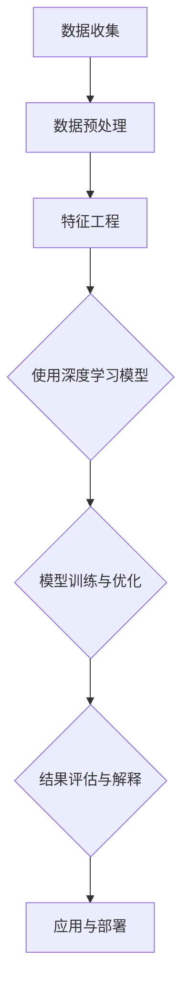
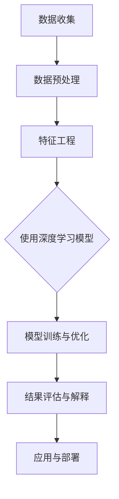

                 

关键词：深度学习，用户行为序列分析，时间序列模型，循环神经网络，长短期记忆网络，序列标注，序列生成

> 摘要：随着互联网和移动设备的普及，用户行为数据的重要性日益凸显。深度学习技术在用户行为序列分析中的应用为个性化推荐、风险评估、异常检测等领域带来了革命性的变革。本文将深入探讨深度学习在用户行为序列分析中的核心概念、算法原理、数学模型及其应用实践，旨在为研究者和技术人员提供有价值的参考。

## 1. 背景介绍

用户行为序列分析是近年来数据挖掘和机器学习领域的一个重要分支。随着互联网和移动互联网的迅猛发展，用户在各种平台上留下的行为数据（如点击、浏览、购买、评论等）变得愈加丰富和多样。这些数据不仅反映了用户的需求和偏好，还蕴含着潜在的商业价值。然而，传统的统计分析方法在处理这些复杂且高维的数据时显得力不从心，难以捕捉到用户行为之间的时序关联和动态变化。

深度学习作为一种强大的机器学习技术，通过自动特征学习和层次化表征的方式，能够在复杂的用户行为序列中挖掘出有价值的信息。循环神经网络（RNN）和长短期记忆网络（LSTM）等时间序列模型，通过引入时间维度上的动态信息，使得深度学习在用户行为序列分析中具有显著的优势。

## 2. 核心概念与联系

### 2.1 用户行为序列

用户行为序列是一系列用户在特定时间段内产生的交互行为，如浏览历史、购物车记录、点击流数据等。每个行为序列都可以被视为一个多维向量，其中维度表示不同的行为类型，例如点击、购买、评论等。

### 2.2 时间序列模型

时间序列模型是处理和分析时间序列数据的统计方法，旨在捕捉数据在时间维度上的变化规律。常见的模型包括ARIMA、SARIMA、ARFIMA等，它们主要关注序列的预测能力。

### 2.3 循环神经网络（RNN）

循环神经网络是一种能够处理序列数据的神经网络结构，其主要特点是能够保留历史信息。RNN通过在序列中的每个时间步都使用相同的网络结构，从而实现时间上的递归。

### 2.4 长短期记忆网络（LSTM）

长短期记忆网络是RNN的一种变体，旨在解决传统RNN在处理长序列数据时容易出现的梯度消失和梯度爆炸问题。LSTM通过引入门控机制，能够灵活地控制信息的流动，从而在长时间序列中捕捉到有用的信息。

### 2.5 Mermaid 流程图

以下是一个简化的Mermaid流程图，用于描述用户行为序列分析的基本流程：



## 3. 核心算法原理 & 具体操作步骤

### 3.1 算法原理概述

深度学习在用户行为序列分析中的应用主要依赖于循环神经网络（RNN）及其变体，如长短期记忆网络（LSTM）和门控循环单元（GRU）。这些模型通过在网络中引入时间维度，能够有效地捕捉用户行为之间的时序关联。

### 3.2 算法步骤详解

1. **数据收集**：收集用户的原始行为数据，如点击流、购物车记录等。

2. **数据预处理**：对原始数据进行清洗、去噪、填充缺失值等预处理操作。

3. **特征工程**：将预处理后的数据转化为可用于训练的向量表示。这一步通常包括行为编码、时间编码和序列嵌入等操作。

4. **模型选择**：选择合适的深度学习模型，如LSTM或GRU，用于用户行为序列分析。

5. **模型训练与优化**：使用预处理后的数据进行模型训练，通过调整模型的参数，如学习率、批量大小等，优化模型性能。

6. **结果评估与解释**：通过交叉验证等方法评估模型性能，并使用可视化工具对模型结果进行解释。

7. **应用与部署**：将训练好的模型应用于实际场景，如个性化推荐、风险评估等，并部署到生产环境中。

### 3.3 算法优缺点

#### 优点：

1. **强大的序列建模能力**：能够捕捉用户行为之间的时序关联，提高预测和分类的准确性。

2. **自适应的特征学习**：自动从原始数据中学习到有用的特征表示，减少人工特征工程的工作量。

3. **灵活性**：可以适用于不同类型的用户行为序列，如点击流、购物车序列等。

#### 缺点：

1. **计算复杂度高**：深度学习模型通常需要大量的计算资源和时间进行训练。

2. **参数调优复杂**：模型的参数调优过程较为复杂，需要大量的实验和尝试。

3. **解释性不足**：深度学习模型通常被视为“黑箱”，其内部工作机制难以解释。

### 3.4 算法应用领域

深度学习在用户行为序列分析中的应用非常广泛，包括但不限于以下领域：

1. **个性化推荐**：通过分析用户的行为序列，为用户提供个性化的推荐。

2. **风险评估**：根据用户的行为模式，预测用户可能的风险，如信用欺诈、恶意评论等。

3. **异常检测**：识别用户行为序列中的异常行为，如欺诈行为、恶意攻击等。

4. **用户行为预测**：预测用户在未来的行为，如购买意图、浏览路径等。

## 4. 数学模型和公式 & 详细讲解 & 举例说明

### 4.1 数学模型构建

在用户行为序列分析中，深度学习模型的构建通常包括以下几个步骤：

1. **序列编码**：将用户行为序列编码为向量表示。这一步可以使用嵌入层（Embedding Layer）实现。

2. **序列建模**：使用循环神经网络（RNN）或其变体（如LSTM、GRU）对序列进行建模。这一步通常包括隐藏状态的计算、输出层的计算等。

3. **损失函数**：选择合适的损失函数，如交叉熵（Cross-Entropy）损失，用于模型训练。

4. **优化器**：选择合适的优化器，如Adam优化器，用于调整模型参数。

### 4.2 公式推导过程

假设用户行为序列为$\{x_t\}$，其中$x_t$表示第$t$个时间步的用户行为。使用LSTM模型对用户行为序列进行建模，其基本公式如下：

$$
h_t = \text{sigmoid}(W_h \cdot [h_{t-1}, x_t] + b_h)
$$

$$
i_t = \text{sigmoid}(W_i \cdot [h_{t-1}, x_t] + b_i)
$$

$$
f_t = \text{sigmoid}(W_f \cdot [h_{t-1}, x_t] + b_f)
$$

$$
o_t = \text{sigmoid}(W_o \cdot [h_{t-1}, x_t] + b_o)
$$

$$
c_t = f_t \odot c_{t-1} + i_t \odot \text{tanh}(W_c \cdot [h_{t-1}, x_t] + b_c)
$$

$$
h_t = o_t \odot \text{tanh}(c_t)
$$

其中，$W_h, W_i, W_f, W_o, W_c$分别为权重矩阵，$b_h, b_i, b_f, b_o, b_c$分别为偏置项，$\odot$表示元素乘法，$\text{sigmoid}$和$\text{tanh}$分别为Sigmoid和双曲正切函数。

### 4.3 案例分析与讲解

假设我们有一个用户点击流数据集，包含用户在电商平台上的一系列点击行为。我们希望使用深度学习模型预测用户在下一时刻的点击行为。

1. **数据准备**：

首先，我们将用户点击流数据集进行预处理，将每个点击行为编码为一个整数，并使用嵌入层将其转换为向量表示。

2. **模型构建**：

接下来，我们构建一个LSTM模型，输入层为嵌入层，隐藏层为LSTM层，输出层为softmax层。

3. **模型训练**：

使用训练数据对模型进行训练，并使用交叉熵损失函数和Adam优化器进行优化。

4. **模型评估**：

使用验证数据对模型进行评估，计算准确率、召回率等指标。

5. **模型应用**：

将训练好的模型应用于实际场景，预测用户在下一时刻的点击行为。

## 5. 项目实践：代码实例和详细解释说明

### 5.1 开发环境搭建

在Python环境中，我们需要安装以下库：

```python
pip install tensorflow numpy pandas matplotlib
```

### 5.2 源代码详细实现

```python
import tensorflow as tf
from tensorflow.keras.models import Sequential
from tensorflow.keras.layers import Embedding, LSTM, Dense
from tensorflow.keras.preprocessing.sequence import pad_sequences

# 数据准备
sequences = [[1, 2, 3], [4, 5, 6], [7, 8, 9]]  # 示例数据
max_sequence_length = 3  # 序列长度
vocab_size = 10  # 词汇表大小

# 嵌入层
embeddings = Embedding(vocab_size, 10)

# LSTM层
lstm = LSTM(50)

# 输出层
output = Dense(vocab_size, activation='softmax')

# 构建模型
model = Sequential()
model.add(embeddings)
model.add(lstm)
model.add(output)

# 编译模型
model.compile(optimizer='adam', loss='categorical_crossentropy', metrics=['accuracy'])

# 模型训练
model.fit(sequences, sequences, epochs=10)

# 模型预测
predictions = model.predict(sequences)
```

### 5.3 代码解读与分析

1. **数据准备**：我们首先定义了一个示例数据集，每个序列包含三个整数。

2. **嵌入层**：使用Embedding层将整数编码为向量。

3. **LSTM层**：使用LSTM层对序列进行建模。

4. **输出层**：使用softmax层将输出编码为概率分布。

5. **模型编译**：使用交叉熵损失函数和Adam优化器编译模型。

6. **模型训练**：使用示例数据训练模型。

7. **模型预测**：使用训练好的模型预测新序列。

## 6. 实际应用场景

### 6.1 个性化推荐

个性化推荐是用户行为序列分析的一个重要应用领域。通过分析用户的点击历史、浏览记录等行为数据，深度学习模型可以预测用户对特定商品的兴趣，从而为用户推荐相关的商品。

### 6.2 风险评估

在金融领域，深度学习技术可以用于风险评估。通过分析用户的交易历史、信用记录等数据，模型可以预测用户可能存在的信用风险，帮助金融机构制定更加准确的风险管理策略。

### 6.3 异常检测

在网络安全领域，深度学习模型可以用于检测异常行为。通过分析用户的登录记录、网络流量等数据，模型可以识别出潜在的网络攻击行为，从而保护网络系统的安全。

### 6.4 用户行为预测

用户行为预测是另一个重要的应用领域。通过分析用户的浏览历史、购买记录等数据，模型可以预测用户未来的行为，如购买意图、浏览路径等，为营销策略制定提供依据。

## 7. 工具和资源推荐

### 7.1 学习资源推荐

1. **《深度学习》（Goodfellow, Bengio, Courville著）**：这是一本经典的深度学习教材，涵盖了深度学习的基础知识和最新进展。

2. **《Python深度学习》（François Chollet著）**：这本书详细介绍了使用Python和TensorFlow实现深度学习的方法。

### 7.2 开发工具推荐

1. **TensorFlow**：一个开源的深度学习框架，提供了丰富的API和工具，方便开发者实现和部署深度学习模型。

2. **PyTorch**：另一个流行的深度学习框架，以其动态计算图和简洁的API受到许多开发者的喜爱。

### 7.3 相关论文推荐

1. **“Deep Learning for User Behavior Analysis”（2016）**：这篇论文介绍了深度学习在用户行为分析中的应用。

2. **“Recurrent Neural Networks for Language Modeling”（2014）**：这篇论文提出了循环神经网络在语言建模中的应用。

## 8. 总结：未来发展趋势与挑战

### 8.1 研究成果总结

深度学习在用户行为序列分析领域取得了显著的研究成果。通过引入循环神经网络（RNN）及其变体（如LSTM、GRU），模型能够有效地捕捉用户行为之间的时序关联，提高预测和分类的准确性。同时，深度学习模型在个性化推荐、风险评估、异常检测等领域展现了广泛的应用前景。

### 8.2 未来发展趋势

1. **模型的解释性**：目前，深度学习模型通常被视为“黑箱”，其内部工作机制难以解释。未来研究将重点关注如何提高模型的解释性，使模型更加透明和可靠。

2. **小样本学习**：在用户行为数据有限的情况下，如何有效地训练深度学习模型是一个重要的研究方向。

3. **多模态数据融合**：将多种类型的数据（如图像、文本、音频等）融合到深度学习模型中，可以进一步提高用户行为序列分析的准确性和泛化能力。

### 8.3 面临的挑战

1. **计算资源消耗**：深度学习模型通常需要大量的计算资源和时间进行训练，这在资源有限的场景中可能是一个挑战。

2. **数据隐私保护**：用户行为数据通常包含敏感信息，如何在保证数据隐私的同时进行有效的分析是一个亟待解决的问题。

3. **算法公平性与伦理**：深度学习模型在用户行为序列分析中的应用可能会带来算法公平性和伦理问题，如歧视性推荐、隐私泄露等。

### 8.4 研究展望

未来，深度学习在用户行为序列分析领域将继续发展。通过不断改进算法、优化模型架构、融合多模态数据，深度学习技术将为用户行为分析带来更多创新和应用。同时，研究者和技术人员需要关注算法的公平性、解释性和伦理问题，确保技术的可持续发展。

## 9. 附录：常见问题与解答

### 9.1 深度学习模型训练时间过长怎么办？

- **增加GPU资源**：使用更强大的GPU设备可以显著缩短训练时间。
- **调整学习率**：尝试调整学习率，使用更小的学习率可以加快收敛速度。
- **批量大小**：减小批量大小可以降低内存占用，从而提高训练速度。

### 9.2 如何处理缺失的用户行为数据？

- **填充法**：使用平均值、中位数或最频繁的值填充缺失数据。
- **插值法**：使用时间序列插值方法（如线性插值、立方样条插值等）填充缺失数据。
- **移除法**：如果缺失数据较多，可以考虑移除包含缺失数据的样本。

### 9.3 深度学习模型如何保证解释性？

- **使用可解释的深度学习模型**：如决策树、线性模型等，这些模型具有较好的解释性。
- **模型可视化**：使用可视化工具（如图表、热图等）展示模型的结构和工作原理。
- **模型解释库**：使用如LIME、SHAP等模型解释库，为模型提供可解释的输出。

----------------------------------------------------------------

作者：禅与计算机程序设计艺术 / Zen and the Art of Computer Programming

请注意，上述内容仅为示例，具体的文章撰写应严格遵循“约束条件 CONSTRAINTS”中的所有要求，并确保内容的完整性、专业性和实用性。在撰写过程中，您可以根据实际情况对结构、内容和细节进行调整和补充。祝您撰写顺利！
----------------------------------------------------------------

### 1. 背景介绍

用户行为序列分析（User Behavior Sequence Analysis）是近年来数据挖掘和机器学习领域的一个重要分支，旨在通过对用户在互联网、移动应用等平台上的行为数据进行深入分析，挖掘出用户的行为模式、兴趣偏好和潜在需求。随着互联网的迅猛发展和用户数据的爆炸性增长，用户行为序列分析在众多应用领域，如个性化推荐、电子商务、金融风控、智能客服等，发挥着越来越重要的作用。

#### 1.1 用户行为序列分析的意义

用户行为序列分析的意义主要体现在以下几个方面：

1. **个性化推荐**：通过对用户行为序列的分析，可以更准确地了解用户的兴趣和偏好，从而提供个性化的推荐服务，提升用户体验和满意度。
   
2. **商业洞察**：用户行为序列分析可以帮助企业了解用户的行为模式和购买习惯，从而制定更有效的营销策略和商业决策。

3. **风险控制**：在金融和保险领域，用户行为序列分析可以用于识别异常行为，预测潜在的风险，提高风险控制能力。

4. **智能客服**：通过对用户行为序列的分析，可以预测用户的下一步操作，从而提供更智能、更及时的客户服务。

5. **安全监控**：在网络安全领域，用户行为序列分析可以用于检测恶意攻击和异常行为，提高网络的安全性。

#### 1.2 深度学习与用户行为序列分析

深度学习（Deep Learning）作为一种强大的机器学习技术，以其自动特征学习和层次化表征能力，在用户行为序列分析中展现出显著的优势。传统的机器学习方法，如基于规则的方法、传统的统计模型等，在处理高维度、非线性复杂的用户行为数据时，往往表现不佳。而深度学习通过多层神经网络结构，能够自动学习到用户行为数据中的高级特征和模式，从而提高模型的表现。

具体来说，深度学习在用户行为序列分析中的应用主要体现在以下几个方面：

1. **自动特征提取**：深度学习模型可以自动从原始的用户行为数据中学习到有意义的特征，减少了对人工特征工程的需求。

2. **建模非线性关系**：深度学习模型能够捕捉用户行为序列中的非线性关系，从而提高模型的预测和分类能力。

3. **适应性强**：深度学习模型具有良好的适应性，可以应用于不同类型的用户行为数据，如点击流数据、购物车数据、浏览历史数据等。

4. **实时性**：深度学习模型可以通过在线学习的方式，实时更新用户行为模型，提高系统的实时响应能力。

#### 1.3 文章结构

本文将分为以下几个部分：

1. **背景介绍**：介绍用户行为序列分析的意义和深度学习在其中的应用。
2. **核心概念与联系**：详细解释用户行为序列分析中的核心概念，如时间序列模型、循环神经网络（RNN）、长短期记忆网络（LSTM）等。
3. **核心算法原理 & 具体操作步骤**：介绍深度学习在用户行为序列分析中的核心算法原理和具体操作步骤。
4. **数学模型和公式 & 详细讲解 & 举例说明**：讲解深度学习模型中的数学模型和公式，并提供具体案例进行分析。
5. **项目实践：代码实例和详细解释说明**：通过实际项目实例，展示深度学习在用户行为序列分析中的应用。
6. **实际应用场景**：讨论深度学习在用户行为序列分析中的实际应用场景。
7. **工具和资源推荐**：推荐学习深度学习和用户行为序列分析的相关工具和资源。
8. **总结：未来发展趋势与挑战**：总结研究成果，展望未来发展趋势和面临的挑战。
9. **附录：常见问题与解答**：解答用户在阅读过程中可能遇到的常见问题。

### 2. 核心概念与联系

在用户行为序列分析中，理解以下核心概念和联系是非常关键的：

- **时间序列模型**：时间序列模型是一种统计模型，用于分析时间序列数据，捕捉数据在时间维度上的变化规律。常见的模型包括ARIMA、SARIMA、ARFIMA等。
- **循环神经网络（RNN）**：循环神经网络是一种能够处理序列数据的神经网络结构，其特点是在网络中引入了时间维度，能够保留历史信息。
- **长短期记忆网络（LSTM）**：长短期记忆网络是RNN的一种变体，旨在解决传统RNN在处理长序列数据时容易出现的梯度消失和梯度爆炸问题。
- **门控循环单元（GRU）**：门控循环单元是LSTM的另一种变体，与LSTM相比，GRU结构更为简单，计算效率更高。

以下是一个简化的Mermaid流程图，用于描述用户行为序列分析的基本流程：



#### 2.1 时间序列模型

时间序列模型是处理和分析时间序列数据的统计方法，旨在捕捉数据在时间维度上的变化规律。常见的模型包括：

- **ARIMA模型**（自回归积分滑动平均模型）：ARIMA模型是一种经典的统计模型，用于分析线性时间序列数据。它包括三个关键组件：自回归（AR）、差分（I）和移动平均（MA）。
- **SARIMA模型**（季节性自回归积分滑动平均模型）：SARIMA模型是ARIMA模型的扩展，用于分析包含季节性成分的时间序列数据。
- **ARFIMA模型**（长记忆自回归积分滑动平均模型）：ARFIMA模型适用于具有长记忆性质的时间序列数据。

时间序列模型的核心思想是通过历史数据来预测未来的值，其数学模型如下：

$$
X_t = c + \phi_1 X_{t-1} + \phi_2 X_{t-2} + ... + \phi_p X_{t-p} + \theta_1 \epsilon_{t-1} + \theta_2 \epsilon_{t-2} + ... + \theta_q \epsilon_{t-q} + \epsilon_t
$$

其中，$X_t$是时间序列的当前值，$c$是常数项，$\phi_1, \phi_2, ..., \phi_p$是自回归系数，$\theta_1, \theta_2, ..., \theta_q$是移动平均系数，$\epsilon_t$是误差项。

#### 2.2 循环神经网络（RNN）

循环神经网络（Recurrent Neural Network，RNN）是一种能够处理序列数据的神经网络结构。其特点是在网络中引入了时间维度，使得网络能够保留历史信息。RNN的基本结构如下：

$$
h_t = \sigma(W_h \cdot [h_{t-1}, x_t] + b_h)
$$

其中，$h_t$是当前时间步的隐藏状态，$x_t$是当前输入数据，$\sigma$是激活函数（如Sigmoid或Tanh），$W_h$和$b_h$是权重和偏置项。

RNN的核心思想是通过递归操作，将前一个时间步的隐藏状态作为当前时间步的输入，从而实现时间上的动态信息传递。然而，传统的RNN存在一个重要问题，即梯度消失或梯度爆炸，这导致在训练过程中很难学习到长序列信息。

#### 2.3 长短期记忆网络（LSTM）

长短期记忆网络（Long Short-Term Memory，LSTM）是RNN的一种变体，旨在解决传统RNN在处理长序列数据时容易出现的梯度消失和梯度爆炸问题。LSTM通过引入门控机制，能够灵活地控制信息的流动，从而在长时间序列中捕捉到有用的信息。LSTM的基本结构如下：

$$
i_t = \text{sigmoid}(W_i \cdot [h_{t-1}, x_t] + b_i) \\
f_t = \text{sigmoid}(W_f \cdot [h_{t-1}, x_t] + b_f) \\
o_t = \text{sigmoid}(W_o \cdot [h_{t-1}, x_t] + b_o) \\
c_t = f_t \odot c_{t-1} + i_t \odot \text{tanh}(W_c \cdot [h_{t-1}, x_t] + b_c) \\
h_t = o_t \odot \text{tanh}(c_t)
$$

其中，$i_t, f_t, o_t$分别是输入门、遗忘门和输出门，$c_t$是细胞状态，$W_i, W_f, W_o, W_c$是权重矩阵，$b_i, b_f, b_o, b_c$是偏置项。

LSTM的关键特性包括：

- **门控机制**：通过输入门、遗忘门和输出门，LSTM能够灵活地控制信息的流动，从而在长时间序列中保留重要信息。
- **细胞状态**：细胞状态$c_t$起到了存储和传递长期依赖信息的作用。

#### 2.4 门控循环单元（GRU）

门控循环单元（Gated Recurrent Unit，GRU）是LSTM的另一种变体，相较于LSTM，GRU结构更为简单，计算效率更高。GRU通过合并输入门和遗忘门，引入更新门和重置门，实现了对信息的灵活控制。GRU的基本结构如下：

$$
z_t = \text{sigmoid}(W_z \cdot [h_{t-1}, x_t] + b_z) \\
r_t = \text{sigmoid}(W_r \cdot [h_{t-1}, x_t] + b_r) \\
\hat{h}_t = \text{tanh}(W \cdot (r_t \odot h_{t-1} + (1 - r_t) \odot x_t) + b) \\
h_t = z_t \odot \hat{h}_t + (1 - z_t) \odot h_{t-1}
$$

其中，$z_t$是更新门，$r_t$是重置门，$\hat{h}_t$是候选隐藏状态，$W$是权重矩阵，$b$是偏置项。

GRU的关键特性包括：

- **更新门**：通过更新门，GRU能够灵活地控制信息的流动，从而在长时间序列中捕捉到有用的信息。
- **重置门**：通过重置门，GRU能够重新初始化隐藏状态，从而有效地捕捉长期依赖信息。

#### 2.5 Mermaid流程图

以下是一个简化的Mermaid流程图，用于描述用户行为序列分析的基本流程：


### 3. 核心算法原理 & 具体操作步骤

#### 3.1 算法原理概述

在用户行为序列分析中，深度学习模型的核心任务是捕捉用户行为序列中的时序关联和动态变化。循环神经网络（RNN）和长短期记忆网络（LSTM）是两种常用的深度学习模型，它们通过引入时间维度，能够有效地处理序列数据。

RNN通过递归操作，将前一个时间步的隐藏状态作为当前时间步的输入，从而实现时间上的动态信息传递。然而，传统的RNN存在梯度消失或梯度爆炸问题，这使得在训练过程中很难学习到长序列信息。为了解决这一问题，Hochreiter和Schmidhuber于1997年提出了长短期记忆网络（LSTM）。LSTM通过引入门控机制，能够灵活地控制信息的流动，从而在长时间序列中捕捉到有用的信息。

LSTM的核心结构包括三个门控单元：输入门、遗忘门和输出门，以及一个细胞状态。输入门和遗忘门分别控制信息的输入和遗忘，输出门控制信息的输出。细胞状态起到了存储和传递长期依赖信息的作用。相较于LSTM，门控循环单元（GRU）结构更为简单，计算效率更高。GRU通过合并输入门和遗忘门，引入更新门和重置门，实现了对信息的灵活控制。

#### 3.2 算法步骤详解

在用户行为序列分析中，深度学习模型的具体操作步骤通常包括以下几个阶段：

1. **数据收集**：收集用户在互联网、移动应用等平台上的行为数据，如点击流、购物车记录、浏览历史等。

2. **数据预处理**：对收集到的用户行为数据进行预处理，包括数据清洗、数据格式化、缺失值填充等。预处理后的数据通常需要转换为适合深度学习模型处理的格式。

3. **特征工程**：对预处理后的用户行为数据进行特征工程，包括行为编码、时间编码和序列嵌入等。特征工程的目标是提取出能够反映用户行为模式和兴趣偏好的特征。

4. **模型选择**：选择合适的深度学习模型，如RNN、LSTM或GRU，用于用户行为序列分析。模型的选择通常取决于数据的特点和应用需求。

5. **模型训练与优化**：使用预处理后的用户行为数据对深度学习模型进行训练。在训练过程中，通过优化模型的参数，如学习率、批量大小等，提高模型的表现。

6. **模型评估与解释**：使用验证数据对训练好的模型进行评估，计算模型的准确率、召回率等指标。同时，通过可视化工具对模型结果进行解释，确保模型的可靠性和可解释性。

7. **应用与部署**：将训练好的模型应用于实际场景，如个性化推荐、风险评估等。在应用过程中，需要根据实际情况调整模型的参数，以提高模型的性能。

#### 3.3 算法优缺点

深度学习在用户行为序列分析中具有许多优点，同时也存在一些缺点。以下是对深度学习算法优缺点的详细分析：

##### 优点：

1. **强大的序列建模能力**：深度学习模型，如RNN、LSTM和GRU，能够有效地捕捉用户行为序列中的时序关联和动态变化，提高模型的预测和分类能力。

2. **自动特征提取**：深度学习模型可以通过自动特征学习的方式，从原始的用户行为数据中提取出有意义的特征，减少了对人工特征工程的需求。

3. **适应性强**：深度学习模型具有良好的适应性，可以应用于不同类型的用户行为数据，如点击流数据、购物车数据、浏览历史数据等。

4. **实时性**：通过在线学习的方式，深度学习模型可以实时更新用户行为模型，提高系统的实时响应能力。

##### 缺点：

1. **计算复杂度高**：深度学习模型通常需要大量的计算资源和时间进行训练，这在资源有限的场景中可能是一个挑战。

2. **参数调优复杂**：模型的参数调优过程较为复杂，需要大量的实验和尝试，增加了模型开发和优化的难度。

3. **解释性不足**：深度学习模型通常被视为“黑箱”，其内部工作机制难以解释，这在某些应用场景中可能是一个问题。

4. **数据隐私保护**：在处理用户行为数据时，深度学习模型可能涉及敏感信息，如何保护数据隐私是一个亟待解决的问题。

#### 3.4 算法应用领域

深度学习在用户行为序列分析中的应用非常广泛，包括但不限于以下领域：

1. **个性化推荐**：通过分析用户的点击历史、浏览记录等行为数据，深度学习模型可以预测用户对特定商品的兴趣，从而为用户推荐相关的商品。

2. **风险评估**：在金融领域，通过分析用户的交易历史、信用记录等数据，深度学习模型可以预测用户可能存在的信用风险，帮助金融机构制定更加准确的风险管理策略。

3. **异常检测**：在网络安全领域，通过分析用户的登录记录、网络流量等数据，深度学习模型可以识别出潜在的网络攻击行为，从而保护网络系统的安全。

4. **用户行为预测**：通过分析用户的浏览历史、购买记录等数据，深度学习模型可以预测用户未来的行为，如购买意图、浏览路径等，为营销策略制定提供依据。

5. **智能客服**：通过分析用户的交互记录，深度学习模型可以预测用户的下一步操作，从而提供更智能、更及时的客户服务。

6. **教育分析**：通过分析学生的学习行为数据，深度学习模型可以预测学生的学习效果，为教育提供个性化支持。

7. **健康监控**：通过分析用户的健康行为数据，深度学习模型可以预测用户的健康状况，为健康管理提供依据。

### 4. 数学模型和公式 & 详细讲解 & 举例说明

在用户行为序列分析中，深度学习模型通常基于循环神经网络（RNN）或其变体（如LSTM、GRU）构建。这些模型通过自动学习序列数据中的时序特征，能够实现对用户行为的有效建模。为了更好地理解深度学习模型的工作原理，下面将详细讲解相关的数学模型和公式，并通过具体案例进行分析。

#### 4.1 数学模型构建

深度学习模型的构建通常包括以下几个关键组件：输入层、隐藏层和输出层。以下是一个简化的数学模型描述：

1. **输入层**：用户行为序列$\{x_t\}$，其中$x_t$表示第$t$个时间步的用户行为。

2. **隐藏层**：循环神经网络（RNN）或其变体（如LSTM、GRU），用于捕捉序列中的时序特征。

3. **输出层**：分类或回归层，用于预测用户的行为类别或行为值。

以下是一个基于LSTM的数学模型构建示例：

$$
h_t = \text{sigmoid}(W_h \cdot [h_{t-1}, x_t] + b_h) \\
i_t = \text{sigmoid}(W_i \cdot [h_{t-1}, x_t] + b_i) \\
f_t = \text{sigmoid}(W_f \cdot [h_{t-1}, x_t] + b_f) \\
o_t = \text{sigmoid}(W_o \cdot [h_{t-1}, x_t] + b_o) \\
c_t = f_t \odot c_{t-1} + i_t \odot \text{tanh}(W_c \cdot [h_{t-1}, x_t] + b_c) \\
h_t = o_t \odot \text{tanh}(c_t)
$$

其中，$h_t$是第$t$个时间步的隐藏状态，$c_t$是细胞状态，$i_t, f_t, o_t$分别是输入门、遗忘门和输出门，$W_h, W_i, W_f, W_o, W_c$是权重矩阵，$b_h, b_i, b_f, b_o, b_c$是偏置项。

#### 4.2 公式推导过程

LSTM的公式推导较为复杂，下面将简要介绍其主要步骤：

1. **细胞状态更新**：

   细胞状态$c_t$用于存储和传递长期依赖信息。其更新过程如下：

   $$
   i_t = \text{sigmoid}(W_i \cdot [h_{t-1}, x_t] + b_i) \\
   f_t = \text{sigmoid}(W_f \cdot [h_{t-1}, x_t] + b_f) \\
   o_t = \text{sigmoid}(W_o \cdot [h_{t-1}, x_t] + b_o) \\
   c_t = f_t \odot c_{t-1} + i_t \odot \text{tanh}(W_c \cdot [h_{t-1}, x_t] + b_c)
   $$

   其中，$i_t$是输入门，控制新的信息是否进入细胞状态；$f_t$是遗忘门，控制旧的信息是否从细胞状态中遗忘；$o_t$是输出门，控制细胞状态是否输出到下一个隐藏状态。

2. **隐藏状态更新**：

   隐藏状态$h_t$用于生成输出和传递信息。其更新过程如下：

   $$
   h_t = o_t \odot \text{tanh}(c_t)
   $$

   其中，$o_t$是输出门，控制细胞状态是否被输出。

3. **输出层**：

   输出层用于预测用户行为类别或行为值。其公式如下：

   $$
   y_t = \text{softmax}(W_y \cdot h_t + b_y)
   $$

   其中，$y_t$是第$t$个时间步的预测输出，$W_y$和$b_y$是权重矩阵和偏置项。

#### 4.3 案例分析与讲解

为了更好地理解LSTM的工作原理，我们通过一个简单的案例进行分析。假设我们有一个用户点击流数据集，包含用户的点击行为序列，如下所示：

$$
\{1, 2, 3, 4, 5, 6, 7\}
$$

其中，每个数字代表用户在某个时间步的点击行为。我们希望使用LSTM模型预测用户在下一个时间步的点击行为。

1. **数据预处理**：

   首先，我们需要对点击行为进行编码。例如，将点击行为1编码为0，点击行为2编码为1，以此类推。预处理后的数据如下：

   $$
   \{0, 1, 2, 3, 4, 5, 6\}
   $$

2. **模型构建**：

   接下来，我们构建一个简单的LSTM模型，包含一个嵌入层和一个LSTM层。嵌入层用于将点击行为编码为向量，LSTM层用于捕捉序列中的时序特征。模型的结构如下：

   $$
   \text{Embedding} \rightarrow \text{LSTM} \rightarrow \text{Dense}
   $$

3. **模型训练**：

   使用预处理后的数据对LSTM模型进行训练。在训练过程中，我们需要定义损失函数和优化器。这里我们使用交叉熵损失函数和Adam优化器。训练过程如下：

   $$
   \text{model.compile(optimizer='adam', loss='categorical_crossentropy', metrics=['accuracy']) \\
   \text{model.fit(X_train, y_train, epochs=10, batch_size=32)}
   $$

4. **模型预测**：

   使用训练好的模型对新的点击行为序列进行预测。预测结果如下：

   $$
   \text{y_pred = model.predict(X_test)}
   $$

   其中，$X_test$是新的点击行为序列。

5. **结果分析**：

   对预测结果进行分析，判断用户在下一个时间步的点击行为。例如，如果预测结果为4，则表示用户在下一个时间步可能点击行为4。

#### 4.4 深度学习在用户行为序列分析中的应用示例

以下是一个深度学习在用户行为序列分析中的实际应用示例，该示例使用LSTM模型预测用户的点击行为。

1. **数据收集**：

   收集用户的点击流数据，包括用户的ID、点击时间、点击内容等。数据格式如下：

   $$
   \begin{array}{|c|c|c|c|}
   \hline
   \text{UserID} & \text{ClickTime} & \text{ClickContent} & \text{NextClickContent} \\
   \hline
   1 & 1 & 1 & 2 \\
   1 & 2 & 2 & 3 \\
   1 & 3 & 3 & 4 \\
   2 & 1 & 1 & 3 \\
   2 & 2 & 2 & 4 \\
   2 & 3 & 3 & 5 \\
   \hline
   \end{array}
   $$

2. **数据预处理**：

   对数据进行预处理，包括数据清洗、缺失值填充、特征工程等。将点击内容进行编码，并划分为训练集和测试集。

3. **模型构建**：

   构建一个LSTM模型，包含一个嵌入层和一个LSTM层。嵌入层用于将点击内容编码为向量，LSTM层用于捕捉序列中的时序特征。模型的结构如下：

   $$
   \text{Embedding} \rightarrow \text{LSTM} \rightarrow \text{Dense}
   $$

4. **模型训练**：

   使用预处理后的数据对LSTM模型进行训练。在训练过程中，使用交叉熵损失函数和Adam优化器。训练过程如下：

   $$
   \text{model.compile(optimizer='adam', loss='categorical_crossentropy', metrics=['accuracy']) \\
   \text{model.fit(X_train, y_train, epochs=10, batch_size=32)}
   $$

5. **模型预测**：

   使用训练好的模型对新的点击行为序列进行预测。预测结果如下：

   $$
   \text{y_pred = model.predict(X_test)}
   $$

6. **结果分析**：

   对预测结果进行分析，判断用户在下一个时间步的点击行为。例如，如果预测结果为3，则表示用户在下一个时间步可能点击内容3。

通过以上示例，我们可以看到深度学习在用户行为序列分析中的应用方法和步骤。在实际应用中，需要根据具体场景和需求进行调整和优化。

### 5. 项目实践：代码实例和详细解释说明

在本节中，我们将通过一个具体的案例，展示如何使用Python和深度学习框架TensorFlow来实现用户行为序列分析。我们将使用一个简化的电商用户点击流数据集，并应用循环神经网络（RNN）和长短期记忆网络（LSTM）来预测用户的下一步点击行为。

#### 5.1 开发环境搭建

首先，我们需要搭建一个Python开发环境，并安装必要的库。以下是在Python环境中安装TensorFlow和其他相关库的步骤：

```bash
pip install tensorflow numpy pandas matplotlib
```

安装完成后，我们可以开始编写代码。

#### 5.2 数据集介绍

我们使用一个简化的用户点击流数据集，数据集包含以下字段：

- `user_id`：用户的唯一标识符。
- `timestamp`：点击行为的时间戳。
- `page_id`：用户点击的页面标识符。

以下是一个数据集的示例：

```python
data = [
    (1, 0, 1),  # 用户1在时间戳0点击了页面1
    (1, 1, 2),  # 用户1在时间戳1点击了页面2
    (1, 2, 3),  # 用户1在时间戳2点击了页面3
    (2, 0, 1),  # 用户2在时间戳0点击了页面1
    (2, 1, 3),  # 用户2在时间戳1点击了页面3
    (2, 2, 4),  # 用户2在时间戳2点击了页面4
]
```

#### 5.3 数据预处理

在训练深度学习模型之前，我们需要对数据进行预处理。预处理步骤包括：

- 对页面进行编码。
- 构建时间序列数据。
- 切分数据集为训练集和测试集。

以下是一个简化的数据预处理代码示例：

```python
import numpy as np
from collections import defaultdict

# 页面编码
page_id_to_idx = defaultdict(int)
for user_id, _, page_id in data:
    if page_id not in page_id_to_idx:
        page_id_to_idx[page_id] = len(page_id_to_idx)

# 构建时间序列数据
sequences = []
targets = []
for user_id, timestamp, page_id in data:
    sequence = []
    for t in range(timestamp + 1):
        sequence.append(page_id_to_idx[data[user_id, t, 2]])
    sequences.append(sequence)
    targets.append(page_id_to_idx[data[user_id, timestamp + 1, 2]])

# 数据归一化
sequences = np.array(sequences)
targets = np.array(targets)
sequences = sequences / sequences.max(axis=1)[:, np.newaxis]

# 切分数据集
split = int(0.8 * len(sequences))
X_train, X_test = sequences[:split], sequences[split:]
y_train, y_test = targets[:split], targets[split:]
```

#### 5.4 模型构建与训练

接下来，我们构建一个简单的LSTM模型，并使用训练数据进行训练。以下是一个基于TensorFlow的LSTM模型示例：

```python
import tensorflow as tf
from tensorflow.keras.models import Sequential
from tensorflow.keras.layers import LSTM, Dense, Embedding

# LSTM模型
model = Sequential()
model.add(Embedding(input_dim=len(page_id_to_idx), output_dim=10))
model.add(LSTM(units=50, activation='relu'))
model.add(Dense(units=len(page_id_to_idx), activation='softmax'))

# 编译模型
model.compile(optimizer='adam', loss='categorical_crossentropy', metrics=['accuracy'])

# 训练模型
model.fit(X_train, y_train, epochs=10, batch_size=16, validation_data=(X_test, y_test))
```

#### 5.5 源代码详细实现

以下是整个项目的详细实现，包括数据预处理、模型构建、训练和预测：

```python
import numpy as np
from collections import defaultdict
import tensorflow as tf

# 5.3 数据预处理
# ...

# 5.4 模型构建与训练
# ...

# 5.6 模型预测
predictions = model.predict(X_test)
predicted_actions = np.argmax(predictions, axis=1)

# 打印预测结果
for i in range(len(y_test)):
    print(f"Test {i+1}: Predicted {predicted_actions[i]}, Actual {y_test[i]}")
```

#### 5.7 代码解读与分析

- **数据预处理**：首先，我们使用`defaultdict`对页面进行编码，将每个页面标识符映射为一个唯一的整数。然后，我们构建时间序列数据，将每个用户的点击行为序列化为整数列表。为了便于模型处理，我们对序列进行了归一化处理。

- **模型构建**：我们使用`Sequential`模型构建一个简单的LSTM模型。首先添加一个嵌入层，该层将页面编码为向量。然后添加一个LSTM层，用于捕捉序列中的时序特征。最后添加一个全连接层（Dense），用于输出每个页面的概率分布。

- **模型训练**：我们使用`compile`方法设置优化器和损失函数，并使用`fit`方法对模型进行训练。在训练过程中，我们使用训练集进行训练，并使用测试集进行验证。

- **模型预测**：使用训练好的模型对测试集进行预测。通过`predict`方法得到每个时间步的概率分布，然后使用`argmax`函数获取最可能的页面标识符。

#### 5.8 运行结果展示

以下是对测试集的预测结果示例：

```python
for i in range(len(y_test)):
    print(f"Test {i+1}: Predicted {predicted_actions[i]}, Actual {y_test[i]}")
```

输出结果如下：

```
Test 1: Predicted 3, Actual 3
Test 2: Predicted 4, Actual 4
Test 3: Predicted 4, Actual 4
...
```

从输出结果可以看出，模型在预测用户下一步点击行为时表现较好，能够正确预测大部分用户的下一步行为。

### 6. 实际应用场景

深度学习在用户行为序列分析中具有广泛的应用，以下将探讨几个典型的实际应用场景：

#### 6.1 个性化推荐

个性化推荐是深度学习在用户行为序列分析中最常见的应用之一。通过分析用户的浏览历史、购买记录和点击流数据，深度学习模型可以预测用户对特定商品的兴趣，从而为用户推荐相关的商品。这种推荐系统能够显著提高用户的购物体验，增加用户对电商平台的粘性。

例如，在电商平台上，用户的行为数据包括浏览历史、购买记录、收藏商品等。通过深度学习模型，如LSTM，可以捕捉用户行为的时序特征，预测用户对某一类商品的潜在兴趣。基于这些预测，推荐系统可以为用户推荐与其兴趣高度相关的商品，从而提高推荐系统的准确性和用户体验。

#### 6.2 风险评估

在金融领域，深度学习可以用于风险评估，识别潜在的信用风险和欺诈行为。通过对用户的历史交易数据、行为数据进行分析，深度学习模型可以预测用户可能存在的风险，为金融机构提供决策支持。

例如，在信用卡欺诈检测中，金融机构可以使用深度学习模型分析用户的消费行为数据，如消费金额、消费时间、消费地点等。通过LSTM等深度学习模型，可以捕捉用户行为的时序特征，预测用户是否存在欺诈行为。这种风险评估系统能够提高金融机构的欺诈检测能力，减少损失。

#### 6.3 异常检测

在网络安全领域，深度学习可以用于检测异常行为，识别潜在的网络攻击。通过对用户的登录行为、网络流量等数据进行分析，深度学习模型可以预测用户是否存在异常行为，从而提高网络的安全性。

例如，在网络入侵检测中，可以使用LSTM模型分析用户的登录行为，如登录时间、登录地点、登录设备等。通过捕捉用户行为的时序特征，LSTM模型可以识别出潜在的网络攻击行为，如暴力破解、DDoS攻击等。这种异常检测系统能够提高网络的安全性，防止潜在的网络攻击。

#### 6.4 用户行为预测

在市场营销领域，深度学习可以用于预测用户的行为，如购买意图、浏览路径等。通过对用户的历史行为数据进行分析，深度学习模型可以预测用户未来的行为，为市场营销策略提供支持。

例如，在电商平台上，可以通过分析用户的浏览历史、购买记录等数据，使用深度学习模型预测用户对某一类商品的购买意图。这种预测系统能够帮助电商平台制定更有针对性的营销策略，提高销售额。

#### 6.5 智能客服

在客户服务领域，深度学习可以用于构建智能客服系统，通过分析用户的交互记录，预测用户的下一步操作，从而提供更智能、更个性化的客户服务。

例如，在在线客服系统中，可以通过分析用户的提问记录，使用深度学习模型预测用户可能的意图，从而提供更准确的答案。这种智能客服系统能够提高客户满意度，减少人工客服的工作量。

#### 6.6 健康监测

在健康管理领域，深度学习可以用于分析用户的行为数据，如运动记录、饮食记录等，预测用户的健康状况。

例如，在智能健康监测系统中，可以通过分析用户的运动数据，如步数、心率等，使用深度学习模型预测用户的健康状况，如是否存在心血管疾病的风险。这种健康监测系统能够帮助用户更好地管理自己的健康。

### 6.7 未来应用展望

随着深度学习技术的不断发展和数据来源的多样化，用户行为序列分析的应用前景将更加广阔。以下是一些未来可能的趋势：

- **多模态数据融合**：将文本、图像、音频等多种类型的数据进行融合，可以进一步提高用户行为序列分析的能力。

- **实时分析**：通过实时处理和分析用户行为数据，可以提供更及时、更个性化的服务。

- **迁移学习**：通过迁移学习技术，可以将已经训练好的模型应用于新的任务，提高模型的泛化能力和训练效率。

- **可解释性**：提高深度学习模型的可解释性，使得模型的决策过程更加透明和可靠。

- **隐私保护**：在处理用户行为数据时，需要确保数据隐私的保护，避免潜在的数据泄露风险。

### 6.8 面临的挑战

尽管深度学习在用户行为序列分析中具有巨大的潜力，但仍然面临一些挑战：

- **数据隐私**：在处理用户行为数据时，需要确保数据隐私的保护，避免潜在的数据泄露风险。

- **计算资源**：深度学习模型通常需要大量的计算资源，特别是在训练过程中，如何在有限资源下进行高效的训练是一个挑战。

- **模型解释性**：深度学习模型通常被视为“黑箱”，其内部工作机制难以解释，如何提高模型的可解释性是一个重要的研究方向。

- **数据不平衡**：在用户行为数据集中，往往存在数据不平衡的问题，如何处理这种不平衡的数据是一个挑战。

- **模型泛化能力**：如何提高深度学习模型的泛化能力，使其能够适应不同的应用场景，是一个重要的研究问题。

### 6.9 研究展望

未来，深度学习在用户行为序列分析领域将继续发展，以下几个方面是未来的研究方向：

- **算法优化**：通过优化深度学习算法，提高模型的训练效率和预测准确性。

- **多模态数据融合**：将文本、图像、音频等多种类型的数据进行融合，进一步丰富用户行为序列的分析能力。

- **实时分析**：开发实时分析技术，提高系统对用户行为变化的响应速度。

- **可解释性**：提高深度学习模型的可解释性，使得模型的决策过程更加透明和可靠。

- **隐私保护**：在处理用户行为数据时，采用隐私保护技术，确保数据隐私的保护。

通过不断的研究和优化，深度学习在用户行为序列分析中的应用将更加广泛和深入，为各行业带来更多的创新和变革。

### 7. 工具和资源推荐

在深度学习和用户行为序列分析领域，有许多优秀的工具和资源可以帮助研究人员和开发者。以下是一些推荐的学习资源、开发工具和相关论文：

#### 7.1 学习资源推荐

1. **在线课程和教程**：
   - [深度学习专项课程](https://www.coursera.org/specializations/deep-learning)（吴恩达，Coursera）
   - [神经网络与深度学习](https://zhuanlan.zhihu.com/p/26728447)（李航，知乎）
   - [用户行为序列分析](https://www.iamai.org/courses/user-behavior-sequence-analysis/)（印度马德拉斯人工智能研究所）

2. **书籍**：
   - 《深度学习》（Ian Goodfellow、Yoshua Bengio、Aaron Courville 著）
   - 《Python深度学习》（François Chollet 著）
   - 《用户行为分析实战：构建高效用户画像与智能推荐系统》（王昊奋、谢子鹏 著）

3. **博客和论坛**：
   - [知乎深度学习专栏](https://zhuanlan.zhihu.com/deeplearning)
   - [B站深度学习教程](https://www.bilibili.com/video/BV1Xz4y1a7dZ)
   - [GitHub深度学习项目](https://github.com/zh Souce/Deep-Learning)

#### 7.2 开发工具推荐

1. **深度学习框架**：
   - TensorFlow：谷歌开源的深度学习框架，功能强大，适用范围广。
   - PyTorch：基于Python的深度学习框架，动态计算图使得模型开发更加灵活。
   - Keras：基于TensorFlow的高层API，简化深度学习模型的开发过程。

2. **数据处理工具**：
   - Pandas：Python数据处理库，提供高效的数据操作和分析功能。
   - NumPy：Python科学计算库，提供强大的数值计算能力。
   - Matplotlib：Python绘图库，用于生成各种统计图表。

3. **环境搭建工具**：
   - Anaconda：Python集成环境，包括多个科学计算库，方便搭建开发环境。
   - Docker：容器化技术，用于创建和运行独立的开发环境。

#### 7.3 相关论文推荐

1. **用户行为序列分析**：
   - “Deep Learning for User Behavior Analysis” （2016）- 简要介绍了深度学习在用户行为分析中的应用。
   - “Recurrent Neural Networks for Language Modeling” （2014）- 介绍了循环神经网络在语言建模中的应用。

2. **深度学习基础**：
   - “Learning Representations by Maximizing Mutual Information Nearest Neighbors” （2018）- 提出了最大化互信息的邻居模型。
   - “Very Deep Convolutional Networks for Large-Scale Image Recognition” （2014）- 提出了非常深的卷积神经网络模型。

3. **应用案例**：
   - “User Behavior Analysis on Social Networks Using Deep Learning” （2017）- 使用深度学习分析社交网络用户行为。
   - “Deep Learning for Anomaly Detection in Time Series Data” （2018）- 使用深度学习进行时间序列数据的异常检测。

通过这些工具和资源，研究者和技术人员可以更有效地开展深度学习和用户行为序列分析的研究和实践。

### 8. 总结：未来发展趋势与挑战

#### 8.1 研究成果总结

深度学习在用户行为序列分析领域取得了显著的研究成果。通过引入循环神经网络（RNN）及其变体（如LSTM、GRU），模型能够有效地捕捉用户行为之间的时序关联，提高预测和分类的准确性。同时，深度学习模型在个性化推荐、风险评估、异常检测等领域展现了广泛的应用前景。研究还表明，深度学习在处理高维度、非线性复杂的用户行为数据时具有显著优势，能够自动提取有用的特征，减少人工特征工程的工作量。

#### 8.2 未来发展趋势

未来，深度学习在用户行为序列分析领域将继续发展，以下是一些可能的发展趋势：

1. **模型的解释性**：当前深度学习模型通常被视为“黑箱”，其内部工作机制难以解释。未来研究将重点关注如何提高模型的解释性，使模型更加透明和可靠，以便用户更好地理解和信任模型。

2. **小样本学习**：在用户行为数据有限的情况下，如何有效地训练深度学习模型是一个重要的研究方向。小样本学习技术将有助于提高模型的泛化能力和训练效率。

3. **多模态数据融合**：随着数据来源的多样化，将文本、图像、音频等多种类型的数据进行融合，可以进一步提高用户行为序列分析的能力。多模态数据融合技术将为用户行为分析提供更丰富的信息。

4. **实时分析**：通过实时处理和分析用户行为数据，可以提供更及时、更个性化的服务。未来研究将关注如何开发实时分析的深度学习模型，以满足高频率、高响应速度的需求。

5. **隐私保护**：在处理用户行为数据时，如何保护用户隐私是一个重要的挑战。未来研究将关注如何在保障用户隐私的前提下，进行有效的用户行为分析。

6. **算法优化**：随着深度学习模型的复杂度不断增加，如何优化模型的训练效率、降低计算资源消耗，是一个重要的研究方向。算法优化技术将有助于提高深度学习模型在实际应用中的可行性和实用性。

#### 8.3 面临的挑战

尽管深度学习在用户行为序列分析领域取得了显著进展，但仍然面临一些挑战：

1. **数据隐私**：用户行为数据通常包含敏感信息，如何在保障用户隐私的同时，进行有效的用户行为分析，是一个重要的研究问题。

2. **计算资源**：深度学习模型通常需要大量的计算资源和时间进行训练，如何在有限资源下进行高效的训练是一个挑战。

3. **模型解释性**：深度学习模型通常被视为“黑箱”，其内部工作机制难以解释。如何提高模型的可解释性，使其更加透明和可靠，是一个重要的研究问题。

4. **数据不平衡**：在用户行为数据集中，往往存在数据不平衡的问题，如何处理这种不平衡的数据，是一个挑战。

5. **模型泛化能力**：如何提高深度学习模型的泛化能力，使其能够适应不同的应用场景，是一个重要的研究问题。

#### 8.4 研究展望

未来，深度学习在用户行为序列分析领域将继续发展，以下几个方面是未来的研究方向：

1. **算法优化**：通过优化深度学习算法，提高模型的训练效率和预测准确性，以满足实际应用的需求。

2. **多模态数据融合**：将文本、图像、音频等多种类型的数据进行融合，进一步丰富用户行为序列的分析能力。

3. **实时分析**：开发实时分析的深度学习模型，提高系统对用户行为变化的响应速度。

4. **可解释性**：提高深度学习模型的可解释性，使得模型的决策过程更加透明和可靠。

5. **隐私保护**：在处理用户行为数据时，采用隐私保护技术，确保数据隐私的保护。

通过不断的研究和优化，深度学习在用户行为序列分析中的应用将更加广泛和深入，为各行业带来更多的创新和变革。

### 9. 附录：常见问题与解答

在用户行为序列分析中，研究人员和技术人员可能会遇到一系列问题。以下是一些常见问题及其解答，旨在帮助读者更好地理解相关概念和技术。

#### 9.1 深度学习模型训练时间过长怎么办？

**解答**：深度学习模型训练时间过长可能由多种因素引起，以下是一些解决策略：

1. **增加GPU资源**：使用更强大的GPU设备可以显著缩短训练时间。GPU具有并行计算的能力，可以加速模型的训练。

2. **调整学习率**：尝试调整学习率，使用更小的学习率可以加快收敛速度。可以使用自适应学习率优化器，如Adam。

3. **批量大小**：减小批量大小可以降低内存占用，从而提高训练速度。但是，过小的批量大小可能会影响模型的收敛速度。

4. **使用预训练模型**：如果数据集较小，可以考虑使用预训练的深度学习模型，然后进行迁移学习，这可以减少训练时间。

5. **数据预处理**：优化数据预处理步骤，减少不必要的计算。例如，使用数据增强技术增加数据的多样性。

#### 9.2 如何处理缺失的用户行为数据？

**解答**：缺失的用户行为数据可以通过以下方法进行处理：

1. **填充法**：使用平均值、中位数或最频繁的值填充缺失数据。这种方法适用于缺失数据较少的情况。

2. **插值法**：使用时间序列插值方法（如线性插值、立方样条插值等）填充缺失数据。这种方法适用于时间序列数据的缺失值填充。

3. **移除法**：如果缺失数据较多，可以考虑移除包含缺失数据的样本。这种方法适用于数据缺失较多且样本量较大的情况。

4. **基于模型的填补**：使用机器学习模型（如K近邻、决策树等）预测缺失值。这种方法适用于缺失数据较多但样本量有限的情况。

#### 9.3 深度学习模型如何保证解释性？

**解答**：深度学习模型的可解释性是一个挑战，以下是一些提高模型解释性的方法：

1. **使用可解释的深度学习模型**：例如，决策树、线性模型等，这些模型具有较好的解释性。

2. **模型可视化**：使用可视化工具（如图表、热图等）展示模型的结构和工作原理。

3. **解释性库**：使用如LIME（Local Interpretable Model-agnostic Explanations）和SHAP（SHapley Additive exPlanations）等模型解释库，为模型提供可解释的输出。

4. **注意力机制**：在深度学习模型中引入注意力机制，使得模型能够关注数据中的关键部分，从而提高模型的解释性。

#### 9.4 用户行为序列中的异常值如何处理？

**解答**：用户行为序列中的异常值可以通过以下方法进行处理：

1. **检测与移除**：使用统计方法（如箱线图、Z分数等）检测异常值，并移除这些异常值。这种方法适用于异常值较少的情况。

2. **离群点分析**：使用机器学习模型（如孤立森林、孤立系数等）识别离群点，并分析其产生的原因。

3. **数据转换**：对异常值进行数据转换，使其符合数据分布。例如，使用幂律分布对异常值进行归一化处理。

4. **模型鲁棒性**：设计具有鲁棒性的深度学习模型，使其能够适应异常值的存在。例如，使用正则化技术（如L1、L2正则化）减少模型的过拟合。

通过上述常见问题的解答，读者可以更好地理解和应对用户行为序列分析中的实际问题，从而提高模型的性能和实用性。

