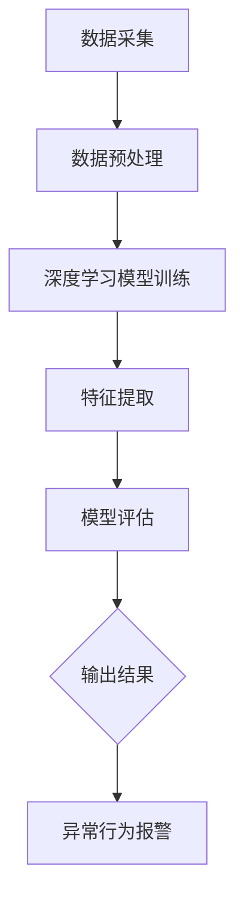

                 

深度学习作为一种强大的机器学习技术，已经在图像识别、自然语言处理等多个领域取得了显著的成果。随着互联网和大数据技术的发展，用户行为序列数据的获取和处理变得日益重要。异常检测作为数据挖掘中的一个重要课题，旨在从大量数据中识别出异常或违反预期的行为模式。本文将探讨深度学习在用户行为序列异常检测中的应用，包括核心算法原理、数学模型、实际应用场景以及未来发展趋势。

## 1. 背景介绍

用户行为序列数据通常包括用户在电子商务平台上的购买行为、社交媒体平台上的互动行为、金融交易中的操作行为等。这些数据形式多样，包含时序信息，具有复杂性和不确定性。传统的异常检测方法，如统计方法、基于规则的方法等，在处理高维数据和复杂时序关系时往往表现出一定的局限性。

深度学习作为一种自下而上的学习方法，通过多层神经网络对数据进行建模和特征提取，具有处理高维数据和复杂数据关系的能力。近年来，深度学习在图像识别、语音识别等领域取得了突破性进展，使其在用户行为序列异常检测中也具有了广泛的应用前景。

## 2. 核心概念与联系

### 2.1. 用户行为序列

用户行为序列是指用户在一段时间内的一系列行为记录，如时间戳、行为类型、行为值等。例如，用户在电子商务平台上的购买行为序列可能包括商品ID、购买时间、购买金额等。

### 2.2. 异常检测

异常检测旨在从正常数据中识别出不符合预期的异常行为。在用户行为序列中，异常行为可能包括欺诈行为、恶意行为、数据错误等。

### 2.3. 深度学习

深度学习是一种基于多层神经网络的机器学习方法，通过反向传播算法对大量数据进行学习，从而实现特征提取和分类。深度学习在用户行为序列异常检测中的应用，主要包括以下几个方面：

- **自动特征提取**：深度学习可以从原始的用户行为序列中自动提取出具有区分度的特征。
- **复杂模式识别**：深度学习能够识别出复杂的用户行为序列模式，从而提高异常检测的准确性。
- **自适应学习能力**：深度学习可以根据新的用户行为数据进行在线学习，从而适应不断变化的行为模式。

### 2.4. Mermaid 流程图

下面是一个用户行为序列异常检测的 Mermaid 流程图，展示了深度学习的核心概念和流程。



## 3. 核心算法原理 & 具体操作步骤

### 3.1. 算法原理概述

用户行为序列异常检测的深度学习算法通常包括以下几个步骤：

1. 数据预处理：对用户行为序列进行清洗、归一化等预处理操作，使其适合深度学习模型的输入。
2. 模型训练：使用已标注的异常行为数据训练深度学习模型，模型通常采用卷积神经网络（CNN）或长短时记忆网络（LSTM）。
3. 特征提取：通过训练得到的模型，对新的用户行为序列进行特征提取，提取出具有区分度的特征。
4. 模型评估：使用测试集对训练好的模型进行评估，评估指标通常包括准确率、召回率、F1值等。
5. 输出结果：根据模型评估结果，判断用户行为是否异常，并输出报警信息。

### 3.2. 算法步骤详解

#### 3.2.1. 数据预处理

数据预处理是深度学习算法的第一步，其目的是将原始的用户行为序列数据转换为适合深度学习模型输入的格式。具体操作步骤如下：

1. 数据清洗：去除数据中的噪声和异常值，如空值、缺失值等。
2. 数据归一化：将不同行为类型的数据进行归一化处理，使其具有相似的尺度。
3. 数据切分：将用户行为序列数据按照一定比例切分为训练集、验证集和测试集。

#### 3.2.2. 模型训练

模型训练是深度学习算法的核心步骤，其目的是通过已标注的异常行为数据训练出能够识别异常行为的深度学习模型。具体操作步骤如下：

1. 选择合适的深度学习模型：通常选择卷积神经网络（CNN）或长短时记忆网络（LSTM）作为基础模型。
2. 编写训练代码：根据所选模型，编写相应的训练代码，包括数据加载、模型构建、训练过程等。
3. 训练模型：使用训练集对深度学习模型进行训练，训练过程中使用反向传播算法更新模型参数。

#### 3.2.3. 特征提取

特征提取是深度学习算法的第三步，其目的是通过训练好的模型对新的用户行为序列进行特征提取。具体操作步骤如下：

1. 输入新的用户行为序列：将新的用户行为序列数据输入到训练好的深度学习模型中。
2. 提取特征：通过模型对用户行为序列进行特征提取，提取出具有区分度的特征。
3. 特征处理：对提取到的特征进行进一步处理，如降维、归一化等。

#### 3.2.4. 模型评估

模型评估是深度学习算法的最后一步，其目的是使用测试集对训练好的模型进行评估，评估模型在未知数据上的表现。具体操作步骤如下：

1. 计算评估指标：计算准确率、召回率、F1值等评估指标。
2. 分析评估结果：根据评估结果分析模型的性能，判断是否满足实际需求。

### 3.3. 算法优缺点

深度学习在用户行为序列异常检测中具有以下优缺点：

#### 优点：

- 自动特征提取：深度学习能够从原始数据中自动提取出具有区分度的特征，减轻了人工特征工程的工作量。
- 复杂模式识别：深度学习能够识别出复杂的用户行为序列模式，提高异常检测的准确性。
- 自适应学习能力：深度学习可以根据新的用户行为数据进行在线学习，适应不断变化的行为模式。

#### 缺点：

- 训练时间较长：深度学习模型的训练时间较长，需要大量的计算资源和时间。
- 数据需求较高：深度学习模型的训练需要大量的标注数据，对数据质量要求较高。
- 参数调优复杂：深度学习模型的参数调优较为复杂，需要多次实验和调整。

### 3.4. 算法应用领域

深度学习在用户行为序列异常检测中的应用领域包括但不限于：

- 电子商务：识别欺诈行为、恶意刷单等异常行为。
- 金融交易：监测异常交易、预防金融诈骗等。
- 社交媒体：监测恶意评论、垃圾信息等。
- 健康医疗：监测异常体征、预防疾病等。

## 4. 数学模型和公式 & 详细讲解 & 举例说明

### 4.1. 数学模型构建

深度学习在用户行为序列异常检测中的数学模型主要包括神经网络模型、损失函数、优化算法等。

#### 4.1.1. 神经网络模型

神经网络模型是深度学习的基础，其结构包括输入层、隐藏层和输出层。输入层接收用户行为序列数据，隐藏层对数据进行特征提取，输出层判断用户行为是否异常。

#### 4.1.2. 损失函数

损失函数用于衡量模型预测结果与实际结果之间的差距。在用户行为序列异常检测中，常用的损失函数包括均方误差（MSE）、交叉熵（CE）等。

#### 4.1.3. 优化算法

优化算法用于更新模型参数，使模型在训练过程中逐渐收敛。常用的优化算法包括梯度下降（GD）、随机梯度下降（SGD）等。

### 4.2. 公式推导过程

假设输入用户行为序列为 $X = \{x_1, x_2, \ldots, x_n\}$，其中 $x_i$ 表示第 $i$ 个用户行为。定义输入层节点为 $x_i$，隐藏层节点为 $h_j$，输出层节点为 $y_k$。则深度学习模型的公式推导过程如下：

$$
h_j = \sigma(\sum_{i=1}^{n} w_{ji} x_i + b_j)
$$

$$
y_k = \sigma(\sum_{j=1}^{m} w_{kj} h_j + b_k)
$$

$$
L = \frac{1}{2} \sum_{k=1}^{c} (y_k - t_k)^2
$$

其中，$\sigma$ 表示激活函数，$w_{ji}$ 和 $w_{kj}$ 分别表示输入层到隐藏层、隐藏层到输出层的权重，$b_j$ 和 $b_k$ 分别表示隐藏层和输出层的偏置，$L$ 表示损失函数。

### 4.3. 案例分析与讲解

#### 4.3.1. 案例背景

某电商平台需要监测用户购买行为中的异常行为，如恶意刷单、欺诈行为等。电商平台提供了大量用户行为数据，包括商品ID、购买时间、购买金额等。

#### 4.3.2. 数据处理

首先对用户行为数据进行预处理，包括数据清洗、归一化等操作。然后按照一定比例将数据切分为训练集、验证集和测试集。

#### 4.3.3. 模型训练

选择长短时记忆网络（LSTM）作为基础模型，使用训练集对模型进行训练。模型训练过程中，使用均方误差（MSE）作为损失函数，梯度下降（GD）作为优化算法。

#### 4.3.4. 特征提取

通过训练好的模型对测试集进行特征提取，提取出具有区分度的特征。

#### 4.3.5. 模型评估

使用测试集对训练好的模型进行评估，计算准确率、召回率、F1值等评估指标。

#### 4.3.6. 结果分析

根据模型评估结果，判断用户行为是否异常，并输出报警信息。

## 5. 项目实践：代码实例和详细解释说明

### 5.1. 开发环境搭建

首先，需要安装Python环境和相关深度学习库，如TensorFlow、Keras等。

```bash
pip install tensorflow
pip install keras
```

### 5.2. 源代码详细实现

下面是一个简单的用户行为序列异常检测的代码实例，使用Keras实现LSTM模型。

```python
import numpy as np
from keras.models import Sequential
from keras.layers import LSTM, Dense
from keras.optimizers import Adam

# 数据预处理
# （此处省略数据处理代码）

# 构建LSTM模型
model = Sequential()
model.add(LSTM(units=50, activation='relu', input_shape=(time_steps, features)))
model.add(Dense(units=1, activation='sigmoid'))

# 编译模型
model.compile(optimizer='adam', loss='binary_crossentropy', metrics=['accuracy'])

# 训练模型
model.fit(X_train, y_train, epochs=100, batch_size=64)

# 评估模型
model.evaluate(X_test, y_test)
```

### 5.3. 代码解读与分析

- **数据处理**：首先进行数据处理，包括数据清洗、归一化等操作。
- **模型构建**：使用Keras构建LSTM模型，包含一个LSTM层和一个全连接层。
- **编译模型**：使用Adam优化器和二分类交叉熵损失函数编译模型。
- **训练模型**：使用训练集对模型进行训练。
- **评估模型**：使用测试集对训练好的模型进行评估。

### 5.4. 运行结果展示

根据实际运行结果，我们可以得到模型的准确率、召回率、F1值等评估指标，从而判断模型在用户行为序列异常检测中的性能。

## 6. 实际应用场景

深度学习在用户行为序列异常检测中的应用非常广泛，以下是一些典型的实际应用场景：

- **电子商务平台**：识别恶意刷单、欺诈行为等。
- **金融行业**：监测异常交易、预防金融诈骗等。
- **社交媒体平台**：检测恶意评论、垃圾信息等。
- **健康医疗领域**：监测异常体征、预防疾病等。

## 7. 未来应用展望

随着深度学习技术的不断发展和完善，用户行为序列异常检测在未来将具有更广泛的应用前景。以下是一些可能的应用方向：

- **个性化推荐**：基于用户行为序列的异常检测，实现更精准的个性化推荐。
- **智能安防**：利用深度学习技术，实现智能视频监控和异常行为识别。
- **智能家居**：监测家庭设备的使用行为，实现智能设备故障预测和预警。

## 8. 工具和资源推荐

为了更好地进行用户行为序列异常检测，以下是一些建议的学习资源和开发工具：

### 8.1. 学习资源推荐

- 《深度学习》（Goodfellow et al.）
- 《Python机器学习》（Sebastian Raschka）
- 《Keras深度学习实战》（Aurélien Géron）

### 8.2. 开发工具推荐

- TensorFlow
- Keras
- PyTorch

### 8.3. 相关论文推荐

- “Deep Learning for Anomaly Detection: A Survey”
- “Long Short-Term Memory Networks for Anomaly Detection”
- “Convolutional Neural Networks for Anomaly Detection”

## 9. 总结：未来发展趋势与挑战

深度学习在用户行为序列异常检测中具有广泛的应用前景，但仍面临一些挑战，如数据隐私保护、模型解释性等。未来研究应关注以下几个方面：

- **数据隐私保护**：研究安全高效的深度学习方法，确保用户数据隐私。
- **模型解释性**：提高深度学习模型的解释性，使其在异常检测中更加透明和可靠。
- **跨领域应用**：探索深度学习在更多领域的应用，实现跨领域的异常检测。

### 附录：常见问题与解答

**Q：深度学习在用户行为序列异常检测中如何提高准确性？**

A：可以通过以下方法提高准确性：

- **数据增强**：使用数据增强技术，如生成对抗网络（GAN），增加训练数据量。
- **特征工程**：设计更有效的特征提取方法，提取出对异常检测更有区分度的特征。
- **模型调优**：调整模型结构、超参数等，找到最优的模型配置。

**Q：如何处理用户行为序列中的噪声和异常值？**

A：可以采用以下方法处理噪声和异常值：

- **数据清洗**：去除明显的噪声和异常值，如空值、缺失值等。
- **鲁棒性处理**：使用鲁棒统计方法，如中位数、标准差等，对噪声和异常值进行处理。
- **异常值检测**：使用异常检测算法，如孤立森林（Isolation Forest）、局部异常因子（LOF）等，识别并处理异常值。

### 参考文献

- Goodfellow, I., Bengio, Y., & Courville, A. (2016). *Deep Learning*. MIT Press.
- Raschka, S. (2015). *Python Machine Learning*. Packt Publishing.
- Géron, A. (2019). *Keras Deep Learning Cookbook*. Packt Publishing.

