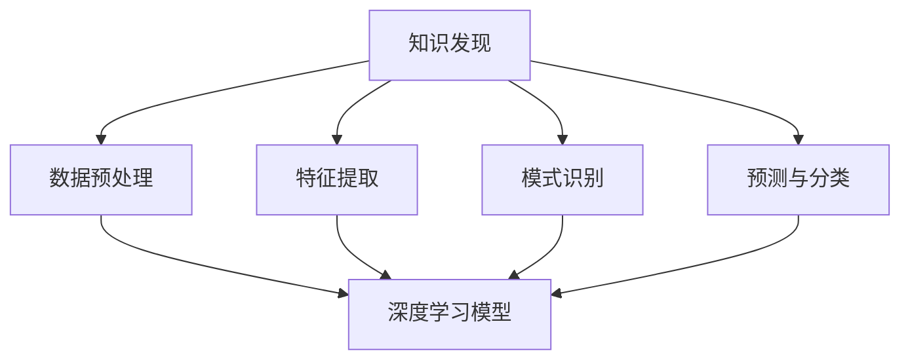

                 

 关键词：深度学习、知识发现、算法、应用场景、数学模型、实践实例、未来展望

> 摘要：本文深入探讨了深度学习在知识发现领域中的应用，分析了其核心概念、算法原理、数学模型，并通过具体实例展示了其实践过程。文章最后对未来发展趋势和面临的挑战进行了展望，为相关研究提供了有益的参考。

## 1. 背景介绍

### 1.1 知识发现的定义与重要性

知识发现（Knowledge Discovery in Databases，简称KDD）是指从大量数据中提取出具有潜在价值的信息和知识的过程。它涵盖了数据预处理、数据挖掘、模式评估和知识表示等多个阶段。知识发现的重要性在于，它可以帮助企业和组织从海量的数据中获取有用的洞察，从而做出更明智的决策。

### 1.2 深度学习的发展与优势

深度学习是一种基于多层神经网络的学习方法，通过模拟人脑神经网络的结构和功能，能够从大量数据中自动提取特征并学习复杂的非线性关系。随着计算能力的提升和大数据技术的发展，深度学习在图像识别、语音识别、自然语言处理等领域取得了显著的成果。

### 1.3 深度学习与知识发现的关系

深度学习在知识发现中的应用主要体现在以下几个方面：

1. **特征提取**：深度学习模型能够自动从原始数据中提取出高层次的抽象特征，从而降低数据处理的复杂性。
2. **模式识别**：深度学习模型在处理大规模、高维度数据时表现出强大的模式识别能力，有助于发现数据中的潜在规律。
3. **预测与分类**：深度学习模型可以用于预测和分类任务，为知识发现提供有效的决策支持。

## 2. 核心概念与联系

### 2.1 深度学习基本概念

在讨论深度学习在知识发现中的应用之前，我们需要了解一些基本概念，如图神经网络（GNN）、循环神经网络（RNN）和卷积神经网络（CNN）等。

#### 2.1.1 图神经网络（GNN）

图神经网络是一种专门用于处理图结构数据的神经网络模型。GNN通过学习节点和边之间的相互作用，能够有效地捕捉图结构中的局部和全局信息。

#### 2.1.2 循环神经网络（RNN）

循环神经网络是一种能够处理序列数据的神经网络模型。RNN通过循环结构，可以记住前面的输入信息，从而在序列处理任务中表现出强大的能力。

#### 2.1.3 卷积神经网络（CNN）

卷积神经网络是一种主要用于图像处理任务的神经网络模型。CNN通过卷积操作，能够有效地提取图像中的局部特征，并在图像分类和目标检测等领域取得了成功。

### 2.2 深度学习与知识发现的关系图

下面是一个使用Mermaid绘制的流程图，展示了深度学习与知识发现之间的关系：



## 3. 核心算法原理 & 具体操作步骤

### 3.1 算法原理概述

深度学习在知识发现中的应用主要包括以下几个核心算法：

1. **图神经网络（GNN）**：用于处理图结构数据，能够有效地提取节点和边之间的特征。
2. **循环神经网络（RNN）**：用于处理序列数据，能够在序列中捕捉长距离依赖关系。
3. **卷积神经网络（CNN）**：用于处理图像数据，能够提取图像中的局部特征。

### 3.2 算法步骤详解

1. **数据预处理**：包括数据清洗、数据整合和数据标准化等步骤，为深度学习模型的训练提供高质量的数据。
2. **特征提取**：使用深度学习模型（如GNN、RNN、CNN）对预处理后的数据进行特征提取，得到高层次的抽象特征。
3. **模式识别**：利用提取到的特征进行模式识别，发现数据中的潜在规律。
4. **预测与分类**：根据识别到的模式进行预测和分类，为知识发现提供决策支持。

### 3.3 算法优缺点

#### 优点：

1. **强大的特征提取能力**：深度学习模型能够自动提取数据中的高层次抽象特征，提高了知识发现的准确性。
2. **处理复杂数据结构**：深度学习模型能够处理各种复杂数据结构，如图、序列和图像等，适用于不同类型的知识发现任务。
3. **自适应学习**：深度学习模型能够根据数据分布自适应调整参数，提高了模型的泛化能力。

#### 缺点：

1. **计算成本高**：深度学习模型需要大量的计算资源，对硬件要求较高。
2. **数据需求量大**：深度学习模型需要大量的训练数据，对于数据稀缺的领域，深度学习模型的表现可能会受到影响。
3. **解释性差**：深度学习模型通常被视为“黑盒”，难以解释其内部决策过程，这在一些需要透明决策的场景中可能是一个问题。

### 3.4 算法应用领域

深度学习在知识发现领域有广泛的应用，包括但不限于以下领域：

1. **社会网络分析**：通过GNN分析社交网络中的关系结构，发现社交网络中的潜在社区和组织模式。
2. **文本挖掘**：使用RNN和CNN处理自然语言文本数据，提取语义特征，进行情感分析、主题建模等任务。
3. **图像识别与分类**：利用CNN处理图像数据，进行图像分类、目标检测等任务。
4. **推荐系统**：通过深度学习模型对用户行为数据进行分析，发现用户兴趣和行为模式，实现精准推荐。

## 4. 数学模型和公式 & 详细讲解 & 举例说明

### 4.1 数学模型构建

深度学习在知识发现中的应用通常涉及到以下数学模型：

1. **损失函数**：用于衡量模型预测结果与真实结果之间的差异，如交叉熵损失函数。
2. **优化算法**：用于调整模型参数，以最小化损失函数，如梯度下降算法。
3. **激活函数**：用于引入非线性关系，如ReLU函数。
4. **正则化方法**：用于防止过拟合，如dropout和L2正则化。

### 4.2 公式推导过程

以交叉熵损失函数为例，其推导过程如下：

$$
L(y, \hat{y}) = -\sum_{i=1}^{n} y_i \log(\hat{y}_i)
$$

其中，$y$为真实标签，$\hat{y}$为模型预测的概率分布。

### 4.3 案例分析与讲解

假设我们有一个二分类问题，其中每个类别的概率由以下公式给出：

$$
\hat{y}_i = \frac{1}{1 + e^{-z_i}}
$$

其中，$z_i$为神经网络的输出。

现在，我们有一个样本数据，其中真实标签为$y = 1$，模型预测的概率为$\hat{y} = 0.6$。使用交叉熵损失函数计算损失：

$$
L(y, \hat{y}) = -1 \cdot \log(0.6) = -0.7213
$$

随着模型训练的进行，我们希望损失函数的值逐渐减小，从而提高模型的预测准确性。

## 5. 项目实践：代码实例和详细解释说明

### 5.1 开发环境搭建

在开始项目实践之前，我们需要搭建一个合适的开发环境。以下是一个基本的Python开发环境搭建步骤：

1. 安装Python（版本3.6及以上）。
2. 安装深度学习库TensorFlow。
3. 安装数据处理库Pandas和NumPy。

### 5.2 源代码详细实现

以下是一个使用TensorFlow实现深度学习模型进行知识发现的示例代码：

```python
import tensorflow as tf
from tensorflow.keras.models import Sequential
from tensorflow.keras.layers import Dense, Dropout, Activation

# 数据预处理
# (此处省略数据预处理代码)

# 构建模型
model = Sequential()
model.add(Dense(64, input_dim=784, activation='relu'))
model.add(Dropout(0.5))
model.add(Dense(10, activation='softmax'))

# 编译模型
model.compile(loss='categorical_crossentropy',
              optimizer='adam',
              metrics=['accuracy'])

# 训练模型
model.fit(x_train, y_train,
          batch_size=128,
          epochs=10,
          validation_data=(x_val, y_val))

# 评估模型
loss, accuracy = model.evaluate(x_test, y_test)
print('Test accuracy:', accuracy)
```

### 5.3 代码解读与分析

1. **模型构建**：使用Sequential模型构建一个简单的神经网络，包含一个全连接层（Dense）和一个dropout层（Dropout）。
2. **编译模型**：设置损失函数、优化器和评价指标。
3. **训练模型**：使用fit函数进行模型训练，包括训练集和验证集。
4. **评估模型**：使用evaluate函数对模型进行测试集评估，打印测试集准确率。

通过这个示例代码，我们可以看到深度学习模型在知识发现中的应用过程。

## 6. 实际应用场景

### 6.1 社会网络分析

在社会网络分析中，深度学习模型可以用于分析社交网络中的用户关系，发现社交网络中的潜在社区和组织模式。以下是一个应用场景示例：

- **任务**：分析一个社交媒体平台上的用户关系，识别出潜在的用户社区。
- **数据**：用户关系数据、用户行为数据。
- **模型**：使用图神经网络（GNN）进行特征提取和模式识别。

### 6.2 文本挖掘

在文本挖掘中，深度学习模型可以用于处理自然语言文本数据，提取语义特征，进行情感分析、主题建模等任务。以下是一个应用场景示例：

- **任务**：对一篇新闻文章进行情感分析，判断其正面或负面情绪。
- **数据**：新闻文章文本数据。
- **模型**：使用循环神经网络（RNN）或卷积神经网络（CNN）进行特征提取和情感分类。

### 6.3 图像识别与分类

在图像识别与分类中，深度学习模型可以用于处理图像数据，进行图像分类、目标检测等任务。以下是一个应用场景示例：

- **任务**：对一组交通图像进行分类，识别出不同的交通标志。
- **数据**：交通图像数据。
- **模型**：使用卷积神经网络（CNN）进行特征提取和图像分类。

## 7. 工具和资源推荐

### 7.1 学习资源推荐

1. **《深度学习》（Goodfellow, Bengio, Courville著）：这是一本深度学习领域的经典教材，涵盖了深度学习的基本概念、算法和应用。**
2. **《Python深度学习》（François Chollet著）：这是一本针对Python编程语言的深度学习教程，适合初学者入门。**
3. **《统计学习方法》（李航著）：这是一本关于统计学习方法的经典教材，包括了许多与深度学习相关的内容。**

### 7.2 开发工具推荐

1. **TensorFlow：这是一个由Google开源的深度学习框架，适用于各种深度学习应用开发。**
2. **PyTorch：这是一个由Facebook开源的深度学习框架，以其灵活的动态计算图而闻名。**
3. **Keras：这是一个基于TensorFlow和Theano的深度学习高级API，提供了简洁的模型构建接口。**

### 7.3 相关论文推荐

1. **"Deep Learning for Social Network Analysis"（深度学习在社会网络分析中的应用）：这是一篇关于深度学习在社会网络分析中的应用的综述论文。**
2. **"Text Classification with Convolutional Neural Networks"（使用卷积神经网络进行文本分类）：这是一篇关于卷积神经网络在文本分类任务中的应用的论文。**
3. **"Object Detection with Deep Learning"（深度学习在目标检测中的应用）：这是一篇关于深度学习在目标检测任务中的应用的综述论文。**

## 8. 总结：未来发展趋势与挑战

### 8.1 研究成果总结

深度学习在知识发现领域取得了显著的成果，其在特征提取、模式识别、预测与分类等方面表现出了强大的能力。随着深度学习技术的不断进步，其在知识发现领域的应用将更加广泛和深入。

### 8.2 未来发展趋势

1. **跨领域应用**：深度学习在知识发现领域的应用将逐渐从单一领域扩展到跨领域，如医疗、金融、教育等。
2. **可解释性增强**：随着深度学习模型的复杂度增加，提高模型的可解释性将成为一个重要研究方向。
3. **硬件加速**：随着硬件技术的发展，如GPU、TPU等加速器的普及，将进一步提高深度学习模型的训练速度和效率。

### 8.3 面临的挑战

1. **数据稀缺**：在知识发现领域，特别是对于一些专业领域，数据稀缺是一个普遍问题，如何利用有限的数据进行有效的知识发现是一个挑战。
2. **计算资源需求**：深度学习模型对计算资源的需求较高，特别是在训练大规模模型时，如何高效地利用计算资源是一个挑战。
3. **隐私保护**：在处理个人隐私数据时，如何保护用户隐私是一个重要的挑战。

### 8.4 研究展望

未来，深度学习在知识发现领域的研究将更加注重模型的实用性、可解释性和效率。通过结合多源数据、引入新的算法和模型，将进一步提高知识发现的能力，为企业和组织提供更有价值的决策支持。

## 9. 附录：常见问题与解答

### 9.1 深度学习在知识发现中的应用有哪些？

深度学习在知识发现中的应用主要包括特征提取、模式识别、预测与分类等。具体包括：

1. **图神经网络（GNN）**：用于处理图结构数据，提取节点和边之间的特征。
2. **循环神经网络（RNN）**：用于处理序列数据，捕捉序列中的长距离依赖关系。
3. **卷积神经网络（CNN）**：用于处理图像数据，提取图像中的局部特征。

### 9.2 深度学习模型如何处理数据稀缺问题？

在数据稀缺的情况下，深度学习模型可以采用以下方法：

1. **数据增强**：通过生成合成数据，增加训练数据的多样性。
2. **迁移学习**：利用预训练的深度学习模型，对目标领域进行微调。
3. **少样本学习**：研究如何在数据稀缺的情况下，实现有效的模型训练和预测。

### 9.3 如何提高深度学习模型的可解释性？

提高深度学习模型的可解释性可以从以下几个方面入手：

1. **可视化技术**：使用可视化工具，如热力图、决策树等，展示模型内部的特征提取和决策过程。
2. **模型压缩**：通过模型压缩技术，降低模型复杂度，提高模型的可解释性。
3. **解释性算法**：开发专门的解释性算法，如LIME、SHAP等，对模型决策进行详细解释。

作者：禅与计算机程序设计艺术 / Zen and the Art of Computer Programming
```

