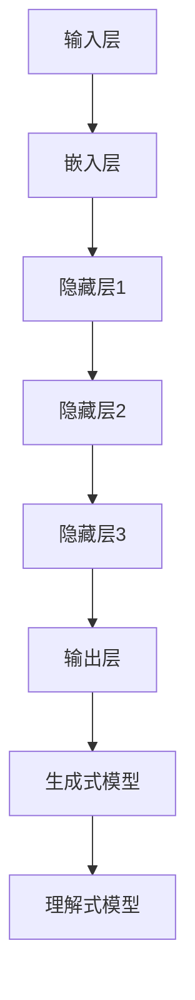

                 

关键词：深度学习、自然语言处理、生成式模型、理解式模型、神经网络、语义理解、语言生成、AI语言模型

> 摘要：本文深入探讨了深度学习在自然语言处理（NLP）领域的突破性进展，特别是其在理解和生成语言方面的应用。文章首先回顾了NLP的历史，然后详细阐述了深度学习模型的工作原理，包括生成式模型和理解式模型。通过具体的案例分析和数学公式推导，本文展示了深度学习模型如何实现高质量的语言理解和生成。最后，文章探讨了深度学习在NLP领域的未来发展趋势和面临的挑战。

## 1. 背景介绍

自然语言处理（NLP）是人工智能领域的一个重要分支，旨在使计算机能够理解、处理和生成自然语言。自20世纪50年代以来，NLP经历了从规则驱动的方法到基于统计的方法，再到当前基于深度学习的方法的演变。早期的NLP系统依赖于手工编写的规则和模式，这些方法在处理简单和规则性强的语言任务时表现良好，但在处理复杂和灵活的自然语言时存在显著限制。

随着计算能力和算法的发展，基于统计的方法逐渐取代了规则驱动的方法。这种方法利用大规模语料库来训练模型，从而学习语言的特征和规律。然而，统计方法在处理语义理解和上下文依赖方面仍然存在困难。

近年来，深度学习在图像识别、语音识别等领域取得了显著成功，这一成功也激发了研究者将其应用于自然语言处理。深度学习模型，尤其是神经网络，通过自动学习语言数据的复杂结构，实现了对自然语言的深刻理解。本文将重点探讨深度学习在NLP领域，特别是在理解和生成语言方面的突破。

## 2. 核心概念与联系

### 2.1 深度学习模型的基本原理

深度学习模型是构建在多层神经网络之上的机器学习模型。神经网络由一系列相互连接的节点（或称为神经元）组成，这些节点通过加权连接传递信息。深度学习模型通过多层次的非线性变换来提取数据中的特征，这些特征可以用于不同类型的任务，如图像分类、语音识别和自然语言处理。

在自然语言处理中，深度学习模型通常包括以下几层：

1. **输入层**：接收原始文本数据，如单词或词向量。
2. **嵌入层**：将文本数据转换为固定长度的向量表示，这些向量包含了文本的语义信息。
3. **隐藏层**：多层隐藏层通过卷积神经网络（CNN）、循环神经网络（RNN）或变换器（Transformer）等结构提取高级特征。
4. **输出层**：根据任务的类型，输出层可以是分类层、回归层或另一个词向量层。

### 2.2 生成式模型与理解式模型

在NLP中，生成式模型（Generative Models）和理解式模型（Discriminative Models）是两种主要的深度学习模型。

**生成式模型**：这种模型通过学习数据分布来生成新的数据。在NLP中，生成式模型可以生成新的文本、语音或图像。例如，生成对抗网络（GAN）就是一种生成式模型，它通过两个神经网络（生成器和判别器）的对抗训练来生成高质量的数据。在文本生成方面，变分自编码器（VAE）和生成式预训练（GPT）模型也非常有效。

**理解式模型**：这种模型旨在从数据中学习特征，以区分不同类别的数据。在NLP中，理解式模型通常用于文本分类、情感分析、命名实体识别等任务。常见的理解式模型包括支持向量机（SVM）、决策树、神经网络等。

### 2.3 Mermaid 流程图

以下是一个简单的Mermaid流程图，展示了深度学习模型在自然语言处理中的应用：

## 3. 核心算法原理 & 具体操作步骤

### 3.1 算法原理概述

深度学习模型的核心在于其多层网络结构，这使得模型能够从原始数据中提取高级特征。在自然语言处理中，深度学习模型通常分为两个主要方向：生成式模型和理解式模型。

**生成式模型**：这类模型旨在生成与训练数据相似的新数据。生成式模型通过学习数据分布来生成文本、图像或语音。常见的生成式模型包括：

- 生成对抗网络（GAN）
- 变分自编码器（VAE）
- 生成式预训练（GPT）模型

**理解式模型**：这类模型旨在从数据中学习特征，以区分不同类别的数据。在NLP中，理解式模型通常用于文本分类、情感分析、命名实体识别等任务。常见

