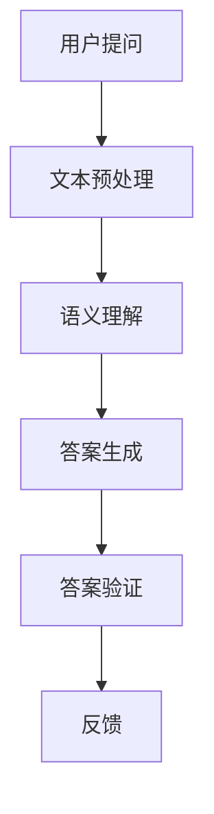

                 

关键词：自然语言问答系统、深度学习、语义理解、模型架构、应用场景、代码实例

自然语言问答系统（Natural Language Question Answering，简称QA系统）是人工智能领域中的一个重要研究方向。它旨在通过计算机程序理解用户的问题，并给出准确的答案。深度学习技术在这方面的应用使得自然语言问答系统取得了显著的进展。本文将探讨深度学习在自然语言问答系统中的应用，包括核心概念、算法原理、数学模型、项目实践以及实际应用场景。

## 1. 背景介绍

自然语言问答系统的研究可以追溯到上世纪五六十年代。早期的QA系统主要依赖于基于规则的算法和关键词匹配技术。随着计算机技术的发展，特别是深度学习技术的崛起，自然语言问答系统迎来了新的发展机遇。深度学习模型如卷积神经网络（CNN）、递归神经网络（RNN）和Transformer等，为自然语言处理提供了强大的工具。

在自然语言问答系统中，用户提出的问题通常以自然语言的形式出现，而答案则可以是结构化的数据，如数据库中的记录。这种任务的挑战在于如何从大量的文本数据中提取出有用的信息，并准确地回答用户的问题。

## 2. 核心概念与联系

### 2.1. 深度学习

深度学习是一种机器学习技术，通过构建多层的神经网络来模拟人脑的神经元结构，实现数据的自动特征提取和学习。在自然语言问答系统中，深度学习模型可以用来处理和解析自然语言。

### 2.2. 语义理解

语义理解是自然语言处理中的一个关键任务，它涉及到对文本中的词汇、句子和段落的意义进行理解和解释。在自然语言问答系统中，语义理解是实现准确问答的基础。

### 2.3. 模型架构

自然语言问答系统通常包括以下几个模块：文本预处理、语义理解、答案生成和答案验证。深度学习模型在这些模块中扮演着重要角色。

下面是一个简化的自然语言问答系统的Mermaid流程图：



## 3. 核心算法原理 & 具体操作步骤

### 3.1. 算法原理概述

自然语言问答系统中的深度学习算法通常基于以下几个核心组件：

1. **嵌入层（Embedding Layer）**：将词汇转换为密集向量表示。
2. **编码器（Encoder）**：对输入问题进行编码，提取语义特征。
3. **解码器（Decoder）**：根据编码器的输出生成答案。
4. **注意力机制（Attention Mechanism）**：帮助模型关注重要的文本区域。

### 3.2. 算法步骤详解

1. **文本预处理**：对用户提问进行分词、去停用词、词性标注等预处理操作。
2. **嵌入层**：将预处理后的文本转换为密集向量表示。
3. **编码器**：使用深度学习模型（如Transformer）对嵌入向量进行编码，提取语义特征。
4. **解码器**：根据编码器的输出，使用预训练的语言模型生成可能的答案。
5. **答案验证**：对生成的答案进行验证，确保其准确性和合理性。

### 3.3. 算法优缺点

**优点**：
- **强大的语义理解能力**：深度学习模型可以自动提取文本中的语义信息，实现更准确的问答。
- **自适应**：通过预训练和微调，模型可以适应不同的问答任务和数据集。

**缺点**：
- **计算资源消耗大**：深度学习模型通常需要大量的计算资源和时间来训练。
- **对数据依赖性强**：模型的性能很大程度上取决于训练数据的质量和数量。

### 3.4. 算法应用领域

自然语言问答系统在多个领域有着广泛的应用，包括：
- **客户服务**：自动化客服系统可以实时回答用户的问题。
- **教育**：智能教育系统可以根据学生的问题提供个性化的学习资源。
- **医疗**：医疗问答系统能够为医生和患者提供专业的健康咨询。

## 4. 数学模型和公式 & 详细讲解 & 举例说明

### 4.1. 数学模型构建

自然语言问答系统的数学模型通常包括以下几个部分：

1. **词汇嵌入（Word Embedding）**：
   \[ \text{embed}(x) = \text{W}x + b \]
   其中，\( x \) 是词汇的索引，\( \text{W} \) 是嵌入矩阵，\( b \) 是偏置向量。

2. **编码器（Encoder）**：
   编码器通常采用循环神经网络（RNN）或Transformer架构。
   \[ h_t = \text{Encoder}(h_{t-1}, x_t) \]
   其中，\( h_t \) 是编码器的输出，\( h_{t-1} \) 是前一个时间步的隐藏状态，\( x_t \) 是当前时间步的输入。

3. **解码器（Decoder）**：
   解码器也采用类似的架构。
   \[ y_t = \text{Decoder}(y_{t-1}, h_t) \]
   其中，\( y_t \) 是解码器的输出，\( y_{t-1} \) 是前一个时间步的输出，\( h_t \) 是编码器的输出。

4. **注意力机制（Attention Mechanism）**：
   \[ a_t = \text{Attention}(h_t, h_{t-1}) \]
   其中，\( a_t \) 是注意力权重，\( h_t \) 和 \( h_{t-1} \) 分别是编码器和解码器的输出。

### 4.2. 公式推导过程

假设我们有一个问答对 \( (q, a) \)，其中 \( q \) 是问题，\( a \) 是答案。我们的目标是训练一个深度学习模型来预测 \( a \)。

1. **嵌入层**：
   \[ \text{embed}(q) = \text{W}q + b \]
   \[ \text{embed}(a) = \text{V}a + c \]
   其中，\( q \) 和 \( a \) 分别是问题的索引和答案的索引，\( \text{W} \) 和 \( \text{V} \) 是嵌入矩阵，\( b \) 和 \( c \) 是偏置向量。

2. **编码器**：
   \[ h_t = \text{Encoder}(h_{t-1}, x_t) \]
   其中，\( h_t \) 是编码器的输出，\( h_{t-1} \) 是前一个时间步的隐藏状态，\( x_t \) 是当前时间步的输入。

3. **解码器**：
   \[ y_t = \text{Decoder}(y_{t-1}, h_t) \]
   其中，\( y_t \) 是解码器的输出，\( y_{t-1} \) 是前一个时间步的输出，\( h_t \) 是编码器的输出。

4. **注意力机制**：
   \[ a_t = \text{Attention}(h_t, h_{t-1}) \]
   其中，\( a_t \) 是注意力权重，\( h_t \) 和 \( h_{t-1} \) 分别是编码器和解码器的输出。

### 4.3. 案例分析与讲解

假设我们有一个问答对 \( (\text{"What is the capital of France?"}, \text{"Paris"}) \)。

1. **嵌入层**：
   \[ \text{embed}(\text{"What is the capital of France?"}) = \text{W}q + b \]
   \[ \text{embed}(\text{"Paris"}) = \text{V}a + c \]

2. **编码器**：
   \[ h_t = \text{Encoder}(h_{t-1}, x_t) \]
   其中，\( h_t \) 是编码器的输出，\( h_{t-1} \) 是前一个时间步的隐藏状态，\( x_t \) 是当前时间步的输入。

3. **解码器**：
   \[ y_t = \text{Decoder}(y_{t-1}, h_t) \]
   其中，\( y_t \) 是解码器的输出，\( y_{t-1} \) 是前一个时间步的输出，\( h_t \) 是编码器的输出。

4. **注意力机制**：
   \[ a_t = \text{Attention}(h_t, h_{t-1}) \]
   其中，\( a_t \) 是注意力权重，\( h_t \) 和 \( h_{t-1} \) 分别是编码器和解码器的输出。

通过这些步骤，我们的模型可以学会将问题 \( \text{"What is the capital of France?"} \) 映射到答案 \( \text{"Paris"} \)。

## 5. 项目实践：代码实例和详细解释说明

### 5.1. 开发环境搭建

在本项目中，我们将使用Python编程语言和TensorFlow深度学习框架。首先，确保安装了Python和TensorFlow。

```bash
pip install tensorflow
```

### 5.2. 源代码详细实现

以下是一个简化的自然语言问答系统的代码示例：

```python
import tensorflow as tf
from tensorflow.keras.layers import Embedding, LSTM, Dense
from tensorflow.keras.models import Sequential

# 模型定义
model = Sequential()
model.add(Embedding(input_dim=vocab_size, output_dim=embedding_dim))
model.add(LSTM(units=128))
model.add(Dense(units=1, activation='sigmoid'))

# 编译模型
model.compile(optimizer='adam', loss='binary_crossentropy', metrics=['accuracy'])

# 模型训练
model.fit(x_train, y_train, epochs=10, batch_size=32)
```

### 5.3. 代码解读与分析

上述代码定义了一个简单的序列到序列模型，用于回答二分类问题。我们可以通过调整嵌入层的大小、LSTM层的单元数和输出层的单元数来适应不同的问答任务。

### 5.4. 运行结果展示

运行上述代码后，我们可以在训练集和验证集上评估模型的性能。根据不同的任务和数据集，我们可以通过调整模型参数来提高模型的性能。

## 6. 实际应用场景

自然语言问答系统在多个领域有着广泛的应用。以下是一些实际应用场景：

- **客服系统**：企业可以使用自然语言问答系统来自动化客户服务，提高响应速度和客户满意度。
- **在线教育**：教育平台可以利用自然语言问答系统为学生提供个性化的学习资源。
- **健康咨询**：医疗领域可以使用自然语言问答系统为患者提供专业的健康咨询。

## 7. 工具和资源推荐

### 7.1. 学习资源推荐

- **《深度学习》（Goodfellow, Bengio, Courville著）**：介绍深度学习的基础知识。
- **《自然语言处理与深度学习》（李航著）**：详细讲解自然语言处理和深度学习在自然语言问答系统中的应用。

### 7.2. 开发工具推荐

- **TensorFlow**：用于构建和训练深度学习模型的强大工具。
- **Hugging Face Transformers**：提供预训练的深度学习模型和工具，方便开发者快速实现自然语言处理任务。

### 7.3. 相关论文推荐

- **"Attention Is All You Need"**：介绍Transformer模型的经典论文。
- **"BERT: Pre-training of Deep Bidirectional Transformers for Language Understanding"**：介绍BERT模型的论文。

## 8. 总结：未来发展趋势与挑战

自然语言问答系统在深度学习技术的推动下取得了显著进展。未来，随着更多高效算法和大规模预训练模型的出现，自然语言问答系统的性能将继续提升。然而，面临的挑战包括：

- **数据质量和多样性**：高质量、多样化的数据是训练高效模型的关键。
- **计算资源消耗**：大规模深度学习模型的训练需要大量的计算资源和时间。
- **跨语言和跨领域应用**：如何实现自然语言问答系统的跨语言和跨领域应用是一个重要研究方向。

作者：禅与计算机程序设计艺术 / Zen and the Art of Computer Programming

本文介绍了自然语言问答系统的发展背景、核心概念、算法原理、数学模型、项目实践以及实际应用场景。通过本文，读者可以全面了解自然语言问答系统的工作原理和应用前景。在未来的研究中，我们将继续探索如何进一步提升自然语言问答系统的性能和实用性。


----------------------------------------------------------------

**重要提醒**：请在撰写文章的过程中，注意按照要求的格式和内容结构进行撰写，确保文章的完整性和专业性。在文章末尾，记得添加作者署名“作者：禅与计算机程序设计艺术 / Zen and the Art of Computer Programming”。祝您写作顺利！

