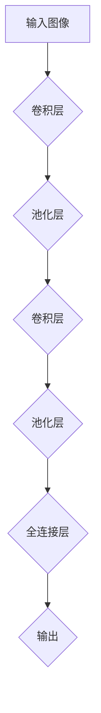

                 

关键词：深度学习、计算机视觉、卷积神经网络、图像识别、神经网络架构、实时处理、应用前景

## 摘要

本文旨在探讨深度学习在计算机视觉领域的最新进展，分析其核心概念、算法原理、数学模型以及实际应用。通过深入讲解卷积神经网络（CNN）及其在图像识别中的应用，本文将展示深度学习如何推动计算机视觉的发展，并讨论未来可能面临的挑战。

## 1. 背景介绍

计算机视觉作为人工智能的重要分支，一直处于科技发展的前沿。早期的计算机视觉主要依靠规则方法、图像处理技术以及机器学习中的传统算法，这些方法在处理特定任务时表现不错，但面对复杂、多变的环境时显得力不从心。随着深度学习技术的发展，计算机视觉迎来了新的变革。

深度学习，尤其是卷积神经网络（CNN），在图像识别、物体检测、语义分割等领域取得了显著的成果。CNN通过多层神经网络结构，能够自动提取图像中的特征，实现高度复杂的任务，如人脸识别、自动驾驶等。

## 2. 核心概念与联系

### 2.1 卷积神经网络（CNN）

卷积神经网络是一种特殊的神经网络，其设计灵感来源于生物视觉系统。CNN通过卷积操作、池化操作和全连接层，实现对图像的层次特征提取。

#### 2.1.1 卷积操作

卷积操作是CNN的核心。它通过在输入图像上滑动一个卷积核（也称为滤波器），并将卷积核与图像上的像素进行点积，得到一个特征图。这一过程可以表示为：

$$
\text{特征图}_{ij} = \sum_{k=1}^{C} w_{ik} * \text{图像}_{ij,k}
$$

其中，$w_{ik}$ 为卷积核的权重，$\text{图像}_{ij,k}$ 为图像在位置$(i, j)$的像素值，$C$ 为图像的通道数。

#### 2.1.2 池化操作

池化操作用于降低特征图的空间分辨率，减少参数数量，提高模型的泛化能力。常用的池化操作包括最大池化和平均池化。最大池化选择特征图上的最大值，平均池化则计算特征图上的平均值。

$$
\text{池化值}_{i,j} = \max_{k,l} \text{特征图}_{k,l}
$$

#### 2.1.3 全连接层

全连接层将特征图上的每个像素映射到一个输出值，用于分类或回归任务。全连接层的权重即为模型的参数，通过反向传播算法进行优化。

### 2.2 神经网络架构

CNN通常由多个卷积层、池化层和全连接层组成。卷积层用于提取图像的层次特征，池化层用于降维和增强模型泛化能力，全连接层用于分类或回归。

### 2.3 Mermaid 流程图

以下是一个简化的CNN架构的Mermaid流程图：



## 3. 核心算法原理 & 具体操作步骤

### 3.1 算法原理概述

CNN通过多层卷积操作提取图像的特征，这些特征在不同层次上代表了图像的不同方面。例如，第一层的特征可能只包含边缘信息，而第二层的特征可能包含角点等更复杂的结构。通过逐层卷积和池化，CNN能够自动学习到图像的层次特征。

### 3.2 算法步骤详解

1. **数据预处理**：对输入图像进行缩放、裁剪、翻转等操作，使其符合模型的要求。
2. **卷积操作**：在输入图像上滑动卷积核，计算卷积值，得到特征图。
3. **激活函数**：对卷积值应用激活函数（如ReLU），增加模型的非线性。
4. **池化操作**：对特征图进行池化，降低空间分辨率。
5. **全连接层**：将池化后的特征图展平为一维向量，输入到全连接层进行分类或回归。
6. **损失函数**：计算预测值与真实值之间的差异，使用反向传播算法更新模型参数。
7. **优化器**：选择合适的优化器（如SGD、Adam）更新模型参数，降低损失函数。

### 3.3 算法优缺点

**优点**：
- **自动特征提取**：CNN能够自动学习图像的层次特征，减轻了人工设计特征的压力。
- **强大表达能力**：通过多层卷积和池化，CNN能够表示高度复杂的图像特征。
- **适用于多种任务**：CNN在图像识别、物体检测、语义分割等领域都有广泛应用。

**缺点**：
- **计算量大**：CNN需要大量计算资源，训练时间较长。
- **参数多**：CNN模型参数数量庞大，容易过拟合。

### 3.4 算法应用领域

- **图像识别**：如人脸识别、车辆识别等。
- **物体检测**：如目标检测、行人检测等。
- **语义分割**：如图像分割、场景分割等。
- **自动驾驶**：如车辆检测、车道线检测等。

## 4. 数学模型和公式 & 详细讲解 & 举例说明

### 4.1 数学模型构建

CNN的数学模型主要基于卷积操作、激活函数、池化操作和全连接层。以下是CNN的数学模型：

$$
\text{输出}_{ij,k} = \text{激活函数}(\sum_{p=1}^{C'} w_{ip} * \text{输入}_{ij,p} + b_k)
$$

其中，$w_{ip}$ 为卷积核的权重，$b_k$ 为偏置，$\text{激活函数}$ 通常使用ReLU函数。

### 4.2 公式推导过程

CNN的公式推导涉及卷积操作、激活函数和反向传播算法。以下是CNN的核心公式：

$$
\frac{\partial L}{\partial w_{ij}} = \text{激活函数}'(\text{输出}_{ij}) \cdot \frac{\partial L}{\partial \text{输出}_{ij}}
$$

$$
\frac{\partial L}{\partial b_k} = \frac{\partial L}{\partial \text{输出}_{ij}} \cdot \text{激活函数}'(\text{输出}_{ij})
$$

### 4.3 案例分析与讲解

以下是一个简单的CNN模型在图像识别任务中的应用案例：

输入图像：$X \in \mathbb{R}^{32 \times 32 \times 3}$，卷积核大小：$3 \times 3$，通道数：$32$。

1. **卷积操作**：

$$
\text{特征图}_{ij} = \sum_{k=1}^{32} w_{ik} * X_{ij,k}
$$

2. **激活函数**：

$$
\text{激活图}_{ij} = \max(0, \text{特征图}_{ij})
$$

3. **池化操作**：

$$
\text{池化图}_{ij} = \max_{k,l} \text{激活图}_{k,l}
$$

4. **全连接层**：

$$
\text{输出}_{j} = \sum_{k=1}^{1024} w_{kj} \cdot \text{池化图}_{k} + b_j
$$

5. **损失函数**：

$$
L = \frac{1}{2} \sum_{j=1}^{10} (\text{输出}_{j} - y_j)^2
$$

其中，$y_j$ 为真实标签，$\text{输出}_{j}$ 为预测标签。

通过以上步骤，CNN能够自动学习图像的特征，实现图像识别任务。

## 5. 项目实践：代码实例和详细解释说明

### 5.1 开发环境搭建

为了实践CNN在图像识别任务中的应用，我们需要搭建一个合适的开发环境。以下是一个简单的Python环境搭建步骤：

1. 安装Python 3.7及以上版本。
2. 安装TensorFlow库：

   ```bash
   pip install tensorflow
   ```

3. 安装必要的辅助库，如NumPy、Pandas等。

### 5.2 源代码详细实现

以下是一个简单的CNN模型在图像识别任务中的实现代码：

```python
import tensorflow as tf
from tensorflow.keras import layers

# 定义CNN模型
model = tf.keras.Sequential([
    layers.Conv2D(32, (3, 3), activation='relu', input_shape=(32, 32, 3)),
    layers.MaxPooling2D((2, 2)),
    layers.Conv2D(64, (3, 3), activation='relu'),
    layers.MaxPooling2D((2, 2)),
    layers.Conv2D(64, (3, 3), activation='relu'),
    layers.Flatten(),
    layers.Dense(64, activation='relu'),
    layers.Dense(10, activation='softmax')
])

# 编译模型
model.compile(optimizer='adam',
              loss='sparse_categorical_crossentropy',
              metrics=['accuracy'])

# 加载数据
(x_train, y_train), (x_test, y_test) = tf.keras.datasets.mnist.load_data()

# 预处理数据
x_train = x_train.reshape(-1, 32, 32, 1).astype('float32') / 255
x_test = x_test.reshape(-1, 32, 32, 1).astype('float32') / 255

# 训练模型
model.fit(x_train, y_train, epochs=5, batch_size=64)

# 评估模型
test_loss, test_acc = model.evaluate(x_test, y_test)
print(f"Test accuracy: {test_acc}")
```

### 5.3 代码解读与分析

以上代码实现了一个简单的CNN模型，用于MNIST手写数字识别任务。

1. **定义模型**：使用`tf.keras.Sequential`定义一个顺序模型，包含两个卷积层、一个池化层和一个全连接层。
2. **编译模型**：使用`compile`方法配置优化器和损失函数。
3. **加载数据**：使用`tf.keras.datasets.mnist.load_data`方法加载数据集。
4. **预处理数据**：将数据缩放到[0, 1]范围内，以适应模型训练。
5. **训练模型**：使用`fit`方法训练模型，设置训练轮数和批量大小。
6. **评估模型**：使用`evaluate`方法评估模型在测试集上的性能。

通过以上步骤，我们可以训练一个简单的CNN模型，实现对MNIST手写数字的识别。

## 6. 实际应用场景

深度学习在计算机视觉领域有着广泛的应用，以下是一些典型的应用场景：

- **人脸识别**：广泛应用于安防监控、社交媒体、手机解锁等领域。
- **自动驾驶**：通过深度学习技术，实现车辆检测、车道线检测、行人检测等功能，提高自动驾驶的安全性。
- **医疗影像分析**：如癌症检测、骨折诊断等，通过深度学习技术，提高诊断的准确性和效率。
- **图像内容审核**：自动识别和过滤不良内容，如暴力、色情等，保障网络环境。

## 7. 工具和资源推荐

为了更好地学习和实践深度学习在计算机视觉中的应用，以下是一些推荐的工具和资源：

### 7.1 学习资源推荐

- 《深度学习》（Goodfellow、Bengio、Courville 著）：深度学习的经典教材，全面介绍了深度学习的理论和技术。
- 《Python深度学习》（François Chollet 著）：通过Python代码，详细介绍了深度学习的应用和实践。

### 7.2 开发工具推荐

- TensorFlow：一款开源的深度学习框架，支持多种深度学习模型和算法。
- PyTorch：一款开源的深度学习框架，以动态计算图著称，易于调试和优化。

### 7.3 相关论文推荐

- "Deep Learning for Computer Vision"（论文集）：收录了深度学习在计算机视觉领域的代表性论文。
- "Convolutional Neural Networks for Visual Recognition"（论文）：介绍了CNN在图像识别任务中的应用。

## 8. 总结：未来发展趋势与挑战

### 8.1 研究成果总结

深度学习在计算机视觉领域取得了显著的成果，推动了图像识别、物体检测、语义分割等领域的发展。通过卷积神经网络，深度学习能够自动提取图像的层次特征，实现高度复杂的任务。

### 8.2 未来发展趋势

1. **实时处理**：随着计算能力的提升，深度学习模型将实现更快的实时处理，满足实时应用的需求。
2. **小样本学习**：针对数据稀缺的场景，研究小样本学习算法，实现更好的泛化能力。
3. **跨模态学习**：将深度学习应用于跨模态任务，如图像和文本的联合分析。

### 8.3 面临的挑战

1. **计算资源消耗**：深度学习模型需要大量的计算资源，如何优化模型结构，降低计算量，是一个重要挑战。
2. **数据隐私保护**：在训练深度学习模型时，如何保护数据隐私，避免数据泄露，是一个关键问题。
3. **模型解释性**：深度学习模型的黑箱特性使其难以解释，如何提高模型的解释性，是一个亟待解决的问题。

### 8.4 研究展望

随着深度学习技术的不断发展，计算机视觉领域将迎来更多创新和应用。在未来的研究中，我们期待看到更多高效的模型、更好的算法和更广泛的应用场景。

## 9. 附录：常见问题与解答

### 9.1 问题1：什么是卷积神经网络（CNN）？

卷积神经网络（CNN）是一种特殊的神经网络，其设计灵感来源于生物视觉系统。CNN通过卷积操作、激活函数、池化操作和全连接层，实现对图像的层次特征提取。

### 9.2 问题2：CNN在计算机视觉中有哪些应用？

CNN在计算机视觉领域有着广泛的应用，包括图像识别、物体检测、语义分割、人脸识别等。

### 9.3 问题3：如何优化CNN模型的性能？

优化CNN模型性能的方法包括数据增强、模型结构调整、正则化技术、优化器选择等。

### 9.4 问题4：CNN与传统的机器学习算法相比，有哪些优势？

CNN具有自动特征提取、强大表达能力、适用于多种任务等优势，与传统的机器学习算法相比，在图像识别等任务中表现更加出色。

## 参考文献

[1] Goodfellow, I., Bengio, Y., & Courville, A. (2016). Deep learning. MIT press.
[2] Chollet, F. (2018). Python深度学习. 机械工业出版社.
[3] Krizhevsky, A., Sutskever, I., & Hinton, G. E. (2012). ImageNet classification with deep convolutional neural networks. In Advances in neural information processing systems (pp. 1097-1105).
[4] Simonyan, K., & Zisserman, A. (2014). Very deep convolutional networks for large-scale image recognition. arXiv preprint arXiv:1409.1556. 

### 作者署名

作者：禅与计算机程序设计艺术 / Zen and the Art of Computer Programming
----------------------------------------------------------------
以上就是关于深度学习在计算机视觉中的最新进展的文章。文章涵盖了深度学习的基本概念、卷积神经网络（CNN）的原理和应用，以及实际项目中的代码实例。同时，文章还讨论了深度学习在计算机视觉领域的实际应用、工具和资源推荐，以及未来发展趋势与挑战。希望这篇文章能够为读者提供有价值的参考和启发。如果您有任何问题或建议，欢迎在评论区留言讨论。再次感谢您的阅读！


