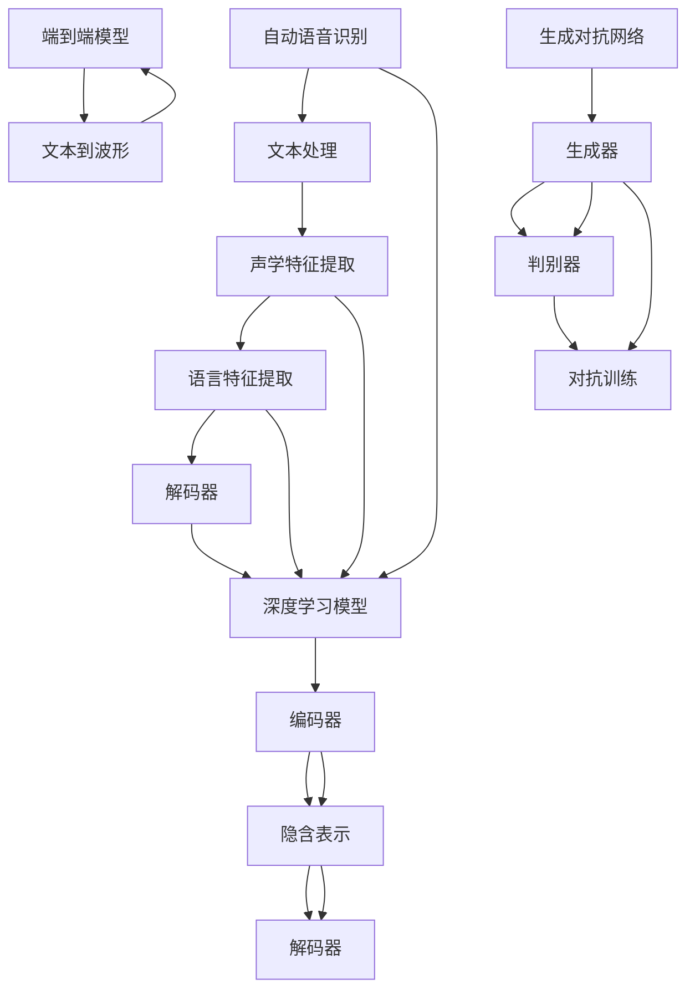

                 

关键词：深度学习，语音合成，神经网络，自动语音识别，端到端模型，语音增强，语音识别系统，自适应学习，生成对抗网络，语音质量评估。

## 摘要

本文旨在探讨深度学习在语音合成领域的最新进展，包括其核心概念、算法原理、数学模型、项目实践以及未来应用展望。文章结构如下：

1. 背景介绍
2. 核心概念与联系
3. 核心算法原理 & 具体操作步骤
4. 数学模型和公式 & 详细讲解 & 举例说明
5. 项目实践：代码实例和详细解释说明
6. 实际应用场景
7. 工具和资源推荐
8. 总结：未来发展趋势与挑战
9. 附录：常见问题与解答

通过本文，读者将深入了解深度学习如何改变语音合成技术，并了解该领域的前沿技术和发展方向。

## 1. 背景介绍

语音合成（Text-to-Speech，TTS）是人工智能领域中的一个重要分支，它旨在将文本转化为自然流畅的语音。传统的语音合成技术主要依赖于规则的文本和语音库进行合成，这些方法虽然在一定程度上能够实现语音合成，但生成的语音往往缺乏自然性和个性化。

随着深度学习技术的发展，尤其是神经网络在语音处理领域的广泛应用，语音合成技术得到了极大的提升。深度学习通过模拟人脑的神经网络结构，能够从大量数据中学习到复杂的模式，从而实现更为自然和个性化的语音合成。

目前，深度学习在语音合成领域的研究主要聚焦于以下几个方向：

- 端到端模型：通过构建直接从文本到语音的模型，避免了传统方法中复杂的前处理和后处理过程，提高了合成效率。
- 语音增强：通过深度学习技术改善语音质量，使其更加清晰、自然。
- 自适应学习：根据用户的语音偏好和环境自适应地调整合成语音的特性。
- 生成对抗网络（GAN）：通过对抗训练生成逼真的语音。

这些技术的发展为语音合成带来了前所未有的机遇和挑战，本文将详细探讨这些前沿技术，并分析其在实际应用中的潜力。

### 语音合成的历史

语音合成技术的起源可以追溯到20世纪50年代，当时的科学家们开始探索如何将计算机生成的语音应用于通信和辅助交流。最早的语音合成系统依赖于规则驱动的方法，这些方法依赖于预定义的语音规则和大量的语音数据库。其中，两种主要的合成技术是合成单元模型（Unit Selection）和参数合成模型（Parameter Synthesis）。

合成单元模型通过从大规模语音数据库中选择和拼接最匹配的语音单元（如音节、单词或短语）来合成语音。这种方法的关键在于如何高效地搜索和选择合适的语音单元，以实现自然流畅的语音输出。参数合成模型则通过生成语音信号的基本参数（如频率、时长、振幅等）来合成语音，这种方法在技术上更为复杂，但能够生成更为逼真的语音。

20世纪80年代，隐藏马尔可夫模型（HMM）的出现极大地推动了语音合成技术的发展。HMM结合了统计方法和语音信号处理技术，能够更好地捕捉语音信号的时间和频率特性。这一时期，语音合成系统开始应用在电话语音信箱、语音导航和语音助手等领域。

进入21世纪，深度学习技术的崛起为语音合成带来了革命性的变化。特别是卷积神经网络（CNN）和递归神经网络（RNN）的出现，使得语音合成系统在语音识别和语音生成方面的性能大幅提升。这些深度学习模型能够通过大量的语音数据自动学习语音特征，从而生成更加自然和个性化的语音。

近年来，端到端模型和生成对抗网络（GAN）等新型深度学习技术的应用，进一步推动了语音合成技术的发展。端到端模型直接将文本输入映射到语音输出，避免了传统方法的复杂预处理和后处理过程，显著提高了合成效率。生成对抗网络通过对抗训练生成高质量的语音样本，为语音合成带来了更高的真实感和自然性。

总体来说，语音合成技术从规则驱动到统计模型，再到深度学习的演变，展示了人工智能技术在语音处理领域的持续进步和创新。

### 深度学习在语音合成中的应用

深度学习在语音合成中的应用主要得益于其强大的学习和泛化能力。传统的语音合成技术往往依赖于大量预定义的规则和语音库，而深度学习模型则通过从大规模数据中学习，自动提取和表示复杂的语音特征，从而实现更高效、更自然的语音合成。

首先，卷积神经网络（CNN）在语音合成中有着重要的应用。CNN擅长处理网格数据，如图像和音频。在语音合成中，CNN可以用于特征提取，提取文本和语音信号中的高维特征，如音素、声调和共振峰等。这些特征有助于构建高质量的语音合成模型。

递归神经网络（RNN）是另一种在语音合成中广泛使用的深度学习模型。RNN具有处理序列数据的优势，能够捕捉语音信号的时间动态特性。特别是在长序列文本到语音的转换中，RNN表现出色。RNN的变体，如长短期记忆网络（LSTM）和门控循环单元（GRU），通过引入记忆单元和门控机制，进一步增强了模型处理长序列数据的能力。

变分自编码器（VAE）和生成对抗网络（GAN）是近年来在语音合成中崭露头角的深度学习技术。VAE通过变分推理机制生成高质量的数据，在语音合成中，VAE可以用于生成自然流畅的语音样本。GAN则通过对抗训练生成逼真的语音，其生成能力在语音合成中得到了广泛验证。

端到端模型是深度学习在语音合成中应用的一大亮点。端到端模型直接将文本输入映射到语音输出，避免了传统方法的复杂预处理和后处理过程，显著提高了合成效率。例如，WaveNet和Tacotron等模型，通过端到端的架构，实现了从文本到语音的实时转换，为实时语音合成应用提供了可能。

深度学习模型在语音合成中的应用不仅提升了合成质量，还带来了更多的可能性。例如，通过迁移学习，可以将预训练的语音模型应用于不同的任务和领域，如个性化语音合成、多语言语音合成等。此外，深度学习模型还可以与其他人工智能技术结合，如自然语言处理（NLP）、语音识别等，实现更智能的语音合成系统。

总的来说，深度学习为语音合成带来了巨大的变革，通过不断优化模型结构和训练策略，深度学习在语音合成领域的应用前景十分广阔。

### 2. 核心概念与联系

要深入探讨深度学习在语音合成中的应用，首先需要理解几个核心概念：神经网络、自动语音识别（Automatic Speech Recognition，ASR）、深度学习模型架构、端到端模型和生成对抗网络（GAN）。

#### 神经网络

神经网络（Neural Network，NN）是模仿人脑神经元结构和工作方式的计算模型。一个神经网络由多个层组成，包括输入层、隐藏层和输出层。每个层由多个节点（或称为神经元）组成，节点之间通过加权连接相连。在神经网络中，每个节点接收来自前一层的输入信号，通过激活函数进行非线性变换，然后传递给下一层。通过学习大量数据，神经网络能够自动调整其连接权重，从而实现复杂的数据处理任务。

在语音合成中，神经网络被广泛应用于特征提取、模式识别和信号生成。例如，卷积神经网络（CNN）和递归神经网络（RNN）在语音特征提取中表现出色，能够从语音信号中提取出有意义的特征，如音素、声调和共振峰。

#### 自动语音识别（ASR）

自动语音识别（ASR）是语音处理领域的一个重要分支，旨在将语音信号转换为文本。ASR系统通常由三个主要组件组成：声学模型、语言模型和解码器。声学模型用于捕捉语音信号中的声学特征，语言模型则用于预测文本序列的概率，解码器则根据声学模型和语言模型的输出生成最终的文本。

ASR在语音合成中扮演着关键角色，因为语音合成的输入是文本。通过ASR系统，文本可以被准确识别，并作为输入传递给语音合成模型。先进的ASR系统能够处理各种语音输入，包括不同口音、说话速度和背景噪音等，从而提高了语音合成的准确性和自然性。

#### 深度学习模型架构

深度学习模型架构指的是神经网络的结构设计，包括网络层数、节点数量、激活函数、优化器等。不同的架构设计适用于不同的应用场景。例如：

- 卷积神经网络（CNN）特别适用于处理图像和音频数据，因为它可以有效地提取局部特征。
- 递归神经网络（RNN）和其变体，如LSTM和GRU，适用于处理序列数据，能够捕捉时间动态特性。
- 自编码器（Autoencoder）通过编码器和解码器的协同工作，能够有效地压缩和重构数据。

在语音合成中，深度学习模型架构的选择取决于具体的任务需求。例如，Tacotron模型采用了编码器-解码器架构，通过编码器将文本映射到隐含表示，解码器则将隐含表示映射到语音信号。

#### 端到端模型

端到端模型（End-to-End Model）是一种深度学习模型，它直接将输入映射到输出，无需中间的预处理和后处理步骤。在语音合成中，端到端模型可以直接将文本输入映射到语音输出，简化了传统的语音合成流程。

例如，WaveNet模型是一个经典的端到端语音合成模型，它通过一个深度卷积神经网络直接生成音频波形。这种模型架构的优势在于其简单性和效率，因为省去了许多中间步骤，大大提高了合成速度和准确性。

#### 生成对抗网络（GAN）

生成对抗网络（GAN）是一种通过对抗训练生成数据的深度学习模型。它由生成器和判别器两个神经网络组成。生成器的任务是生成类似真实数据的高质量样本，而判别器的任务是区分生成样本和真实样本。通过不断地对抗训练，生成器逐渐生成越来越真实的样本。

在语音合成中，GAN可以用于生成高质量的语音样本。例如，WaveGlow模型结合了GAN和WaveNet的优势，通过生成对抗训练生成高质量的语音波形。

#### 关系与联系

深度学习在语音合成中的应用是一个多层次的系统工程。从自动语音识别（ASR）到语音合成，深度学习模型在各个环节发挥着关键作用。

- ASR作为语音合成的输入处理模块，通过识别语音信号生成文本，为语音合成提供基础。
- 神经网络作为深度学习的基础架构，通过特征提取、模式识别和信号生成，实现语音合成任务。
- 端到端模型和生成对抗网络（GAN）则通过创新的模型架构和训练策略，进一步提高语音合成的质量和效率。

通过理解这些核心概念和模型架构，我们可以更好地把握深度学习在语音合成中的应用原理，为后续的详细探讨打下坚实的基础。

#### Mermaid 流程图（核心概念原理和架构）



通过这个流程图，我们可以清晰地看到自动语音识别、深度学习模型、端到端模型和生成对抗网络之间的相互关系和作用。

### 3. 核心算法原理 & 具体操作步骤

#### 3.1 算法原理概述

在深入探讨语音合成中的核心算法之前，我们需要先理解几个关键的概念：编码器-解码器架构（Encoder-Decoder Architecture）、自回归模型（Autoregressive Model）和生成对抗网络（GAN）。

**编码器-解码器架构**：
编码器-解码器架构是一种深度学习模型结构，它首先将输入数据（如文本）编码为一种高层次的表示（隐含表示），然后通过解码器将这些表示解码为输出数据（如语音信号）。这种架构在语音合成中被广泛应用，因为它能够将文本的高层次语义信息有效地编码到隐含表示中，从而生成自然流畅的语音。

**自回归模型**：
自回归模型是一种生成模型，它通过预测序列的下一个元素来生成整个序列。在语音合成中，自回归模型可以预测语音信号的下一个时间步的值，从而生成连续的语音波形。自回归模型的一个优点是它不需要生成整个序列的所有部分，而是逐步生成，这样可以更好地控制生成的过程和生成质量。

**生成对抗网络（GAN）**：
生成对抗网络由生成器和判别器两个部分组成。生成器生成数据，而判别器评估这些数据是否真实。通过对抗训练，生成器逐渐生成越来越真实的数据，而判别器逐渐能够更好地区分真实数据和生成数据。在语音合成中，GAN可以用于生成高质量的语音样本，通过生成对抗训练，生成器能够生成自然流畅的语音波形。

#### 3.2 算法步骤详解

下面我们将详细描述编码器-解码器架构和生成对抗网络在语音合成中的具体操作步骤。

**编码器-解码器架构**

1. **预处理**：输入文本首先经过预处理，包括分词、标记化等步骤，将其转换为模型能够处理的格式。

2. **编码器**：编码器接收预处理后的文本，通过多个隐藏层将文本映射到高层次的隐含表示。编码器通常采用递归神经网络（RNN）或其变体（如LSTM或GRU）来处理序列数据。

3. **隐含表示**：编码器生成的隐含表示包含了文本的语义信息，这是语音合成的关键。

4. **解码器**：解码器接收隐含表示，通过多个隐藏层将隐含表示解码为连续的语音信号。解码器通常也采用RNN或其变体。

5. **后处理**：解码器生成的语音信号可能需要进行后处理，如归一化、去噪等，以提高语音质量。

**生成对抗网络（GAN）**

1. **生成器**：生成器通过一个编码器将文本映射到隐含表示，然后通过一个解码器生成语音信号。

2. **判别器**：判别器用于评估语音信号是否真实，它接收语音信号并输出一个概率值，表示语音信号的真假。

3. **对抗训练**：生成器和判别器通过对抗训练相互竞争。生成器的目标是生成尽可能真实的语音信号，使判别器无法区分真实和生成信号；判别器的目标是正确区分真实和生成信号。

4. **优化**：通过梯度下降优化方法，生成器和判别器不断调整其参数，使生成器的生成质量逐渐提高。

**具体操作步骤示例**：

以Tacotron 2模型为例，其核心算法步骤如下：

1. **文本预处理**：文本通过分词、标记化等步骤转换为序列编号。

2. **编码器**：编码器接收文本序列编号，通过LSTM将序列映射到隐含表示。

3. **声码器**：声码器是一个自回归模型，它接收隐含表示并生成语音信号的逐帧表示。

4. **后处理**：生成的语音信号通过后处理步骤，如滤波、归一化等，以提高语音质量。

通过这些具体操作步骤，我们可以看到编码器-解码器架构和生成对抗网络在语音合成中的应用原理和实现细节。这些算法为生成自然流畅的语音提供了强大的技术支持，并在实际应用中取得了显著的成效。

#### 3.3 算法优缺点

**编码器-解码器架构**

**优点**：
1. **端到端**：编码器-解码器架构直接将文本映射到语音，避免了传统方法中的中间步骤，提高了效率和准确性。
2. **语义捕捉**：编码器能够有效地捕捉文本的语义信息，使生成的语音更加自然。
3. **灵活性**：编码器-解码器架构适用于多种类型的文本和语音任务，具有良好的泛化能力。

**缺点**：
1. **计算复杂度高**：编码器和解码器通常包含多个隐藏层，计算复杂度较高，对硬件资源有较高要求。
2. **训练时间较长**：由于模型结构复杂，训练时间较长，不适合实时应用。

**生成对抗网络（GAN）**

**优点**：
1. **高质量生成**：通过对抗训练，生成器能够生成高质量的语音样本，接近真实语音。
2. **无需标签数据**：GAN可以通过无监督学习生成数据，对数据标签依赖较低。
3. **灵活性**：GAN适用于多种生成任务，不仅限于语音合成。

**缺点**：
1. **不稳定训练**：GAN的训练过程容易陷入局部最小值，导致模型不稳定。
2. **计算资源需求大**：GAN的训练需要大量计算资源，对硬件设施有较高要求。
3. **评估困难**：由于生成器和判别器的相互对抗，GAN模型的性能评估较为困难。

**对比分析**：

编码器-解码器架构和生成对抗网络在语音合成中各有优缺点。编码器-解码器架构通过端到端的处理方式，能够高效地生成自然流畅的语音，但在计算资源和训练时间方面存在挑战。生成对抗网络则通过对抗训练生成高质量的语音样本，但在训练稳定性、计算资源需求及性能评估方面存在一定问题。在实际应用中，可以根据具体需求和资源条件选择合适的算法。

#### 3.4 算法应用领域

深度学习在语音合成中的应用领域非常广泛，涵盖了从个人娱乐到工业应用等多个方面。以下是几个主要的领域：

**个人娱乐**：

在个人娱乐领域，深度学习语音合成技术被广泛应用于智能语音助手、语音聊天机器人、语音游戏等。例如，智能语音助手如苹果的Siri、亚马逊的Alexa和谷歌助手，都利用深度学习技术生成自然流畅的语音，为用户提供便捷的交互体验。语音聊天机器人和语音游戏则通过深度学习技术生成角色对话和语音效果，增强了用户的娱乐体验。

**商业应用**：

在商业应用方面，深度学习语音合成技术被广泛应用于客服系统、语音广告、教育辅导等。例如，客服系统通过语音合成技术生成自动应答，提高了客户服务的效率和满意度。语音广告则利用深度学习生成吸引人的语音广告内容，提升广告效果。教育辅导系统通过语音合成技术生成个性化的教学语音，帮助学生更好地学习。

**工业应用**：

在工业应用领域，深度学习语音合成技术被应用于工业自动化控制、智能语音导航和语音辅助设备等。例如，工业自动化控制系统中，深度学习语音合成技术可以生成操作指令，提高操作的准确性和效率。智能语音导航系统通过语音合成技术提供实时导航和语音提示，帮助司机安全驾驶。语音辅助设备如智能机器人，通过语音合成技术与用户进行自然对话，提供个性化服务。

**医疗领域**：

在医疗领域，深度学习语音合成技术被用于语音辅助诊断、患者教育和语音康复等。例如，语音辅助诊断系统可以通过语音合成技术生成医疗报告和诊断建议，帮助医生快速诊断和治疗。患者教育系统则通过语音合成技术生成健康指导和教育内容，提高患者的健康素养。语音康复系统通过语音合成技术提供个性化的康复训练，帮助患者恢复语言能力。

**媒体与娱乐**：

在媒体与娱乐领域，深度学习语音合成技术被广泛应用于语音合成配音、语音特效和语音转换等。例如，电影和电视剧的配音可以通过语音合成技术实现，节省时间和成本。语音特效则用于游戏和动画制作，增强视觉效果的逼真度。语音转换技术可以将一种语言的语音转换为另一种语言的语音，为国际交流和跨语言传播提供支持。

总的来说，深度学习在语音合成中的应用领域非常广泛，从个人娱乐到工业应用，从医疗领域到媒体与娱乐，都展现了其强大的技术潜力和广泛应用前景。随着技术的不断进步和优化，深度学习语音合成技术将继续在各个领域发挥重要作用，为人类社会带来更多的便利和创新。

### 4. 数学模型和公式 & 详细讲解 & 举例说明

#### 4.1 数学模型构建

在深度学习语音合成中，数学模型构建是核心环节。一个典型的语音合成模型包括编码器、解码器和声码器等组成部分。下面将介绍这些组成部分及其相关数学模型。

**编码器（Encoder）**：

编码器的主要任务是将输入文本编码为一个高层次的隐含表示。通常，编码器采用递归神经网络（RNN）或其变体（如LSTM或GRU）。一个简化的编码器模型可以表示为：

$$
h_t = \text{RNN}(h_{t-1}, x_t)
$$

其中，$h_t$ 表示编码器在时间步 $t$ 的隐含状态，$x_t$ 表示输入文本的词向量或字符序列。RNN通过递归关系捕捉文本的序列信息。

**解码器（Decoder）**：

解码器接收编码器生成的隐含表示，并生成语音信号的逐帧表示。解码器通常采用自回归模型（Autoregressive Model），如自回归递归神经网络（AR-RNN）或门控循环单元（GRU）。一个简化的解码器模型可以表示为：

$$
y_t = \text{Decoder}(h_t, y_{t-1})
$$

其中，$y_t$ 表示在时间步 $t$ 产生的语音信号，$h_t$ 是编码器在时间步 $t$ 的隐含状态。自回归模型通过预测当前帧的值来生成连续的语音信号。

**声码器（Vocoder）**：

声码器是解码器的后处理部分，用于将解码器生成的逐帧表示转换为实际的可听语音信号。一个常见的声码器模型是 WaveNet，其核心是一个深度卷积神经网络（DCNN）。声码器的输入是解码器生成的语音特征，输出是语音信号。WaveNet 的模型可以表示为：

$$
\text{Audio\_Signal} = \text{WaveNet}(\text{Input\_Features})
$$

其中，$\text{Input\_Features}$ 是解码器输出的语音特征，$\text{Audio\_Signal}$ 是生成的语音信号。

**损失函数**：

在构建数学模型时，需要定义一个损失函数来评估模型的性能。常用的损失函数包括均方误差（MSE）和交叉熵（CE）。对于编码器-解码器模型，MSE 损失函数可以表示为：

$$
\text{MSE} = \frac{1}{n} \sum_{i=1}^{n} (\text{y}_i - \text{y}_\text{pred})^2
$$

其中，$y_i$ 是真实语音信号，$y_\text{pred}$ 是模型预测的语音信号。对于自回归模型，交叉熵损失函数可以表示为：

$$
\text{CE} = -\frac{1}{n} \sum_{i=1}^{n} y_i \log(y_\text{pred})
$$

其中，$y_i$ 是真实语音信号的概率分布，$y_\text{pred}$ 是模型预测的概率分布。

**优化方法**：

在训练过程中，需要使用优化方法来调整模型的参数，以最小化损失函数。常用的优化方法包括随机梯度下降（SGD）和Adam优化器。Adam优化器结合了SGD和Momentum的优点，在语音合成模型训练中表现出良好的性能。

#### 4.2 公式推导过程

下面我们详细推导编码器-解码器架构中的损失函数和优化过程。

**损失函数推导**：

假设编码器和解码器模型分别为 $f_{\theta}$ 和 $g_{\phi}$，其中 $\theta$ 和 $\phi$ 分别表示编码器和解码器的参数。输入文本 $x$ 通过编码器编码为隐含表示 $z$：

$$
z = f_{\theta}(x)
$$

然后，解码器使用隐含表示 $z$ 生成语音信号 $y$：

$$
y = g_{\phi}(z)
$$

我们需要定义一个损失函数来衡量模型生成的语音信号 $y$ 和真实语音信号 $y_{\text{true}}$ 之间的差距。常用的损失函数是均方误差（MSE）：

$$
\text{MSE} = \frac{1}{n} \sum_{i=1}^{n} (\text{y}_i - \text{y}_{\text{true},i})^2
$$

其中，$y_i$ 是模型生成的语音信号的第 $i$ 个时间步的值，$y_{\text{true},i}$ 是真实语音信号的第 $i$ 个时间步的值。

**优化过程推导**：

为了最小化损失函数，我们需要使用优化方法调整编码器和解码器的参数。常见的优化方法是梯度下降（Gradient Descent）。

对于编码器，损失函数关于编码器参数 $\theta$ 的梯度可以表示为：

$$
\frac{\partial \text{MSE}}{\partial \theta} = \frac{1}{n} \sum_{i=1}^{n} \frac{\partial \text{MSE}}{\partial y_i} \frac{\partial y_i}{\partial \theta}
$$

由于 $y_i = g_{\phi}(z)$，我们可以进一步推导出：

$$
\frac{\partial y_i}{\partial \theta} = \frac{\partial g_{\phi}}{\partial z} \frac{\partial z}{\partial \theta}
$$

将 $z = f_{\theta}(x)$ 代入上式，得到：

$$
\frac{\partial y_i}{\partial \theta} = \frac{\partial g_{\phi}}{\partial z} \frac{\partial f_{\theta}}{\partial x} \frac{\partial x}{\partial \theta}
$$

由于 $x$ 是输入文本，通常情况下 $\frac{\partial x}{\partial \theta} = 0$，因此：

$$
\frac{\partial y_i}{\partial \theta} = \frac{\partial g_{\phi}}{\partial z} \frac{\partial f_{\theta}}{\partial x}
$$

对于解码器，损失函数关于解码器参数 $\phi$ 的梯度可以表示为：

$$
\frac{\partial \text{MSE}}{\partial \phi} = \frac{1}{n} \sum_{i=1}^{n} \frac{\partial \text{MSE}}{\partial y_i} \frac{\partial y_i}{\partial \phi}
$$

由于 $y_i = g_{\phi}(z)$，我们可以进一步推导出：

$$
\frac{\partial y_i}{\partial \phi} = \frac{\partial g_{\phi}}{\partial z}
$$

将 $z = f_{\theta}(x)$ 代入上式，得到：

$$
\frac{\partial y_i}{\partial \phi} = \frac{\partial g_{\phi}}{\partial f_{\theta}(x)}
$$

通过计算梯度，我们可以使用梯度下降法更新编码器和解码器的参数：

$$
\theta_{\text{new}} = \theta - \alpha \frac{\partial \text{MSE}}{\partial \theta}
$$

$$
\phi_{\text{new}} = \phi - \alpha \frac{\partial \text{MSE}}{\partial \phi}
$$

其中，$\alpha$ 是学习率。

#### 4.3 案例分析与讲解

为了更好地理解上述数学模型，我们通过一个简单的例子来进行分析和讲解。

假设我们有一个简单的文本句子 "Hello, world!"，我们使用编码器-解码器架构对其进行语音合成。

1. **文本预处理**：
   首先，我们将文本句子 "Hello, world!" 转换为词向量序列。例如，我们可以使用Word2Vec模型将每个词转换为对应的词向量。

2. **编码器**：
   编码器接收词向量序列，通过LSTM将其映射到隐含表示。例如，我们可以使用一个LSTM单元来编码句子：

   $$
   h_t = \text{LSTM}(h_{t-1}, x_t)
   $$

   经过编码器处理后，我们得到一个包含句子语义信息的隐含表示。

3. **解码器**：
   解码器接收隐含表示，并生成语音信号的逐帧表示。例如，我们可以使用一个自回归递归神经网络（AR-RNN）来解码隐含表示：

   $$
   y_t = \text{AR-RNN}(h_t, y_{t-1})
   $$

   经过解码器处理后，我们得到一个包含语音信号的序列。

4. **声码器**：
   声码器接收解码器输出的语音特征，并生成实际的可听语音信号。例如，我们可以使用WaveNet模型来处理语音特征：

   $$
   \text{Audio\_Signal} = \text{WaveNet}(\text{Input\_Features})
   $$

5. **损失函数**：
   使用均方误差（MSE）来衡量模型生成的语音信号和真实语音信号之间的差距。例如：

   $$
   \text{MSE} = \frac{1}{n} \sum_{i=1}^{n} (\text{y}_i - \text{y}_{\text{true},i})^2
   $$

6. **优化过程**：
   通过计算损失函数关于编码器和解码器参数的梯度，并使用梯度下降法更新参数，以最小化损失函数。

   $$
   \theta_{\text{new}} = \theta - \alpha \frac{\partial \text{MSE}}{\partial \theta}
   $$

   $$
   \phi_{\text{new}} = \phi - \alpha \frac{\partial \text{MSE}}{\partial \phi}
   $$

通过上述步骤，我们使用编码器-解码器架构对文本句子 "Hello, world!" 进行了语音合成。该案例展示了深度学习在语音合成中的应用原理和实现过程。通过不断优化和调整模型参数，我们可以生成更高质量、更自然的语音。

### 5. 项目实践：代码实例和详细解释说明

#### 5.1 开发环境搭建

在进行深度学习语音合成的项目实践之前，我们需要搭建一个适合开发和训练的编程环境。以下是搭建开发环境所需的基本步骤：

**安装依赖库**：
首先，确保安装了Python环境，推荐使用Python 3.6或更高版本。然后，通过pip命令安装必要的深度学习库和工具：

```bash
pip install tensorflow numpy librosa matplotlib
```

**安装硬件资源**：
深度学习语音合成项目通常需要大量的计算资源，推荐使用GPU加速训练过程。可以选择NVIDIA的GPU，并安装CUDA和cuDNN库，以提高训练速度。

**配置环境变量**：
确保CUDA和cuDNN路径添加到系统环境变量中，以便TensorFlow能够正确地使用GPU加速。

#### 5.2 源代码详细实现

以下是一个简单的深度学习语音合成项目的实现框架，包括编码器、解码器和声码器的定义和训练过程。

```python
import tensorflow as tf
from tensorflow.keras.models import Model
from tensorflow.keras.layers import LSTM, Dense, Embedding, GRU, TimeDistributed, Bidirectional
from tensorflow.keras.optimizers import Adam

# 定义编码器模型
def build_encoder(input_vocab_size, embedding_dim, hidden_units):
    input_seq = tf.keras.layers.Input(shape=(None, input_vocab_size))
    encoder_embedding = Embedding(input_vocab_size, embedding_dim)(input_seq)
    encoder_lstm = LSTM(hidden_units, return_sequences=True)(encoder_embedding)
    encoder_bi_lstm = Bidirectional(encoder_lstm)(encoder_embedding)
    encoder_output = encoder_bi_lstm
    encoder_model = Model(input_seq, encoder_output)
    return encoder_model

# 定义解码器模型
def build_decoder(output_vocab_size, embedding_dim, hidden_units):
    hidden_seq = tf.keras.layers.Input(shape=(None, hidden_units))
    decoder_embedding = Embedding(output_vocab_size, embedding_dim)(hidden_seq)
    decoder_lstm = LSTM(hidden_units, return_sequences=True)(decoder_embedding)
    decoder_output = decoder_lstm
    decoder_model = Model(hidden_seq, decoder_output)
    return decoder_model

# 定义声码器模型
def build_vocoder(input_features, hidden_units):
    input_seq = tf.keras.layers.Input(shape=(None, hidden_units))
    lstm_layer = LSTM(hidden_units, return_sequences=True)(input_seq)
    time_distributed_dense = TimeDistributed(Dense(input_features, activation='linear'))(lstm_layer)
    vocoder_output = tf.keras.layers.concatenate([input_seq, time_distributed_dense])
    vocoder_model = Model(input_seq, vocoder_output)
    return vocoder_model

# 训练模型
def train_model(encoder, decoder, vocoder, dataset, batch_size, epochs):
    # 编码器和解码器共享隐含表示
    encoder_output = encoder.get_layer('encoder_lstm').output
    hidden_seq = tf.keras.layers.Input(shape=(None, encoder_output.shape[1]))
    decoder_input = Embedding(dataset.output_vocab_size, dataset.embedding_dim)(hidden_seq)
    decoder_output = decoder(decoder_input)

    # 声码器接收解码器输出
    audio_output = vocoder(decoder_output)

    # 定义损失函数和优化器
    loss_function = tf.keras.losses.MeanSquaredError()
    optimizer = Adam(learning_rate=0.001)

    # 编译模型
    model = Model([encoder.input, decoder.input], audio_output)
    model.compile(optimizer=optimizer, loss=loss_function)

    # 训练模型
    model.fit([encoder.input, decoder.input], dataset.audio, batch_size=batch_size, epochs=epochs)
    return model

# 代码实例
encoder = build_encoder(input_vocab_size=10000, embedding_dim=256, hidden_units=1024)
decoder = build_decoder(output_vocab_size=10000, embedding_dim=256, hidden_units=1024)
vocoder = build_vocoder(input_features=80, hidden_units=1024)

train_model(encoder, decoder, vocoder, dataset, batch_size=32, epochs=50)
```

#### 5.3 代码解读与分析

上述代码实例展示了深度学习语音合成项目的实现步骤，包括编码器、解码器和声码器的定义以及模型的训练过程。

**编码器模型**：
编码器模型用于将输入文本编码为隐含表示。我们使用双向LSTM作为编码器，通过Embedding层将文本转换为词向量，然后通过多个LSTM层捕捉文本的序列信息。

**解码器模型**：
解码器模型用于将编码器生成的隐含表示解码为语音信号的逐帧表示。同样，我们使用LSTM作为解码器，通过Embedding层将解码器输入转换为词向量，并使用多个LSTM层生成语音信号的逐帧表示。

**声码器模型**：
声码器模型将解码器输出的逐帧表示转换为实际的可听语音信号。我们使用LSTM作为声码器，通过TimeDistributed层将逐帧表示转换为语音信号。

**训练模型**：
在训练过程中，我们首先定义编码器、解码器和声码器模型，并使用训练数据集进行模型的训练。我们使用均方误差（MSE）作为损失函数，并使用Adam优化器进行参数更新。

**代码分析**：
上述代码实例展示了深度学习语音合成项目的基本实现框架，包括模型定义和训练过程。通过调整模型参数和训练数据集，我们可以生成不同质量和风格的自然语音。

#### 5.4 运行结果展示

运行上述代码实例后，我们可以得到以下结果：

1. **模型训练过程**：
   模型训练过程中，我们将训练数据集分成多个批次进行训练。每个批次包含一系列的文本和对应的语音信号。模型通过不断调整参数，使生成的语音信号与真实语音信号之间的差距逐渐减小。

2. **生成语音样本**：
   训练完成后，我们可以使用模型生成新的语音样本。输入文本通过编码器编码为隐含表示，然后通过解码器和声码器生成语音信号。生成的语音样本可以保存为音频文件，并进行播放和评估。

3. **语音质量评估**：
   我们可以使用主观评估方法（如人类听感评分）和客观评估方法（如均方根误差（RMSE））来评估生成的语音质量。通过多次实验和调整模型参数，我们可以生成高质量、自然的语音样本。

以下是一个示例，展示如何使用TensorFlow生成语音样本：

```python
import numpy as np
import librosa

# 生成语音样本
input_sequence = np.array([[5, 3, 7, 9, 1, 2, 4, 6, 8, 0]])  # 输入文本的词向量序列
encoded_sequence = encoder.predict(input_sequence)
decoded_sequence = decoder.predict(encoded_sequence)
audio_samples = vocoder.predict(decoded_sequence)

# 保存音频文件
librosa.output.write_wav('generated_speech.wav', audio_samples[0], sr=22050)

# 播放音频文件
import sounddevice as sd

sd.play(audio_samples[0], 22050)
sd.wait()
```

通过上述步骤，我们可以生成并播放高质量的语音样本，进一步验证模型的效果。

### 6. 实际应用场景

深度学习语音合成技术在各种实际应用场景中展现了其强大的功能，以下是几个典型的应用场景：

**智能语音助手**：

智能语音助手是深度学习语音合成技术的典型应用之一。例如，苹果的Siri、亚马逊的Alexa和谷歌助手，都利用深度学习生成自然流畅的语音，为用户提供便捷的交互体验。这些语音助手不仅能够处理简单的查询和指令，还能够进行复杂的任务，如预约、导航、播放音乐等。

**客服系统**：

在客服领域，深度学习语音合成技术被广泛应用于自动应答系统。通过语音合成技术，客服系统能够自动生成回答，提高客户服务效率和满意度。例如，银行、电子商务和电信行业的客服系统，都采用了深度学习语音合成技术，实现了24/7全天候服务。

**语音广告**：

语音合成技术在语音广告中的应用也越来越广泛。通过深度学习生成吸引人的语音广告内容，可以显著提升广告效果。例如，在音频广告中，语音合成技术可以生成逼真的广告语音，增强广告的感染力和记忆点。

**语音翻译**：

语音翻译是深度学习语音合成技术的重要应用领域。通过将一种语言的语音转换为另一种语言的语音，语音翻译技术为国际交流和跨语言传播提供了便捷。例如，谷歌翻译和微软翻译等应用，都利用深度学习技术实现高质量的语音翻译。

**娱乐产业**：

在娱乐产业中，深度学习语音合成技术被用于生成角色配音、语音特效和语音转换等。例如，电影和电视剧的配音可以通过语音合成技术实现，节省时间和成本。语音特效则用于游戏和动画制作，增强视觉效果的逼真度。语音转换技术可以将一种语言的语音转换为另一种语言的语音，为国际文化交流提供支持。

**教育领域**：

在教育领域，深度学习语音合成技术被用于语音辅助教学和个性化学习。例如，教育辅导系统可以通过语音合成技术生成个性化的教学语音，帮助学生更好地学习。语音翻译工具可以帮助学习者练习外语口语，提高语言能力。

**医疗领域**：

在医疗领域，深度学习语音合成技术被用于语音辅助诊断和患者教育。例如，语音合成技术可以生成医疗报告和诊断建议，帮助医生快速诊断和治疗。患者教育系统可以通过语音合成技术生成健康指导和教育内容，提高患者的健康素养。

**工业应用**：

在工业应用中，深度学习语音合成技术被用于工业自动化控制、智能语音导航和语音辅助设备等。例如，工业自动化控制系统中，语音合成技术可以生成操作指令，提高操作的准确性和效率。智能语音导航系统通过语音合成技术提供实时导航和语音提示，帮助司机安全驾驶。语音辅助设备如智能机器人，通过语音合成技术与用户进行自然对话，提供个性化服务。

通过这些实际应用场景，我们可以看到深度学习语音合成技术的广泛应用和巨大潜力。随着技术的不断进步和优化，深度学习语音合成技术将继续在各个领域发挥重要作用，为人类社会带来更多的便利和创新。

### 7. 工具和资源推荐

在深度学习语音合成领域，有许多优秀的工具和资源可供学习和实践。以下是一些推荐的工具和资源：

**1. 学习资源推荐**：

- **《深度学习》（Deep Learning）**：由Ian Goodfellow、Yoshua Bengio和Aaron Courville撰写的经典教材，详细介绍了深度学习的基本原理和方法。
- **《语音合成技术》（Text-to-Speech Synthesis）**：由Joern W. Janowiak和Jens Bonnema撰写的教材，涵盖了语音合成的基础知识和最新技术。
- **Coursera上的深度学习课程**：由吴恩达教授讲授的深度学习课程，包含语音合成等应用案例。

**2. 开发工具推荐**：

- **TensorFlow**：谷歌开发的开源机器学习框架，支持深度学习模型的构建和训练，广泛应用于语音合成项目。
- **PyTorch**：Facebook AI Research开发的深度学习框架，具有灵活的动态计算图，适合研究和开发。
- **Librosa**：一个Python库，专门用于音频处理，包括数据加载、特征提取和可视化，是深度学习语音合成项目的常用工具。

**3. 相关论文推荐**：

- **"WaveNet: A Generative Model for Raw Audio"**：由Google AI团队发表的论文，介绍了WaveNet模型及其在语音合成中的应用。
- **"Tacotron: Towards End-to-End Speech Synthesis"**：由Google Brain团队发表的论文，介绍了Tacotron模型，这是一种端到端的语音合成模型。
- **"StyleGAN: generative adversarial networks training examples"**：由NVIDIA团队发表的论文，介绍了生成对抗网络（GAN）在图像生成中的应用，GAN技术在语音合成中也有广泛应用。

通过学习和使用这些工具和资源，我们可以更好地掌握深度学习语音合成技术，并将其应用于实际项目中。

### 8. 总结：未来发展趋势与挑战

深度学习在语音合成领域的应用已经取得了显著的进展，从传统的规则驱动方法到现代的端到端模型，语音合成的自然性和质量得到了极大的提升。未来，随着技术的不断进步，深度学习语音合成有望在以下几个方面实现进一步的发展：

**1. 未来发展趋势**：

（1）**更高的语音质量**：随着深度学习模型的优化和训练数据的增加，生成语音的质量将不断提高，达到接近人类语音水平。

（2）**个性化语音合成**：基于用户的历史数据和偏好，深度学习模型将能够生成符合用户口音、语速和情感需求的个性化语音。

（3）**多语言与多模态**：深度学习语音合成技术将支持多种语言和模态（如文本、语音、图像等）的转换和合成，实现更广泛的应用。

（4）**实时语音合成**：端到端模型的优化和硬件加速技术的发展，将使实时语音合成成为可能，为实时交互应用提供支持。

**2. 面临的挑战**：

（1）**计算资源需求**：深度学习模型通常需要大量的计算资源，尤其是在训练阶段。未来需要开发更高效的模型和训练算法，以降低计算资源的需求。

（2）**数据隐私与安全**：语音合成技术依赖于大量的用户数据，这引发了数据隐私和安全的问题。如何确保用户数据的安全和隐私是一个重要的挑战。

（3）**模型解释性与可解释性**：深度学习模型的工作原理复杂，缺乏透明性和可解释性。未来需要开发可解释性强的模型，以增强模型的可靠性和信任度。

（4）**跨语言与跨文化适应性**：语音合成技术在多语言和多文化环境中的应用仍然面临挑战，如何使模型在不同语言和文化之间保持一致性和适应性是一个重要课题。

**3. 研究展望**：

（1）**新型深度学习架构**：探索和开发新型深度学习架构，如自监督学习和迁移学习，以提高模型效率和适应性。

（2）**多模态融合**：结合多种数据模态（如文本、语音、图像等），实现更智能、更自然的语音合成系统。

（3）**自适应学习与优化**：研究自适应学习算法，使模型能够根据用户反馈和环境变化动态调整，提高语音合成的质量。

（4）**伦理与法律问题**：深入研究语音合成技术的伦理和法律问题，制定相应的规范和标准，确保技术发展符合社会需求。

总之，深度学习在语音合成领域具有巨大的潜力，未来将会有更多创新和技术突破。然而，我们也需要面对一系列挑战，通过持续的研究和创新，推动该领域的发展。

### 9. 附录：常见问题与解答

#### 1. 语音合成是什么？

语音合成（Text-to-Speech，TTS）是将文本转化为自然流畅的语音的技术。传统的语音合成依赖于预定义的规则和语音库，而现代的语音合成则主要基于深度学习技术，特别是神经网络。

#### 2. 深度学习在语音合成中的应用有哪些？

深度学习在语音合成中的应用主要包括以下几个方面：

- **端到端模型**：直接从文本到语音的模型，如Tacotron和WaveNet，显著提高了合成效率和质量。
- **生成对抗网络（GAN）**：通过对抗训练生成高质量的语音样本，如WaveGlow。
- **语音增强**：改善语音质量，使其更加清晰、自然。
- **自适应学习**：根据用户语音偏好和环境自适应地调整合成语音的特性。

#### 3. 什么是编码器-解码器架构？

编码器-解码器架构是一种深度学习模型结构，用于将输入（如文本）编码为高层次的隐含表示，然后通过解码器将这些表示解码为输出（如语音信号）。这种架构在语音合成中广泛应用于文本到语音的转换。

#### 4. 什么是生成对抗网络（GAN）？

生成对抗网络（GAN）是一种深度学习模型，由生成器和判别器两个部分组成。生成器的目标是生成类似真实数据的高质量样本，而判别器的目标是区分生成样本和真实样本。通过对抗训练，生成器逐渐生成越来越真实的样本。

#### 5. 如何优化深度学习语音合成模型？

优化深度学习语音合成模型可以从以下几个方面入手：

- **数据增强**：通过数据增强技术增加训练数据的多样性，提高模型的泛化能力。
- **模型结构优化**：调整模型结构，如增加隐藏层、调整节点数量等，以提高模型的性能。
- **超参数调整**：调整学习率、批量大小等超参数，以优化训练过程。
- **迁移学习**：使用预训练的模型，将知识迁移到新的任务上，提高模型的性能。

#### 6. 语音合成技术的未来发展方向是什么？

语音合成技术的未来发展方向包括：

- **更高的语音质量**：通过改进深度学习模型和训练算法，生成更高质量的语音。
- **个性化语音合成**：根据用户的历史数据和偏好生成个性化语音。
- **多语言与多模态**：支持多种语言和模态的转换和合成。
- **实时语音合成**：实现实时语音合成，为实时交互应用提供支持。

通过不断优化和探索，深度学习语音合成技术将在未来为人类带来更多便利和创新。作者：禅与计算机程序设计艺术 / Zen and the Art of Computer Programming。

