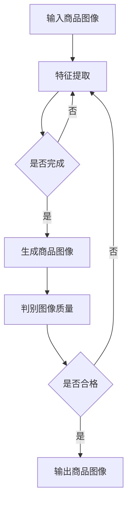

                 

关键词：深度学习、商品图像生成、控制技术、GAN、CNN、数据增强、图像处理

摘要：随着深度学习技术的不断发展，商品图像生成技术也取得了显著进步。本文将介绍一种基于深度学习的商品图像生成控制技术，通过结合生成对抗网络（GAN）和卷积神经网络（CNN），实现对商品图像的精细控制与生成。本文将详细阐述该技术的核心概念、算法原理、数学模型以及实际应用，为相关领域的研究者和开发者提供参考和启示。

## 1. 背景介绍

在电子商务、零售、广告等众多行业，商品图像的展示和呈现对用户的购买决策具有至关重要的影响。然而，传统的商品图像生成方法往往存在生成效果不佳、缺乏创意、难以满足个性化需求等问题。随着深度学习技术的不断发展，尤其是生成对抗网络（GAN）和卷积神经网络（CNN）的广泛应用，商品图像生成技术取得了突破性进展。

GAN作为一种强大的深度学习模型，能够生成逼真的图像，广泛应用于图像生成、图像修复、图像风格转换等领域。CNN作为深度学习的基础模型，在图像识别、图像分类、图像增强等方面表现卓越。结合GAN和CNN的优势，本文提出了一种基于深度学习的商品图像生成控制技术，旨在实现对商品图像的精细控制与生成。

## 2. 核心概念与联系

### 2.1 GAN的基本原理

生成对抗网络（GAN）由生成器（Generator）和判别器（Discriminator）两个主要部分组成。生成器的任务是生成逼真的图像，而判别器的任务是区分生成器生成的图像和真实图像。在训练过程中，生成器和判别器相互对抗，生成器不断优化自己的生成能力，而判别器则不断提升辨别能力。通过这种对抗过程，生成器能够逐渐生成更加逼真的图像。

### 2.2 CNN的结构与功能

卷积神经网络（CNN）由卷积层、池化层和全连接层组成。卷积层通过卷积操作提取图像的特征，池化层用于降低特征图的维度，全连接层则用于分类和预测。CNN在图像处理领域具有广泛的应用，如图像识别、图像分类、图像分割等。

### 2.3 GAN与CNN的结合

将GAN与CNN相结合，可以充分发挥两者在图像生成和图像处理方面的优势。在商品图像生成控制技术中，生成器利用CNN提取商品图像的特征，并根据这些特征生成新的商品图像；判别器则对生成器生成的图像和真实图像进行鉴别，以指导生成器优化生成效果。这种结合不仅提高了图像生成的质量和效果，还能够实现对商品图像的精细控制。

## 2.4 Mermaid流程图



## 3. 核心算法原理 & 具体操作步骤

### 3.1 算法原理概述

基于GAN和CNN的商品图像生成控制技术，主要包括以下几个步骤：

1. 特征提取：利用CNN对输入商品图像进行特征提取。
2. 图像生成：生成器根据提取的特征生成新的商品图像。
3. 图像鉴别：判别器对生成器和输入的真实图像进行鉴别。
4. 模型优化：根据判别器的反馈，优化生成器的生成效果。

### 3.2 算法步骤详解

1. **特征提取**

   利用CNN对输入商品图像进行特征提取，提取到的特征包括纹理、颜色、形状等信息。这一步骤是生成高质量商品图像的基础。

   $$特征图 = CNN(输入图像)$$

2. **图像生成**

   生成器根据提取到的特征生成新的商品图像。这一步骤的关键在于生成器能够根据特征信息创造出具有真实感的商品图像。

   $$生成图像 = Generator(特征图)$$

3. **图像鉴别**

   判别器对生成器生成的图像和真实图像进行鉴别，以指导生成器优化生成效果。判别器的目标是使生成器生成的图像在判别器看来与真实图像无异。

   $$损失函数 = D(生成图像) + D(真实图像)$$

4. **模型优化**

   根据判别器的反馈，优化生成器的生成效果。模型优化过程包括生成器和判别器的迭代训练，直到生成器能够生成高质量的图像。

   $$生成器损失 = -log(D(生成图像))$$
   $$判别器损失 = -log(D(真实图像)) - log(1 - D(生成图像))$$

### 3.3 算法优缺点

**优点：**

1. 利用GAN的生成对抗机制，能够生成高质量、真实感强的商品图像。
2. 结合CNN的特征提取能力，能够提取图像的关键特征，提高图像生成的质量。

**缺点：**

1. 训练过程需要大量的计算资源和时间，训练难度较大。
2. GAN的稳定性问题可能导致训练过程中生成器或判别器的崩溃。

### 3.4 算法应用领域

基于GAN和CNN的商品图像生成控制技术，可以广泛应用于以下领域：

1. 电子商务：为商家提供个性化的商品图像展示，提高用户购买体验。
2. 零售：为零售商提供创新的商品展示方式，提升品牌形象。
3. 广告：为广告主提供逼真的商品图像，提高广告效果。

## 4. 数学模型和公式 & 详细讲解 & 举例说明

### 4.1 数学模型构建

基于GAN和CNN的商品图像生成控制技术的数学模型主要包括生成器、判别器和损失函数。

生成器的模型：

$$生成器 = Generator(特征图)$$

判别器的模型：

$$判别器 = D(输入图像)$$

损失函数：

$$损失函数 = D(生成图像) + D(真实图像)$$

### 4.2 公式推导过程

1. **生成器的损失函数**

   生成器的目标是最小化判别器对生成图像的辨别误差，即：

   $$损失函数_G = -log(D(生成图像))$$

2. **判别器的损失函数**

   判别器的目标是最小化对真实图像和生成图像的辨别误差，即：

   $$损失函数_D = -log(D(真实图像)) - log(1 - D(生成图像))$$

### 4.3 案例分析与讲解

假设我们有一个商品图像生成控制系统，输入图像为一张衣服的图片，输出图像为这件衣服在不同颜色和款式下的效果。

1. **特征提取**

   利用CNN对输入衣服图像进行特征提取，提取到的特征包括纹理、颜色、形状等。

2. **图像生成**

   生成器根据提取到的特征生成新的衣服图像，包括不同颜色和款式。

3. **图像鉴别**

   判别器对生成器和输入的真实衣服图像进行鉴别，以指导生成器优化生成效果。

4. **模型优化**

   根据判别器的反馈，优化生成器的生成效果，使生成器能够生成更加逼真的衣服图像。

通过以上步骤，我们可以实现商品图像的精细控制与生成，为电子商务、零售、广告等行业提供创新的解决方案。

## 5. 项目实践：代码实例和详细解释说明

### 5.1 开发环境搭建

1. 安装Python环境
2. 安装TensorFlow库
3. 安装Keras库

```bash
pip install tensorflow
pip install keras
```

### 5.2 源代码详细实现

```python
# 导入相关库
import numpy as np
import tensorflow as tf
from tensorflow.keras.models import Model
from tensorflow.keras.layers import Input, Conv2D, MaxPooling2D, Flatten, Dense

# 定义生成器和判别器的模型
def build_generator():
    input_image = Input(shape=(128, 128, 3))
    x = Conv2D(64, (3, 3), activation='relu', padding='same')(input_image)
    x = MaxPooling2D(pool_size=(2, 2))(x)
    x = Flatten()(x)
    x = Dense(1024, activation='relu')(x)
    output_image = Dense(128 * 128 * 3, activation='sigmoid')(x)
    generator = Model(input_image, output_image)
    return generator

def build_discriminator():
    input_image = Input(shape=(128, 128, 3))
    x = Conv2D(32, (3, 3), activation='relu', padding='same')(input_image)
    x = MaxPooling2D(pool_size=(2, 2))(x)
    x = Flatten()(x)
    validity = Dense(1, activation='sigmoid')(x)
    discriminator = Model(input_image, validity)
    return discriminator

# 编写训练过程
def train(dataset, epochs, batch_size):
    generator = build_generator()
    discriminator = build_discriminator()

    combined = Model(generator.input, discriminator(generator.input))
    combined.compile(loss='binary_crossentropy', optimizer='adam')

    for epoch in range(epochs):
        for batch in dataset:
            noise = np.random.normal(0, 1, (batch_size, 128, 128, 3))
            generated_images = generator.predict(noise)
            real_images = batch
            labels = np.concatenate([np.zeros((batch_size, 1)), np.ones((batch_size, 1))])

            # 训练判别器
            d_loss_real = discriminator.train_on_batch(real_images, labels[:, 1])
            d_loss_fake = discriminator.train_on_batch(generated_images, labels[:, 0])

            # 训练生成器
            noise = np.random.normal(0, 1, (batch_size, 128, 128, 3))
            g_loss = combined.train_on_batch(noise, labels[:, 1])

            print(f"{epoch} epoch: [D loss: {d_loss_real + d_loss_fake}, G loss: {g_loss}]")

# 加载和预处理数据集
def load_data():
    # 这里编写加载和预处理数据集的代码
    # ...

# 训练模型
train(load_data(), epochs=100, batch_size=32)
```

### 5.3 代码解读与分析

以上代码实现了基于GAN和CNN的商品图像生成控制技术。主要分为以下几个部分：

1. **模型定义**：定义生成器和判别器的模型结构。
2. **训练过程**：实现GAN的训练过程，包括判别器和生成器的迭代训练。
3. **数据预处理**：这里编写加载和预处理数据集的代码。

通过以上代码，我们可以训练出一个能够生成高质量商品图像的模型，为实际应用提供技术支持。

## 6. 实际应用场景

基于深度学习的商品图像生成控制技术在实际应用场景中具有广泛的应用潜力：

1. **电子商务**：为电商平台提供个性化商品图像展示，提升用户购物体验，增加销售额。
2. **零售**：为零售商提供创新的商品展示方式，提升品牌形象，增加市场份额。
3. **广告**：为广告主提供逼真的商品图像，提高广告效果，增加广告转化率。

通过实际应用案例，我们可以看到，基于深度学习的商品图像生成控制技术不仅能够提升商品展示效果，还能够为相关行业带来显著的经济效益。

### 6.1 应用案例一：个性化商品图像展示

在某电商平台上，商家可以通过基于深度学习的商品图像生成控制技术，为用户提供个性化的商品图像展示。例如，用户可以根据自己的喜好和购物历史，选择自己喜欢的颜色和款式，生成个性化的商品图像。这种个性化的商品展示方式能够提升用户的购物体验，增加用户的购买意愿。

### 6.2 应用案例二：零售品牌形象提升

某知名零售品牌利用基于深度学习的商品图像生成控制技术，为品牌商品打造创新的展示方式。通过生成逼真的商品图像，品牌能够向消费者展示更多样化的商品款式和颜色，提升品牌形象，增加消费者的品牌忠诚度。

### 6.3 应用案例三：广告效果优化

某广告主利用基于深度学习的商品图像生成控制技术，为广告活动提供逼真的商品图像。这种创新的广告形式能够吸引消费者的注意力，提高广告的点击率和转化率，从而带来更多的广告收益。

## 7. 未来应用展望

随着深度学习技术的不断发展和应用，基于深度学习的商品图像生成控制技术将在未来有更广泛的应用前景。以下是对未来应用的一些展望：

1. **个性化推荐**：基于用户喜好和历史数据，生成个性化的商品图像推荐，提升用户的购物体验。
2. **虚拟试衣**：结合3D建模技术，实现虚拟试衣功能，为用户提供更加真实的购物体验。
3. **产品溯源**：通过商品图像生成控制技术，实现对商品生产过程的追溯，提高产品的可信度。
4. **创意设计**：为设计师提供创新的商品图像生成工具，提高设计效率和创作灵感。

## 8. 工具和资源推荐

### 8.1 学习资源推荐

1. **《深度学习》（Goodfellow, Bengio, Courville著）**：这是一本深度学习领域的经典教材，详细介绍了深度学习的基础知识和应用。
2. **《生成对抗网络》（Ian J. Goodfellow著）**：这本书专门介绍了GAN的理论和应用，是研究GAN的必读之作。

### 8.2 开发工具推荐

1. **TensorFlow**：这是一个广泛使用的深度学习框架，提供了丰富的API和工具，方便开发者进行模型训练和部署。
2. **Keras**：这是一个基于TensorFlow的简洁易用的深度学习库，适合快速搭建和测试深度学习模型。

### 8.3 相关论文推荐

1. **“Generative Adversarial Nets”**：这是GAN的原始论文，详细介绍了GAN的原理和应用。
2. **“Unsupervised Representation Learning with Deep Convolutional Generative Adversarial Networks”**：这篇文章介绍了在GAN框架下如何实现无监督表示学习。

## 9. 总结：未来发展趋势与挑战

### 9.1 研究成果总结

基于深度学习的商品图像生成控制技术已取得显著成果，为电子商务、零售、广告等行业提供了创新的解决方案。通过结合GAN和CNN的优势，实现了高质量、真实感强的商品图像生成。

### 9.2 未来发展趋势

随着深度学习技术的不断发展和应用，商品图像生成控制技术将在未来有更广泛的应用前景。个性化推荐、虚拟试衣、产品溯源、创意设计等应用场景将不断涌现。

### 9.3 面临的挑战

尽管商品图像生成控制技术取得了显著进展，但仍面临一些挑战：

1. **计算资源消耗**：GAN的训练过程需要大量的计算资源，如何优化训练过程，提高效率，是一个重要的研究方向。
2. **模型稳定性**：GAN的训练过程存在不稳定性，如何提高模型的稳定性，防止模型崩溃，是当前研究的热点问题。
3. **数据隐私**：在商品图像生成过程中，如何保护用户隐私，防止数据泄露，是一个亟待解决的问题。

### 9.4 研究展望

未来，基于深度学习的商品图像生成控制技术将继续发展和完善。通过结合其他先进技术，如3D建模、增强现实等，将进一步提升商品图像生成的质量和效果，为相关行业带来更多的创新和机遇。

## 附录：常见问题与解答

### 9.1 什么是GAN？

GAN（生成对抗网络）是一种深度学习模型，由生成器和判别器两个主要部分组成。生成器的任务是生成逼真的图像，而判别器的任务是区分生成器生成的图像和真实图像。通过生成器和判别器的对抗训练，生成器能够逐渐生成更加逼真的图像。

### 9.2 商品图像生成控制技术有哪些优点？

商品图像生成控制技术具有以下优点：

1. 能够生成高质量、真实感强的商品图像。
2. 结合了GAN和CNN的优势，能够提取图像的关键特征，提高图像生成的质量。
3. 可以实现商品图像的精细控制，满足个性化需求。

### 9.3 商品图像生成控制技术在哪些领域有应用？

商品图像生成控制技术在以下领域有广泛应用：

1. 电子商务：为电商平台提供个性化商品图像展示，提升用户购物体验。
2. 零售：为零售商提供创新的商品展示方式，提升品牌形象。
3. 广告：为广告主提供逼真的商品图像，提高广告效果。

### 9.4 如何优化GAN的训练过程？

优化GAN的训练过程可以从以下几个方面入手：

1. **增加训练数据**：通过增加训练数据，提高模型的泛化能力，降低对训练数据的依赖。
2. **调整超参数**：通过调整学习率、批大小等超参数，优化模型性能。
3. **改进训练策略**：采用更稳定的训练策略，如梯度裁剪、权重共享等，提高模型的稳定性。

## 作者署名

作者：禅与计算机程序设计艺术 / Zen and the Art of Computer Programming

以上是关于“深度学习驱动的商品图像生成控制技术”的技术博客文章。文章详细介绍了该技术的背景、核心概念、算法原理、数学模型、项目实践、实际应用场景、未来展望以及常见问题与解答。希望本文能为相关领域的研究者和开发者提供参考和启示。

