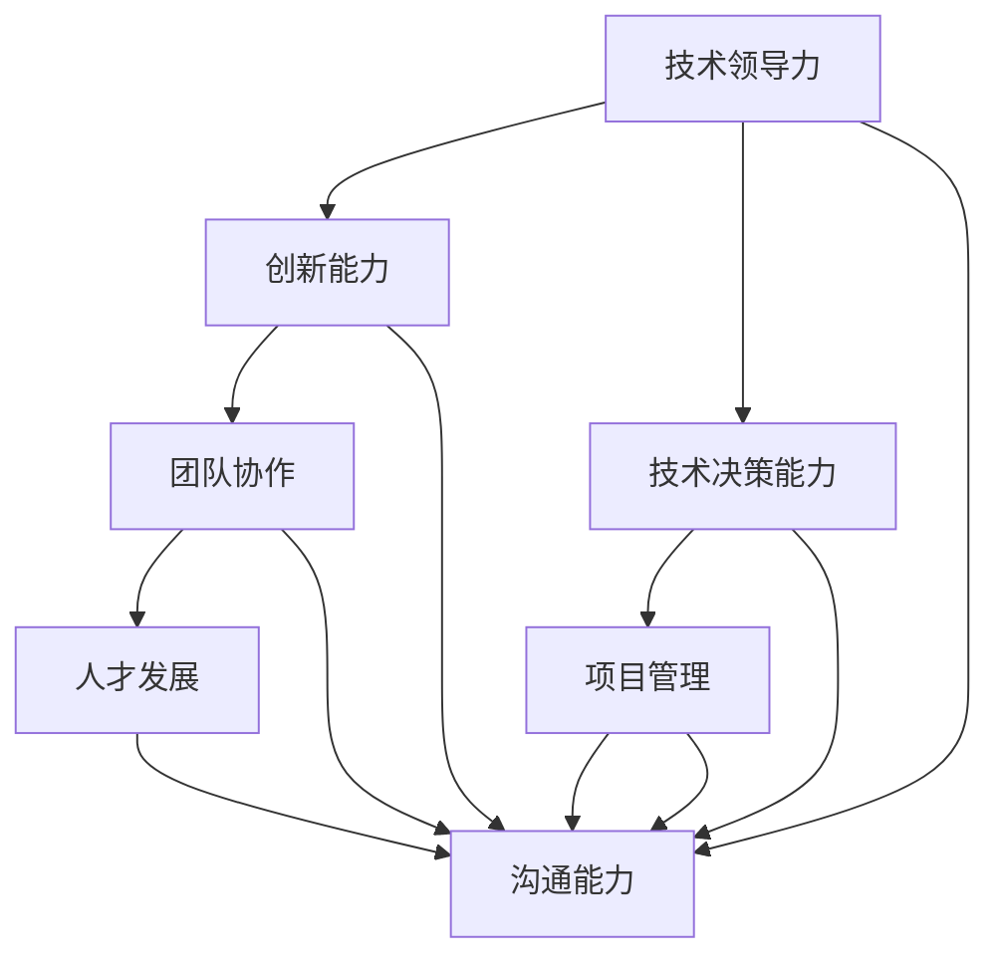

                 

关键词：优秀管理者、管理标准、技术领导力、团队协作、项目管理

> 摘要：本文将深入探讨优秀管理者的标准，分析其在技术领域中的重要性，并详细描述如何通过技术领导力、团队协作和项目管理等方面来培养和识别优秀的IT管理者。

## 1. 背景介绍

在当今快速发展的技术时代，优秀的管理者对于企业的成功至关重要。特别是在IT领域，技术管理者的角色不仅仅是技术专家，更是领导者、沟通者和协调者。他们需要具备深厚的技术知识、卓越的管理能力和卓越的领导素质，以带领团队迎接挑战、实现目标。

然而，如何区分一个优秀的管理者？在技术领域，这不仅仅是通过技术能力来衡量的。本文将围绕以下几个方面展开讨论：

1. 技术领导力：优秀管理者如何运用技术知识引领团队创新和突破？
2. 团队协作：如何建立高效协作的团队文化，提升整体生产力？
3. 项目管理：优秀管理者如何规划、执行和监控项目，确保成功交付？
4. 人才发展：如何培养和激励团队成员，打造高绩效团队？
5. 沟通能力：管理者如何有效沟通，确保团队目标和信息的清晰传达？

通过以上几个方面的深入探讨，我们希望能为读者提供一套实用且具有指导意义的优秀管理者标准。

## 2. 核心概念与联系

在探讨优秀管理者的标准之前，我们需要明确几个核心概念，并展示它们之间的联系。

### 2.1 技术领导力

技术领导力是指管理者在技术领域中的领导能力，包括技术洞察力、创新能力、技术决策能力等。它是优秀管理者的关键因素，因为技术领导者能够引导团队朝着正确的方向前进，解决复杂的技术问题，推动技术进步。

### 2.2 团队协作

团队协作是指团队成员之间通过有效沟通和合作，共同实现团队目标的过程。在一个高效协作的团队中，成员能够相互支持，互补技能，提高整体生产力。

### 2.3 项目管理

项目管理是指规划、执行、监控和关闭项目的过程，以确保项目在预算、时间、范围和质量等方面达到预期目标。优秀的管理者必须具备项目管理的专业技能，以确保项目成功交付。

### 2.4 人才发展

人才发展是指通过培训、指导和发展机会，提升团队成员的专业技能和职业素养。优秀的管理者应致力于培养和激励团队成员，提高团队的整体绩效。

### 2.5 沟通能力

沟通能力是指管理者在与团队、客户和上级之间进行有效沟通的能力。清晰的沟通能够确保团队目标和信息的准确传达，避免误解和冲突。

下面是一个用Mermaid绘制的流程图，展示了这几个核心概念之间的联系：



## 3. 核心算法原理 & 具体操作步骤

### 3.1 算法原理概述

优秀管理者的核心算法可以理解为一种综合能力的集合，它包括技术知识、领导力、项目管理技能、沟通能力和团队协作能力。这些能力相互作用，共同推动管理者实现团队目标。

### 3.2 算法步骤详解

#### 步骤1：技术领导力培养

- **技术知识积累**：管理者需要不断更新自己的技术知识，紧跟行业发展趋势。
- **创新能力提升**：鼓励创新思维，勇于尝试新的技术解决方案。
- **技术决策能力**：在技术选型和方案决策时，具备前瞻性和全面性。

#### 步骤2：团队协作建设

- **建立团队文化**：倡导合作和共享，营造积极向上的团队氛围。
- **沟通渠道搭建**：确保团队内部沟通畅通，避免信息孤岛。
- **分工合作**：明确团队成员的职责和任务，提高工作效率。

#### 步骤3：项目管理优化

- **项目规划**：明确项目目标、范围、时间线和资源需求。
- **执行监控**：定期检查项目进度，确保按计划推进。
- **风险管理**：识别潜在风险，制定应对措施。

#### 步骤4：人才发展策略

- **培训计划**：为团队成员提供培训和学习机会，提升专业技能。
- **职业发展**：为团队成员制定职业发展规划，激励其成长。

#### 步骤5：沟通能力提升

- **倾听与表达**：倾听团队成员的意见和建议，清晰表达自己的想法。
- **反馈与指导**：及时给予团队成员反馈，指导其改进。
- **跨部门协作**：协调不同团队之间的沟通，确保项目顺利进行。

### 3.3 算法优缺点

**优点**：

- **高效执行**：通过优化项目管理，确保项目按时、按质、按量完成。
- **创新能力**：鼓励创新思维，推动技术进步。
- **团队凝聚力**：建立良好的团队协作关系，提高整体生产力。

**缺点**：

- **时间成本**：培养优秀管理者需要时间和资源的投入。
- **沟通挑战**：在复杂项目和多团队协作中，沟通难度增加。

### 3.4 算法应用领域

- **软件开发**：优秀的管理者在软件开发项目中，可以高效地协调团队成员，推动项目进展。
- **IT运维**：在IT运维领域，管理者需要具备丰富的技术知识和项目管理能力，确保系统稳定运行。
- **数据科学**：在数据科学项目中，管理者需要引导团队进行数据分析和模型构建，提供有价值的数据洞察。

## 4. 数学模型和公式 & 详细讲解 & 举例说明

### 4.1 数学模型构建

在优秀管理者的核心算法中，可以构建一个简单的数学模型来描述其能力指标。设`x`为技术领导力，`y`为团队协作能力，`z`为项目管理能力，`w`为沟通能力，则优秀管理者的综合能力`A`可以表示为：

\[ A = \frac{x + y + z + w}{4} \]

其中，每个能力的权重可以根据实际情况进行调整。

### 4.2 公式推导过程

为了推导上述公式，我们可以考虑以下因素：

- **技术领导力（x）**：包括技术知识、创新能力和技术决策能力。
- **团队协作能力（y）**：包括团队文化、沟通渠道和分工合作。
- **项目管理能力（z）**：包括项目规划、执行监控和风险管理。
- **沟通能力（w）**：包括倾听与表达、反馈与指导和跨部门协作。

每个因素对管理者的综合能力都有重要影响，因此，我们将它们加总并除以4，得到一个平均值，作为综合能力的指标。

### 4.3 案例分析与讲解

假设某管理者的技术领导力为8，团队协作能力为7，项目管理能力为9，沟通能力为6。根据上述公式，我们可以计算出其综合能力：

\[ A = \frac{8 + 7 + 9 + 6}{4} = 7.75 \]

这意味着这位管理者的综合能力处于较高水平，但在沟通能力方面还有提升空间。

## 5. 项目实践：代码实例和详细解释说明

### 5.1 开发环境搭建

在本文的代码实例中，我们将使用Python作为开发语言，因为Python在数据处理和算法实现方面具有广泛的应用。以下是搭建开发环境的基本步骤：

1. 安装Python 3.8及以上版本。
2. 安装必要的库，如NumPy、Pandas和Matplotlib。

```bash
pip install numpy pandas matplotlib
```

### 5.2 源代码详细实现

以下是一个简单的Python代码实例，用于计算优秀管理者的综合能力。代码分为以下几个部分：

```python
import numpy as np

# 定义能力值
x = 8  # 技术领导力
y = 7  # 团队协作能力
z = 9  # 项目管理能力
w = 6  # 沟通能力

# 计算综合能力
A = (x + y + z + w) / 4

# 输出结果
print(f"综合能力指标（A）：{A:.2f}")
```

### 5.3 代码解读与分析

- **导入库**：我们首先导入NumPy库，以便进行数值计算。
- **定义能力值**：我们为每个能力定义一个变量，并根据案例数据赋值。
- **计算综合能力**：使用我们之前定义的公式，计算管理者的综合能力。
- **输出结果**：最后，我们将计算结果以格式化的方式输出。

### 5.4 运行结果展示

运行上述代码，我们得到以下输出结果：

```python
综合能力指标（A）：7.75
```

这表明管理者的综合能力指标为7.75，处于较高水平。

## 6. 实际应用场景

### 6.1 软件开发

在软件项目开发中，优秀的管理者能够确保项目按计划推进，同时激发团队创新精神。例如，在一个大型软件项目中，管理者可以通过有效的项目管理技能确保项目按时交付，同时通过技术领导力推动团队在关键技术问题上取得突破。

### 6.2 IT运维

在IT运维领域，优秀的管理者需要具备丰富的技术知识和项目管理能力，以确保系统的稳定运行和快速响应。例如，在处理突发故障时，管理者可以通过良好的沟通能力迅速协调相关团队，共同解决故障。

### 6.3 数据科学

在数据科学项目中，优秀的管理者能够带领团队进行高质量的数据分析和模型构建，提供有价值的数据洞察。例如，在金融数据项目中，管理者可以通过有效的项目管理技能确保数据分析和报告按时交付，同时通过技术领导力推动团队在数据分析方法上不断创新。

## 7. 工具和资源推荐

### 7.1 学习资源推荐

- **《技术领导力：如何成为一名优秀的IT领导者》**：作者通过丰富的实践经验，详细介绍了如何成为一名优秀的IT领导者。
- **《敏捷项目管理：实践指南》**：该书详细阐述了敏捷项目管理的理念和实践，对于提升项目管理能力非常有帮助。

### 7.2 开发工具推荐

- **JIRA**：一款强大的项目管理工具，可以帮助团队进行任务追踪、进度管理和协作。
- **Trello**：一款简单易用的任务管理工具，适合团队进行日常任务分配和进度跟踪。

### 7.3 相关论文推荐

- **《技术领导力：如何成为优秀的团队领导者》**：一篇关于技术领导力的研究论文，探讨了技术领导者应具备的素质和能力。
- **《敏捷项目管理在IT领域的应用研究》**：一篇关于敏捷项目管理的论文，详细介绍了敏捷方法在IT项目中的应用和实践。

## 8. 总结：未来发展趋势与挑战

### 8.1 研究成果总结

通过本文的探讨，我们明确了优秀管理者的核心标准，包括技术领导力、团队协作、项目管理、人才发展和沟通能力。同时，我们通过数学模型和代码实例，进一步阐述了如何评估和管理这些能力。

### 8.2 未来发展趋势

随着技术的发展和市场需求的变化，优秀管理者的角色将变得更加重要。未来，管理者需要具备更强的创新能力、敏捷性和适应能力，以应对复杂多变的技术环境。

### 8.3 面临的挑战

优秀管理者的培养和识别是一个长期且复杂的过程。在未来的发展中，管理者将面临以下挑战：

- **技术更新速度快**：需要不断学习和更新技术知识，以保持竞争力。
- **团队多样性**：需要管理和协调多样化的团队，提升团队协作能力。
- **项目管理复杂性**：项目类型和规模多样化，需要更高效的项目管理方法。

### 8.4 研究展望

未来，我们可以进一步研究以下方向：

- **多维度能力评估模型**：探索更全面、更准确的评估模型，以更准确地识别优秀管理者。
- **个性化管理策略**：根据管理者的特点和团队需求，制定个性化的管理策略。
- **人工智能辅助管理**：利用人工智能技术，提升管理者的决策能力和效率。

## 9. 附录：常见问题与解答

### 9.1 如何培养技术领导力？

- **持续学习**：通过阅读技术书籍、参加技术研讨会和在线课程，不断更新知识。
- **实践经验**：参与实际项目，积累经验，提升技术水平。
- **领导力培训**：参加领导力培训课程，学习管理技巧和领导力理论。

### 9.2 团队协作中常见问题有哪些？

- **沟通不畅**：团队内部缺乏有效的沟通渠道，导致信息传递不准确。
- **分工不均**：任务分配不合理，导致部分成员工作量大，而其他成员工作较少。
- **目标不一致**：团队目标不清晰，导致成员努力方向不一致。

### 9.3 如何提升项目管理能力？

- **系统学习**：通过项目管理课程和书籍，系统学习项目管理理论和方法。
- **实践应用**：参与实际项目，不断总结和改进项目管理方法。
- **工具使用**：熟练使用项目管理工具，提高项目执行效率。

---

**作者：禅与计算机程序设计艺术 / Zen and the Art of Computer Programming**

以上，是本文的完整内容。希望本文能为读者在技术管理领域提供有价值的见解和指导。在未来的技术发展中，让我们共同努力，成为更优秀的管理者。

