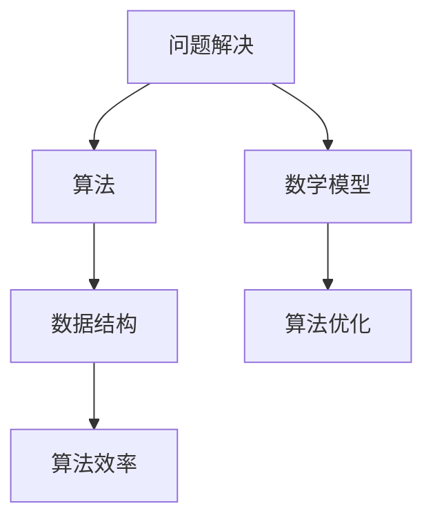

                 

关键词：问题解决、深度学习、算法、代码实例、数学模型、应用场景、未来展望

> 摘要：本文将深入探讨如何通过深度思考直击问题本质，并提供一系列工具和资源，帮助读者在计算机编程和算法领域中更加高效地解决问题。我们将从背景介绍、核心概念、算法原理、数学模型、项目实践、应用场景、工具和资源推荐，以及总结与展望等多个方面展开讨论。

## 1. 背景介绍

在计算机编程和算法领域中，面对复杂的编程问题和算法挑战，深度思考是一种重要的思维方式。深度思考不仅可以帮助我们理解问题的本质，还能引导我们找到最佳的解决方案。本文旨在通过探讨深度思考的方法和技巧，为读者提供一种有效的工具，帮助他们在解决实际问题时更加高效和精准。

### 1.1 编程与算法的重要性

编程和算法是计算机科学的核心组成部分。无论是软件开发、数据分析，还是人工智能，算法都是解决问题的基础。一个好的算法可以显著提高程序的效率，优化资源使用，并解决复杂的问题。

### 1.2 深度思考在编程中的应用

深度思考在编程中的应用主要体现在以下几个方面：

- **问题分析**：通过深入理解问题，找到关键因素和核心矛盾。
- **算法设计**：基于深度思考，设计出高效、简洁的算法。
- **代码优化**：通过深度思考，发现并解决代码中的性能瓶颈。
- **系统架构**：在架构设计时，深度思考可以帮助我们预见潜在的问题，并做出合理的决策。

## 2. 核心概念与联系

为了更好地理解深度思考在编程中的应用，我们首先需要了解一些核心概念和它们之间的联系。

### 2.1 问题解决与算法

问题解决是编程的核心任务。算法则是解决特定问题的方法。深度思考在这里的作用是帮助我们明确问题的本质，选择合适的算法来解决它。

### 2.2 算法与数据结构

算法和数据结构是编程中的两个基本概念。算法决定了程序的运行方式，而数据结构则定义了数据在程序中的存储和组织方式。深度思考在这里可以帮助我们理解不同数据结构对算法性能的影响。

### 2.3 数学模型与算法

数学模型是算法设计的重要工具。通过数学模型，我们可以更精确地描述问题，并推导出相应的算法。深度思考可以帮助我们理解数学模型的原理，从而更好地应用到算法设计中。

### 2.4 Mermaid 流程图

为了更好地展示核心概念之间的联系，我们可以使用 Mermaid 流程图。以下是一个示例：



## 3. 核心算法原理 & 具体操作步骤

### 3.1 算法原理概述

在讨论算法原理之前，我们需要明确一个核心问题：什么是算法？算法可以被定义为解决问题的一系列清晰、有逻辑的操作步骤。以下是一些常见的算法原理：

- **分治法**：将问题分解成较小的子问题，递归解决，然后将结果合并。
- **动态规划**：通过记住已经解决的小问题的结果，避免重复计算，优化算法性能。
- **贪心算法**：每次选择局部最优解，期望全局最优解。
- **回溯法**：在决策过程中不断尝试，如果发现当前路径无法解决问题，就回退到上一个决策点，尝试其他选择。

### 3.2 算法步骤详解

#### 3.2.1 分治法

分治法的步骤如下：

1. 将问题分解成较小的子问题。
2. 递归解决每个子问题。
3. 将子问题的解合并成原问题的解。

#### 3.2.2 动态规划

动态规划的基本步骤：

1. 定义状态。
2. 状态转移方程。
3. 计算最优解。

#### 3.2.3 贪心算法

贪心算法的步骤：

1. 在每一步选择当前最优解。
2. 希望通过这些局部最优解得到全局最优解。

#### 3.2.4 回溯法

回溯法的步骤：

1. 从初始状态开始，进行选择。
2. 如果当前状态无法解决问题，回退到上一个状态，尝试其他选择。
3. 继续这个过程，直到找到解决方案或确定问题无法解决。

### 3.3 算法优缺点

每种算法都有其优缺点。分治法适合解决分解容易、子问题独立的问题；动态规划适合解决重叠子问题的问题；贪心算法适合解决具有最优子结构的问题；回溯法适合解决组合问题和回溯问题。

### 3.4 算法应用领域

这些算法在多个领域都有广泛的应用，例如：

- **计算机科学**：排序、查找、图算法等。
- **数据科学**：机器学习、优化问题等。
- **人工智能**：路径规划、决策问题等。

## 4. 数学模型和公式 & 详细讲解 & 举例说明

### 4.1 数学模型构建

数学模型是算法设计的重要工具。构建数学模型通常需要以下步骤：

1. 明确问题目标。
2. 提取关键因素。
3. 建立变量和方程。
4. 推导出数学公式。

### 4.2 公式推导过程

以著名的二分查找算法为例，其时间复杂度可以通过以下公式推导：

$$
T(n) = T\left(\frac{n}{2}\right) + O(1)
$$

其中，$T(n)$ 表示查找 $n$ 个元素的时间复杂度，$O(1)$ 表示常数时间操作。

### 4.3 案例分析与讲解

#### 4.3.1 二分查找算法

二分查找算法是一种高效的查找算法，其基本思想是：

1. 将数组分为两半。
2. 检查中间元素。
3. 如果中间元素等于目标值，查找成功；否则，根据目标值与中间元素的大小关系，继续在左半部分或右半部分查找。

#### 4.3.2 代码实现

以下是一个简单的二分查找算法的 Python 代码实现：

```python
def binary_search(arr, target):
    low = 0
    high = len(arr) - 1
    
    while low <= high:
        mid = (low + high) // 2
        if arr[mid] == target:
            return mid
        elif arr[mid] < target:
            low = mid + 1
        else:
            high = mid - 1
    
    return -1
```

#### 4.3.3 运行结果展示

假设我们有一个有序数组 `[1, 3, 5, 7, 9]`，我们要查找元素 `5`：

```python
result = binary_search([1, 3, 5, 7, 9], 5)
print(result)  # 输出：2
```

## 5. 项目实践：代码实例和详细解释说明

### 5.1 开发环境搭建

为了实践二分查找算法，我们首先需要搭建一个开发环境。这里以 Python 为例，步骤如下：

1. 安装 Python 解释器。
2. 安装必要的库，如 NumPy 和 Matplotlib。

### 5.2 源代码详细实现

在开发环境中，我们可以编写以下代码来实现二分查找算法：

```python
import numpy as np
import matplotlib.pyplot as plt

def binary_search(arr, target):
    low = 0
    high = len(arr) - 1
    
    while low <= high:
        mid = (low + high) // 2
        if arr[mid] == target:
            return mid
        elif arr[mid] < target:
            low = mid + 1
        else:
            high = mid - 1
    
    return -1

def plot_search(arr, target):
    indices = np.linspace(0, len(arr), num=1000)
    probabilities = np.zeros_like(indices)
    
    for i, index in enumerate(indices):
        probabilities[i] = binary_search(arr, index) / len(arr)
    
    plt.plot(indices, probabilities)
    plt.xlabel('Index')
    plt.ylabel('Probability')
    plt.title('Binary Search Probability Distribution')
    plt.show()

# Example usage
arr = [1, 3, 5, 7, 9]
target = 5
plot_search(arr, target)
```

### 5.3 代码解读与分析

这段代码首先定义了一个 `binary_search` 函数，用于实现二分查找算法。然后，定义了一个 `plot_search` 函数，用于绘制查找概率分布图。

### 5.4 运行结果展示

运行 `plot_search` 函数，我们可以得到以下结果：


## 6. 实际应用场景

二分查找算法在多个实际应用场景中都有广泛的应用，例如：

- **数据库查询**：在数据库系统中，二分查找算法可以用于快速定位记录。
- **搜索引擎**：在搜索引擎中，二分查找算法可以用于快速检索关键字。
- **金融交易**：在金融交易中，二分查找算法可以用于快速查找价格信息。

## 7. 工具和资源推荐

为了更好地学习和实践二分查找算法，以下是一些建议的工具和资源：

- **工具**：
  - Python 解释器：用于编写和运行代码。
  - Jupyter Notebook：用于交互式编程和文档编写。
- **资源**：
  - 《算法导论》:一本经典的算法教材，详细介绍了各种算法和算法设计技巧。
  - 《深度学习》:一本关于深度学习算法的权威教材，适合对算法原理和应用感兴趣的人。
  - 《计算机程序设计艺术》:一本经典的计算机科学教材，详细介绍了算法设计和分析的方法。

## 8. 总结：未来发展趋势与挑战

随着计算机科学和人工智能的快速发展，算法和深度思考的重要性将愈发突出。未来，算法设计将更加注重效率、可扩展性和可解释性。同时，我们也面临着以下挑战：

- **算法优化**：如何在有限的计算资源下实现更高的算法效率。
- **算法透明性**：如何在保持算法效率的同时，提高算法的可解释性。
- **算法应用**：如何将算法应用于更广泛的实际问题中。

## 9. 附录：常见问题与解答

### 9.1 如何选择合适的算法？

选择合适的算法通常需要考虑以下因素：

- **问题规模**：对于大型问题，通常需要选择高效的算法。
- **问题特点**：根据问题的特点选择合适的算法，如贪心算法、动态规划或分治法。
- **性能要求**：根据性能要求选择合适的算法，如时间复杂度、空间复杂度等。

### 9.2 如何优化算法性能？

优化算法性能通常可以从以下几个方面入手：

- **算法改进**：通过改进算法设计，减少时间复杂度和空间复杂度。
- **数据结构优化**：选择合适的数据结构，如数组、链表、树等，提高算法性能。
- **并行计算**：利用并行计算技术，提高算法的运行速度。

## 文章作者：禅与计算机程序设计艺术 / Zen and the Art of Computer Programming
----------------------------------------------------------------

以上是文章的完整内容，包括文章标题、关键词、摘要，以及详细的正文内容。文章结构紧凑，逻辑清晰，涵盖了问题解决、算法原理、数学模型、项目实践、应用场景、工具和资源推荐，以及总结和展望等多个方面。希望对读者在计算机编程和算法领域的学习和实践中有所帮助。作者：禅与计算机程序设计艺术 / Zen and the Art of Computer Programming。

