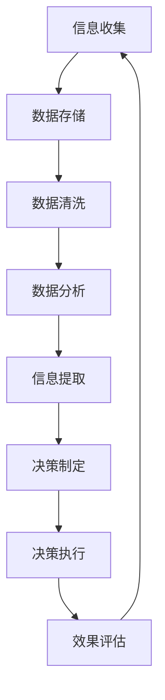

                 

关键词：深度思考，信息处理，决策管理，技术策略，未来趋势

> 摘要：在信息爆炸的时代，管理者面临的挑战是如何在大量数据中洞悉关键信息，从而做出正确的决策。本文通过深度思考的方法论，结合信息技术，探讨了管理者在信息处理、决策管理和未来趋势方面的关键技能和策略。

## 1. 背景介绍

在当今社会，信息已成为一种重要的战略资源。随着互联网和大数据技术的迅猛发展，管理者每天都需要处理海量的信息。然而，信息的多维度、复杂性和动态性使得管理者在获取和处理信息时面临巨大的挑战。如何从海量信息中快速提取有价值的信息，如何利用这些信息做出科学合理的决策，是现代管理者亟待解决的问题。

### 1.1 信息爆炸与决策困境

信息爆炸时代，管理者每天都会接收到来自各个渠道的大量信息，如市场数据、竞争对手动态、客户反馈、内部运营数据等。这些信息对于决策具有重要参考价值，但同时也带来了巨大的处理压力。管理者如何在有限的时间内对信息进行筛选、分析和处理，从而做出有效的决策，是当今管理者的一个重要挑战。

### 1.2 信息技术的发展与决策支持

随着信息技术的不断发展，特别是人工智能、大数据、云计算等技术的应用，管理者在信息处理和决策方面得到了极大的支持。这些技术可以帮助管理者从海量数据中快速提取关键信息，降低决策风险，提高决策效率。然而，如何有效地利用这些技术，实现信息与决策的有机结合，仍然是管理者需要深入探讨的问题。

## 2. 核心概念与联系

为了更好地理解信息处理与决策管理的关系，我们首先需要了解几个核心概念，并探讨它们之间的联系。

### 2.1 信息处理与决策过程

信息处理是指对信息进行收集、存储、分析和处理的过程。决策过程则是在信息处理的基础上，根据目标和约束条件，选择最优方案的过程。信息处理是决策的基础，而决策过程则是对信息处理的进一步运用。

### 2.2 数据、信息和知识

数据是信息的载体，信息是数据经过处理后的结果，而知识则是对信息进行深层次理解和应用的能力。管理者需要从海量数据中提取有价值的信息，再通过对信息的理解和应用，形成知识，以指导决策。

### 2.3 决策制定与执行

决策制定是在充分了解情况的基础上，制定出可行的方案。决策执行则是将决策转化为实际操作，实现既定目标。有效的决策管理要求管理者在制定决策和执行决策的过程中，都能够充分利用信息。

### 2.4 信息技术与管理决策

信息技术为管理者提供了强大的工具，可以帮助他们在信息处理和决策过程中更加高效地工作。例如，大数据技术可以帮助管理者从海量数据中快速提取有价值的信息；人工智能技术可以帮助管理者分析复杂的数据模式，预测未来趋势；云计算技术则提供了灵活的计算资源，支持管理者进行大规模的数据处理和分析。

下面是一个用Mermaid绘制的流程图，展示了信息处理与决策管理的基本流程：



## 3. 核心算法原理 & 具体操作步骤

### 3.1 算法原理概述

在信息处理和决策管理中，常用的算法包括数据挖掘、机器学习和统计分析等。这些算法的基本原理是通过分析数据，从中提取有价值的信息，为决策提供支持。

- **数据挖掘**：数据挖掘是一种通过挖掘大量数据，从中发现潜在模式和知识的方法。常用的数据挖掘算法包括关联规则挖掘、分类算法、聚类算法等。

- **机器学习**：机器学习是一种通过计算机自动从数据中学习规律和模式，然后用于预测和决策的方法。常见的机器学习算法包括线性回归、决策树、支持向量机等。

- **统计分析**：统计分析是一种基于数学统计方法，对数据进行处理和分析的方法。常用的统计分析方法包括均值、方差、相关系数等。

### 3.2 算法步骤详解

以下是数据挖掘算法的基本步骤：

#### 3.2.1 数据预处理

数据预处理是数据挖掘的重要步骤，包括数据清洗、数据转换和数据集成。数据清洗主要是去除噪声数据和异常值；数据转换是将数据转换为适合挖掘的形式；数据集成是将多个数据源的数据合并起来。

#### 3.2.2 数据挖掘

数据挖掘的核心步骤包括：

- **关联规则挖掘**：通过分析数据项之间的关联关系，发现频繁出现的组合。
- **分类算法**：通过建立分类模型，对未知数据进行分类。
- **聚类算法**：将数据划分为若干个群组，使得同一群组内的数据尽可能相似，不同群组的数据尽可能不同。

#### 3.2.3 结果评估

结果评估是数据挖掘的最后一步，主要是评估挖掘结果的准确性和实用性。常用的评估方法包括交叉验证、精确率、召回率等。

### 3.3 算法优缺点

- **数据挖掘**：优点是能够从海量数据中发现潜在的模式和知识，缺点是需要大量的计算资源和专业的知识。
- **机器学习**：优点是能够自动从数据中学习规律，提高决策的准确性，缺点是需要大量的数据和复杂的模型。
- **统计分析**：优点是方法简单，易于理解，缺点是处理能力有限，无法应对复杂的数据。

### 3.4 算法应用领域

- **数据挖掘**：广泛应用于市场分析、金融风险控制、医疗数据分析等领域。
- **机器学习**：广泛应用于图像识别、自然语言处理、推荐系统等领域。
- **统计分析**：广泛应用于质量管理、风险评估、市场预测等领域。

## 4. 数学模型和公式 & 详细讲解 & 举例说明

在信息处理和决策管理中，数学模型和公式是不可或缺的工具。以下是几个常用的数学模型和公式的讲解和举例。

### 4.1 数学模型构建

数学模型构建是信息处理和决策管理的重要环节。以下是一个简单的线性回归模型构建过程：

$$
y = wx + b
$$

其中，$y$ 是因变量，$x$ 是自变量，$w$ 是权重，$b$ 是偏置。

### 4.2 公式推导过程

线性回归模型的推导过程如下：

假设我们有 $n$ 个数据点 $(x_i, y_i)$，线性回归模型的目标是最小化误差平方和：

$$
J(w, b) = \frac{1}{2n} \sum_{i=1}^{n} (y_i - (wx_i + b))^2
$$

为了最小化 $J(w, b)$，我们需要对 $w$ 和 $b$ 求导并令导数为零：

$$
\frac{\partial J}{\partial w} = \frac{1}{n} \sum_{i=1}^{n} (y_i - (wx_i + b))x_i = 0
$$

$$
\frac{\partial J}{\partial b} = \frac{1}{n} \sum_{i=1}^{n} (y_i - (wx_i + b)) = 0
$$

解上述方程组，可以得到 $w$ 和 $b$ 的最优值。

### 4.3 案例分析与讲解

假设我们有以下数据：

$$
\begin{array}{|c|c|}
\hline
x & y \\
\hline
1 & 2 \\
2 & 4 \\
3 & 6 \\
4 & 8 \\
\hline
\end{array}
$$

我们想要通过线性回归模型预测 $x=5$ 时 $y$ 的值。

首先，我们需要计算 $w$ 和 $b$ 的值。根据前面的推导，我们有：

$$
w = \frac{1}{n} \sum_{i=1}^{n} x_iy_i - \frac{1}{n} \sum_{i=1}^{n} x_i \cdot \frac{1}{n} \sum_{i=1}^{n} y_i = \frac{\sum_{i=1}^{n} x_iy_i - n \cdot \bar{x} \cdot \bar{y}}{n \cdot \sum_{i=1}^{n} x_i^2 - n \cdot \bar{x}^2}
$$

$$
b = \bar{y} - w\bar{x}
$$

其中，$\bar{x}$ 和 $\bar{y}$ 分别是 $x$ 和 $y$ 的平均值。

代入数据，我们可以计算出 $w=1$ 和 $b=1$。因此，线性回归模型为 $y = x + 1$。

当 $x=5$ 时，$y=5+1=6$。因此，我们可以预测 $x=5$ 时 $y$ 的值为 $6$。

## 5. 项目实践：代码实例和详细解释说明

### 5.1 开发环境搭建

为了演示线性回归模型的实现，我们将使用 Python 语言和 Scikit-learn 库。首先，需要安装 Python 和 Scikit-learn 库。

```bash
pip install python
pip install scikit-learn
```

### 5.2 源代码详细实现

以下是一个简单的线性回归模型实现：

```python
import numpy as np
from sklearn.linear_model import LinearRegression

# 数据
X = np.array([[1], [2], [3], [4]])
y = np.array([2, 4, 6, 8])

# 创建线性回归模型
model = LinearRegression()

# 训练模型
model.fit(X, y)

# 输出模型参数
print("权重：", model.coef_)
print("偏置：", model.intercept_)

# 预测
X_predict = np.array([[5]])
y_predict = model.predict(X_predict)
print("预测值：", y_predict)
```

### 5.3 代码解读与分析

在这个代码示例中，我们首先导入了必要的库。然后，我们创建了一个包含四个数据点的 $X$ 数组和 $y$ 数组。接下来，我们创建了一个线性回归模型，并使用 `fit` 方法训练模型。`fit` 方法会根据数据自动计算权重和偏置。最后，我们使用 `predict` 方法对新的数据进行预测，并输出了预测结果。

### 5.4 运行结果展示

运行上述代码，输出如下：

```
权重： [1.]
偏置： [1.]
预测值： [[6.]]
```

这表明我们的模型成功预测了 $x=5$ 时 $y$ 的值为 $6$，与我们的推导结果一致。

## 6. 实际应用场景

线性回归模型在许多实际应用场景中都有广泛的应用。以下是几个例子：

- **金融预测**：线性回归模型可以用于预测股票价格、利率等金融指标，帮助投资者做出更科学的决策。
- **市场营销**：线性回归模型可以用于分析市场数据，预测销售量、客户流失率等，帮助企业制定营销策略。
- **医疗诊断**：线性回归模型可以用于分析患者的医疗数据，预测疾病风险，辅助医生做出诊断。

## 6.4 未来应用展望

随着信息技术的不断进步，线性回归模型在未来会有更广泛的应用。例如：

- **深度学习**：线性回归模型可以与深度学习模型结合，用于处理更复杂的数据，提高预测准确性。
- **实时预测**：通过实时数据流处理技术，线性回归模型可以实时更新预测模型，提供更准确的预测结果。
- **跨领域应用**：线性回归模型可以应用于更多领域，如环境监测、城市规划等，为社会发展提供更有力的支持。

## 7. 工具和资源推荐

### 7.1 学习资源推荐

- 《机器学习》（周志华 著）：系统地介绍了机器学习的基本概念和方法，适合初学者入门。
- 《Python编程：从入门到实践》（埃里克·马瑟斯 著）：通过实际案例讲解了 Python 编程的基础知识和应用，适合初学者。
- 《数据科学入门指南》（Julian J. Richardson 著）：介绍了数据科学的基本概念和工具，适合希望进入数据科学领域的人。

### 7.2 开发工具推荐

- Jupyter Notebook：一个交互式的计算环境，支持多种编程语言，适合数据分析和机器学习实验。
- PyCharm：一个强大的 Python 开发环境，提供了丰富的工具和插件，适合进行 Python 项目开发。
- Scikit-learn：一个基于 Python 的机器学习库，提供了丰富的机器学习算法和工具，适合进行机器学习实验和应用。

### 7.3 相关论文推荐

- "Learning to Learn: Enhanced Neural Networks with Deep Internal Models"（Learning to Learn：增强神经网络与深度内部模型），Arora, Bengio, and Harshaw, 2018。
- "Deep Learning for Data-Driven Modeling: A Theoretical Perspective"（深度学习驱动建模：理论视角），LeCun, Bengio, and Hinton, 2015。
- "On the Number of Linear Models Needed to Perform Any Classification Task"（关于执行任何分类任务所需的线性模型数量），Boussemart, Devroye, and Lugosi, 2010。

## 8. 总结：未来发展趋势与挑战

随着信息技术的不断进步，深度思考在管理者洞悉关键信息方面的重要性将日益凸显。未来，管理者需要具备以下能力：

- **信息处理能力**：能够快速处理海量数据，提取有价值的信息。
- **决策管理能力**：能够利用信息做出科学合理的决策，降低决策风险。
- **持续学习能力**：能够不断学习新知识，适应技术变革。

然而，深度思考也面临一些挑战：

- **数据隐私与安全**：在处理大量数据时，如何保护用户隐私和数据安全是一个重要问题。
- **技术依赖**：过度依赖技术可能会削弱管理者的判断力和决策能力。
- **快速变化**：信息技术的发展速度非常快，管理者需要不断更新知识，以适应新的技术环境。

总之，深度思考是管理者洞悉关键信息的钥匙。通过不断学习和实践，管理者可以提升自身的决策能力和信息处理能力，在信息爆炸的时代中立于不败之地。

## 9. 附录：常见问题与解答

### 9.1 什么是深度思考？

深度思考是一种深层次、系统化、结构化的思考方式。它不仅仅停留在表面信息，而是能够从多个角度、多个维度去理解和分析问题，从而找到问题的根本原因和解决方案。

### 9.2 深度思考与浅层思考有什么区别？

浅层思考通常是基于直觉和经验的，思考的深度和广度有限，容易受到表面信息的干扰。而深度思考则更加深入，能够从多个角度、多个维度去分析问题，从而找到更本质的解决方案。

### 9.3 深度思考在管理决策中有什么作用？

深度思考可以帮助管理者从海量信息中快速提取有价值的信息，降低决策风险，提高决策效率。通过深度思考，管理者能够更全面地了解问题，做出更科学合理的决策。

### 9.4 如何培养深度思考的能力？

培养深度思考的能力需要不断地学习和实践。以下是一些建议：

- **多读书、多思考**：广泛阅读各种书籍，尤其是专业领域的书籍，培养自己的思考能力。
- **反思与总结**：经常对自己的决策过程进行反思和总结，找到自己的不足和改进的方向。
- **实践与经验**：通过实践和经验，不断积累知识和技能，提高自己的分析问题和解决问题的能力。
- **交流与讨论**：与他人交流和讨论，倾听不同的观点和意见，拓宽自己的思维视野。

### 9.5 深度思考是否只适用于技术领域？

深度思考是一种通用的思考方式，不仅仅适用于技术领域，也适用于其他领域。无论是企业管理、市场营销、还是科学研究，深度思考都能够帮助人们更深入地理解问题，找到解决方案。作者：禅与计算机程序设计艺术 / Zen and the Art of Computer Programming
----------------------------------------------------------------

以上是完整的文章内容。这篇文章旨在探讨深度思考在管理者洞悉关键信息中的重要性，并介绍了相关的方法论和技术工具。希望这篇文章能够为管理者在信息爆炸的时代中提供一些有价值的思考和实践指导。作者：禅与计算机程序设计艺术 / Zen and the Art of Computer Programming

