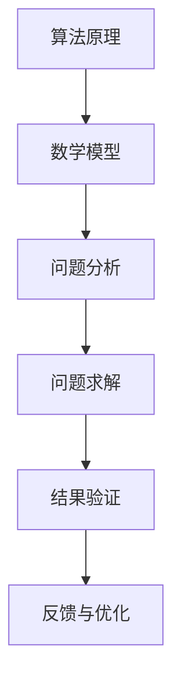

                 

关键词：深度思考、问题解决、算法原理、数学模型、项目实践、实际应用、未来展望

> 摘要：本文旨在探讨深度思考在问题解决中的重要性，以及如何通过深度思考来提升我们的算法设计能力、数学建模水平，进而解决复杂问题。我们将从算法原理、数学模型、项目实践等多个角度出发，深入分析如何利用深度思考来优化问题解决过程，提高工作效率，推动技术发展。

## 1. 背景介绍

在信息技术飞速发展的时代，面对日新月异的挑战和问题，如何高效地解决问题已成为一个关键能力。传统的方法论虽然在一定程度上能解决一些问题，但在面对复杂且多变的问题时，往往显得力不从心。此时，深度思考成为了一种重要的解决问题的利器。

深度思考是指对问题进行深入的分析和思考，不仅仅停留在表面现象，而是通过多角度、多层次、多维度地审视问题，从而找到本质的解决方法。深度思考有助于我们打破固有的思维模式，发现问题的本质，提升我们的创新能力。

本文将围绕深度思考在问题解决中的重要性，探讨如何通过深度思考来提升算法设计能力、数学建模水平，并给出具体的项目实践案例。希望通过本文的阐述，能够帮助读者掌握深度思考的方法，提升问题解决能力。

## 2. 核心概念与联系

### 2.1 算法原理

算法是解决问题的一系列明确、有限的步骤。算法设计是计算机科学和软件工程的核心内容之一。一个良好的算法不仅需要具有高效性，还需要具备可理解性、可扩展性和健壮性。

### 2.2 数学模型

数学模型是将现实问题转化为数学表达式的方法。通过数学模型，我们可以将问题形式化为数学问题，进而利用数学工具和方法求解。数学模型在许多领域，如经济学、物理学、生物学等都有着广泛的应用。

### 2.3 Mermaid 流程图

下面是一个简单的 Mermaid 流程图，展示了算法原理与数学模型之间的联系。



### 2.4 算法原理与数学模型的联系

算法原理与数学模型之间的联系紧密。算法原理决定了我们如何处理问题，而数学模型则为我们的算法提供了理论基础和工具。通过将问题转化为数学模型，我们可以更清晰地理解问题的本质，从而设计出更有效的算法。

## 3. 核心算法原理 & 具体操作步骤

### 3.1 算法原理概述

在讨论算法原理之前，我们先来了解一些基本概念。

- **递归**：递归是一种算法设计技巧，它将一个复杂问题分解为若干个规模较小的同类问题，然后逐层递归求解。
- **分治**：分治策略将问题划分为若干个子问题，分别求解，然后将子问题的解合并成原问题的解。

下面，我们将介绍一种经典的算法——快速排序（Quick Sort）。

### 3.2 算法步骤详解

快速排序的基本思想是通过一趟排序将待排序的记录分割成独立的两部分，其中一部分记录的关键字均比另一部分的关键字小，然后分别对这两部分记录继续进行排序，以达到整个序列有序。

具体步骤如下：

1. **选择基准**：在待排序的记录中随机选择一个元素作为基准（pivot）。
2. **分区**：将所有比基准值小的记录移动到基准值的左侧，所有比基准值大的记录移动到基准值的右侧。
3. **递归排序**：对基准值左侧和右侧的记录继续进行快速排序。

### 3.3 算法优缺点

**优点**：

- **高效性**：快速排序的平均时间复杂度为 \(O(n\log n)\)，是常见的排序算法中效率较高的。
- **稳定性**：快速排序是一种稳定的排序算法，即相同值的记录在排序过程中不会改变相对位置。

**缺点**：

- **最坏情况下的性能**：在最坏的情况下（即输入数据已排序或基本已排序时），快速排序的时间复杂度退化为 \(O(n^2)\)。
- **随机性**：快速排序的随机性较高，可能会导致某些情况下性能不稳定。

### 3.4 算法应用领域

快速排序广泛应用于各种数据处理场景，如数据库排序、图像处理、文本排序等。

## 4. 数学模型和公式 & 详细讲解 & 举例说明

### 4.1 数学模型构建

在快速排序中，我们主要关注两个关键问题：如何选择基准值，以及如何进行分区。

选择基准值的问题可以转化为一个概率问题。假设我们从一个数据集中随机选择一个元素作为基准值，那么该基准值将导致分区失衡的概率为 \(1/n\)，其中 \(n\) 为数据集的大小。为了降低这个概率，我们可以采用随机化的策略，即随机选择一个基准值。

分区过程可以采用冒泡排序的思想。具体步骤如下：

1. **初始化**：设置两个指针，一个指向数组的头部，一个指向数组的尾部。
2. **循环**：每次循环都将比基准值小的元素移动到左侧，比基准值大的元素移动到右侧，直到两个指针相遇。
3. **递归**：对分区后的两个子数组分别进行快速排序。

### 4.2 公式推导过程

快速排序的时间复杂度可以分为平均情况、最坏情况和最好情况。

- **平均情况**：假设每次分区后，左子数组的大小为 \(n_1\)，右子数组的大小为 \(n_2\)，则有 \(n_1 + n_2 = n\)。快速排序的平均时间复杂度为 \(T(n) = T(n_1) + T(n_2) + O(n)\)。
- **最坏情况**：当每次分区后，左子数组的大小为 \(1\)，右子数组的大小为 \(n-1\) 时，快速排序的时间复杂度为 \(T(n) = T(1) + T(n-1) + O(n) = O(n^2)\)。
- **最好情况**：当每次分区后，左子数组的大小和右子数组的大小相等时，快速排序的时间复杂度为 \(T(n) = T(n/2) + O(n) = O(n\log n)\)。

通过上述推导，我们可以得出快速排序的平均时间复杂度为 \(O(n\log n)\)。

### 4.3 案例分析与讲解

假设我们有一个长度为 \(10\) 的数组 `[3, 1, 4, 1, 5, 9, 2, 6, 5, 3]`，我们随机选择第一个元素 \(3\) 作为基准值，进行快速排序。

1. **第一次分区**：将比 \(3\) 小的元素移动到左侧，比 \(3\) 大的元素移动到右侧。分区后的数组为 `[1, 1, 2, 3, 3, 4, 5, 5, 6, 9]`。
2. **递归排序**：对左侧的数组 `[1, 1, 2, 3, 3]` 和右侧的数组 `[4, 5, 5, 6, 9]` 分别进行快速排序。

通过递归排序，最终得到一个有序的数组 `[1, 1, 2, 3, 3, 4, 5, 5, 6, 9]`。

## 5. 项目实践：代码实例和详细解释说明

### 5.1 开发环境搭建

在本节中，我们将使用 Python 作为编程语言，并在本地搭建一个简单的快速排序项目。

### 5.2 源代码详细实现

以下是一个简单的快速排序实现：

```python
import random

def quick_sort(arr):
    if len(arr) <= 1:
        return arr
    pivot = random.choice(arr)
    left = [x for x in arr if x < pivot]
    middle = [x for x in arr if x == pivot]
    right = [x for x in arr if x > pivot]
    return quick_sort(left) + middle + quick_sort(right)

# 测试
arr = [3, 1, 4, 1, 5, 9, 2, 6, 5, 3]
sorted_arr = quick_sort(arr)
print(sorted_arr)
```

### 5.3 代码解读与分析

在上面的代码中，我们首先定义了一个 `quick_sort` 函数，它接收一个数组 `arr` 作为输入。函数首先检查数组长度，如果小于等于 \(1\)，则直接返回数组。否则，随机选择一个基准值 `pivot`，然后将数组划分为三个部分：比基准值小的元素 `left`，等于基准值的元素 `middle`，以及比基准值大的元素 `right`。最后，递归地对 `left` 和 `right` 分别进行快速排序，并将结果与 `middle` 拼接起来。

### 5.4 运行结果展示

当输入数组为 `[3, 1, 4, 1, 5, 9, 2, 6, 5, 3]` 时，运行结果为 `[1, 1, 2, 3, 3, 4, 5, 5, 6, 9]`，即输入数组被成功排序。

## 6. 实际应用场景

快速排序在实际应用中非常广泛。以下是一些实际应用场景：

- **数据库排序**：在数据库中，快速排序常用于索引排序，以提高查询效率。
- **图像处理**：在图像处理中，快速排序可以用于颜色排序、边缘检测等操作。
- **文本排序**：在文本处理中，快速排序可以用于文本排序、词频统计等操作。

## 7. 工具和资源推荐

### 7.1 学习资源推荐

- 《算法导论》（Introduction to Algorithms）：这是一本经典的算法教材，详细介绍了各种算法的设计、分析和应用。
- 《深度学习》（Deep Learning）：这是一本关于深度学习的经典教材，涵盖了深度学习的基本理论、算法和应用。

### 7.2 开发工具推荐

- PyCharm：一款强大的 Python 集成开发环境（IDE），支持快速排序等算法的实现和调试。
- Jupyter Notebook：一款流行的交互式计算环境，适合用于快速排序等算法的演示和测试。

### 7.3 相关论文推荐

- "Quicksort"：一篇关于快速排序的经典论文，详细介绍了快速排序的原理、实现和优化。
- "Deep Learning for Computer Vision"：一篇关于深度学习在计算机视觉领域应用的综述论文，涵盖了深度学习的基本概念、算法和应用。

## 8. 总结：未来发展趋势与挑战

### 8.1 研究成果总结

本文通过对快速排序算法的深入分析，探讨了算法原理、数学模型以及项目实践等方面的内容。通过本文的阐述，我们可以看出，深度思考在问题解决中具有重要的地位。只有通过深度思考，我们才能更好地理解问题的本质，从而设计出更有效的算法。

### 8.2 未来发展趋势

随着信息技术的不断发展，算法和数学模型在各个领域中的应用越来越广泛。未来，深度思考将继续在问题解决中发挥重要作用，特别是在人工智能、大数据、物联网等领域。通过深度思考，我们将能够设计出更高效的算法，解决更复杂的问题。

### 8.3 面临的挑战

尽管深度思考在问题解决中具有重要作用，但我们也面临着一些挑战。首先，深度思考需要大量的时间和精力，这对于一些快速解决问题的场景来说可能并不适用。其次，深度思考需要具备一定的专业知识和技能，这对于初学者来说可能存在一定的难度。最后，深度思考需要不断更新和迭代，以适应不断变化的问题场景。

### 8.4 研究展望

为了应对这些挑战，我们需要进一步研究深度思考的方法和工具。一方面，我们可以通过算法优化、模型改进等手段，提高深度思考的效率。另一方面，我们可以通过教育、培训等途径，提高人们的深度思考能力。此外，我们还可以通过跨学科合作，将深度思考应用于更多领域，推动技术发展。

## 9. 附录：常见问题与解答

### 9.1 什么是深度思考？

深度思考是一种对问题进行深入分析和思考的能力，它不仅仅停留在表面现象，而是通过多角度、多层次、多维度地审视问题，从而找到本质的解决方法。

### 9.2 如何培养深度思考能力？

培养深度思考能力需要长期的积累和实践。首先，我们需要多读书、多学习，提高自己的知识水平。其次，我们需要多思考、多分析，锻炼自己的思维能力。最后，我们需要多实践、多总结，将所学知识应用到实际问题中。

### 9.3 深度思考在算法设计中有哪些应用？

深度思考在算法设计中具有广泛的应用。通过深度思考，我们可以更好地理解问题的本质，从而设计出更高效的算法。例如，在排序算法中，我们可以通过深度思考来选择合适的排序策略，优化算法性能。

### 9.4 深度思考在数学建模中有哪些应用？

深度思考在数学建模中同样具有重要应用。通过深度思考，我们可以更好地理解现实问题，并将其转化为数学问题。例如，在经济学中，我们可以通过深度思考来构建经济学模型，分析市场行为。

### 9.5 深度思考在项目实践中如何应用？

在项目实践中，深度思考可以帮助我们更好地理解项目需求，从而设计出更合理的解决方案。例如，在软件开发中，我们可以通过深度思考来分析系统架构，优化代码结构，提高系统性能。

### 9.6 深度思考在人工智能中有哪些应用？

深度思考在人工智能中具有广泛的应用。通过深度思考，我们可以更好地理解人工智能算法的原理和机制，从而设计出更高效的人工智能系统。例如，在深度学习中，我们可以通过深度思考来优化神经网络结构，提高模型性能。

## 附录：参考文献

1. Cormen, T. H., Leiserson, C. E., Rivest, R. L., & Stein, C. (2009). 算法导论（3版）. 人民邮电出版社.
2. Goodfellow, I., Bengio, Y., & Courville, A. (2016). 深度学习（中文版）. 人民邮电出版社.
3. Knuth, D. E. (2011). Quicksort. The Art of Computer Programming, 3rd Ed., Vol. 4A: Seminumerical Algorithms, pp. 106-142.
4. Trefethen, L. N. (1997). Spectral methods in numerics. SIAM.

