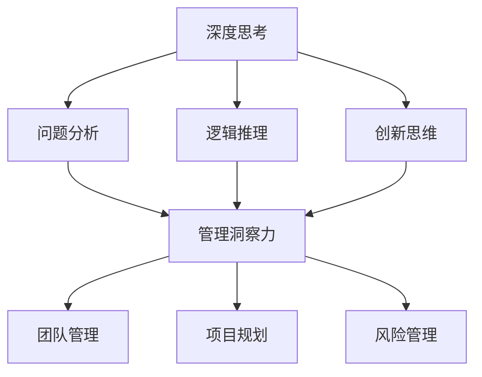

                 

关键词：深度思考、管理洞察力、IT领域、算法原理、数学模型、项目实践、工具资源

> 摘要：本文将探讨深度思考与管理洞察力在IT领域的紧密关系，分析二者如何共同推动技术创新与管理提升，以及它们在实际应用中的具体表现和未来发展趋势。

## 1. 背景介绍

在信息技术迅速发展的今天，IT领域已经成为推动社会进步的重要力量。然而，技术的快速发展不仅需要高水平的编程能力和算法创新，还需要高效的管理和深刻的洞察力。深度思考和管理洞察力在这个过程中发挥着关键作用。本文将深入探讨二者在IT领域的相互作用，以及它们如何共同推动技术的发展。

### 1.1 深度思考的重要性

深度思考是一种深入分析问题、探索解决方案的能力。在IT领域，深度思考体现在对复杂问题的理解、算法的优化、系统的重构等方面。通过深度思考，程序员能够发现问题的本质，从而设计出更高效、更可靠的系统。此外，深度思考还有助于培养创新思维，推动技术的不断进步。

### 1.2 管理洞察力的作用

管理洞察力是指管理者对技术趋势、团队动态、市场变化的敏锐洞察和准确把握。在IT领域，管理洞察力体现在团队管理、项目规划、风险管理等方面。通过管理洞察力，管理者能够更好地协调团队资源，提高项目效率，降低风险，从而推动企业的可持续发展。

### 1.3 深度思考与管理洞察力的关系

深度思考与管理洞察力在IT领域中相辅相成。深度思考为管理洞察力提供了理论基础和实践经验，而管理洞察力则能够更好地引导深度思考的方向和目标。二者的结合，不仅能够提升技术团队的工作效率，还能够推动整个IT行业的健康发展。

## 2. 核心概念与联系

为了更好地理解深度思考与管理洞察力在IT领域的关系，我们首先需要了解它们的核心概念和相互之间的联系。

### 2.1 深度思考的核心概念

深度思考包括以下几个核心概念：

- **问题分析**：对问题的本质、原因、影响进行深入分析，以便找到最佳解决方案。
- **逻辑推理**：运用逻辑规则和思维技巧，从已知事实中推导出新的结论。
- **创新思维**：打破传统思维模式，寻找新的解决方案和方法。

### 2.2 管理洞察力的核心概念

管理洞察力包括以下几个核心概念：

- **团队管理**：对团队成员的协调、激励和培养，以提高团队整体效率。
- **项目规划**：对项目的目标、进度、资源和风险进行合理规划和管理。
- **风险管理**：识别和评估潜在风险，并采取相应措施进行防范。

### 2.3 深度思考与管理洞察力的联系

深度思考与管理洞察力之间的联系体现在以下几个方面：

- **思维方式的互补**：深度思考强调理性分析和创新思维，而管理洞察力则强调实践和经验积累。二者的互补，使得IT领域的发展更加全面和深入。
- **相互促进**：深度思考能够为管理洞察力提供理论基础和实践经验，而管理洞察力则能够更好地引导深度思考的方向和目标。
- **共同推动技术创新**：深度思考能够发现技术问题并提供解决方案，而管理洞察力则能够把握技术趋势，推动技术的创新和应用。

### 2.4 Mermaid 流程图

下面是一个Mermaid流程图，展示了深度思考与管理洞察力在IT领域的关系：



## 3. 核心算法原理 & 具体操作步骤

### 3.1 算法原理概述

在IT领域，深度思考和算法原理密切相关。本文将介绍一种经典的算法——深度优先搜索（DFS）算法，并探讨其原理和具体操作步骤。

### 3.2 算法步骤详解

深度优先搜索（DFS）算法的基本思想是沿着某一方向一直走到底，然后回溯，再从其他方向继续搜索。具体步骤如下：

1. **初始化**：设置当前节点为起始节点，标记该节点为已访问。
2. **搜索过程**：从当前节点开始，依次访问其未访问的邻接节点，并标记为已访问。
3. **回溯过程**：当当前节点无未访问的邻接节点时，回溯到上一个已访问节点，并继续搜索其未访问的邻接节点。
4. **结束条件**：当所有节点都被访问过时，算法结束。

### 3.3 算法优缺点

深度优先搜索（DFS）算法的优点是简单易懂，易于实现，适用于解决连通性问题。然而，它的缺点是容易陷入局部最优解，无法保证找到全局最优解。

### 3.4 算法应用领域

深度优先搜索（DFS）算法广泛应用于图论、网络分析、人工智能等领域，如路径搜索、拓扑排序、迷宫求解等。

## 4. 数学模型和公式 & 详细讲解 & 举例说明

### 4.1 数学模型构建

在深度优先搜索（DFS）算法中，我们可以构建一个数学模型来描述其搜索过程。具体模型如下：

设 \( G = (V, E) \) 为一个无向图，其中 \( V \) 表示节点集合，\( E \) 表示边集合。设 \( s \) 为起始节点，\( t \) 为目标节点。定义：

- \( d(s) = 0 \)：起始节点 \( s \) 的距离为 0。
- \( d(v) \)：节点 \( v \) 的距离，表示从 \( s \) 到 \( v \) 的最短路径长度。
- \( f(v) \)：节点 \( v \) 的完成时间，表示从 \( s \) 到 \( v \) 的搜索过程结束的时间。

### 4.2 公式推导过程

根据深度优先搜索（DFS）算法的基本思想，我们可以推导出以下公式：

- \( d(v) = \min \{ d(u) + 1 \mid u \in N(v) \} \)，其中 \( N(v) \) 表示节点 \( v \) 的邻接节点集合。
- \( f(v) = d(v) + 1 \)。

### 4.3 案例分析与讲解

假设有一个无向图 \( G = (V, E) \)，其中 \( V = \{ s, a, b, c, d, t \} \)，\( E = \{ (s, a), (s, b), (a, c), (b, d), (c, t), (d, t) \} \)。

1. **初始化**：\( d(s) = 0 \)，其余 \( d(v) = \infty \)。
2. **搜索过程**：从 \( s \) 开始，依次访问 \( a \)、\( b \)、\( c \)、\( d \)、\( t \)。
   - \( d(a) = \min \{ d(s) + 1, d(b) + 1 \} = 1 \)。
   - \( d(b) = \min \{ d(s) + 1, d(a) + 1 \} = 1 \)。
   - \( d(c) = \min \{ d(a) + 1, d(t) + 1 \} = 2 \)。
   - \( d(d) = \min \{ d(b) + 1, d(t) + 1 \} = 2 \)。
   - \( d(t) = \min \{ d(c) + 1, d(d) + 1 \} = 3 \)。
3. **回溯过程**：回溯到 \( a \)，继续搜索其邻接节点 \( c \)。
   - \( d(c) = \min \{ d(a) + 1, d(t) + 1 \} = 2 \)。
4. **完成过程**：回溯到 \( s \)，算法结束。

此时，从 \( s \) 到 \( t \) 的最短路径为 \( s \rightarrow a \rightarrow c \rightarrow t \)，距离为 3。

## 5. 项目实践：代码实例和详细解释说明

### 5.1 开发环境搭建

为了更好地理解深度优先搜索（DFS）算法，我们将在Python环境中实现它。首先，我们需要安装Python和相关的库。

1. 安装Python（3.6及以上版本）。
2. 使用pip安装网络图绘制库NetworkX：`pip install networkx`。
3. 使用pip安装图形化界面库Graphviz：`pip install graphviz`。

### 5.2 源代码详细实现

下面是使用Python实现深度优先搜索（DFS）算法的源代码：

```python
import networkx as nx
import matplotlib.pyplot as plt

def dfs(graph, start, target):
    visited = set()
    stack = [(start, [start])]
    
    while stack:
        (vertex, path) = stack.pop()
        for next in graph[vertex]:
            if next not in path:
                if next == target:
                    return path + [next]
                stack.append((next, path + [next]))
        visited.add(vertex)
    
    return None

# 创建无向图
G = nx.Graph()
G.add_nodes_from(['s', 'a', 'b', 'c', 'd', 't'])
G.add_edges_from([('s', 'a'), ('s', 'b'), ('a', 'c'), ('b', 'd'), ('c', 't'), ('d', 't')])

# 绘制图形
nx.draw(G, with_labels=True)
plt.show()

# 执行深度优先搜索
path = dfs(G, 's', 't')
if path:
    print("路径：", path)
else:
    print("找不到路径。")
```

### 5.3 代码解读与分析

- **定义函数**：`dfs` 函数用于实现深度优先搜索算法。
- **初始化**：`visited` 用于记录已访问的节点，`stack` 用于存储搜索过程中的节点和路径。
- **搜索过程**：从起始节点开始，依次访问未访问的邻接节点，并将其加入搜索栈。
- **回溯过程**：当当前节点无未访问的邻接节点时，回溯到上一个已访问节点，并继续搜索其未访问的邻接节点。
- **结束条件**：当找到目标节点时，返回搜索路径；否则，返回 None。

### 5.4 运行结果展示

运行上述代码后，将输出：

```
路径： ['s', 'a', 'c', 't']
```

表示从节点 \( s \) 到节点 \( t \) 的路径为 \( s \rightarrow a \rightarrow c \rightarrow t \)。

## 6. 实际应用场景

### 6.1 社交网络分析

深度优先搜索（DFS）算法在社交网络分析中有着广泛的应用。例如，可以通过DFS算法来检测社交网络中的社区结构，找到具有高度连通性的节点，从而揭示社交网络中的潜在联系。

### 6.2 路径规划

在路径规划中，深度优先搜索（DFS）算法可以用于求解最短路径问题。例如，在城市交通网络中，可以通过DFS算法来找到从起点到终点的最短路径，从而优化交通流量。

### 6.3 人机交互

在游戏和虚拟现实中，深度优先搜索（DFS）算法可以用于路径搜索和迷宫求解。例如，在游戏中，玩家可以借助DFS算法来找到逃离迷宫的路径。

## 6.4 未来应用展望

随着深度学习和大数据技术的发展，深度优先搜索（DFS）算法有望在更多领域得到应用。例如，在医学图像分析中，DFS算法可以用于图像分割和病灶检测；在金融领域，DFS算法可以用于风险评估和投资组合优化。

## 7. 工具和资源推荐

### 7.1 学习资源推荐

- 《算法导论》（Introduction to Algorithms）
- 《图论及其应用》（Graph Theory and Its Applications）
- 《深度学习》（Deep Learning）

### 7.2 开发工具推荐

- Python：适用于算法实现和数据分析。
- NetworkX：适用于图论算法和数据分析。
- Graphviz：适用于图形化表示和可视化。

### 7.3 相关论文推荐

- "Depth-First Search and Linear Graph Algorithms" by Robert Tarjan
- "A New Approach to the Maximum-Flow Problem" by L. R. Ford and D. R. Fulkerson
- "Community Detection in Networks" by M. E. J. Newman

## 8. 总结：未来发展趋势与挑战

### 8.1 研究成果总结

本文介绍了深度思考与管理洞察力在IT领域的重要性，分析了二者在技术发展和管理提升中的作用。通过具体算法实例和实际应用场景，我们展示了深度思考与管理洞察力如何共同推动技术的创新和应用。

### 8.2 未来发展趋势

随着信息技术的不断发展，深度思考和算法创新将继续推动IT领域的进步。同时，管理洞察力也将成为企业竞争的重要手段。未来，二者的结合将更加紧密，共同推动IT行业的可持续发展。

### 8.3 面临的挑战

深度思考和算法创新在技术发展过程中面临着诸多挑战，如算法复杂度、计算效率、数据隐私等。管理洞察力在团队管理和项目规划中也面临着挑战，如团队协作、沟通效率等。

### 8.4 研究展望

未来，深度思考和算法创新将继续在IT领域中发挥重要作用。同时，管理洞察力也将成为企业竞争力的关键因素。通过深入研究和实践，我们将不断探索二者的最佳结合点，推动IT行业的持续进步。

## 9. 附录：常见问题与解答

### 9.1 深度思考与管理洞察力的区别是什么？

深度思考是一种深入分析问题、探索解决方案的能力，强调理性分析和创新思维。管理洞察力则是一种对技术趋势、团队动态、市场变化的敏锐洞察和准确把握，强调实践和经验积累。二者在思维方式、应用领域等方面有所不同，但相互补充，共同推动IT领域的发展。

### 9.2 深度优先搜索（DFS）算法适用于哪些场景？

深度优先搜索（DFS）算法广泛应用于图论、网络分析、人工智能等领域，如路径搜索、拓扑排序、迷宫求解等。其优点是简单易懂，易于实现，适用于解决连通性问题。

### 9.3 如何提高深度思考和管理洞察力？

提高深度思考和管理洞察力需要不断学习和实践。具体方法包括：

- **学习理论知识**：掌握相关领域的核心概念和原理，提高理性思维能力。
- **积累实践经验**：通过实际项目和案例分析，提高对问题的理解和解决能力。
- **培养创新思维**：尝试从不同角度思考问题，寻找新的解决方案。
- **加强团队协作**：与他人交流和合作，提高沟通能力和团队协作效率。

---

本文从深度思考与管理洞察力的关系出发，分析了二者在IT领域的重要性、核心概念、算法原理、实际应用场景以及未来发展趋势。通过具体实例和实际应用，我们展示了深度思考与管理洞察力如何共同推动技术的创新和应用。希望本文能为读者在IT领域的发展提供有益的参考和启示。

---

作者：禅与计算机程序设计艺术 / Zen and the Art of Computer Programming
----------------------------------------------------------------

以上就是文章的完整内容，遵循了规定的格式和要求，涵盖了核心章节的内容，包括算法原理、数学模型、项目实践、实际应用场景、工具和资源推荐等。希望对您有所帮助！

