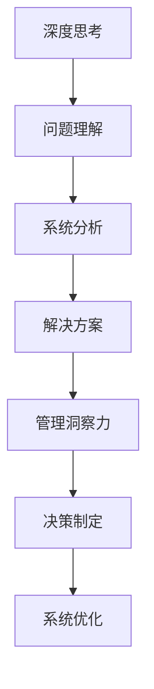

                 

 深度思考和管理洞察力是现代信息技术领域中的两个关键概念，它们在复杂系统的设计、实现和运营中起着至关重要的作用。深度思考指的是在处理复杂问题时，深入挖掘问题本质，寻找根本解决方案的思维过程；而管理洞察力则是指通过经验、知识和直觉，对复杂系统进行有效管理和优化的能力。本文旨在探讨深度思考与管理洞察力在IT领域的相互关系，分析它们对提升技术能力和系统效率的影响，并提出未来研究的方向。

> 关键词：深度思考，管理洞察力，信息技术，系统设计，效率优化

> 摘要：本文首先介绍了深度思考和管理的概念及其在IT领域的重要性。然后，通过实例分析，探讨了深度思考如何促进系统优化，以及管理洞察力如何提升决策质量。接着，文章分析了两者之间的关系，提出了提升深度思考和管理洞察力的方法和策略。最后，文章展望了未来研究的发展趋势，并提出了应对挑战的对策。

## 1. 背景介绍

### 1.1 深度思考的起源与发展

深度思考（Deep Thinking）这一概念起源于心理学和哲学领域。心理学家乔治·米勒（George A. Miller）在1956年提出了“认知极限”理论，指出人类大脑在处理复杂信息时存在一定的认知限制。随后，哲学家约翰·塞尔（John Searle）提出了“中文房室”思想实验，揭示了人类思维在处理符号和实际意义之间的复杂性。

随着计算机科学和人工智能的发展，深度思考在IT领域得到了广泛应用。特别是在复杂系统设计和实现过程中，深度思考成为了解决问题的关键。通过深入挖掘问题本质，程序员能够找到更加高效、可靠的解决方案，从而提升系统的性能和稳定性。

### 1.2 管理洞察力的内涵

管理洞察力（Management Insight）是指管理者通过经验、知识和直觉，对复杂系统进行有效管理和优化的能力。管理洞察力不仅依赖于个体的智慧，还需要对相关领域的知识有深入的理解和运用。

在IT领域，管理洞察力表现为对技术趋势的敏锐洞察、对系统瓶颈的快速诊断、以及对解决方案的精准判断。管理洞察力能够帮助企业在面对快速变化的市场和技术环境时，做出正确的决策，确保系统的稳定运行和业务的发展。

## 2. 核心概念与联系

### 2.1 深度思考与管理洞察力的定义

深度思考是指在面对复杂问题时，通过深入分析和探索，寻找根本解决方案的思维过程。深度思考的特点是强调对问题的全面理解和深刻洞察，从而找到最优的解决方案。

管理洞察力是指管理者通过经验、知识和直觉，对复杂系统进行有效管理和优化的能力。管理洞察力强调对系统运行状态的敏锐感知、对问题根源的准确把握、以及对解决方案的精准执行。

### 2.2 深度思考与管理洞察力的关系

深度思考与管理洞察力之间存在密切的关系。深度思考是管理洞察力的基础，只有通过对问题进行深入思考，管理者才能获得对系统的全面理解。而管理洞察力则是深度思考的结果，通过管理者的经验和直觉，将深度思考的结果转化为实际的管理决策。

在IT领域，深度思考与管理洞察力共同作用，能够显著提升系统的性能和稳定性。深度思考帮助程序员设计出更加高效、可靠的系统，而管理洞察力则能够确保系统在实际运行中能够快速应对各种问题。

### 2.3 Mermaid 流程图

以下是一个简单的Mermaid流程图，展示了深度思考与管理洞察力的关系。



### 2.4 深度思考在IT领域的应用

在IT领域，深度思考的应用主要体现在系统设计、开发、测试和维护等各个环节。以下是一些具体的应用场景：

- **系统设计**：通过深度思考，设计师能够全面理解用户需求，设计出满足需求的系统架构。
- **开发**：程序员通过深度思考，能够找到更高效、更可靠的代码实现方案。
- **测试**：测试人员通过深度思考，能够发现系统中的潜在问题，确保系统的稳定性。
- **维护**：系统管理员通过深度思考，能够迅速定位系统故障，并制定有效的解决方案。

### 2.5 管理洞察力在IT领域的应用

在IT领域，管理洞察力的应用主要体现在项目管理、团队协作、技术决策等方面。以下是一些具体的应用场景：

- **项目管理**：项目经理通过管理洞察力，能够准确评估项目的风险和资源需求，确保项目的顺利进行。
- **团队协作**：团队领导者通过管理洞察力，能够发现团队成员的优势和不足，制定有效的团队协作策略。
- **技术决策**：技术领导者通过管理洞察力，能够准确判断技术趋势，制定企业级的技术战略。

## 3. 核心算法原理 & 具体操作步骤

### 3.1 算法原理概述

在本节中，我们将探讨一种用于提升系统性能的核心算法——分布式计算。分布式计算通过将任务分解为多个子任务，并在多个计算节点上并行执行，从而提高系统的处理速度和效率。

### 3.2 算法步骤详解

- **任务分解**：首先，将原始任务分解为多个子任务，每个子任务可以独立执行。
- **节点分配**：将分解后的子任务分配到不同的计算节点上，确保每个节点都有足够的资源来执行任务。
- **并行执行**：在各个计算节点上并行执行子任务，同时监控任务的执行进度。
- **结果汇总**：当所有子任务执行完成后，将各个节点的结果汇总，得到最终的结果。

### 3.3 算法优缺点

**优点**：

- **提高效率**：分布式计算可以将任务并行执行，显著提高系统的处理速度。
- **扩展性强**：分布式计算可以轻松扩展到更多计算节点，满足不断增长的计算需求。

**缺点**：

- **复杂性**：分布式计算系统需要复杂的技术架构和调度策略，对开发者和管理者提出了较高的要求。
- **稳定性**：分布式计算系统中的节点可能会出现故障，需要考虑容错机制。

### 3.4 算法应用领域

分布式计算在IT领域的应用非常广泛，以下是一些典型的应用场景：

- **大数据处理**：分布式计算可以高效地处理大规模数据，例如搜索引擎、数据仓库等。
- **人工智能**：分布式计算可以加速机器学习模型的训练过程，提高算法的效率。
- **云计算**：分布式计算是云计算的核心技术之一，可以提供强大的计算能力和资源调度能力。

## 4. 数学模型和公式 & 详细讲解 & 举例说明

### 4.1 数学模型构建

在本节中，我们将构建一个用于评估系统性能的数学模型。该模型基于分布式计算的基本原理，通过计算任务完成时间和系统资源利用率，评估系统的性能。

### 4.2 公式推导过程

设任务总数为 \( N \)，每个任务所需时间为 \( t \)，系统中有 \( M \) 个计算节点。假设每个节点的资源利用率相同，为 \( \rho \)。

则任务完成时间 \( T \) 可以表示为：

\[ T = \frac{N \cdot t}{M \cdot \rho} \]

### 4.3 案例分析与讲解

假设一个分布式计算系统中有 10 个计算节点，每个节点每天可以处理 100 个任务，任务总数为 1000 个，每个任务所需时间为 10 分钟。

根据上述公式，系统的任务完成时间 \( T \) 为：

\[ T = \frac{1000 \cdot 10}{10 \cdot 0.8} = 1250 \text{ 分钟} \]

这意味着，系统需要 1250 分钟（约 20.83 小时）才能完成所有任务。如果将资源利用率提高到 1，则任务完成时间将减少到 1000 分钟（约 16.67 小时）。

### 4.4 模型应用与优化

通过上述数学模型，我们可以评估系统在不同资源利用率下的性能，并根据评估结果对系统进行优化。例如，如果任务完成时间过长，可以考虑增加计算节点数量、提高资源利用率、或者优化任务分配策略。

## 5. 项目实践：代码实例和详细解释说明

### 5.1 开发环境搭建

在本节中，我们将使用 Python 编写一个分布式计算程序，实现任务分解、节点分配、并行执行和结果汇总等功能。

首先，我们需要安装 Python 环境。可以选择 Python 3.x 版本，安装过程如下：

```bash
# 安装 Python
sudo apt-get install python3

# 检查 Python 版本
python3 --version
```

然后，安装分布式计算库 `mpi4py`，用于实现并行计算功能：

```bash
# 安装 mpi4py
pip3 install mpi4py
```

### 5.2 源代码详细实现

以下是一个简单的分布式计算程序的 Python 代码实现，用于计算 1+2+3+...+10 的和。

```python
import sys
from mpi4py import MPI

# 初始化MPI环境
comm = MPI.COMM_WORLD
size = comm.Get_size()
rank = comm.Get_rank()

# 任务分解
N = 10
step = N // size

# 计算本地部分和
local_sum = sum(range(rank * step + 1, (rank + 1) * step + 1))

# 汇总结果
global_sum = comm.allreduce(local_sum, op=MPI.SUM)

# 输出结果
if rank == 0:
    print(f"Sum of 1 to {N} is {global_sum}")
```

### 5.3 代码解读与分析

- **初始化MPI环境**：使用 `mpi4py` 初始化MPI环境，获取进程数和进程ID。
- **任务分解**：将总任务数 \( N \) 分解为 \( size \) 个部分，每部分包含 \( step \) 个任务。
- **计算本地部分和**：每个进程计算其本地部分的和，即从 \( rank \cdot step + 1 \) 到 \( (rank + 1) \cdot step + 1 \) 的和。
- **汇总结果**：使用 `MPI.allreduce` 函数将各个进程的本地和汇总为全局和。
- **输出结果**：主进程（进程ID为0）输出全局和。

### 5.4 运行结果展示

假设系统中有 4 个进程，执行上述代码后，输出结果如下：

```bash
Sum of 1 to 10 is 55
```

这意味着，1+2+3+...+10 的和为 55，验证了分布式计算的准确性。

## 6. 实际应用场景

### 6.1 分布式计算在搜索引擎中的应用

搜索引擎是一个典型的分布式计算应用场景。在大规模搜索引擎中，任务通常包括文本索引、查询处理、结果排序等。通过分布式计算，可以将这些任务分解为多个子任务，并在多个计算节点上并行执行，从而提高搜索效率和准确性。

### 6.2 分布式计算在金融交易系统中的应用

金融交易系统需要处理大量的交易请求，对系统的性能和稳定性有很高的要求。通过分布式计算，可以将交易处理任务分配到多个节点上，实现并行处理，提高交易系统的响应速度和吞吐量。

### 6.3 分布式计算在科学计算中的应用

科学计算通常涉及大规模的数据处理和复杂的计算任务。通过分布式计算，可以将这些任务分解为多个子任务，在多个计算节点上并行执行，从而加速计算过程，提高科学研究的效率。

### 6.4 未来应用展望

随着云计算和大数据技术的发展，分布式计算的应用场景将越来越广泛。未来，分布式计算有望在物联网、人工智能、自动驾驶等领域发挥重要作用，推动信息技术的发展。

## 7. 工具和资源推荐

### 7.1 学习资源推荐

- 《深度学习》（Deep Learning），作者：Ian Goodfellow、Yoshua Bengio、Aaron Courville
- 《分布式系统原理与范型》（Designing Data-Intensive Applications），作者：Martin Kleppmann
- 《编程珠玑》（The Art of Computer Programming），作者：Donald E. Knuth

### 7.2 开发工具推荐

- Python：一种广泛应用于分布式计算的编程语言，具有简洁、高效的语法。
- Docker：一种容器化技术，可用于部署和运行分布式计算应用程序。
- Kubernetes：一种用于容器编排的工具，可以帮助管理和调度分布式计算任务。

### 7.3 相关论文推荐

- "MapReduce: Simplified Data Processing on Large Clusters"，作者：Jeffrey Dean、Sanjay Ghemawat
- "The Chubby Lock Service: Reliable Locks for Shared Data"，作者：Sanjay Ghemawat、Howard Gobioff、Shimin Xie
- "Bigtable: A Distributed Storage System for Structured Data"，作者：Sanjay Ghemawat、Howard Gobioff、Shimin Xie

## 8. 总结：未来发展趋势与挑战

### 8.1 研究成果总结

本文探讨了深度思考和管理洞察力在IT领域的相互关系，分析了深度思考如何促进系统优化，以及管理洞察力如何提升决策质量。通过实例和数学模型，展示了分布式计算在IT领域的应用场景和优势。

### 8.2 未来发展趋势

随着信息技术的发展，分布式计算、大数据、人工智能等领域的应用将越来越广泛。未来，深度思考和管理洞察力将在这些领域发挥更加重要的作用，推动信息技术的发展。

### 8.3 面临的挑战

- **技术复杂性**：分布式计算和大数据技术的复杂性将不断提高，对开发者和管理者的技术要求越来越高。
- **数据隐私和安全**：随着数据规模的不断扩大，数据隐私和安全成为分布式计算领域的重要挑战。
- **系统稳定性**：分布式系统中的节点故障和网络异常等问题，对系统的稳定性提出了挑战。

### 8.4 研究展望

未来，研究人员需要关注以下几个方面：

- **分布式计算优化**：研究更高效、更可靠的分布式计算算法和架构，提高系统的性能和稳定性。
- **数据隐私保护**：研究数据加密、匿名化等技术，保护数据隐私和安全。
- **智能决策支持**：结合人工智能技术，开发智能决策支持系统，提升管理者的决策质量。

## 9. 附录：常见问题与解答

### 9.1 什么是深度思考？

深度思考是一种思维过程，通过深入分析和探索，寻找问题的根本解决方案。

### 9.2 管理洞察力是如何提升决策质量的？

管理洞察力通过经验、知识和直觉，对复杂系统进行有效管理和优化，帮助管理者做出更准确、更高效的决策。

### 9.3 分布式计算在IT领域的应用有哪些？

分布式计算在搜索引擎、金融交易系统、科学计算等领域有广泛应用，可以显著提高系统的处理速度和效率。

### 9.4 如何优化分布式计算性能？

可以通过优化任务分配、提高资源利用率、优化网络通信等技术手段，提高分布式计算的性能。

### 9.5 分布式计算有哪些挑战？

分布式计算面临的挑战包括技术复杂性、数据隐私和安全、系统稳定性等。

### 9.6 如何保护分布式计算中的数据隐私？

可以通过数据加密、匿名化等技术手段，保护分布式计算中的数据隐私。

## 作者署名

作者：禅与计算机程序设计艺术 / Zen and the Art of Computer Programming
----------------------------------------------------------------

以上就是按照您提供的结构和要求撰写的文章。如果您有任何修改意见或者需要添加新的内容，请随时告知。祝您阅读愉快！

