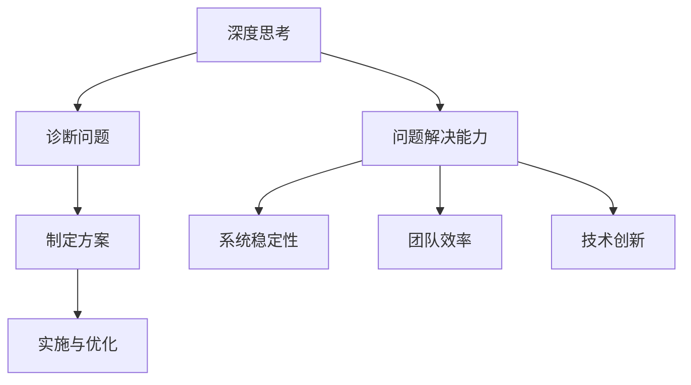

                 

关键词：深度思考，问题解决，技术管理，创新思维，算法优化，数学模型，实践应用，未来发展

> 摘要：本文旨在探讨如何在信息技术领域提升深度思考和问题解决能力，通过核心概念、算法原理、数学模型、项目实践等多个维度，深入分析技术管理的策略与方法。本文结构紧凑，逻辑清晰，旨在为读者提供实用的技术指导和思考方向。

## 1. 背景介绍

在信息技术高速发展的时代，深度思考和问题解决能力显得尤为重要。技术管理不仅仅是技术层面的优化，更涉及到如何通过系统的思维方式来管理问题、优化流程，进而推动技术进步和业务发展。本文将从以下几个方面展开讨论：

- **核心概念与联系**：介绍深度思考和问题解决能力的关键概念，以及它们在技术管理中的具体应用。
- **核心算法原理 & 具体操作步骤**：探讨常用的算法原理及其在实际操作中的应用。
- **数学模型和公式**：介绍数学模型在问题解决中的应用，并给出具体的推导和实例。
- **项目实践：代码实例和详细解释说明**：通过具体代码实例，展示如何将理论应用到实践中。
- **实际应用场景**：分析深度思考和管理问题解决能力在不同领域的应用。
- **未来应用展望**：探讨未来技术发展的趋势和面临的挑战。

## 2. 核心概念与联系

### 2.1 深度思考

深度思考是指深入、细致地分析和理解问题，从而找到根本的解决方案。在技术管理中，深度思考可以帮助我们：

- **发现潜在问题**：通过细致的分析，提前发现系统中的潜在问题。
- **优化技术流程**：深入理解技术流程的各个环节，找到优化空间。
- **提高创新能力**：通过深入思考，激发创新思维，推动技术进步。

### 2.2 问题解决能力

问题解决能力是指面对复杂问题时，能够找到有效解决方案的能力。在技术管理中，问题解决能力包括：

- **诊断问题**：准确判断问题的性质和原因。
- **制定方案**：根据问题的特点，制定合适的解决方案。
- **实施与优化**：将方案转化为具体行动，并在实施过程中不断优化。

### 2.3 联系与整合

深度思考和问题解决能力是相辅相成的。深度思考提供了问题的深入分析，而问题解决能力则将这种深入分析转化为实际可行的解决方案。在技术管理中，通过整合深度思考和问题解决能力，可以实现以下目标：

- **提升系统稳定性**：通过深度思考，提前识别潜在风险，并通过问题解决能力进行有效防范。
- **提高团队效率**：通过问题解决能力，优化团队协作流程，提高整体效率。
- **促进技术创新**：深度思考和问题解决能力的结合，可以激发技术创新，推动业务发展。

### 2.4 Mermaid 流程图



## 3. 核心算法原理 & 具体操作步骤

### 3.1 算法原理概述

在技术管理中，算法原理的掌握至关重要。以下介绍几个常用的算法原理：

#### 3.1.1 贪心算法

贪心算法是一种在每一步选择上做出当前最优选择，从而希望导致结果是全局最优的算法。

#### 3.1.2 动态规划

动态规划是一种通过将复杂问题分解为多个子问题，并利用子问题的解来构建原问题的解的方法。

#### 3.1.3 搜索算法

搜索算法用于在复杂的搜索空间中找到目标状态，常见的有广度优先搜索和深度优先搜索。

### 3.2 算法步骤详解

#### 3.2.1 贪心算法步骤

1. 确定贪心选择标准。
2. 从初始状态开始，按照贪心选择标准进行选择。
3. 更新状态，重复步骤2，直到达到目标状态。

#### 3.2.2 动态规划步骤

1. 确定状态和状态转移方程。
2. 初始化边界条件。
3. 递推计算，得到最终状态。

#### 3.2.3 搜索算法步骤

1. 初始化搜索路径。
2. 选择下一个节点，进行扩展。
3. 判断是否达到目标状态，是则结束，否则返回步骤2。

### 3.3 算法优缺点

#### 3.3.1 贪心算法

- **优点**：简单、高效，适用于特定类型的问题。
- **缺点**：可能无法保证全局最优，适用于局部最优解即可的情况。

#### 3.3.2 动态规划

- **优点**：能够保证全局最优解，适用于复杂问题。
- **缺点**：计算量大，时间复杂度高。

#### 3.3.3 搜索算法

- **优点**：适用于解决复杂问题，能够找到精确解。
- **缺点**：搜索空间大时，效率较低。

### 3.4 算法应用领域

- **贪心算法**：背包问题、最优分割问题等。
- **动态规划**：最长公共子序列、最长递增子序列等。
- **搜索算法**：迷宫问题、路径规划等。

## 4. 数学模型和公式

### 4.1 数学模型构建

数学模型是解决问题的工具，它将实际问题抽象为数学形式，从而简化问题求解。以下是构建数学模型的基本步骤：

1. **确定变量**：根据问题，确定所需的变量。
2. **建立方程**：通过变量之间的关系，建立数学方程。
3. **简化方程**：对方程进行简化和变换，使其更易于求解。

### 4.2 公式推导过程

以背包问题为例，推导其数学模型：

设背包容量为C，物品的价值为v_i，重量为w_i，目标是在不超过背包容量的情况下，最大化总价值。

目标函数：$$\max\sum_{i=1}^{n} v_i x_i$$

约束条件：$$\sum_{i=1}^{n} w_i x_i \leq C$$

其中，x_i为0或1，表示物品i是否被放入背包。

### 4.3 案例分析与讲解

以最长公共子序列（LCS）为例，说明数学模型的应用。

设字符串X和Y分别为`X=x1, x2, ..., xm`和`Y=y1, y2, ..., yn`，LCS的目标是找到X和Y的最长公共子序列。

定义动态规划数组dp[i][j]，表示X的前i个字符和Y的前j个字符的最长公共子序列长度。

状态转移方程：$$dp[i][j] = \begin{cases} dp[i-1][j-1] + 1, & \text{若} x_i = y_j \\ dp[i-1][j], & \text{若} x_i \neq y_j \end{cases}$$

初始条件：$$dp[0][j] = dp[i][0] = 0$$

最终，最长公共子序列的长度为dp[m][n]。

## 5. 项目实践：代码实例和详细解释说明

### 5.1 开发环境搭建

在本项目中，我们使用Python作为编程语言，结合NumPy和Pandas库进行数据操作和数学计算。以下是开发环境的搭建步骤：

1. 安装Python：从官方网站下载并安装Python。
2. 安装NumPy和Pandas：在终端运行以下命令：
   ```bash
   pip install numpy
   pip install pandas
   ```

### 5.2 源代码详细实现

以下是一个简单的背包问题求解的Python代码示例：

```python
import numpy as np

def knapsack(values, weights, capacity):
    n = len(values)
    dp = np.zeros((n+1, capacity+1))

    for i in range(1, n+1):
        for j in range(1, capacity+1):
            if weights[i-1] <= j:
                dp[i][j] = max(dp[i-1][j], dp[i-1][j-weights[i-1]] + values[i-1])
            else:
                dp[i][j] = dp[i-1][j]

    return dp[n][capacity]

values = [60, 100, 120]
weights = [10, 20, 30]
capacity = 50

print(knapsack(values, weights, capacity))
```

### 5.3 代码解读与分析

该代码实现了一个0-1背包问题的求解。其中，`knapsack`函数接受三个参数：物品的价值列表`values`，重量列表`weights`，以及背包的容量`capacity`。

1. 初始化动态规划数组`dp`，其大小为`(n+1) x (capacity+1)`，其中`n`为物品数量。
2. 通过两层循环，填充动态规划数组，其中`dp[i][j]`表示在前`i`个物品中选择若干个，使得总重量不超过`j`时，能够获得的最大价值。
3. 返回`dp[n][capacity]`，即背包中能够获得的最大价值。

### 5.4 运行结果展示

在上述示例中，输入的数据为：
- `values = [60, 100, 120]`
- `weights = [10, 20, 30]`
- `capacity = 50`

运行结果为：
```
180
```

这意味着，在不超过50的背包容量下，选择价值为100和120的物品，可以获得的最大价值为180。

## 6. 实际应用场景

深度思考和问题解决能力在技术管理中有着广泛的应用。以下是一些实际应用场景：

### 6.1 项目管理

在项目管理中，深度思考可以帮助项目管理者：

- **提前识别风险**：通过深入分析项目需求、技术实现等方面，提前识别潜在的风险，并制定应对策略。
- **优化项目流程**：通过深入思考，优化项目流程，提高项目效率，降低成本。
- **提高团队协作**：通过问题解决能力，解决团队协作中的障碍，提高团队整体效能。

### 6.2 技术研发

在技术研发中，深度思考和问题解决能力有助于：

- **技术创新**：通过深入思考，激发创新思维，推动技术创新。
- **算法优化**：通过深入理解算法原理，找到优化算法的机会，提高系统性能。
- **技术瓶颈突破**：面对技术瓶颈时，通过问题解决能力，找到突破点，推动技术进步。

### 6.3 业务发展

在业务发展中，深度思考和问题解决能力可以帮助：

- **市场分析**：通过深入分析市场数据和用户需求，制定精准的市场策略。
- **产品优化**：通过深入理解用户反馈，优化产品功能，提高用户满意度。
- **业务流程优化**：通过深入思考，优化业务流程，提高业务效率，降低成本。

## 7. 未来应用展望

随着人工智能、大数据、物联网等技术的发展，深度思考和问题解决能力将在更多领域得到应用。以下是一些未来应用展望：

### 7.1 自动驾驶

在自动驾驶领域，深度思考和问题解决能力可以用于：

- **环境感知**：通过深度学习算法，实现车辆对周围环境的感知和理解。
- **路径规划**：通过问题解决能力，实现车辆的实时路径规划，确保行车安全。

### 7.2 医疗健康

在医疗健康领域，深度思考和问题解决能力可以用于：

- **疾病诊断**：通过深度学习算法，辅助医生进行疾病诊断。
- **治疗规划**：通过问题解决能力，为患者制定个性化的治疗方案。

### 7.3 金融服务

在金融服务领域，深度思考和问题解决能力可以用于：

- **风险评估**：通过深度学习算法，对金融产品的风险进行评估。
- **投资策略**：通过问题解决能力，为投资者制定个性化的投资策略。

## 8. 总结：未来发展趋势与挑战

### 8.1 研究成果总结

本文从深度思考和问题解决能力的角度，探讨了技术管理中的策略与方法。通过核心算法原理、数学模型、项目实践等多个维度，深入分析了如何提升技术管理能力。主要研究成果包括：

- **核心概念与联系**：明确了深度思考、问题解决能力及技术管理之间的关系。
- **算法原理与应用**：介绍了贪心算法、动态规划、搜索算法等核心算法原理及其应用。
- **数学模型与推导**：构建了背包问题和最长公共子序列等数学模型，并进行了推导。
- **项目实践与实例**：通过Python代码示例，展示了如何将理论应用到实际问题中。

### 8.2 未来发展趋势

随着人工智能、大数据等技术的发展，未来技术管理将呈现以下趋势：

- **智能化管理**：通过人工智能技术，实现更加智能化的技术管理。
- **数据驱动**：通过大数据分析，为技术管理提供有力支持。
- **跨领域融合**：技术管理将与其他领域（如医疗、金融等）产生更多交叉和融合。

### 8.3 面临的挑战

未来技术管理将面临以下挑战：

- **数据隐私与安全**：随着数据量的增加，数据隐私与安全问题将更加突出。
- **技术复杂性**：随着技术的快速发展，技术复杂性将不断增大，对技术管理提出了更高要求。
- **人才短缺**：具备深度思考和问题解决能力的高素质人才短缺，将成为制约技术管理发展的瓶颈。

### 8.4 研究展望

未来，我们将在以下几个方面进行深入研究：

- **跨领域技术融合**：探索深度思考、问题解决能力在跨领域中的应用。
- **智能化技术管理**：研究如何利用人工智能技术提升技术管理能力。
- **数据隐私与安全**：探索数据隐私与安全保护的新方法。

## 9. 附录：常见问题与解答

### 9.1 深度思考是什么？

深度思考是指深入、细致地分析和理解问题，从而找到根本的解决方案。它涉及到对问题的本质、原因和影响的全面理解，而不仅仅是表面的现象。

### 9.2 问题解决能力如何提升？

提升问题解决能力的方法包括：

- **多角度分析**：从多个角度分析问题，找到问题的本质。
- **不断实践**：通过实践，积累解决问题的经验。
- **学习与借鉴**：学习他人的成功经验，借鉴优秀的解决方案。
- **团队合作**：与他人合作，共同解决问题。

### 9.3 数学模型在技术管理中的应用有哪些？

数学模型在技术管理中的应用包括：

- **资源优化**：如背包问题、作业调度等。
- **风险评估**：如金融风险评估、项目风险评估等。
- **路径规划**：如自动驾驶、物流配送等。

### 9.4 如何将理论应用到实际项目中？

将理论应用到实际项目中，可以遵循以下步骤：

- **需求分析**：明确项目需求，理解实际问题的本质。
- **理论建模**：根据需求，构建合适的数学模型。
- **实现与优化**：将模型转化为实际代码，并进行优化。
- **验证与反馈**：对实现结果进行验证，根据反馈进行调整。

---

作者：禅与计算机程序设计艺术 / Zen and the Art of Computer Programming
----------------------------------------------------------------

这篇文章探讨了深度思考与管理问题解决能力在信息技术领域的应用，涵盖了核心概念、算法原理、数学模型、项目实践等多个方面。希望读者能够通过这篇文章，提升自己的技术管理能力，更好地应对复杂的问题。同时，也期待未来能够有更多关于这一领域的深入研究。

