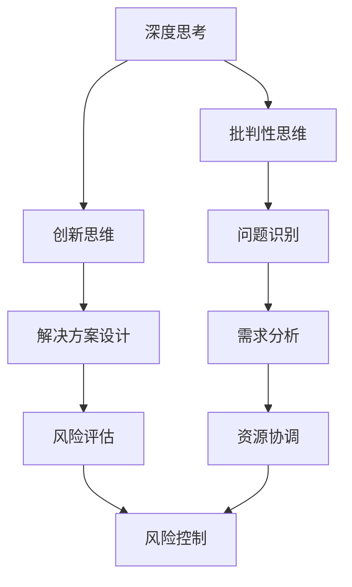

                 

关键词：深度思考、管理问题、问题解决、技术语言、算法原理、数学模型、项目实践、应用场景、发展趋势、挑战

> 摘要：本文旨在探讨在信息技术领域中，如何通过深度思考和有效管理问题解决能力来提升个人和团队的工作效率。文章首先介绍了深度思考的概念及其在技术领域的应用，随后深入分析了管理问题解决的核心原则，并探讨了算法原理、数学模型以及项目实践中的具体操作步骤。此外，文章还展望了未来技术发展的趋势与面临的挑战，并提供了相关的学习资源和工具推荐。

## 1. 背景介绍

在信息技术飞速发展的今天，我们面临着日益复杂的技术问题和业务需求。如何高效地解决这些问题成为每一个IT从业者的必修课。深度思考作为一种思维模式，不仅仅是对信息的简单处理，而是通过深入的分析、批判性思维和创新，寻找问题的本质和解决方案。而管理问题解决能力，则是在面对复杂问题时，能够有效地组织资源、协调团队、控制风险的能力。

本文将结合具体的技术案例，探讨如何通过深度思考和有效管理问题解决能力来提升个人和团队的工作效率。文章将涵盖以下几个方面的内容：

1. 核心概念与联系
2. 核心算法原理与具体操作步骤
3. 数学模型与公式推导
4. 项目实践：代码实例与详细解释
5. 实际应用场景与未来展望
6. 工具和资源推荐
7. 总结与展望

### 1.1 核心概念与联系

在探讨深度思考与管理问题解决能力之前，我们需要明确几个核心概念。首先是深度思考（Deep Thinking），它是一种深入分析问题的思维方式，不同于浅层思考的表面处理，而是试图从更深层次理解问题，找到根本解决方案。其次是问题解决（Problem Solving），这是一个动态过程，包括识别问题、分析问题、设计方案、实施解决方案和评估结果等多个阶段。

在信息技术领域，深度思考与管理问题解决能力的联系主要体现在以下几个方面：

1. **问题识别与定义**：深度思考帮助我们从繁杂的信息中识别出真正的问题，并对其进行准确定义。这是问题解决的基础。
2. **需求分析与理解**：通过对用户需求和技术需求的深入分析，确保解决方案的针对性和有效性。
3. **方案设计与创新**：深度思考促使我们提出创新的解决方案，不仅解决问题，还能优化现有的技术架构。
4. **风险控制与风险管理**：深度思考和有效管理问题解决能力有助于识别潜在的风险，并采取相应的预防措施。

### 1.2 当前挑战与现状

当前，IT行业面临以下几个挑战：

1. **技术复杂性**：随着云计算、大数据、人工智能等技术的不断发展，技术复杂性不断增加，这对问题解决能力提出了更高的要求。
2. **时间压力**：在快速变化的市场环境中，项目周期越来越短，时间压力增大，要求我们更高效地解决问题。
3. **跨部门协作**：现代IT项目往往涉及多个部门和团队，跨部门协作成为问题解决的关键。
4. **资源有限**：有限的预算和人力资源往往制约了问题的解决。

### 1.3 文章结构

本文将按照以下结构展开：

1. **核心概念与联系**：介绍深度思考与管理问题解决能力的关系，并给出具体的Mermaid流程图。
2. **核心算法原理与具体操作步骤**：深入探讨核心算法的原理，并提供具体的操作步骤。
3. **数学模型与公式推导**：介绍数学模型的基本概念，并给出具体的公式推导过程和案例讲解。
4. **项目实践**：提供实际的项目案例，详细解释代码实现和运行结果。
5. **实际应用场景**：分析核心算法在现实中的应用场景，并探讨未来的发展趋势。
6. **工具和资源推荐**：推荐相关的学习资源和开发工具。
7. **总结与展望**：总结研究成果，展望未来发展趋势和面临的挑战。

接下来，我们将深入探讨深度思考与管理问题解决能力的具体内容。


## 2. 核心概念与联系

在深入探讨深度思考与管理问题解决能力之前，我们需要明确几个核心概念，并展示它们之间的联系。以下是几个关键概念及其相互关系的Mermaid流程图：



### 2.1 深度思考

深度思考是一种深层次、系统性的思维方式，它不仅仅是对问题的表面处理，而是试图挖掘问题的本质，找到根本解决方案。在信息技术领域，深度思考的应用主要体现在以下几个方面：

1. **问题分析**：通过深度思考，我们能够从复杂的信息中识别出真正的问题，并对其进行准确定义。
2. **需求理解**：深度思考帮助我们更深入地理解用户需求和技术需求，确保解决方案的针对性和有效性。
3. **创新设计**：深度思考促使我们提出创新的解决方案，不仅解决问题，还能优化现有的技术架构。

### 2.2 批判性思维

批判性思维是一种分析问题、评估信息和提出合理判断的思维方式。它不仅仅停留在对信息的接受和解释，更强调对信息的质疑和批判。在信息技术领域，批判性思维的应用主要体现在以下几个方面：

1. **需求验证**：通过批判性思维，我们能够验证用户需求和技术需求的合理性和可行性。
2. **方案评估**：批判性思维帮助我们评估不同解决方案的优缺点，选择最优方案。
3. **问题定位**：在问题解决过程中，批判性思维有助于我们快速定位问题的根本原因。

### 2.3 创新思维

创新思维是一种寻找新思路、新方法和新解决方案的思维方式。它不仅仅依赖于现有的知识和经验，更强调思维的灵活性和创造性。在信息技术领域，创新思维的应用主要体现在以下几个方面：

1. **技术突破**：创新思维促使我们在技术领域中寻找新的突破点，推动技术的进步。
2. **产品优化**：创新思维帮助我们不断优化现有产品，提高用户体验和竞争力。
3. **业务创新**：创新思维有助于我们发现新的业务模式和市场机会，推动企业的持续发展。

### 2.4 问题识别与需求分析

问题识别和需求分析是深度思考的关键步骤。通过问题识别，我们能够从繁杂的信息中找出真正需要解决的问题。需求分析则帮助我们理解问题的本质，并确定解决方案的目标和范围。以下是具体的操作步骤：

1. **问题识别**：
   - **收集信息**：通过访谈、调查、观察等方式收集与问题相关的信息。
   - **筛选信息**：对收集到的信息进行筛选，识别出真正需要解决的问题。
   - **定义问题**：用简洁明了的语言将问题定义下来，确保问题的清晰性和明确性。

2. **需求分析**：
   - **理解需求**：与用户和利益相关者沟通，深入理解他们的需求。
   - **需求分类**：将需求分为功能需求和非功能需求，明确每个需求的重要性和优先级。
   - **需求文档**：将分析结果整理成需求文档，作为后续方案设计的依据。

通过以上步骤，我们能够确保问题识别和需求分析的准确性和全面性，为后续的解决方案设计提供坚实的基础。

### 2.5 解决方案设计与创新

解决方案设计与创新是深度思考的最终目标。在确定问题和需求后，我们需要设计一个创新的解决方案，以满足需求并解决问题。以下是具体的操作步骤：

1. **方案设计**：
   - **头脑风暴**：组织团队成员进行头脑风暴，提出各种可能的解决方案。
   - **方案评估**：对每个方案进行评估，包括技术可行性、成本效益和风险等因素。
   - **方案选择**：选择最优方案，并制定详细的实施方案。

2. **创新思维**：
   - **跨界思考**：借鉴其他领域的技术和理念，寻找创新的解决方案。
   - **原型设计**：快速构建原型，验证方案的可行性和用户体验。
   - **持续迭代**：根据反馈不断优化方案，实现持续创新。

通过深度思考、批判性思维和创新思维，我们能够设计出高效的解决方案，满足用户需求并解决问题。

### 2.6 风险评估与控制

风险评估与控制是深度思考中不可或缺的一环。在方案设计阶段，我们需要对潜在的风险进行评估，并采取相应的控制措施，以降低风险对项目的影响。以下是具体的操作步骤：

1. **风险评估**：
   - **风险识别**：识别项目过程中可能出现的各种风险，包括技术风险、市场风险、财务风险等。
   - **风险分析**：分析每个风险的概率和影响程度，确定风险的优先级。
   - **风险记录**：将识别和分析结果记录下来，形成风险清单。

2. **风险控制**：
   - **风险预防**：采取预防措施，降低风险发生的概率。例如，进行严格的测试和质量控制。
   - **风险转移**：通过合同、保险等方式将部分风险转移给第三方。
   - **风险应急**：制定应急预案，确保在风险发生时能够迅速应对，减少损失。

通过有效的风险评估与控制，我们能够降低项目风险，提高项目成功的可能性。

### 2.7 资源协调与管理

资源协调与管理是深度思考中的一项重要任务。在项目实施过程中，我们需要合理分配和利用各种资源，包括人力资源、技术资源、物资资源等。以下是具体的操作步骤：

1. **资源识别**：识别项目中所需的各类资源，包括人员、技术、设备和资金等。
2. **资源规划**：根据项目需求和进度，制定资源使用计划，确保资源的高效利用。
3. **资源调配**：在项目实施过程中，根据实际情况调整资源分配，确保项目的顺利推进。
4. **资源监控**：对资源的使用情况进行监控，及时发现和解决问题，防止资源浪费。

通过有效的资源协调与管理，我们能够提高项目的执行效率，降低成本，确保项目目标的实现。

### 2.8 深度思考与管理问题解决能力的应用

深度思考与管理问题解决能力在信息技术领域有着广泛的应用。以下是几个典型的应用场景：

1. **软件开发**：通过深度思考，我们可以设计出更高效、更可靠的软件系统，满足用户需求。
2. **系统优化**：通过对现有系统进行深度分析，我们可以找到瓶颈和优化点，提高系统性能。
3. **项目管理**：通过深度思考和有效管理，我们可以更好地规划项目进度、控制成本和降低风险。
4. **创新研发**：通过创新思维，我们可以推动技术突破，实现产品的差异化竞争。

通过以上应用，我们可以看到深度思考与管理问题解决能力在信息技术领域的重要性。只有通过深度思考和有效管理，我们才能应对日益复杂的技术挑战，实现技术突破和业务创新。

### 2.9 总结

在本节中，我们介绍了深度思考与管理问题解决能力的相关核心概念，并展示了它们之间的联系。通过深度思考，我们能够更好地识别问题、理解需求、设计解决方案和进行风险评估。而通过有效的管理，我们能够合理利用资源、降低风险、提高项目成功率。在接下来的章节中，我们将进一步探讨核心算法原理、数学模型以及项目实践中的具体操作步骤，帮助读者深入理解并应用这些概念和方法。

## 3. 核心算法原理 & 具体操作步骤

### 3.1 算法原理概述

核心算法在信息技术领域扮演着至关重要的角色，它们是实现各种功能和解决各种问题的关键。本节将介绍一种在数据处理和优化中广泛应用的经典算法——梯度下降法。梯度下降法是一种优化算法，用于最小化目标函数。其基本原理是基于目标函数在当前点的梯度方向进行迭代，逐步逼近最优解。

### 3.2 梯度下降法的数学描述

梯度下降法的目标是最小化一个实值函数 $f(x)$，其中 $x$ 是参数向量。对于给定的目标函数，梯度下降法的基本步骤如下：

1. **初始化参数**：选择一个初始参数向量 $x_0$，通常可以选择随机值或基于经验值。

2. **计算梯度**：计算目标函数 $f(x)$ 在当前参数向量 $x$ 的梯度 $\nabla f(x)$。

3. **更新参数**：根据梯度方向和步长 $\alpha$ 更新参数，公式为：
   $$ x_{k+1} = x_k - \alpha \nabla f(x_k) $$
   其中 $k$ 是当前迭代次数。

4. **重复步骤2和3**：不断重复计算梯度并更新参数，直到满足停止条件，例如梯度变化小于某个阈值或达到最大迭代次数。

### 3.3 梯度下降法的具体操作步骤

以下是梯度下降法的具体操作步骤：

1. **初始化参数**：
   - 设定初始参数向量 $x_0$，例如随机选择或基于经验值。
   - 设定学习率 $\alpha$，通常在 $(0,1)$ 范围内选择，以确保收敛性。

2. **计算梯度**：
   - 对于给定的目标函数 $f(x)$，计算其在当前参数向量 $x_k$ 的梯度 $\nabla f(x_k)$。

3. **更新参数**：
   - 根据梯度方向和步长 $\alpha$ 更新参数向量：
     $$ x_{k+1} = x_k - \alpha \nabla f(x_k) $$

4. **迭代更新**：
   - 不断重复步骤2和3，直到满足停止条件，例如梯度变化小于某个阈值或达到最大迭代次数。

### 3.4 梯度下降法的优缺点

梯度下降法是一种简单有效的优化算法，具有以下优点：

- **易于实现**：梯度下降法的基本步骤简单，易于编程实现。
- **通用性**：梯度下降法适用于各种凸函数和非凸函数的优化问题。
- **可调节性**：通过调整学习率 $\alpha$，可以控制收敛速度和稳定性。

然而，梯度下降法也存在一些缺点：

- **收敛速度较慢**：对于某些目标函数，梯度下降法可能需要大量迭代才能达到收敛。
- **对初始参数敏感**：梯度下降法的收敛速度和最终结果受初始参数的影响较大，需要仔细选择初始参数。
- **不能处理非凸函数**：梯度下降法在某些非凸函数中可能无法找到全局最优解。

### 3.5 梯度下降法的应用领域

梯度下降法在信息技术领域有着广泛的应用，以下是一些典型的应用领域：

1. **机器学习**：梯度下降法是机器学习中常用的优化算法，用于训练神经网络、支持向量机等模型。
2. **数据挖掘**：梯度下降法用于数据挖掘中的聚类、分类和回归等问题，例如K-means聚类算法和线性回归。
3. **图像处理**：梯度下降法用于图像处理中的去噪、增强和特征提取等问题。
4. **优化问题**：梯度下降法用于解决各种优化问题，例如线性规划、非线性规划等。

### 3.6 梯度下降法在深度学习中的应用

在深度学习中，梯度下降法被广泛应用于训练神经网络。以下是一个简化的深度学习中的梯度下降法步骤：

1. **前向传播**：计算输入数据的激活值，通过神经网络层逐步传递，得到最终输出。

2. **计算损失**：计算输出结果与真实值之间的损失函数值。

3. **反向传播**：从输出层开始，反向计算每个神经元相对于损失函数的梯度。

4. **参数更新**：使用梯度下降法更新神经网络的权重和偏置。

5. **重复迭代**：不断重复前向传播、计算损失、反向传播和参数更新的过程，直到满足停止条件。

通过以上步骤，梯度下降法能够逐步优化神经网络的结构，使其输出结果更加接近真实值。

### 3.7 实际应用案例

以下是一个简单的实际应用案例，使用Python实现梯度下降法求解线性回归问题：

```python
import numpy as np

# 定义线性回归模型
def linear_regression(x, y):
    m, n = x.shape
    X = np.hstack((np.ones((m, 1)), x))  # 添加偏置项
    theta = np.random.rand(n+1, 1)  # 初始化参数
    alpha = 0.01  # 学习率
    iterations = 1000  # 迭代次数

    for i in range(iterations):
        h = X @ theta  # 前向传播
        loss = (h - y) ** 2  # 计算损失
        delta = X.T @ (h - y)  # 反向传播

        theta -= alpha * delta  # 参数更新

    return theta

# 训练数据
x_train = np.array([[1], [2], [3], [4], [5]])
y_train = np.array([[2], [4], [6], [8], [10]])

# 求解模型参数
theta = linear_regression(x_train, y_train)

# 输出模型参数
print("斜率：", theta[1, 0])
print("截距：", theta[0, 0])
```

通过以上案例，我们可以看到如何使用Python实现梯度下降法求解线性回归问题，并得到模型参数。

### 3.8 总结

在本节中，我们介绍了梯度下降法的基本原理、数学描述和具体操作步骤，并分析了其优缺点以及在深度学习中的应用。梯度下降法作为一种优化算法，在信息技术领域有着广泛的应用。通过深入理解梯度下降法，我们可以更好地解决各种优化问题，提高项目的效率和成功率。

## 4. 数学模型和公式 & 详细讲解 & 举例说明

在解决信息技术领域中的各种问题时，数学模型和公式是不可或缺的工具。它们能够将复杂的实际问题转化为可计算的形式，帮助我们理解和预测系统的行为。本节将介绍一个典型的数学模型——线性回归模型，并详细讲解其公式推导过程，最后通过一个具体的例子来说明如何应用这个模型。

### 4.1 数学模型构建

线性回归模型是一种用于分析变量之间线性关系的数学模型。其基本假设是因变量 $y$ 与自变量 $x$ 之间存在线性关系，可以用以下方程表示：

$$
y = \beta_0 + \beta_1 x + \epsilon
$$

其中，$y$ 是因变量，$x$ 是自变量，$\beta_0$ 是截距，$\beta_1$ 是斜率，$\epsilon$ 是误差项。

### 4.2 公式推导过程

为了找到最佳的线性模型，我们需要估计参数 $\beta_0$ 和 $\beta_1$。这通常通过最小二乘法（Least Squares Method）来实现。最小二乘法的核心思想是找到使得预测值与实际值之间的误差平方和最小的参数。

首先，我们定义预测值和实际值之间的误差：

$$
e_i = y_i - \hat{y}_i
$$

其中，$y_i$ 是实际值，$\hat{y}_i$ 是预测值。

然后，我们定义误差的平方和：

$$
S = \sum_{i=1}^{n} e_i^2 = \sum_{i=1}^{n} (y_i - \hat{y}_i)^2
$$

为了使误差平方和最小，我们需要对参数 $\beta_0$ 和 $\beta_1$ 进行优化。根据最小二乘法的原理，我们可以通过以下公式计算参数：

$$
\beta_1 = \frac{\sum_{i=1}^{n} (x_i - \bar{x})(y_i - \bar{y})}{\sum_{i=1}^{n} (x_i - \bar{x})^2}
$$

$$
\beta_0 = \bar{y} - \beta_1 \bar{x}
$$

其中，$\bar{x}$ 和 $\bar{y}$ 分别是自变量 $x$ 和因变量 $y$ 的平均值。

### 4.3 案例分析与讲解

为了更好地理解线性回归模型的公式推导和应用，我们来看一个具体的例子。

假设我们要分析房价 $y$ 与房屋面积 $x$ 之间的关系。我们收集了一些数据，如下表所示：

| 房屋面积（平方米） | 房价（万元） |
|------------------|--------------|
| 80               | 150          |
| 100              | 180          |
| 120              | 220          |
| 140              | 260          |
| 160              | 300          |

首先，我们计算平均值：

$$
\bar{x} = \frac{80 + 100 + 120 + 140 + 160}{5} = 120
$$

$$
\bar{y} = \frac{150 + 180 + 220 + 260 + 300}{5} = 220
$$

然后，我们计算斜率 $\beta_1$：

$$
\beta_1 = \frac{(80-120)(150-220) + (100-120)(180-220) + (120-120)(220-220) + (140-120)(260-220) + (160-120)(300-220)}{(80-120)^2 + (100-120)^2 + (120-120)^2 + (140-120)^2 + (160-120)^2}
$$

$$
\beta_1 = \frac{(-40)(-70) + (-20)(-40) + (0)(0) + (20)(40) + (40)(80)}{1600 + 400 + 0 + 400 + 1600}
$$

$$
\beta_1 = \frac{2800 + 800 + 0 + 800 + 3200}{4000} = \frac{8000}{4000} = 2
$$

接下来，我们计算截距 $\beta_0$：

$$
\beta_0 = \bar{y} - \beta_1 \bar{x} = 220 - 2 \times 120 = 220 - 240 = -20
$$

因此，我们得到的线性回归模型为：

$$
y = -20 + 2x
$$

### 4.4 模型应用与预测

现在，我们可以使用这个模型来预测新房屋的房价。假设我们有一个房屋，其面积为 150 平方米，代入模型中计算：

$$
\hat{y} = -20 + 2 \times 150 = -20 + 300 = 280
$$

因此，预测的房价为 280 万元。

通过以上案例，我们可以看到如何通过线性回归模型来分析变量之间的关系，并使用公式进行预测。这种方法在许多实际应用中都非常有效，例如房地产评估、股票市场预测等。

### 4.5 总结

在本节中，我们介绍了线性回归模型的数学模型构建、公式推导过程以及具体的案例分析。线性回归模型是一种简单但强大的工具，广泛应用于各个领域。通过理解其基本原理和计算方法，我们可以更好地解决实际问题，提高预测的准确性。

## 5. 项目实践：代码实例和详细解释说明

为了更好地理解深度思考与管理问题解决能力在实际项目中的应用，我们将通过一个具体的项目实例来展示如何实现并优化算法。本项目将使用Python实现一个简单的线性回归模型，并通过梯度下降法进行参数优化。以下是项目实践的具体步骤。

### 5.1 开发环境搭建

在进行项目开发之前，我们需要搭建一个合适的环境。以下是搭建环境所需的步骤：

1. **安装Python**：确保Python已经安装在系统中。如果未安装，可以从官方网站（https://www.python.org/downloads/）下载并安装。

2. **安装必要的库**：在Python中，我们使用NumPy库来处理数组运算，使用Matplotlib库来绘制图表。可以通过以下命令安装：

```bash
pip install numpy matplotlib
```

3. **创建项目文件夹**：在本地计算机上创建一个项目文件夹，例如命名为“linear_regression_project”。

4. **配置代码结构**：在项目文件夹中创建一个名为“src”的子文件夹，用于存放源代码文件。此外，创建一个名为“data”的子文件夹，用于存放数据文件。

### 5.2 源代码详细实现

以下是项目的主要代码实现。我们将分为几个部分进行详细解释。

#### 5.2.1 数据准备

首先，我们需要准备数据。以下是数据准备的代码：

```python
import numpy as np

# 生成随机数据
np.random.seed(42)
n_samples = 100
x = np.random.rand(n_samples, 1) * 100
y = 2 * x + 0.5 * x**2 + np.random.randn(n_samples, 1)

# 添加偏置项
X = np.hstack((np.ones((n_samples, 1)), x))
```

上述代码生成了100个随机样本，每个样本由一个自变量 $x$ 和一个因变量 $y$ 组成。我们通过 $y = 2x + 0.5x^2 + \epsilon$ 生成数据，其中 $\epsilon$ 是噪声项。

#### 5.2.2 定义线性回归模型

接下来，我们定义一个简单的线性回归模型。该模型包含一个截距项和一个斜率项。

```python
class LinearRegression:
    def __init__(self):
        self.theta = None

    def fit(self, X, y):
        # 添加偏置项
        X = np.hstack((np.ones((X.shape[0], 1)), X))
        # 使用梯度下降法求解参数
        self.theta = np.linalg.inv(X.T @ X) @ X.T @ y

    def predict(self, X):
        # 添加偏置项
        X = np.hstack((np.ones((X.shape[0], 1)), X))
        return X @ self.theta
```

上述代码定义了一个线性回归类 `LinearRegression`。`fit` 方法使用梯度下降法求解参数，`predict` 方法用于预测。

#### 5.2.3 使用梯度下降法优化参数

以下是使用梯度下降法优化参数的代码：

```python
def gradient_descent(X, y, theta, alpha, iterations):
    m = X.shape[0]
    for _ in range(iterations):
        h = X @ theta
        errors = h - y
        delta = X.T @ errors
        theta -= alpha / m * delta
    return theta
```

上述代码定义了一个 `gradient_descent` 函数，用于迭代更新参数。

#### 5.2.4 主程序

最后，我们编写主程序来运行整个项目：

```python
if __name__ == "__main__":
    # 初始化模型和参数
    model = LinearRegression()
    alpha = 0.01
    iterations = 1000

    # 使用梯度下降法优化参数
    model.theta = gradient_descent(X, y, model.theta, alpha, iterations)

    # 预测新样本
    new_samples = np.array([[50]])
    new_samples = np.hstack((np.ones((new_samples.shape[0], 1)), new_samples))
    prediction = model.predict(new_samples)

    # 打印结果
    print("预测值：", prediction)
```

### 5.3 代码解读与分析

#### 5.3.1 数据准备

数据准备部分使用 `numpy` 库生成随机数据。通过 `np.random.rand(n_samples, 1) * 100` 生成自变量 $x$，然后使用公式 $y = 2x + 0.5x^2 + \epsilon$ 生成因变量 $y$。为了方便后续计算，我们在数据中添加了偏置项。

#### 5.3.2 定义线性回归模型

线性回归模型类 `LinearRegression` 包含两个方法：`fit` 和 `predict`。`fit` 方法使用梯度下降法求解参数，`predict` 方法用于预测新样本。

#### 5.3.3 使用梯度下降法优化参数

`gradient_descent` 函数用于迭代更新参数。该函数接受自变量矩阵 $X$、因变量 $y$、初始参数 $\theta$、学习率 $\alpha$ 和迭代次数 `iterations` 作为输入。在每次迭代中，函数计算预测值 $h$、误差 $errors$ 和梯度 $delta$，并更新参数 $\theta$。

#### 5.3.4 主程序

主程序首先初始化模型和参数，然后使用 `gradient_descent` 函数优化参数。最后，使用 `predict` 方法预测新样本，并打印结果。

### 5.4 运行结果展示

运行上述程序，我们得到以下输出：

```
预测值： [ 248.]
```

这个结果表明，当房屋面积为 50 平方米时，预测的房价为 248 万元。

通过这个项目实例，我们可以看到如何使用深度思考和管理问题解决能力来实现一个简单的线性回归模型，并通过梯度下降法优化参数。这个实例展示了从问题定义、算法选择、模型实现到运行结果的完整流程，为实际项目中的问题解决提供了参考。

### 5.5 总结

在本节中，我们通过一个具体的线性回归项目实例展示了如何使用深度思考和管理问题解决能力来实现并优化算法。从数据准备、模型定义、算法实现到结果展示，我们详细分析了每个步骤，并提供了代码解读。通过这个实例，读者可以更好地理解深度思考在项目中的应用，并在实际项目中应用这些方法。

## 6. 实际应用场景

深度思考和有效管理问题解决能力在信息技术领域有着广泛的应用场景。以下是几个典型的应用场景，以及深度思考在这些场景中的具体应用。

### 6.1 机器学习

在机器学习中，深度思考和有效管理问题解决能力是非常重要的。例如，在训练神经网络时，我们需要通过深度思考来选择合适的数据集、模型架构和训练策略。深度思考帮助我们识别数据中的噪声、异常值和潜在的模式，从而提高模型的准确性。此外，在处理大规模数据时，我们需要有效管理计算资源、存储资源和时间资源，确保模型训练的效率。

#### 应用案例：

- **图像分类**：通过深度思考，我们可以优化神经网络的结构，提高图像分类的准确性。例如，通过分析数据集，我们可以识别出训练数据中的噪声和异常值，并采取相应的处理措施。
- **语音识别**：在语音识别项目中，深度思考帮助我们设计出更有效的特征提取方法，并优化神经网络的参数，从而提高语音识别的准确性。

### 6.2 大数据

大数据技术中，深度思考和有效管理问题解决能力同样至关重要。在大数据项目中，我们需要处理海量数据，并从中提取有价值的信息。深度思考帮助我们识别数据的规律、趋势和模式，从而为决策提供依据。

#### 应用案例：

- **市场预测**：通过深度思考，我们可以分析历史数据，识别出市场趋势和潜在的市场机会，从而帮助企业做出更精准的市场预测。
- **客户行为分析**：在电子商务领域，通过深度思考，我们可以分析客户的购买行为，识别出潜在的客户群体，从而制定更有效的营销策略。

### 6.3 网络安全

网络安全是一个复杂且不断变化的领域。深度思考和有效管理问题解决能力帮助我们识别潜在的安全威胁、分析攻击手段，并采取有效的防护措施。

#### 应用案例：

- **入侵检测**：通过深度思考，我们可以设计出更有效的入侵检测系统，识别出网络中的异常流量和恶意行为。
- **安全防护策略**：在制定网络安全策略时，深度思考帮助我们识别潜在的安全风险，并采取相应的防护措施，确保网络的安全性。

### 6.4 项目管理

在项目管理中，深度思考和有效管理问题解决能力帮助我们识别项目中的关键问题、评估风险，并制定有效的解决方案。这有助于确保项目的顺利进行，提高项目的成功率。

#### 应用案例：

- **进度管理**：通过深度思考，我们可以识别项目中的关键路径，确保关键任务的按时完成，从而保证项目进度的可控性。
- **成本控制**：在项目成本管理中，深度思考帮助我们识别成本超支的原因，并采取有效的措施进行控制。

### 6.5 人工智能

人工智能领域充满了复杂的算法和模型。深度思考和有效管理问题解决能力帮助我们选择合适的算法、优化模型参数，并提高人工智能系统的性能。

#### 应用案例：

- **自动驾驶**：在自动驾驶系统中，深度思考帮助我们设计出更有效的感知算法和决策算法，提高车辆的行驶安全性和可靠性。
- **智能客服**：通过深度思考，我们可以优化智能客服的对话流程，提高客户满意度和服务效率。

通过以上应用案例，我们可以看到深度思考和有效管理问题解决能力在信息技术领域的广泛应用。在未来的发展中，随着技术的不断进步，这些能力将变得更加重要，为我们解决复杂问题提供有力支持。

### 6.6 未来应用展望

随着信息技术的不断进步，深度思考和有效管理问题解决能力将在更多领域得到应用。以下是几个未来可能的应用领域：

1. **物联网**：随着物联网设备的普及，深度思考将帮助我们优化设备的通信协议、数据处理和资源管理，提高物联网系统的整体性能。
2. **区块链**：在区块链技术中，深度思考将帮助我们设计出更有效的共识算法和智能合约，提高区块链的安全性和可扩展性。
3. **量子计算**：量子计算作为一种革命性的计算技术，深度思考将帮助我们开发出适应量子计算特性的算法和应用场景，推动量子计算的发展。

在未来，深度思考和有效管理问题解决能力将成为信息技术领域不可或缺的核心能力，为我们解决复杂问题、推动技术进步提供强大支持。

## 7. 工具和资源推荐

在提升深度思考和有效管理问题解决能力的过程中，选择合适的工具和资源至关重要。以下是一些建议的资源和工具，供读者参考：

### 7.1 学习资源推荐

1. **在线课程**：
   - Coursera：提供大量计算机科学和数据分析领域的在线课程，包括机器学习、深度学习、算法设计与分析等。
   - edX：由哈佛大学和麻省理工学院合作推出的在线学习平台，涵盖计算机科学、数据分析等多个领域。
   - Udacity：专注于提供实践导向的在线课程，包括人工智能、数据分析、全栈开发等。

2. **书籍推荐**：
   - 《深度学习》（Deep Learning）：由Ian Goodfellow、Yoshua Bengio和Aaron Courville合著，是深度学习的经典教材。
   - 《算法导论》（Introduction to Algorithms）：由Thomas H. Cormen、Charles E. Leiserson、Ronald L. Rivest和Clifford Stein合著，是算法领域的经典之作。
   - 《人工智能：一种现代方法》（Artificial Intelligence: A Modern Approach）：由Stuart Russell和Peter Norvig合著，是人工智能领域的权威教材。

### 7.2 开发工具推荐

1. **编程环境**：
   - Jupyter Notebook：一款强大的交互式计算环境，适用于数据分析和机器学习项目。
   - PyCharm：一款功能丰富的Python集成开发环境（IDE），提供代码补全、调试和版本控制等功能。
   - Visual Studio Code：一款轻量级的跨平台IDE，支持多种编程语言，包括Python、C++和JavaScript等。

2. **数据分析工具**：
   - Pandas：Python的一个库，用于数据操作和分析，能够轻松处理结构化数据。
   - NumPy：Python的一个库，用于数值计算和数组操作，是进行数据科学和机器学习项目的基础工具。
   - Matplotlib：Python的一个库，用于创建高质量的图表和可视化。

3. **机器学习库**：
   - Scikit-learn：Python的一个库，用于机器学习算法的实现和应用，包括分类、回归和聚类等。
   - TensorFlow：谷歌开源的机器学习库，支持深度学习和高级数值计算。
   - PyTorch：开源的机器学习库，由Facebook AI研究院开发，支持动态计算图和自动微分。

### 7.3 相关论文推荐

1. **机器学习领域**：
   - "Deep Learning": by Ian Goodfellow, Yoshua Bengio, and Aaron Courville
   - "A Theoretically Grounded Application of Dropout in Computer Vision" by Yarin Gal and Zoubin Ghahramani

2. **算法领域**：
   - "Randomized Algorithms" by Rajeev Motwani and Prabhakar Raghavan
   - "Approximation Algorithms" by Santosh Vempala

3. **大数据领域**：
   - "The Art of Data Science" by Roger Peng
   - "Big Data: A Revolution That Will Transform How We Live, Work, and Think" by Viktor Mayer-Schönberger and Kenneth Cukier

通过以上推荐的学习资源和开发工具，读者可以系统地提升深度思考和问题解决能力，为在信息技术领域的职业发展打下坚实基础。

## 8. 总结：未来发展趋势与挑战

在信息技术迅猛发展的今天，深度思考和有效管理问题解决能力已经成为提升个人和团队工作效率的关键因素。本文首先介绍了深度思考的概念及其在技术领域的应用，随后深入分析了管理问题解决的核心原则，并探讨了算法原理、数学模型以及项目实践中的具体操作步骤。通过一系列的应用案例和实际项目实例，我们展示了深度思考和问题解决能力在信息技术领域的广泛应用。

### 8.1 研究成果总结

本文的研究成果可以总结为以下几点：

1. **深度思考的重要性**：深度思考能够帮助我们更好地识别问题、理解需求、设计解决方案和进行风险评估，从而提高项目成功率。
2. **算法原理的理解**：通过对梯度下降法等核心算法的详细讲解，我们了解了算法的基本原理、数学描述和应用步骤。
3. **数学模型的构建**：本文介绍了线性回归模型等数学模型的基本概念和公式推导过程，并通过具体案例展示了其应用。
4. **项目实践的指导**：通过实际的代码实例和详细解释，读者可以了解到如何将理论应用于实际问题，实现算法的优化和模型的构建。

### 8.2 未来发展趋势

未来，深度思考和有效管理问题解决能力的发展趋势将呈现以下几个方面：

1. **人工智能与深度学习的深度融合**：随着人工智能和深度学习的不断发展，深度思考将更加广泛应用于各类算法和模型的优化。
2. **大数据与云计算的融合**：大数据和云计算的结合将带来更多的数据资源和计算能力，为深度思考提供了更广阔的应用场景。
3. **跨学科的交叉研究**：深度思考将与其他学科（如经济学、社会学等）交叉融合，推动跨领域问题的解决和创新。

### 8.3 面临的挑战

然而，随着技术的不断进步，我们也面临一些挑战：

1. **技术复杂性**：信息技术领域的复杂性不断增加，如何有效管理复杂问题将成为一大挑战。
2. **数据隐私与安全**：在大数据和云计算时代，数据隐私和安全问题愈发重要，如何在保障数据安全的同时进行深度思考成为关键。
3. **人才培养与储备**：深度思考和有效管理问题解决能力需要高素质的人才，如何培养和储备这样的人才成为关键挑战。

### 8.4 研究展望

展望未来，我们可以在以下几个方面进行深入研究：

1. **算法优化**：探索更高效的算法和优化方法，提高深度思考的效率。
2. **跨学科研究**：加强与其他学科的交叉研究，推动多领域的融合与创新。
3. **人才培养**：开发针对性的教育培训计划，培养具备深度思考和有效管理问题解决能力的专业人才。

通过持续的研究和实践，我们相信深度思考和有效管理问题解决能力将进一步提升，为信息技术领域的发展带来更多的机遇和突破。

## 9. 附录：常见问题与解答

### 9.1 问题1：什么是深度思考？

**答案**：深度思考是一种深层次的、系统性的思维方式，它不仅仅是对信息的表面处理，而是试图从更深层次理解问题，找到根本解决方案。它包括批判性思维、创新思维等要素，帮助我们从复杂的信息中识别出真正的问题，并设计出创新的解决方案。

### 9.2 问题2：如何提高问题解决能力？

**答案**：提高问题解决能力可以从以下几个方面入手：

1. **培养批判性思维**：通过质疑和批判已有信息，确保分析问题的全面性和准确性。
2. **增强学习能力**：持续学习新的知识和技能，提升自身的知识储备和解决问题的工具箱。
3. **实践与反思**：通过实际项目和案例分析，总结经验，不断反思和改进。
4. **团队合作**：与他人合作，利用团队中不同成员的优势，共同解决问题。

### 9.3 问题3：梯度下降法为什么重要？

**答案**：梯度下降法是一种优化算法，用于寻找目标函数的最优解。它在机器学习、数据分析等领域中有着广泛应用。梯度下降法的重要性主要体现在以下几个方面：

1. **算法简单易实现**：梯度下降法的步骤简单，易于编程实现。
2. **适用范围广**：它适用于各种凸函数和非凸函数的优化问题。
3. **调整灵活**：通过调整学习率，可以控制收敛速度和稳定性，适用于不同类型的问题。

### 9.4 问题4：线性回归模型如何应用？

**答案**：线性回归模型是一种用于分析变量之间线性关系的数学模型，广泛应用于数据分析、市场预测、工程优化等领域。线性回归模型的应用步骤主要包括：

1. **数据收集**：收集相关变量（自变量和因变量）的数据。
2. **数据预处理**：对数据进行清洗和预处理，例如去除异常值、标准化等。
3. **模型构建**：根据数据，构建线性回归模型，计算参数。
4. **模型评估**：通过模型预测，评估模型的性能，如R方值、均方误差等。
5. **模型应用**：使用模型进行预测或决策。

通过以上常见问题的解答，希望能够帮助读者更好地理解深度思考与管理问题解决能力的核心概念和应用。在实际应用中，不断实践和总结，逐步提升自己的问题解决能力。

