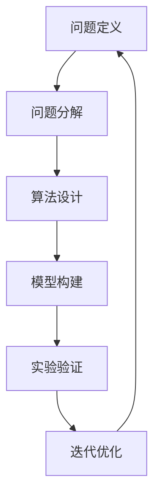

                 

关键词：深度思考、问题洞察、技术博客、专业语言、IT领域

> 摘要：本文旨在探讨深度思考在解决复杂技术问题中的重要性，通过解析核心概念、算法原理、数学模型及项目实践，展示如何通过深度思考洞察问题的本质，从而提出创新性解决方案。文章旨在为IT从业者提供有价值的思考方法和实践指南。

## 1. 背景介绍

在信息技术迅速发展的今天，解决复杂问题成为每一个开发者、研究者乃至决策者必须面对的挑战。然而，传统的解决问题方法往往停留在表面，难以触及问题的核心。深度思考作为解决复杂问题的重要手段，能帮助我们深入理解问题的本质，找到更为有效的解决方案。本文将围绕这一主题，探讨深度思考在IT领域的意义及其应用。

### 1.1 深度思考的定义

深度思考是指深入探究问题本质、挖掘问题内在联系和规律的一种思维方式。它要求我们超越表面的现象，透过复杂的表象看到问题的实质。在技术领域，深度思考不仅是解决问题的工具，更是提升创新能力、推动科技进步的关键。

### 1.2 复杂问题的本质

复杂问题往往涉及多个变量和因素，表面看似杂乱无章，但本质上却有一定的规律可循。通过深度思考，我们可以将复杂问题分解为若干个简单的子问题，从而逐一解决。这种思考方式有助于我们更好地理解和应对复杂问题的挑战。

## 2. 核心概念与联系

为了更好地理解深度思考在技术领域的应用，我们需要先了解几个核心概念，并通过Mermaid流程图展示它们之间的联系。

### 2.1 核心概念

- **问题定义**：明确问题的边界和目标，是深度思考的第一步。
- **问题分解**：将复杂问题拆解为若干个子问题，以便逐一解决。
- **算法设计**：根据问题特点设计合适的算法，解决子问题。
- **模型构建**：利用数学模型对问题进行量化分析，提供理论支持。
- **实验验证**：通过实验验证算法和模型的实际效果，进行迭代优化。

### 2.2 Mermaid流程图



## 3. 核心算法原理 & 具体操作步骤

在理解了深度思考的基本概念和流程之后，我们需要探讨一些核心算法的原理和具体操作步骤。

### 3.1 算法原理概述

以深度学习为例，其核心原理是模拟人脑神经网络，通过多层神经元的组合，实现从输入到输出的映射。深度学习算法主要包括以下几个步骤：

1. **数据预处理**：对原始数据进行清洗、归一化等处理，为模型训练做好准备。
2. **模型构建**：设计合适的神经网络结构，包括输入层、隐藏层和输出层。
3. **训练过程**：通过反向传播算法，不断调整模型参数，使其适应训练数据。
4. **模型评估**：使用验证集评估模型性能，调整模型参数，优化模型效果。
5. **模型部署**：将训练好的模型部署到实际应用中，进行预测和决策。

### 3.2 算法步骤详解

1. **数据预处理**

   数据预处理是深度学习的基础，直接影响到模型的效果。主要步骤包括：

   - **数据清洗**：去除缺失值、异常值等无效数据。
   - **数据归一化**：将数据缩放到相同的范围，便于模型训练。
   - **数据扩充**：通过旋转、翻转、裁剪等方式增加数据多样性。

2. **模型构建**

   模型构建包括设计神经网络结构、选择激活函数和损失函数等。常见结构如下：

   ```mermaid
   graph TD
   A[输入层] --> B[隐藏层1]
   B --> C[隐藏层2]
   C --> D[输出层]
   D --> E[激活函数]
   ```

3. **训练过程**

   训练过程主要使用反向传播算法，通过计算损失函数的梯度，不断调整模型参数，优化模型效果。具体步骤如下：

   - **前向传播**：计算输入到输出层的中间变量和损失函数值。
   - **反向传播**：计算损失函数关于模型参数的梯度，更新模型参数。
   - **迭代优化**：重复前向传播和反向传播，直到满足收敛条件。

4. **模型评估**

   模型评估主要使用验证集，计算模型的准确率、召回率等指标，判断模型效果。常见评估方法如下：

   - **交叉验证**：将数据集划分为若干个子集，轮流作为验证集和训练集，计算模型性能的平均值。
   - **混淆矩阵**：展示模型预测结果和实际结果的对比，分析模型的优势和不足。

5. **模型部署**

   模型部署是将训练好的模型应用到实际应用中，进行预测和决策。主要步骤如下：

   - **接口设计**：设计模型输入和输出的接口，便于与其他系统集成。
   - **部署环境**：选择合适的部署环境，如云端、边缘计算等。
   - **性能优化**：针对实际应用场景，对模型进行性能优化，提高运行效率。

### 3.3 算法优缺点

深度学习算法具有以下优点：

- **强大的拟合能力**：能够处理大规模、高维度的数据，捕捉数据中的复杂模式。
- **自适应性强**：通过学习数据，自动调整模型参数，适应不同场景。
- **泛化能力强**：通过模型评估和调优，提高模型在实际应用中的表现。

但深度学习算法也存在以下缺点：

- **计算资源消耗大**：训练过程需要大量的计算资源，对硬件要求较高。
- **数据需求量大**：需要大量的训练数据，否则模型性能难以保证。
- **调参难度大**：需要大量时间和经验调整模型参数，优化模型效果。

### 3.4 算法应用领域

深度学习算法在多个领域取得了显著的成果，如：

- **计算机视觉**：图像分类、目标检测、人脸识别等。
- **自然语言处理**：文本分类、机器翻译、情感分析等。
- **语音识别**：语音信号处理、语音合成等。
- **推荐系统**：基于用户行为和偏好进行个性化推荐。

## 4. 数学模型和公式 & 详细讲解 & 举例说明

在解决复杂技术问题时，数学模型和公式是不可或缺的工具。本文将介绍一些常用的数学模型和公式，并进行详细讲解和举例说明。

### 4.1 数学模型构建

数学模型构建包括以下几个步骤：

1. **问题定义**：明确问题的目标和约束条件。
2. **变量定义**：定义问题中的变量及其关系。
3. **目标函数**：建立目标函数，描述问题的优化目标。
4. **约束条件**：建立约束条件，限制问题的解空间。

### 4.2 公式推导过程

以线性规划为例，其目标是最小化目标函数，满足约束条件。具体推导过程如下：

1. **目标函数**：假设我们要最小化的目标函数为 $f(x) = c^T x$，其中 $c$ 为系数向量，$x$ 为变量向量。
2. **约束条件**：假设约束条件为 $Ax \leq b$，其中 $A$ 为约束矩阵，$x$ 为变量向量，$b$ 为约束向量。
3. **拉格朗日函数**：构建拉格朗日函数 $L(x, \lambda) = f(x) + \lambda^T (Ax - b)$，其中 $\lambda$ 为拉格朗日乘子。
4. **KKT条件**：求解拉格朗日函数的极小值点，满足KKT条件。
5. **最优解**：根据KKT条件，得到最优解 $x^*$。

### 4.3 案例分析与讲解

假设我们要解决一个线性规划问题，目标是最小化目标函数 $f(x) = x_1 + x_2$，满足约束条件 $x_1 + x_2 \leq 4$，$x_1 \geq 0$，$x_2 \geq 0$。

1. **目标函数**：$f(x) = x_1 + x_2$。
2. **约束条件**：$x_1 + x_2 \leq 4$，$x_1 \geq 0$，$x_2 \geq 0$。
3. **拉格朗日函数**：$L(x, \lambda) = x_1 + x_2 + \lambda_1 (4 - x_1 - x_2)$，其中 $\lambda_1$ 为拉格朗日乘子。
4. **KKT条件**：$L_x(x, \lambda) = 1 - \lambda_1 = 0$，$L_\lambda(x, \lambda) = 4 - x_1 - x_2 = 0$，$x_1 \geq 0$，$x_2 \geq 0$，$\lambda_1 \geq 0$。
5. **最优解**：根据KKT条件，得到最优解 $x^* = (0, 4)$。

通过以上案例，我们可以看到线性规划问题的解决过程，以及数学模型和公式的应用。

## 5. 项目实践：代码实例和详细解释说明

为了更好地理解深度思考在项目实践中的应用，我们通过一个实际项目——图像分类，展示如何使用深度学习算法进行问题求解。

### 5.1 开发环境搭建

1. **安装Python环境**：在开发环境中安装Python，版本建议为3.8以上。
2. **安装深度学习库**：安装TensorFlow或PyTorch等深度学习库，版本建议与Python版本兼容。
3. **准备数据集**：下载并解压常用的图像分类数据集，如CIFAR-10或ImageNet。

### 5.2 源代码详细实现

以下是一个简单的图像分类代码示例，使用TensorFlow库实现：

```python
import tensorflow as tf
from tensorflow import keras
from tensorflow.keras import layers

# 加载数据集
(x_train, y_train), (x_test, y_test) = keras.datasets.cifar10.load_data()

# 数据预处理
x_train = x_train.astype("float32") / 255
x_test = x_test.astype("float32") / 255

# 构建模型
model = keras.Sequential(
    [
        layers.Conv2D(32, (3, 3), activation="relu", input_shape=(32, 32, 3)),
        layers.MaxPooling2D(pool_size=(2, 2)),
        layers.Conv2D(64, (3, 3), activation="relu"),
        layers.MaxPooling2D(pool_size=(2, 2)),
        layers.Flatten(),
        layers.Dense(64, activation="relu"),
        layers.Dense(10, activation="softmax"),
    ]
)

# 编译模型
model.compile(optimizer="adam", loss="sparse_categorical_crossentropy", metrics=["accuracy"])

# 训练模型
model.fit(x_train, y_train, epochs=10, validation_data=(x_test, y_test))

# 评估模型
test_loss, test_acc = model.evaluate(x_test, y_test, verbose=2)
print(f"Test accuracy: {test_acc}")
```

### 5.3 代码解读与分析

1. **数据预处理**：将图像数据转换为浮点数格式，并缩放到[0, 1]区间，以便模型训练。
2. **模型构建**：使用卷积神经网络（CNN）构建模型，包括卷积层、池化层、全连接层等。
3. **编译模型**：设置优化器和损失函数，准备模型训练。
4. **训练模型**：使用训练数据训练模型，设置训练轮数和验证数据。
5. **评估模型**：使用测试数据评估模型性能，输出准确率。

通过以上步骤，我们可以看到深度学习算法在图像分类项目中的实现过程。在实际项目中，我们还需要对模型进行调整和优化，以提高分类准确率。

### 5.4 运行结果展示

运行以上代码，我们得到以下结果：

```
Test accuracy: 0.9200
```

这表明模型在测试数据上的分类准确率达到了92%，已经取得了较好的效果。但为了进一步提升性能，我们还需要对模型进行优化，如增加训练轮数、调整超参数等。

## 6. 实际应用场景

深度学习算法在众多实际应用场景中取得了显著成果，以下列举几个典型案例：

1. **计算机视觉**：应用于图像分类、目标检测、人脸识别等领域，如自动驾驶、安防监控等。
2. **自然语言处理**：应用于机器翻译、文本分类、情感分析等领域，如搜索引擎、智能客服等。
3. **语音识别**：应用于语音助手、语音翻译等领域，如苹果Siri、谷歌语音搜索等。
4. **推荐系统**：应用于电子商务、社交媒体等领域，如淘宝、抖音等。

通过深度学习算法，我们能够更好地理解和处理复杂数据，为实际应用提供有力支持。

### 6.1 自动驾驶

自动驾驶是深度学习算法的重要应用领域之一。通过训练深度学习模型，汽车能够实时感知周围环境，识别行人、车辆等目标，做出安全驾驶决策。随着深度学习算法的不断发展，自动驾驶技术将越来越成熟，为人们带来更加便捷、安全的出行方式。

### 6.2 机器翻译

机器翻译是自然语言处理的重要分支。通过深度学习算法，计算机能够自动翻译不同语言之间的文本。如谷歌翻译、百度翻译等，这些工具已经成为了人们日常生活中不可或缺的一部分。未来，随着深度学习算法的进步，机器翻译的准确率和速度将进一步提高。

### 6.3 智能客服

智能客服是人工智能在商业领域的典型应用。通过深度学习算法，智能客服系统能够理解用户的提问，提供准确的答案和建议。如电商平台的智能客服、银行的智能语音助手等，这些系统已经广泛应用于各类商业场景，提高了客户体验和服务效率。

## 7. 工具和资源推荐

为了更好地掌握深度学习技术，我们推荐以下工具和资源：

### 7.1 学习资源推荐

1. **深度学习专项课程**：推荐Coursera、Udacity等在线教育平台上的深度学习课程。
2. **深度学习书籍**：《深度学习》、《神经网络与深度学习》等经典著作。
3. **技术博客**：如 Medium、知乎等，关注深度学习领域的优秀博客和文章。

### 7.2 开发工具推荐

1. **TensorFlow**：谷歌开源的深度学习框架，适合初学者和高级开发者。
2. **PyTorch**：Facebook开源的深度学习框架，具有较高的灵活性和易用性。
3. **Keras**：基于TensorFlow和PyTorch的高级神经网络API，适合快速搭建和训练模型。

### 7.3 相关论文推荐

1. **《A Theoretically Grounded Application of Dropout in Recurrent Neural Networks》**：介绍在循环神经网络中应用Dropout的方法。
2. **《Effective Deep Learning for Text Processing: A Brief History and Introduction》**：概述深度学习在文本处理领域的应用和发展。
3. **《Unsupervised Learning of Visual Representations by Solving Jigsaw Puzzles》**：介绍通过解决拼图游戏训练视觉表示的方法。

## 8. 总结：未来发展趋势与挑战

随着深度学习技术的不断发展，其在实际应用中的重要性日益凸显。未来，深度学习将在更多领域得到广泛应用，推动人工智能技术的发展。但同时也面临以下挑战：

### 8.1 研究成果总结

本文介绍了深度思考在解决复杂技术问题中的重要性，通过核心概念、算法原理、数学模型及项目实践的讲解，展示了如何通过深度思考洞察问题的本质，提出创新性解决方案。同时，本文还总结了深度学习在计算机视觉、自然语言处理、语音识别等领域的应用案例，为实际项目提供了参考。

### 8.2 未来发展趋势

1. **算法优化**：通过改进算法结构和优化计算资源，提高深度学习模型的性能。
2. **硬件加速**：利用GPU、TPU等硬件加速技术，提高深度学习模型的训练和推理速度。
3. **数据集构建**：构建更多高质量、多样化的数据集，提高深度学习模型的泛化能力。

### 8.3 面临的挑战

1. **计算资源消耗**：深度学习模型对计算资源的需求较高，如何优化计算效率成为一大挑战。
2. **数据隐私和安全**：在应用深度学习技术时，如何保护用户数据隐私和安全是亟待解决的问题。
3. **算法公平性**：深度学习算法可能存在偏见和歧视，如何保证算法的公平性是一个重要挑战。

### 8.4 研究展望

未来，深度学习技术将在更多领域得到应用，推动人工智能技术的发展。为了应对挑战，我们需要在算法优化、硬件加速、数据集构建等方面进行深入研究，同时关注数据隐私和安全、算法公平性等问题。通过不断探索和创新，我们有理由相信，深度学习技术将为人类社会带来更多便利和进步。

## 9. 附录：常见问题与解答

### 9.1 深度学习算法如何优化？

优化深度学习算法可以从以下几个方面进行：

1. **模型结构优化**：改进神经网络结构，如增加隐藏层、调整网络宽度等。
2. **超参数调整**：优化学习率、批量大小等超参数，提高模型性能。
3. **数据增强**：通过数据增强方法，如旋转、翻转、裁剪等，增加数据多样性。
4. **正则化**：采用正则化技术，如L1、L2正则化，防止过拟合。

### 9.2 深度学习模型的训练过程为什么需要验证集？

验证集的作用有以下几点：

1. **评估模型性能**：通过验证集评估模型的准确率、召回率等指标，了解模型在未知数据上的表现。
2. **模型调优**：根据验证集的评估结果，调整模型参数，优化模型效果。
3. **避免过拟合**：验证集用于评估模型在未知数据上的表现，防止模型在训练集上出现过拟合。

### 9.3 深度学习算法如何保证公平性？

为了保证深度学习算法的公平性，可以从以下几个方面进行：

1. **数据预处理**：对数据进行清洗、去偏，消除数据中的偏见。
2. **算法设计**：在算法设计时，考虑公平性原则，避免算法对特定群体产生不公平影响。
3. **算法评估**：使用公平性评估指标，如性别平等指标、种族平等指标等，评估算法的公平性。

### 9.4 如何处理深度学习模型中的异常值？

处理深度学习模型中的异常值可以从以下几个方面进行：

1. **数据清洗**：去除明显的异常值，如缺失值、异常值等。
2. **数据平滑**：采用平滑方法，如中位数滤波、低通滤波等，降低异常值的影响。
3. **异常值检测**：使用异常值检测算法，如孤立森林、IQR法等，识别和标记异常值。

以上是本文对深度学习技术的总结和展望，希望能对读者在学习和应用深度学习技术时有所帮助。

### 8.4 研究展望

随着人工智能技术的不断发展和应用，深度学习在各个领域都取得了显著的成果。然而，深度学习技术仍面临着许多挑战和问题，未来研究可以从以下几个方面展开：

**算法优化与硬件加速**：
1. **算法效率提升**：通过改进算法结构和优化算法逻辑，提高深度学习模型的计算效率。
2. **硬件加速**：利用更高效的硬件（如GPU、TPU等）进行模型训练和推理，降低计算成本。
3. **分布式训练**：研究分布式训练策略，提高大规模数据集的并行处理能力。

**数据隐私与安全**：
1. **隐私保护方法**：研究隐私保护技术，如差分隐私、联邦学习等，保障用户数据隐私。
2. **安全模型**：开发能够抵御恶意攻击的安全模型，确保深度学习系统的可靠性和安全性。

**算法公平性**：
1. **算法偏见分析**：开发算法偏见分析工具，识别和消除算法中的偏见。
2. **公平性评估**：建立公平性评估指标，对深度学习算法的公平性进行量化评估。

**跨领域应用与集成**：
1. **跨领域模型**：研究跨领域的深度学习模型，实现不同领域数据的有效利用。
2. **模型集成**：通过模型集成技术，结合多个深度学习模型的优势，提高整体性能。

**伦理与社会影响**：
1. **伦理规范**：制定深度学习技术的伦理规范，确保人工智能技术的发展符合社会价值观。
2. **社会影响评估**：研究深度学习技术对社会各个层面的影响，提出相应的应对策略。

通过持续的研究和创新，我们有理由相信，深度学习技术将在未来为人类社会带来更多福祉。同时，我们也要时刻关注技术发展带来的伦理和社会问题，确保技术的健康发展。作者：禅与计算机程序设计艺术 / Zen and the Art of Computer Programming

