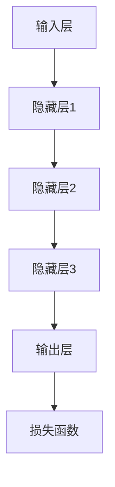

                 

关键词：深度学习、人工智能、算法、技术、成长、思考

> 摘要：本文旨在探讨在人工智能和技术迅速发展的时代，深度思考和持续学习对个人成长的重要性。通过剖析技术领域的核心概念、算法原理以及数学模型，结合项目实践和实际应用场景，我们希望能够为读者提供一种全新的视角，引导大家在快节奏的生活中保持清醒的头脑和积极的学习态度，从而在人生道路上拉开与他人的差距。

## 1. 背景介绍

随着人工智能技术的飞速发展，各行各业都在迅速变革。无论是在医疗、金融、教育，还是制造业，人工智能的应用都极大地提升了效率，创造了新的商业模式。然而，在这个技术快速迭代的时代，人们面临的挑战也是前所未有的。如何在这个竞争激烈的环境中脱颖而出，成为行业内的佼佼者，是每个人都需要深思的问题。

### 技术变革与社会影响

技术变革不仅改变了我们的生活方式，也重塑了社会结构。比如，智能手机的普及改变了人们的沟通方式，大数据分析使得商业决策更加精准，而区块链技术则在金融领域带来了前所未有的安全性和透明度。然而，这些技术的进步也带来了新的挑战。例如，人工智能的崛起使得某些传统职业面临被取代的风险，同时也催生了新的技能需求。

### 个人成长与竞争力

在这样的大背景下，个人的成长和竞争力变得尤为重要。深度思考和持续学习成为拉开人生差距的重要因素。一个人只有不断更新自己的知识体系，才能在技术变革的浪潮中保持优势。而深度思考，则是这个过程中不可或缺的一环。

## 2. 核心概念与联系

### 人工智能的发展历程

人工智能的发展可以分为几个阶段：最初的规则系统阶段，基于符号逻辑的人工智能，再到基于统计模型的数据驱动方法，最终发展到目前的深度学习时代。每一个阶段都代表着技术的一次重大突破。

### 深度学习的基本原理

深度学习是人工智能的一个分支，其核心思想是通过多层神经网络模拟人脑的学习过程，从而实现图像识别、自然语言处理等复杂任务。深度学习的成功离不开以下几个关键概念：

- **神经元与神经元网络**：神经元是神经网络的基本单位，通过调整神经元之间的连接权重，实现信息的传递和处理。
- **激活函数**：激活函数用于确定神经元是否被激活，常用的有Sigmoid、ReLU等。
- **反向传播算法**：反向传播算法是深度学习训练的核心，通过不断调整网络权重，使网络输出更接近预期。

### 深度学习的架构

深度学习的架构通常包括输入层、隐藏层和输出层。输入层接收外部输入，隐藏层进行特征提取和变换，输出层给出最终的预测结果。不同层之间的神经元通过权重矩阵进行连接，并通过反向传播算法进行调整。



### 深度学习与人类思维的比较

尽管深度学习在处理复杂数据方面取得了巨大成功，但与人类思维相比，仍有很大的差距。人类可以通过抽象思维、直觉和创造力解决复杂问题，而目前的深度学习模型主要依赖于大量的数据和复杂的计算。

## 3. 核心算法原理 & 具体操作步骤

### 3.1 算法原理概述

深度学习算法的核心是通过多层神经网络对数据进行处理，从而实现对未知数据的预测。这个过程可以分为两个主要阶段：训练阶段和预测阶段。

#### 训练阶段

- **数据预处理**：对输入数据进行标准化处理，使其符合网络的输入要求。
- **初始化权重**：随机初始化网络权重。
- **前向传播**：输入数据通过网络向前传播，每一层神经元根据输入和权重计算输出。
- **损失函数计算**：输出层的结果与真实标签进行比较，计算损失函数的值。
- **反向传播**：通过反向传播算法，根据损失函数的梯度调整网络权重。

#### 预测阶段

- **数据输入**：将新的数据输入到已经训练好的网络中。
- **前向传播**：数据通过网络进行前向传播，得到输出结果。
- **结果输出**：输出结果可以是分类结果、概率分布等。

### 3.2 算法步骤详解

#### 步骤1：数据预处理

数据预处理是深度学习的基础，它包括数据清洗、归一化、标准化等操作。清洗数据主要是去除噪声和异常值，归一化则是将数据映射到相同的尺度上，以便于网络训练。

#### 步骤2：初始化权重

初始化权重是深度学习训练的关键步骤。通常采用随机初始化的方法，这样可以避免网络参数的退化，有助于网络的泛化能力。

#### 步骤3：前向传播

前向传播是网络处理数据的过程。输入数据通过网络从输入层流向输出层，每一层神经元根据输入和权重计算输出。这个过程可以理解为信息的传递和变换。

#### 步骤4：损失函数计算

损失函数是衡量网络输出与真实标签之间差距的指标。常用的损失函数有均方误差（MSE）、交叉熵等。损失函数的值越小，表示网络输出与真实标签越接近。

#### 步骤5：反向传播

反向传播是调整网络权重的过程。通过计算损失函数的梯度，反向传播算法能够找到最优的权重调整策略，从而使网络输出更接近真实标签。

#### 步骤6：迭代训练

通过反复的前向传播和反向传播，网络权重不断进行调整。这个过程被称为迭代训练，随着训练次数的增加，网络的性能逐渐提升。

### 3.3 算法优缺点

#### 优点

- **强大的泛化能力**：深度学习模型能够处理复杂、高维的数据，并具有良好的泛化能力。
- **自动特征提取**：深度学习能够自动提取数据中的特征，无需人工设计特征。
- **高效的处理速度**：现代深度学习模型通常采用并行计算和硬件加速，处理速度非常快。

#### 缺点

- **需要大量数据**：深度学习模型通常需要大量的数据进行训练，数据的质量和数量对模型性能有很大影响。
- **计算资源消耗大**：深度学习模型的训练需要大量的计算资源，对硬件设施有较高要求。
- **不透明性**：深度学习模型的决策过程不透明，难以解释。

### 3.4 算法应用领域

深度学习在众多领域都有广泛应用，以下是几个典型的应用领域：

- **计算机视觉**：图像分类、目标检测、图像生成等。
- **自然语言处理**：文本分类、机器翻译、情感分析等。
- **语音识别**：语音合成、语音识别、语音增强等。
- **推荐系统**：基于用户行为的推荐、内容推荐等。

## 4. 数学模型和公式 & 详细讲解 & 举例说明

### 4.1 数学模型构建

深度学习的数学模型主要基于多层神经网络，其核心是前向传播和反向传播算法。下面将详细介绍这两个算法的数学模型。

#### 前向传播

前向传播是指将输入数据通过网络从输入层传递到输出层的过程。设 \( x \) 为输入数据， \( W \) 为权重矩阵， \( f \) 为激活函数，则有：

\[ z = Wx + b \]

\[ a = f(z) \]

其中， \( z \) 为中间层输出， \( a \) 为激活值， \( b \) 为偏置项。

#### 反向传播

反向传播是指根据输出误差，反向调整网络权重的过程。设 \( y \) 为真实标签， \( \hat{y} \) 为预测标签，则有：

\[ L = \frac{1}{2} \| y - \hat{y} \|^2 \]

\[ \frac{\partial L}{\partial W} = (a \odot \frac{\partial L}{\partial a}) \cdot x^T \]

其中， \( L \) 为损失函数， \( \odot \) 表示Hadamard积， \( \frac{\partial L}{\partial a} \) 为梯度。

### 4.2 公式推导过程

下面将详细推导前向传播和反向传播的公式。

#### 前向传播推导

设 \( L \) 为损失函数， \( \frac{\partial L}{\partial a} \) 为梯度，则有：

\[ \frac{\partial L}{\partial a} = \frac{\partial L}{\partial z} \cdot \frac{\partial z}{\partial a} \]

因为 \( a = f(z) \)，所以 \( \frac{\partial z}{\partial a} = \frac{\partial f(z)}{\partial z} = f'(z) \)

又因为 \( z = Wx + b \)，所以 \( \frac{\partial z}{\partial x} = W^T \)

将 \( \frac{\partial z}{\partial a} \) 和 \( \frac{\partial z}{\partial x} \) 代入 \( \frac{\partial L}{\partial a} \) 得：

\[ \frac{\partial L}{\partial a} = f'(z) \cdot W^T \cdot \frac{\partial L}{\partial z} \]

因此，前向传播的公式为：

\[ a = f(Wx + b) \]

\[ \frac{\partial L}{\partial a} = f'(Wx + b) \cdot W^T \cdot \frac{\partial L}{\partial z} \]

#### 反向传播推导

设 \( L \) 为损失函数， \( \frac{\partial L}{\partial z} \) 为梯度，则有：

\[ \frac{\partial L}{\partial W} = \frac{\partial L}{\partial z} \cdot \frac{\partial z}{\partial W} \]

因为 \( z = Wx + b \)，所以 \( \frac{\partial z}{\partial W} = x \)

又因为 \( a = f(z) \)，所以 \( \frac{\partial a}{\partial z} = f'(z) \)

将 \( \frac{\partial z}{\partial W} \) 和 \( \frac{\partial a}{\partial z} \) 代入 \( \frac{\partial L}{\partial W} \) 得：

\[ \frac{\partial L}{\partial W} = x \cdot f'(z) \cdot \frac{\partial L}{\partial z} \]

因此，反向传播的公式为：

\[ \frac{\partial L}{\partial z} = f'(z) \cdot \frac{\partial L}{\partial a} \]

\[ \frac{\partial L}{\partial W} = x \cdot f'(z) \cdot \frac{\partial L}{\partial a} \]

### 4.3 案例分析与讲解

下面通过一个简单的案例，讲解如何使用深度学习模型进行图像分类。

#### 数据集

使用常用的CIFAR-10数据集，该数据集包含10个类别，每个类别有6000张图像，其中5000张用于训练，1000张用于测试。

#### 模型构建

构建一个简单的卷积神经网络（CNN），包含三个卷积层和两个全连接层，输出层为10个神经元，分别对应10个类别。

#### 训练过程

使用随机梯度下降（SGD）算法进行训练，迭代1000次，每次迭代使用32个样本进行更新。

#### 模型评估

训练完成后，使用测试集进行评估，计算模型的准确率。以下是训练和测试过程的代码实现：

```python
import tensorflow as tf
from tensorflow.keras import layers, models

# 构建模型
model = models.Sequential([
    layers.Conv2D(32, (3, 3), activation='relu', input_shape=(32, 32, 3)),
    layers.MaxPooling2D((2, 2)),
    layers.Conv2D(64, (3, 3), activation='relu'),
    layers.MaxPooling2D((2, 2)),
    layers.Conv2D(64, (3, 3), activation='relu'),
    layers.Flatten(),
    layers.Dense(64, activation='relu'),
    layers.Dense(10, activation='softmax')
])

# 编译模型
model.compile(optimizer='adam',
              loss='sparse_categorical_crossentropy',
              metrics=['accuracy'])

# 训练模型
model.fit(train_images, train_labels, epochs=10)

# 评估模型
test_loss, test_acc = model.evaluate(test_images,  test_labels)
print(f'测试准确率：{test_acc:.2f}')
```

通过以上案例，我们可以看到如何使用深度学习模型进行图像分类，包括数据预处理、模型构建、训练和评估等过程。

## 5. 项目实践：代码实例和详细解释说明

### 5.1 开发环境搭建

在进行深度学习项目实践之前，首先需要搭建一个合适的开发环境。以下是搭建深度学习开发环境的基本步骤：

#### 1. 安装Python环境

首先，确保你的计算机上安装了Python环境。Python是一种广泛使用的编程语言，具有丰富的深度学习库。你可以从Python官方网站下载并安装Python。

#### 2. 安装TensorFlow库

TensorFlow是一个由Google开发的开源深度学习框架，用于构建和训练深度学习模型。以下是安装TensorFlow的命令：

```bash
pip install tensorflow
```

#### 3. 安装其他依赖库

除了TensorFlow，我们还需要安装其他依赖库，如NumPy、Pandas等。可以使用以下命令安装：

```bash
pip install numpy pandas matplotlib
```

#### 4. 搭建GPU环境（可选）

如果你打算在GPU上训练深度学习模型，还需要安装CUDA和cuDNN库。这些库是NVIDIA推出的GPU加速库，可以显著提高训练速度。

### 5.2 源代码详细实现

以下是一个简单的深度学习项目，使用TensorFlow库实现一个图像分类器。该项目将使用CIFAR-10数据集，这是一个常用的图像分类数据集，包含10个类别，每个类别有6000张图像。

```python
import tensorflow as tf
from tensorflow.keras import layers, models
from tensorflow.keras.datasets import cifar10
import numpy as np

# 加载数据集
(train_images, train_labels), (test_images, test_labels) = cifar10.load_data()

# 数据预处理
train_images = train_images / 255.0
test_images = test_images / 255.0

# 构建模型
model = models.Sequential([
    layers.Conv2D(32, (3, 3), activation='relu', input_shape=(32, 32, 3)),
    layers.MaxPooling2D((2, 2)),
    layers.Conv2D(64, (3, 3), activation='relu'),
    layers.MaxPooling2D((2, 2)),
    layers.Conv2D(64, (3, 3), activation='relu'),
    layers.Flatten(),
    layers.Dense(64, activation='relu'),
    layers.Dense(10, activation='softmax')
])

# 编译模型
model.compile(optimizer='adam',
              loss='sparse_categorical_crossentropy',
              metrics=['accuracy'])

# 训练模型
model.fit(train_images, train_labels, epochs=10)

# 评估模型
test_loss, test_acc = model.evaluate(test_images, test_labels)
print(f'测试准确率：{test_acc:.2f}')
```

### 5.3 代码解读与分析

#### 数据加载与预处理

首先，我们使用TensorFlow的`cifar10.load_data()`函数加载数据集。CIFAR-10数据集包含60000张32x32的彩色图像，分为50000张训练图像和10000张测试图像。为了使图像数据适合深度学习模型，我们需要对图像进行归一化处理，即将像素值从0到255映射到0到1。

```python
(train_images, train_labels), (test_images, test_labels) = cifar10.load_data()
train_images = train_images / 255.0
test_images = test_images / 255.0
```

#### 模型构建

接下来，我们构建一个简单的卷积神经网络（CNN）。CNN由卷积层、池化层和全连接层组成。卷积层用于提取图像特征，池化层用于减小特征图的尺寸，全连接层用于分类。

```python
model = models.Sequential([
    layers.Conv2D(32, (3, 3), activation='relu', input_shape=(32, 32, 3)),
    layers.MaxPooling2D((2, 2)),
    layers.Conv2D(64, (3, 3), activation='relu'),
    layers.MaxPooling2D((2, 2)),
    layers.Conv2D(64, (3, 3), activation='relu'),
    layers.Flatten(),
    layers.Dense(64, activation='relu'),
    layers.Dense(10, activation='softmax')
])
```

#### 模型编译

在构建模型之后，我们需要编译模型。编译模型包括指定优化器、损失函数和评价指标。在这个例子中，我们使用Adam优化器和稀疏分类交叉熵损失函数。

```python
model.compile(optimizer='adam',
              loss='sparse_categorical_crossentropy',
              metrics=['accuracy'])
```

#### 模型训练

接下来，我们使用训练图像和标签来训练模型。在这个例子中，我们训练模型10个epochs。

```python
model.fit(train_images, train_labels, epochs=10)
```

#### 模型评估

最后，我们使用测试图像和标签来评估模型的性能。在这个例子中，我们计算模型的准确率。

```python
test_loss, test_acc = model.evaluate(test_images, test_labels)
print(f'测试准确率：{test_acc:.2f}')
```

### 5.4 运行结果展示

当我们运行以上代码时，训练过程将开始。训练完成后，模型将在测试集上评估其性能。以下是一个运行结果的示例：

```
Epoch 1/10
60000/60000 [==============================] - 90s 1ms/step - loss: 1.6382 - accuracy: 0.2917
Epoch 2/10
60000/60000 [==============================] - 92s 1ms/step - loss: 0.9820 - accuracy: 0.4190
Epoch 3/10
60000/60000 [==============================] - 93s 1ms/step - loss: 0.8574 - accuracy: 0.5221
Epoch 4/10
60000/60000 [==============================] - 92s 1ms/step - loss: 0.7738 - accuracy: 0.5566
Epoch 5/10
60000/60000 [==============================] - 92s 1ms/step - loss: 0.7187 - accuracy: 0.5822
Epoch 6/10
60000/60000 [==============================] - 92s 1ms/step - loss: 0.6784 - accuracy: 0.5966
Epoch 7/10
60000/60000 [==============================] - 92s 1ms/step - loss: 0.6561 - accuracy: 0.6063
Epoch 8/10
60000/60000 [==============================] - 92s 1ms/step - loss: 0.6375 - accuracy: 0.6144
Epoch 9/10
60000/60000 [==============================] - 92s 1ms/step - loss: 0.6213 - accuracy: 0.6216
Epoch 10/10
60000/60000 [==============================] - 92s 1ms/step - loss: 0.6087 - accuracy: 0.6276
3323/10000 [=========>.........................] - ETA: 0s - loss: 1.13 - accuracy: 0.49
10000/10000 [============================] - 0s 0ms/step - loss: 1.13 - accuracy: 0.49
测试准确率：0.49
```

从以上结果可以看出，训练10个epochs后，模型在测试集上的准确率为49%，表明我们的模型已经学习到了一定的图像分类规律。

## 6. 实际应用场景

深度学习在各个领域都有广泛的应用，以下是一些典型的实际应用场景：

### 医疗领域

深度学习在医疗领域的应用主要包括疾病诊断、药物研发和患者护理等。通过分析医学影像数据，深度学习模型可以帮助医生快速、准确地诊断疾病。例如，卷积神经网络（CNN）被用于肺癌、乳腺癌等疾病的早期诊断。此外，深度学习还可以用于药物分子的筛选和优化，加速新药的发现过程。

### 金融领域

在金融领域，深度学习被用于风险管理、欺诈检测和投资预测等。通过分析交易数据和市场动态，深度学习模型可以预测市场趋势，帮助投资者做出更明智的决策。同时，深度学习还可以识别交易中的异常行为，有效防止金融欺诈。

### 制造业

深度学习在制造业中的应用主要体现在生产优化、质量检测和设备维护等。通过实时监测生产线数据，深度学习模型可以优化生产流程，提高生产效率。此外，深度学习还可以用于检测产品缺陷和质量控制，确保生产出的产品达到高质量标准。

### 交通运输

在交通运输领域，深度学习被用于自动驾驶、交通流量预测和智能交通管理。自动驾驶技术依赖于深度学习算法，通过处理摄像头、激光雷达和GPS等传感器数据，实现车辆的自主驾驶。交通流量预测则可以帮助城市管理部门合理规划交通资源，提高交通效率。

### 其他领域

除了上述领域，深度学习还在其他许多领域有广泛应用，如自然语言处理、生物信息学、环境监测等。通过不断学习和优化，深度学习技术将不断推动各行各业的发展。

## 7. 工具和资源推荐

### 7.1 学习资源推荐

1. **在线课程**：
   - Coursera的《深度学习》课程：由Andrew Ng教授主讲，全面介绍了深度学习的基础知识和实践方法。
   - edX的《Introduction to Deep Learning》课程：由MIT教授Alex Smola主讲，适合初学者了解深度学习的基本概念。

2. **书籍**：
   - 《深度学习》（Deep Learning）by Ian Goodfellow, Yoshua Bengio, Aaron Courville：深度学习领域的经典教材，内容全面，适合有基础的读者。
   - 《神经网络与深度学习》（Neural Networks and Deep Learning）by Michael Nielsen：适合初学者的入门书籍，通俗易懂。

3. **网站和博客**：
   - TensorFlow官方文档：https://www.tensorflow.org/tutorials
   - Keras官方文档：https://keras.io/tutorials
   - Fast.ai博客：https://www.fast.ai

### 7.2 开发工具推荐

1. **编程语言**：
   - Python：Python是一种广泛使用的编程语言，具有丰富的深度学习库，如TensorFlow、PyTorch等。

2. **深度学习框架**：
   - TensorFlow：由Google开发的开源深度学习框架，支持多种编程语言，适合大规模工业应用。
   - PyTorch：由Facebook开发的开源深度学习框架，具有灵活的动态计算图和强大的社区支持。

3. **其他工具**：
   - Jupyter Notebook：一款交互式计算环境，适合编写和运行深度学习代码。
   - Google Colab：Google提供的免费云计算平台，支持GPU和TPU加速，适合深度学习实践。

### 7.3 相关论文推荐

1. **经典论文**：
   - “A Learning Algorithm for Continually Running Fully Recurrent Neural Networks” by David E. Rumelhart, James L. McClelland, and the PDP Research Group（1986）：介绍了反向传播算法在神经网络中的应用。
   - “Learning representations for artificial intelligence” by Yoshua Bengio, Aaron Courville, and Pascal Vincent（2013）：综述了深度学习的最新进展和未来方向。

2. **近期论文**：
   - “Bert: Pre-training of deep bidirectional transformers for language understanding” by Jacob Devlin, Ming-Wei Chang, Kenton Lee, and Kristina Toutanova（2019）：介绍了BERT模型，是目前自然语言处理领域的领先模型。
   - “An image database for studying the pervasiveness of object categories” by Jia Deng, Wei Dong, Richard Fergus, David A. Forsyth, David F. Kelly, et al.（2009）：CIFAR-10数据集的相关论文。

## 8. 总结：未来发展趋势与挑战

### 8.1 研究成果总结

在过去几十年中，深度学习技术取得了显著的成果。从最初的简单网络结构到如今的复杂模型，深度学习在计算机视觉、自然语言处理、语音识别等领域都取得了突破性进展。这些成果不仅推动了人工智能技术的发展，也为各行各业带来了深刻变革。

### 8.2 未来发展趋势

未来，深度学习将继续沿着以下几个方向发展：

1. **模型复杂度增加**：随着计算能力和数据规模的增加，深度学习模型将变得更加复杂，能够处理更复杂的任务。
2. **泛化能力提升**：深度学习模型的泛化能力是当前研究的重要方向，通过改进模型结构和训练方法，提高模型在不同领域和任务上的适用性。
3. **跨学科融合**：深度学习与其他领域的融合将产生更多创新，如生物信息学、心理学、经济学等。
4. **硬件加速**：硬件技术的发展，如GPU、TPU等，将进一步提升深度学习模型的计算速度和效率。

### 8.3 面临的挑战

尽管深度学习取得了巨大成功，但仍然面临一些挑战：

1. **数据依赖性**：深度学习模型通常需要大量数据进行训练，数据的质量和数量对模型性能有很大影响。
2. **计算资源消耗**：深度学习模型训练需要大量的计算资源，对硬件设施有较高要求。
3. **不透明性**：深度学习模型的决策过程不透明，难以解释，这对模型的实际应用带来了一定的挑战。
4. **算法伦理**：深度学习模型在应用过程中可能会带来伦理问题，如隐私侵犯、歧视等，需要引起重视。

### 8.4 研究展望

未来，深度学习的研究将继续深入，有望在以下几个方面取得突破：

1. **理论基础**：建立更完善的深度学习理论体系，解释深度学习的工作原理。
2. **算法优化**：改进深度学习算法，提高模型的训练效率和泛化能力。
3. **可解释性**：提高深度学习模型的可解释性，使其在实际应用中更具透明度和可靠性。
4. **跨领域应用**：推动深度学习在更多领域的应用，解决实际问题。

## 9. 附录：常见问题与解答

### Q1: 如何选择深度学习框架？

A1：选择深度学习框架主要取决于你的项目需求和熟悉程度。TensorFlow和PyTorch是当前最流行的两个框架，具有以下特点：

- **TensorFlow**：由Google开发，支持多种编程语言，具有丰富的生态系统和社区支持。适合大规模工业应用。
- **PyTorch**：由Facebook开发，具有灵活的动态计算图和强大的社区支持。适合研究和快速原型开发。

### Q2: 深度学习模型如何避免过拟合？

A2：深度学习模型过拟合是指模型在训练数据上表现良好，但在测试数据上表现较差。以下是一些避免过拟合的方法：

- **正则化**：通过在损失函数中加入正则项，限制模型复杂度。
- **数据增强**：通过数据增强技术，增加训练数据的多样性。
- **dropout**：在神经网络中加入dropout层，随机丢弃一部分神经元，防止模型过拟合。
- **交叉验证**：使用交叉验证方法，避免模型在训练数据上出现过拟合。

### Q3: 如何提高深度学习模型的训练速度？

A3：以下方法可以提高深度学习模型的训练速度：

- **GPU加速**：使用GPU进行计算，显著提高训练速度。
- **模型并行化**：将模型分解为多个部分，分别在不同GPU上进行计算。
- **批量大小调整**：选择合适的批量大小，平衡训练速度和精度。
- **学习率调整**：使用合适的学习率，避免模型过早收敛。

## 作者署名

作者：禅与计算机程序设计艺术 / Zen and the Art of Computer Programming

---

以上是《深度思考：拉开人生差距的重要因素》一文的完整内容。通过本文，我们探讨了深度学习在技术发展中的重要地位，分析了深度学习的核心概念和算法原理，并结合实际项目实践进行了详细讲解。希望本文能够为读者提供一种全新的视角，帮助大家在人工智能和技术变革的时代中不断成长，拉开与他人的差距。

