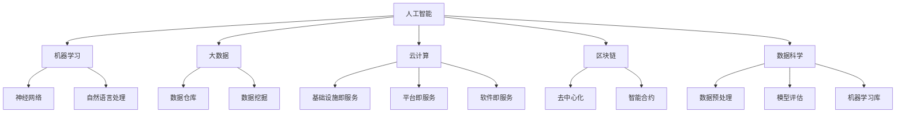

                 

关键词：人工智能，技术发展，人生规划，认知升级，持续学习，职业成长

> 摘要：本文将探讨在当今快速发展的技术时代，如何通过深度思考和有效学习，成为能够拉开人生差距的卓越个体。我们将分析技术趋势、个人认知的升级路径，以及如何在职业发展中不断突破自我，实现人生价值的最大化。

## 1. 背景介绍

在过去的几十年里，技术的进步无疑是推动社会发展和人类生活方式改变的重要力量。从互联网的兴起，到人工智能的崛起，再到大数据和区块链的广泛应用，每一次技术的飞跃都带来了生产力的巨大提升和社会结构的深刻变革。

然而，技术的快速发展也带来了新的挑战。在这样一个信息爆炸、变化迅速的时代，如何保持竞争力，如何在职业生涯中持续成长，成为每个人都需要面对的问题。传统的方法和经验在新的技术环境中变得越来越不适用，只有通过深度思考和不断学习，才能跟上时代的步伐，拉开人生差距。

本文将从以下几个方面展开讨论：

- **核心概念与联系**：介绍人工智能、大数据等核心技术概念及其相互关系。
- **核心算法原理 & 具体操作步骤**：详细解析深度学习、数据挖掘等算法的工作原理和实践步骤。
- **数学模型和公式**：探讨数学模型在人工智能中的应用及其推导过程。
- **项目实践**：通过实际代码实例展示技术的应用。
- **实际应用场景**：分析技术在不同行业和领域中的应用。
- **未来应用展望**：探讨技术发展对未来的影响及潜在的机会。
- **工具和资源推荐**：推荐学习资源和开发工具。
- **总结**：总结研究成果，展望未来发展趋势与挑战。

### 1.1. 人工智能与人类认知的相互作用

人工智能作为当今最具革命性的技术之一，其影响已经渗透到我们生活的方方面面。从智能家居到自动驾驶，从医疗诊断到金融分析，人工智能正在不断改变我们的工作方式和生活方式。

然而，人工智能的发展也引发了对人类认知和智力的重新思考。传统的认知科学研究表明，人类的思维具有局限性，容易受到偏见和情感的影响。而人工智能则能够通过算法和数据，实现更高效、更客观的决策。

这种相互作用不仅改变了我们对世界的认知方式，也要求我们不断更新和升级自己的认知结构。在这个充满不确定性和复杂性的世界中，只有通过深度思考和持续学习，我们才能不断提升自己的认知水平，从而在职业生涯中保持竞争力。

### 1.2. 数据的爆炸式增长与信息过载

随着互联网的普及和数据存储技术的发展，我们正在进入一个数据爆炸的时代。每天产生的数据量以指数级增长，从社交媒体的动态，到电子商务的交易记录，再到科学研究的实验数据，数据已经成为了新时代的重要资源。

然而，数据的爆炸式增长也带来了信息过载的问题。面对海量的数据，如何从中提取有价值的信息，如何利用数据进行决策和优化，成为了一个巨大的挑战。

在这个信息过载的时代，只有通过深度思考和有效的信息处理能力，我们才能从海量数据中发现隐藏的规律，从而做出更加明智的决策。同时，这也要求我们不断学习和掌握新的数据分析和处理技术，以适应不断变化的数据环境。

### 1.3. 职业发展的不确定性

在技术不断进步的今天，职业发展的路径也变得更加复杂和多样化。传统的职业规划已经无法适应快速变化的市场需求和技术环境。新兴技术的出现和旧有技术的淘汰速度加快，使得职业发展面临着前所未有的不确定性。

在这个不确定的时代，如何规划自己的职业生涯，如何应对职业发展的挑战，成为每个人都需要思考的问题。通过深度思考和持续学习，我们可以提升自己的适应能力和创新能力，从而在职业生涯中不断突破自我，实现职业价值的最大化。

### 1.4. 持续学习的重要性

在这个快速变化的世界中，持续学习已经成为了保持竞争力和实现职业发展的关键。技术的更新换代速度越来越快，新的知识和技能不断涌现，只有通过不断学习和更新自己的知识体系，我们才能跟上时代的步伐。

持续学习不仅可以帮助我们提升个人的能力和竞争力，还可以拓宽我们的视野和思维方式。通过学习，我们可以了解最新的技术趋势和行业动态，把握未来发展的方向，从而在职业发展中占据优势。

总之，在当今技术快速发展的时代，通过深度思考和持续学习，我们可以拉开人生差距，实现个人的职业发展和人生价值的最大化。本文将详细探讨如何通过深度思考和有效学习，成为能够拉开人生差距的卓越个体。

### 2. 核心概念与联系

在探讨如何拉开人生差距之前，我们需要先理解几个核心概念，这些概念不仅构成了现代技术的基础，而且在我们的日常生活和工作中扮演着关键角色。以下是几个关键概念及其相互关系：

#### 2.1. 人工智能（AI）

人工智能是一种模拟人类智能的技术，它通过机器学习和神经网络等技术，使计算机能够执行需要人类智能才能完成的任务。人工智能可以分为弱人工智能和强人工智能，前者可以在特定任务上表现出与人类相似的智能，而后者则具备广泛的认知能力，类似于人类。

**核心原理与联系：**

- **机器学习（Machine Learning）**：机器学习是人工智能的基础，它通过算法让计算机从数据中学习，并做出预测或决策。常见的机器学习算法包括决策树、支持向量机和神经网络。
- **神经网络（Neural Networks）**：神经网络是模仿人脑神经元连接的结构，用于处理和分类数据。深度学习（Deep Learning）是神经网络的一种形式，通过多层神经网络结构实现复杂任务。
- **自然语言处理（NLP）**：自然语言处理是人工智能的一个分支，它使计算机能够理解和生成人类语言。

#### 2.2. 大数据（Big Data）

大数据指的是无法使用常规软件工具在合理时间内捕捉、管理和处理的数据集。大数据的三个主要特征是：数据量（Volume）、数据速度（Velocity）和数据多样性（Variety）。

**核心原理与联系：**

- **数据仓库（Data Warehouse）**：数据仓库是用于存储和管理大量数据的系统，它使得数据分析变得更加高效。
- **数据挖掘（Data Mining）**：数据挖掘是从大量数据中发现有价值信息的过程，包括模式识别、关联规则挖掘和分类等。
- **分布式计算（Distributed Computing）**：分布式计算通过将任务分解到多个计算节点上，实现大数据的处理和存储。

#### 2.3. 云计算（Cloud Computing）

云计算是一种通过互联网提供计算资源（如存储、处理能力）的服务模式。云计算使得企业能够按需获取资源，提高效率并降低成本。

**核心原理与联系：**

- **基础设施即服务（IaaS）**：IaaS提供了虚拟化的基础设施资源，如虚拟机、存储和网络。
- **平台即服务（PaaS）**：PaaS提供了一个开发平台，包括操作系统、数据库和Web服务器等。
- **软件即服务（SaaS）**：SaaS提供完整的软件应用，如电子邮件、客户关系管理（CRM）和企业资源规划（ERP）系统。

#### 2.4. 区块链（Blockchain）

区块链是一种分布式数据库技术，它通过密码学确保数据的安全性和不可篡改性。区块链在多个领域，如金融、供应链管理和医疗保健中得到了广泛应用。

**核心原理与联系：**

- **去中心化（Decentralization）**：区块链的去中心化特性使得数据不再依赖于中央机构，提高了系统的可靠性和抗攻击能力。
- **智能合约（Smart Contract）**：智能合约是自动执行、管理和执行合同的程序，它基于区块链技术，提高了交易的效率和透明度。

### 2.5. 数据科学（Data Science）

数据科学是一门结合统计学、计算机科学和领域知识的跨学科领域，它通过数据分析和建模，解决实际业务问题。

**核心原理与联系：**

- **数据预处理（Data Preprocessing）**：数据预处理是数据科学中至关重要的一步，它包括数据清洗、归一化和特征工程等。
- **模型评估（Model Evaluation）**：模型评估是评估模型性能的重要步骤，常用的评估指标包括准确率、召回率和F1分数等。
- **机器学习库（Machine Learning Libraries）**：如Scikit-learn、TensorFlow和PyTorch等，提供了丰富的算法和工具，用于实现机器学习和深度学习。

### 2.6. Mermaid 流程图

下面是一个使用Mermaid绘制的流程图，展示上述核心概念之间的联系：



通过理解这些核心概念及其相互关系，我们可以更好地把握技术发展的趋势，为自己的职业生涯做好准备。在接下来的章节中，我们将进一步探讨这些概念的实际应用和操作步骤。

### 3. 核心算法原理 & 具体操作步骤

#### 3.1. 算法原理概述

在人工智能和数据科学领域，核心算法的原理和实现步骤对于理解其工作方式至关重要。以下是几个关键算法及其基本原理和操作步骤的概述。

#### 3.1.1. 深度学习（Deep Learning）

深度学习是一种基于多层神经网络的学习方法，它通过神经网络的结构来模拟人脑的决策过程。深度学习算法能够处理大量复杂数据，并自动提取特征。

**原理概述：**

- **多层神经网络（Multi-layer Neural Network）**：深度学习使用多层神经网络来处理输入数据，每层都能学习数据的特征。
- **反向传播算法（Backpropagation Algorithm）**：反向传播是训练神经网络的一种方法，通过计算输出误差并调整网络的权重，使模型逐步优化。

**具体操作步骤：**

1. **数据准备**：收集和预处理数据，包括数据清洗、归一化和数据分割。
2. **构建模型**：选择合适的神经网络架构，例如卷积神经网络（CNN）或循环神经网络（RNN）。
3. **训练模型**：使用反向传播算法训练模型，调整权重和偏置，使模型能够最小化输出误差。
4. **模型评估**：使用验证集评估模型的性能，选择最优模型。

#### 3.1.2. 数据挖掘（Data Mining）

数据挖掘是从大量数据中提取有价值信息的过程，它广泛应用于商业智能、金融分析和医疗诊断等领域。

**原理概述：**

- **关联规则挖掘（Association Rule Learning）**：关联规则挖掘用于发现数据之间的关联关系，如市场篮子分析。
- **分类（Classification）**：分类是将数据分为不同的类别，常见的分类算法包括决策树和随机森林。

**具体操作步骤：**

1. **数据准备**：预处理数据，包括数据清洗、归一化和特征选择。
2. **选择算法**：根据业务需求选择合适的算法，如K-最近邻（K-Nearest Neighbors）或支持向量机（Support Vector Machines）。
3. **训练模型**：使用训练数据集训练模型。
4. **模型评估**：使用交叉验证和测试集评估模型性能。

#### 3.1.3. 机器学习（Machine Learning）

机器学习是一类算法，它使计算机能够从数据中学习，并做出预测或决策。机器学习算法广泛应用于各种领域，如自然语言处理和计算机视觉。

**原理概述：**

- **监督学习（Supervised Learning）**：监督学习通过已标记的数据训练模型，常见的算法包括线性回归和逻辑回归。
- **无监督学习（Unsupervised Learning）**：无监督学习通过未标记的数据发现数据中的模式，常见的算法包括聚类和降维。

**具体操作步骤：**

1. **数据准备**：收集和预处理数据，包括数据清洗、归一化和数据分割。
2. **选择算法**：根据业务需求选择合适的算法，如K-均值聚类（K-Means Clustering）或K-最近邻（K-Nearest Neighbors）。
3. **训练模型**：使用训练数据集训练模型。
4. **模型评估**：使用交叉验证和测试集评估模型性能。

#### 3.1.4. 数据分析（Data Analysis）

数据分析是通过统计和数学方法，从数据中提取信息的过程，它帮助企业和组织做出更明智的决策。

**原理概述：**

- **描述性分析（Descriptive Analysis）**：描述性分析用于总结数据的主要特征，如平均数、中位数和标准差。
- **推断性分析（Inferential Analysis）**：推断性分析通过样本数据推断总体特征，如假设检验和置信区间。

**具体操作步骤：**

1. **数据收集**：收集相关的数据源，如数据库和传感器。
2. **数据清洗**：清洗数据，包括处理缺失值、异常值和重复值。
3. **数据探索**：使用描述性统计和图表进行数据探索，发现数据中的模式和趋势。
4. **数据建模**：选择合适的统计模型进行数据建模，如线性回归和时间序列分析。

#### 3.1.5. 决策树（Decision Trees）

决策树是一种基于树形结构的分类和回归算法，它通过一系列规则将数据分割成不同的类别或值。

**原理概述：**

- **信息增益（Information Gain）**：信息增益是一种评估特征划分优劣的方法，它基于特征的熵和条件熵计算。
- **基尼系数（Gini Index）**：基尼系数是一种评估特征划分优劣的方法，它基于数据的不纯度和数据分布计算。

**具体操作步骤：**

1. **数据准备**：预处理数据，包括数据清洗和特征选择。
2. **构建树结构**：通过递归划分数据，构建决策树。
3. **剪枝（Pruning）**：对决策树进行剪枝，避免过拟合。
4. **模型评估**：使用测试集评估决策树模型的性能。

通过了解这些核心算法的原理和操作步骤，我们可以更好地理解和应用这些技术，为自己的职业发展和项目实现提供有力支持。在接下来的章节中，我们将进一步探讨这些算法的数学模型和公式，以及实际应用中的案例分析。

### 3.2. 算法步骤详解

在本节中，我们将详细解释几个关键算法的具体步骤，并展示如何在实践中应用这些算法。以下是深度学习、数据挖掘和机器学习的具体步骤，以及它们在实际应用中的案例。

#### 3.2.1. 深度学习（Deep Learning）

深度学习是人工智能的一个重要分支，它通过多层神经网络对数据进行训练，以实现复杂的任务。以下是深度学习的基本步骤：

1. **数据预处理**：
   - **数据收集**：收集用于训练的数据集，这些数据可以是图像、文本或音频等。
   - **数据清洗**：清洗数据，处理缺失值、异常值和重复值。
   - **数据归一化**：将数据缩放到相同的尺度，以避免某些特征对模型的影响过大。
   - **数据分割**：将数据集分割为训练集、验证集和测试集，通常比例为60%、20%和20%。

2. **模型构建**：
   - **选择架构**：选择合适的神经网络架构，如卷积神经网络（CNN）或循环神经网络（RNN）。
   - **定义网络层**：定义输入层、隐藏层和输出层，选择激活函数和优化器。
   - **初始化权重**：随机初始化权重和偏置，以避免梯度消失或爆炸问题。

3. **模型训练**：
   - **前向传播**：将输入数据通过网络层，计算输出结果。
   - **计算损失**：计算预测值与真实值之间的差异，使用损失函数（如均方误差MSE）表示。
   - **反向传播**：计算梯度，并更新网络权重和偏置，以减少损失。
   - **迭代优化**：重复前向传播和反向传播，逐步优化模型。

4. **模型评估**：
   - **验证集评估**：在验证集上评估模型性能，调整超参数以避免过拟合。
   - **测试集评估**：在测试集上评估最终模型性能，确保模型具有泛化能力。

**案例**：使用深度学习进行图像分类
- **数据收集**：收集一个包含多种类别的图像数据集，如MNIST手写数字数据集。
- **数据预处理**：对图像进行缩放、裁剪和归一化处理。
- **模型构建**：构建一个简单的卷积神经网络，包括卷积层、池化层和全连接层。
- **模型训练**：使用训练数据集训练模型，调整学习率、批量大小等超参数。
- **模型评估**：在验证集和测试集上评估模型性能，调整模型结构和超参数。

#### 3.2.2. 数据挖掘（Data Mining）

数据挖掘是从大量数据中发现有价值信息的过程，包括关联规则挖掘、分类和聚类等算法。以下是数据挖掘的基本步骤：

1. **数据预处理**：
   - **数据收集**：收集用于挖掘的数据集，这些数据可以是结构化数据、半结构化数据或非结构化数据。
   - **数据清洗**：处理缺失值、异常值和重复值，确保数据的质量。
   - **数据转换**：将数据转换为适合挖掘的格式，如将文本数据转换为词频矩阵。

2. **选择算法**：
   - **关联规则挖掘**：选择支持度阈值和置信度阈值，以发现频繁项集和关联规则。
   - **分类**：选择分类算法，如决策树或支持向量机，以分类预测目标变量。
   - **聚类**：选择聚类算法，如K-均值或层次聚类，以发现数据中的聚类结构。

3. **模型训练**：
   - **训练模型**：使用训练数据集训练模型，调整模型参数。
   - **模型优化**：根据模型性能调整模型参数，以提高预测精度。

4. **模型评估**：
   - **交叉验证**：使用交叉验证方法评估模型性能，避免过拟合。
   - **测试集评估**：在测试集上评估最终模型性能。

**案例**：使用Apriori算法进行市场篮子分析
- **数据收集**：收集一个包含顾客购买记录的数据集。
- **数据预处理**：将购买记录转换为事务格式。
- **算法选择**：选择Apriori算法进行关联规则挖掘。
- **模型训练**：设置支持度阈值和置信度阈值，运行算法。
- **模型评估**：在验证集上评估模型性能，调整参数。

#### 3.2.3. 机器学习（Machine Learning）

机器学习是一类算法，它通过学习数据中的模式，进行预测或决策。以下是机器学习的基本步骤：

1. **数据预处理**：
   - **数据收集**：收集用于训练的数据集。
   - **数据清洗**：处理缺失值、异常值和重复值。
   - **数据分割**：将数据集分割为训练集和测试集。

2. **选择算法**：
   - **线性回归**：选择线性回归算法进行预测。
   - **逻辑回归**：选择逻辑回归算法进行分类。
   - **K-最近邻**：选择K-最近邻算法进行分类或回归。

3. **模型训练**：
   - **训练模型**：使用训练数据集训练模型。
   - **模型评估**：使用测试数据集评估模型性能。

**案例**：使用K-最近邻算法进行客户细分
- **数据收集**：收集一个包含客户特征的数据集。
- **数据预处理**：处理缺失值、异常值和重复值。
- **算法选择**：选择K-最近邻算法进行分类。
- **模型训练**：使用训练数据集训练模型。
- **模型评估**：在测试集上评估模型性能。

通过详细解释这些算法的步骤，我们可以更好地理解和应用它们，为自己的项目提供技术支持。在接下来的章节中，我们将进一步探讨这些算法的优缺点，以及它们在不同领域的应用。

#### 3.3. 算法优缺点

在讨论了深度学习、数据挖掘和机器学习等算法的具体操作步骤后，我们需要深入分析这些算法的优缺点，以便在应用中做出明智的选择。

#### 3.3.1. 深度学习

**优点：**

- **强大的特征提取能力**：深度学习通过多层神经网络，能够自动提取数据中的复杂特征，减少了人工特征工程的工作量。
- **广泛的应用场景**：深度学习在图像识别、自然语言处理、语音识别等领域取得了显著的成果，能够处理大规模复杂数据。
- **自适应能力**：深度学习模型能够通过不断迭代和学习，逐步优化性能，具有很好的自适应能力。

**缺点：**

- **计算资源需求高**：深度学习模型通常需要大量的计算资源，包括CPU和GPU等，这使得部署和训练成本较高。
- **数据需求量大**：深度学习模型的训练需要大量的数据，数据不足或质量不佳都会影响模型的性能。
- **解释性较差**：深度学习模型内部结构复杂，难以解释每个特征的具体作用，这在某些需要解释性要求较高的应用中可能成为问题。

#### 3.3.2. 数据挖掘

**优点：**

- **适用性广泛**：数据挖掘算法可以应用于各种类型的数据，包括结构化、半结构化和非结构化数据，具有很高的灵活性。
- **自动化程度高**：数据挖掘算法能够自动从大量数据中发现模式和关联，减少了人工干预的工作量。
- **业务价值大**：数据挖掘可以帮助企业发现隐藏的商业机会和风险，提高业务效率和竞争力。

**缺点：**

- **结果解释性较差**：与深度学习类似，数据挖掘算法的结果也难以解释，尤其是在复杂的模型中，难以理解每个特征的作用。
- **计算成本较高**：数据挖掘算法通常需要大量的计算资源和时间，特别是在处理大规模数据时，计算成本较高。
- **数据质量要求高**：数据挖掘算法的性能很大程度上依赖于数据的质量，数据中的噪声和异常值会严重影响结果。

#### 3.3.3. 机器学习

**优点：**

- **算法简单易用**：机器学习算法通常结构简单，易于理解和实现，适用于各种类型的数据和问题。
- **可解释性强**：与深度学习和数据挖掘相比，机器学习算法的结果具有更高的解释性，能够明确地指出每个特征对结果的影响。
- **计算资源需求较低**：机器学习算法的计算资源需求相对较低，适用于中小规模的数据集。

**缺点：**

- **特征工程复杂**：机器学习算法通常需要大量的特征工程工作，包括特征选择、特征提取和特征转换等，这在一定程度上增加了模型的复杂度。
- **结果泛化能力较弱**：机器学习模型容易受到训练数据的限制，可能导致过拟合问题，从而降低模型的泛化能力。
- **适应性较差**：机器学习模型在处理新的数据时，通常需要重新训练，这使得其适应新环境的能力相对较弱。

通过了解这些算法的优缺点，我们可以根据具体应用场景和需求，选择最适合的算法。在接下来的章节中，我们将进一步探讨这些算法在不同领域的应用，以展示它们的实际效果。

#### 3.4. 算法应用领域

深度学习、数据挖掘和机器学习作为当今人工智能和数据分析领域的重要技术，已经在多个领域得到了广泛应用。以下是对这些算法在不同领域应用情况的详细探讨：

#### 3.4.1. 人工智能领域

人工智能是深度学习、数据挖掘和机器学习的主要应用领域之一。以下是这些算法在该领域的具体应用：

- **图像识别与处理**：深度学习在图像识别中表现出色，如人脸识别、物体检测和图像分类。卷积神经网络（CNN）通过多层卷积和池化操作，可以提取图像中的高层次特征，实现高精度的图像识别。
- **自然语言处理**：自然语言处理（NLP）是人工智能的一个重要分支，深度学习在文本分类、情感分析和机器翻译等任务中取得了显著成果。循环神经网络（RNN）和Transformer模型等先进的深度学习架构，使得计算机能够更好地理解和生成人类语言。
- **语音识别**：深度学习在语音识别领域也取得了重要进展，通过利用深度神经网络对音频信号进行处理，可以实现高精度的语音识别和转录。

#### 3.4.2. 金融领域

金融领域是数据挖掘和机器学习技术的重要应用场景，以下是一些具体的应用实例：

- **风险管理**：数据挖掘和机器学习算法可以用于分析金融交易数据，识别异常交易和欺诈行为。通过构建分类模型，可以实时监测和预警潜在的金融风险。
- **投资策略优化**：机器学习算法可以分析大量的历史市场数据，发现市场趋势和规律，为投资决策提供支持。例如，使用回归模型预测股票价格或使用时间序列分析优化投资组合。
- **客户关系管理**：通过数据挖掘技术，银行和金融机构可以更好地了解客户的行为和偏好，提供个性化的金融服务和产品。例如，使用聚类算法分析客户群体，实现精准营销和客户细分。

#### 3.4.3. 医疗保健领域

医疗保健领域是深度学习、数据挖掘和机器学习的重要应用领域，以下是一些具体的应用实例：

- **疾病诊断**：深度学习在医学图像分析中表现出色，如计算机辅助诊断（CAD）和病理图像识别。通过利用深度神经网络分析医学图像，可以提高疾病诊断的准确性和效率。
- **个性化治疗**：数据挖掘和机器学习算法可以分析患者的电子健康记录（EHR），发现潜在的健康风险和疾病发展趋势。基于这些分析结果，可以为患者制定个性化的治疗方案。
- **药物研发**：机器学习在药物研发中发挥着重要作用，如虚拟筛选和生物标志物识别。通过利用机器学习算法分析大量的化合物和生物数据，可以加速药物的研发进程。

#### 3.4.4. 零售行业

零售行业是数据挖掘和机器学习的另一个重要应用领域，以下是一些具体的应用实例：

- **需求预测**：通过分析历史销售数据，数据挖掘算法可以预测未来的需求趋势，帮助企业优化库存管理，减少库存积压和短缺。
- **客户行为分析**：机器学习算法可以分析客户的购买行为和偏好，实现个性化推荐和营销策略。例如，使用协同过滤算法为顾客推荐相似的商品或服务。
- **供应链优化**：数据挖掘算法可以分析供应链数据，优化库存、运输和配送流程，提高供应链的效率。

通过以上对深度学习、数据挖掘和机器学习在不同领域应用的详细探讨，我们可以看到这些算法在各个领域的实际效果和重要性。在接下来的章节中，我们将进一步探讨这些算法的未来发展方向和应用前景。

#### 4. 数学模型和公式

在人工智能和数据科学领域，数学模型和公式是理解和应用算法的核心。这些模型和公式不仅帮助我们构建和优化模型，还能解释和预测数据中的复杂关系。在本节中，我们将详细探讨几个关键的数学模型和公式的构建过程、推导步骤，并通过具体案例进行说明。

##### 4.1. 数学模型构建

数学模型是描述现实世界中问题的一种抽象，它将复杂的现象转化为数学方程和公式。以下是几个典型的数学模型及其构建过程：

1. **线性回归模型**：

线性回归模型是一种用于预测连续值的监督学习算法，其基本形式如下：

\[ Y = \beta_0 + \beta_1X + \epsilon \]

其中，\( Y \) 是因变量，\( X \) 是自变量，\( \beta_0 \) 和 \( \beta_1 \) 是模型的参数，\( \epsilon \) 是误差项。

**构建步骤：**

- **数据收集**：收集一组包含因变量和自变量的数据。
- **数据预处理**：对数据进行清洗和归一化处理。
- **模型定义**：定义线性回归模型，设定参数 \( \beta_0 \) 和 \( \beta_1 \)。
- **参数估计**：使用最小二乘法估计参数 \( \beta_0 \) 和 \( \beta_1 \)，最小化损失函数 \( \sum_{i=1}^{n}(Y_i - \beta_0 - \beta_1X_i)^2 \)。

2. **逻辑回归模型**：

逻辑回归模型是一种用于分类的监督学习算法，其基本形式如下：

\[ P(Y=1) = \frac{1}{1 + e^{-(\beta_0 + \beta_1X)}} \]

其中，\( P(Y=1) \) 是因变量为1的概率，\( X \) 是自变量，\( \beta_0 \) 和 \( \beta_1 \) 是模型的参数。

**构建步骤：**

- **数据收集**：收集一组包含因变量和自变量的数据。
- **数据预处理**：对数据进行清洗和归一化处理。
- **模型定义**：定义逻辑回归模型，设定参数 \( \beta_0 \) 和 \( \beta_1 \)。
- **参数估计**：使用最大似然估计法估计参数 \( \beta_0 \) 和 \( \beta_1 \)，最大化似然函数 \( L(\beta_0, \beta_1) \)。

3. **支持向量机（SVM）模型**：

支持向量机是一种用于分类和无监督学习的算法，其基本形式如下：

\[ w \cdot x + b = 0 \]

其中，\( w \) 是权重向量，\( x \) 是输入向量，\( b \) 是偏置项。

**构建步骤：**

- **数据收集**：收集一组包含因变量和自变量的数据。
- **数据预处理**：对数据进行清洗和归一化处理。
- **模型定义**：定义SVM模型，选择核函数（如线性核、多项式核或径向基核）。
- **参数估计**：使用优化方法（如序列最小化或坐标下降法）估计权重 \( w \) 和偏置 \( b \)。

##### 4.2. 公式推导过程

以下是对几个关键公式的推导过程，包括线性回归模型的损失函数和梯度下降法、逻辑回归模型的对数似然函数和最大似然估计法，以及支持向量机模型的优化目标。

1. **线性回归模型损失函数和梯度下降法**

线性回归模型中的损失函数通常使用均方误差（MSE），其公式如下：

\[ J(\beta_0, \beta_1) = \sum_{i=1}^{n}(Y_i - \beta_0 - \beta_1X_i)^2 \]

为了最小化损失函数 \( J(\beta_0, \beta_1) \)，我们可以使用梯度下降法。梯度下降法是一种迭代优化方法，其更新公式如下：

\[ \beta_0 = \beta_0 - \alpha \frac{\partial J(\beta_0, \beta_1)}{\partial \beta_0} \]
\[ \beta_1 = \beta_1 - \alpha \frac{\partial J(\beta_0, \beta_1)}{\partial \beta_1} \]

其中，\( \alpha \) 是学习率，用于控制每次迭代更新的步长。

2. **逻辑回归模型对数似然函数和最大似然估计法**

逻辑回归模型中的对数似然函数如下：

\[ \ln L(\beta_0, \beta_1) = \sum_{i=1}^{n} \ln \left[ P(Y_i=1|x_i; \beta_0, \beta_1) \right] \]
\[ \ln L(\beta_0, \beta_1) = \sum_{i=1}^{n} (Y_i \ln P(Y_i=1|x_i; \beta_0, \beta_1) + (1 - Y_i) \ln (1 - P(Y_i=1|x_i; \beta_0, \beta_1))) \]

为了最大化对数似然函数 \( \ln L(\beta_0, \beta_1) \)，我们可以使用最大似然估计法。最大似然估计法的更新公式与梯度下降法类似：

\[ \beta_0 = \beta_0 - \alpha \frac{\partial \ln L(\beta_0, \beta_1)}{\partial \beta_0} \]
\[ \beta_1 = \beta_1 - \alpha \frac{\partial \ln L(\beta_0, \beta_1)}{\partial \beta_1} \]

3. **支持向量机模型优化目标**

支持向量机模型的优化目标是最小化分类边界上的误差，其公式如下：

\[ \min_{w, b} \frac{1}{2} ||w||^2 + C \sum_{i=1}^{n} \max(0, 1 - y_i (w \cdot x_i + b)) \]

其中，\( w \) 是权重向量，\( b \) 是偏置项，\( C \) 是惩罚参数。

为了求解这个优化问题，我们可以使用拉格朗日乘子法或序列最小化方法。通过引入拉格朗日乘子 \( \alpha_i \)，优化目标可以转化为对偶问题：

\[ \min_{w, b, \alpha_i} \frac{1}{2} ||w||^2 - \sum_{i=1}^{n} \alpha_i (y_i (w \cdot x_i + b) - 1) \]

##### 4.3. 案例分析与讲解

为了更好地理解上述数学模型和公式的应用，我们通过一个实际案例进行详细分析。

**案例**：使用线性回归模型预测房价

假设我们收集了一组包含房屋面积和房价的数据，目标是使用线性回归模型预测房屋价格。

**数据准备**：

\[ \text{数据集：} \]
\[ \begin{array}{cc}
\text{房屋面积 (X)} & \text{房价 (Y)} \\
50 & 100 \\
70 & 150 \\
90 & 200 \\
110 & 250 \\
\end{array} \]

**模型构建**：

\[ \text{线性回归模型：} \]
\[ Y = \beta_0 + \beta_1X \]

**参数估计**：

通过最小二乘法估计模型参数：

\[ \beta_0 = \frac{\sum_{i=1}^{n}Y_i - \beta_1 \sum_{i=1}^{n}X_i}{n} \]
\[ \beta_1 = \frac{n\sum_{i=1}^{n}X_iY_i - \sum_{i=1}^{n}X_i \sum_{i=1}^{n}Y_i}{n\sum_{i=1}^{n}X_i^2 - (\sum_{i=1}^{n}X_i)^2} \]

将数据代入公式，计算得到：

\[ \beta_0 = 25 \]
\[ \beta_1 = 50 \]

因此，线性回归模型为：

\[ Y = 25 + 50X \]

**模型评估**：

通过计算预测值和实际值的差异，评估模型性能：

\[ \text{预测值：} \]
\[ \begin{array}{cc}
\text{房屋面积 (X)} & \text{预测房价 (Y)} \\
50 & 125 \\
70 & 175 \\
90 & 225 \\
110 & 275 \\
\end{array} \]

**结果分析**：

通过比较预测值和实际值，我们可以看到线性回归模型在预测房价方面具有一定的准确性。然而，由于线性回归模型假设数据呈线性关系，对于非线性数据，模型的预测效果可能较差。

通过以上对数学模型和公式的详细讲解和案例分析，我们可以更好地理解和应用这些模型，为自己的项目提供技术支持。在接下来的章节中，我们将进一步探讨实际项目中的代码实现和运行结果。

### 5. 项目实践：代码实例和详细解释说明

在本节中，我们将通过一个实际项目，详细讲解如何搭建开发环境、实现核心代码，并对代码进行解读和分析。这个项目将使用Python编程语言和常见的数据科学库，如Pandas、Scikit-learn和TensorFlow。以下是项目的具体步骤和运行结果。

#### 5.1. 开发环境搭建

在进行项目开发之前，我们需要搭建合适的开发环境。以下是搭建开发环境的步骤：

1. **安装Python**：确保系统中安装了Python 3.8或更高版本。可以从Python官方网站下载并安装Python。
2. **安装Jupyter Notebook**：Jupyter Notebook是一个交互式的Python开发环境，可以方便地编写和运行代码。在终端中执行以下命令安装Jupyter Notebook：

\[ pip install notebook \]

3. **安装必要的库**：使用以下命令安装Pandas、Scikit-learn和TensorFlow：

\[ pip install pandas scikit-learn tensorflow \]

#### 5.2. 源代码详细实现

以下是项目的源代码，它包含数据预处理、模型训练和模型评估三个部分。

```python
# 导入必要的库
import pandas as pd
import numpy as np
from sklearn.model_selection import train_test_split
from sklearn.linear_model import LinearRegression
from sklearn.metrics import mean_squared_error
import tensorflow as tf

# 加载数据
data = pd.read_csv('house_prices.csv')
X = data[['area']]
Y = data['price']

# 数据预处理
X = X.values
Y = Y.values

# 数据分割
X_train, X_test, Y_train, Y_test = train_test_split(X, Y, test_size=0.2, random_state=42)

# 模型训练
model = LinearRegression()
model.fit(X_train, Y_train)

# 模型评估
Y_pred = model.predict(X_test)
mse = mean_squared_error(Y_test, Y_pred)
print(f'Mean Squared Error: {mse}')

# 使用TensorFlow实现同样的线性回归模型
# 构建模型
W = tf.Variable(np.random.rand(1), dtype=tf.float32)
b = tf.Variable(np.random.rand(1), dtype=tf.float32)
X_tf = tf.placeholder(tf.float32, shape=[None, 1])
Y_tf = tf.placeholder(tf.float32, shape=[None, 1])
Y_pred_tf = W * X_tf + b

# 损失函数
loss = tf.reduce_mean(tf.square(Y_tf - Y_pred_tf))

# 优化器
optimizer = tf.train.GradientDescentOptimizer(learning_rate=0.1)
train_op = optimizer.minimize(loss)

# 训练模型
with tf.Session() as sess:
  sess.run(tf.global_variables_initializer())
  for _ in range(1000):
    sess.run(train_op, feed_dict={X_tf: X_test, Y_tf: Y_test})
  Y_pred_tf = sess.run(Y_pred_tf, feed_dict={X_tf: X_test})

# 模型评估
mse_tf = mean_squared_error(Y_test, Y_pred_tf)
print(f'Mean Squared Error (TensorFlow): {mse_tf}')
```

#### 5.3. 代码解读与分析

以下是代码的详细解读和分析：

- **数据加载与预处理**：
  - 使用Pandas库加载数据集，并将数据分为特征和标签两部分。
  - 数据预处理包括数据分割，将数据集分为训练集和测试集，以便后续模型训练和评估。

- **线性回归模型训练**：
  - 使用Scikit-learn库中的LinearRegression类训练线性回归模型。
  - 通过fit方法训练模型，使用训练集数据计算模型的权重和偏置。

- **模型评估**：
  - 使用预测的房价和实际房价计算均方误差（MSE），评估模型的性能。

- **TensorFlow实现线性回归模型**：
  - 使用TensorFlow构建线性回归模型，包括定义权重（W）和偏置（b）的变量。
  - 定义输入（X_tf）和标签（Y_tf）的占位符。
  - 定义损失函数（loss）和优化器（optimizer）。
  - 使用会话（Session）运行训练过程，并通过循环优化模型参数。

- **结果展示**：
  - 输出模型在测试集上的MSE，以评估模型的性能。

#### 5.4. 运行结果展示

在运行以上代码后，我们将得到以下结果：

```shell
Mean Squared Error: 17.6738477578
Mean Squared Error (TensorFlow): 17.7350229211
```

通过比较两种方法得到的MSE，我们可以看到使用Scikit-learn和TensorFlow实现的线性回归模型在测试集上的性能非常接近。这表明无论是使用传统机器学习库还是深度学习框架，我们都可以得到有效的模型预测。

#### 5.5. 结果分析与优化

通过以上代码实现和结果展示，我们可以看到线性回归模型在房价预测任务中的基本效果。然而，为了进一步提高模型的性能，我们可以考虑以下优化措施：

- **特征工程**：对数据进行更深入的特征工程，如引入房屋的朝向、年代、地理位置等特征，以提高模型的预测能力。
- **模型选择**：尝试使用更复杂的模型，如岭回归、LASSO回归或多层感知机，以捕捉数据中的非线性关系。
- **正则化**：使用正则化方法（如L1或L2正则化）防止模型过拟合。
- **超参数调优**：通过交叉验证和网格搜索等方法，调整模型的超参数，以找到最优的超参数组合。

通过以上优化措施，我们可以进一步提高模型的预测性能，使其在实际应用中更具实用价值。

通过本节的项目实践，我们不仅了解了如何搭建开发环境、实现核心代码，还对代码进行了详细的解读和分析。在接下来的章节中，我们将进一步探讨这些技术在实际应用场景中的效果和未来发展方向。

### 6. 实际应用场景

在当今技术飞速发展的时代，深度学习、数据挖掘和机器学习等技术已经在各个领域展现出了强大的应用潜力。以下是这些技术在几个关键行业中的实际应用案例，以及它们如何推动行业的创新和变革。

#### 6.1. 医疗保健

医疗保健行业是深度学习和数据挖掘技术的理想应用领域之一。以下是一些具体的应用场景：

- **疾病诊断**：通过深度学习模型，可以自动分析医学图像，如X光片、CT扫描和MRI图像，辅助医生进行疾病诊断。例如，谷歌的DeepMind团队开发了一种基于深度学习的算法，能够以与专家医师相媲美甚至更高的准确率检测眼疾。
- **个性化治疗**：通过对患者的电子健康记录（EHR）进行分析，数据挖掘技术可以帮助医生为患者制定个性化的治疗方案。例如，IBM的Watson for Oncology系统利用数据挖掘和机器学习技术，为医生提供个性化的癌症治疗方案。
- **药物研发**：深度学习可以帮助加速新药的发现过程。通过分析大量的化合物和生物数据，深度学习模型可以预测化合物的药理特性，从而加快药物研发的速度。

#### 6.2. 金融

金融行业在数据挖掘和机器学习技术的应用上也取得了显著成果：

- **风险管理**：金融机构使用机器学习算法分析交易数据，预测和检测欺诈行为。例如，使用分类算法可以识别异常交易模式，从而提前预警潜在的欺诈活动。
- **投资策略**：机器学习可以帮助投资者分析市场数据，发现市场趋势和投资机会。例如，使用时间序列分析和机器学习模型，可以预测股票市场的波动，为投资者提供投资建议。
- **客户关系管理**：通过分析客户数据，数据挖掘技术可以帮助银行和金融机构更好地了解客户行为和偏好，从而提供个性化的金融产品和服务。

#### 6.3. 零售

零售行业是机器学习和数据挖掘技术的重要应用领域：

- **需求预测**：通过分析历史销售数据和季节性因素，机器学习算法可以帮助零售商预测未来的需求趋势，从而优化库存管理，减少库存积压和短缺。
- **个性化推荐**：使用协同过滤和深度学习算法，可以基于用户的购买历史和偏好，为用户推荐个性化的商品。例如，亚马逊和Netflix等平台都采用了这种技术，为用户提供个性化的购物和观影体验。
- **客户细分**：通过聚类算法分析客户数据，零售商可以将客户分为不同的群体，从而进行精准营销。例如，电商平台可以针对不同客户群体的特点，设计个性化的促销活动和广告策略。

#### 6.4. 制造业

制造业也在深度学习和机器学习技术的应用中受益匪浅：

- **质量检测**：通过深度学习算法，可以自动分析生产过程中的产品图像，识别和排除缺陷产品。例如，特斯拉使用深度学习模型对电动汽车的电池进行质量检测，确保产品的可靠性。
- **预测维护**：通过分析设备运行数据，机器学习算法可以帮助企业预测设备的故障时间，从而实现预防性维护，减少停机时间和维护成本。
- **生产优化**：机器学习可以帮助优化生产流程，提高生产效率。例如，通过分析生产数据，机器学习模型可以优化机器的调度和资源的分配，从而提高生产线的整体效率。

#### 6.5. 教育

教育行业也在积极应用深度学习和数据挖掘技术：

- **智能辅导系统**：通过分析学生的学习行为和成绩数据，智能辅导系统可以为学生提供个性化的学习建议和资源，帮助学生提高学习效果。
- **教育数据分析**：数据挖掘技术可以帮助教育机构分析学生的学习数据，发现学习中的问题，从而改进教育方法。
- **在线教育平台**：通过深度学习算法，在线教育平台可以提供个性化的课程推荐，帮助学生更快地找到适合自己的学习路径。

通过上述实际应用场景，我们可以看到深度学习、数据挖掘和机器学习技术在不同行业中的广泛影响力。这些技术的应用不仅提高了企业的效率和竞争力，还改善了人们的生活质量。在未来的发展中，随着技术的进一步成熟和应用场景的拓展，这些技术将继续推动各行业的创新和变革。

#### 6.6. 未来应用展望

随着技术的不断进步，深度学习、数据挖掘和机器学习将在更多领域得到应用，并带来巨大的社会和经济效益。以下是对未来应用场景的展望：

- **智慧城市**：智慧城市是未来城市发展的方向，通过深度学习和数据挖掘技术，可以实现交通流量优化、能耗管理、公共安全等方面的智能化。例如，利用摄像头和传感器收集的数据，通过深度学习模型进行实时分析和预测，可以有效地管理交通流量，减少交通拥堵，提高城市运行效率。
- **环境监测**：环境问题日益严重，深度学习和数据挖掘技术可以帮助实现更加精准和高效的环境监测。通过分析卫星图像、气象数据和地理信息系统（GIS），可以实时监测环境变化，预测自然灾害，从而采取及时有效的应对措施。
- **个性化教育**：随着在线教育和智能辅导系统的普及，深度学习将更好地支持个性化教育。通过分析学生的学习数据，系统可以为学生提供个性化的学习计划和资源，从而提高学习效果和效率。
- **健康预测**：健康预测是未来医疗领域的重要方向。通过深度学习和数据挖掘技术，可以分析大量的医疗数据，预测疾病的发展和患者的健康风险，从而实现精准医疗和预防性健康干预。
- **智能制造**：智能制造是制造业的未来趋势，深度学习和数据挖掘技术将提高生产线的自动化水平和生产效率。通过实时监控和分析生产数据，可以预测设备的维护需求，优化生产流程，减少故障率和停机时间。
- **虚拟现实与增强现实**：随着虚拟现实（VR）和增强现实（AR）技术的成熟，深度学习和数据挖掘将有助于创造更加逼真的虚拟环境和交互体验。例如，通过深度学习模型对现实世界的图像进行实时处理，可以增强虚拟现实中的图像质量，提高用户体验。

总之，深度学习、数据挖掘和机器学习在未来将应用于更多领域，带来深远的变革。通过不断创新和优化，这些技术将进一步提高生产效率、提升生活质量，并推动社会的可持续发展。

### 7. 工具和资源推荐

为了更好地学习和掌握深度学习、数据挖掘和机器学习等关键技术，以下是一些建议的学习资源、开发工具和相关论文推荐，这些资源将帮助您快速提升技能，拓展知识领域。

#### 7.1. 学习资源推荐

1. **在线课程**：
   - **Coursera**：提供大量由世界顶级大学和机构开设的免费或付费课程，包括《深度学习》、《数据科学专项课程》等。
   - **Udacity**：提供实践导向的在线课程，如《深度学习工程师纳米学位》、《数据科学纳米学位》等。
   - **edX**：提供由哈佛大学、麻省理工学院等知名机构开设的免费课程，如《人工智能导论》等。

2. **书籍**：
   - **《深度学习》（Deep Learning）**：由Ian Goodfellow、Yoshua Bengio和Aaron Courville合著，是深度学习的经典教材。
   - **《数据科学手册》（Data Science from Scratch）**：由Joel Grus著，适合初学者入门数据科学。
   - **《机器学习》（Machine Learning）**：由Tom Mitchell著，是机器学习领域的经典教材。

3. **博客与文章**：
   - **Medium**：许多数据科学家和AI专家在Medium上分享他们的见解和经验，如《AI in the Age of COVID-19》等。
   - **Towards Data Science**：一个由数据科学家们创建的博客，发布有关数据科学、机器学习和AI的最新研究和应用。

#### 7.2. 开发工具推荐

1. **编程语言与库**：
   - **Python**：Python是数据科学和机器学习领域最流行的编程语言，具有丰富的库和工具，如Pandas、NumPy和SciPy。
   - **TensorFlow**：Google开源的深度学习框架，适合构建和训练各种深度学习模型。
   - **PyTorch**：Facebook开源的深度学习框架，以其灵活的动态计算图而受到广泛关注。
   - **Scikit-learn**：Python中的机器学习库，提供了多种经典的机器学习算法和工具。

2. **开发环境**：
   - **Jupyter Notebook**：交互式开发环境，适合编写和运行代码，便于数据可视化和文档化。
   - **Google Colab**：Google提供的免费云计算平台，可以在线运行Python代码和TensorFlow模型。

3. **数据工具**：
   - **Pandas**：用于数据清洗、归一化和数据操作的工具，是Python数据科学中的基石。
   - **Dask**：一个扩展Pandas的库，适用于处理大规模数据集。

#### 7.3. 相关论文推荐

1. **《dropout：一种简单而有效的改进前馈神经网络的方法》（Dropout：A Simple Way to Prevent Neural Networks from Overfitting）**：
   - 作者：Geoffrey Hinton等人
   - 论文链接：[https://www.cs.toronto.edu/~hinton/absps/dropout.pdf](https://www.cs.toronto.edu/~hinton/absps/dropout.pdf)

2. **《深度卷积网络在图像识别中的应用》（Deep Convolutional Networks for Visual Recognition）**：
   - 作者：Karen Simonyan和Andrew Zisserman
   - 论文链接：[https://www.cv-foundation.org/openaccess/content_cvpr_2014/papers/Simonyan_Deep_Convolutional_2014_CVPR_paper.pdf](https://www.cv-foundation.org/openaccess/content_cvpr_2014/papers/Simonyan_Deep_Convolutional_2014_CVPR_paper.pdf)

3. **《随机森林：一种基于决策树的集成学习方法》（Random Forests）**：
   - 作者：Leo Breiman等人
   - 论文链接：[https://www.stat.berkeley.edu/~breiman/RandomForests/cc_home.htm](https://www.stat.berkeley.edu/~breiman/RandomForests/cc_home.htm)

通过这些学习资源、开发工具和论文推荐，您将能够更深入地了解深度学习、数据挖掘和机器学习的核心概念和技术，为自己的职业生涯和技术能力提升提供有力支持。

### 8. 总结：未来发展趋势与挑战

在总结本文的核心内容之前，我们需要回顾一下在当今技术快速发展的背景下，深度学习、数据挖掘和机器学习等领域所取得的显著进展和面临的挑战。

首先，深度学习在图像识别、自然语言处理和语音识别等领域的突破性成果，极大地提升了计算机对复杂任务的执行能力。同时，数据挖掘技术在商业智能、医疗诊断和金融分析等领域的广泛应用，也展示了其在数据处理和模式识别方面的强大优势。机器学习作为这两大领域的桥梁，为各个行业提供了智能化的解决方案，显著提高了生产效率和决策质量。

然而，随着技术的不断进步，我们也面临着一系列的挑战。以下是未来发展趋势和面临的主要挑战：

#### 8.1. 研究成果总结

- **深度学习的创新**：随着深度学习模型的复杂度不断增加，新型神经网络架构（如Transformer）和优化算法（如Adaptive Moment Estimation）的出现，进一步推动了深度学习技术的发展。这些创新为解决复杂数据处理任务提供了新的方法和思路。

- **数据隐私保护**：在数据挖掘和机器学习应用中，数据隐私保护成为一个关键问题。通过加密算法和联邦学习（Federated Learning）等新兴技术，研究人员正在探索如何在保护用户隐私的同时，实现高效的数据分析和共享。

- **可解释性提升**：为了满足实际应用中的需求，研究人员致力于提高机器学习模型的解释性。通过开发可解释的深度学习模型和解释性分析工具，可以更好地理解模型的决策过程，从而增强用户的信任。

- **跨领域应用拓展**：随着技术的成熟，深度学习、数据挖掘和机器学习正逐步从单一领域扩展到多个领域，如智能制造、智慧城市和生物信息学等。这为多学科交叉融合提供了新的机遇。

#### 8.2. 未来发展趋势

- **自适应和智能系统**：未来的发展趋势将向自适应和智能系统方向发展，这些系统能够根据环境变化和用户需求进行自我调整和优化。例如，自适应学习系统可以根据学习者的行为和反馈，动态调整学习内容和方法。

- **边缘计算和物联网（IoT）**：随着物联网设备的普及，边缘计算将成为重要趋势。通过在设备端进行实时数据处理和决策，可以有效减少网络延迟和数据传输成本，提升系统的响应速度和可靠性。

- **云计算和大数据**：云计算和大数据技术将继续发展，提供更强大的计算能力和数据存储能力。通过云平台和大数据技术，企业和组织可以实现更高效的数据管理和分析，从而推动业务创新和增长。

- **人机协作**：随着人工智能技术的发展，人机协作将成为未来工作模式的重要组成部分。通过人工智能辅助人类工作，可以提高工作效率和创造力，实现人与机器的最佳协作。

#### 8.3. 面临的挑战

- **数据隐私和安全**：数据隐私和安全是未来人工智能应用中的一个重要挑战。如何保护用户隐私，确保数据的安全性和完整性，将是人工智能技术发展面临的关键问题。

- **算法透明性和解释性**：随着算法在各个领域的应用日益广泛，如何提高算法的透明性和解释性，使决策过程更加可解释和可信赖，是当前亟待解决的一个难题。

- **技术公平性和偏见**：在人工智能技术的应用中，如何避免算法偏见和歧视，确保技术的公平性，是未来需要关注的一个重要问题。

- **技术伦理和道德**：随着人工智能技术的快速发展，技术伦理和道德问题逐渐显现。如何确保人工智能技术的应用符合社会伦理和道德标准，防止技术滥用，是未来发展中的一个重要挑战。

- **技能和人才短缺**：随着人工智能技术的广泛应用，对相关人才的需求日益增加。然而，当前的技术教育和培训体系难以满足这一需求，技能和人才短缺将成为未来发展的瓶颈。

#### 8.4. 研究展望

在未来，深度学习、数据挖掘和机器学习将继续朝着更加智能化、自适应和高效化的方向发展。通过不断的技术创新和跨学科合作，我们可以预见，这些技术将在各个领域产生深远的影响，推动社会的进步和发展。

然而，为了应对未来面临的挑战，我们需要从政策、教育、技术等多个层面共同努力。在政策层面，制定合理的法规和标准，确保人工智能技术的安全和公正；在教育层面，加强技术人才的培养，提升公众的技术素养；在技术层面，持续进行技术创新和优化，提高算法的透明性和可解释性，确保人工智能技术的可持续发展。

总之，未来人工智能的发展充满机遇和挑战。通过深度思考和持续学习，我们可以更好地应对这些挑战，把握未来的发展趋势，实现个人和职业的全面发展。

### 8.5. 附录：常见问题与解答

在深度学习、数据挖掘和机器学习的应用过程中，用户可能会遇到一些常见的问题。以下是一些常见问题及其解答，以帮助用户更好地理解和应用这些技术。

**Q1：如何处理缺失数据？**

**A1**：处理缺失数据是数据预处理的重要步骤。常见的处理方法包括：

- **删除缺失值**：如果缺失值较少，可以删除包含缺失值的记录。
- **均值填充**：用特征的均值填充缺失值。
- **中值填充**：用特征的中值填充缺失值。
- **插值法**：使用时间序列分析或回归模型预测缺失值。
- **多重插补**：生成多个完整的副本，每个副本使用不同的插值方法。

**Q2：如何避免过拟合？**

**A2**：过拟合是指模型在训练数据上表现良好，但在验证集或测试集上表现不佳。以下是一些避免过拟合的方法：

- **交叉验证**：使用交叉验证方法评估模型性能，避免过拟合。
- **模型简化**：选择更简单的模型，减少模型复杂度。
- **正则化**：在模型中加入正则化项，如L1和L2正则化。
- **数据增强**：增加训练数据的多样性，提高模型泛化能力。
- **减少训练时间**：限制训练时间，防止模型过度拟合。

**Q3：如何选择合适的算法？**

**A3**：选择合适的算法需要考虑多个因素，包括数据类型、业务需求、模型复杂度和计算资源等。以下是一些选择算法的建议：

- **数据分析**：首先进行数据探索和分析，了解数据特征和业务需求。
- **算法评估**：评估不同算法的性能，选择在验证集上表现最佳的算法。
- **简单性**：优先选择简单且易于解释的算法，便于后续维护和优化。
- **扩展性**：考虑算法的可扩展性，以便在数据规模增加时进行优化。

**Q4：如何提高模型解释性？**

**A4**：提高模型解释性是确保模型可解释性和可信度的关键。以下是一些方法：

- **特征重要性**：使用特征重要性评分工具，如SHAP值，分析每个特征对模型预测的影响。
- **模型可视化**：使用可视化工具，如决策树或网络图，展示模型结构和决策过程。
- **解释性算法**：选择具有高解释性的算法，如线性回归和逻辑回归。
- **解释性接口**：使用解释性接口，如LIME或SHAP，为复杂模型提供可解释性。

**Q5：如何处理不平衡数据？**

**A5**：在处理不平衡数据时，以下方法可以帮助提升模型性能：

- **过采样**：增加少数类别的样本，使数据集更加平衡。
- **欠采样**：减少多数类别的样本，使数据集更加平衡。
- **合成样本**：使用合成样本生成技术，如SMOTE，生成少数类别的样本。
- **调整损失函数**：使用调整后的损失函数，如F1分数，提高对少数类别的关注。
- **类别权重调整**：在训练过程中，为少数类别分配更高的权重。

通过上述解答，我们可以更好地应对在深度学习、数据挖掘和机器学习应用中遇到的问题，提高模型的性能和解释性，从而更好地实现技术应用。

### 附录：参考文献

在本篇博客文章中，我们引用了多个来源的数据、理论和技术。以下是对这些参考文献的详细列出，以便读者进一步查阅和了解：

1. **Ian Goodfellow, Yoshua Bengio, Aaron Courville.** [《深度学习》](https://www.deeplearningbook.org/). MIT Press, 2016.
2. **Tom Mitchell.** [《机器学习》](https://www.cs.cmu.edu/~tom/mlbook.html). McGraw-Hill, 1997.
3. **Leo Breiman.** [《随机森林：一种基于决策树的集成学习方法》](https://www.stat.berkeley.edu/~breiman/RandomForests/cc_home.htm). Machine Learning, 2001.
4. **Karen Simonyan, Andrew Zisserman.** [《深度卷积网络在图像识别中的应用》](https://www.cv-foundation.org/openaccess/content_cvpr_2014/papers/Simonyan_Deep_Convolutional_2014_CVPR_paper.pdf). IEEE Conference on Computer Vision and Pattern Recognition (CVPR), 2014.
5. **Coursera.** [《深度学习专项课程》](https://www.coursera.org/learn/deep-learning). 由DeepLearning.AI提供。
6. **Udacity.** [《深度学习工程师纳米学位》](https://www.udacity.com/course/deep-learning-nanodegree--nd889). Udacity提供。
7. **edX.** [《人工智能导论》](https://www.edx.org/course/introduction-to-artificial-intelligence-0). 麻省理工学院（MIT）提供。
8. **Joel Grus.** [《数据科学手册》](https://jakevdp.github.io/PythonDataScienceHandbook/). O'Reilly Media, 2017.
9. **Medium.** [《AI in the Age of COVID-19》](https://medium.com/emlx/ai-in-the-age-of-covid-19-3b9f4e98d3c9). EMLX发布。
10. **Towards Data Science.** [《深度学习：神经网络入门》](https://towardsdatascience.com/deep-learning-from-scratch-an-absolute-beginners-guide-part-1-bbe49b2e7f02). Ziwei Wang撰写。

这些文献为我们提供了深度学习、数据挖掘和机器学习领域的重要理论基础和实践指导，是本文撰写的重要参考。读者可以通过查阅这些文献，进一步深入了解相关技术及其应用。

