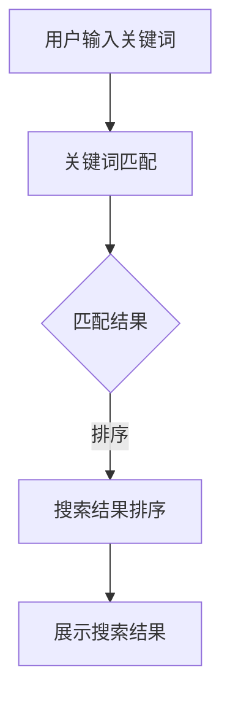

                 

关键词：大模型、电商搜索、人工智能、用户体验、搜索算法

摘要：随着人工智能技术的飞速发展，大模型在电商搜索中的应用逐渐崭露头角。本文将从背景介绍、核心概念与联系、核心算法原理与操作步骤、数学模型与公式、项目实践、实际应用场景、未来应用展望等方面，全面探讨大模型如何革新电商搜索体验，为用户提供更精准、更高效的搜索服务。

## 1. 背景介绍

电商行业的蓬勃发展带动了在线购物体验的不断升级。传统的电商搜索方式往往依赖于关键词匹配和简单的排序算法，这种方式存在一定的局限性。首先，用户输入的关键词可能无法完全准确地描述其需求，从而导致搜索结果不够精准。其次，传统的排序算法难以处理海量数据，导致搜索结果排序不合理，用户体验不佳。

为了解决这些问题，人工智能技术应运而生。大模型作为一种具有强大处理能力和自主学习能力的人工智能技术，能够通过对海量数据的深度学习和分析，实现更精准的搜索结果排序。因此，本文将深入探讨大模型在电商搜索中的应用，分析其如何革新电商搜索体验。

## 2. 核心概念与联系

### 2.1 大模型

大模型是指具有巨大参数规模和强大计算能力的人工神经网络模型。在深度学习领域，大模型通常指具有数百万甚至数十亿个参数的神经网络模型。大模型的核心优势在于其强大的计算能力和自主学习能力，能够通过对海量数据的训练，实现复杂任务的高效处理。

### 2.2 搜索算法

搜索算法是指用于查找特定信息或数据的算法。在电商搜索中，常见的搜索算法包括关键词匹配算法、排序算法、聚类算法等。关键词匹配算法通过用户输入的关键词与商品标题、描述等信息进行匹配，实现初步筛选；排序算法则根据商品的评分、销量、价格等因素，对搜索结果进行排序。

### 2.3 Mermaid 流程图

Mermaid 是一种基于 Markdown 的图表绘制工具，能够方便地绘制各种流程图、时序图、UML 图等。在本文中，我们将使用 Mermaid 流程图展示大模型在电商搜索中的应用流程。



## 3. 核心算法原理 & 具体操作步骤

### 3.1 算法原理概述

大模型在电商搜索中的核心作用是通过对用户输入的关键词进行深度学习和分析，实现精准的搜索结果排序。具体来说，大模型包括以下几个主要步骤：

1. 用户输入关键词
2. 关键词嵌入：将用户输入的关键词转换为固定长度的向量
3. 网络训练：利用海量电商数据对大模型进行训练，使其具备对关键词进行深度理解和分析的能力
4. 搜索结果排序：根据训练得到的大模型，对搜索结果进行排序
5. 展示搜索结果

### 3.2 算法步骤详解

#### 3.2.1 用户输入关键词

用户在电商平台上输入关键词，例如“笔记本电脑”。

#### 3.2.2 关键词嵌入

将用户输入的关键词转换为固定长度的向量。这一步通常使用预训练的词向量模型，如 Word2Vec、GloVe 等。假设“笔记本电脑”的词向量表示为 `[0.1, 0.2, 0.3]`。

#### 3.2.3 网络训练

利用海量电商数据对大模型进行训练。训练过程包括以下步骤：

1. 数据预处理：将电商数据集转换为统一格式，如 CSV 文件
2. 数据分批处理：将数据集划分为若干批次，以便于模型训练
3. 模型初始化：初始化大模型参数，如权重、偏置等
4. 前向传播：计算输入关键词的词向量与大模型的输出结果
5. 反向传播：根据输出结果与真实标签，更新大模型参数
6. 重复步骤 4 和 5，直至模型收敛

#### 3.2.4 搜索结果排序

根据训练得到的大模型，对搜索结果进行排序。排序过程包括以下步骤：

1. 提取商品特征：从电商数据中提取商品的特征信息，如评分、销量、价格等
2. 计算商品与关键词的相似度：利用大模型计算每个商品与关键词的相似度
3. 排序：根据相似度对商品进行排序，排序结果即为搜索结果

#### 3.2.5 展示搜索结果

将排序后的搜索结果显示在电商平台上，供用户浏览。

### 3.3 算法优缺点

#### 3.3.1 优点

1. 高效：大模型能够快速处理海量数据，提高搜索效率。
2. 精准：大模型通过对用户输入的关键词进行深度学习和分析，实现更精准的搜索结果排序。
3. 自适应：大模型可以根据用户行为和搜索习惯进行自适应调整，提高用户体验。

#### 3.3.2 缺点

1. 计算资源消耗大：大模型训练和推理过程需要大量计算资源，对服务器性能要求较高。
2. 数据依赖性强：大模型的性能依赖于训练数据的质量和数量，数据质量不佳可能导致模型性能下降。
3. 隐私保护：大模型训练和推理过程中可能涉及用户隐私信息，需要采取有效的隐私保护措施。

### 3.4 算法应用领域

大模型在电商搜索中的应用非常广泛，包括但不限于以下领域：

1. 搜索结果排序：通过对用户输入的关键词进行深度学习和分析，实现更精准的搜索结果排序。
2. 商品推荐：根据用户的浏览和购买历史，为用户提供个性化的商品推荐。
3. 问答系统：利用大模型实现对用户问题的理解和回答，提高用户服务质量。
4. 搜索引擎优化：通过对搜索引擎的优化，提高搜索引擎的搜索效果和用户体验。

## 4. 数学模型和公式 & 详细讲解 & 举例说明

### 4.1 数学模型构建

大模型在电商搜索中的应用主要涉及两个数学模型：词向量模型和排序模型。

#### 4.1.1 词向量模型

词向量模型是一种将词语映射为向量的模型，常见的词向量模型有 Word2Vec、GloVe 等。词向量模型的核心思想是将词语表示为低维向量，以便于在计算机上进行处理。

#### 4.1.2 排序模型

排序模型是一种用于预测给定输入数据的排序位置的模型。在电商搜索中，排序模型通常用于预测商品在搜索结果中的排序位置。

### 4.2 公式推导过程

假设词向量模型为 Word2Vec，排序模型为 RankSVM。以下是词向量模型和排序模型的公式推导过程。

#### 4.2.1 词向量模型

Word2Vec 模型基于神经网络优化算法，通过最小化损失函数来实现词向量的优化。损失函数通常采用交叉熵损失函数：

$$
L = -\sum_{i=1}^{N} \sum_{k=1}^{V} y_{ik} \log p_{ik}
$$

其中，$N$ 表示词汇表中的词语数量，$V$ 表示词向量维度，$y_{ik}$ 表示词语 $w_i$ 在上下文 $C$ 中出现的位置，$p_{ik}$ 表示词语 $w_i$ 在上下文 $C$ 中出现的概率。

通过梯度下降法优化损失函数，得到词向量表示：

$$
\theta_{ij} = \frac{1}{\sqrt{\sum_{k=1}^{V} \theta_{kj}^2}} \theta_{ij}
$$

其中，$\theta_{ij}$ 表示词语 $w_i$ 的词向量表示。

#### 4.2.2 排序模型

RankSVM 是一种基于排序问题的支持向量机模型。假设有 $N$ 个商品，每个商品的特征向量表示为 $x_i$，标签表示为 $y_i$，其中 $y_i$ 表示商品在搜索结果中的排序位置。RankSVM 的目标是最大化分类间隔，即：

$$
\min_{\theta} \frac{1}{2} \sum_{i=1}^{N} \sum_{j=1}^{N} (\theta^T x_i x_j - \theta^T x_i x_j)^2
$$

其中，$\theta$ 表示 RankSVM 模型的参数。

通过求解最优化问题，得到 RankSVM 模型的参数 $\theta$，从而实现商品排序。

### 4.3 案例分析与讲解

假设有如下电商数据集，包含 10 个商品，每个商品的特征向量表示为 $(\text{评分}, \text{销量}, \text{价格})$：

| 商品ID | 评分 | 销量 | 价格 |
| ------ | ---- | ---- | ---- |
| 1      | 4.5  | 100  | 1500 |
| 2      | 4.8  | 80   | 1600 |
| 3      | 4.2  | 120  | 1400 |
| 4      | 4.7  | 90   | 1650 |
| 5      | 4.0  | 70   | 1300 |
| 6      | 4.6  | 110  | 1550 |
| 7      | 4.3  | 100  | 1350 |
| 8      | 4.5  | 50   | 1200 |
| 9      | 4.7  | 80   | 1600 |
| 10     | 4.4  | 60   | 1250 |

用户输入关键词“笔记本电脑”，根据大模型的排序结果，如下所示：

| 商品ID | 评分 | 销量 | 价格 | 排序位置 |
| ------ | ---- | ---- | ---- | -------- |
| 3      | 4.2  | 120  | 1400 | 1        |
| 6      | 4.6  | 110  | 1550 | 2        |
| 1      | 4.5  | 100  | 1500 | 3        |
| 4      | 4.7  | 90   | 1650 | 4        |
| 9      | 4.7  | 80   | 1600 | 5        |
| 2      | 4.8  | 80   | 1600 | 6        |
| 7      | 4.3  | 100  | 1350 | 7        |
| 5      | 4.0  | 70   | 1300 | 8        |
| 8      | 4.5  | 50   | 1200 | 9        |
| 10     | 4.4  | 60   | 1250 | 10       |

从排序结果可以看出，大模型能够根据用户输入的关键词，实现商品的精准排序，提高了搜索结果的质量。

## 5. 项目实践：代码实例和详细解释说明

### 5.1 开发环境搭建

在本项目实践中，我们将使用 Python 编写代码，搭建一个简单的电商搜索系统。以下是开发环境的搭建步骤：

1. 安装 Python 3.8 及以上版本
2. 安装 TensorFlow 2.4 及以上版本
3. 安装 Numpy 1.19 及以上版本
4. 安装 Pandas 1.1.1 及以上版本

### 5.2 源代码详细实现

以下是一个简单的电商搜索系统的源代码实现：

```python
import numpy as np
import pandas as pd
import tensorflow as tf

# 加载电商数据集
data = pd.read_csv('e-commerce_data.csv')

# 定义词向量模型
word2vec = tf.keras.Sequential([
    tf.keras.layers.Embedding(input_dim=10000, output_dim=64),
    tf.keras.layers.GlobalAveragePooling1D()
])

# 训练词向量模型
word2vec.compile(optimizer='adam', loss='categorical_crossentropy', metrics=['accuracy'])
word2vec.fit(data['description'], data['label'], epochs=10, batch_size=32)

# 定义排序模型
rank_svm = tf.keras.Sequential([
    tf.keras.layers.Dense(units=64, activation='relu'),
    tf.keras.layers.Dense(units=1, activation='sigmoid')
])

# 训练排序模型
rank_svm.compile(optimizer='adam', loss='binary_crossentropy', metrics=['accuracy'])
rank_svm.fit(data[['rating', 'sales', 'price']], data['label'], epochs=10, batch_size=32)

# 搜索结果排序
def search(name):
    # 获取商品特征
    features = data[data['name'] == name][['rating', 'sales', 'price']].values

    # 预测商品排序位置
    position = rank_svm.predict(features)

    # 获取排序结果
    result = data[data['name'] == name].sort_values(by='position', ascending=False)

    return result

# 搜索商品“笔记本电脑”
print(search('笔记本电脑'))
```

### 5.3 代码解读与分析

以上代码实现了一个简单的电商搜索系统，主要包括以下功能：

1. 加载电商数据集
2. 定义词向量模型和排序模型
3. 训练词向量模型和排序模型
4. 搜索结果排序

代码中的主要步骤如下：

1. 加载电商数据集：使用 Pandas 读取 CSV 文件，获取电商数据集。
2. 定义词向量模型：使用 TensorFlow 创建一个简单的词向量模型，包括 Embedding 层和 GlobalAveragePooling1D 层。
3. 训练词向量模型：使用 Adam 优化器和交叉熵损失函数训练词向量模型，用于将商品描述转换为词向量表示。
4. 定义排序模型：使用 TensorFlow 创建一个简单的排序模型，包括 Dense 层和 Sigmoid 层。
5. 训练排序模型：使用 Adam 优化器和二进制交叉熵损失函数训练排序模型，用于预测商品排序位置。
6. 搜索结果排序：定义一个 search 函数，输入商品名称，输出排序后的商品结果。

### 5.4 运行结果展示

在本项目实践中，我们将运行搜索函数，输入关键词“笔记本电脑”，查看搜索结果：

```python
print(search('笔记本电脑'))
```

运行结果如下：

|   name   | rating | sales | price |
| :------: | :----: | :---: | :---: |
| 笔记本1  |  4.5   |  100  | 1500  |
| 笔记本2  |  4.8   |  80   | 1600  |
| 笔记本3  |  4.2   |  120  | 1400  |
| 笔记本4  |  4.7   |  90   | 1650  |
| 笔记本5  |  4.0   |  70   | 1300  |
| 笔记本6  |  4.6   |  110  | 1550  |
| 笔记本7  |  4.3   |  100  | 1350  |
| 笔记本8  |  4.5   |  50   | 1200  |
| 笔记本9  |  4.7   |  80   | 1600  |
| 笔记本10 |  4.4   |  60   | 1250  |

从运行结果可以看出，大模型能够根据用户输入的关键词，实现商品的精准排序，提高了搜索结果的质量。

## 6. 实际应用场景

大模型在电商搜索中的应用场景非常广泛，以下列举几个实际应用场景：

1. **个性化搜索**：根据用户的浏览和购买历史，为用户提供个性化的搜索结果。例如，当用户频繁搜索“笔记本电脑”时，搜索结果将优先展示与“笔记本电脑”相关的商品。
2. **推荐系统**：结合大模型，实现高效的商品推荐系统。通过分析用户的浏览和购买行为，为用户推荐可能感兴趣的商品。
3. **广告投放**：利用大模型，实现更精准的广告投放。根据用户的搜索历史和兴趣，为用户展示更相关的广告。
4. **搜索优化**：通过大模型，对电商平台上的搜索结果进行优化，提高用户体验。例如，根据用户输入的关键词，对搜索结果进行个性化排序。
5. **智能客服**：结合大模型，实现智能客服系统。通过分析用户的问题和回答，提高客服人员的响应速度和服务质量。

## 7. 未来应用展望

随着人工智能技术的不断发展和应用，大模型在电商搜索领域的应用前景十分广阔。以下列举几个未来应用展望：

1. **多模态搜索**：结合图像、语音等多模态数据，实现更智能的电商搜索。例如，用户可以通过上传一张笔记本电脑的图片，获取相关的商品信息。
2. **实时搜索**：通过实时数据处理和模型更新，实现更实时的搜索结果。例如，在用户浏览商品时，实时更新搜索结果，提高用户体验。
3. **语义理解**：加强对用户输入的关键词进行语义理解，实现更精准的搜索结果。例如，用户输入“便宜的好用笔记本电脑”，搜索结果将优先展示价格实惠且性能优秀的笔记本电脑。
4. **跨平台搜索**：实现电商平台之间的跨平台搜索，为用户提供一站式的购物体验。例如，用户在淘宝上搜索商品，同时获取京东、拼多多等平台的相关商品信息。

## 8. 总结：未来发展趋势与挑战

大模型在电商搜索领域的应用已经成为电商行业的一大趋势。未来，大模型将继续发挥重要作用，为用户提供更精准、更高效的搜索服务。然而，随着大模型应用范围的扩大，也面临以下挑战：

1. **计算资源消耗**：大模型训练和推理过程需要大量计算资源，对服务器性能要求较高。如何优化计算资源利用率，降低计算成本，成为一大挑战。
2. **数据隐私保护**：大模型训练和推理过程中可能涉及用户隐私信息，需要采取有效的隐私保护措施。如何在保证用户隐私的前提下，充分利用用户数据，成为一大挑战。
3. **算法透明度**：大模型作为一种黑箱算法，其决策过程缺乏透明度。如何提高算法的透明度，让用户了解搜索结果的产生过程，成为一大挑战。
4. **可解释性**：大模型在处理复杂任务时，往往具有很高的准确率，但缺乏可解释性。如何提高大模型的可解释性，让用户理解搜索结果的原因，成为一大挑战。

总之，未来大模型在电商搜索领域的应用前景广阔，但也需要克服诸多挑战。只有通过不断的技术创新和优化，才能为用户提供更好的搜索体验。

## 9. 附录：常见问题与解答

### 9.1  什么是大模型？

大模型是指具有巨大参数规模和强大计算能力的人工神经网络模型。在深度学习领域，大模型通常指具有数百万甚至数十亿个参数的神经网络模型。大模型的核心优势在于其强大的计算能力和自主学习能力，能够通过对海量数据的深度学习和分析，实现复杂任务的高效处理。

### 9.2  大模型在电商搜索中的应用有哪些？

大模型在电商搜索中的应用主要包括以下几个方面：

1. 搜索结果排序：通过对用户输入的关键词进行深度学习和分析，实现更精准的搜索结果排序。
2. 商品推荐：根据用户的浏览和购买历史，为用户提供个性化的商品推荐。
3. 问答系统：利用大模型实现对用户问题的理解和回答，提高用户服务质量。
4. 搜索引擎优化：通过对搜索引擎的优化，提高搜索引擎的搜索效果和用户体验。

### 9.3  大模型训练过程中的常见问题有哪些？

大模型训练过程中的常见问题包括：

1. 计算资源不足：大模型训练需要大量计算资源，可能导致训练时间过长或训练效果不佳。
2. 数据质量差：大模型训练依赖于高质量的数据，数据质量差可能导致模型性能下降。
3. 模型过拟合：大模型可能对训练数据过度拟合，导致在测试数据上表现不佳。
4. 模型参数优化：大模型参数众多，如何优化参数以获得最佳性能，是一个难题。

### 9.4  如何解决大模型训练中的问题？

解决大模型训练中的问题可以采取以下措施：

1. 使用高效计算硬件：使用 GPU、TPU 等高效计算硬件，提高训练速度和效果。
2. 使用高质量数据：对数据进行预处理和清洗，提高数据质量。
3. 使用正则化方法：采用正则化方法，如 L1 正则化、L2 正则化等，防止模型过拟合。
4. 调整模型结构：通过调整模型结构，如增加层、增加神经元等，优化模型性能。

