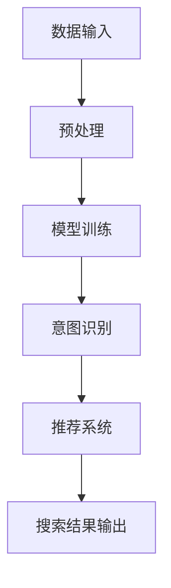

                 

关键词：大模型、电商搜索、用户体验、算法优化、深度学习

> 摘要：本文将深入探讨大模型在电商搜索领域的应用及其对用户体验的革新，通过分析大模型的核心概念、算法原理、数学模型以及实际应用场景，展望大模型在未来电商搜索领域的发展趋势与挑战。

## 1. 背景介绍

随着互联网技术的迅猛发展，电商行业已经成为全球经济发展的重要驱动力。电商平台的用户规模和交易量不断增长，如何提升用户搜索体验成为了各大电商平台关注的焦点。传统的电商搜索算法主要依赖于关键词匹配和相关性排序，但这种模式在处理用户个性化需求、理解用户意图方面存在很大局限。随着深度学习技术的兴起，大模型逐渐成为一种有效的解决方案，为电商搜索提供了新的思路和可能性。

## 2. 核心概念与联系

### 2.1 大模型的概念

大模型通常指的是参数量庞大的深度神经网络，如GPT、BERT等。这些模型通过学习海量数据，能够捕捉到数据的复杂模式和内在规律，从而在多种任务中表现出色。

### 2.2 大模型与电商搜索的关系

大模型能够通过理解用户的搜索意图和偏好，提供更加个性化的搜索结果，从而提升用户体验。具体来说，大模型在电商搜索中的应用主要体现在以下几个方面：

- **意图识别**：通过分析用户输入的搜索关键词，大模型能够理解用户的真实意图，从而提供更符合用户需求的搜索结果。
- **推荐系统**：大模型能够基于用户的历史行为和偏好，提供个性化的商品推荐，提升用户在平台上的停留时间和购买转化率。
- **自然语言处理**：大模型在处理用户评论、商品描述等方面具有强大的语义理解能力，能够为用户提供更准确的信息筛选和推荐。

### 2.3 大模型架构的 Mermaid 流程图



## 3. 核心算法原理 & 具体操作步骤

### 3.1 算法原理概述

大模型在电商搜索中的应用主要基于深度学习和自然语言处理技术。具体来说，包括以下几个关键步骤：

- **数据预处理**：对用户搜索关键词、商品信息等进行预处理，如分词、去噪等。
- **模型训练**：利用预处理后的数据对大模型进行训练，使其能够理解用户的搜索意图和偏好。
- **意图识别**：通过模型对用户输入的搜索关键词进行分析，识别出用户的真实意图。
- **推荐系统**：基于意图识别结果和用户历史行为，生成个性化的商品推荐。
- **搜索结果输出**：将推荐结果呈现给用户，提升用户的搜索体验。

### 3.2 算法步骤详解

1. **数据预处理**：
   - **分词**：将用户输入的搜索关键词进行分词，如“笔记本电脑”分为“笔记本”和“电脑”。
   - **去噪**：去除关键词中的噪声信息，如特殊字符、停用词等。

2. **模型训练**：
   - **数据集准备**：收集大量用户搜索数据和商品信息，构建训练数据集。
   - **模型构建**：使用深度学习框架（如TensorFlow、PyTorch）构建大模型，包括输入层、隐藏层和输出层。

3. **意图识别**：
   - **特征提取**：对用户输入的搜索关键词进行特征提取，如词频、词嵌入等。
   - **分类器训练**：使用特征提取结果对分类器进行训练，识别用户意图。

4. **推荐系统**：
   - **用户画像构建**：基于用户历史行为和偏好，构建用户画像。
   - **推荐算法**：使用用户画像和商品信息，生成个性化的商品推荐。

5. **搜索结果输出**：
   - **结果排序**：根据用户意图和推荐结果，对搜索结果进行排序。
   - **结果展示**：将排序后的搜索结果呈现给用户。

### 3.3 算法优缺点

**优点**：

- **提升用户体验**：通过理解用户意图和偏好，提供个性化的搜索结果，提升用户满意度。
- **降低运营成本**：大模型能够自动处理大量数据，降低人工干预和运营成本。

**缺点**：

- **计算资源消耗**：大模型需要大量计算资源进行训练和推理，对硬件设施要求较高。
- **数据隐私问题**：在处理用户数据时，需要确保用户隐私不受侵犯。

### 3.4 算法应用领域

大模型在电商搜索领域的应用不仅限于搜索结果优化，还可以扩展到以下领域：

- **智能客服**：利用大模型进行自然语言处理，提升客服机器人与用户的交互体验。
- **商品推荐**：通过大模型分析用户行为和偏好，提供个性化的商品推荐。
- **广告投放**：利用大模型对用户进行精准广告投放，提高广告效果。

## 4. 数学模型和公式 & 详细讲解 & 举例说明

### 4.1 数学模型构建

大模型的数学模型主要基于深度学习，包括以下几个关键组件：

- **输入层**：接收用户输入的搜索关键词，进行特征提取。
- **隐藏层**：通过神经网络结构对特征进行变换和组合。
- **输出层**：输出用户意图分类结果和推荐结果。

### 4.2 公式推导过程

假设我们有一个深度神经网络，其输入为$x$，输出为$y$，其中$x$和$y$均为向量。神经网络的计算过程可以表示为：

$$
y = f(Wx + b)
$$

其中，$W$为权重矩阵，$b$为偏置向量，$f$为激活函数。常见的激活函数包括：

- **Sigmoid函数**：$f(x) = \frac{1}{1 + e^{-x}}$
- **ReLU函数**：$f(x) = max(0, x)$
- **Tanh函数**：$f(x) = \frac{e^x - e^{-x}}{e^x + e^{-x}}$

### 4.3 案例分析与讲解

以一个简单的电商搜索场景为例，我们假设用户输入关键词“笔记本电脑”，大模型需要识别用户的意图并推荐相关商品。

1. **数据预处理**：

   - **分词**：将关键词“笔记本电脑”分为“笔记本”和“电脑”。
   - **去噪**：去除关键词中的噪声信息，如特殊字符。

2. **模型训练**：

   - **数据集准备**：收集大量用户搜索数据和商品信息，构建训练数据集。
   - **模型构建**：使用深度学习框架构建大模型，包括输入层、隐藏层和输出层。

3. **意图识别**：

   - **特征提取**：对用户输入的搜索关键词进行特征提取，如词频、词嵌入等。
   - **分类器训练**：使用特征提取结果对分类器进行训练，识别用户意图。

4. **推荐系统**：

   - **用户画像构建**：基于用户历史行为和偏好，构建用户画像。
   - **推荐算法**：使用用户画像和商品信息，生成个性化的商品推荐。

5. **搜索结果输出**：

   - **结果排序**：根据用户意图和推荐结果，对搜索结果进行排序。
   - **结果展示**：将排序后的搜索结果呈现给用户。

## 5. 项目实践：代码实例和详细解释说明

### 5.1 开发环境搭建

1. 安装Python环境，版本要求为3.6及以上。
2. 安装TensorFlow和PyTorch深度学习框架。

### 5.2 源代码详细实现

以下是一个简单的电商搜索大模型实现示例：

```python
import tensorflow as tf
from tensorflow.keras.models import Sequential
from tensorflow.keras.layers import Dense, Embedding, LSTM

# 模型构建
model = Sequential([
    Embedding(input_dim=vocabulary_size, output_dim=embedding_size),
    LSTM(units=128),
    Dense(units=num_classes, activation='softmax')
])

# 编译模型
model.compile(optimizer='adam', loss='categorical_crossentropy', metrics=['accuracy'])

# 模型训练
model.fit(x_train, y_train, epochs=10, batch_size=32)
```

### 5.3 代码解读与分析

1. **模型构建**：使用Sequential模型堆叠Embedding层、LSTM层和Dense层。
2. **编译模型**：设置优化器、损失函数和评价指标。
3. **模型训练**：使用训练数据集进行模型训练。

### 5.4 运行结果展示

在训练完成后，我们可以使用测试数据集评估模型性能，并展示搜索结果。

```python
# 模型评估
loss, accuracy = model.evaluate(x_test, y_test)

# 搜索结果输出
predictions = model.predict(x_test[:10])
```

## 6. 实际应用场景

大模型在电商搜索领域的应用已经取得了显著成果。以下是一些实际应用场景：

1. **搜索结果优化**：通过大模型对用户输入的搜索关键词进行分析，提供更加精准的搜索结果。
2. **商品推荐**：利用大模型分析用户行为和偏好，提供个性化的商品推荐。
3. **广告投放**：通过大模型对用户进行精准广告投放，提高广告效果。

## 7. 未来应用展望

随着大模型技术的不断发展，未来电商搜索领域将出现以下趋势：

1. **智能化程度提升**：大模型将更加深入地理解用户需求，提供更加智能化的搜索和推荐服务。
2. **多模态融合**：结合图像、语音等多模态数据，进一步提升大模型的应用范围和效果。
3. **个性化定制**：基于用户画像和偏好，实现更加个性化的电商搜索和推荐服务。

## 8. 总结：未来发展趋势与挑战

大模型在电商搜索领域具有巨大的发展潜力，但仍面临以下挑战：

1. **数据隐私**：在处理用户数据时，需要确保用户隐私不受侵犯。
2. **计算资源**：大模型需要大量计算资源进行训练和推理，对硬件设施要求较高。
3. **模型解释性**：大模型的决策过程较为复杂，提高模型的解释性是一个重要的研究方向。

未来，随着技术的不断进步，大模型在电商搜索领域的应用将越来越广泛，为用户提供更加优质的搜索和推荐服务。

## 9. 附录：常见问题与解答

### 9.1 如何处理用户隐私问题？

在处理用户数据时，应遵循以下原则：

- **最小化数据收集**：仅收集必要的数据，避免过度收集。
- **数据加密**：对用户数据进行加密存储和传输。
- **数据匿名化**：对用户数据进行匿名化处理，避免直接关联到具体用户。

### 9.2 大模型训练需要大量计算资源，如何优化计算效率？

以下是一些优化计算效率的方法：

- **分布式训练**：利用多台服务器进行分布式训练，提高训练速度。
- **模型压缩**：通过模型压缩技术，降低模型的计算复杂度。
- **GPU加速**：利用GPU进行模型训练和推理，提高计算速度。

### 9.3 大模型的性能评估指标有哪些？

大模型的性能评估指标包括：

- **准确率**：预测结果与真实标签的一致性。
- **召回率**：预测结果中包含真实标签的比例。
- **F1值**：准确率和召回率的加权平均。

### 9.4 大模型在电商搜索中的具体应用场景有哪些？

大模型在电商搜索中的具体应用场景包括：

- **搜索结果优化**：通过大模型对用户输入的搜索关键词进行分析，提供更加精准的搜索结果。
- **商品推荐**：利用大模型分析用户行为和偏好，提供个性化的商品推荐。
- **广告投放**：通过大模型对用户进行精准广告投放，提高广告效果。

---

作者：禅与计算机程序设计艺术 / Zen and the Art of Computer Programming

以上就是对“大模型如何革新电商搜索体验”的深度解析，希望对您有所帮助。在未来的电商搜索领域，大模型将发挥越来越重要的作用，为用户提供更加优质的服务。随着技术的不断进步，我们有理由相信，大模型将带来更多的创新和变革。

