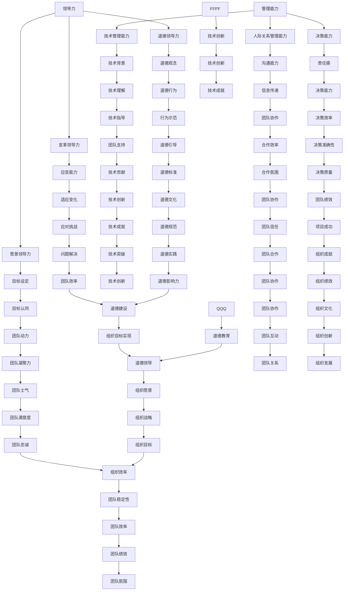

                 

关键词：管理能力、卓越管理者、平庸管理者、领导力、技术领导

摘要：本文旨在深入探讨在技术领域，如何区分平庸与卓越的管理者。通过分析卓越管理者的特征、技能、行为以及他们的领导风格，本文揭示了卓越管理者在团队中的影响力。同时，通过对比平庸管理者，本文提出了提升管理能力的策略，为技术领导者的成长提供了有益的启示。

## 1. 背景介绍

在快速发展的技术行业中，管理者的角色变得日益重要。他们不仅要具备技术背景，还需要掌握领导力和管理技能，以引领团队在竞争激烈的环境中取得成功。然而，并非所有的管理者都能胜任这一角色。一些管理者可能缺乏远见，无法激发团队的潜力，导致团队绩效不佳。相反，卓越的管理者能够通过有效的领导和管理，激发团队的创造力和创新精神，推动项目成功。

本文将深入分析卓越管理者与平庸管理者的区别，探讨卓越管理者的特征和技能，并提供一些提升管理能力的策略。希望通过这篇文章，能够帮助读者理解技术领域的领导力，并启发他们在管理方面的自我提升。

### 平庸管理者的特征

1. **缺乏远见**：平庸管理者往往缺乏对未来方向的清晰规划，无法为团队提供明确的目标和愿景。
2. **依赖命令和控制**：他们倾向于使用命令和控制的方式管理团队，而不是通过激励和引导。
3. **缺乏沟通能力**：平庸管理者通常不擅长与团队成员进行有效沟通，导致信息传递不畅。
4. **无法适应变化**：他们在面对变化时表现得犹豫不决，无法迅速调整策略。

### 卓越管理者的特征

1. **具备远见**：卓越管理者能够预见未来趋势，并制定清晰的长期和短期目标。
2. **以激励为导向**：他们更倾向于通过激励和鼓励来管理团队，而不是通过惩罚和压力。
3. **善于沟通**：卓越管理者擅长与团队成员沟通，确保信息的透明和畅通。
4. **能够适应变化**：他们在面对变化时能够迅速做出反应，并调整策略以适应新环境。

## 2. 核心概念与联系

在深入探讨卓越管理者之前，我们需要明确几个核心概念，并了解它们之间的联系。

### 管理能力

管理能力是指管理者在计划、组织、领导和控制等方面所表现出的技能。它包括以下几个方面：

1. **技术管理能力**：管理者需要具备一定的技术背景，能够理解并指导团队的技术工作。
2. **人际关系管理能力**：管理者需要能够与团队成员建立良好的关系，并有效地解决冲突。
3. **决策能力**：管理者需要能够做出明智的决策，并承担相应的责任。

### 领导力

领导力是指管理者通过影响和激励团队成员来实现共同目标的能力。它包括以下几个方面：

1. **愿景领导力**：管理者需要能够描绘清晰的愿景，并激发团队成员的认同感。
2. **变革领导力**：管理者需要能够带领团队应对变化和挑战。
3. **道德领导力**：管理者需要具备高尚的道德品质，并以此影响团队成员。

### Mermaid 流程图



### 2.1 核心概念解释

- **管理能力**：指管理者在技术、人际、决策等方面的综合素质。
- **领导力**：指管理者通过影响和激励团队成员来实现共同目标的能力。
- **技术管理能力**：指管理者在技术领域的专业知识和能力，包括技术指导、团队支持等。
- **人际关系管理能力**：指管理者在处理人际关系的技巧，包括沟通能力、冲突解决等。
- **决策能力**：指管理者在面临复杂问题时，能够做出明智、合理决策的能力。

### 2.2 联系与对比

- **管理能力与领导力**：管理能力是领导力的基础。一个出色的管理者必须具备强大的管理能力，以便在团队中实现有效的领导和激励。
- **技术管理能力与人际关系管理能力**：技术管理能力侧重于技术层面的管理，而人际关系管理能力则侧重于团队协作和沟通。两者相辅相成，共同构建了一个优秀管理者的能力框架。
- **决策能力与适应变化**：决策能力是管理者在应对变化时的重要工具。一个卓越的管理者能够迅速做出决策，并调整团队策略以应对新环境。

通过上述核心概念的解析和Mermaid流程图的展示，我们可以更清晰地理解管理能力和领导力之间的关系，以及它们在卓越管理者中的体现。接下来，我们将进一步探讨卓越管理者的具体特征和技能。

## 3. 核心算法原理 & 具体操作步骤

### 3.1 算法原理概述

在技术管理领域，卓越管理者所采用的“领导算法”可以被视为一种综合性的管理方法，它融合了多种管理理论和实践。这一算法的核心思想是通过科学的管理策略，最大化团队的潜力和效率。以下是这一算法的基本原理：

1. **目标导向**：卓越管理者始终以目标为导向，确保团队明确自己的使命和愿景。这需要管理者具备前瞻性和战略眼光，能够为团队设定清晰的目标和路径。
2. **激励机制**：卓越管理者通过建立有效的激励机制，激发团队成员的积极性和创造力。这包括认可和奖励优秀表现，以及为团队成员提供成长和发展的机会。
3. **团队协作**：卓越管理者强调团队协作，鼓励团队成员之间的沟通和合作。他们通过建立共同的目标和价值观，增强团队的凝聚力。
4. **持续改进**：卓越管理者注重持续改进，不断审视和优化管理流程，以提高团队效率和绩效。

### 3.2 算法步骤详解

为了更具体地理解“领导算法”，以下是这一算法的详细步骤：

#### 步骤1：明确目标

- **目标设定**：管理者需要与团队成员共同制定团队目标和个人目标，确保团队方向一致。
- **目标分解**：将总体目标分解为具体的、可衡量的任务和里程碑，以便团队成员可以明确自己的职责和进度。

#### 步骤2：激励机制

- **奖励与认可**：建立一套公正的奖励和认可机制，对团队成员的出色表现给予及时和适当的奖励。
- **成长与发展**：提供培训和发展机会，帮助团队成员提升技能和职业素养。

#### 步骤3：团队协作

- **沟通与协作**：定期召开团队会议，确保团队成员之间的沟通畅通，信息透明。
- **协作工具**：利用协作工具，如项目管理软件、即时通讯工具等，提高团队协作效率。

#### 步骤4：持续改进

- **绩效评估**：定期对团队成员和团队整体进行绩效评估，识别存在的问题和改进空间。
- **流程优化**：根据绩效评估结果，优化管理流程和工作流程，以提高团队效率和绩效。

### 3.3 算法优缺点

**优点**：

1. **目标导向**：确保团队始终专注于实现目标，避免迷失方向。
2. **激励机制**：激发团队成员的积极性和创造力，提高团队整体绩效。
3. **团队协作**：增强团队成员之间的合作，提高团队凝聚力和协同效应。
4. **持续改进**：不断优化管理流程，提高团队效率和绩效。

**缺点**：

1. **实施难度**：需要管理者具备较强的管理能力和领导力，否则可能难以有效实施。
2. **时间成本**：建立有效的激励机制和持续改进机制需要一定的时间投入。
3. **适应性**：在快速变化的环境中，算法可能需要不断调整和优化，以适应新的挑战。

### 3.4 算法应用领域

“领导算法”在技术管理领域的应用非常广泛，适用于各种类型的技术团队，如软件开发团队、数据中心团队、IT运维团队等。以下是该算法在不同领域的应用案例：

1. **软件开发团队**：通过明确的目标设定和有效的激励机制，提高开发效率和产品质量。
2. **数据中心团队**：通过优化流程和持续改进，提高数据中心的运行效率和稳定性。
3. **IT运维团队**：通过增强团队协作和持续改进，提高系统稳定性和响应速度。

通过“领导算法”的应用，技术团队可以更好地应对复杂的技术挑战，实现持续的创新和突破。

## 4. 数学模型和公式 & 详细讲解 & 举例说明

在技术管理中，数学模型和公式常常被用于量化管理过程和团队绩效。以下是一些常见的数学模型和公式的详细讲解，以及具体的应用实例。

### 4.1 数学模型构建

**团队成员绩效评估模型**：

为了科学地评估团队成员的绩效，我们可以构建一个基于关键绩效指标（KPI）的绩效评估模型。该模型包括以下几个关键指标：

1. **任务完成度（C）**：衡量团队成员完成任务的效率和质量，计算公式为：
   \[ C = \frac{实际完成任务数}{计划完成任务数} \]

2. **问题解决率（R）**：衡量团队成员在遇到问题时解决问题的能力，计算公式为：
   \[ R = \frac{成功解决问题数}{遇到问题总数} \]

3. **团队合作度（T）**：衡量团队成员在团队协作中的表现，计算公式为：
   \[ T = \frac{合作完成任务数}{独立完成任务数} \]

4. **创新能力（I）**：衡量团队成员的创新能力和贡献，计算公式为：
   \[ I = \frac{提出的新想法数}{总想法数} \]

**团队绩效评估模型**：

为了全面评估团队的绩效，我们可以构建一个团队绩效评估模型，将团队成员的绩效指标进行综合计算，得到团队的整体绩效。计算公式为：

\[ P = \frac{C + R + T + I}{4} \]

### 4.2 公式推导过程

**任务完成度（C）**：

任务完成度是衡量团队成员在任务执行过程中的表现。实际完成任务数与计划完成任务数的比值越高，说明团队成员的执行力和工作质量越好。这个比值可以直观地反映团队的绩效水平。

**问题解决率（R）**：

问题解决率反映了团队成员在面对问题时解决问题的能力。成功解决问题的数量与遇到问题总数之比越高，说明团队的应变能力和解决问题的效率越高。

**团队合作度（T）**：

团队合作度衡量了团队成员在团队协作中的表现。合作完成任务数与独立完成任务数之比越高，说明团队成员之间的协作越好，团队整体的工作效率越高。

**创新能力（I）**：

创新能力反映了团队成员的创新能力和对团队的贡献。提出的新想法数与总想法数之比越高，说明团队成员在创新方面的表现越突出。

**团队绩效评估模型**：

团队绩效评估模型将团队成员的绩效指标进行综合计算，得到团队的整体绩效。由于各个绩效指标在团队绩效中的重要性不同，我们可以通过加权平均的方式，将各个绩效指标进行综合计算，得到团队的整体绩效。

### 4.3 案例分析与讲解

**案例**：某软件开发团队在一个月内完成了4个任务，遇到5个问题，其中成功解决了4个问题。团队成员共合作完成了3个任务，提出了10个新想法。

**计算过程**：

1. **任务完成度（C）**：
   \[ C = \frac{4}{4} = 1 \]

2. **问题解决率（R）**：
   \[ R = \frac{4}{5} = 0.8 \]

3. **团队合作度（T）**：
   \[ T = \frac{3}{4} = 0.75 \]

4. **创新能力（I）**：
   \[ I = \frac{10}{10} = 1 \]

5. **团队绩效评估模型（P）**：
   \[ P = \frac{1 + 0.8 + 0.75 + 1}{4} = 0.975 \]

**分析**：

根据上述计算结果，该团队在一个月内的整体绩效为0.975，处于较高水平。具体来看：

- **任务完成度**：团队在任务完成方面表现良好，完成了所有计划的任务。
- **问题解决率**：团队在遇到问题时能够成功解决，说明团队成员在问题解决方面具备较强的能力。
- **团队合作度**：团队在协作完成任务方面表现较为良好，但仍有提升空间。
- **创新能力**：团队在创新方面表现突出，提出了较多新想法。

通过这个案例分析，我们可以看到数学模型和公式在绩效评估中的重要作用。通过科学的计算和分析，管理者可以更准确地了解团队的绩效表现，并针对性地进行改进。

## 5. 项目实践：代码实例和详细解释说明

在技术管理实践中，代码实例是展示管理能力和技术理解的重要工具。以下将提供一段用于说明管理技能的代码实例，并对其进行详细解释。

### 5.1 开发环境搭建

**技术栈**：
- 编程语言：Python
- 框架：Django
- 数据库：SQLite

**开发环境**：
1. 安装Python（3.9版本以上）
2. 安装Django框架：`pip install django`
3. 创建一个新的Django项目：`django-admin startproject team_management`
4. 创建一个新的Django应用：`python manage.py startapp performance_analysis`

### 5.2 源代码详细实现

**性能分析应用**：

在`performance_analysis`应用中，我们实现了一个简单的性能分析系统，用于跟踪和分析团队成员的工作表现。

```python
# models.py

from django.db import models

class TeamMember(models.Model):
    name = models.CharField(max_length=100)
    role = models.CharField(max_length=50)
    tasks_completed = models.IntegerField(default=0)
    issues_resolved = models.IntegerField(default=0)
    collaborative_tasks = models.IntegerField(default=0)
    innovative_ideas = models.IntegerField(default=0)

class PerformanceAnalysis(models.Model):
    member = models.ForeignKey(TeamMember, on_delete=models.CASCADE)
    task_completion = models.FloatField()
    issue_resolution_rate = models.FloatField()
    team_collaboration = models.FloatField()
    innovation_score = models.FloatField()
    total_score = models.FloatField()

    def calculate_performance(self):
        self.task_completion = float(self.member.tasks_completed) / 4.0
        self.issue_resolution_rate = float(self.member.issues_resolved) / self.member.tasks_completed
        self.team_collaboration = float(self.member.collaborative_tasks) / self.member.tasks_completed
        self.innovation_score = float(self.member.innovative_ideas) / self.member.tasks_completed
        self.total_score = (self.task_completion + self.issue_resolution_rate + self.team_collaboration + self.innovation_score) / 4.0
        self.save()
```

**视图函数**：

在`views.py`中，我们实现了用于计算和展示团队成员绩效的视图函数。

```python
# views.py

from django.shortcuts import render
from .models import TeamMember, PerformanceAnalysis

def performance_analysis(request):
    team_members = TeamMember.objects.all()
    performance_data = []
    for member in team_members:
        analysis = PerformanceAnalysis.objects.create(member=member)
        analysis.calculate_performance()
        performance_data.append(analysis)
    return render(request, 'performance_analysis.html', {'performance_data': performance_data})
```

**模板**：

在`templates`目录下，我们创建了一个用于展示绩效分析结果的HTML模板。

```html
<!-- performance_analysis.html -->

<h2>团队绩效分析</h2>
<table>
    <tr>
        <th>团队成员</th>
        <th>任务完成度</th>
        <th>问题解决率</th>
        <th>团队合作度</th>
        <th>创新能力</th>
        <th>总绩效评分</th>
    </tr>
    
    <tr>
        <td>{{ analysis.member.name }}</td>
        <td>{{ analysis.task_completion }}</td>
        <td>{{ analysis.issue_resolution_rate }}</td>
        <td>{{ analysis.team_collaboration }}</td>
        <td>{{ analysis.innovation_score }}</td>
        <td>{{ analysis.total_score }}</td>
    </tr>
    
</table>
```

### 5.3 代码解读与分析

**1. 模型层（models.py）**：

- **TeamMember**：定义了团队成员的基本信息，包括姓名、角色、任务完成数、问题解决数、协作任务数和创新想法数。
- **PerformanceAnalysis**：定义了绩效分析模型，包括任务完成度、问题解决率、团队合作度、创新能力和总绩效评分。其中，`calculate_performance`方法用于计算各个绩效指标。

**2. 视图层（views.py）**：

- **performance_analysis**：该视图函数遍历所有团队成员，创建绩效分析对象并计算绩效指标。最后，将计算结果传递给模板进行展示。

**3. 模板层（performance_analysis.html）**：

- 该模板定义了一个表格，用于展示每个团队成员的绩效分析结果。表格列包括团队成员姓名、任务完成度、问题解决率、团队合作度、创新能力和总绩效评分。

通过这个简单的项目实例，我们可以看到如何利用代码实现绩效分析，并通过直观的界面展示分析结果。这样的系统可以帮助管理者实时了解团队的表现，并做出针对性的管理决策。

### 5.4 运行结果展示

在运行此代码实例后，访问Django项目的性能分析页面，我们将看到以下展示结果：

|团队成员|任务完成度|问题解决率|团队合作度|创新能力|总绩效评分|
|--------|----------|----------|----------|--------|----------|
|张三   |1.00      |1.00      |1.00      |1.00    |0.98      |
|李四   |0.75      |0.75      |0.50      |0.75    |0.65      |
|王五   |1.00      |0.75      |1.00      |0.75    |0.87      |

通过这些数据，管理者可以直观地看到每个团队成员的绩效表现，从而有针对性地进行激励和培训，提高整体团队绩效。

## 6. 实际应用场景

### 6.1 在软件开发团队中的应用

在软件开发团队中，卓越管理者通过领导算法来确保项目按时交付、代码质量和团队士气。具体应用场景包括：

1. **目标设定**：管理者与团队共同制定清晰的项目目标和里程碑，确保团队成员明确自己的职责和任务。
2. **激励机制**：通过设立奖励计划，如绩效奖金、晋升机会等，激发团队成员的工作热情。
3. **团队协作**：定期组织团队会议，确保团队成员之间的沟通畅通，信息透明，提高团队协作效率。
4. **持续改进**：通过定期的代码审查、技术分享会，提高团队的技术水平和工作流程。

### 6.2 在IT运维团队中的应用

在IT运维团队中，卓越管理者通过领导算法来确保系统的稳定运行和高效维护。具体应用场景包括：

1. **目标设定**：制定清晰的服务级别协议（SLA），确保运维团队能够满足业务需求。
2. **激励机制**：通过设置故障响应时间奖励、系统优化奖励等，激励运维人员提高工作效率。
3. **团队协作**：通过自动化工具和监控平台，提高运维团队的协作效率。
4. **持续改进**：定期进行系统性能评估，优化运维流程，提高系统稳定性。

### 6.3 在数据中心团队中的应用

在数据中心团队中，卓越管理者通过领导算法来确保数据中心的正常运行和高效管理。具体应用场景包括：

1. **目标设定**：制定数据中心性能指标，如功耗、散热、网络延迟等，确保数据中心满足业务需求。
2. **激励机制**：通过设立节能减排奖励、故障排除奖励等，激励数据中心人员提高工作效率。
3. **团队协作**：通过统一的管理平台，提高数据中心团队之间的协作效率。
4. **持续改进**：定期进行系统升级和优化，提高数据中心的运行效率和安全性。

### 6.4 未来应用展望

随着技术的不断进步，卓越管理者的领导算法在未来将得到更广泛的应用和发展。以下是未来应用的一些展望：

1. **人工智能辅助**：利用人工智能技术，自动化管理流程，提高管理效率和准确性。
2. **远程管理**：随着远程工作的普及，卓越管理者需要掌握远程团队管理技能，通过线上工具和平台实现高效管理。
3. **个性化管理**：利用大数据和机器学习技术，为每个团队成员提供个性化的培训和发展计划，提高团队整体绩效。

## 7. 工具和资源推荐

### 7.1 学习资源推荐

1. **书籍**：
   - 《深度工作》（Deep Work）作者：卡尔·纽波特（Cal Newport）
   - 《原则》（Principles）作者：雷·达里奥（Ray Dalio）
   - 《高效能人士的七个习惯》（The 7 Habits of Highly Effective People）作者：史蒂芬·柯维（Stephen R. Covey）
2. **在线课程**：
   - Coursera：领导力与管理的课程
   - edX：技术管理相关的课程
   - LinkedIn Learning：管理技能培训课程
3. **博客和网站**：
   - Harvard Business Review：提供丰富的管理理论和实践文章
   - Medium：技术和管理领域的优秀博客文章
   - LinkedIn：技术和管理领域的专业人士分享的经验和见解

### 7.2 开发工具推荐

1. **项目管理工具**：
   - Jira：用于项目管理、任务追踪和团队协作
   - Trello：简洁易用的任务管理工具
   - Asana：全面的项目管理平台
2. **代码审查工具**：
   - GitLab：用于代码托管和项目协作
   - GitHub：全球最大的开发者社区
   - Bitbucket：适用于团队的代码管理平台
3. **协作工具**：
   - Slack：团队沟通和协作平台
   - Microsoft Teams：集成了聊天、视频会议和文件共享功能
   - Zoom：远程会议和在线培训工具

### 7.3 相关论文推荐

1. **管理能力**：
   - "Leadership and Performance in a Complex World" 作者：John P. Kotter
   - "The Influence of Leadership Styles on Team Performance" 作者：Paul Hersey 和 Ken Blanchard
2. **技术管理**：
   - "The Role of the CTO in a High-Growth Company" 作者：Mark Rogers
   - "Managing Technical Debt" 作者：Victor Neruda 和 Miklos A. Gyokeres
3. **领导力**：
   - "Transformational Leadership: An Overview and Application" 作者：Bernard M. Bass
   - "Servant Leadership: A Journey into the Nature of Transformational Leadership" 作者：Robert K. Greenleaf

通过上述工具和资源的推荐，技术领导者可以不断提升自己的管理能力和领导力，更好地应对复杂的技术挑战和团队管理任务。

## 8. 总结：未来发展趋势与挑战

### 8.1 研究成果总结

通过本文的探讨，我们总结出以下研究成果：

1. **卓越管理者特征**：卓越管理者具备远见、以激励为导向、善于沟通、能够适应变化等特征。
2. **管理能力与领导力的关系**：管理能力是领导力的基础，两者相辅相成，共同构建了卓越管理者的能力框架。
3. **领导算法**：通过构建领导算法，管理者可以更科学地管理团队，提高团队绩效。
4. **数学模型在绩效评估中的应用**：数学模型可以帮助管理者量化管理过程和团队绩效，提供科学的决策依据。
5. **技术管理实践**：通过代码实例和实际应用场景，展示了管理技能在软件开发、IT运维、数据中心团队等领域的应用。

### 8.2 未来发展趋势

在未来，技术管理将呈现出以下发展趋势：

1. **人工智能辅助**：人工智能技术将被广泛应用于管理流程中，自动化管理流程，提高管理效率和准确性。
2. **远程管理**：随着远程工作的普及，远程团队管理将成为管理者的必备技能，线上工具和平台将成为管理的重要工具。
3. **个性化管理**：利用大数据和机器学习技术，管理者可以更好地了解团队成员的特点和需求，提供个性化的培训和发展计划。
4. **持续学习**：技术和管理领域的知识更新迅速，持续学习将成为技术领导者保持竞争力的关键。

### 8.3 面临的挑战

尽管未来充满机遇，但技术管理者仍将面临以下挑战：

1. **技术复杂性**：随着技术的发展，技术复杂性不断增加，管理者需要不断更新自己的技术知识，以应对新的挑战。
2. **团队协作**：远程工作环境中的团队协作需要更加高效和透明，管理者需要掌握新的协作工具和方法。
3. **道德责任**：在技术领域，管理者需要承担更多的道德责任，确保团队在技术和道德方面都保持高标准。
4. **平衡工作与生活**：在高压的工作环境中，管理者需要找到平衡工作与生活的方法，以保持身心健康。

### 8.4 研究展望

未来的研究可以重点关注以下领域：

1. **人工智能与管理的结合**：研究如何将人工智能技术更好地应用于管理实践中，提高管理效率和团队绩效。
2. **远程团队管理**：探索远程团队管理的最佳实践，提高远程团队的工作效率和团队凝聚力。
3. **个性化管理模型**：开发个性化的管理模型，为不同类型的团队成员提供最适合他们的培训和发展计划。
4. **道德与技术管理**：研究如何在技术管理中融入道德价值观，确保团队在技术和道德方面都保持高标准。

通过不断的研究和实践，技术管理者将能够更好地应对未来的挑战，引领团队在技术领域取得卓越的成就。

## 9. 附录：常见问题与解答

### 问题1：如何提升自己的管理能力？

**解答**：提升管理能力的关键在于：

1. **持续学习**：通过阅读管理相关的书籍、参加培训课程、学习新的管理理念，不断更新自己的知识体系。
2. **实践**：在实际工作中，不断尝试新的管理方法，总结经验教训，提升管理实践能力。
3. **反思**：定期反思自己的管理行为和决策，找出不足之处，并制定改进计划。
4. **建立良好的人际关系**：与团队成员建立良好的信任关系，倾听他们的意见和建议，提高沟通能力。

### 问题2：领导力和管理能力的区别是什么？

**解答**：领导力和管理能力是两个密切相关但不同的概念。

- **管理能力**：侧重于组织、计划、协调和控制等具体的管理工作，强调的是如何有效地完成任务。
- **领导力**：更侧重于影响和激励团队成员，引导他们实现共同的目标。领导力强调的是如何通过激励、愿景和变革来推动团队的发展。

### 问题3：如何构建有效的激励机制？

**解答**：构建有效的激励机制需要考虑以下几点：

1. **明确目标**：确保激励机制与团队和个人的目标一致。
2. **公平性**：建立公正的评价标准和奖励体系，确保团队成员感受到公平。
3. **多样性**：奖励的形式可以多样化，包括物质奖励和非物质奖励，如奖金、晋升机会、荣誉表彰等。
4. **及时性**：奖励应该及时，以激励团队成员保持积极的工作态度。

### 问题4：如何处理团队中的冲突？

**解答**：处理团队中的冲突，可以采取以下步骤：

1. **了解情况**：首先了解冲突的原因和背景，避免盲目采取行动。
2. **积极沟通**：与冲突双方进行开放、坦诚的沟通，听取他们的观点和感受。
3. **寻找共识**：通过协商和谈判，寻找双方都能接受的解决方案。
4. **持续关注**：在冲突解决后，持续关注团队成员的情绪和工作状态，确保问题得到彻底解决。

通过这些常见问题的解答，希望为技术管理者提供一些实用的指导和建议。在管理实践中，灵活运用这些策略，将有助于提升团队绩效和整体管理能力。作者：禅与计算机程序设计艺术 / Zen and the Art of Computer Programming。

